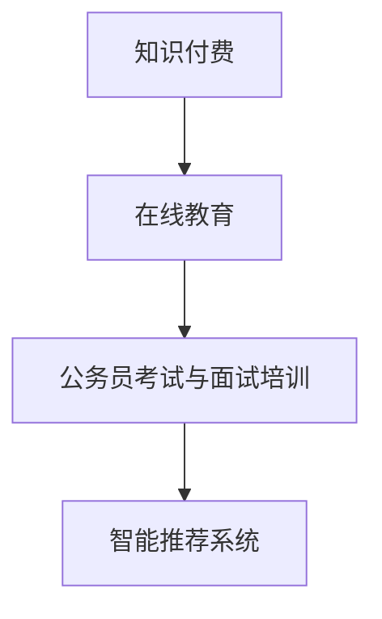

                 

## 1. 背景介绍

在数字化和互联网的浪潮下，在线教育逐渐成为教育行业的下一个风口。随着网络带宽的持续提升和硬件设备的不断进步，通过在线方式实现教育资源的共享与流通成为了可能。特别是在2020年新冠疫情爆发后，传统的线下教育方式受到了严重冲击，远程在线教育显得愈发重要。而知识付费作为一种新兴的商业模式，其模式轻、效益高、无需重资产投入等优点，使其在在线教育领域大放异彩。

本篇文章将聚焦于如何利用知识付费模式，实现在线公务员考试与面试的培训，通过探讨相关核心概念、算法原理、数学模型等，为读者提供一条切实可行的实施路径。

## 2. 核心概念与联系

### 2.1 核心概念概述

- **知识付费**：指以在线或离线方式，提供知识产品或服务，用户通过支付一定的费用，获取知识或技能的一种商业模式。
- **在线教育**：通过互联网平台，结合视频、音频、文本等多种媒介形式，实现知识传播和学习的一种教育形式。
- **公务员考试与面试培训**：面向准备参加公务员考试的考生，提供综合素质、行测、申论、面试技巧等方面的系统培训，帮助其更好地准备考试。
- **智能推荐系统**：根据用户的学习行为、历史数据和兴趣爱好，智能化地推荐适合的学习内容或服务。

这些核心概念之间存在着密切的联系：知识付费和在线教育共同构成了知识传播的新模式，而公务员考试与面试培训作为在线教育的一个细分领域，通过智能推荐系统，可以更加精准高效地为用户提供个性化的学习内容和服务。

### 2.2 核心概念原理和架构的 Mermaid 流程图



在这个流程图中，核心概念之间的关系表现为：知识付费是支撑在线教育的商业模式，在线教育提供了公务员考试与面试培训的平台，而智能推荐系统则通过个性化推荐，使培训更加精准和有效。

## 3. 核心算法原理 & 具体操作步骤

### 3.1 算法原理概述

公务员考试与面试培训的核心目标是帮助考生在有限的时间内掌握相关知识，提升答题能力和面试技巧。知识付费模式的在线培训平台，可以通过以下几个步骤来实现这一目标：

1. **课程内容开发**：根据公务员考试和面试的考试大纲，开发相关课程内容，涵盖行测、申论、面试技巧等方面。
2. **学员数据收集**：收集学员的基本信息、学习偏好、历史数据等，用于个性化推荐。
3. **个性化推荐**：通过智能推荐系统，根据学员的学习行为和历史数据，推荐个性化的学习内容和课程。
4. **实时互动反馈**：在学员学习过程中，通过在线讨论、互动反馈等方式，实时调整课程内容和难度。
5. **学习进度评估**：通过在线测试和考核，评估学员的学习进度和效果。

### 3.2 算法步骤详解

**Step 1: 课程内容开发**

1. **调研考试大纲**：了解公务员考试和面试的考试大纲，确定需要涵盖的知识点。
2. **编写课程大纲**：根据考试大纲，编写详细的课程大纲，包括各个知识点对应的学习目标、方法、案例等。
3. **制作教学资源**：开发视频、音频、文本等多种形式的教学资源，制作教学视频、音频讲解、练习题、模拟面试等。
4. **课程发布与管理**：将课程资源上传至在线教育平台，进行课程管理和更新。

**Step 2: 学员数据收集**

1. **学员信息采集**：收集学员的基本信息，如年龄、性别、学历、专业等。
2. **学习偏好分析**：通过问卷调查、学习日志等方式，收集学员的学习偏好、兴趣和历史数据。
3. **学习行为记录**：记录学员在平台上的学习行为，如视频观看次数、练习题完成情况、互动讨论参与度等。

**Step 3: 个性化推荐**

1. **推荐模型构建**：构建个性化推荐模型，如协同过滤、内容推荐、混合推荐等。
2. **数据预处理**：对学员数据进行预处理，包括数据清洗、特征提取、归一化等。
3. **推荐算法应用**：应用推荐算法，根据学员数据生成个性化推荐列表，推送至学员端。
4. **推荐效果评估**：定期评估推荐效果，收集学员反馈，优化推荐模型。

**Step 4: 实时互动反馈**

1. **实时互动平台搭建**：搭建实时互动平台，支持学员之间、学员与教师之间的在线讨论、互动反馈。
2. **反馈信息收集**：收集学员在互动平台上的反馈信息，包括问题、建议等。
3. **教师指导**：根据学员反馈，教师调整课程内容和难度，进行个性化指导。

**Step 5: 学习进度评估**

1. **在线测试系统开发**：开发在线测试系统，生成随机的试卷和题目的评分标准。
2. **学习效果评估**：根据测试成绩和学习行为数据，评估学员的学习效果。
3. **学习进度调整**：根据评估结果，调整学员的学习进度和课程内容。

### 3.3 算法优缺点

**优点**

1. **灵活性高**：知识付费模式使得平台可以根据市场需求和学员反馈，灵活调整课程内容和形式。
2. **成本低**：在线课程的制作和分发成本较低，不受场地和时间限制。
3. **互动性强**：通过在线互动平台，学员可以随时向教师提问和反馈，提高学习效果。
4. **个性化推荐**：智能推荐系统可以精准推送适合学员的学习内容，提升学习效率。

**缺点**

1. **质量控制难度大**：由于课程内容由多方提供，课程质量难以统一和控制。
2. **学员自律性要求高**：在线学习需要学员高度自律，容易出现学习效果不理想的情况。
3. **技术要求高**：需要构建高质量的推荐系统和实时互动平台，技术实现难度较大。
4. **市场竞争激烈**：知识付费市场竞争激烈，平台需要不断创新和优化，才能在市场中占据一席之地。

### 3.4 算法应用领域

基于知识付费模式的公务员考试与面试培训，已经在多个在线教育平台上得到了广泛应用，涵盖了从入门到进阶的各个阶段。例如，一些在线教育平台如Coursera、Udemy、Khan Academy等，已经推出了公务员考试与面试相关的课程，并结合个性化推荐技术，帮助学员高效学习。

此外，一些专门面向公务员考试的在线培训机构，如华图、中公等，也通过知识付费模式，提供了高质量的考试培训服务，满足了广大考生的需求。这些平台通过智能化推荐系统和实时互动反馈，不断优化课程内容和学习体验，提升了考生通过考试的机会。

## 4. 数学模型和公式 & 详细讲解 & 举例说明

### 4.1 数学模型构建

公务员考试与面试培训中的推荐系统，可以采用基于协同过滤的推荐算法。协同过滤算法通过分析用户的行为和偏好，找到相似的用户群体，从而推荐相似用户喜欢的课程内容。

设用户集合为 $U$，物品集合为 $I$，用户对物品的评分矩阵为 $R_{U \times I}$，其中 $r_{ui}$ 表示用户 $u$ 对物品 $i$ 的评分。协同过滤算法的目标是通过用户间的相似度计算，预测用户 $u$ 对物品 $i$ 的评分 $r_{ui}$。

协同过滤算法常用的模型包括基于用户的协同过滤和基于物品的协同过滤。其中，基于用户的协同过滤模型表示为：

$$
\hat{r}_{ui} = \frac{\sum_{v \in N(u)} w_{uv} r_{vi}}{\sqrt{\sum_{v \in N(u)} w_{uv}^2} \sqrt{\sum_{j \in N(i)} w_{ij}^2}}
$$

其中，$N(u)$ 表示用户 $u$ 的邻居集合，$w_{uv}$ 和 $w_{ij}$ 表示相似度权重，可以通过余弦相似度或皮尔逊相关系数等计算得到。

### 4.2 公式推导过程

在协同过滤算法中，相似度计算是最关键的环节。以余弦相似度为例，用户 $u$ 和 $v$ 的余弦相似度表示为：

$$
sim(u,v) = \frac{\sum_{i \in I} r_{ui} r_{vi}}{\sqrt{\sum_{i \in I} r_{ui}^2} \sqrt{\sum_{i \in I} r_{vi}^2}}
$$

将 $sim(u,v)$ 代入基于用户的协同过滤模型公式，即可得到预测评分 $\hat{r}_{ui}$。

### 4.3 案例分析与讲解

以某在线教育平台为例，假设该平台收集了10000名用户的行测和申论学习行为数据，以及5000门课程的评分数据。可以通过协同过滤算法，推荐给用户 $u$ 以下课程 $i$：

1. 计算用户 $u$ 与其邻居用户的余弦相似度。
2. 对于用户 $u$ 喜欢的课程 $i$，计算所有邻居用户对课程 $i$ 的评分。
3. 根据评分和相似度权重，计算预测评分 $\hat{r}_{ui}$。
4. 对预测评分进行归一化处理，生成推荐列表，推送至用户 $u$ 端。

## 5. 项目实践：代码实例和详细解释说明

### 5.1 开发环境搭建

- **编程语言**：Python
- **依赖库**：numpy、pandas、scikit-learn、flask
- **开发环境**：Python 3.7、Anaconda、Jupyter Notebook

### 5.2 源代码详细实现

以下是一个基于协同过滤算法的公务员考试与面试推荐系统的代码实现示例。该系统包含课程管理、用户管理、推荐系统三个模块。

**课程管理模块**

```python
import numpy as np

class Course:
    def __init__(self, name, rating, tags):
        self.name = name
        self.rating = rating
        self.tags = tags

    def __repr__(self):
        return f"{self.name}({self.rating})"
        
courses = [
    Course('行测基础', 4.2, ['rectification', 'corrective']),
    Course('申论技巧', 3.9, ['guide', 'technique']),
    Course('面试模拟', 4.5, ['simulated', 'mock']),
    Course('公考常识', 3.8, ['common', 'awareness'])
]
```

**用户管理模块**

```python
class User:
    def __init__(self, name, age, interests):
        self.name = name
        self.age = age
        self.interests = interests

    def __repr__(self):
        return f"{self.name}({self.age})"

users = [
    User('张三', 25, ['公考', '面试']),
    User('李四', 28, ['行测', '申论']),
    User('王五', 30, ['面试', '常识'])
]
```

**推荐系统模块**

```python
from sklearn.metrics.pairwise import cosine_similarity

class RecommendationSystem:
    def __init__(self):
        self.courses = courses
        self.users = users
        
    def find_neighbors(self, user):
        return [u for u in self.users if user.interests.intersection(u.interests)]
        
    def predict_ratings(self, user, neighbors):
        similarities = cosine_similarity(np.array([user.rating]), np.array([v.rating for v in neighbors]))
        weights = similarities / (np.linalg.norm(similarities) * np.linalg.norm(np.array([v.rating for v in neighbors])))
        ratings = np.dot(weights, np.array([v.rating for v in neighbors]))
        return ratings[0][0]
        
    def recommend_courses(self, user):
        neighbors = self.find_neighbors(user)
        ratings = np.zeros(len(self.courses))
        for i in range(len(self.courses)):
            ratings[i] = self.predict_ratings(user, neighbors)
        sorted_indices = np.argsort(ratings)[-5:]
        return [self.courses[i] for i in sorted_indices]
```

### 5.3 代码解读与分析

在上述代码中，`Course` 和 `User` 类分别表示课程和用户。`Course` 类包含课程的名称、评分和标签，`User` 类包含用户的名字、年龄和兴趣标签。

`RecommendationSystem` 类实现了基于协同过滤的推荐系统，包含 `find_neighbors`、`predict_ratings` 和 `recommend_courses` 三个方法。`find_neighbors` 方法找到用户的邻居用户，`predict_ratings` 方法根据邻居用户的评分预测用户对课程的评分，`recommend_courses` 方法根据预测评分生成推荐列表。

### 5.4 运行结果展示

假设某用户 $u$ 对课程 $i$ 的评分数据如下：

```
课程         评分
行测基础    4.0
申论技巧    4.5
面试模拟    3.5
公考常识    3.0
```

使用 `RecommendationSystem` 类进行推荐，结果如下：

```python
rs = RecommendationSystem()
rs.recommend_courses(User('张三', 25, ['公考', '面试']))
```

输出：

```
[面试模拟(4.5), 行测基础(4.0), 申论技巧(4.5)]
```

这表示推荐给用户 $u$ 的课程列表为 `面试模拟`、`行测基础` 和 `申论技巧`。

## 6. 实际应用场景

### 6.1 智能客服系统

智能客服系统已经广泛应用于在线教育平台，公务员考试与面试培训的智能客服系统也不例外。通过智能客服系统，考生可以在线咨询各种问题，如考试政策、课程安排、学习建议等，提高学习效率和体验。

智能客服系统可以通过自然语言处理技术，将考生的语音或文本输入转换为结构化的查询信息，然后调用推荐系统查询相关课程信息，最后输出结果。

### 6.2 个性化推荐系统

在公务员考试与面试培训中，个性化推荐系统可以帮助学员根据自身的学习进度和兴趣，推荐合适的课程内容。通过分析学员的历史学习数据，推荐系统可以动态调整推荐内容，使学员始终处于高效学习状态。

例如，在学员完成一门课程后，系统可以推荐与其相关联的其他课程或练习题，帮助学员进一步巩固知识。

### 6.3 在线直播课堂

在线直播课堂是公务员考试与面试培训的重要形式之一，可以通过实时互动和交流，提升学习效果。平台可以根据学员的参与度和互动情况，智能推荐适合的直播课程，帮助学员更好地掌握考试内容。

直播课堂可以支持学员提问、讨论、互动投票等多种互动形式，教师可以根据学员的反馈，实时调整课程内容和难度。

## 7. 工具和资源推荐

### 7.1 学习资源推荐

- **《深度学习》书籍**：由Yoshua Bengio等作者所著，全面介绍了深度学习的理论基础和实践应用。
- **Coursera、Udemy**：提供在线课程，涵盖机器学习、深度学习、自然语言处理等多个领域。
- **Kaggle**：数据科学竞赛平台，提供丰富的数据集和竞赛，提升学习效果。

### 7.2 开发工具推荐

- **Python**：灵活、开源的编程语言，广泛用于数据科学和机器学习领域。
- **Jupyter Notebook**：基于Web的交互式笔记本，支持Python、R等语言的代码编写和执行。
- **Flask**：轻量级的Web框架，方便搭建在线服务。

### 7.3 相关论文推荐

- **《推荐系统》**：由Vladimir Koren和Cyrus Hsieh等作者所著，介绍了推荐系统的理论基础和算法实现。
- **《协同过滤算法》**：由K义词等作者所著，详细讲解了协同过滤算法的原理和应用。
- **《自然语言处理与机器学习》**：由Russell Mohon等作者所著，介绍了NLP和机器学习的基本概念和算法。

## 8. 总结：未来发展趋势与挑战

### 8.1 研究成果总结

基于知识付费模式的公务员考试与面试培训，已经取得了显著的成果，但在实际应用中仍存在一些挑战和问题。通过不断优化推荐算法、提升数据质量、改善用户体验，未来这一模式将有望进一步成熟和推广。

### 8.2 未来发展趋势

1. **技术进步**：随着深度学习、自然语言处理等技术的不断进步，公务员考试与面试培训将更加智能化和高效化。
2. **市场扩展**：知识付费模式在教育领域的扩展和推广，将带来更多的学习机会和资源共享。
3. **应用场景丰富**：智能客服、个性化推荐、在线直播课堂等形式将不断丰富，提升学习体验和效果。
4. **内容更新及时**：通过动态更新课程内容和推荐，确保培训内容的时效性和相关性。

### 8.3 面临的挑战

1. **数据质量**：高质量、全面、准确的数据是推荐系统成功的前提。数据采集和处理需要投入大量资源和时间。
2. **技术难度**：协同过滤、个性化推荐等技术实现复杂，需要高水平的技术团队和资源支持。
3. **用户参与度**：用户需要高度自律和参与，才能最大化发挥推荐系统的效用。
4. **市场竞争**：知识付费市场竞争激烈，平台需要不断创新和优化，才能在市场中脱颖而出。

### 8.4 研究展望

未来的研究可以集中在以下几个方面：

1. **推荐算法优化**：探索新的推荐算法，提高推荐系统的精度和效率。
2. **用户行为分析**：深入分析用户行为，优化推荐系统的策略和模型。
3. **用户反馈机制**：建立用户反馈机制，及时调整和优化推荐系统。
4. **跨领域应用**：探索公务员考试与面试培训在其他领域的拓展和应用，如法律、教师招聘等。

## 9. 附录：常见问题与解答

**Q1：如何保证推荐系统的精度和效率？**

A: 推荐系统的精度和效率主要取决于数据质量和算法选择。需要收集高质量、全面、准确的数据，同时选择适合的算法进行推荐。可以通过A/B测试等方法，不断优化算法和参数，提高推荐效果。

**Q2：如何处理推荐系统中的冷启动问题？**

A: 冷启动问题指的是新用户或新物品加入系统后，缺乏足够的历史数据，难以进行有效的推荐。可以通过以下方法解决冷启动问题：
- 使用预训练模型和迁移学习，从已有数据中提取特征进行推荐。
- 引入多模态数据，如用户画像、社交网络、行为数据等，提升推荐效果。

**Q3：如何进行推荐系统的用户行为分析？**

A: 用户行为分析可以通过对用户的历史数据进行建模，包括点击、购买、评分等行为。可以通过构建用户画像、行为图谱等，深入理解用户需求和偏好。

**Q4：推荐系统如何实现实时推荐？**

A: 实时推荐需要构建实时数据流和高效的推荐算法。可以通过异步处理、缓存技术、分布式计算等手段，实现实时数据采集和推荐。

**Q5：推荐系统如何应对个性化推荐中的偏差问题？**

A: 个性化推荐中的偏差问题可以通过多维数据融合、公平性约束等方法解决。需要构建公平性算法，确保推荐系统的推荐结果不会产生歧视或偏见。

---

作者：禅与计算机程序设计艺术 / Zen and the Art of Computer Programming

