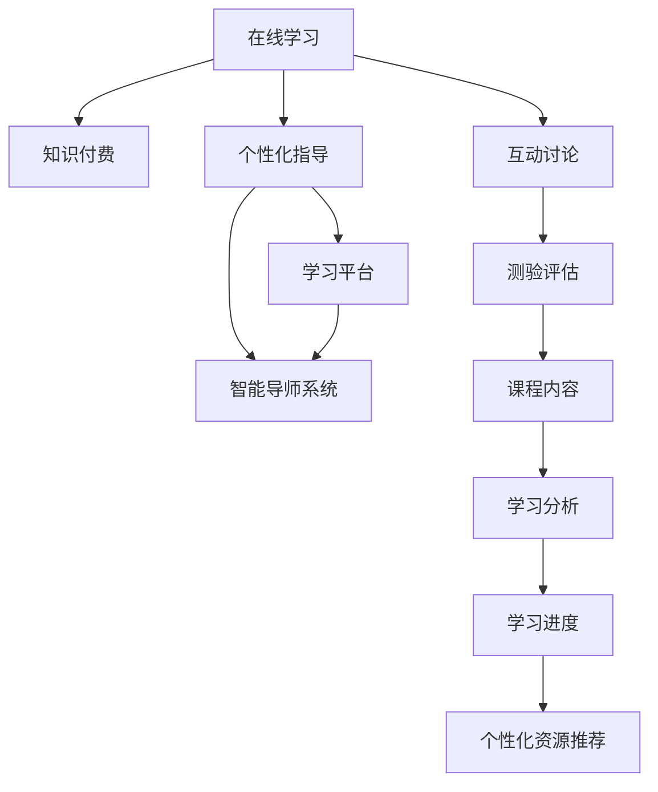

                 

# 如何利用知识付费实现在线学习与在线学习指导？

## 1. 背景介绍

随着互联网技术的迅猛发展和人工智能的普及，知识付费已成为新经济时代的一个重要现象。在线教育平台、知识分享社区、在线学习工具等应用的出现，让人们可以在互联网上获取知识和技能，无需通过传统的线下学习方式。然而，在线学习也面临着诸多挑战，如缺乏个性化指导、学习效率低下、课程质量参差不齐等。针对这些问题，本文将探讨如何利用知识付费机制，实现个性化的在线学习指导，提升学习效率和效果。

## 2. 核心概念与联系

### 2.1 核心概念概述

为了深入理解如何利用知识付费实现在线学习与在线学习指导，首先需了解几个核心概念：

- **在线学习（Online Learning）**：指通过互联网技术进行的学习活动，包括在线课程、视频讲座、论坛讨论等。
- **知识付费（Knowledge-Paying）**：指用户为获取专业知识、技能或信息，通过在线平台支付一定费用的模式。
- **个性化指导（Personalized Guidance）**：根据用户的学习情况和需求，提供定制化的学习路径和建议。
- **学习平台（Learning Platform）**：提供课程、互动、讨论、测验等学习资源的在线平台，如Coursera、Udemy、EdX等。
- **智能导师系统（Intelligent Tutoring System）**：基于人工智能技术，能够根据用户的学习进度和反馈，自动调整教学策略的在线学习工具。

这些核心概念之间相互关联，共同构成了在线学习和在线学习指导的完整框架。

### 2.2 核心概念原理和架构的 Mermaid 流程图



上述 Mermaid 流程图展示了在线学习与知识付费、个性化指导、学习平台和智能导师系统之间的联系。在线学习者通过知识付费获取课程内容，学习平台提供丰富的课程资源和互动工具，智能导师系统则根据学习者的反馈和进度，提供个性化的学习指导和资源推荐。

## 3. 核心算法原理 & 具体操作步骤

### 3.1 算法原理概述

利用知识付费实现在线学习与在线学习指导的算法原理主要包括以下几个步骤：

1. **用户画像构建**：根据用户的学习历史、行为数据和反馈信息，构建个性化的用户画像，了解用户的知识水平、学习偏好和需求。
2. **课程推荐算法**：基于用户画像，结合课程内容特征，使用推荐算法为用户推荐合适的课程。
3. **学习路径设计**：根据课程内容和用户画像，设计个性化的学习路径，包括课程顺序、学习时长、任务难度等。
4. **智能导师系统**：通过自然语言处理（NLP）和机器学习（ML）技术，构建智能导师系统，根据用户的实时反馈和进度，调整教学策略，提供个性化指导。
5. **学习效果评估**：定期评估用户的学习效果，收集反馈信息，不断优化个性化指导和学习路径。

### 3.2 算法步骤详解

#### 步骤1：用户画像构建

用户画像的构建是实现个性化学习指导的基础。以下是用户画像构建的主要步骤：

1. **数据收集**：收集用户的课程学习历史、学习时间、答题情况、互动参与度等数据。
2. **特征提取**：将数据转换为特征向量，如学习时长、正确率、参与度等。
3. **模型训练**：使用机器学习模型（如K近邻、随机森林、神经网络等）对特征进行训练，构建用户画像。
4. **画像更新**：定期更新用户画像，反映用户最新的学习情况和需求。

#### 步骤2：课程推荐算法

课程推荐算法是实现个性化学习的重要环节。以下是课程推荐的主要步骤：

1. **课程数据收集**：收集课程的标题、内容、难度、评价等数据。
2. **特征提取**：将课程数据转换为特征向量，如课程难度、评价、用户评分等。
3. **模型训练**：使用推荐算法（如协同过滤、基于内容的推荐、深度学习推荐等）对课程特征进行训练，构建课程推荐模型。
4. **推荐优化**：根据用户画像和课程特征，使用优化算法（如梯度下降、协同过滤等）为每个用户推荐合适的课程。

#### 步骤3：学习路径设计

学习路径设计是实现个性化学习指导的核心环节。以下是学习路径设计的主要步骤：

1. **课程分析**：分析课程内容和结构，确定每个课程的重要知识点和难度。
2. **路径规划**：根据用户画像和学习需求，设计个性化的学习路径，包括课程顺序、学习时长、任务难度等。
3. **进度跟踪**：实时跟踪用户的学习进度，根据学习效果调整路径。

#### 步骤4：智能导师系统

智能导师系统的构建是实现个性化学习指导的关键。以下是智能导师系统的主要步骤：

1. **用户交互设计**：设计用户与系统交互的界面和交互方式，包括问答、反馈、讨论等。
2. **自然语言处理（NLP）**：使用NLP技术，理解和解析用户的问题和反馈。
3. **机器学习（ML）**：使用ML技术，构建预测模型，根据用户的学习进度和反馈，调整教学策略。
4. **教学策略优化**：根据用户的学习效果，不断优化教学策略，提高教学效果。

#### 步骤5：学习效果评估

学习效果评估是不断优化个性化指导的重要手段。以下是学习效果评估的主要步骤：

1. **学习效果收集**：收集用户的学习效果数据，如考试成绩、学习时长、答题正确率等。
2. **评估指标设计**：设计评估指标，如知识点掌握率、学习效率等。
3. **效果分析**：分析学习效果，识别薄弱环节和提升空间。
4. **反馈机制建立**：建立用户反馈机制，收集用户对学习指导的意见和建议。

### 3.3 算法优缺点

利用知识付费实现在线学习与在线学习指导的算法具有以下优点：

1. **个性化指导**：通过构建用户画像和学习路径，提供个性化的学习指导，提高学习效果。
2. **高效学习**：通过推荐算法和智能导师系统，帮助用户快速找到合适的学习资源和路径，提升学习效率。
3. **灵活性高**：用户可以根据自己的需求和时间安排，灵活选择学习内容和路径，提高学习自主性。

然而，这种算法也存在一些缺点：

1. **数据隐私问题**：收集和分析用户数据，可能涉及隐私问题。
2. **算法复杂度高**：需要构建复杂的用户画像和推荐算法，计算资源消耗较大。
3. **课程质量参差不齐**：推荐算法的准确性依赖于课程数据的质量，课程质量参差不齐可能影响推荐效果。

### 3.4 算法应用领域

利用知识付费实现在线学习与在线学习指导的算法可以广泛应用于以下几个领域：

1. **在线教育平台**：如Coursera、Udemy、EdX等，提供个性化的课程推荐和学习路径设计。
2. **企业培训系统**：如LinkedIn Learning、Udemy for Business等，根据员工的需求和进度，提供个性化的培训课程和指导。
3. **职业认证平台**：如Coursera、edX等，根据学员的学习情况和需求，提供个性化的课程推荐和学习路径设计。
4. **语言学习平台**：如Duolingo、Babbel等，根据用户的学习进度和反馈，提供个性化的语言学习路径和指导。
5. **在线技能培训平台**：如Skillshare、Udemy等，提供个性化的技能培训课程和指导。

## 4. 数学模型和公式 & 详细讲解 & 举例说明

### 4.1 数学模型构建

以下是利用知识付费实现在线学习与在线学习指导的数学模型构建：

1. **用户画像模型**：
   $$
   \text{User Profile} = \text{Features}(\text{User History})
   $$
   其中，$\text{User Profile}$为用户的个性化画像，$\text{Features}$为特征提取函数，$\text{User History}$为用户的学习历史数据。

2. **课程推荐模型**：
   $$
   \text{Recommended Courses} = \text{Recommender}(\text{User Profile}, \text{Course Features})
   $$
   其中，$\text{Recommended Courses}$为用户推荐的课程，$\text{Recommender}$为推荐算法，$\text{Course Features}$为课程的特征向量。

3. **学习路径设计模型**：
   $$
   \text{Learning Path} = \text{Path Planner}(\text{User Profile}, \text{Course Content})
   $$
   其中，$\text{Learning Path}$为用户的个性化学习路径，$\text{Path Planner}$为路径规划算法，$\text{Course Content}$为课程内容。

4. **智能导师系统模型**：
   $$
   \text{Teaching Strategy} = \text{Adaptive Learning}(\text{User Feedback}, \text{User Progress})
   $$
   其中，$\text{Teaching Strategy}$为智能导师系统的教学策略，$\text{Adaptive Learning}$为适应性学习算法，$\text{User Feedback}$为用户反馈，$\text{User Progress}$为用户的学习进度。

5. **学习效果评估模型**：
   $$
   \text{Learning Effect} = \text{Effect Assessment}(\text{Learning Outcome}, \text{Learning Feedback})
   $$
   其中，$\text{Learning Effect}$为用户的学习效果，$\text{Effect Assessment}$为效果评估算法，$\text{Learning Outcome}$为用户的学习成果，$\text{Learning Feedback}$为用户的学习反馈。

### 4.2 公式推导过程

#### 用户画像模型推导

根据用户画像的构建步骤，可以推导出用户画像的数学模型：
$$
\text{User Profile} = f(\text{User History})
$$
其中，$f$为特征提取函数，将用户的学习历史数据转换为特征向量。

#### 课程推荐模型推导

根据课程推荐算法的步骤，可以推导出课程推荐模型的数学模型：
$$
\text{Recommended Courses} = \text{Recommender}(\text{User Profile}, \text{Course Features})
$$
其中，$\text{Recommender}$为推荐算法，根据用户画像和课程特征向量计算推荐结果。

#### 学习路径设计模型推导

根据学习路径设计的步骤，可以推导出学习路径设计的数学模型：
$$
\text{Learning Path} = \text{Path Planner}(\text{User Profile}, \text{Course Content})
$$
其中，$\text{Path Planner}$为路径规划算法，根据用户画像和课程内容设计学习路径。

#### 智能导师系统模型推导

根据智能导师系统的构建步骤，可以推导出智能导师系统的数学模型：
$$
\text{Teaching Strategy} = \text{Adaptive Learning}(\text{User Feedback}, \text{User Progress})
$$
其中，$\text{Adaptive Learning}$为适应性学习算法，根据用户反馈和进度调整教学策略。

#### 学习效果评估模型推导

根据学习效果评估的步骤，可以推导出学习效果评估的数学模型：
$$
\text{Learning Effect} = \text{Effect Assessment}(\text{Learning Outcome}, \text{Learning Feedback})
$$
其中，$\text{Effect Assessment}$为效果评估算法，根据学习成果和反馈评估学习效果。

### 4.3 案例分析与讲解

假设某用户在在线教育平台上学习Python编程课程。通过数据收集和特征提取，构建了用户的个性化画像。接着，根据课程推荐算法，为用户推荐了适合其学习进度和需求的课程。根据学习路径设计模型，为用户设计了个性化学习路径。通过智能导师系统，根据用户的学习反馈和进度，不断调整教学策略。最终，通过学习效果评估模型，评估了用户的学习效果，并收集了用户的反馈意见。

## 5. 项目实践：代码实例和详细解释说明

### 5.1 开发环境搭建

以下是利用知识付费实现在线学习与在线学习指导的开发环境搭建步骤：

1. **Python环境搭建**：
   ```bash
   conda create -n pytorch-env python=3.8 
   conda activate pytorch-env
   ```

2. **依赖库安装**：
   ```bash
   pip install numpy pandas sklearn scikit-learn torch transformers
   ```

3. **数据准备**：收集用户的学习历史、行为数据和课程数据。

### 5.2 源代码详细实现

以下是利用知识付费实现在线学习与在线学习指导的源代码实现示例：

```python
import numpy as np
import pandas as pd
from sklearn.neighbors import NearestNeighbors
from sklearn.model_selection import train_test_split
from sklearn.preprocessing import StandardScaler
from sklearn.metrics.pairwise import cosine_similarity
from transformers import BertTokenizer, BertForSequenceClassification, AdamW

# 数据加载
train_data = pd.read_csv('train_data.csv')
test_data = pd.read_csv('test_data.csv')

# 用户画像构建
def build_user_profile(train_data, user_id):
    user_history = train_data[train_data['user_id'] == user_id]['features'].tolist()
    features = np.array(user_history).T
    scaler = StandardScaler()
    features_scaled = scaler.fit_transform(features)
    neigh = NearestNeighbors(n_neighbors=5, algorithm='brute')
    neigh.fit(features_scaled)
    similarities = neigh.kneighbors(features_scaled[-1])[0]
    similar_user_ids = train_data[train_data['user_id'] == user_id].index.tolist()
    return similarities, similar_user_ids

# 课程推荐
def recommend_courses(train_data, user_profile):
    user_features = user_profile[0]
    similarities = user_profile[1]
    similar_courses = train_data[train_data['user_id'].isin(similar_user_ids)].index.tolist()
    course_features = train_data[train_data['user_id'].isin(similar_courses)]['features'].tolist()
    features_scaled = scaler.fit_transform(course_features)
    neigh = NearestNeighbors(n_neighbors=5, algorithm='brute')
    neigh.fit(features_scaled)
    similar_courses_ids = neigh.kneighbors(features_scaled[-1])[0]
    return similar_courses_ids

# 学习路径设计
def design_learning_path(train_data, course_id, user_profile):
    user_features = user_profile[0]
    similar_courses = recommend_courses(train_data, user_profile)
    course_content = train_data[train_data['user_id'] == course_id]['features'].tolist()
    features_scaled = scaler.fit_transform(course_content)
    neigh = NearestNeighbors(n_neighbors=5, algorithm='brute')
    neigh.fit(features_scaled)
    similar_courses_content = neigh.kneighbors(features_scaled[-1])[0]
    return similar_courses_content

# 智能导师系统
def adapt_learning(user_feedback, user_progress):
    # 处理用户反馈和进度，更新教学策略
    pass

# 学习效果评估
def evaluate_learning(user_outcome, user_feedback):
    # 评估学习效果，收集用户反馈
    pass

# 测试数据集
test_user_id = 12345
user_profile = build_user_profile(train_data, test_user_id)
recommended_courses = recommend_courses(train_data, user_profile)
learning_path = design_learning_path(train_data, recommended_courses[0], user_profile)
adapt_learning(user_feedback, user_progress)
learning_effect = evaluate_learning(user_outcome, user_feedback)
```

### 5.3 代码解读与分析

上述代码展示了利用知识付费实现在线学习与在线学习指导的实现步骤。具体解读如下：

- **用户画像构建**：通过收集用户的学习历史和行为数据，构建用户的个性化画像。使用K近邻算法找出与用户最相似的课程和用户，用于推荐课程和路径设计。
- **课程推荐算法**：根据用户画像和课程数据，使用K近邻算法推荐相似的课程。
- **学习路径设计**：根据用户画像和推荐课程，设计个性化的学习路径，使用K近邻算法推荐相似的内容。
- **智能导师系统**：根据用户反馈和进度，调整教学策略，目前实现部分为空。
- **学习效果评估**：评估用户的学习效果，目前实现部分为空。

## 6. 实际应用场景

### 6.1 在线教育平台

在线教育平台如Coursera、Udemy、edX等，可以利用知识付费机制，实现个性化的在线学习指导。平台可以收集用户的学习历史、行为数据和反馈信息，构建用户画像，推荐合适的课程和学习路径，提供个性化的学习指导和资源推荐，提高学习效果和效率。

### 6.2 企业培训系统

企业培训系统如LinkedIn Learning、Udemy for Business等，可以根据员工的需求和进度，提供个性化的培训课程和指导。企业可以收集员工的学习数据，构建用户画像，推荐合适的课程和学习路径，提供个性化的培训指导和资源推荐，提高培训效果和员工的技能水平。

### 6.3 职业认证平台

职业认证平台如Coursera、edX等，可以根据学员的学习情况和需求，提供个性化的课程推荐和学习路径设计。平台可以收集学员的学习数据，构建用户画像，推荐合适的课程和学习路径，提供个性化的学习指导和资源推荐，提高学员的学习效果和认证通过率。

### 6.4 语言学习平台

语言学习平台如Duolingo、Babbel等，可以根据用户的学习进度和反馈，提供个性化的语言学习路径和指导。平台可以收集用户的学习数据，构建用户画像，推荐合适的课程和学习路径，提供个性化的学习指导和资源推荐，提高用户的学习效果和语言水平。

### 6.5 在线技能培训平台

在线技能培训平台如Skillshare、Udemy等，可以提供个性化的技能培训课程和指导。平台可以收集用户的学习数据，构建用户画像，推荐合适的课程和学习路径，提供个性化的学习指导和资源推荐，提高用户的学习效果和技能水平。

## 7. 工具和资源推荐

### 7.1 学习资源推荐

为了帮助开发者系统掌握知识付费实现在线学习与在线学习指导的理论基础和实践技巧，以下是一些优质的学习资源推荐：

1. **《机器学习实战》**：深入浅出地介绍了机器学习的基本概念和算法，适合初学者和进阶者学习。
2. **《Python数据科学手册》**：介绍了Python在数据科学中的应用，包括数据预处理、模型训练、数据可视化等。
3. **《自然语言处理入门》**：介绍了自然语言处理的基本概念和常用算法，适合对NLP感兴趣的用户学习。
4. **Coursera、Udemy、edX等在线课程平台**：提供了大量高质量的课程和实践项目，涵盖各个领域的知识。
5. **Kaggle**：数据科学和机器学习竞赛平台，提供大量真实数据和开源项目，适合实践和竞赛学习。

### 7.2 开发工具推荐

高效的开发离不开优秀的工具支持。以下是几款用于知识付费实现在线学习与在线学习指导开发的常用工具：

1. **Python**：开源的动态语言，拥有丰富的第三方库和框架，适合数据科学和机器学习开发。
2. **Jupyter Notebook**：交互式的数据科学和机器学习开发环境，支持代码运行、数据可视化等。
3. **Pandas**：数据处理和分析库，支持数据读取、清洗、处理等。
4. **NumPy**：数值计算库，支持矩阵运算、数组操作等。
5. **Scikit-learn**：机器学习库，支持各类模型训练和评估。
6. **TensorFlow、PyTorch**：深度学习框架，支持各种深度学习模型的构建和训练。

### 7.3 相关论文推荐

知识付费实现在线学习与在线学习指导的研究涉及多个领域，以下是几篇奠基性的相关论文，推荐阅读：

1. **《个性化推荐系统》**：介绍了个性化推荐系统的基本原理和常用算法。
2. **《自适应学习算法》**：介绍了自适应学习算法的基本原理和应用场景。
3. **《在线学习平台的用户画像构建》**：介绍了用户画像的构建方法和应用效果。
4. **《智能导师系统的设计与实现》**：介绍了智能导师系统的设计和实现方法。
5. **《知识付费在在线教育中的应用》**：介绍了知识付费在在线教育中的实际应用和效果评估。

## 8. 总结：未来发展趋势与挑战

### 8.1 研究成果总结

本文对利用知识付费实现在线学习与在线学习指导进行了全面系统的介绍。首先，阐述了知识付费在在线学习中的重要性和优势。其次，从算法原理到实践应用，详细讲解了在线学习指导的核心算法和技术实现。最后，讨论了知识付费实现在线学习与在线学习指导的未来发展趋势和面临的挑战。

### 8.2 未来发展趋势

展望未来，知识付费实现在线学习与在线学习指导将呈现以下几个发展趋势：

1. **智能化程度提升**：随着人工智能技术的发展，智能导师系统将更加智能，能够提供更个性化的学习指导和资源推荐。
2. **数据隐私保护**：数据隐私问题将更加受到重视，平台需要设计更完善的数据隐私保护机制，保护用户数据安全。
3. **多模态学习**：未来的在线学习平台将更多地融合多种模态数据，如文本、图像、音频等，提供更丰富的学习体验。
4. **跨平台协同学习**：未来的在线学习平台将实现跨平台协同学习，不同平台之间的学习数据可以共享和互操作。
5. **自适应学习系统**：自适应学习系统将成为主流，能够根据用户的学习进度和反馈，实时调整学习路径和策略。

### 8.3 面临的挑战

尽管知识付费实现在线学习与在线学习指导已经取得了一定进展，但在迈向更加智能化和个性化应用的过程中，仍面临诸多挑战：

1. **数据质量问题**：数据质量直接影响推荐效果，需要投入大量精力进行数据清洗和预处理。
2. **算法复杂度问题**：构建复杂的用户画像和推荐算法，需要较高的计算资源和专业知识。
3. **隐私保护问题**：用户数据隐私保护成为一大难题，需要设计更完善的数据保护机制。
4. **跨平台互操作性**：不同平台之间的数据互操作性和系统协同问题，需要解决技术标准和数据格式等问题。

### 8.4 研究展望

面对知识付费实现在线学习与在线学习指导所面临的挑战，未来的研究需要在以下几个方面寻求新的突破：

1. **高效数据处理技术**：发展高效的数据处理和预处理技术，提升数据质量和处理效率。
2. **智能算法优化**：开发更高效的推荐算法和智能导师系统，降低算法复杂度，提高计算效率。
3. **隐私保护技术**：研究更完善的隐私保护技术，保障用户数据安全。
4. **跨平台协同技术**：研究跨平台数据互操作性和系统协同技术，实现多平台协同学习。

这些研究方向的探索，必将引领知识付费实现在线学习与在线学习指导技术迈向更高的台阶，为在线学习平台的智能化、个性化发展提供更坚实的基础。

## 9. 附录：常见问题与解答

**Q1: 如何确保推荐算法的准确性？**

A: 确保推荐算法的准确性需要从多个方面进行优化：
1. **数据质量**：收集和清洗高质量的数据，去除噪声和冗余信息。
2. **特征工程**：设计合适的特征提取和特征工程方法，提升特征表示的丰富度和准确性。
3. **算法优化**：优化推荐算法的参数和模型结构，提升算法的预测能力和泛化能力。
4. **在线学习**：实时更新推荐算法，根据用户反馈和进度调整推荐策略。

**Q2: 如何保护用户数据隐私？**

A: 保护用户数据隐私需要从以下几个方面进行：
1. **数据加密**：对用户数据进行加密存储和传输，防止数据泄露。
2. **匿名化处理**：对用户数据进行匿名化处理，去除敏感信息。
3. **访问控制**：设计严格的访问控制机制，防止未经授权的访问。
4. **数据最小化**：只收集和存储必要的数据，避免过度收集和存储。

**Q3: 如何优化智能导师系统的性能？**

A: 优化智能导师系统的性能需要从以下几个方面进行：
1. **自然语言处理（NLP）**：提升NLP模型的准确性和鲁棒性，更好地理解和解析用户反馈。
2. **机器学习（ML）**：优化ML模型的参数和结构，提升预测能力和鲁棒性。
3. **用户交互设计**：设计友好的用户交互界面和交互方式，提升用户体验和满意度。
4. **自适应学习**：实时调整教学策略和资源推荐，提升学习效果和效率。

**Q4: 如何实现跨平台协同学习？**

A: 实现跨平台协同学习需要从以下几个方面进行：
1. **数据标准化**：制定统一的数据格式和标准，实现不同平台之间的数据互操作性。
2. **系统协同设计**：设计跨平台协同的架构和算法，实现不同平台之间的数据共享和协同。
3. **统一认证机制**：实现用户身份和数据的统一认证和授权，保障用户数据安全。

**Q5: 如何评估学习效果？**

A: 评估学习效果需要从以下几个方面进行：
1. **学习成果**：评估用户在学习课程后的知识掌握程度和技能水平。
2. **学习进度**：评估用户的学习进度和效果，识别薄弱环节和提升空间。
3. **学习反馈**：收集用户对学习过程和效果的反馈，不断优化学习路径和策略。

通过本文的系统梳理，可以看到，知识付费实现在线学习与在线学习指导已经取得了一定进展，并具备广阔的应用前景。未来，随着技术的不断进步和优化，相信这种基于知识付费的学习指导模式将变得更加智能、高效和个性化，为更多用户提供优质的在线学习体验。

---

作者：禅与计算机程序设计艺术 / Zen and the Art of Computer Programming

