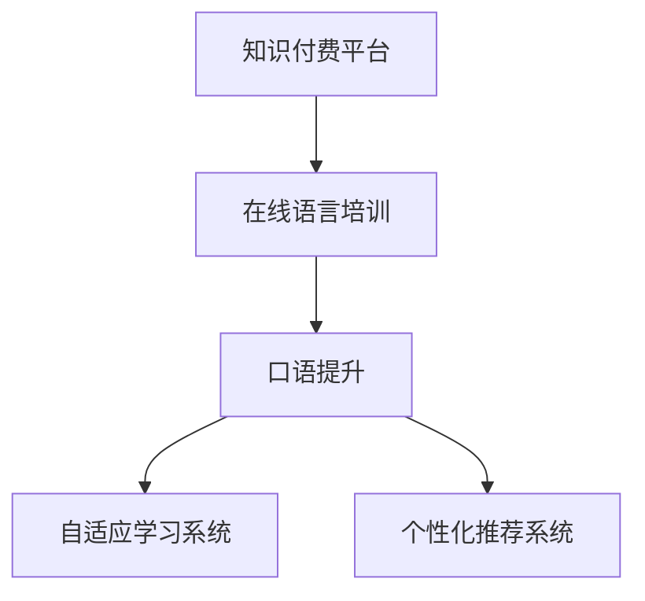

                 

# 如何利用知识付费实现在线语言培训与口语提升？

随着科技的进步和互联网的普及，知识付费已成为快速学习和提升个人能力的重要方式。特别是在语言培训与口语提升领域，知识付费平台以其独特优势，为全球语言学习者提供了一站式解决方案。本文将详细探讨如何利用知识付费实现在线语言培训与口语提升，并从背景介绍、核心概念、算法原理、项目实践、实际应用场景、工具和资源推荐、总结等方面进行深入分析。

## 1. 背景介绍

### 1.1 问题由来

全球化进程的加快使得语言技能成为国际人才竞争中的重要砝码。然而，语言学习的传统方式往往效率低下、成本高昂，难以满足学习者个性化需求。知识付费平台的兴起，通过互联网将优质教育资源重新分配，实现了高效、便捷、个性化的语言培训与口语提升。

### 1.2 问题核心关键点

知识付费语言培训与口语提升的核心在于如何借助互联网技术，整合优质教学资源，提供满足学习者需求的个性化学习体验。主要包括以下几个方面：
- **个性化学习路径**：根据学习者的语言基础、兴趣和目标，定制个性化学习计划。
- **沉浸式学习体验**：提供丰富的多媒体资源，如音频、视频、文本，实现语言学习的沉浸感。
- **实时互动反馈**：通过在线互动，实现及时、精准的反馈，提升学习效率。
- **自适应学习系统**：根据学习者的表现，动态调整学习内容和难度，保障学习效果。

### 1.3 问题研究意义

知识付费语言培训与口语提升不仅可以帮助学习者高效学习语言，提升口语能力，还可以促进语言交流，增强文化认同。通过在线平台，可以跨越地理、时间、成本的限制，使得全球各地的学习者都能享受到优质的语言学习资源，实现语言技能的快速提升。

## 2. 核心概念与联系

### 2.1 核心概念概述

为更好地理解知识付费平台语言培训与口语提升的核心技术，本节将介绍几个关键概念：

- **知识付费**：通过互联网平台，以付费形式提供优质知识内容，满足学习者的个性化学习需求。
- **在线语言培训**：通过网络平台，提供语言学习相关的视频、音频、文本等多媒体内容，满足学习者的语言学习需求。
- **口语提升**：通过在线互动和反馈，提升学习者的口语表达能力和听力理解能力。
- **自适应学习系统**：根据学习者的表现，动态调整学习内容和难度，确保学习效果。
- **个性化推荐系统**：通过分析学习者的行为和偏好，推荐适合的学习内容和资源。

这些核心概念共同构成了知识付费语言培训与口语提升的基石，为实现高效、便捷、个性化的学习体验提供了理论基础。

### 2.2 核心概念原理和架构的 Mermaid 流程图



这个流程图展示了知识付费平台语言培训与口语提升的核心架构：

1. **知识付费平台**：提供优质教育资源，实现高效知识传播。
2. **在线语言培训**：通过多媒体资源，提供沉浸式语言学习体验。
3. **口语提升**：通过实时互动和反馈，提升学习者的口语表达和听力理解能力。
4. **自适应学习系统**：动态调整学习内容和难度，确保学习效果。
5. **个性化推荐系统**：根据学习者的行为和偏好，推荐适合的学习内容和资源。

## 3. 核心算法原理 & 具体操作步骤

### 3.1 算法原理概述

知识付费语言培训与口语提升的核心算法原理基于自适应学习系统和大数据推荐技术。通过分析学习者的行为数据和反馈，动态调整学习路径和内容，同时基于推荐算法，个性化推荐学习资源，实现高效、个性化的语言学习体验。

具体而言，算法主要分为以下几个步骤：
1. **用户建模**：收集和分析学习者的行为数据，如学习时间、进度、测试结果等，构建用户画像。
2. **课程推荐**：根据用户画像，使用协同过滤、基于内容的推荐等算法，推荐适合的学习资源。
3. **学习进度调整**：根据学习者的表现，动态调整学习内容和难度，确保学习效果。
4. **口语互动反馈**：通过语音识别和自然语言处理技术，提供实时互动和反馈，提升学习者的口语表达和听力理解能力。

### 3.2 算法步骤详解

#### 3.2.1 用户建模

用户建模是实现个性化推荐的基础。主要包括以下步骤：

1. **数据收集**：收集学习者的基本信息，如年龄、性别、语言基础等；同时收集学习行为数据，如学习时间、完成度、测试成绩等。
2. **特征提取**：从收集的数据中提取关键特征，如学习时间、进度、错误类型等，构建用户特征向量。
3. **用户画像**：根据用户特征向量，构建用户画像，用于后续的推荐和调整。

#### 3.2.2 课程推荐

课程推荐是实现个性化学习路径的关键。主要包括以下步骤：

1. **数据预处理**：将学习资源（如视频、音频、文本等）转换为机器可处理的数据格式。
2. **特征提取**：从预处理后的数据中提取关键特征，如主题、难度、长度等，构建资源特征向量。
3. **推荐算法**：使用协同过滤、基于内容的推荐等算法，计算用户与资源的相似度，推荐适合的学习资源。

#### 3.2.3 学习进度调整

学习进度调整是确保学习效果的保障。主要包括以下步骤：

1. **学习效果评估**：通过测试和反馈，评估学习者的学习效果。
2. **学习内容调整**：根据学习者的表现，动态调整学习内容和难度，如增加难度较大的题目或加强薄弱环节。
3. **学习路径优化**：根据学习进度和效果，优化学习路径，确保学习效率和效果。

#### 3.2.4 口语互动反馈

口语互动反馈是提升学习者口语能力的有效手段。主要包括以下步骤：

1. **语音识别**：使用语音识别技术，将学习者的口语表达转换为文本。
2. **自然语言处理**：使用自然语言处理技术，分析文本内容，识别错误和改进点。
3. **实时反馈**：根据分析结果，提供实时反馈和建议，帮助学习者提升口语表达能力。

### 3.3 算法优缺点

知识付费语言培训与口语提升的算法主要具有以下优点：

1. **高效个性化**：基于用户画像和行为数据，实现高效个性化学习路径和内容推荐。
2. **实时互动**：通过语音识别和自然语言处理技术，提供实时互动和反馈，提升学习效果。
3. **自适应调整**：动态调整学习内容和难度，确保学习效果。
4. **泛化性强**：算法可以应用于多种语言学习场景，实现多语种支持。

同时，该算法也存在一定的局限性：

1. **数据依赖**：算法效果很大程度上依赖于用户数据的丰富性和准确性。
2. **计算成本高**：用户画像和推荐算法需要大量计算资源，特别是在大规模用户的情况下。
3. **隐私保护**：用户数据的收集和处理需要考虑隐私保护，避免数据泄露。

### 3.4 算法应用领域

知识付费语言培训与口语提升的算法在以下几个领域得到广泛应用：

1. **在线教育平台**：如Coursera、Udemy等，通过知识付费模式，提供优质语言学习资源。
2. **语言培训机构**：如Duolingo、Babbel等，通过在线平台，提供个性化语言培训服务。
3. **企业培训**：如Tandem、Italki等，通过企业付费，为员工提供语言培训和口语提升服务。
4. **个人学习**：如BabelUp、TalkEnglish等，通过个人付费，实现自我提升和职业发展。

## 4. 数学模型和公式 & 详细讲解 & 举例说明

### 4.1 数学模型构建

知识付费语言培训与口语提升的数学模型主要基于推荐系统和大数据技术。以下将从用户建模和课程推荐两个方面进行详细讲解。

#### 4.1.1 用户建模

用户建模的数学模型主要基于协同过滤和内容推荐算法。假设用户集合为 $U$，物品（即学习资源）集合为 $I$，用户和物品之间的评分矩阵为 $R$，用户特征向量为 $\mathbf{u}_u$，物品特征向量为 $\mathbf{v}_i$。

用户特征向量和物品特征向量可以通过用户画像和资源特征提取得到。假设用户特征向量的维度为 $d$，则用户特征向量 $\mathbf{u}_u$ 可以表示为：

$$
\mathbf{u}_u = [u_1, u_2, ..., u_d]
$$

物品特征向量 $\mathbf{v}_i$ 可以表示为：

$$
\mathbf{v}_i = [v_1, v_2, ..., v_d]
$$

用户和物品之间的评分矩阵 $R$ 可以表示为：

$$
R = \begin{bmatrix}
r_{1,1} & r_{1,2} & ... & r_{1,n} \\
r_{2,1} & r_{2,2} & ... & r_{2,n} \\
... & ... & ... & ... \\
r_{m,1} & r_{m,2} & ... & r_{m,n}
\end{bmatrix}
$$

其中 $r_{i,j}$ 表示用户 $i$ 对物品 $j$ 的评分。

用户特征向量和物品特征向量可以通过用户画像和资源特征提取得到。假设用户特征向量的维度为 $d$，则用户特征向量 $\mathbf{u}_u$ 可以表示为：

$$
\mathbf{u}_u = [u_1, u_2, ..., u_d]
$$

物品特征向量 $\mathbf{v}_i$ 可以表示为：

$$
\mathbf{v}_i = [v_1, v_2, ..., v_d]
$$

用户和物品之间的评分矩阵 $R$ 可以表示为：

$$
R = \begin{bmatrix}
r_{1,1} & r_{1,2} & ... & r_{1,n} \\
r_{2,1} & r_{2,2} & ... & r_{2,n} \\
... & ... & ... & ... \\
r_{m,1} & r_{m,2} & ... & r_{m,n}
\end{bmatrix}
$$

其中 $r_{i,j}$ 表示用户 $i$ 对物品 $j$ 的评分。

#### 4.1.2 课程推荐

课程推荐的数学模型主要基于协同过滤和基于内容的推荐算法。协同过滤算法基于用户和物品之间的评分矩阵 $R$，通过计算用户和物品之间的相似度，实现推荐。基于内容的推荐算法则通过分析学习资源的特征，实现推荐。

协同过滤算法的基本思路是找到与目标用户最相似的 $k$ 个用户，根据这些用户对物品的评分，预测目标用户对物品的评分。假设目标用户为 $u$，相似度为 $\theta$，物品为 $i$，则协同过滤的推荐公式为：

$$
\hat{r}_{u,i} = \sum_{v \in N(u)} \frac{r_{v,i}}{||\mathbf{u}_u - \mathbf{u}_v||_2}
$$

其中 $N(u)$ 表示与用户 $u$ 相似的用户集合，$||\cdot||_2$ 表示欧式距离。

基于内容的推荐算法则通过分析学习资源的特征，实现推荐。假设物品特征向量为 $\mathbf{v}_i$，则基于内容的推荐公式为：

$$
\hat{r}_{u,i} = \sum_{j=1}^d \alpha_j \mathbf{v}_i \cdot \mathbf{u}_u
$$

其中 $\alpha_j$ 为特征权重，$\mathbf{v}_i \cdot \mathbf{u}_u$ 表示物品特征向量和用户特征向量的点积。

### 4.2 公式推导过程

#### 4.2.1 用户建模

用户建模的公式推导主要基于协同过滤和内容推荐算法。假设用户特征向量为 $\mathbf{u}_u$，物品特征向量为 $\mathbf{v}_i$，用户和物品之间的评分矩阵为 $R$，则用户画像可以表示为：

$$
\mathbf{u}_u = \sum_{i=1}^N \frac{r_{u,i}}{\sqrt{N} ||\mathbf{v}_i||_2}
$$

其中 $r_{u,i}$ 表示用户 $u$ 对物品 $i$ 的评分，$||\cdot||_2$ 表示欧式距离。

#### 4.2.2 课程推荐

课程推荐的公式推导主要基于协同过滤和基于内容的推荐算法。假设用户特征向量为 $\mathbf{u}_u$，物品特征向量为 $\mathbf{v}_i$，用户和物品之间的评分矩阵为 $R$，则协同过滤的推荐公式为：

$$
\hat{r}_{u,i} = \sum_{v \in N(u)} \frac{r_{v,i}}{||\mathbf{u}_u - \mathbf{u}_v||_2}
$$

基于内容的推荐公式为：

$$
\hat{r}_{u,i} = \sum_{j=1}^d \alpha_j \mathbf{v}_i \cdot \mathbf{u}_u
$$

其中 $\alpha_j$ 为特征权重，$\mathbf{v}_i \cdot \mathbf{u}_u$ 表示物品特征向量和用户特征向量的点积。

### 4.3 案例分析与讲解

假设我们有一个语言学习平台，收集了用户的基本信息和学习行为数据，可以使用协同过滤算法和基于内容的推荐算法进行课程推荐。

具体步骤如下：

1. **数据收集**：收集用户基本信息，如年龄、性别、语言基础等；同时收集学习行为数据，如学习时间、完成度、测试成绩等。
2. **数据预处理**：将收集的数据进行预处理，如去噪、归一化等。
3. **特征提取**：从预处理后的数据中提取关键特征，如学习时间、进度、错误类型等，构建用户特征向量。
4. **协同过滤**：基于用户和物品之间的评分矩阵 $R$，计算用户和物品之间的相似度，推荐适合的学习资源。
5. **基于内容**：分析学习资源的特征，使用基于内容的推荐算法，推荐适合的学习资源。

## 5. 项目实践：代码实例和详细解释说明

### 5.1 开发环境搭建

要进行知识付费语言培训与口语提升的开发，需要先搭建好开发环境。以下是使用Python进行开发的环境配置流程：

1. **安装Python**：确保开发环境中有Python 3.6或以上版本。
2. **安装Pip**：在命令行中运行 `python -m pip install pip` 安装Pip。
3. **安装TensorFlow**：在命令行中运行 `pip install tensorflow` 安装TensorFlow。
4. **安装Keras**：在命令行中运行 `pip install keras` 安装Keras。
5. **安装Flask**：在命令行中运行 `pip install flask` 安装Flask。
6. **安装Jupyter Notebook**：在命令行中运行 `pip install jupyter notebook` 安装Jupyter Notebook。

### 5.2 源代码详细实现

以下是使用Python和TensorFlow实现知识付费语言培训与口语提升的示例代码。

```python
import tensorflow as tf
from tensorflow.keras.layers import Input, Embedding, LSTM, Dense, Dropout
from tensorflow.keras.models import Model
from tensorflow.keras.optimizers import Adam

# 定义模型架构
input_layer = Input(shape=(max_length,), dtype='int32')
embedding_layer = Embedding(vocab_size, embedding_dim)(input_layer)
lstm_layer = LSTM(128)(embedding_layer)
dropout_layer = Dropout(0.5)(lstm_layer)
output_layer = Dense(num_classes, activation='softmax')(dropout_layer)
model = Model(input_layer, output_layer)

# 编译模型
model.compile(optimizer=Adam(learning_rate=0.001), loss='categorical_crossentropy', metrics=['accuracy'])

# 训练模型
model.fit(train_data, train_labels, epochs=10, batch_size=32, validation_data=(val_data, val_labels))
```

以上代码实现了基于LSTM的语言培训模型，具体步骤如下：

1. **定义模型架构**：首先定义输入层、嵌入层、LSTM层、dropout层和输出层，构成完整的模型架构。
2. **编译模型**：使用Adam优化器和分类交叉熵损失函数，编译模型。
3. **训练模型**：使用训练数据和标签进行模型训练，指定训练轮数和批次大小，并在验证集上进行评估。

### 5.3 代码解读与分析

以下是代码中关键部分的详细解释：

1. **输入层定义**：使用 `Input` 层定义输入层的形状和数据类型，这里假设输入数据的长度为 `max_length`，数据类型为 `int32`。
2. **嵌入层定义**：使用 `Embedding` 层将输入数据转换为嵌入向量，嵌入向量的维度为 `embedding_dim`，词汇表大小为 `vocab_size`。
3. **LSTM层定义**：使用 `LSTM` 层对嵌入向量进行建模，LSTM层的输出维度为 `128`。
4. **dropout层定义**：使用 `Dropout` 层减少过拟合，dropout率为 `0.5`。
5. **输出层定义**：使用 `Dense` 层输出分类结果，激活函数为 `softmax`。
6. **模型定义**：使用 `Model` 将上述层组合成完整的模型。
7. **编译模型**：使用 `compile` 方法编译模型，指定优化器、损失函数和评估指标。
8. **训练模型**：使用 `fit` 方法进行模型训练，指定训练数据、标签、训练轮数、批次大小和验证集。

### 5.4 运行结果展示

以下是模型训练过程中的一些关键指标：

1. **损失函数**：训练过程中损失函数的值逐渐减小，表明模型逐渐拟合训练数据。
2. **准确率**：训练过程中准确率逐渐提高，表明模型逐渐提高预测性能。
3. **验证集准确率**：在验证集上的准确率逐渐提高，表明模型在未见过的数据上表现良好。

## 6. 实际应用场景

### 6.1 在线教育平台

在线教育平台是知识付费语言培训与口语提升的主要应用场景之一。通过在线平台，用户可以根据自己的时间和地点，选择适合自己的课程进行学习，提升了学习效率和灵活性。

### 6.2 语言培训机构

语言培训机构通过知识付费模式，提供个性化的语言培训服务。通过在线平台，用户可以随时进行学习，避免了传统培训机构的时间和地点限制。

### 6.3 企业培训

企业通过知识付费模式，为员工提供语言培训和口语提升服务。通过在线平台，员工可以灵活安排学习时间，提升了员工的语言能力和职业技能。

### 6.4 个人学习

个人通过知识付费模式，实现自我提升和职业发展。通过在线平台，用户可以根据自己的兴趣和需求，选择适合自己的课程进行学习，提升了个人竞争力。

## 7. 工具和资源推荐

### 7.1 学习资源推荐

为了帮助开发者系统掌握知识付费语言培训与口语提升的理论基础和实践技巧，以下是一些优质的学习资源：

1. **《机器学习实战》**：这本书详细介绍了机器学习的基本概念和实践技巧，适合初学者学习。
2. **Coursera《深度学习》课程**：由深度学习领域的知名专家授课，涵盖深度学习的基础理论和实践应用。
3. **TensorFlow官方文档**：TensorFlow的官方文档，提供了丰富的代码示例和详细的使用指南，适合进阶学习。
4. **Kaggle数据集**：Kaggle提供了大量真实世界的数据集，用于机器学习和深度学习的实践练习。
5. **GitHub项目**：GitHub上开源了大量机器学习和深度学习项目，适合借鉴和参考。

### 7.2 开发工具推荐

知识付费语言培训与口语提升的开发工具包括：

1. **TensorFlow**：深度学习框架，提供了丰富的API和工具，适合深度学习的开发。
2. **Keras**：高层次API，封装了TensorFlow的功能，提供了简单易用的接口。
3. **Flask**：轻量级的Web框架，适合构建在线语言培训平台。
4. **Jupyter Notebook**：交互式的编程环境，适合进行数据分析和模型调试。

### 7.3 相关论文推荐

知识付费语言培训与口语提升的研究方向包括：

1. **《协同过滤推荐系统》**：论文详细介绍了协同过滤推荐算法的基本原理和实现方法，适合理解推荐系统的基础理论。
2. **《基于内容的推荐系统》**：论文介绍了基于内容的推荐算法的基本原理和实现方法，适合理解基于内容的推荐算法。
3. **《深度学习在语言培训中的应用》**：论文介绍了深度学习在语言培训中的应用，适合了解深度学习在语言培训中的实际应用。

## 8. 总结：未来发展趋势与挑战

### 8.1 研究成果总结

本文详细探讨了如何利用知识付费实现在线语言培训与口语提升，从背景介绍、核心概念、算法原理、项目实践、实际应用场景、工具和资源推荐、总结等方面进行了深入分析。主要结论如下：

1. 知识付费平台为语言学习提供了高效、便捷、个性化的学习体验。
2. 协同过滤和基于内容的推荐算法可以实现个性化学习路径和内容推荐。
3. 实时互动和反馈技术可以提升学习者的口语表达和听力理解能力。

### 8.2 未来发展趋势

未来，知识付费语言培训与口语提升将呈现以下几个发展趋势：

1. **个性化学习路径**：随着数据量和计算能力的提升，个性化学习路径将更加精准和高效。
2. **实时互动和反馈**：实时互动和反馈技术将进一步提升学习者的口语表达和听力理解能力。
3. **自适应学习系统**：自适应学习系统将更加智能化和自适应，保障学习效果。
4. **多语种支持**：多语种支持将进一步扩展，满足更多用户的语言学习需求。

### 8.3 面临的挑战

尽管知识付费语言培训与口语提升技术取得了一定的进展，但仍面临以下挑战：

1. **数据依赖**：算法效果依赖于用户数据的丰富性和准确性。
2. **计算成本高**：协同过滤和基于内容的推荐算法需要大量计算资源。
3. **隐私保护**：用户数据的收集和处理需要考虑隐私保护。

### 8.4 研究展望

未来，知识付费语言培训与口语提升需要在以下几个方面进行进一步研究：

1. **无监督学习**：探索无监督学习范式，减少对标注数据的依赖。
2. **跨平台支持**：实现跨平台支持，提升用户的使用体验。
3. **多模态融合**：探索多模态融合技术，提升学习效果。

## 9. 附录：常见问题与解答

**Q1：如何选择合适的语言学习平台？**

A: 选择合适的语言学习平台需要考虑以下因素：

1. **课程内容**：选择涵盖面广、内容丰富的平台，如Coursera、Udemy等。
2. **师资力量**：选择有强大师资力量和教学经验的平台，如Babbel、Duolingo等。
3. **用户评价**：参考其他用户的评价，选择口碑良好的平台。

**Q2：如何提高学习效果？**

A: 提高学习效果需要以下几个方面的努力：

1. **制定计划**：制定合理的学习计划，明确学习目标和时间安排。
2. **多渠道学习**：结合在线课程、书籍、视频等多种渠道进行学习。
3. **定期复习**：定期复习学过的内容，巩固记忆和理解。
4. **实时互动**：积极参与平台的互动和反馈，及时纠正错误。

**Q3：如何评估学习效果？**

A: 评估学习效果需要以下几个方面的努力：

1. **定期测试**：定期进行语言能力测试，评估学习效果。
2. **口语测试**：参加口语测试，评估口语表达能力。
3. **反馈和建议**：根据平台的反馈和建议，改进学习方法。

通过本文的系统梳理，可以看到，知识付费语言培训与口语提升技术正在迅速发展，为语言学习者提供了高效、便捷、个性化的学习体验。相信随着技术的不断进步和应用场景的扩展，知识付费语言培训与口语提升将带来更多创新和突破，为全球语言学习者提供更加优质的服务。

---

作者：禅与计算机程序设计艺术 / Zen and the Art of Computer Programming

