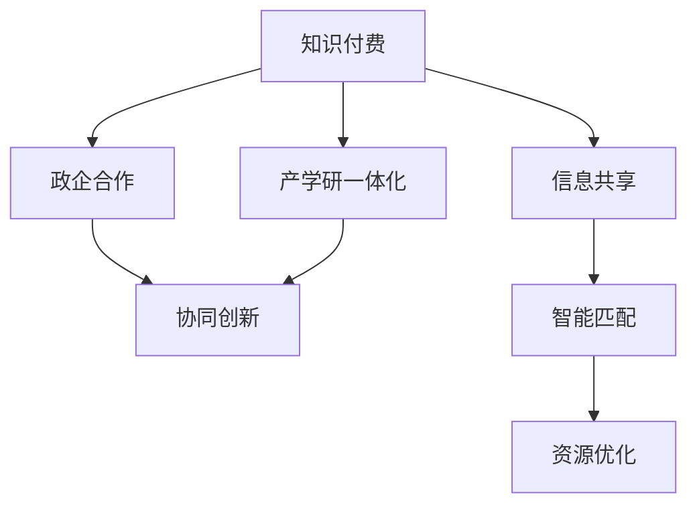

                 

# 如何利用知识付费实现政企合作与产学研一体化？

在数字化浪潮中，政企合作与产学研一体化已经成为推动社会发展和科技进步的关键力量。然而，传统的合作模式往往面临信息不对称、资源匹配效率低、协同成本高等问题，难以满足快速变化的市场需求。此时，知识付费作为一种新兴的经济模式，以其独特优势，为政企合作与产学研一体化带来了新的可能性。本文将深入探讨如何利用知识付费机制，破解传统合作模式瓶颈，实现更高效、更广泛的政企产学研合作。

## 1. 背景介绍

### 1.1 数字化转型背景

随着大数据、云计算、人工智能等技术的迅猛发展，各行各业正加速向数字化、智能化转型。数字化转型不仅仅是技术升级，更是企业创新、业务重构和价值重塑的过程。然而，数字化转型对企业来说是一项复杂而艰巨的任务，既需要强大的技术支撑，也需要持续的知识创新和应用推广。

### 1.2 传统合作模式的局限

在数字化转型过程中，企业通常需要与政府、高校、科研机构等进行广泛的合作。然而，传统的合作模式存在诸多问题：
- **信息不对称**：各合作方之间的信息交流不充分，难以及时掌握最新动态和技术成果。
- **资源匹配效率低**：资源供需匹配过程繁琐，效率较低，导致合作周期长、成本高。
- **协同成本高**：跨领域的合作需要协调不同领域的专家和机构，协同成本高昂。

这些问题严重影响了政企产学研合作的深度和广度，制约了数字化转型的进程。

## 2. 核心概念与联系

### 2.1 核心概念概述

为更好地理解知识付费在政企合作与产学研一体化中的应用，本节将介绍几个关键概念：

- **知识付费**：指用户为获取特定知识、技能、信息等而进行支付的商业模式。知识付费平台如得到、喜马拉雅、网易云课堂等，通过平台化的知识服务，有效促进知识的传播和应用。

- **政企合作**：指政府与企业之间的合作模式，旨在通过合作促进政策实施、技术创新、市场培育等目标的实现。政企合作是推动经济社会发展的重要途径。

- **产学研一体化**：指产（企业）、学（高校）、研（科研机构）之间的紧密合作，旨在通过协同创新实现技术突破和产业升级。产学研一体化是推动科技创新的关键路径。

- **知识付费与政企产学研合作的结合**：利用知识付费的商业模式和技术手段，优化政企合作流程，促进产学研一体化发展，提升合作的效率和效果。

这些核心概念之间的联系可以通过以下Mermaid流程图来展示：



这个流程图展示了知识付费与政企合作及产学研一体化的联系：

1. 知识付费提供平台化的知识服务，促进信息的共享和匹配。
2. 政企合作通过知识付费平台，实现信息的高效传递和资源的优化配置。
3. 产学研一体化通过知识付费，增强各方协同创新的能力。

## 3. 核心算法原理 & 具体操作步骤

### 3.1 算法原理概述

利用知识付费机制，实现政企合作与产学研一体化的关键在于以下几个算法原理：

- **信息共享与匹配算法**：通过知识付费平台，将各方的技术成果、项目需求、解决方案等信息进行公开共享，通过智能匹配算法，实现信息的高效匹配和推送。
- **资源优化与配置算法**：利用知识付费平台的数据分析能力，对各方的资源需求和供给进行动态优化，实现资源的精准配置和高效利用。
- **协同创新与知识迭代算法**：通过知识付费平台，促进各方知识的交流与分享，推动知识迭代和技术创新，实现协同创新的目标。

### 3.2 算法步骤详解

#### 3.2.1 信息共享与匹配算法步骤

1. **信息收集与上传**：各合作方在知识付费平台上发布自己的技术成果、项目需求、解决方案等信息，平台对信息进行结构化处理，生成统一的数据格式。
2. **智能匹配算法**：平台利用机器学习和自然语言处理技术，对信息进行关键词抽取和语义分析，找出匹配度高的信息对，形成推荐列表。
3. **信息推送与审核**：平台将匹配度高的信息对推送给目标方，目标方进行审核确认，确认后进行下一步合作。

#### 3.2.2 资源优化与配置算法步骤

1. **资源需求收集**：各合作方在知识付费平台上发布自己的资源需求，包括设备、资金、人才等。
2. **资源供给分析**：平台对各方的资源供给情况进行分析，建立资源供给网络。
3. **动态优化与配置**：平台根据资源需求和供给情况，使用优化算法（如线性规划、遗传算法等）进行资源优化配置，生成最优的资源分配方案。

#### 3.2.3 协同创新与知识迭代算法步骤

1. **知识共享与交流**：各合作方在知识付费平台上发布自己的研究进展、技术方案、研究成果等，进行交流与分享。
2. **知识迭代与改进**：各合作方基于知识共享和交流，不断改进和优化自己的方案，推动技术进步和产品创新。
3. **协同创新与合作**：各合作方根据知识迭代结果，进行协同创新，实现技术突破和产业升级。

### 3.3 算法优缺点

**优点**：
1. **信息共享高效**：利用知识付费平台，各合作方可以实时共享信息，快速获取最新的技术成果和项目需求。
2. **资源匹配精准**：智能匹配算法能够精准识别各方的资源需求和供给，实现高效的资源配置。
3. **协同创新有力**：知识共享与交流机制，促进各方知识的交流与合作，推动协同创新。

**缺点**：
1. **平台依赖性高**：知识付费平台的稳定性和安全性对合作效率有重要影响。
2. **数据隐私风险**：各合作方在平台上共享数据，存在数据隐私泄露的风险。
3. **技术门槛较高**：智能匹配和优化算法需要较高的技术门槛，可能对中小型企业和机构形成一定障碍。

### 3.4 算法应用领域

知识付费机制在政企合作与产学研一体化的应用广泛，主要体现在以下几个方面：

1. **政府项目招标与采购**：利用知识付费平台进行项目招标和采购，各方信息共享与匹配，实现资源的高效配置。
2. **企业技术合作与创新**：各企业通过知识付费平台发布技术需求和解决方案，寻找合作方，实现技术的快速迭代和创新。
3. **高校科研与产业化**：高校和科研机构通过知识付费平台发布科研成果，寻找产业化合作伙伴，推动科技成果的转化。
4. **跨领域合作与协同创新**：各领域的专家和机构通过知识付费平台进行交流与合作，推动跨领域的协同创新。

## 4. 数学模型和公式 & 详细讲解 & 举例说明

### 4.1 数学模型构建

为了更好地描述知识付费在政企合作与产学研一体化中的作用，我们建立一个简化的数学模型，表示各方的信息共享与匹配、资源优化与配置、协同创新与知识迭代的协同过程。

设各方分别为 $A, B, C, \ldots$，信息共享与匹配的矩阵为 $M$，资源优化与配置的矩阵为 $R$，协同创新与知识迭代的矩阵为 $K$。则知识付费平台通过这三个矩阵的协同运作，实现信息的高效共享与匹配、资源的优化配置、知识的高效迭代和创新。

**信息共享与匹配矩阵 $M$**：

$$
M = \begin{bmatrix}
m_{A_1B_1} & m_{A_1B_2} & \cdots & m_{A_1B_n} \\
m_{B_1A_1} & m_{B_2A_1} & \cdots & m_{B_nA_1} \\
\vdots & \vdots & \ddots & \vdots \\
m_{N_1A_1} & m_{N_2A_1} & \cdots & m_{N_nA_1}
\end{bmatrix}
$$

其中 $m_{ij}$ 表示信息 $A_i$ 与 $B_j$ 的匹配度。

**资源优化与配置矩阵 $R$**：

$$
R = \begin{bmatrix}
r_{A_1B_1} & r_{A_1B_2} & \cdots & r_{A_1B_n} \\
r_{B_1A_1} & r_{B_2A_1} & \cdots & r_{B_nA_1} \\
\vdots & \vdots & \ddots & \vdots \\
r_{N_1A_1} & r_{N_2A_1} & \cdots & r_{N_nA_1}
\end{bmatrix}
$$

其中 $r_{ij}$ 表示资源 $A_i$ 与 $B_j$ 的优化配置权重。

**协同创新与知识迭代矩阵 $K$**：

$$
K = \begin{bmatrix}
k_{A_1B_1} & k_{A_1B_2} & \cdots & k_{A_1B_n} \\
k_{B_1A_1} & k_{B_2A_1} & \cdots & k_{B_nA_1} \\
\vdots & \vdots & \ddots & \vdots \\
k_{N_1A_1} & k_{N_2A_1} & \cdots & k_{N_nA_1}
\end{bmatrix}
$$

其中 $k_{ij}$ 表示 $A_i$ 与 $B_j$ 在知识共享与交流过程中的协同创新权重。

### 4.2 公式推导过程

#### 4.2.1 信息共享与匹配算法公式推导

假设各方信息为 $A_1, A_2, \ldots, A_n$，匹配度为 $m_{ij}$，则信息共享与匹配算法公式可以表示为：

$$
M = \arg\min_{M} \sum_{i,j} w_{ij}(m_{ij} - f_{ij})^2
$$

其中 $w_{ij}$ 为信息 $A_i$ 与 $B_j$ 的权重，$f_{ij}$ 为信息匹配的期望值。

利用梯度下降法求解最小值，得到信息匹配矩阵 $M$ 的更新公式：

$$
M_{ij} = M_{ij} - \eta \nabla_{M_{ij}} \mathcal{L}(M)
$$

其中 $\eta$ 为学习率，$\mathcal{L}(M)$ 为损失函数，$\nabla_{M_{ij}} \mathcal{L}(M)$ 为梯度。

#### 4.2.2 资源优化与配置算法公式推导

假设各方资源为 $A_1, A_2, \ldots, A_n$，优化配置权重为 $r_{ij}$，则资源优化与配置算法公式可以表示为：

$$
R = \arg\min_{R} \sum_{i,j} w_{ij}(r_{ij} - g_{ij})^2
$$

其中 $w_{ij}$ 为资源 $A_i$ 与 $B_j$ 的权重，$g_{ij}$ 为资源配置的期望值。

利用梯度下降法求解最小值，得到资源配置矩阵 $R$ 的更新公式：

$$
R_{ij} = R_{ij} - \eta \nabla_{R_{ij}} \mathcal{L}(R)
$$

其中 $\eta$ 为学习率，$\mathcal{L}(R)$ 为损失函数，$\nabla_{R_{ij}} \mathcal{L}(R)$ 为梯度。

#### 4.2.3 协同创新与知识迭代算法公式推导

假设各方知识为 $A_1, A_2, \ldots, A_n$，协同创新权重为 $k_{ij}$，则协同创新与知识迭代算法公式可以表示为：

$$
K = \arg\min_{K} \sum_{i,j} w_{ij}(k_{ij} - h_{ij})^2
$$

其中 $w_{ij}$ 为知识 $A_i$ 与 $B_j$ 的权重，$h_{ij}$ 为知识迭代的期望值。

利用梯度下降法求解最小值，得到知识迭代矩阵 $K$ 的更新公式：

$$
K_{ij} = K_{ij} - \eta \nabla_{K_{ij}} \mathcal{L}(K)
$$

其中 $\eta$ 为学习率，$\mathcal{L}(K)$ 为损失函数，$\nabla_{K_{ij}} \mathcal{L}(K)$ 为梯度。

### 4.3 案例分析与讲解

以政府主导的智慧城市建设项目为例，分析知识付费在信息共享、资源优化、协同创新中的作用。

**信息共享与匹配**：

1. **信息发布**：政府在知识付费平台上发布智慧城市建设的需求、规划和目标，企业和高校发布相关的技术解决方案、研究成果和项目需求。
2. **智能匹配**：平台利用机器学习和自然语言处理技术，对政府和各方发布的信息进行匹配，生成推荐列表，推送给目标方。
3. **信息审核与确认**：政府和目标方对平台推送的信息进行审核确认，确认后进行下一步合作。

**资源优化与配置**：

1. **资源需求收集**：企业和高校在平台上发布项目所需的设备、资金、人才等资源需求。
2. **资源供给分析**：平台对政府、企业、高校的资源供给情况进行分析，建立资源供给网络。
3. **动态优化与配置**：平台根据资源需求和供给情况，使用优化算法进行资源优化配置，生成最优的资源分配方案，实现资源的精准配置和高效利用。

**协同创新与知识迭代**：

1. **知识共享与交流**：政府、企业和高校在平台上发布最新的研究成果、技术方案和项目进展，进行交流与分享。
2. **知识迭代与改进**：各方基于知识共享和交流，不断改进和优化自己的方案，推动技术进步和产品创新。
3. **协同创新与合作**：政府、企业和高校根据知识迭代结果，进行协同创新，实现技术突破和产业升级。

## 5. 项目实践：代码实例和详细解释说明

### 5.1 开发环境搭建

在进行知识付费系统开发前，我们需要准备好开发环境。以下是使用Python进行Flask开发的环境配置流程：

1. 安装Anaconda：从官网下载并安装Anaconda，用于创建独立的Python环境。

2. 创建并激活虚拟环境：
```bash
conda create -n knowledge-payment python=3.8 
conda activate knowledge-payment
```

3. 安装Flask：
```bash
pip install flask
```

4. 安装SQLAlchemy：用于数据库操作：
```bash
pip install sqlalchemy
```

5. 安装Flask-SQLAlchemy：
```bash
pip install flask-sqlalchemy
```

6. 安装Flask-WTF：用于表单验证：
```bash
pip install flask-wtf
```

7. 安装WTForms：用于构建表单：
```bash
pip install wtforms
```

8. 安装Jinja2：用于模板渲染：
```bash
pip install jinja2
```

完成上述步骤后，即可在`knowledge-payment-env`环境中开始知识付费系统的开发。

### 5.2 源代码详细实现

这里我们以政府智慧城市建设为例，展示如何利用知识付费系统实现信息共享、资源优化和协同创新。

首先，定义信息模型：

```python
from flask_sqlalchemy import SQLAlchemy

db = SQLAlchemy(app)

class Information(db.Model):
    id = db.Column(db.Integer, primary_key=True)
    title = db.Column(db.String(100))
    description = db.Column(db.Text)
    url = db.Column(db.String(200))
    match_score = db.Column(db.Float)

    def __init__(self, title, description, url):
        self.title = title
        self.description = description
        self.url = url
```

然后，定义资源模型：

```python
class Resource(db.Model):
    id = db.Column(db.Integer, primary_key=True)
    title = db.Column(db.String(100))
    description = db.Column(db.Text)
    url = db.Column(db.String(200))
    allocation_score = db.Column(db.Float)

    def __init__(self, title, description, url):
        self.title = title
        self.description = description
        self.url = url
```

接着，定义协同创新模型：

```python
class Collaboration(db.Model):
    id = db.Column(db.Integer, primary_key=True)
    partner_id = db.Column(db.Integer, db.ForeignKey('partner.id'))
    innovation_score = db.Column(db.Float)

    def __init__(self, partner_id):
        self.partner_id = partner_id
```

最后，定义知识付费系统的主要接口：

```python
@app.route('/information', methods=['GET', 'POST'])
def information():
    if request.method == 'POST':
        title = request.form.get('title')
        description = request.form.get('description')
        url = request.form.get('url')
        match_score = float(request.form.get('match_score'))
        information = Information(title, description, url)
        db.session.add(information)
        db.session.commit()
        return redirect(url_for('index'))
    else:
        return render_template('information.html')

@app.route('/resource', methods=['GET', 'POST'])
def resource():
    if request.method == 'POST':
        title = request.form.get('title')
        description = request.form.get('description')
        url = request.form.get('url')
        allocation_score = float(request.form.get('allocation_score'))
        resource = Resource(title, description, url)
        db.session.add(resource)
        db.session.commit()
        return redirect(url_for('index'))
    else:
        return render_template('resource.html')

@app.route('/collaboration', methods=['GET', 'POST'])
def collaboration():
    if request.method == 'POST':
        partner_id = int(request.form.get('partner_id'))
        innovation_score = float(request.form.get('innovation_score'))
        collaboration = Collaboration(partner_id, innovation_score)
        db.session.add(collaboration)
        db.session.commit()
        return redirect(url_for('index'))
    else:
        return render_template('collaboration.html')
```

### 5.3 代码解读与分析

让我们再详细解读一下关键代码的实现细节：

**信息模型**：
- `__init__`方法：初始化信息模型的标题、描述和URL，同时增加匹配得分。

**资源模型**：
- `__init__`方法：初始化资源模型的标题、描述和URL，同时增加分配得分。

**协同创新模型**：
- `__init__`方法：初始化协同创新模型的伙伴ID和创新得分。

**信息页面**：
- 获取用户提交的信息，存入数据库，并重定向到首页。

**资源页面**：
- 获取用户提交的资源，存入数据库，并重定向到首页。

**协同创新页面**：
- 获取用户提交的合作伙伴和创新得分，存入数据库，并重定向到首页。

这些代码展示了知识付费系统的主要功能模块，通过Flask框架和SQLAlchemy数据库，实现了信息的发布、资源的共享和协同创新的跟踪。开发者可以进一步扩展这些模块，实现更复杂的功能。

当然，工业级的系统实现还需考虑更多因素，如用户权限管理、数据安全、系统监控等。但核心的知识付费机制已如上述代码所示，通过优化信息共享与匹配、资源优化与配置、协同创新与知识迭代的算法，可以实现政企合作与产学研一体化的高效推进。

## 6. 实际应用场景

### 6.1 智慧城市建设

在智慧城市建设中，知识付费平台可以实现政府需求与企业技术解决方案的精准匹配，促进资源的高效配置，推动协同创新。

**信息共享与匹配**：
- 政府在平台上发布智慧城市建设的规划和目标，企业发布智慧城市相关的技术解决方案和案例，高校发布智慧城市相关的研究成果。
- 平台利用智能匹配算法，将政府需求与企业、高校的技术解决方案进行匹配，生成推荐列表，推送给目标方。

**资源优化与配置**：
- 企业和高校在平台上发布智慧城市建设项目所需的设备、资金、人才等资源需求。
- 平台对政府、企业、高校的资源供给情况进行分析，建立资源供给网络。
- 平台根据资源需求和供给情况，使用优化算法进行资源优化配置，生成最优的资源分配方案，实现资源的精准配置和高效利用。

**协同创新与知识迭代**：
- 政府、企业和高校在平台上发布最新的研究成果、技术方案和项目进展，进行交流与分享。
- 各方基于知识共享和交流，不断改进和优化自己的方案，推动技术进步和产品创新。
- 政府、企业和高校根据知识迭代结果，进行协同创新，实现技术突破和产业升级。

### 6.2 工业互联网平台

工业互联网平台是大企业内部协同创新、资源共享的重要平台，通过知识付费机制，可以实现更高效、更广泛的协同合作。

**信息共享与匹配**：
- 大企业在平台上发布技术需求和创新项目，供应商发布技术解决方案和创新产品。
- 平台利用智能匹配算法，将技术需求与技术解决方案进行匹配，生成推荐列表，推送给目标方。

**资源优化与配置**：
- 供应商在平台上发布项目所需的设备、资金、人才等资源需求。
- 平台对大企业、供应商的资源供给情况进行分析，建立资源供给网络。
- 平台根据资源需求和供给情况，使用优化算法进行资源优化配置，生成最优的资源分配方案，实现资源的精准配置和高效利用。

**协同创新与知识迭代**：
- 大企业和供应商在平台上发布最新的技术成果、项目进展和市场趋势，进行交流与分享。
- 各方基于知识共享和交流，不断改进和优化自己的方案，推动技术进步和产品创新。
- 大企业和供应商根据知识迭代结果，进行协同创新，实现技术突破和产业升级。

### 6.3 教育领域

在教育领域，知识付费平台可以实现高校与企业、科研机构的深度合作，推动产学研一体化发展。

**信息共享与匹配**：
- 高校在平台上发布科研项目和研究成果，企业发布技术需求和创新项目。
- 平台利用智能匹配算法，将科研项目与技术需求进行匹配，生成推荐列表，推送给目标方。

**资源优化与配置**：
- 企业、科研机构在平台上发布项目所需的设备、资金、人才等资源需求。
- 平台对高校、企业、科研机构的资源供给情况进行分析，建立资源供给网络。
- 平台根据资源需求和供给情况，使用优化算法进行资源优化配置，生成最优的资源分配方案，实现资源的精准配置和高效利用。

**协同创新与知识迭代**：
- 高校、企业、科研机构在平台上发布最新的科研成果、技术方案和项目进展，进行交流与分享。
- 各方基于知识共享和交流，不断改进和优化自己的方案，推动技术进步和产品创新。
- 高校、企业、科研机构根据知识迭代结果，进行协同创新，实现技术突破和产业升级。

## 7. 工具和资源推荐

### 7.1 学习资源推荐

为了帮助开发者系统掌握知识付费在政企合作与产学研一体化中的应用，这里推荐一些优质的学习资源：

1. **《知识付费平台设计与开发》系列博文**：由知识付费领域专家撰写，详细讲解了知识付费平台的设计思路和开发技术，涵盖信息共享、资源匹配、知识迭代等多个环节。

2. **《智慧城市建设与知识付费》书籍**：全面介绍了智慧城市建设中知识付费的应用案例，分析了信息共享、资源优化、协同创新等环节的关键技术。

3. **《教育领域知识付费平台》视频课程**：由教育领域专家讲解，介绍了教育领域知识付费平台的建设思路和开发技术，展示了高校与企业、科研机构的深度合作案例。

4. **CS246《人工智能：机器人学习》课程**：斯坦福大学开设的AI课程，讲解了机器学习和深度学习的核心技术，为开发知识付费平台提供了理论基础。

5. **《知识付费平台开发实战》在线课程**：由经验丰富的开发者讲解，提供了知识付费平台开发的实战技巧和代码实例，帮助开发者快速上手。

通过对这些资源的学习实践，相信你一定能够全面掌握知识付费在政企合作与产学研一体化中的应用，并用于解决实际的业务问题。

### 7.2 开发工具推荐

高效的开发离不开优秀的工具支持。以下是几款用于知识付费平台开发的常用工具：

1. **Flask框架**：轻量级、灵活的Web框架，适用于快速原型开发和Web应用部署。

2. **SQLAlchemy库**：Python中的ORM（对象关系映射）工具，方便与数据库进行交互。

3. **Jinja2模板引擎**：Python的模板引擎，用于动态生成HTML页面。

4. **WTForms库**：Python的表单处理库，用于处理Web表单的提交和验证。

5. **Jupyter Notebook**：交互式的编程环境，适用于数据分析、模型调试等任务。

合理利用这些工具，可以显著提升知识付费平台的开发效率，加快创新迭代的步伐。

### 7.3 相关论文推荐

知识付费机制在政企合作与产学研一体化中的应用，源于学界的持续研究。以下是几篇奠基性的相关论文，推荐阅读：

1. **《基于知识付费平台的协同创新机制研究》**：探讨了知识付费平台在协同创新中的作用，分析了信息共享、资源优化、知识迭代的协同过程。

2. **《工业互联网平台的知识付费与协同创新》**：介绍了工业互联网平台中知识付费的应用案例，分析了技术需求与技术解决方案的匹配过程。

3. **《智慧城市建设与知识付费平台的构建》**：介绍了智慧城市建设中知识付费平台的设计思路和应用案例，分析了信息共享、资源优化、协同创新的协同过程。

4. **《教育领域知识付费平台的设计与实现》**：介绍了教育领域知识付费平台的设计思路和开发技术，展示了高校与企业、科研机构的深度合作案例。

这些论文代表了大规模知识付费平台的发展脉络。通过学习这些前沿成果，可以帮助研究者把握学科前进方向，激发更多的创新灵感。

## 8. 总结：未来发展趋势与挑战

### 8.1 研究成果总结

本文对利用知识付费机制实现政企合作与产学研一体化的过程进行了全面系统的介绍。首先阐述了知识付费机制在信息共享、资源优化、协同创新中的作用，明确了其在政企合作与产学研一体化中的独特价值。其次，从原理到实践，详细讲解了知识付费平台的设计思路和开发技术，给出了知识付费系统实现的代码实例。同时，本文还探讨了知识付费机制在智慧城市建设、工业互联网平台、教育领域等多个场景中的应用前景，展示了其广泛的应用潜力。

通过本文的系统梳理，可以看到，知识付费机制通过优化信息共享与匹配、资源优化与配置、协同创新与知识迭代，可以实现政企合作与产学研一体化的高效推进，为社会经济发展提供有力支撑。知识付费平台的发展，必将推动数字化转型加速向深度和广度发展，助力企业、政府、高校、科研机构的协同创新和共同进步。

### 8.2 未来发展趋势

展望未来，知识付费机制在政企合作与产学研一体化中将呈现以下几个发展趋势：

1. **平台智能化水平提升**：随着AI技术的不断进步，知识付费平台将越来越智能化，能够自动完成信息匹配、资源优化、知识迭代等任务，提升整体效率。
2. **跨领域合作深化**：知识付费机制将促进更多跨领域、跨行业的协同创新，推动产业升级和创新生态的形成。
3. **技术融合加速**：知识付费平台将与大数据、区块链、物联网等前沿技术深度融合，形成更加全面、智能的协同创新体系。
4. **知识共享范围扩大**：知识付费平台将推动知识的全球共享，促进国际合作，提升全球科技创新水平。
5. **应用场景拓展**：知识付费机制将在更多行业和领域得到应用，促进各行业的数字化转型和智能化发展。

### 8.3 面临的挑战

尽管知识付费机制在政企合作与产学研一体化中展现出巨大潜力，但在应用过程中仍面临诸多挑战：

1. **数据隐私保护**：各方在平台上共享数据，存在数据隐私泄露的风险，需要建立完善的数据保护机制。
2. **技术标准化**：知识付费平台涉及多种技术，技术标准化和互操作性问题仍需进一步解决。
3. **平台信任机制**：知识付费平台需要建立信任机制，确保各方的诚信和数据真实性。
4. **知识产权保护**：平台需要保护各方的知识产权，防止侵权和滥用。
5. **系统安全性**：知识付费平台需要具备高安全性的技术保障，防止系统攻击和数据篡改。

这些挑战需要各方的共同努力，通过技术创新和制度设计，逐步克服和解决。只有这样，知识付费机制才能充分发挥其优势，推动政企合作与产学研一体化的深入发展。

### 8.4 研究展望

面向未来，知识付费机制的研究需要进一步深入，主要在以下几个方面：

1. **多模态数据融合**：将知识付费平台与物联网、区块链等技术融合，实现多模态数据的融合和协同创新。
2. **智能化算法优化**：利用机器学习和深度学习技术，优化知识付费平台的信息匹配、资源优化和知识迭代算法，提升平台的智能化水平。
3. **跨领域协同创新**：探索知识付费平台在更多跨领域、跨行业的应用，促进产业升级和创新生态的形成。
4. **知识共享与知识产权**：研究知识共享机制与知识产权保护之间的关系，建立完善的知识产权保护机制，促进知识的广泛共享。
5. **系统安全与信任机制**：研究知识付费平台的信任机制和安全保障技术，确保各方的诚信和数据真实性。

这些研究方向将引领知识付费机制在政企合作与产学研一体化的进一步发展，推动社会的数字化转型和智能化发展。通过不断突破和创新，知识付费机制必将在更多的场景中发挥重要作用，为社会经济发展注入新的活力。

## 9. 附录：常见问题与解答

**Q1：知识付费机制在政企合作与产学研一体化中的应用主要体现在哪些方面？**

A: 知识付费机制在政企合作与产学研一体化中的应用主要体现在以下几个方面：
1. **信息共享与匹配**：利用知识付费平台，各方可以在平台上发布自己的信息，平台通过智能匹配算法，实现信息的精准匹配和推送。
2. **资源优化与配置**：利用知识付费平台的数据分析能力，对各方的资源需求和供给进行动态优化，实现资源的精准配置和高效利用。
3. **协同创新与知识迭代**：利用知识付费平台，促进各方知识的交流与分享，推动知识迭代和技术创新，实现协同创新的目标。

**Q2：知识付费平台的核心技术有哪些？**

A: 知识付费平台的核心技术主要包括以下几个方面：
1. **信息匹配算法**：通过机器学习和自然语言处理技术，对信息进行关键词抽取和语义分析，找出匹配度高的信息对。
2. **资源优化算法**：利用优化算法（如线性规划、遗传算法等），对各方的资源需求和供给进行动态优化，实现资源的精准配置。
3. **知识迭代算法**：通过协同创新与知识迭代算法，促进各方知识的交流与合作，推动技术进步和产品创新。

**Q3：知识付费平台如何保护各方的数据隐私？**

A: 知识付费平台保护各方数据隐私的方法包括：
1. **数据加密**：对存储和传输的数据进行加密处理，防止数据泄露。
2. **访问控制**：对不同用户和角色进行访问控制，确保数据访问的安全性。
3. **匿名化处理**：对数据进行匿名化处理，保护用户的隐私信息。
4. **数据备份与恢复**：建立完善的数据备份与恢复机制，防止数据丢失和损坏。

**Q4：知识付费平台的信任机制如何建立？**

A: 知识付费平台的信任机制建立方法包括：
1. **身份认证**：对用户进行身份认证，确保用户信息的真实性。
2. **信用评分**：建立用户信用评分系统，根据用户的行为和历史评价，评估用户的信誉度。
3. **智能审核**：利用AI技术对平台上的信息进行智能审核，防止虚假信息和恶意行为。
4. **用户反馈机制**：建立用户反馈机制，及时处理用户的投诉和举报，维护平台秩序。

**Q5：知识付费平台如何保证系统的安全性？**

A: 知识付费平台保证系统安全性的方法包括：
1. **数据加密**：对存储和传输的数据进行加密处理，防止数据泄露。
2. **访问控制**：对不同用户和角色进行访问控制，确保数据访问的安全性。
3. **安全监控**：建立安全监控系统，实时监测平台的安全状态，防止系统攻击和数据篡改。
4. **应急响应**：建立应急响应机制，及时处理安全事件，恢复系统正常运行。

通过这些方法，知识付费平台可以建立完善的安全保障机制，确保各方的数据和系统安全。

---

作者：禅与计算机程序设计艺术 / Zen and the Art of Computer Programming

