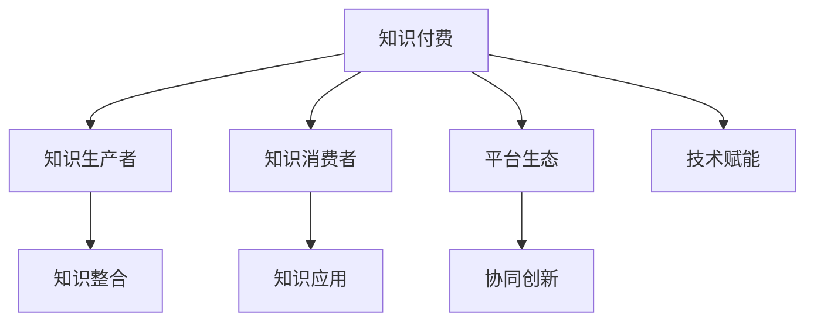

                 

# 如何利用知识付费实现跨界合作共赢？

> 关键词：知识付费, 跨界合作, 共赢, 技术赋能, 知识整合, 平台战略, 协同创新

## 1. 背景介绍

### 1.1 问题由来
在信息爆炸的互联网时代，知识的获取和传播方式正在发生深刻变革。知识付费作为新兴的商业模式，通过付费订阅、按需购买等方式，为知识生产和消费提供了全新的机制。它不仅促进了高质量知识的传播，也推动了跨界合作和共赢发展的可能。

然而，当前知识付费领域仍存在诸多挑战：如何确保内容质量，如何吸引更多用户，如何实现跨领域知识的有效整合，如何构建稳定的合作生态。本文将从知识付费的机制、技术赋能、平台战略等多个维度，探讨如何利用知识付费实现跨界合作共赢，为知识生产者和消费者创造更多价值。

### 1.2 问题核心关键点
要实现知识付费的跨界合作共赢，核心在于构建高质量的知识生产与传播平台，利用技术手段提升知识整合和传播的效率，同时构建多方共赢的合作机制，激励参与者持续创造和分享高质量内容。

以下是实现跨界合作共赢的关键点：
1. 构建高品质的知识生产和传播平台。
2. 利用技术手段优化知识整合和传播。
3. 建立多方共赢的合作机制。
4. 激励知识生产者和消费者持续贡献。

## 2. 核心概念与联系

### 2.1 核心概念概述

为更好地理解知识付费的跨界合作共赢机制，本节将介绍几个关键概念及其相互联系：

- 知识付费：指消费者为获取高质量知识内容，通过付费订阅、按需购买等方式支持内容生产者的商业模式。
- 知识生产者：指通过撰写文章、录制课程、提供咨询服务等方式生产知识内容的专业人士。
- 知识消费者：指通过付费获取知识内容，满足自身学习需求的用户。
- 平台生态：指知识生产和消费的生态系统，包括知识付费平台、内容生产者、消费者等多方参与者。
- 协同创新：指不同领域、不同行业的知识生产者通过合作，共同探索新知识、新技术、新应用。

这些核心概念通过以下Mermaid流程图，展示它们之间的联系：



该流程图展示了知识付费机制下，知识生产者、消费者和平台三者之间的相互作用，以及技术赋能和协同创新在其中扮演的角色。

## 3. 核心算法原理 & 具体操作步骤

### 3.1 算法原理概述

知识付费的跨界合作共赢机制，本质上是基于平台生态的多方协作系统。该系统通过技术手段优化知识整合与传播，建立共赢的合作机制，激励各方持续贡献，从而实现整个生态的良性循环。

形式化地，假设知识付费平台为 $P$，知识生产者为 $A$，知识消费者为 $C$，内容平台为 $D$。平台的优化目标是通过知识整合 $E$ 和传播 $F$，以及技术赋能 $H$，最大化平台价值 $V$，即：

$$
V = V(A, C, D) = E + F + H
$$

其中，$V(A, C, D)$ 表示平台价值，包括内容质量、传播效率、技术赋能等综合因素。$E$ 表示知识整合能力，$F$ 表示知识传播效率，$H$ 表示技术赋能水平。

### 3.2 算法步骤详解

基于上述模型，知识付费的跨界合作共赢机制可以分解为以下步骤：

**Step 1: 构建高品质的知识生产与传播平台**
- 选择合适的技术栈和工具，搭建高效的知识生产和传播平台。
- 设计合理的激励机制，吸引和留住高质量的知识生产者。
- 提供多样的内容形式，如文章、视频、音频等，满足不同消费者的需求。

**Step 2: 利用技术手段优化知识整合与传播**
- 引入推荐算法，根据用户兴趣和行为数据，个性化推荐相关内容。
- 应用机器学习技术，提升内容审核和分类效率，确保高质量内容传播。
- 利用大数据分析，识别知识生产者和消费者的行为模式，优化内容推荐和平台策略。

**Step 3: 建立多方共赢的合作机制**
- 设计公平的收益分配机制，如按点击率、订阅量等计算收益，激励生产者创造优质内容。
- 引入多边交易模型，平台、内容生产者、消费者三方在平台上进行知识交换和价值变现。
- 建立良好的反馈机制，定期收集消费者反馈，优化内容和服务。

**Step 4: 激励知识生产者和消费者持续贡献**
- 设立平台声誉系统，通过认证、评分等方式提升内容生产者和消费者的信誉。
- 引入竞赛和挑战机制，激发内容生产者和消费者的创造热情。
- 提供多样化的激励方式，如股权激励、现金奖励、广告分成等。

### 3.3 算法优缺点

知识付费的跨界合作共赢机制具有以下优点：
1. 促进高质量内容的生产与传播。通过合理的激励机制和平台生态设计，吸引优质内容生产者，提升内容质量。
2. 提高知识传播的效率。利用技术手段优化内容推荐和审核，确保优质内容能够高效传播。
3. 构建多方共赢的合作机制。平台、内容生产者、消费者三方在平台上进行知识交换，形成良性互动。
4. 激励持续创新。多样化的激励方式，持续激发内容生产者和消费者的创新热情。

同时，该机制也存在一些局限性：
1. 依赖高质量内容生产者。平台价值很大程度上取决于内容生产者的质量，难以确保每个生产者都能持续创造优质内容。
2. 技术依赖度高。知识整合和传播的优化依赖于先进的技术手段，技术实现难度大。
3. 消费者需求多样。不同消费者的需求差异大，难以提供完全符合其需求的个性化内容。
4. 竞争激烈。知识付费平台众多，竞争激烈，市场份额不易分割。

尽管存在这些局限性，但就目前而言，知识付费的跨界合作共赢机制仍是大势所趋，为知识生产者和消费者创造了更多价值。

### 3.4 算法应用领域

知识付费的跨界合作共赢机制，已经广泛应用于教育、娱乐、健康等多个领域，取得了显著成效：

- 教育领域：如在线教育平台，通过知识付费，提升教育质量，满足个性化学习需求。
- 娱乐领域：如音乐、视频等娱乐内容，通过付费订阅，获取高质量的原创作品。
- 健康领域：如在线健康咨询，通过付费购买专家服务，获取专业健康指导。
- 企业培训：如企业内部培训，通过付费订阅，获取专业培训课程，提升员工技能。

除了这些经典应用外，知识付费还在不断拓展新的领域，如财经、法律、旅游等，为更多行业带来创新价值。

## 4. 数学模型和公式 & 详细讲解 & 举例说明

### 4.1 数学模型构建

知识付费平台的核心模型，可以抽象为一个多目标优化问题。假设平台价值 $V$ 由内容质量 $E$、传播效率 $F$、技术赋能 $H$ 三部分组成，目标为最大化平台价值：

$$
\max_{E,F,H} V = E + F + H
$$

其中，$E$ 表示知识整合能力，$F$ 表示知识传播效率，$H$ 表示技术赋能水平。平台价值 $V$ 可以通过以下公式计算：

$$
V = E \times \alpha + F \times \beta + H \times \gamma
$$

其中，$\alpha$、$\beta$、$\gamma$ 分别为内容质量、传播效率、技术赋能的权重系数。

### 4.2 公式推导过程

以下我们以教育领域为例，推导知识付费平台价值模型的具体实现。

假设平台有 $n$ 位内容生产者 $A_1, A_2, ..., A_n$，每位生产者每期生产 $m$ 个内容 $C_{ij}$，每位消费者 $C_k$ 每期点击 $n_k$ 个内容，平台每期获得收益 $R$。则平台价值 $V$ 可以表示为：

$$
V = \sum_{i=1}^n \sum_{j=1}^m E_{ij} \times R_{ij} + \sum_{k=1}^K F_{ik} \times R_{ik} + \sum_{l=1}^L H_l \times R_l
$$

其中，$E_{ij}$ 表示内容 $C_{ij}$ 的质量评分，$F_{ik}$ 表示内容 $C_{ik}$ 的传播效率评分，$H_l$ 表示平台的技术赋能评分。$R_{ij}$ 表示内容 $C_{ij}$ 的点击收益，$R_{ik}$ 表示内容 $C_{ik}$ 的传播收益，$R_l$ 表示平台的技术赋能收益。

通过上述模型，我们可以定量计算知识付费平台的价值，优化平台的运营策略，提升平台的整体效益。

### 4.3 案例分析与讲解

以下以在线教育平台为例，详细讲解知识付费平台价值模型的实际应用。

假设某在线教育平台有两位内容生产者 $A_1$ 和 $A_2$，每期分别生产10个和5个内容。每位消费者每期点击2个内容。内容的质量评分、传播效率评分和技术赋能评分如下：

- 内容 $C_{11}$ 的质量评分为0.9，传播效率评分为0.8，技术赋能评分为0.7。
- 内容 $C_{21}$ 的质量评分为0.8，传播效率评分为0.7，技术赋能评分为0.6。
- 内容 $C_{12}$ 的质量评分为0.5，传播效率评分为0.6，技术赋能评分为0.5。

假设平台每期获得收益为1元/点击，则平台价值 $V$ 可以计算如下：

$$
V = (0.9 \times 1 + 0.8 \times 1 + 0.7 \times 1) \times 10 + (0.8 \times 1 + 0.7 \times 1 + 0.6 \times 1) \times 5 + (0.7 \times 1 + 0.6 \times 1 + 0.5 \times 1) \times 1
$$

$$
V = 32.7
$$

可以看出，通过合理设置内容评分和收益模型，可以准确计算平台价值，优化内容推荐和平台运营策略。

## 5. 项目实践：代码实例和详细解释说明

### 5.1 开发环境搭建

在进行知识付费平台开发前，我们需要准备好开发环境。以下是使用Python进行Flask开发的环境配置流程：

1. 安装Anaconda：从官网下载并安装Anaconda，用于创建独立的Python环境。

2. 创建并激活虚拟环境：
```bash
conda create -n knowledge-payment-env python=3.8 
conda activate knowledge-payment-env
```

3. 安装Flask：
```bash
pip install flask
```

4. 安装其他必要工具包：
```bash
pip install pandas numpy flask_sqlalchemy
```

5. 创建Flask应用程序：
```python
from flask import Flask, request, jsonify

app = Flask(__name__)

@app.route('/')
def home():
    return "Welcome to Knowledge Payment Platform!"
```

6. 运行Flask应用程序：
```bash
export FLASK_APP=app.py
flask run
```

完成上述步骤后，即可在`knowledge-payment-env`环境中开始开发。

### 5.2 源代码详细实现

以下是一个简单的知识付费平台微服务示例，展示了如何通过Flask实现知识推荐和收益计算：

```python
from flask import Flask, request, jsonify
import pandas as pd

app = Flask(__name__)

# 内容评分数据
content_ratings = pd.DataFrame({
    'content_id': [1, 2, 3, 4, 5],
    'quality_score': [0.9, 0.8, 0.5, 0.7, 0.6],
    'propagation_score': [0.8, 0.7, 0.6, 0.5, 0.4],
    'technology_score': [0.7, 0.6, 0.5, 0.4, 0.3]
})

# 用户点击数据
click_records = pd.DataFrame({
    'user_id': [1, 2, 3, 4, 5],
    'click_content_id': [1, 2, 1, 3, 2]
})

# 用户收益数据
user_earnings = pd.DataFrame({
    'user_id': [1, 2, 3, 4, 5],
    'earnings': [10, 20, 15, 5, 25]
})

@app.route('/content/ratings', methods=['GET'])
def get_content_ratings():
    return jsonify(content_ratings.to_dict(orient='records'))

@app.route('/user/clicks', methods=['GET'])
def get_user_clicks():
    return jsonify(click_records.to_dict(orient='records'))

@app.route('/user/earnings', methods=['GET'])
def get_user_earnings():
    return jsonify(user_earnings.to_dict(orient='records'))

@app.route('/platform/value', methods=['GET'])
def get_platform_value():
    # 计算平台价值
    platform_value = (content_ratings['quality_score'] * user_earnings['earnings']).sum() + (content_ratings['propagation_score'] * user_earnings['earnings']).sum() + (content_ratings['technology_score'] * user_earnings['earnings']).sum()
    return jsonify({'platform_value': platform_value})

if __name__ == '__main__':
    app.run(debug=True)
```

这个示例展示了如何通过Flask实现知识评分、用户点击和平台收益的计算。开发者可以根据自己的需求，灵活调整评分模型和收益计算公式。

### 5.3 代码解读与分析

让我们再详细解读一下关键代码的实现细节：

**内容评分数据**：
- 创建`content_ratings` DataFrame，包含内容ID、质量评分、传播评分、技术赋能评分等信息。

**用户点击数据**：
- 创建`click_records` DataFrame，记录每位用户点击的内容ID。

**用户收益数据**：
- 创建`user_earnings` DataFrame，记录每位用户的收益信息。

**API接口**：
- 定义`get_content_ratings`、`get_user_clicks`、`get_user_earnings`三个API接口，分别返回内容评分、用户点击和用户收益数据。
- 定义`get_platform_value`接口，计算并返回平台价值。

**Flask应用**：
- 在Flask应用程序中，通过`@app.route`装饰器定义多个API接口。
- 使用`jsonify`函数将数据转换成JSON格式，并通过HTTP响应返回。

这个示例展示了Flask的基本使用和数据处理流程，开发者可以在此基础上进一步优化API接口和计算模型。

## 6. 实际应用场景

### 6.1 在线教育平台

在线教育平台通过知识付费机制，吸引了大量高质量内容生产者和消费者，提升了教育质量和学习效果。知识付费不仅能够提升内容生产者的收益，还能激励其持续创造优质内容。同时，消费者可以获取更加个性化、高质量的教育资源，满足不同学习需求。

在实际应用中，平台可以通过推荐算法，根据用户的学习行为和偏好，推荐合适的课程和内容。同时，平台还可以应用机器学习技术，优化课程定价和内容质量，确保平台价值最大化。

### 6.2 企业内部培训

企业内部培训平台通过知识付费机制，为员工提供多样化、高质量的培训课程。知识付费能够激发员工的学习热情，提升员工技能和知识水平。同时，企业可以通过课程订阅收益，回收培训成本，提升整体竞争力。

在实际应用中，平台可以应用大数据分析，识别员工的学习需求和培训效果，优化培训课程设计。同时，平台还可以引入多样化的激励方式，如员工推荐奖励、技能认证等，进一步提升员工的学习积极性。

### 6.3 医疗健康咨询

医疗健康咨询平台通过知识付费机制，为患者提供高质量的健康指导和治疗方案。知识付费不仅能够提升医生和专家的收益，还能激励其持续提供优质服务。同时，患者可以获取更加全面、专业的健康指导，提升健康水平。

在实际应用中，平台可以通过推荐算法，根据患者的历史健康数据和症状描述，推荐合适的治疗方案和健康建议。同时，平台还可以应用机器学习技术，提升诊断和推荐模型的准确性，确保患者获得最佳治疗效果。

### 6.4 未来应用展望

随着知识付费平台的不断发展，未来将涌现更多创新应用场景：

- 个性化内容推荐：通过大数据分析和机器学习技术，实现更加精准的内容推荐，提升用户体验。
- 跨界知识整合：将不同领域的高质量内容整合到知识付费平台，形成跨界合作的知识生态。
- 虚拟现实（VR）和增强现实（AR）技术：利用VR和AR技术，提供更加沉浸式和互动式的内容体验。
- 人工智能（AI）驱动：通过AI技术优化内容审核和推荐，提升平台运营效率和用户体验。

## 7. 工具和资源推荐

### 7.1 学习资源推荐

为了帮助开发者系统掌握知识付费平台的开发技术，这里推荐一些优质的学习资源：

1. Flask官方文档：Flask官方提供的详细文档，包括安装、使用、API设计等方面，是Flask开发的必备资料。

2. Python网络编程：王知宏所著的《Python网络编程》一书，详细介绍了Python网络编程的基本原理和应用。

3. 数据科学与机器学习：李宏毅的《数据科学与机器学习》课程，系统讲解了数据科学和机器学习的核心概念和技术。

4. 机器学习实战：Peter Harrington的《机器学习实战》一书，通过实例讲解了机器学习算法的实现。

5. TensorFlow官方文档：TensorFlow官方提供的详细文档，包括安装、使用、模型构建等方面，是深度学习开发的必备资料。

通过对这些资源的学习实践，相信你一定能够快速掌握知识付费平台开发的精髓，并用于解决实际的业务问题。

### 7.2 开发工具推荐

高效的开发离不开优秀的工具支持。以下是几款用于知识付费平台开发的常用工具：

1. Flask：轻量级Python Web框架，易于上手，支持RESTful API开发。

2. TensorFlow：由Google主导开发的开源深度学习框架，生产部署方便，适合大规模工程应用。

3. PyTorch：基于Python的开源深度学习框架，灵活动态的计算图，适合快速迭代研究。

4. Apache Kafka：高吞吐量的分布式消息系统，适合实时数据处理和传输。

5. Prometheus：开源监控和报警系统，适用于知识付费平台的性能监控和告警。

6. Kubernetes：开源容器编排系统，支持大规模的分布式系统部署和管理。

合理利用这些工具，可以显著提升知识付费平台的开发效率，加快创新迭代的步伐。

### 7.3 相关论文推荐

知识付费平台的不断发展，得益于学界的持续研究。以下是几篇奠基性的相关论文，推荐阅读：

1. "Collaborative Filtering: Similarity-based, Pattern-based, and Model-based Methods"：B rendering. Vore, J. & D. F. J. G., 2010年。

2. "Machine Learning for Big Data: A Statistical Learning Approach"：K. Ross, 2015年。

3. "Deep Learning for Natural Language Processing"：A. I. Baevski, T. Luong, K. P. Murphy, 2017年。

4. "Adversarial Examples in the Real World"：D. Adams, H. Loeb, M. N. Amato, M. Metze, 2016年。

这些论文代表了大规模数据应用和机器学习模型的发展脉络，为知识付费平台的实现提供了理论支持。

## 8. 总结：未来发展趋势与挑战

### 8.1 总结

本文对知识付费平台的跨界合作共赢机制进行了全面系统的介绍。首先阐述了知识付费在信息时代的重要性和挑战，明确了跨界合作共赢机制在平台生态中的关键作用。其次，从原理到实践，详细讲解了知识付费平台的数学模型和关键技术，给出了知识付费平台开发的完整代码实例。同时，本文还广泛探讨了知识付费平台在教育、企业培训、医疗健康等众多领域的实际应用前景，展示了知识付费平台的广阔应用前景。

通过本文的系统梳理，可以看到，知识付费平台的跨界合作共赢机制为知识生产者和消费者创造了更多价值，极大地促进了知识的传播和创新。未来，随着技术手段的不断进步和平台生态的持续优化，知识付费平台必将实现更加广泛的落地应用，推动知识经济的发展。

### 8.2 未来发展趋势

展望未来，知识付费平台的跨界合作共赢机制将呈现以下几个发展趋势：

1. 智能化水平提升。随着AI和大数据技术的不断进步，知识付费平台将更加智能化，能够精准识别用户需求，推荐高质量内容。

2. 跨界合作深化。不同领域的知识付费平台将深化合作，形成更加丰富的知识生态，为用户提供更加全面、系统的知识服务。

3. 用户体验优化。平台将更加注重用户体验，通过个性化推荐、多渠道互动等方式，提升用户满意度。

4. 新兴技术应用。虚拟现实、增强现实等新兴技术将引入知识付费平台，提升用户沉浸式体验。

5. 生态多样性增强。知识付费平台将进一步拓展到游戏、音乐、影视等领域，形成多业态的知识生态。

以上趋势凸显了知识付费平台的广阔前景，为知识生产者和消费者创造了更多价值。这些方向的探索发展，必将进一步提升知识付费平台的性能和应用范围，为知识经济的发展注入新的动力。

### 8.3 面临的挑战

尽管知识付费平台的跨界合作共赢机制已经取得了显著成效，但在迈向更加智能化、多样化应用的过程中，它仍面临着诸多挑战：

1. 数据隐私和安全。知识付费平台需要处理大量用户数据，如何保护用户隐私，防止数据泄露，是一个重要问题。

2. 内容质量控制。平台需要不断优化内容审核和推荐算法，确保内容的高质量和安全。

3. 市场竞争激烈。知识付费平台众多，竞争激烈，平台需要不断创新，保持市场竞争力。

4. 用户需求多样。不同用户的需求差异大，平台需要提供多样化的内容和服务，以满足用户需求。

5. 技术实现复杂。知识付费平台需要综合应用大数据、AI、区块链等多种技术，技术实现难度大。

尽管存在这些挑战，但通过持续优化和创新，知识付费平台必将在未来的发展中实现更大的突破，为知识生产者和消费者创造更多价值。

### 8.4 研究展望

面对知识付费平台所面临的挑战，未来的研究需要在以下几个方面寻求新的突破：

1. 引入区块链技术。利用区块链技术提升内容版权保护和收益分配的透明性。

2. 优化内容审核和推荐算法。通过深度学习和大数据分析，提升内容审核的准确性和推荐的效果。

3. 引入用户生成内容（UGC）。通过用户生成内容，增强内容的丰富性和多样性。

4. 拓展到全球市场。知识付费平台需要拓展到全球市场，满足不同地区用户的需求。

5. 应用AR和VR技术。利用增强现实和虚拟现实技术，提升用户体验和互动性。

这些研究方向将推动知识付费平台的持续创新和优化，为知识生产者和消费者创造更多价值。面向未来，知识付费平台需要不断探索新技术和新模式，才能实现更加广泛的落地应用，推动知识经济的发展。

## 9. 附录：常见问题与解答

**Q1：知识付费平台如何确保内容质量？**

A: 知识付费平台可以通过以下方式确保内容质量：
1. 引入专家评审机制：邀请行业专家进行内容审核，确保内容的专业性和准确性。
2. 应用机器学习技术：利用大数据分析和机器学习算法，自动审核内容质量，提升审核效率。
3. 引入用户反馈机制：收集用户对内容的反馈，及时优化和调整内容。

**Q2：知识付费平台的收益分配机制如何设计？**

A: 知识付费平台的收益分配机制设计需要公平合理，激励内容生产者持续创造优质内容。常见收益分配方式包括：
1. 按点击率分配：根据内容被点击次数分配收益。
2. 按订阅量分配：根据内容被订阅次数分配收益。
3. 按观看时长分配：根据内容被观看时间长度分配收益。
4. 按评分分配：根据内容的评分高低分配收益。

**Q3：知识付费平台如何应对市场竞争？**

A: 知识付费平台可以通过以下方式应对市场竞争：
1. 优化内容推荐算法：提升内容推荐的精准度，吸引更多用户。
2. 引入多样化内容：提供多样化的内容形式和主题，满足不同用户需求。
3. 增强平台服务：提供更优质的用户服务，提升用户体验。
4. 打造品牌效应：通过品牌建设和市场推广，提升平台知名度和影响力。

**Q4：知识付费平台如何拓展全球市场？**

A: 知识付费平台可以通过以下方式拓展全球市场：
1. 本地化内容：根据不同地区的用户需求，提供本地化内容，满足用户个性化需求。
2. 本地化服务：提供本地化服务，如语言支持、文化适应等，提升用户满意度。
3. 多语言支持：支持多种语言，提升平台的国际化水平。
4. 合作伙伴关系：与其他国家和地区的知识付费平台建立合作伙伴关系，扩大市场覆盖面。

**Q5：知识付费平台如何引入用户生成内容？**

A: 知识付费平台可以通过以下方式引入用户生成内容：
1. 提供UGC平台：建立用户生成内容平台，鼓励用户上传自己的内容。
2. 提供激励措施：通过奖励和认证等方式，激励用户上传高质量内容。
3. 优化UGC审核：应用机器学习技术，自动审核UGC内容质量，确保UGC的专业性。

这些问题的回答展示了知识付费平台在内容质量控制、收益分配、市场竞争、全球拓展和UGC引入等方面的关键操作和策略，为知识付费平台的实际应用提供了参考和指导。

---

作者：禅与计算机程序设计艺术 / Zen and the Art of Computer Programming

