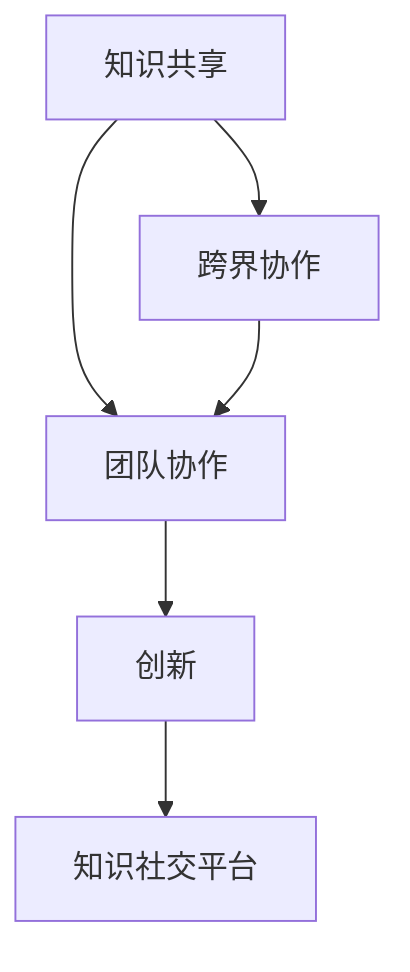

                 

## 1. 背景介绍

在人工智能（AI）和机器学习（ML）领域，知识共享和跨界协作正变得愈加重要。随着深度学习和自然语言处理（NLP）技术的飞速进步，跨学科的交流和合作已经变得日益频繁。知识社交平台，如GitHub、Kaggle等，已成为学术界、工业界和研究社区共同构建知识共享生态的重要工具。然而，如何更好地利用这些平台促进跨界创新和协作，提升团队协作效率，是当前AI领域面临的重要挑战。本文将从多个角度探讨如何通过知识社交促进跨界创新和协作，并结合实际案例进行详细说明。

## 2. 核心概念与联系

### 2.1 核心概念概述

在探讨如何利用知识社交促进跨界创新和协作之前，我们先明确几个核心概念及其联系。

- **知识共享（Knowledge Sharing）**：指不同个体或团队之间分享信息和资源，以促进相互学习和提高整体能力的行为。知识共享的形式多种多样，包括文档、代码、数据集、研究成果等。

- **跨界协作（Cross-disciplinary Collaboration）**：指不同领域（如计算机科学、生物学、物理学等）的研究者或工程师共同参与某一项目或研究，以整合各自领域的知识和技能，促进创新。

- **知识社交平台（Knowledge Social Platforms）**：如GitHub、Kaggle、arXiv等，是知识共享和跨界协作的基础设施。这些平台提供了一个交流和学习的环境，使得研究者和工程师能够便捷地分享和获取知识。

- **团队协作（Team Collaboration）**：通过构建跨学科团队，团队成员能够共同解决问题，提升项目完成的效率和质量。

- **创新（Innovation）**：指将新想法、技术、方法应用于实际问题，产生新的价值或服务。跨界协作和知识共享是创新过程中的重要环节。

这些概念之间的联系可以通过以下Mermaid流程图表示：

该流程图展示了知识共享、跨界协作、团队协作、创新以及知识社交平台之间的相互关系。知识共享和跨界协作为创新提供基础，而知识社交平台则提供工具和平台支持团队协作，从而推动创新。

### 2.2 核心概念原理和架构

知识共享和跨界协作的原理基于两个基本假设：
1. 知识的互补性：不同领域的知识和技能相互补充，能够提升项目的整体质量。
2. 知识的多样性：多样化的知识能够提供更全面的视角，促进问题的新解法。

从架构的角度看，知识社交平台搭建了一个“协作网络”，连接了来自不同领域的研究者和工程师，使得知识共享和跨界协作成为可能。平台通常包括代码托管、文档分享、讨论区、论坛等功能模块，提供了丰富的交互和学习环境。

## 3. 核心算法原理 & 具体操作步骤

### 3.1 算法原理概述

知识共享和跨界协作的算法原理主要包括：

- **推荐算法**：通过分析用户行为数据（如阅读文档、提交代码、参与讨论等），推荐可能对用户有用的知识和资源。
- **协同过滤算法**：基于用户的历史行为，预测用户可能感兴趣的领域或内容。
- **社交网络分析**：分析用户之间的社交关系，识别关键意见领袖（KOL）和潜在合作者。

### 3.2 算法步骤详解

在实际操作中，知识社交平台通过以下步骤进行知识共享和跨界协作：

1. **用户注册和登录**：用户通过注册和登录进入平台，开始利用平台的功能。
2. **知识分享和获取**：用户上传文档、代码或研究结果，并分享给其他用户。其他用户可以通过搜索或推荐获取这些知识。
3. **协作和讨论**：用户参与到具体的项目或任务中，通过协作和讨论进行交流。
4. **反馈和改进**：用户根据项目进展和反馈，不断改进自己的工作，并根据项目需求调整知识共享策略。

### 3.3 算法优缺点

知识社交平台的算法具有以下优点：

- **提高效率**：通过推荐和搜索，用户可以快速找到所需知识，加速项目进程。
- **促进多样性**：跨界协作能够引入多样化的视角和解决方案，有助于创新。
- **增强合作**：平台提供的协作功能促进了团队合作，提升了团队工作效率。

然而，平台也存在一些缺点：

- **信息过载**：大量信息的涌入可能导致用户难以筛选和处理。
- **质量参差不齐**：未经审核的知识可能包含错误或不完整的信息。
- **隐私和安全**：用户上传的知识可能涉及隐私信息或敏感内容。

### 3.4 算法应用领域

知识社交平台已经在多个领域得到了广泛应用，例如：

- **学术研究**：研究人员利用平台共享论文、数据集和代码，进行跨学科研究。
- **软件开发**：开发者利用平台协作开发软件，分享代码和文档，加速项目进程。
- **教育和培训**：教育机构利用平台提供公开课和教学资源，进行跨领域教学。
- **商业创新**：企业利用平台分享创新成果，进行跨界合作，加速产品开发。

## 4. 数学模型和公式 & 详细讲解 & 举例说明

### 4.1 数学模型构建

知识共享和跨界协作的数学模型可以通过以下方式构建：

1. **知识网络（Knowledge Network）**：将知识视为节点，关系视为边，构建知识图谱。每个节点代表一个知识点，边表示这些知识点之间的关联性。
2. **用户网络（User Network）**：将用户视为节点，关系视为边，构建用户社交网络。每个节点代表一个用户，边表示这些用户之间的互动。

### 4.2 公式推导过程

以推荐算法为例，假设有$M$个用户和$K$个知识节点，用户$u$的知识图谱$G_u$表示为邻接矩阵$A_u$。推荐算法通过计算用户$u$与知识$k$之间的相似度，推断用户可能感兴趣的知识点。

推荐算法使用PageRank算法进行计算，公式为：

$$
\text{PageRank}(u) = (1-d) + d \sum_{k=1}^K \frac{A_{uk} \times \text{PageRank}(k)}{\sum_{i=1}^K A_{ik}}
$$

其中，$d$为阻尼因子，$A_{uk}$表示用户$u$与知识$k$之间的边权重。

### 4.3 案例分析与讲解

以Kaggle平台为例，其推荐算法使用了类似PageRank的算法，并结合了协同过滤算法，通过分析用户的历史行为和知识交互数据，为用户推荐最相关的竞赛和数据集。

## 5. 项目实践：代码实例和详细解释说明

### 5.1 开发环境搭建

知识社交平台开发通常需要使用多种工具和技术，以下是基本环境搭建步骤：

1. **开发语言**：Python和R是最常用的语言，因为它们具有丰富的第三方库和社区支持。
2. **数据库**：使用关系型数据库（如MySQL、PostgreSQL）或NoSQL数据库（如MongoDB）存储用户和知识数据。
3. **服务器和计算资源**：需要高性能服务器支持大量的数据处理和用户交互。

### 5.2 源代码详细实现

以GitHub为例，以下是基本的代码实现步骤：

1. **用户管理**：使用OAuth 2.0进行用户注册和登录。
2. **知识管理**：实现文档上传、代码托管、版本控制等功能。
3. **推荐系统**：使用协同过滤和PageRank算法实现知识推荐。
4. **协作功能**：实现任务分配、进度跟踪、评论和讨论等功能。

### 5.3 代码解读与分析

对于GitHub的推荐系统，主要代码实现包括：

1. **用户行为分析**：通过日志文件分析用户的行为，如代码提交次数、参与讨论频率等。
2. **知识节点相似度计算**：使用TF-IDF算法计算知识节点之间的相似度，构建知识图谱。
3. **推荐算法实现**：使用协同过滤和PageRank算法，为用户推荐最相关的知识节点。

### 5.4 运行结果展示

运行结果可以通过以下方式展示：

- **用户界面**：显示推荐列表和知识详情，并提供协作和讨论的功能。
- **数据可视化**：使用图表展示用户行为、知识交互和推荐效果。
- **性能指标**：通过准确率、召回率等指标评估推荐系统的性能。

## 6. 实际应用场景

### 6.1 学术研究

学术研究是知识共享和跨界协作的重要领域之一。研究人员通过平台共享论文、代码和数据集，进行跨学科研究，加速科学进展。

以OpenAI的GPT-3为例，其在发布时依赖于GitHub上的代码库，研究人员能够快速查阅、修改和分享代码，加快了模型优化和应用的进程。

### 6.2 软件开发

软件开发是知识社交平台的重要应用场景之一。开发者利用平台协作开发软件，分享代码和文档，加速项目进程。

以TensorFlow为例，其社区通过GitHub管理代码，Kaggle平台发布竞赛，吸引了全球开发者共同参与。通过平台的协作和讨论功能，开发者能够高效地解决问题，促进技术创新。

### 6.3 教育和培训

教育机构利用知识社交平台提供公开课和教学资源，进行跨领域教学，提升教育质量。

例如，Coursera和edX等在线教育平台利用GitHub共享课程代码和教学资料，学生和教师能够通过平台进行互动和学习，提高了教育资源的利用效率。

### 6.4 商业创新

企业利用知识社交平台分享创新成果，进行跨界合作，加速产品开发。

例如，Google通过Kaggle平台发布AI竞赛，鼓励开发者利用公司数据进行创新。许多优秀解决方案被集成到Google的AI产品中，推动了公司技术创新和业务发展。

## 7. 工具和资源推荐

### 7.1 学习资源推荐

为了帮助开发者掌握知识社交平台的相关知识和技能，以下是一些推荐的学习资源：

1. **GitHub官方文档**：详细介绍了GitHub的API和开发指南，帮助开发者构建和管理自己的平台。
2. **Kaggle官方教程**：提供了一系列Kaggle竞赛和数据分析的教程，帮助开发者提升数据处理和建模能力。
3. **Coursera和edX课程**：涵盖GitHub、Git、数据科学和机器学习等方面的课程，帮助开发者提升跨界协作能力。

### 7.2 开发工具推荐

以下是几款常用的开发工具，用于知识社交平台的构建和管理：

1. **Jupyter Notebook**：强大的交互式编程环境，支持Python、R等多种语言，适合数据科学和机器学习任务。
2. **Docker**：容器化技术，方便开发者在不同的环境中运行和管理平台。
3. **AWS、Google Cloud、Microsoft Azure**：云服务提供商，提供高性能计算和存储资源，支持大规模数据处理。
4. **PostgreSQL、MySQL、MongoDB**：关系型和NoSQL数据库，用于存储用户和知识数据。

### 7.3 相关论文推荐

以下是几篇重要的相关论文，推荐阅读：

1. **PageRank算法**：由Google提出，用于计算网页的权威度。
2. **协同过滤算法**：如Apriori、ALS等，用于推荐系统中的用户行为预测。
3. **知识图谱构建**：如SparQL、RDF等，用于知识共享和语义网构建。

## 8. 总结：未来发展趋势与挑战

### 8.1 研究成果总结

本文探讨了如何通过知识社交平台促进跨界创新和协作。主要研究结论包括：

- 知识共享和跨界协作能够提高项目效率和创新性。
- 推荐算法和社交网络分析是知识共享和跨界协作的核心技术。
- 知识社交平台在学术研究、软件开发、教育和商业创新等领域得到了广泛应用。

### 8.2 未来发展趋势

未来知识社交平台将呈现以下几个发展趋势：

1. **智能推荐**：通过深度学习和强化学习，实现更精确和个性化的知识推荐。
2. **跨平台集成**：知识社交平台与其他社交网络、搜索引擎等平台进行深度集成，提供更丰富的交互体验。
3. **知识图谱扩展**：构建更大规模和更复杂的知识图谱，支持更广泛的知识共享和跨界协作。
4. **隐私保护**：引入隐私保护技术，确保用户上传的知识和数据的保密性。

### 8.3 面临的挑战

尽管知识社交平台在多个领域得到了广泛应用，但仍面临以下挑战：

1. **信息过载**：大量信息的涌入可能导致用户难以筛选和处理。
2. **质量参差不齐**：未经审核的知识可能包含错误或不完整的信息。
3. **隐私和安全**：用户上传的知识可能涉及隐私信息或敏感内容。

### 8.4 研究展望

未来的研究需要在以下几个方面寻求新的突破：

1. **智能推荐算法**：开发更高效的推荐算法，减少信息过载，提高知识共享的效率。
2. **隐私保护技术**：引入隐私保护技术，确保知识共享和跨界协作过程中的数据安全。
3. **跨平台集成**：实现知识社交平台与其他平台的深度集成，提供更丰富的交互体验。
4. **自动化协作工具**：开发自动化协作工具，支持更高效的团队协作和项目管理。

通过这些研究方向的探索，知识社交平台必将在未来发挥更大的作用，促进跨界创新和协作，推动科技和社会进步。

## 9. 附录：常见问题与解答

**Q1: 如何选择合适的知识社交平台？**

A: 选择知识社交平台应考虑以下几个因素：

- **功能完备性**：平台是否提供代码托管、文档分享、讨论区等功能。
- **用户活跃度**：平台的用户活跃度和社区氛围，是否有足够的知识资源和活跃用户。
- **技术支持**：平台的API和开发文档是否齐全，是否有社区支持。

**Q2: 知识社交平台如何提高用户活跃度？**

A: 知识社交平台可以通过以下方式提高用户活跃度：

- **推荐系统**：通过推荐算法向用户推荐有价值的内容。
- **互动功能**：提供讨论区、评论等互动功能，促进用户之间的交流和协作。
- **奖励机制**：设立积分、徽章等奖励机制，激励用户积极贡献知识。

**Q3: 如何确保知识社交平台的数据安全？**

A: 确保知识社交平台的数据安全，主要应采取以下措施：

- **数据加密**：使用加密技术保护用户上传的知识和数据。
- **访问控制**：设置严格的访问控制机制，确保只有授权用户能够访问和修改数据。
- **隐私政策**：制定明确的隐私政策，告知用户数据的使用方式和保护措施。

**Q4: 如何避免知识社交平台上的信息过载？**

A: 避免知识社交平台上的信息过载，可以采取以下措施：

- **推荐算法优化**：使用更精确的推荐算法，减少用户需要浏览的内容。
- **内容审核**：设立内容审核机制，过滤低质量和不相关的内容。
- **用户反馈**：引入用户反馈机制，让用户能够筛选和标记不感兴趣的内容。

**Q5: 如何衡量知识社交平台的效果？**

A: 衡量知识社交平台的效果，可以通过以下指标：

- **用户活跃度**：平台的用户注册数、登录次数、内容上传量等。
- **知识质量**：知识共享的质量和用户评价，如论文引用率、代码质量等。
- **协作效果**：项目协作的成功率和完成度，如项目进度、讨论互动等。

通过以上问题的解答，希望能够帮助读者更好地理解知识社交平台在促进跨界创新和协作中的作用，并提升平台的使用效率和效果。

