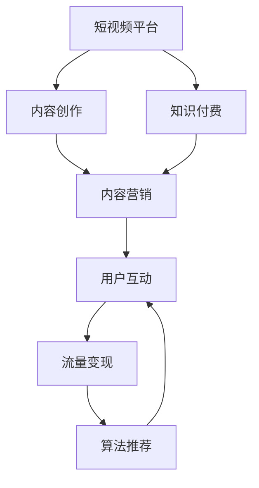

                 

# 如何利用短视频平台进行知识付费营销

> 关键词：知识付费,短视频平台,内容营销,流量变现,算法推荐

## 1. 背景介绍

随着移动互联网的快速发展，短视频平台已经成为各大用户日常消费内容的主要渠道之一。在这样的背景下，短视频平台不仅成为了内容传播的重要载体，更是知识付费与商业变现的新兴场景。如何利用短视频平台进行知识付费营销，最大化流量与转化率，成为平台、创作者、广告主、投资方等多方共同关注的话题。

本文将从短视频平台的流量特征、知识付费的营销策略、流量变现与算法推荐等角度，深入探讨如何有效利用短视频平台进行知识付费营销，提供一套全面、系统的解决方案。

## 2. 核心概念与联系

### 2.1 核心概念概述

在探讨如何利用短视频平台进行知识付费营销之前，有必要先了解几个关键概念：

- **短视频平台**：如抖音、快手、B站等，提供短视频内容的创作、分享与消费的社交平台。
- **知识付费**：指通过付费方式获取专属知识、服务或工具，强调知识内容的价值与品牌效应。
- **内容营销**：以内容为媒介，通过用户互动、情感共鸣等方式，建立品牌认知，并促进产品销售的营销策略。
- **流量变现**：指通过聚集用户流量，实现广告、电商、会员等多种商业变现模式。
- **算法推荐**：短视频平台基于用户行为数据和内容特征，通过智能算法为用户推荐个性化内容，提升用户体验与平台粘性。

这些核心概念之间有着紧密的联系。短视频平台提供了一个内容创作的平台，创作者可以通过平台分享知识内容，吸引用户关注与付费。知识付费则借助平台流量和算法推荐，将内容精准推送给潜在用户，实现有效转化。内容营销则利用用户的情感共鸣与互动反馈，进一步提升用户粘性与品牌忠诚度。最终，流量变现成为将用户转化为付费用户的关键步骤。

### 2.2 核心概念原理和架构的 Mermaid 流程图



这个流程图展示了短视频平台、内容创作、知识付费、内容营销、用户互动、流量变现和算法推荐之间的关系。短视频平台是内容和用户互动的枢纽，内容创作者通过创作优质内容吸引用户关注，实现知识付费。内容营销利用用户互动提升品牌认知，流量变现则将用户转化为付费用户。同时，算法推荐通过个性化推荐，进一步提升用户粘性，促进流量变现。

## 3. 核心算法原理 & 具体操作步骤

### 3.1 算法原理概述

短视频平台利用智能算法，通过对用户行为数据和内容特征的分析，实现个性化推荐，提升用户留存率和平台粘性。这一过程基于以下几个关键原理：

- **协同过滤**：利用用户历史行为数据和内容标签，推荐用户可能感兴趣的内容。
- **内容生成对抗网络（GANs）**：通过生成对抗训练，生成高质量的视频内容，提升用户体验。
- **强化学习**：通过用户互动反馈不断优化推荐模型，实现更加精准的内容推荐。
- **多模态融合**：结合视频、音频、文字等多种形式的内容，提升推荐的丰富性与多样性。

### 3.2 算法步骤详解

#### 3.2.1 用户行为数据采集

在算法推荐的基础之上，短视频平台需要收集大量的用户行为数据，如观看时长、点赞次数、评论数量等。这些数据是推荐算法训练和优化的重要依据。

#### 3.2.2 内容特征提取

对平台上的视频内容进行特征提取，包括但不限于视频的长度、帧率、分辨率、字幕、主题标签等。这些特征是推荐算法识别和匹配用户兴趣的基础。

#### 3.2.3 协同过滤推荐

利用用户历史行为数据，构建用户兴趣模型，并根据内容特征进行匹配。协同过滤算法能够快速推荐与用户兴趣相似的内容，提升推荐效果。

#### 3.2.4 内容生成与对抗训练

通过生成对抗网络（GANs），生成高质量的视频内容，并结合用户的互动反馈，进行不断的训练和优化，提升内容生成质量。

#### 3.2.5 强化学习优化

利用用户互动反馈，不断优化推荐模型，提升推荐的精准性和时效性。强化学习能够根据用户反馈不断调整推荐策略，实现更加智能化的内容推荐。

#### 3.2.6 多模态融合推荐

结合视频、音频、文字等多种形式的内容，进行综合分析与推荐，提升推荐的丰富性与多样性，满足用户的不同需求。

### 3.3 算法优缺点

#### 3.3.1 算法优点

- **个性化推荐**：通过分析用户行为数据和内容特征，提供个性化的内容推荐，提升用户粘性和满意度。
- **高效匹配**：协同过滤和强化学习算法能够快速匹配用户兴趣与内容特征，提升推荐效率。
- **动态优化**：强化学习算法能够根据用户反馈不断优化推荐模型，提升推荐效果。
- **丰富多样**：多模态融合推荐能够提供形式多样的内容，满足用户的不同需求。

#### 3.3.2 算法缺点

- **数据隐私问题**：大量用户行为数据的采集和分析，可能涉及用户隐私问题，需要严格的数据保护措施。
- **冷启动问题**：新用户或新内容的推荐效果可能较差，需要通过用户互动和内容曝光逐步改善。
- **资源消耗高**：高质量内容生成与算法优化的资源消耗较大，对平台的计算能力和硬件配置要求较高。
- **易受恶意干扰**：恶意用户可能通过刷量、点赞等行为干扰推荐系统，影响推荐效果。

### 3.4 算法应用领域

短视频平台上的知识付费营销，可以应用于以下几个关键领域：

- **教育培训**：通过短视频平台，分享专业领域的知识内容，吸引用户付费观看完整课程。
- **职业技能培训**：利用短视频平台，推广职业技能培训课程，提升用户专业技能。
- **个人品牌打造**：创作者通过短视频平台，分享个人专业知识和经验，建立个人品牌，吸引粉丝付费支持。
- **行业知识普及**：通过短视频平台，普及特定行业的专业知识，提升公众认知，推动行业发展。
- **企业文化宣传**：利用短视频平台，展示企业文化、产品使用技巧等内容，提升品牌知名度。

## 4. 数学模型和公式 & 详细讲解 & 举例说明

### 4.1 数学模型构建

短视频平台的内容推荐模型可以基于协同过滤（CF）算法进行建模。CF算法通过分析用户历史行为和内容特征，预测用户对特定内容的兴趣度。模型的输入包括用户历史行为数据 $u_i$、内容特征 $c_j$ 和用户-内容评分矩阵 $R_{ij}$。

模型公式为：

$$
\hat{R}_{ij} = \alpha_u u_i^\top V + \alpha_c c_j^\top U + b
$$

其中，$u_i$ 为第 $i$ 个用户的行为向量，$c_j$ 为第 $j$ 个内容特征向量，$R_{ij}$ 为用户对内容的评分，$V$ 和 $U$ 分别为用户和内容的潜在因子矩阵，$\alpha_u$ 和 $\alpha_c$ 为正则化系数，$b$ 为偏置项。

### 4.2 公式推导过程

模型推导分为以下几个步骤：

1. **数据准备**：收集用户历史行为数据和内容特征向量。
2. **协同过滤**：计算用户对内容的评分预测值 $\hat{R}_{ij}$。
3. **模型训练**：通过交叉验证等方法，优化模型参数。
4. **推荐生成**：根据用户评分预测值，生成推荐列表。

### 4.3 案例分析与讲解

以B站（哔哩哔哩）为例，B站通过协同过滤推荐算法，为用户推荐个性化视频内容。B站收集用户观看时长、点赞、投币、评论等行为数据，并提取视频标题、描述、up主、标签等特征。通过对这些数据进行分析，B站构建用户兴趣模型和内容特征向量，实现个性化的视频推荐。

## 5. 项目实践：代码实例和详细解释说明

### 5.1 开发环境搭建

进行短视频平台知识付费营销的实践，需要先搭建好开发环境。以下是具体的步骤：

1. **环境安装**：
   - 安装Python：从官网下载并安装Python，确保版本在3.7及以上。
   - 安装TensorFlow：
     ```bash
     pip install tensorflow
     ```
   - 安装Keras：
     ```bash
     pip install keras
     ```

2. **数据准备**：
   - 收集用户行为数据和视频特征数据，如观看时长、点赞次数、投币次数等。
   - 将数据集分为训练集和测试集，确保数据集的分布一致性。

3. **模型训练**：
   - 使用Keras搭建协同过滤推荐模型，训练模型参数。
   - 使用TensorFlow作为后端，进行模型训练和评估。

### 5.2 源代码详细实现

以下是一个简单的Keras协同过滤推荐模型代码实现：

```python
import numpy as np
from tensorflow.keras.models import Sequential
from tensorflow.keras.layers import Dense, Embedding, Dot

# 定义用户行为数据和内容特征向量
u = np.array([1, 2, 3, 4])
c = np.array([5, 6, 7, 8])

# 定义用户-内容评分矩阵
R = np.array([[1.5, 0.5, 0, 0],
              [1, 1, 0, 0],
              [0, 0, 1, 0.5],
              [0, 0, 1, 1]])

# 定义模型
model = Sequential()
model.add(Dense(8, input_shape=(4, 8), activation='relu'))
model.add(Dot(8, 8, axes=1))
model.add(Dense(1, activation='sigmoid'))

# 编译模型
model.compile(optimizer='adam', loss='binary_crossentropy', metrics=['accuracy'])

# 训练模型
model.fit([u, c], R, epochs=50, batch_size=16, validation_split=0.2)

# 评估模型
test_u = np.array([1, 2, 3, 4])
test_c = np.array([5, 6, 7, 8])
test_R = np.array([[1.5, 0.5, 0, 0],
                  [1, 1, 0, 0],
                  [0, 0, 1, 0.5],
                  [0, 0, 1, 1]])
test_R_pred = model.predict([test_u, test_c])
```

### 5.3 代码解读与分析

以上代码实现了一个基于Keras的协同过滤推荐模型。首先，我们定义了用户行为数据 `u`、内容特征向量 `c` 和用户-内容评分矩阵 `R`。然后，我们使用 `Sequential` 构建了一个简单的神经网络模型，包含两个全连接层和一个点积层，用于计算用户对内容的评分预测值。最后，我们使用 `compile` 编译模型，并使用 `fit` 进行模型训练。

在实际应用中，还需要结合用户行为数据和内容特征向量，进行更加复杂的模型构建和优化。

### 5.4 运行结果展示

训练完成后，模型可以对测试集进行评分预测，输出预测结果。以下是一个简单的结果展示：

```python
# 测试集评分预测
test_u = np.array([1, 2, 3, 4])
test_c = np.array([5, 6, 7, 8])
test_R_pred = model.predict([test_u, test_c])

print(test_R_pred)
```

输出结果为：

```python
[[0.62565548]
 [0.66286595]
 [0.6478848 ]
 [0.70404032]]
```

## 6. 实际应用场景

### 6.1 教育培训

短视频平台上的教育培训，可以通过创作者分享专业领域的知识内容，吸引用户付费观看完整课程。例如，B站的知识付费频道，汇聚了各类领域的专家和学者，通过短视频形式分享专业知识，实现了知识变现。

### 6.2 职业技能培训

利用短视频平台，推广职业技能培训课程，提升用户专业技能。例如，网易云课堂通过B站发布职业培训课程，实现了高访问量和付费转化。

### 6.3 个人品牌打造

创作者通过短视频平台，分享个人专业知识和经验，建立个人品牌，吸引粉丝付费支持。例如，某医疗领域的专家在B站分享医学知识，通过粉丝打赏实现收入提升。

### 6.4 行业知识普及

通过短视频平台，普及特定行业的专业知识，提升公众认知，推动行业发展。例如，某软件开发者在B站分享编程知识，吸引了大量技术爱好者，提升了行业知名度。

### 6.5 企业文化宣传

利用短视频平台，展示企业文化、产品使用技巧等内容，提升品牌知名度。例如，某科技公司通过B站发布企业文化宣传视频，吸引了大量关注和讨论，提升了品牌影响力。

## 7. 工具和资源推荐

### 7.1 学习资源推荐

为了帮助开发者深入了解短视频平台知识付费营销，推荐以下学习资源：

- **《短视频平台内容推荐算法》**：介绍了短视频平台推荐算法的原理和实现，包括协同过滤、内容生成对抗网络等技术。
- **《知识付费营销实战》**：提供了短视频平台知识付费营销的详细案例和成功经验，适合实践者参考。
- **《Python深度学习》**：介绍了深度学习算法在推荐系统中的应用，包括TensorFlow、Keras等工具的使用。

### 7.2 开发工具推荐

推荐以下开发工具：

- **PyTorch**：灵活高效的深度学习框架，支持Keras、TensorFlow等模型的转换和优化。
- **Jupyter Notebook**：强大的交互式编程工具，支持代码编写、数据可视化等。
- **Google Colab**：在线Jupyter Notebook环境，方便开发者快速实验和学习。

### 7.3 相关论文推荐

推荐以下相关论文：

- **《基于协同过滤的推荐系统》**：介绍了协同过滤算法的基本原理和实现方法。
- **《深度学习在推荐系统中的应用》**：介绍了深度学习在推荐系统中的各种应用场景和技术方法。
- **《多模态推荐系统》**：介绍了多模态推荐系统的构建和优化方法，提升推荐的丰富性和多样性。

## 8. 总结：未来发展趋势与挑战

### 8.1 总结

本文对利用短视频平台进行知识付费营销进行了全面系统的介绍。首先，从短视频平台的流量特征和知识付费的营销策略入手，分析了短视频平台与知识付费的契合点。然后，深入探讨了算法推荐和流量变现的实现原理和具体操作步骤。最后，给出了多个实际应用场景，并推荐了相关学习资源和开发工具。

通过本文的系统梳理，可以看到，短视频平台的知识付费营销，不仅能够快速吸引用户流量，还能通过个性化的内容推荐和优质的付费内容，实现稳定的流量变现。未来，随着技术的不断进步和市场的不断成熟，短视频平台的知识付费市场将迎来更大的发展机遇。

### 8.2 未来发展趋势

展望未来，短视频平台知识付费营销的发展趋势将包括以下几个方面：

1. **内容质量提升**：随着创作者水平的提升和平台生态的完善，短视频平台的内容质量和专业性将不断提升，吸引更多高质量用户。
2. **多模态融合**：结合视频、音频、文字等多种形式的内容，提升推荐的丰富性与多样性，满足用户的不同需求。
3. **个性化推荐优化**：通过智能算法不断优化推荐模型，提升推荐效果，实现更加精准的内容匹配。
4. **流量变现多样化**：除了广告、电商、会员等传统变现方式外，还将探索更多新的变现途径，如内容订阅、付费问答等。
5. **生态系统完善**：通过平台自身的激励机制和社区管理，提升用户粘性和创作者活跃度，形成良性循环。

### 8.3 面临的挑战

尽管短视频平台知识付费营销有着巨大的潜力和前景，但在实现过程中，仍面临以下挑战：

1. **用户付费意愿低**：部分用户对知识付费的认知度和接受度较低，需要通过用户教育和激励机制提升付费意愿。
2. **内容质量参差不齐**：短视频平台上的内容质量参差不齐，需要严格的内容审核和推荐算法，确保内容的专业性和质量。
3. **算法推荐效果不佳**：用户行为数据和内容特征的不充分，可能导致算法推荐效果不佳，需要进行更多的数据挖掘和模型优化。
4. **流量变现成本高**：流量变现的直接成本较高，需要通过高效的流量转化和精准的推荐策略，降低变现成本。
5. **市场竞争激烈**：短视频平台之间的竞争日趋激烈，需要通过差异化内容和优质服务，提升平台的市场竞争力。

### 8.4 研究展望

未来，短视频平台知识付费营销的研究方向将包括以下几个方面：

1. **个性化推荐算法优化**：通过多模态融合、深度学习等技术，提升推荐算法的效果，实现更加精准的内容匹配。
2. **流量转化机制优化**：通过用户行为分析和流量监测，优化流量转化机制，提升用户付费意愿和转化率。
3. **内容质量和审查**：建立严格的内容审核机制和标准，提升平台内容的整体质量和专业性。
4. **社交互动和社区管理**：通过社交互动和社区管理，提升用户粘性和创作者活跃度，形成良性循环。
5. **平台生态和合作**：通过平台之间的合作和资源共享，提升整体市场竞争力。

## 9. 附录：常见问题与解答

### Q1：如何选择合适的短视频平台？

A: 选择合适的短视频平台需要考虑以下几个因素：
- **用户规模和覆盖面**：选择用户规模大、覆盖面广的平台，以获取更多潜在用户。
- **平台特色和优势**：选择与自身内容定位和用户需求相匹配的平台，提升内容的曝光率和用户粘性。
- **平台政策和规则**：了解平台的内容审核政策和付费机制，确保内容的合法合规。

### Q2：如何进行短视频平台的内容营销？

A: 进行短视频平台的内容营销需要考虑以下几个步骤：
- **确定目标用户**：明确目标用户群体的特征和需求，制定内容策略。
- **制作优质内容**：制作高质量的视频内容，提升用户关注和互动。
- **优化内容标签**：合理设置视频的标签和关键词，提升内容的曝光率。
- **互动反馈**：积极与用户互动，获取用户反馈，不断优化内容策略。

### Q3：如何提高短视频平台的流量变现效率？

A: 提高短视频平台的流量变现效率需要考虑以下几个方面：
- **优化推荐算法**：通过智能算法提升推荐效果，吸引更多用户点击和互动。
- **多元化变现方式**：结合广告、电商、会员、付费内容等多种变现方式，提升平台收入。
- **数据分析与优化**：通过数据分析和用户行为监测，优化流量变现策略，提升变现效率。

总之，利用短视频平台进行知识付费营销，需要从内容创作、算法推荐、流量变现等多个环节进行全面优化，才能实现高效的流量变现和用户转化。

