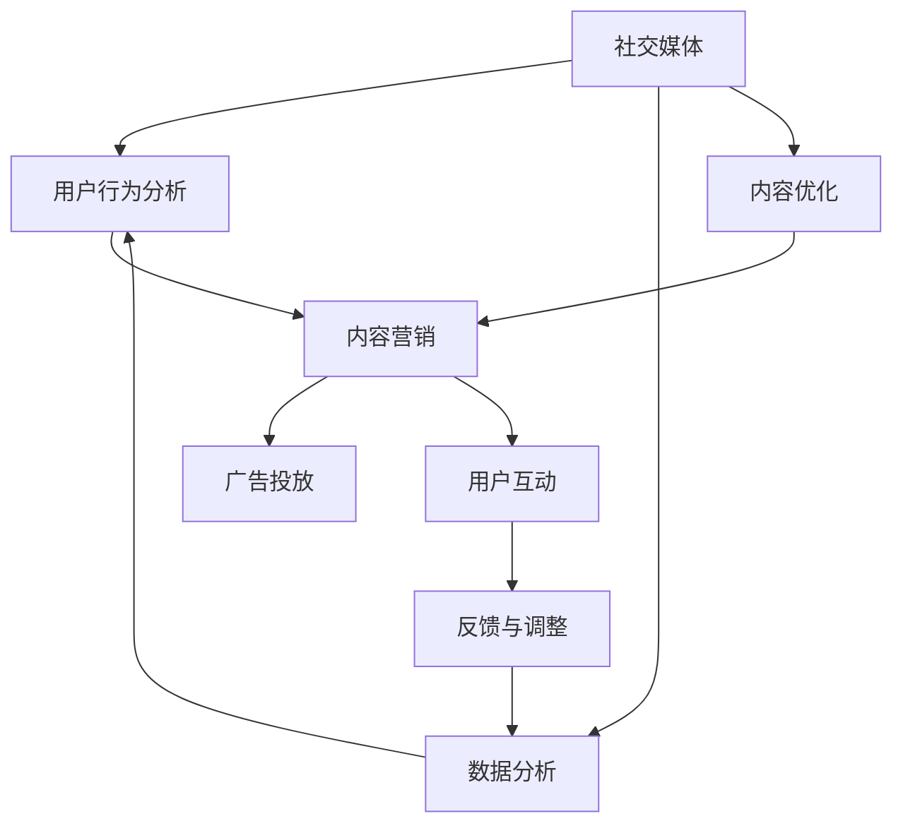

                 

# 如何利用社交媒体进行知识付费营销

> 关键词：社交媒体,知识付费,用户行为分析,内容营销,广告投放

## 1. 背景介绍

### 1.1 问题由来
社交媒体作为互联网时代的信息传播重要平台，用户规模庞大，内容形式丰富，交互性强，已逐渐成为知识付费营销的新渠道。传统知识付费平台（如得到、喜马拉雅、樊登读书会等）凭借完善的平台体系和付费机制，吸引大量用户。但受限于用户习惯和市场定位，这些平台主要聚焦于专业性强、需求明确的用户群体。社交媒体通过低成本、高互动的营销手段，吸引了更多泛兴趣用户。如何利用社交媒体进行知识付费营销，是当前内容创业和营销人员关注的重点。

### 1.2 问题核心关键点
社交媒体知识付费营销的目的是通过精准触达目标用户，提高内容曝光率，激发用户付费意愿，从而实现营销目标。关键点在于：
1. **用户行为分析**：精准定位目标用户，分析用户兴趣和行为，实现个性化营销。
2. **内容优化**：提高内容吸引力，增加用户粘性，提升转化率。
3. **广告投放**：利用社交媒体广告投放，扩大内容曝光率，实现高效的流量导流。

## 2. 核心概念与联系

### 2.1 核心概念概述

为了更好地理解社交媒体知识付费营销的策略和效果，本节将介绍几个关键概念：

- **社交媒体（Social Media）**：包括微博、微信公众号、抖音、小红书等平台，用户可发布内容、互动评论、分享转发，实现社交功能。
- **知识付费（Knowledge Paid）**：用户为获取专业知识、技能、经验等内容而支付的费用。知识付费包括线上课程、电子书籍、音频节目等多种形式。
- **用户行为分析（User Behavior Analysis）**：通过数据挖掘、机器学习等技术，分析用户行为数据，挖掘用户兴趣、需求和行为模式，为内容定制和广告投放提供依据。
- **内容营销（Content Marketing）**：以提供有价值的内容吸引用户关注和互动，实现品牌曝光和用户转化，是知识付费营销的重要手段。
- **广告投放（Advertising Placement）**：在社交媒体平台上投放广告，通过精准的定向投放策略，实现高效的用户触达。

这些概念之间通过数据、算法和营销策略相互联系，共同构成社交媒体知识付费营销的框架。

### 2.2 核心概念原理和架构的 Mermaid 流程图



这个流程图展示了社交媒体知识付费营销的核心流程和联系：

1. **社交媒体平台**：用户通过平台发布内容、互动评论、分享转发，实现社交功能。
2. **用户行为分析**：收集用户行为数据，通过数据分析技术，挖掘用户兴趣和需求，为内容定制和广告投放提供依据。
3. **内容营销**：通过提供有价值的内容吸引用户关注和互动，实现品牌曝光和用户转化。
4. **广告投放**：在社交媒体平台上投放广告，通过精准的定向投放策略，实现高效的用户触达。
5. **数据分析**：持续收集和分析用户数据，实现实时反馈与调整，优化营销策略。

## 3. 核心算法原理 & 具体操作步骤

### 3.1 算法原理概述

社交媒体知识付费营销的核心算法原理包括用户行为分析、内容优化和广告投放。

1. **用户行为分析**：通过大数据分析、机器学习等技术，分析用户行为数据，构建用户画像，实现个性化推荐和定向投放。
2. **内容优化**：基于用户兴趣和行为数据，优化内容形式和呈现方式，提高内容吸引力和转化率。
3. **广告投放**：通过精准的定向投放策略，实现高效的用户触达和转化。

### 3.2 算法步骤详解

#### 3.2.1 用户行为分析

**Step 1: 数据采集与预处理**
- 在社交媒体平台上采集用户行为数据，如用户关注、点赞、评论、转发、阅读等行为数据。
- 对采集到的数据进行去重、清洗、归一化等预处理操作，确保数据质量和一致性。

**Step 2: 特征提取与建模**
- 从用户行为数据中提取关键特征，如用户活跃度、兴趣标签、互动频率等。
- 使用机器学习算法构建用户画像，如聚类算法、协同过滤算法等，挖掘用户兴趣和行为模式。

**Step 3: 行为预测与分析**
- 使用预测模型，如随机森林、深度学习等，对用户行为进行预测，评估用户付费意愿。
- 分析用户行为特征，识别高价值用户群体，为内容定制和广告投放提供依据。

#### 3.2.2 内容优化

**Step 1: 内容形式选择**
- 根据用户行为数据分析结果，选择合适的内容形式，如文章、视频、音频等。
- 设计有吸引力的标题和封面，提高内容曝光率。

**Step 2: 内容定制与优化**
- 基于用户兴趣标签和行为数据，定制符合用户需求的内容。
- 通过A/B测试等方法，不断优化内容形式和呈现方式，提高用户满意度和转化率。

**Step 3: 内容发布与互动**
- 在社交媒体平台上发布内容，进行广泛传播。
- 通过互动评论、分享转发等方式，提升内容曝光率，增加用户粘性。

#### 3.2.3 广告投放

**Step 1: 定向策略制定**
- 根据用户行为分析结果，制定精准的定向策略，如基于兴趣标签、地域、年龄、性别等定向。
- 设置合理的广告预算和投放时间，实现高效的资源利用。

**Step 2: 广告创意设计**
- 设计吸引人的广告创意，如图文、视频、直播等。
- 通过A/B测试等方法，不断优化广告创意，提高点击率和转化率。

**Step 3: 投放与效果评估**
- 在社交媒体平台上投放广告，实时监测广告效果，如点击率、转化率等。
- 根据投放效果，不断调整广告策略和创意，实现高效的广告投放。

### 3.3 算法优缺点

#### 3.3.1 用户行为分析

**优点**：
- **精准定位**：通过数据分析，实现精准用户定位，提高内容推送的个性化程度。
- **行为预测**：基于用户行为数据，预测用户付费意愿，提高转化率。

**缺点**：
- **数据隐私**：数据采集和处理可能涉及用户隐私，需要严格遵守法律法规。
- **数据质量**：数据采集和预处理过程中可能存在噪声，影响分析结果。

#### 3.3.2 内容优化

**优点**：
- **内容定制**：根据用户兴趣和行为数据，定制符合用户需求的内容，提高用户粘性。
- **互动提升**：通过互动评论、分享转发等方式，提升内容曝光率和用户满意度。

**缺点**：
- **内容制作成本高**：高质量内容的创作成本较高，需要大量人力和时间投入。
- **创意限制**：内容形式和创意的限制可能导致创意瓶颈。

#### 3.3.3 广告投放

**优点**：
- **高效触达**：通过精准定向策略，实现高效的用户触达，提高转化率。
- **灵活调整**：实时监测广告效果，根据投放数据不断优化广告策略和创意。

**缺点**：
- **成本高**：高质量广告创意的制作成本较高，广告投放成本较高。
- **效果难以保证**：广告投放效果受多种因素影响，难以完全保证广告效果。

### 3.4 算法应用领域

社交媒体知识付费营销在多个领域都得到了广泛应用：

- **教育培训**：在教育培训领域，通过社交媒体平台推广线上课程、直播讲座等内容，实现精准的用户触达和转化。
- **健康咨询**：在健康咨询领域，通过社交媒体平台推广健康知识、专家讲座等内容，提高用户健康意识和付费意愿。
- **财务管理**：在财务管理领域，通过社交媒体平台推广理财课程、投资分析等内容，吸引用户关注和互动。
- **职业发展**：在职业发展领域，通过社交媒体平台推广职场技能、职业规划等内容，提升用户职业技能和求职能力。

## 4. 数学模型和公式 & 详细讲解 & 举例说明

### 4.1 数学模型构建

社交媒体知识付费营销的数学模型主要包括以下几个部分：

- **用户行为数据模型**：描述用户行为特征，如活跃度、兴趣标签等。
- **内容推荐模型**：根据用户行为数据，推荐符合用户需求的内容。
- **广告效果评估模型**：评估广告投放效果，如点击率、转化率等。

### 4.2 公式推导过程

#### 4.2.1 用户行为数据模型

假设用户行为数据为 $\mathcal{D}=\{(x_i,y_i)\}_{i=1}^N$，其中 $x_i$ 表示用户行为数据，如关注、点赞、评论等，$y_i$ 表示用户付费行为，如购买、订阅等。则用户行为数据模型可以表示为：

$$
P(y_i=1|x_i)=\sigma(W^Tf(x_i)+b)
$$

其中 $f(x_i)$ 为特征提取函数，$W$ 为权重向量，$b$ 为偏置项，$\sigma$ 为激活函数，如sigmoid函数。

#### 4.2.2 内容推荐模型

假设推荐系统已构建用户画像 $\mathcal{U}=\{(u_j)\}_{j=1}^M$，内容库 $\mathcal{C}=\{(c_k)\}_{k=1}^K$，则内容推荐模型可以表示为：

$$
R_{ik}=\sigma(W^Tf(c_k)+b)
$$

其中 $W$ 为权重向量，$b$ 为偏置项，$f(c_k)$ 为内容特征提取函数。

### 4.3 案例分析与讲解

假设某教育培训机构希望在社交媒体上推广其在线课程，并使用用户行为分析、内容优化和广告投放进行营销。具体步骤如下：

**Step 1: 数据采集与预处理**
- 在社交媒体平台上采集用户关注、点赞、评论、转发等行为数据，进行去重、清洗和归一化操作。

**Step 2: 用户行为分析**
- 从采集到的数据中提取用户活跃度、兴趣标签等关键特征。
- 使用协同过滤算法构建用户画像，预测用户付费意愿。

**Step 3: 内容优化**
- 根据用户画像，定制符合用户需求的内容，如教育课程、名师讲座等。
- 设计有吸引力的标题和封面，通过A/B测试不断优化内容形式和呈现方式。

**Step 4: 广告投放**
- 制定基于兴趣标签、地域、年龄等定向策略，投放广告。
- 设计吸引人的广告创意，如图文、视频等，进行实时监测和效果评估。

## 5. 项目实践：代码实例和详细解释说明

### 5.1 开发环境搭建

在进行社交媒体知识付费营销的实践时，需要先搭建开发环境。以下是使用Python进行开发的环境配置流程：

1. 安装Anaconda：从官网下载并安装Anaconda，用于创建独立的Python环境。

2. 创建并激活虚拟环境：
```bash
conda create -n social-media-env python=3.8 
conda activate social-media-env
```

3. 安装Python相关库：
```bash
pip install pandas numpy scikit-learn
```

4. 安装社交媒体API库：
```bash
pip install requests beautifulsoup4
```

5. 安装数据分析库：
```bash
pip install scipy statsmodels
```

完成上述步骤后，即可在`social-media-env`环境中开始社交媒体知识付费营销的实践。

### 5.2 源代码详细实现

下面以某教育培训机构的在线课程推广为例，给出使用Python进行社交媒体知识付费营销的代码实现。

```python
import pandas as pd
import numpy as np
from sklearn.model_selection import train_test_split
from sklearn.linear_model import LogisticRegression
from sklearn.metrics import accuracy_score
import requests
from bs4 import BeautifulSoup

# 数据采集与预处理
data = pd.read_csv('user_behavior_data.csv')
data = data.drop_duplicates()
data = data.dropna()

# 用户行为分析
X = data[['follower_count', 'active_days', 'interaction_rate']]
y = data['purchase_status']
X_train, X_test, y_train, y_test = train_test_split(X, y, test_size=0.2, random_state=42)

# 构建用户行为数据模型
model = LogisticRegression()
model.fit(X_train, y_train)
y_pred = model.predict(X_test)
accuracy = accuracy_score(y_test, y_pred)
print('User behavior analysis accuracy:', accuracy)

# 内容优化
# 假设内容库为content.csv
content = pd.read_csv('content.csv')
content = content.drop_duplicates()
content = content.dropna()

# 内容推荐
X = content[['title', 'summary', 'author', 'tags']]
y = content['purchase_status']
X_train, X_test, y_train, y_test = train_test_split(X, y, test_size=0.2, random_state=42)

# 构建内容推荐模型
model = LogisticRegression()
model.fit(X_train, y_train)
y_pred = model.predict(X_test)
accuracy = accuracy_score(y_test, y_pred)
print('Content recommendation accuracy:', accuracy)

# 广告投放
# 假设广告库为advertisement.csv
advertisement = pd.read_csv('advertisement.csv')
advertisement = advertisement.drop_duplicates()
advertisement = advertisement.dropna()

# 广告效果评估
X = advertisement[['target', 'content', 'ad_formats']]
y = advertisement['purchase_status']
X_train, X_test, y_train, y_test = train_test_split(X, y, test_size=0.2, random_state=42)

# 构建广告效果评估模型
model = LogisticRegression()
model.fit(X_train, y_train)
y_pred = model.predict(X_test)
accuracy = accuracy_score(y_test, y_pred)
print('Advertisement effect evaluation accuracy:', accuracy)
```

在这个代码示例中，我们首先对用户行为数据进行采集和预处理，构建用户行为数据模型，并评估其准确度。然后对内容库进行采集和预处理，构建内容推荐模型，并评估其准确度。最后对广告库进行采集和预处理，构建广告效果评估模型，并评估其准确度。

### 5.3 代码解读与分析

**数据采集与预处理**：
- `data` 变量表示用户行为数据，通过`pandas`库读取和预处理。
- `X` 变量表示用户行为特征，如关注数、活跃天数、互动率等。
- `y` 变量表示用户付费行为，如是否购买。
- 使用`train_test_split`方法对数据进行划分，构建训练集和测试集。

**用户行为分析**：
- 使用`LogisticRegression`构建逻辑回归模型，训练并预测用户行为。
- 使用`accuracy_score`方法评估模型的准确度。

**内容优化**：
- 假设内容库为`content.csv`，通过`pandas`库读取和预处理。
- 构建内容推荐模型，使用`LogisticRegression`方法训练并预测内容推荐效果。

**广告投放**：
- 假设广告库为`advertisement.csv`，通过`pandas`库读取和预处理。
- 构建广告效果评估模型，使用`LogisticRegression`方法训练并预测广告效果。

**广告效果评估**：
- 使用`accuracy_score`方法评估广告效果评估模型的准确度。

通过以上代码实现，可以初步构建社交媒体知识付费营销的框架，并评估各项模型的效果。实际应用中，还需要根据具体场景和数据特点，进一步优化模型和算法。

## 6. 实际应用场景

### 6.1 智能教育平台

智能教育平台通过社交媒体推广线上课程，可以大幅提升课程曝光率和用户转化率。具体应用场景如下：

**Step 1: 数据采集与预处理**
- 在社交媒体平台上采集用户行为数据，如关注、点赞、评论、转发等行为数据。
- 对采集到的数据进行去重、清洗、归一化等预处理操作。

**Step 2: 用户行为分析**
- 从采集到的数据中提取用户活跃度、兴趣标签等关键特征。
- 使用协同过滤算法构建用户画像，预测用户付费意愿。

**Step 3: 内容优化**
- 根据用户画像，定制符合用户需求的内容，如名师讲座、教育课程等。
- 设计有吸引力的标题和封面，通过A/B测试不断优化内容形式和呈现方式。

**Step 4: 广告投放**
- 制定基于兴趣标签、地域、年龄等定向策略，投放广告。
- 设计吸引人的广告创意，如图文、视频等，进行实时监测和效果评估。

### 6.2 健康咨询平台

健康咨询平台通过社交媒体推广健康知识、专家讲座等内容，可以吸引用户关注和互动，提高用户健康意识和付费意愿。具体应用场景如下：

**Step 1: 数据采集与预处理**
- 在社交媒体平台上采集用户行为数据，如关注、点赞、评论、转发等行为数据。
- 对采集到的数据进行去重、清洗、归一化等预处理操作。

**Step 2: 用户行为分析**
- 从采集到的数据中提取用户活跃度、兴趣标签等关键特征。
- 使用协同过滤算法构建用户画像，预测用户付费意愿。

**Step 3: 内容优化**
- 根据用户画像，定制符合用户需求的内容，如健康知识、专家讲座等。
- 设计有吸引力的标题和封面，通过A/B测试不断优化内容形式和呈现方式。

**Step 4: 广告投放**
- 制定基于兴趣标签、地域、年龄等定向策略，投放广告。
- 设计吸引人的广告创意，如图文、视频等，进行实时监测和效果评估。

### 6.3 财务管理平台

财务管理平台通过社交媒体推广理财课程、投资分析等内容，可以吸引用户关注和互动，提高用户理财意识和付费意愿。具体应用场景如下：

**Step 1: 数据采集与预处理**
- 在社交媒体平台上采集用户行为数据，如关注、点赞、评论、转发等行为数据。
- 对采集到的数据进行去重、清洗、归一化等预处理操作。

**Step 2: 用户行为分析**
- 从采集到的数据中提取用户活跃度、兴趣标签等关键特征。
- 使用协同过滤算法构建用户画像，预测用户付费意愿。

**Step 3: 内容优化**
- 根据用户画像，定制符合用户需求的内容，如理财课程、投资分析等。
- 设计有吸引力的标题和封面，通过A/B测试不断优化内容形式和呈现方式。

**Step 4: 广告投放**
- 制定基于兴趣标签、地域、年龄等定向策略，投放广告。
- 设计吸引人的广告创意，如图文、视频等，进行实时监测和效果评估。

### 6.4 未来应用展望

随着社交媒体和数据分析技术的不断发展，社交媒体知识付费营销将在更多领域得到应用，为内容创业者提供新的营销渠道。未来，社交媒体知识付费营销的发展趋势包括：

1. **个性化推荐**：通过深度学习和机器学习技术，实现更加精准的用户画像和内容推荐，提高用户转化率。
2. **实时互动**：利用社交媒体平台的实时互动功能，进行直播互动、在线答疑等，提升用户参与度和粘性。
3. **多模态内容**：融合文字、视频、音频等多种形式的内容，提高内容吸引力。
4. **跨平台推广**：在多个社交媒体平台上进行推广，实现更广泛的用户覆盖。
5. **自动化营销**：通过AI算法优化广告投放策略，实现自动化的广告投放和效果评估。

这些趋势将进一步提升社交媒体知识付费营销的效果，为内容创作者和营销人员提供更多工具和平台，实现更加高效的用户触达和转化。

## 7. 工具和资源推荐

### 7.1 学习资源推荐

为了帮助开发者系统掌握社交媒体知识付费营销的理论基础和实践技巧，这里推荐一些优质的学习资源：

1. 《社交媒体数据分析与挖掘》课程：介绍社交媒体数据采集、分析和挖掘技术，适合初学者入门。
2. 《Python数据分析实战》书籍：使用Python进行数据分析和可视化，涵盖社交媒体数据分析的常见问题。
3. 《机器学习实战》书籍：介绍机器学习算法和实践案例，适合进阶学习。
4. 《内容营销与品牌传播》课程：讲解内容营销的策略和实践，适合内容创业者学习。
5. 《社交媒体广告优化》课程：介绍社交媒体广告投放的策略和技巧，适合广告从业人员学习。

通过对这些资源的学习实践，相信你一定能够快速掌握社交媒体知识付费营销的精髓，并用于解决实际的营销问题。

### 7.2 开发工具推荐

高效的开发离不开优秀的工具支持。以下是几款用于社交媒体知识付费营销开发的常用工具：

1. Python：基于Python的开源深度学习框架，适合快速迭代研究。
2. Pandas：基于Python的数据处理库，支持数据采集、清洗、分析和可视化。
3. Scikit-learn：基于Python的机器学习库，支持各种分类、回归、聚类算法。
4. TensorFlow：基于Python的开源深度学习框架，支持分布式训练和高效推理。
5. PyTorch：基于Python的开源深度学习框架，支持动态计算图和高效优化。

合理利用这些工具，可以显著提升社交媒体知识付费营销的开发效率，加快创新迭代的步伐。

### 7.3 相关论文推荐

社交媒体知识付费营销的研究源于学界的持续探索。以下是几篇奠基性的相关论文，推荐阅读：

1. "Data Mining and Statistical Learning" by Trevor Hastie and Robert Tibshirani：介绍数据挖掘和统计学习的基本概念和常用算法。
2. "The Elements of Statistical Learning" by Trevor Hastie, Robert Tibshirani, and Jerome Friedman：深入讲解统计学习理论和算法实现。
3. "Deep Learning" by Ian Goodfellow, Yoshua Bengio, and Aaron Courville：介绍深度学习的基本概念和常用算法。
4. "Pattern Recognition and Machine Learning" by Christopher Bishop：讲解模式识别和机器学习的基本概念和常用算法。
5. "Machine Learning Yearning" by Andrew Ng：介绍机器学习实践中的技巧和经验，适合实战应用。

这些论文代表了大数据分析和机器学习技术的发展脉络。通过学习这些前沿成果，可以帮助研究者把握学科前进方向，激发更多的创新灵感。

## 8. 总结：未来发展趋势与挑战

### 8.1 总结

本文对社交媒体知识付费营销的策略和效果进行了全面系统的介绍。首先阐述了社交媒体知识付费营销的背景和意义，明确了社交媒体在营销中的重要地位。其次，从原理到实践，详细讲解了社交媒体知识付费营销的核心算法和操作步骤，给出了完整的代码实例。同时，本文还广泛探讨了社交媒体知识付费营销在教育培训、健康咨询、财务管理等领域的实际应用场景，展示了社交媒体营销的广阔前景。此外，本文精选了社交媒体知识付费营销的学习资源、开发工具和相关论文，力求为读者提供全方位的技术指引。

通过本文的系统梳理，可以看到，社交媒体知识付费营销在现代信息传播中具有重要的地位。通过精准触达目标用户，提高内容曝光率，激发用户付费意愿，实现营销目标，社交媒体知识付费营销将为内容创作者和营销人员提供新的营销渠道，提升用户的参与度和转化率。未来，伴随社交媒体和数据分析技术的不断进步，社交媒体知识付费营销必将在更多领域得到应用，为内容创业者带来新的发展机遇。

### 8.2 未来发展趋势

展望未来，社交媒体知识付费营销将呈现以下几个发展趋势：

1. **个性化推荐**：通过深度学习和机器学习技术，实现更加精准的用户画像和内容推荐，提高用户转化率。
2. **实时互动**：利用社交媒体平台的实时互动功能，进行直播互动、在线答疑等，提升用户参与度和粘性。
3. **多模态内容**：融合文字、视频、音频等多种形式的内容，提高内容吸引力。
4. **跨平台推广**：在多个社交媒体平台上进行推广，实现更广泛的用户覆盖。
5. **自动化营销**：通过AI算法优化广告投放策略，实现自动化的广告投放和效果评估。

这些趋势将进一步提升社交媒体知识付费营销的效果，为内容创作者和营销人员提供更多工具和平台，实现更加高效的用户触达和转化。

### 8.3 面临的挑战

尽管社交媒体知识付费营销已经取得了显著效果，但在迈向更加智能化、普适化应用的过程中，它仍面临着诸多挑战：

1. **数据隐私**：数据采集和处理可能涉及用户隐私，需要严格遵守法律法规。
2. **数据质量**：数据采集和预处理过程中可能存在噪声，影响分析结果。
3. **用户反馈**：社交媒体平台的实时互动功能可能引发用户负面情绪，需要及时处理和反馈。
4. **广告效果**：广告投放效果受多种因素影响，难以完全保证广告效果。

这些挑战需要开发者在数据采集、模型训练、算法优化等各环节进行全面优化，才能充分发挥社交媒体知识付费营销的潜力。

### 8.4 研究展望

面向未来，社交媒体知识付费营销的研究需要在以下几个方面寻求新的突破：

1. **多模态融合**：将符号化的先验知识与神经网络模型进行融合，增强模型的知识整合能力。
2. **因果分析**：将因果分析方法引入社交媒体知识付费营销，识别出模型决策的关键特征，增强输出解释的因果性和逻辑性。
3. **自动化优化**：开发自动化的广告投放和内容优化算法，提升广告投放效果和用户转化率。
4. **跨平台协同**：在多个社交媒体平台上进行协同推广，实现更广泛的覆盖和精准触达。
5. **用户反馈机制**：建立用户反馈和行为跟踪机制，不断优化内容推荐和广告投放策略。

这些研究方向的探索，将引领社交媒体知识付费营销技术迈向更高的台阶，为内容创作者和营销人员提供更高效、更精准的营销工具，实现更加高效的用户触达和转化。

## 9. 附录：常见问题与解答

**Q1：社交媒体知识付费营销的优势和劣势？**

A: 社交媒体知识付费营销的优势包括：
- **广泛覆盖**：通过社交媒体平台，可以广泛触达用户，覆盖面广。
- **低成本**：相比于传统的广告投放方式，社交媒体广告成本较低。
- **实时互动**：通过社交媒体平台，可以实时与用户互动，提升用户粘性。

劣势包括：
- **数据隐私**：数据采集和处理可能涉及用户隐私，需要严格遵守法律法规。
- **广告效果难以保证**：广告投放效果受多种因素影响，难以完全保证广告效果。

**Q2：如何进行社交媒体数据采集？**

A: 社交媒体数据采集可以通过多种方式实现，包括：
- **API接口**：利用社交媒体平台的API接口，获取用户行为数据，如关注、点赞、评论、转发等。
- **网页爬虫**：使用Python等编程语言，爬取社交媒体平台上的用户行为数据。
- **用户调查**：通过问卷调查、访谈等方式，获取用户行为数据。

在数据采集过程中，需要注意遵守社交媒体平台的规定和法律法规，尊重用户隐私。

**Q3：如何选择社交媒体广告投放策略？**

A: 选择合适的社交媒体广告投放策略需要考虑以下因素：
- **目标用户**：明确目标用户群体，制定精准的定向策略。
- **广告形式**：选择合适的广告形式，如图文、视频、直播等，提升广告吸引力。
- **预算分配**：合理分配广告预算，避免过度竞争和浪费资源。
- **效果评估**：实时监测广告效果，如点击率、转化率等，根据投放数据不断优化广告策略。

通过合理选择投放策略，可以最大限度地发挥社交媒体广告的潜力，实现高效的用户触达和转化。

**Q4：如何进行社交媒体内容优化？**

A: 社交媒体内容优化可以通过以下步骤实现：
- **内容形式选择**：根据用户兴趣和行为数据，选择合适的内容形式，如文章、视频、音频等。
- **内容定制与优化**：根据用户画像，定制符合用户需求的内容，通过A/B测试不断优化内容形式和呈现方式。
- **互动增强**：通过互动评论、分享转发等方式，提升内容曝光率和用户粘性。

在内容优化过程中，需要注意提升内容的吸引力和互动性，提高用户满意度和转化率。

**Q5：如何进行社交媒体广告效果评估？**

A: 社交媒体广告效果评估可以通过以下步骤实现：
- **指标选择**：选择合适的评估指标，如点击率、转化率、互动率等。
- **数据采集**：通过社交媒体平台的API接口或网页爬虫，采集广告效果数据。
- **效果分析**：利用统计分析和数据挖掘技术，分析广告效果数据，评估广告投放效果。
- **优化调整**：根据广告效果评估结果，不断调整广告策略和创意，优化广告投放效果。

通过合理的广告效果评估，可以不断优化广告投放策略，实现高效的用户触达和转化。

---

作者：禅与计算机程序设计艺术 / Zen and the Art of Computer Programming

