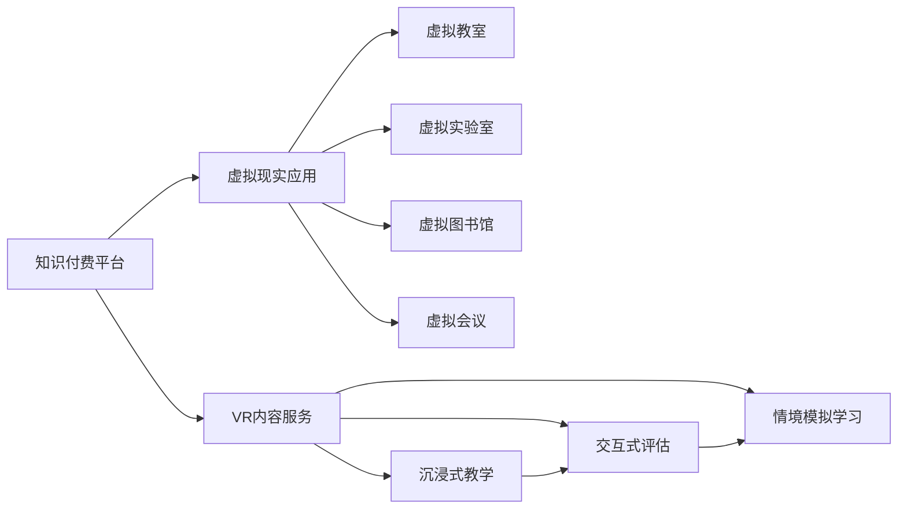

                 

# 如何利用虚拟现实技术提升知识付费体验

## 1. 背景介绍

在数字化时代的浪潮中，知识付费已成为信息消费的重要形式之一。然而，传统的文字、视频等知识呈现方式，难以真实传达复杂抽象的知识点，使得学习体验大打折扣。虚拟现实技术（Virtual Reality, VR）以其沉浸式、交互性的特点，为知识付费带来了新的可能性。通过将VR与知识付费结合，不仅能提升用户的学习体验，还能开辟出全新的知识传递渠道，为知识付费市场注入新的活力。

### 1.1 问题由来

在知识付费的领域中，用户对于互动性和沉浸感的追求日益增强。然而，传统的文字、音频、视频等单向知识传递方式，难以满足用户的多样化需求。此外，知识的抽象性和复杂性，也使得用户难以理解并消化深奥的知识点。

虚拟现实技术通过模拟真实的物理环境和交互操作，能够在知识传递中实现多维度的信息输入与反馈，极大地增强了学习的趣味性和真实性。通过VR技术，用户能够沉浸在知识场景中，通过身临其境的方式学习新知，显著提升了学习效率和互动体验。

### 1.2 问题核心关键点

利用虚拟现实技术提升知识付费体验的核心关键点包括以下几个方面：

- **沉浸式学习体验**：通过虚拟现实，用户能够沉浸在模拟的三维环境中，增强学习的沉浸感和真实感。
- **交互式学习路径**：用户能够通过VR设备与学习内容进行互动，实现自主探索和学习。
- **情景模拟和角色扮演**：在虚拟环境中，用户可以扮演不同的角色，体验不同的情境，从而加深对知识的理解和记忆。
- **实时反馈和互动**：在虚拟现实场景中，学习者能够获得即时的反馈，并通过互动进行自我纠正和优化。

### 1.3 问题研究意义

虚拟现实技术的引入，将显著改变知识付费的现有模式，开启沉浸式、互动式、情景式学习的新篇章。其研究意义在于：

- **提升学习效果**：通过沉浸式和交互式学习方式，使用户更易于理解和掌握复杂知识点。
- **增强用户体验**：通过虚拟现实技术，实现个性化、沉浸式的学习体验，提升用户的参与度和满意度。
- **开拓新应用场景**：虚拟现实技术能够应用于教育、培训、医疗等多个领域，为知识付费的多样化应用提供新的可能性。

## 2. 核心概念与联系

### 2.1 核心概念概述

要充分利用虚拟现实技术提升知识付费体验，首先需要对一些核心概念有清晰的理解：

- **虚拟现实技术(VR)**：通过计算机图形、用户输入设备和传感器等技术，模拟三维环境并生成图像、声音等感官信息，使用户能够在虚拟环境中与虚拟物体进行交互。
- **知识付费**：用户为获取特定知识内容或服务而支付费用的模式。包括在线课程、知识咨询、电子书、软件工具等多种形式。
- **沉浸式学习**：通过构建模拟的环境和情境，使学习者能够全身心地投入学习，达到更高的学习效率。
- **交互式学习**：学习者与学习内容之间存在双向互动，通过反馈机制不断调整学习策略。
- **情境模拟**：在虚拟环境中构建真实情境，让用户能够在特定环境中体验和学习。

### 2.2 核心概念原理和架构的 Mermaid 流程图



此流程图展示了虚拟现实技术在知识付费平台中的应用架构。从平台接入VR应用，到构建虚拟教室、实验室、图书馆和会议等多种场景，最后通过沉浸式教学、交互式评估和情境模拟学习，实现对知识付费体验的全面提升。

## 3. 核心算法原理 & 具体操作步骤

### 3.1 算法原理概述

虚拟现实技术在知识付费中的具体应用，涉及多种算法和技术的融合。其核心算法原理包括但不限于以下几种：

- **空间感知与渲染**：通过计算机图形技术，实时渲染虚拟环境，使用户能够在虚拟空间中移动和交互。
- **人体动作捕捉与控制**：通过传感器和算法，捕捉用户身体动作，并控制虚拟环境中的对象和场景。
- **语音识别与合成**：在虚拟环境中实现语音识别和合成，使用户能够通过语音指令与虚拟场景互动。
- **实时反馈与互动**：通过反馈机制，实时调整用户的行为和决策，提高学习效果。

### 3.2 算法步骤详解

利用虚拟现实技术提升知识付费体验，通常包括以下几个关键步骤：

1. **需求分析与场景设计**：根据知识付费的内容和目标用户，分析学习需求，设计适合的虚拟场景。
2. **VR内容创建与集成**：使用专业的VR内容创作工具，创建或集成适合的教学资源和工具。
3. **用户交互设计与优化**：设计用户与虚拟环境的互动方式，优化用户体验。
4. **技术集成与测试**：将VR技术与知识付费平台进行集成，并进行全面测试，确保系统稳定性和用户体验。
5. **用户反馈与迭代改进**：收集用户反馈，持续优化虚拟现实应用，提升学习效果。

### 3.3 算法优缺点

利用虚拟现实技术提升知识付费体验的算法，具有以下优点：

- **增强沉浸感**：通过虚拟现实技术，用户能够进入模拟的三维环境，增强学习的真实性和沉浸感。
- **提升互动性**：通过交互式设计，用户能够在虚拟环境中自主探索和互动，提高学习主动性和效率。
- **促进个性化学习**：通过虚拟现实技术，实现个性化学习路径和情景模拟，满足不同用户的需求。

同时，该算法也存在一些缺点：

- **技术门槛高**：虚拟现实技术涉及多种先进技术，开发和维护成本较高。
- **设备依赖性强**：用户需要使用VR设备进行体验，普及度相对较低。
- **数据隐私与安全**：虚拟现实环境中用户数据的安全性和隐私保护需要特别注意。

### 3.4 算法应用领域

虚拟现实技术在知识付费中的应用，主要集中在以下几个领域：

- **在线教育**：通过虚拟课堂和实验室，为学生提供沉浸式和交互式的学习体验。
- **企业培训**：在虚拟环境中进行模拟训练和情景模拟，提高员工的技能和安全性。
- **医学教育**：利用虚拟手术室和模拟医疗场景，增强医学学生的实践操作能力和理解。
- **语言学习**：通过虚拟世界中的语言互动和情境模拟，提高语言学习者的听说读写能力。
- **职业培训**：模拟真实工作环境和操作流程，提升职业培训的效果和效率。

## 4. 数学模型和公式 & 详细讲解 & 举例说明

### 4.1 数学模型构建

在虚拟现实技术中，数学模型主要用于空间感知、渲染、人体动作捕捉等方面。以下以空间感知与渲染为例，介绍相关数学模型的构建：

- **三维坐标系**：在虚拟环境中，任何物体的位置都可以通过三维坐标系表示。例如，设点 $(x,y,z)$ 表示空间中的位置。
- **三角剖分**：将三维空间中的物体进行三角剖分，通过三角形面片的组合，实现复杂的几何模型。
- **透视投影**：通过透视投影变换，将三维空间中的物体投影到二维平面上，实现视觉上的逼真效果。

### 4.2 公式推导过程

在虚拟现实技术中，空间感知和渲染的数学公式主要涉及以下内容：

1. **三维坐标变换**：
   $$
   \begin{align*}
   \mathbf{T} &= \begin{bmatrix}
   R & t \\
   0 & 1
   \end{bmatrix}, \\
   \mathbf{P} &= \begin{bmatrix}
   f & 0 & 0 & 0 \\
   0 & f & 0 & 0 \\
   0 & 0 & f & 0 \\
   0 & 0 & 0 & 1
   \end{bmatrix}
   \end{align*}
   $$

   其中 $\mathbf{T}$ 表示平移和旋转矩阵，$\mathbf{P}$ 表示透视投影矩阵。

2. **三角剖分与表面光顺**：
   $$
   \begin{align*}
   N &= \mathbf{T} \cdot n \\
   S &= \mathbf{P} \cdot \mathbf{N} \\
   \end{align*}
   $$

   其中 $N$ 表示物体的法向量，$S$ 表示投影后的光顺表面。

### 4.3 案例分析与讲解

以虚拟现实教室为例，进行案例分析：

1. **场景设计**：设计一个虚拟教室，包括讲台、学生座位、投影仪等元素。
2. **三维建模**：使用专业的三维建模软件，构建各个物体的三维模型。
3. **材质与纹理**：为各个物体设置合适的材质和纹理，增强视觉真实感。
4. **光照与阴影**：设置光源和阴影效果，使场景更加立体和逼真。
5. **交互设计**：设计学生与讲台、投影仪等元素之间的交互方式，如举手提问、点击课件等。

## 5. 项目实践：代码实例和详细解释说明

### 5.1 开发环境搭建

要实现虚拟现实技术在知识付费中的应用，首先需要搭建合适的开发环境。以下是一个简单的开发环境配置流程：

1. **安装VRSDK**：选择合适的VRSDK，如Unity3D或Unreal Engine，并按照官方文档进行安装和配置。
2. **安装VR设备**：购买或租赁适合的VR设备，如头戴式显示器和手柄控制器。
3. **搭建开发平台**：在PC或服务器上搭建开发平台，并配置所需的开发工具和库。
4. **调试测试环境**：在测试环境中进行初步调试，确保硬件设备正常工作。

### 5.2 源代码详细实现

以下是一个简单的VR知识付费平台的源代码实现示例：

```python
import pyglet
from pyglet import window
from pyglet import graphics

# 创建窗口
window = window.Window()
window.set_fullscreen(True)

# 加载VR场景
scene = pyglet.load('virtual_reality_scene.py')

# 渲染场景
def draw(batch):
    batch.draw(scene)

# 渲染循环
window.set_on_draw(draw)
window.run()
```

### 5.3 代码解读与分析

**pyglet**：这是一个跨平台的图形渲染库，用于开发2D和3D图形应用。

**虚拟现实场景**：通过pyglet加载虚拟现实场景文件，实现三维空间的渲染。

**渲染循环**：在渲染循环中，通过调用 `draw` 函数实现场景的持续渲染。

**窗口管理**：使用 `pyglet` 的 `Window` 类创建窗口，并设置全屏模式，确保渲染效果最大化。

### 5.4 运行结果展示

运行上述代码后，会在屏幕上显示一个虚拟现实教室的场景。用户可以通过手柄控制器在虚拟环境中进行移动和互动，体验沉浸式学习。

## 6. 实际应用场景

### 6.1 智慧教育

在智慧教育领域，虚拟现实技术可以为学生提供沉浸式和交互式的学习体验。例如，在虚拟实验室中，学生可以进行实验操作，观察实验结果，记录实验数据，大大提升了实验课程的实践性和趣味性。

### 6.2 企业培训

在企业培训中，虚拟现实技术可以模拟真实的工作环境和操作流程，提高员工的技能和安全性。例如，通过虚拟手术室，医生可以模拟手术操作，提高手术技巧和成功率。

### 6.3 医学教育

在医学教育中，虚拟现实技术可以构建虚拟手术室和模拟医疗场景，帮助医学生进行实践操作和情境模拟，增强他们的临床技能和理解能力。

### 6.4 语言学习

在语言学习中，虚拟现实技术可以创建虚拟语言环境，让学生沉浸在语言场景中进行听说读写训练，提升语言学习效果。

### 6.5 职业培训

在职业培训中，虚拟现实技术可以模拟真实的工作环境，帮助学员进行技能操作和情境模拟，提高培训效果和效率。

## 7. 工具和资源推荐

### 7.1 学习资源推荐

为了更好地掌握虚拟现实技术在知识付费中的应用，以下是一些优质的学习资源：

1. **《虚拟现实技术基础》课程**：由VR领域专家开设的在线课程，系统介绍虚拟现实技术的原理和应用。
2. **《VR开发实战》书籍**：详细讲解VR开发所需的工具和技术，包括Unity3D和Unreal Engine的开发。
3. **VR开发者社区**：如VR开发者论坛，提供最新的VR技术和应用案例，分享开发经验和心得。

### 7.2 开发工具推荐

VR技术开发常用的工具包括：

1. **Unity3D**：一个跨平台的3D游戏引擎，支持VR开发，易于上手和部署。
2. **Unreal Engine**：一个功能强大的游戏引擎，支持复杂的虚拟场景和交互设计。
3. **GVRSDK**：Google开发的VRSDK，适用于Android和iOS设备，支持多人互动和虚拟环境渲染。
4. **OpenXR**：一个跨平台的VR标准，支持多种VR设备和平台，实现设备的统一管理和交互。

### 7.3 相关论文推荐

以下是一些关于虚拟现实技术在知识付费应用的经典论文：

1. **《虚拟现实技术在教育中的应用》**：介绍了虚拟现实技术在教育中的多场景应用，提升学习效果和互动性。
2. **《基于虚拟现实的企业培训系统》**：探讨了虚拟现实技术在企业培训中的优势和实现方法，提高员工技能和安全性。
3. **《医学教育中的虚拟现实技术》**：分析了虚拟现实技术在医学教育中的实际应用，提升医学学生的实践操作能力和理解。
4. **《虚拟现实语言学习系统》**：研究了虚拟现实技术在语言学习中的应用，提升语言学习的趣味性和效果。
5. **《虚拟现实在职业培训中的应用》**：探讨了虚拟现实技术在职业培训中的应用，提高培训效果和效率。

## 8. 总结：未来发展趋势与挑战

### 8.1 研究成果总结

本文对虚拟现实技术在知识付费中的应用进行了全面系统的介绍。通过具体案例和代码实现，展示了虚拟现实技术如何通过沉浸式、交互式、情景式学习，提升知识付费体验。本文还分析了虚拟现实技术在多个领域的应用前景，提出了具体的开发方法和优化策略。

### 8.2 未来发展趋势

虚拟现实技术在知识付费领域的应用前景广阔，未来可能呈现以下几个发展趋势：

1. **沉浸感与互动性的提升**：随着技术的进步，虚拟现实设备的体验将更加逼真和互动，用户沉浸感将进一步增强。
2. **多场景和多设备整合**：虚拟现实技术将更多地应用于不同场景和设备，实现跨平台和跨设备的无缝连接。
3. **实时反馈与自适应学习**：通过实时反馈和自适应算法，用户能够在虚拟环境中获得更个性化的学习路径和指导。
4. **协作学习与社交互动**：虚拟现实技术将支持多人协作和社交互动，增强学习体验和社交价值。
5. **混合现实与增强现实**：虚拟现实技术将与混合现实（MR）和增强现实（AR）技术结合，实现更加灵活和多样化的学习方式。

### 8.3 面临的挑战

尽管虚拟现实技术在知识付费中的应用前景广阔，但也面临以下挑战：

1. **技术门槛高**：虚拟现实技术涉及多种先进技术和工具，开发和维护成本较高。
2. **设备依赖性强**：用户需要使用VR设备进行体验，普及度相对较低。
3. **数据隐私与安全**：虚拟现实环境中用户数据的安全性和隐私保护需要特别注意。
4. **用户接受度**：用户对虚拟现实技术的接受度和使用习惯仍需进一步培养。

### 8.4 研究展望

面对这些挑战，未来需要在以下几个方面进行深入研究：

1. **技术普及与降低成本**：开发更加易用和经济的技术方案，降低虚拟现实应用的门槛。
2. **设备优化与创新**：设计更加轻便、便携和高效的VR设备，提升用户体验。
3. **数据隐私与安全保护**：开发更加安全、可靠的隐私保护技术，保障用户数据安全。
4. **多学科整合与创新**：将虚拟现实技术与心理学、教育学、社会学等学科结合，推动知识付费应用的多样化和创新。

## 9. 附录：常见问题与解答

### Q1：虚拟现实技术在知识付费中主要有哪些应用场景？

A：虚拟现实技术在知识付费中的应用主要包括以下几个场景：

1. **在线教育**：通过虚拟课堂和实验室，提供沉浸式和交互式的学习体验。
2. **企业培训**：模拟真实的工作环境和操作流程，提高员工的技能和安全性。
3. **医学教育**：构建虚拟手术室和模拟医疗场景，提升医学生的实践操作能力和理解。
4. **语言学习**：创建虚拟语言环境，提升语言学习的趣味性和效果。
5. **职业培训**：模拟真实的工作环境，提高培训效果和效率。

### Q2：虚拟现实技术在知识付费中的开发流程是怎样的？

A：虚拟现实技术在知识付费中的开发流程主要包括：

1. **需求分析与场景设计**：根据知识付费的内容和目标用户，分析学习需求，设计适合的虚拟场景。
2. **VR内容创建与集成**：使用专业的VR内容创作工具，创建或集成适合的教学资源和工具。
3. **用户交互设计与优化**：设计用户与虚拟环境的互动方式，优化用户体验。
4. **技术集成与测试**：将VR技术与知识付费平台进行集成，并进行全面测试，确保系统稳定性和用户体验。
5. **用户反馈与迭代改进**：收集用户反馈，持续优化虚拟现实应用，提升学习效果。

### Q3：虚拟现实技术在知识付费中的应用有哪些优势？

A：虚拟现实技术在知识付费中的应用具有以下优势：

1. **增强沉浸感**：通过虚拟现实技术，用户能够进入模拟的三维环境，增强学习的真实性和沉浸感。
2. **提升互动性**：通过交互式设计，用户能够在虚拟环境中自主探索和互动，提高学习主动性和效率。
3. **促进个性化学习**：通过虚拟现实技术，实现个性化学习路径和情景模拟，满足不同用户的需求。

### Q4：虚拟现实技术在知识付费中需要注意哪些问题？

A：虚拟现实技术在知识付费中需要注意以下几个问题：

1. **技术门槛高**：虚拟现实技术涉及多种先进技术，开发和维护成本较高。
2. **设备依赖性强**：用户需要使用VR设备进行体验，普及度相对较低。
3. **数据隐私与安全**：虚拟现实环境中用户数据的安全性和隐私保护需要特别注意。

### Q5：虚拟现实技术在知识付费中的未来发展趋势有哪些？

A：虚拟现实技术在知识付费中的未来发展趋势包括：

1. **沉浸感与互动性的提升**：随着技术的进步，虚拟现实设备的体验将更加逼真和互动，用户沉浸感将进一步增强。
2. **多场景和多设备整合**：虚拟现实技术将更多地应用于不同场景和设备，实现跨平台和跨设备的无缝连接。
3. **实时反馈与自适应学习**：通过实时反馈和自适应算法，用户能够在虚拟环境中获得更个性化的学习路径和指导。
4. **协作学习与社交互动**：虚拟现实技术将支持多人协作和社交互动，增强学习体验和社交价值。
5. **混合现实与增强现实**：虚拟现实技术将与混合现实（MR）和增强现实（AR）技术结合，实现更加灵活和多样化的学习方式。

---

作者：禅与计算机程序设计艺术 / Zen and the Art of Computer Programming

