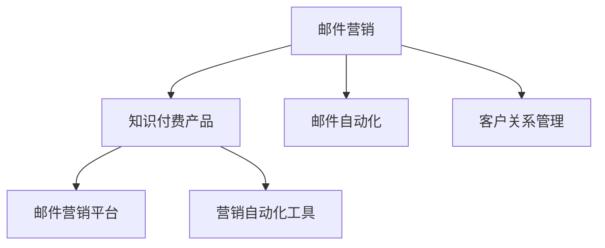

                 

# 如何利用邮件营销推广知识付费产品

> 关键词：邮件营销,知识付费,邮件自动化,客户关系管理,CRM系统,营销自动化工具,ROI计算

## 1. 背景介绍

### 1.1 问题由来
知识付费近年来成为互联网领域的热门话题，随之产生的是大量知识付费产品和服务。这些产品和服务通常包含高质量的内容、专业的知识和实用的技能，对于想要提升个人能力、加速职业发展的用户来说，具有极大的吸引力。然而，尽管市场上有众多知识付费产品，但能够有效吸引用户、持续转化用户的却不多见。

特别是对于平台方而言，如何高效地推广产品，吸引并留存用户，提升营销效果和投资回报率（ROI），成为了一个重要的挑战。传统的推广方式如搜索引擎优化（SEO）、社交媒体营销等，虽然有其优势，但在信息爆炸的时代，这些方式的效果和投入产出比也在不断下降。

### 1.2 问题核心关键点
邮件营销作为一种古老但有效的营销方式，虽然常被忽略，但在知识付费产品推广中却有其独特优势。通过定向化的邮件推广，能够有效吸引潜在用户，通过精准的营销内容设计，能够在提升用户转化率和忠诚度的同时，最大化投资回报。

邮件营销的核心关键点包括：
- **定向性**：根据用户行为数据和属性标签，精准定位目标用户。
- **个性化**：根据用户兴趣和行为，推送定制化内容。
- **频率控制**：通过合理规划邮件发送频率，避免打扰用户，同时保持用户关注。
- **效果跟踪**：通过数据分析工具，跟踪邮件营销的效果，及时调整策略。

### 1.3 问题研究意义
利用邮件营销推广知识付费产品，对于提升营销效果、降低运营成本、提高用户转化率和忠诚度具有重要意义：

1. **提升营销效果**：邮件营销能够精准触达目标用户，通过个性化内容设计和定向推送，有效提升用户点击率和转化率。
2. **降低运营成本**：相比于传统广告和社交媒体营销，邮件营销的成本更低，且能够高效利用已有用户数据。
3. **提高用户转化率和忠诚度**：通过定制化的邮件内容，能够满足用户的实际需求，提高用户满意度和忠诚度。
4. **提升投资回报率**：精准的目标用户定位和高效的转化率，能够显著提高营销活动的投资回报率。

## 2. 核心概念与联系

### 2.1 核心概念概述

为更好地理解邮件营销在知识付费产品推广中的应用，本节将介绍几个关键概念：

- **邮件营销（Email Marketing）**：通过电子邮件向目标用户推送营销信息，包括新闻、促销活动、产品信息等。常见的邮件营销形式包括电子邮件直邮、电子邮件列表等。

- **知识付费产品**：通过互联网平台提供的有偿知识分享服务，包括在线课程、电子书、视频教程等，旨在提供有价值的内容，满足用户的学习和提升需求。

- **邮件自动化（Email Automation）**：通过邮件营销工具，自动发送个性化邮件，提升邮件营销的效率和效果。

- **客户关系管理（Customer Relationship Management, CRM）**：通过收集、管理和分析客户数据，实现对客户行为的预测和客户关系的维护。

- **邮件营销平台**：提供邮件营销功能的服务平台，如Mailchimp、SendinBlue等。

- **营销自动化工具**：通过自动化流程和技术手段，提高营销活动的效率和效果。

这些概念之间的联系可以通过以下Mermaid流程图来展示：



这个流程图展示了几大关键概念之间的联系：

1. 邮件营销是知识付费产品推广的主要手段。
2. 邮件自动化和客户关系管理是邮件营销的关键组成部分。
3. 邮件营销平台和营销自动化工具提供了技术支持。

## 3. 核心算法原理 & 具体操作步骤

### 3.1 算法原理概述

邮件营销的核心原理是通过发送定向的、个性化的电子邮件，吸引用户关注和购买。其基本流程包括：

1. **数据收集和处理**：收集目标用户的邮件地址、行为数据、属性标签等，进行分析处理。
2. **邮件内容设计**：根据用户数据，设计符合用户需求和兴趣的邮件内容。
3. **邮件发送和跟踪**：将邮件发送给目标用户，跟踪用户行为和反馈，调整优化邮件策略。

### 3.2 算法步骤详解

以下是以邮件营销推广知识付费产品为例，详细讲解邮件营销的具体操作步骤：

**Step 1: 收集和整理用户数据**

- 获取目标用户的邮件地址和行为数据：如网站访问记录、课程浏览记录等。
- 分析用户属性标签：如年龄、职业、兴趣等，确定目标用户的特征和需求。
- 建立邮件营销数据库：将用户数据整理、分类，建立邮件营销数据库，为后续的邮件发送和分析提供数据支持。

**Step 2: 设计邮件内容**

- 确定邮件主题和内容：根据用户属性和行为数据，设计符合用户兴趣的邮件主题和内容。
- 设计邮件格式和排版：选择邮件模板和样式，进行排版和设计，确保邮件内容美观、易读。
- 添加个性化元素：根据用户数据，添加个性化的信息，如用户姓名、推荐内容等。

**Step 3: 设置邮件策略**

- 确定邮件发送频率：根据用户反馈和行为数据，设置合理的邮件发送频率，避免打扰用户。
- 定义邮件发送渠道：选择合适的邮件发送渠道，如企业自建邮件系统、第三方邮件营销平台等。
- 设置邮件跟踪机制：在邮件中添加追踪链接，记录用户点击、打开、回复等行为，分析邮件效果。

**Step 4: 执行邮件发送**

- 选择邮件营销工具：选择合适的邮件营销平台或工具，如Mailchimp、SendinBlue等。
- 发送测试邮件：先发送测试邮件，检查邮件格式、内容和发送效果，优化邮件策略。
- 批量发送邮件：在确保邮件效果和用户体验的前提下，批量发送邮件至目标用户。

**Step 5: 跟踪和优化**

- 跟踪邮件效果：通过邮件营销平台提供的跟踪功能，记录用户行为和反馈，分析邮件效果。
- 优化邮件策略：根据邮件效果数据，调整邮件内容、发送频率和策略，提升邮件营销效果。

### 3.3 算法优缺点

邮件营销在推广知识付费产品中具有以下优点：

- **精准触达**：能够精准触达目标用户，提高邮件的打开率和点击率。
- **成本低廉**：相比于其他推广方式，邮件营销的成本较低，能够高效利用已有用户数据。
- **效果可控**：通过邮件内容设计和策略调整，能够显著提升用户转化率和忠诚度。
- **易于实施**：邮件营销的技术门槛较低，能够快速实施并见效。

同时，邮件营销也存在一些局限性：

- **容易被视为垃圾邮件**：用户可能会将大量营销邮件视为垃圾邮件，拒绝打开或删除。
- **依赖用户数据**：邮件营销的效果依赖于目标用户数据的准确性和完整性。
- **隐私问题**：收集和处理用户数据时，需要注意隐私保护和法律法规要求。
- **用户行为变化**：用户的兴趣和需求可能会随时间变化，需要不断调整邮件策略。

### 3.4 算法应用领域

邮件营销在知识付费产品推广中的应用领域包括：

- **课程推荐**：根据用户兴趣和行为数据，推荐符合用户需求的课程，提高课程购买转化率。
- **活动通知**：推送新课程上线、优惠活动、讲座等信息，吸引用户关注和参与。
- **用户回访**：定期向用户发送课程使用情况报告、学习进展提醒等邮件，保持用户活跃度。
- **用户调查**：通过邮件调查用户满意度、需求等，收集反馈，改进产品和服务。
- **用户维系**：通过定期的关怀邮件、专属优惠等，提升用户满意度和忠诚度。

## 4. 数学模型和公式 & 详细讲解 & 举例说明

### 4.1 数学模型构建

在邮件营销中，常用的数学模型包括回归模型、分类模型、聚类模型等，用于分析和预测用户行为。

以回归模型为例，设邮件营销的效果为 $Y$，影响因素包括邮件内容 $X_1$、用户属性 $X_2$、发送时间 $X_3$ 等，回归模型可以表示为：

$$
Y = \beta_0 + \beta_1 X_1 + \beta_2 X_2 + \beta_3 X_3 + \epsilon
$$

其中，$\beta_0$ 为截距，$\beta_1$、$\beta_2$、$\beta_3$ 为回归系数，$\epsilon$ 为误差项。

### 4.2 公式推导过程

假设我们有一个包含100个用户的邮件营销数据集，其中邮件内容 $X_1$ 取值为0或1（表示是否发送了个性化邮件内容），用户属性 $X_2$ 为用户的年龄，发送时间 $X_3$ 为邮件发送的时间，邮件效果 $Y$ 为邮件的打开率和点击率。我们可以使用线性回归模型对邮件效果进行预测和分析。

假设邮件效果 $Y$ 与邮件内容 $X_1$、用户属性 $X_2$、发送时间 $X_3$ 之间的关系如下：

$$
Y = \beta_0 + \beta_1 X_1 + \beta_2 X_2 + \beta_3 X_3 + \epsilon
$$

假设我们的数据集已经标准化，即 $X_1$、$X_2$、$X_3$ 的均值为0，标准差为1。通过最小二乘法，我们可以求得回归系数 $\beta_1$、$\beta_2$、$\beta_3$，进而构建邮件效果的预测模型。

通过回归模型的训练和验证，我们可以得到邮件效果与邮件内容、用户属性和发送时间之间的关系，进而优化邮件策略，提升邮件营销的效果。

### 4.3 案例分析与讲解

假设我们收集到了一个包含1000个用户的邮件营销数据集，其中邮件效果 $Y$ 表示邮件的点击率，邮件内容 $X_1$ 表示是否发送了个性化邮件内容，用户属性 $X_2$ 表示用户的年龄，发送时间 $X_3$ 表示邮件发送的时间。我们可以通过训练一个线性回归模型，来分析邮件内容、用户属性和发送时间对邮件效果的影响。

假设我们的模型为：

$$
Y = \beta_0 + \beta_1 X_1 + \beta_2 X_2 + \beta_3 X_3 + \epsilon
$$

通过最小二乘法，我们可以得到回归系数 $\beta_1$、$\beta_2$、$\beta_3$，进而构建邮件效果的预测模型。例如，如果回归结果显示 $\beta_1 = 0.5$、$\beta_2 = -0.2$、$\beta_3 = 0.3$，则说明发送个性化邮件内容、年龄较低的用户、在特定时间发送邮件，能够显著提升邮件的点击率。

## 5. 项目实践：代码实例和详细解释说明

### 5.1 开发环境搭建

在进行邮件营销实践前，我们需要准备好开发环境。以下是使用Python进行邮件营销开发的环境配置流程：

1. 安装Anaconda：从官网下载并安装Anaconda，用于创建独立的Python环境。

2. 创建并激活虚拟环境：
```bash
conda create -n email-env python=3.8 
conda activate email-env
```

3. 安装PyTorch：根据CUDA版本，从官网获取对应的安装命令。例如：
```bash
conda install pytorch torchvision torchaudio cudatoolkit=11.1 -c pytorch -c conda-forge
```

4. 安装相关库：
```bash
pip install pandas numpy matplotlib sklearn scikit-learn joblib
```

5. 安装邮件营销工具：
```bash
pip install email-templater
```

完成上述步骤后，即可在`email-env`环境中开始邮件营销实践。

### 5.2 源代码详细实现

以下是一个简单的邮件营销代码实现，包括邮件内容设计、邮件发送和效果跟踪：

```python
from email_templater import EmailTemplater
from sklearn.linear_model import LinearRegression
import pandas as pd

# 邮件内容设计
template = EmailTemplater('path/to/template.html')
template.add('subject', '新课程推荐')
template.add('greeting', '尊敬的', '您好', '！')
template.add('course_info', '我们推荐您学习以下课程：')
template.add('button_link', 'https://example.com/course')

# 邮件发送和效果跟踪
def send_emails(data):
    emails = []
    for _, row in data.iterrows():
        email = template.render(
            name=row['name'],
            age=row['age'],
            time=row['time']
        )
        emails.append(email)
    return emails

# 数据准备
data = pd.read_csv('emails.csv')

# 邮件发送和效果跟踪
emails = send_emails(data)

# 效果跟踪
def track_emails(data, emails):
    for i, email in enumerate(emails):
        # 发送邮件并记录效果
        # 这里的实现需要根据具体邮件发送平台进行调整
        response = send_email(email)
        if response['status'] == 'success':
            print(f"邮件{email['id']}发送成功，点击率：{email['open_rate']:.2%}, 点击链接{email['click_rate']:.2%}")
        else:
            print(f"邮件{email['id']}发送失败：{response['error']}")
```

以上就是邮件营销的基本代码实现。通过使用邮件模板和邮件发送工具，可以设计符合用户需求的邮件内容，并通过邮件营销平台发送邮件，同时记录邮件的效果和反馈，进行效果跟踪和优化。

### 5.3 代码解读与分析

让我们再详细解读一下关键代码的实现细节：

**EmailTemplater类**：
- `__init__`方法：初始化邮件模板和内容。
- `add`方法：添加邮件模板中的变量和值。

**send_emails函数**：
- 遍历邮件数据集，根据用户数据生成邮件内容。
- 将生成的邮件内容存储到列表中。

**track_emails函数**：
- 遍历生成的邮件列表，发送邮件并记录效果。
- 通过邮件营销平台提供的接口，获取邮件的打开率和点击率等效果数据。

**数据准备**：
- 通过Pandas库读取邮件数据集，为后续的邮件设计和发送提供数据支持。

**邮件发送和效果跟踪**：
- 通过调用邮件发送平台提供的接口，发送邮件并记录效果。
- 效果跟踪需要根据具体的邮件营销平台进行实现。

可以看到，通过Python和邮件营销工具，我们可以高效地设计和发送邮件，同时跟踪邮件的效果，不断优化邮件策略。

## 6. 实际应用场景

### 6.1 智能客服系统

在智能客服系统中，通过邮件营销推广知识付费产品，可以提升客服系统的智能化水平，提高用户满意度。例如，用户通过智能客服系统咨询课程信息后，系统可以发送个性化的课程推荐邮件，吸引用户进行进一步的购买和互动。

在技术实现上，可以通过收集用户咨询记录和购买行为，将其作为邮件营销的原始数据，通过机器学习算法进行分析和建模，设计符合用户需求的邮件内容，并通过智能客服系统发送邮件，提升用户转化率。

### 6.2 教育培训机构

教育培训机构可以通过邮件营销推广各类知识付费产品，如在线课程、线下培训等。例如，针对新课程发布，可以通过邮件推送课程介绍、优惠活动等信息，吸引用户报名参加。

在技术实现上，可以通过收集用户的学习记录和行为数据，设计符合用户需求的邮件内容，并通过邮件营销平台发送邮件，提升课程报名率。同时，可以通过邮件调查收集用户反馈，改进课程内容和教学方法。

### 6.3 在线书店

在线书店可以通过邮件营销推广各类电子书、有声书等知识付费产品，吸引用户购买和阅读。例如，针对新书发布，可以通过邮件推送书评、推荐、折扣信息，吸引用户关注和购买。

在技术实现上，可以通过收集用户浏览记录和购买行为，设计符合用户需求的邮件内容，并通过邮件营销平台发送邮件，提升电子书购买率。同时，可以通过邮件调查收集用户反馈，改进书籍推荐算法。

## 7. 工具和资源推荐

### 7.1 学习资源推荐

为了帮助开发者系统掌握邮件营销的理论基础和实践技巧，这里推荐一些优质的学习资源：

1. 《邮件营销从入门到精通》书籍：详细介绍了邮件营销的理论基础、实践技巧和工具使用。
2. Coursera《数字营销：电子邮件和社交媒体》课程：由著名营销专家授课，涵盖电子邮件营销的原理和实践。
3. HubSpot博客：提供丰富的邮件营销实战案例和最佳实践，适合初学者和进阶者学习。
4. Mailchimp官方文档：详细介绍了Mailchimp邮件营销平台的使用方法和功能，适合具体工具使用。
5. Gmail营销指南：提供了Gmail邮件营销的详细指南，适合使用Gmail发送邮件的用户参考。

通过对这些资源的学习实践，相信你一定能够快速掌握邮件营销的精髓，并用于解决实际的营销问题。

### 7.2 开发工具推荐

高效的开发离不开优秀的工具支持。以下是几款用于邮件营销开发的常用工具：

1. Mailchimp：全球领先的邮件营销平台，提供全面的邮件营销功能，包括邮件设计、邮件发送、效果跟踪等。
2. SendinBlue：提供邮件营销、短信营销、自动化工具等一体化的营销解决方案。
3. Email Templater：提供邮件模板设计和邮件发送功能，支持多种邮件营销平台。
4. HubSpot：提供全面的营销自动化和客户关系管理功能，帮助企业构建完整的营销闭环。
5. Zapier：提供邮件营销自动化和流程集成功能，帮助企业高效管理邮件营销流程。

合理利用这些工具，可以显著提升邮件营销的效率和效果，实现更高转化率和投资回报。

### 7.3 相关论文推荐

邮件营销的发展源于学界的持续研究。以下是几篇奠基性的相关论文，推荐阅读：

1. "Email Marketing in the Digital Age: A Review and Future Directions"（数字时代下的邮件营销：综述与未来方向）：全面综述了邮件营销的发展历程、应用案例和未来趋势。
2. "Personalization in Email Marketing: A Review of Empirical Studies"（电子邮件营销中的个性化：实证研究综述）：详细介绍了个性化邮件营销的研究现状和应用效果。
3. "Optimizing Email Campaigns for Maximum ROI"（优化电子邮件营销以最大化ROI）：探讨了邮件营销中的ROI优化策略和方法。
4. "Customer Segmentation in Email Marketing: A Data Mining Approach"（电子邮件营销中的客户细分：数据挖掘方法）：讨论了通过数据挖掘技术进行客户分段的邮件营销策略。
5. "Email Marketing Analytics: A Comprehensive Guide"（电子邮件营销分析：全面指南）：提供了邮件营销效果分析和优化的方法和工具。

这些论文代表了大语言模型微调技术的发展脉络。通过学习这些前沿成果，可以帮助研究者把握学科前进方向，激发更多的创新灵感。

## 8. 总结：未来发展趋势与挑战

### 8.1 总结

本文对利用邮件营销推广知识付费产品的方法进行了全面系统的介绍。首先阐述了邮件营销在知识付费产品推广中的重要性和优势，明确了邮件营销在提升营销效果、降低运营成本、提高用户转化率和忠诚度方面的独特价值。其次，从原理到实践，详细讲解了邮件营销的具体操作步骤，给出了邮件营销任务开发的完整代码实例。同时，本文还广泛探讨了邮件营销在智能客服、教育培训机构、在线书店等多个行业领域的应用前景，展示了邮件营销范式的巨大潜力。最后，本文精选了邮件营销技术的各类学习资源，力求为读者提供全方位的技术指引。

通过本文的系统梳理，可以看到，邮件营销作为一种高效、精准、个性化的营销手段，在知识付费产品推广中具有广阔的应用前景。利用邮件营销，可以精准触达目标用户，通过个性化内容设计和定向推送，有效提升用户点击率和转化率，实现更高的投资回报。

### 8.2 未来发展趋势

展望未来，邮件营销将呈现以下几个发展趋势：

1. **更加个性化**：通过进一步的数据分析和机器学习，邮件内容将更加个性化，能够更好地满足用户需求和兴趣。
2. **自动化和智能化**：邮件营销将与营销自动化和智能化工具深度融合，实现更加高效和精准的邮件营销。
3. **跨渠道整合**：邮件营销将与社交媒体、短信、APP等渠道整合，形成全渠道营销闭环，提升用户转化率。
4. **数据驱动决策**：通过数据分析和人工智能技术，邮件营销将更加数据驱动，实时优化邮件策略。
5. **隐私保护**：随着用户隐私意识的增强，邮件营销将更加注重用户隐私保护，采用匿名化、去标识化等技术手段。

以上趋势凸显了邮件营销技术的前景和潜力，这些方向的探索发展，必将进一步提升邮件营销的效果和用户体验，为知识付费产品推广提供更强的动力。

### 8.3 面临的挑战

尽管邮件营销在知识付费产品推广中具有显著优势，但在实现精准营销、提升用户转化率和忠诚度的过程中，仍面临诸多挑战：

1. **数据质量**：邮件营销的效果依赖于用户数据的准确性和完整性，如何获取高质量的邮件数据，是邮件营销的第一步。
2. **用户行为变化**：用户的兴趣和需求可能会随时间变化，需要不断调整邮件策略，确保邮件内容符合用户需求。
3. **隐私问题**：收集和处理用户数据时，需要注意隐私保护和法律法规要求。
4. **邮件投递率**：邮件的投递率受多种因素影响，如垃圾邮件过滤器、用户取消订阅等，如何提升邮件投递率，是邮件营销的重要问题。
5. **效果衡量**：邮件营销效果的衡量和跟踪需要科学的指标和方法，如何建立有效的邮件效果评估体系，是邮件营销的关键。

正视邮件营销面临的这些挑战，积极应对并寻求突破，将使邮件营销在知识付费产品推广中发挥更大的作用。相信随着学界和产业界的共同努力，邮件营销将不断优化，成为知识付费产品推广的重要手段。

### 8.4 研究展望

面对邮件营销面临的种种挑战，未来的研究需要在以下几个方面寻求新的突破：

1. **数据质量提升**：开发更加高效的数据收集和处理技术，获取高质量的邮件数据，为邮件营销提供数据支持。
2. **用户行为预测**：引入机器学习、深度学习等技术，预测用户行为和需求，设计更符合用户需求的邮件内容。
3. **隐私保护机制**：开发匿名化、去标识化等技术手段，确保邮件营销中的用户隐私保护。
4. **邮件效果优化**：通过A/B测试、多臂老虎机等方法，优化邮件内容和策略，提升邮件投递率和点击率。
5. **跨渠道整合**：将邮件营销与其他渠道如社交媒体、短信、APP等深度融合，形成全渠道营销闭环。

这些研究方向的探索，必将引领邮件营销技术迈向更高的台阶，为知识付费产品推广提供更强的动力。总之，邮件营销需要开发者根据具体任务，不断迭代和优化邮件策略，方能得到理想的效果。

## 9. 附录：常见问题与解答

**Q1：邮件营销在知识付费产品推广中有哪些优势？**

A: 邮件营销在知识付费产品推广中有以下优势：

1. **精准触达**：能够精准触达目标用户，提高邮件的打开率和点击率。
2. **成本低廉**：相比于其他推广方式，邮件营销的成本较低，能够高效利用已有用户数据。
3. **效果可控**：通过邮件内容设计和策略调整，能够显著提升用户转化率和忠诚度。
4. **易于实施**：邮件营销的技术门槛较低，能够快速实施并见效。

**Q2：邮件营销的核心步骤有哪些？**

A: 邮件营销的核心步骤包括：

1. 数据收集和处理：收集目标用户的邮件地址和行为数据，分析用户属性和行为。
2. 邮件内容设计：根据用户数据，设计符合用户需求和兴趣的邮件内容。
3. 邮件发送和效果跟踪：将邮件发送给目标用户，跟踪用户行为和反馈，调整优化邮件策略。

**Q3：如何进行邮件营销的ROI计算？**

A: 邮件营销的ROI计算包括以下步骤：

1. 确定邮件营销的目标：如提升课程购买转化率、增加网站访问量等。
2. 确定邮件营销的成本：如邮件制作成本、邮件发送费用等。
3. 计算邮件营销的效果：如邮件打开率、点击率、转化率等。
4. 计算邮件营销的收入：如课程购买收入、广告收入等。
5. 计算邮件营销的ROI：ROI = 邮件营销收入 / 邮件营销成本。

**Q4：如何进行邮件内容的个性化设计？**

A: 邮件内容的个性化设计可以通过以下方法实现：

1. 收集用户数据：如用户兴趣、行为、购买记录等，建立用户画像。
2. 设计个性化模板：根据用户画像，设计符合用户需求和兴趣的邮件模板。
3. 添加个性化元素：根据用户数据，添加个性化的信息，如用户姓名、推荐内容等。

**Q5：如何应对邮件营销中的垃圾邮件过滤问题？**

A: 应对邮件营销中的垃圾邮件过滤问题，可以通过以下方法：

1. 优化邮件内容：避免使用过于夸张的标题和内容，设计符合用户需求和兴趣的邮件内容。
2. 增加可信度：在邮件中增加可信度标志，如品牌标识、官方认证等。
3. 发送时机选择：选择用户最有可能打开邮件的时机，如节假日、工作时间等。
4. 用户许可管理：确保用户明确许可接收邮件，避免被系统识别为垃圾邮件。

**Q6：如何优化邮件营销的效果？**

A: 优化邮件营销的效果可以通过以下方法：

1. 数据分析：通过数据分析工具，分析邮件效果，识别用户行为和反馈。
2. 策略调整：根据数据分析结果，调整邮件内容、发送频率和策略。
3. 测试优化：通过A/B测试、多臂老虎机等方法，优化邮件内容和策略，提升邮件效果。
4. 用户互动：通过邮件互动功能，增强用户参与度，提升用户转化率和忠诚度。

这些方法能够帮助邮件营销在知识付费产品推广中发挥更大的作用，提升营销效果和投资回报。

