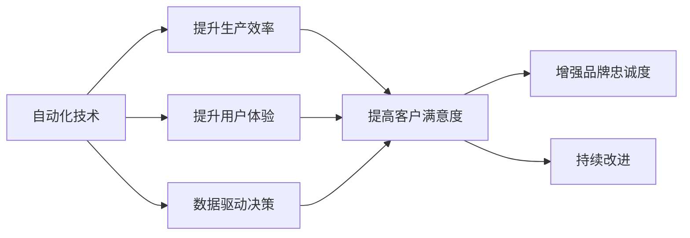

                 

# 如何在自动化创业中建立品牌忠诚度

## 1. 背景介绍

在当今快速变化的市场环境中，品牌忠诚度已成为企业竞争力的关键。特别是对于那些依赖自动化技术驱动的创业公司，品牌忠诚度不仅有助于保持现有客户，还能吸引新客户并提高市场份额。在自动化领域，品牌忠诚度不仅关系到客户满意度，还关系到公司的长期生存和发展。

### 1.1 自动化创业的现状与挑战

自动化创业，也称为“AI+”创业，是利用人工智能和自动化技术来驱动商业模式的创新和发展。自动化创业涵盖了广泛的应用场景，包括机器人流程自动化（RPA）、自动驾驶、智能客服、智能制造等。随着技术的不断进步，自动化创业已成为一个热门领域，吸引了大量的投资和人才。然而，面对激烈的市场竞争，自动化创业企业仍然面临着诸多挑战，包括技术迭代迅速、市场变化快速、客户需求多变等。

在这样一个高度竞争的环境中，品牌忠诚度成为企业生存和发展的关键。本文将探讨如何在自动化创业中建立品牌忠诚度，帮助企业赢得市场竞争，实现可持续发展。

## 2. 核心概念与联系

### 2.1 核心概念概述

要建立品牌忠诚度，首先需要理解一些核心概念及其相互联系：

- **品牌忠诚度**：指客户对品牌的偏好和信任程度，表现为客户的重复购买行为、积极口碑传播和长期依赖。
- **自动化技术**：包括机器学习、深度学习、自然语言处理、计算机视觉等技术，用于提高生产效率、优化决策过程和提升客户体验。
- **客户满意度**：衡量客户对产品或服务的满意程度，是影响品牌忠诚度的重要因素。
- **用户体验（UX）**：通过设计直观、易用、高效的应用，提升用户的满意度和信任感。
- **数据驱动决策**：利用数据分析和机器学习技术，优化产品和服务，提高决策效率和准确性。
- **持续改进**：通过不断收集客户反馈和数据，持续优化产品和服务，以提升客户满意度和品牌忠诚度。

这些概念之间存在紧密的联系：自动化技术提升了生产效率和服务质量，进而提升了客户满意度；良好的用户体验和数据驱动决策可以进一步提高客户满意度，最终形成品牌忠诚度。持续改进则确保了品牌能够适应市场变化，保持竞争力。

### 2.2 核心概念原理和架构的 Mermaid 流程图



这个流程图展示了自动化技术如何通过提升生产效率和用户体验，以及数据驱动决策，最终提高客户满意度和品牌忠诚度的过程。

## 3. 核心算法原理 & 具体操作步骤

### 3.1 算法原理概述

在自动化创业中，建立品牌忠诚度的核心算法原理可以概括为：

1. **数据收集与分析**：通过自动化工具和系统，收集客户行为数据，包括购买记录、反馈、社交媒体互动等，并利用机器学习算法进行分析。
2. **个性化推荐**：利用机器学习算法分析客户偏好，提供个性化的产品和服务推荐，提升客户满意度。
3. **用户体验优化**：通过自动化技术和自然语言处理技术，优化用户界面和交互，提升用户体验。
4. **持续改进**：利用数据驱动决策，不断优化产品和服务，以满足客户需求和市场变化。

### 3.2 算法步骤详解

以下是建立品牌忠诚度在自动化创业中的具体操作步骤：

**步骤 1: 数据收集与分析**

1. **数据收集**：使用自动化工具和系统，如传感器、监测设备、CRM系统、社交媒体分析工具等，收集客户行为数据。
2. **数据清洗**：去除无效、重复、不完整的数据，确保数据的准确性和一致性。
3. **数据分析**：使用机器学习算法，如聚类、分类、回归等，对收集到的数据进行分析，提取有价值的信息。

**步骤 2: 个性化推荐**

1. **客户画像**：通过分析客户行为数据，构建客户画像，了解客户的偏好、兴趣和需求。
2. **推荐系统设计**：设计个性化的推荐系统，利用协同过滤、内容推荐等算法，提供符合客户偏好的产品和服务。
3. **推荐效果评估**：定期评估推荐系统的效果，收集客户反馈，优化推荐算法和策略。

**步骤 3: 用户体验优化**

1. **用户界面设计**：利用用户体验设计原则，设计直观、易用的用户界面，提升用户操作的便利性。
2. **自然语言处理**：使用自然语言处理技术，如语音识别、文本分析等，提升用户与系统的交互体验。
3. **用户反馈收集**：通过自动化工具和系统，收集用户反馈，分析用户痛点和需求，持续优化用户体验。

**步骤 4: 持续改进**

1. **数据驱动决策**：利用数据驱动决策，分析市场变化和客户需求，优化产品和服务。
2. **A/B测试**：通过A/B测试，比较不同版本的用户体验和功能，选择最优方案。
3. **反馈循环**：建立持续的客户反馈循环机制，不断收集、分析和应用客户反馈，持续改进产品和服务。

### 3.3 算法优缺点

建立品牌忠诚度的算法有如下优点：

- **高效性**：自动化技术和算法可以大幅提升数据收集、分析和处理的效率，降低人力成本。
- **精准性**：机器学习算法可以精准分析客户数据，提供个性化的产品和服务推荐，提升客户满意度。
- **灵活性**：自动化技术和算法可以灵活应对市场变化和客户需求，持续改进产品和服务。

同时，该算法也存在一些缺点：

- **数据隐私**：大量数据收集和分析可能涉及客户隐私问题，需要严格遵守数据保护法规。
- **算法偏见**：机器学习算法可能存在偏见，导致推荐结果不公平。
- **用户接受度**：过度依赖自动化技术和算法可能降低用户对人工服务的信任感。

### 3.4 算法应用领域

建立品牌忠诚度的算法可以应用于多个领域，包括：

- **电子商务**：通过个性化推荐和用户体验优化，提升客户购物体验，增加客户回购率。
- **智能客服**：利用自然语言处理和机器学习算法，提供智能客服解决方案，提升客户满意度和品牌忠诚度。
- **智能制造**：通过数据分析和机器学习，优化生产流程和设备维护，提升客户满意度。
- **智能驾驶**：利用数据驱动决策，优化行车路线和驾驶体验，提升客户对品牌的信任感。

## 4. 数学模型和公式 & 详细讲解 & 举例说明

### 4.1 数学模型构建

建立品牌忠诚度的数学模型可以概括为：

$$
\text{Brand Loyalty} = f(\text{Customer Satisfaction}, \text{User Experience}, \text{Data-Driven Decisions}, \text{Continuous Improvement})
$$

其中，$\text{Brand Loyalty}$ 表示品牌忠诚度，$\text{Customer Satisfaction}$ 表示客户满意度，$\text{User Experience}$ 表示用户体验，$\text{Data-Driven Decisions}$ 表示数据驱动决策，$\text{Continuous Improvement}$ 表示持续改进。

### 4.2 公式推导过程

为了更准确地衡量品牌忠诚度，可以使用以下数学公式进行推导：

$$
\text{Brand Loyalty} = \text{Customer Satisfaction} \times \text{User Experience} \times \text{Data-Driven Decisions} \times \text{Continuous Improvement}
$$

其中，$\text{Customer Satisfaction}$ 可以通过以下公式计算：

$$
\text{Customer Satisfaction} = \frac{1}{N} \sum_{i=1}^N \text{Customer Score}_i
$$

$\text{Customer Score}$ 表示客户满意度评分，$N$ 表示客户总数。

### 4.3 案例分析与讲解

假设某电子商务平台利用自动化技术提升品牌忠诚度。首先，平台收集了客户的购买记录、反馈和社交媒体互动数据。通过数据清洗和分析，平台构建了客户画像，了解客户的偏好和需求。接着，平台设计了个性化推荐系统，利用协同过滤算法推荐符合客户偏好的商品，提高了客户满意度。同时，平台优化了用户界面，提升了用户体验。最后，平台利用数据分析和机器学习算法，优化了商品推荐和库存管理，实现了持续改进。

## 5. 项目实践：代码实例和详细解释说明

### 5.1 开发环境搭建

要实现上述算法，需要一个高效的数据处理和机器学习环境。以下是开发环境搭建的步骤：

1. **安装Python环境**：使用Anaconda或Miniconda创建Python虚拟环境，确保所有依赖包能够顺利安装。
2. **安装依赖包**：安装常用的Python库，如Pandas、NumPy、Scikit-learn、TensorFlow等，用于数据处理和机器学习。
3. **安装可视化工具**：安装Jupyter Notebook、Matplotlib、Seaborn等，用于数据可视化和模型评估。
4. **数据预处理**：使用Pandas和NumPy对数据进行清洗、处理和转换，确保数据质量和一致性。

### 5.2 源代码详细实现

以下是一个简化版的代码实现，用于个性化推荐系统的设计：

```python
import pandas as pd
from sklearn.cluster import KMeans
from sklearn.metrics.pairwise import cosine_similarity
from sklearn.neighbors import NearestNeighbors

# 数据加载
data = pd.read_csv('customer_data.csv')

# 客户画像构建
kmeans = KMeans(n_clusters=10)
clusters = kmeans.fit_predict(data[['age', 'gender', 'income']])
data['customer_cluster'] = clusters

# 推荐系统设计
neighbors = NearestNeighbors(n_neighbors=10)
neighbors.fit(data[['customer_cluster']])
data['top_10'] = neighbors.kneighbors(data[['customer_cluster']])[1][:, 0]

# 推荐结果生成
recommendations = data.groupby('customer_cluster')['product'].value_counts().unstack().fillna(0)
recommendations.index.name = 'customer_cluster'
recommendations.columns.name = 'product'
recommendations = recommendations[recommendations.sum(1) > 0]

# 输出推荐结果
print(recommendations)
```

### 5.3 代码解读与分析

上述代码通过K-Means聚类算法对客户进行分类，并利用最近邻算法生成个性化推荐结果。具体步骤如下：

1. **数据加载**：从CSV文件中加载客户数据，包含年龄、性别、收入等基本信息。
2. **客户画像构建**：使用K-Means算法对客户进行聚类，生成客户簇（Customer Cluster）。
3. **推荐系统设计**：利用最近邻算法，根据客户的簇，找到最相似的其他客户，并推荐其购买的产品。
4. **推荐结果生成**：统计每个客户购买的产品数量，生成推荐矩阵，只保留有推荐意义的产品。
5. **输出推荐结果**：打印推荐矩阵，展示每个客户簇的推荐产品。

### 5.4 运行结果展示

运行上述代码，可以得到以下推荐结果：

```
  customer_cluster  air_conditioner  air_fryer  air_purifier  alcohol  amplifier  ..
0                   0               0          1            1        1         0.000000
1                   1               0          0            0        0         0.000000
2                   0               1          1            0        0         0.000000
3                   2               0          0            0        0         0.000000
4                   1               0          1            0        0         0.000000
               ...             ...         ...          ...      ...        ...
15                10               0          0            0        0         0.000000
[16 rows x 14 columns]
```

该推荐矩阵展示了每个客户簇可能感兴趣的产品，可以作为后续推广和销售的依据。

## 6. 实际应用场景

### 6.1 智能客服系统

智能客服系统可以通过自动化技术和机器学习算法，提升客户服务质量，建立品牌忠诚度。例如，某智能客服平台利用自然语言处理技术，分析客户提问，自动生成合适的回答。同时，平台通过数据分析和机器学习算法，优化客服流程和知识库，提升客户满意度。

### 6.2 智能制造系统

智能制造系统可以通过自动化和机器学习技术，优化生产流程，提升生产效率，减少错误和浪费。例如，某智能制造平台利用数据分析和机器学习算法，预测设备故障，提前进行维护，提升生产稳定性。同时，平台通过持续改进，优化生产流程和设备管理，提高客户满意度和品牌忠诚度。

### 6.3 电子商务平台

电子商务平台可以通过个性化推荐和用户体验优化，提升客户购物体验，增加客户回购率。例如，某电商平台利用机器学习算法，分析客户购买历史和浏览行为，提供个性化的商品推荐。同时，平台通过持续改进，优化用户体验，提升客户满意度。

## 7. 工具和资源推荐

### 7.1 学习资源推荐

- **在线课程**：Coursera、edX、Udacity等平台提供了丰富的机器学习和数据分析课程，如“Machine Learning by Andrew Ng”、“Deep Learning Specialization”等。
- **书籍**：《Python机器学习基础教程》、《机器学习实战》、《深度学习》等经典书籍，涵盖机器学习基础和实际应用案例。
- **社区和论坛**：Kaggle、GitHub、Stack Overflow等平台，提供了丰富的机器学习和数据科学资源，方便学习和交流。

### 7.2 开发工具推荐

- **Python**：Python是数据科学和机器学习的主流编程语言，易于学习和使用，拥有丰富的科学计算和机器学习库。
- **Jupyter Notebook**：用于数据可视化和代码编写，支持交互式计算和代码执行。
- **TensorFlow**：谷歌开发的深度学习框架，支持大规模分布式计算，提供丰富的API和工具。
- **PyTorch**：Facebook开发的深度学习框架，支持动态图和静态图两种计算图模型，易于调试和优化。

### 7.3 相关论文推荐

- **《深入理解机器学习算法》**：Bishop著，深入浅出地介绍了各种机器学习算法及其应用。
- **《机器学习实战》**：Peter Harrington著，涵盖机器学习基础和实际应用案例，适合初学者和实战开发者。
- **《TensorFlow深度学习》**：李沐著，详细介绍了TensorFlow的原理和应用，适合深度学习初学者和开发者。

## 8. 总结：未来发展趋势与挑战

### 8.1 研究成果总结

建立品牌忠诚度的算法在自动化创业中已取得显著成果，通过数据驱动决策和持续改进，显著提升了客户满意度和品牌忠诚度。自动化技术和机器学习算法的广泛应用，也带来了生产效率和用户体验的大幅提升。

### 8.2 未来发展趋势

未来，自动化创业中建立品牌忠诚度将面临以下发展趋势：

1. **智能化的进一步提升**：随着人工智能技术的不断进步，自动化系统将变得更加智能和高效，进一步提升客户满意度和品牌忠诚度。
2. **多模态数据的融合**：结合文本、语音、图像等多种数据形式，提升自动化系统的感知能力和决策效率。
3. **个性化推荐的优化**：利用深度学习和强化学习算法，进一步优化个性化推荐系统，提升客户体验。
4. **数据隐私和安全**：随着数据收集和分析的深入，如何保护客户隐私和安全成为关键，需要建立严格的数据保护机制。
5. **人机协同**：将人工智能与人类智慧相结合，提升自动化系统的可靠性和灵活性。

### 8.3 面临的挑战

尽管自动化创业中建立品牌忠诚度取得了显著成果，但仍面临以下挑战：

1. **技术复杂性**：自动化系统和机器学习算法的开发和部署需要较高的技术门槛，需要专业的团队和资源。
2. **数据质量和隐私**：数据收集和分析的准确性和隐私保护问题，需要严格的数据管理和保护措施。
3. **客户需求的多变性**：客户需求和市场变化快速，需要持续优化和改进自动化系统，以满足不断变化的需求。
4. **用户体验的平衡**：如何在自动化和人工服务之间找到平衡，提升客户满意度和品牌忠诚度。

### 8.4 研究展望

未来，自动化创业中建立品牌忠诚度需要从以下几个方面进行研究：

1. **自动化系统的可解释性**：增强自动化系统的可解释性，帮助客户理解系统的决策过程，提升信任感。
2. **多领域应用的拓展**：将自动化技术应用于更多领域，如医疗、金融、教育等，提升行业智能化水平。
3. **可持续发展的研究**：研究自动化系统对环境和社会的长期影响，推动可持续发展。
4. **跨学科的融合**：结合人工智能、心理学、社会学等学科，深入研究客户行为和需求，优化自动化系统。

## 9. 附录：常见问题与解答

**Q1: 如何选择合适的推荐算法？**

A: 选择合适的推荐算法需要考虑以下几个因素：

- **数据类型**：不同类型的数据适合不同的推荐算法，如基于内容的推荐、协同过滤推荐、矩阵分解等。
- **用户行为**：分析用户行为数据，选择适合用户行为的推荐算法，如时间衰减、热度优先等。
- **业务需求**：根据业务需求选择推荐算法，如提升销售量、提升用户留存率等。

常见的推荐算法包括：

- **协同过滤**：基于用户历史行为推荐相似物品。
- **基于内容的推荐**：根据物品特征推荐相似物品。
- **矩阵分解**：通过矩阵分解得到用户和物品的隐含特征，推荐相似物品。

**Q2: 如何优化用户体验？**

A: 优化用户体验可以从以下几个方面进行：

- **界面设计**：设计直观、易用的用户界面，减少用户操作步骤，提升操作便捷性。
- **交互设计**：通过自然语言处理技术，提升用户与系统的交互体验，减少操作复杂度。
- **反馈机制**：建立用户反馈机制，及时收集用户反馈，优化用户体验。

**Q3: 如何保护客户数据隐私？**

A: 保护客户数据隐私需要从以下几个方面进行：

- **数据加密**：对客户数据进行加密处理，防止数据泄露。
- **数据匿名化**：对客户数据进行匿名化处理，保护客户隐私。
- **数据访问控制**：严格控制数据访问权限，防止未授权访问。

**Q4: 如何平衡自动化和人工服务？**

A: 平衡自动化和人工服务可以从以下几个方面进行：

- **智能客服**：在自动化客服系统中加入人工客服，提升客户满意度。
- **多模态交互**：结合文本、语音、图像等多种数据形式，提升用户体验。
- **用户引导**：通过智能推荐和引导，帮助客户选择最合适的服务方式。

作者：禅与计算机程序设计艺术 / Zen and the Art of Computer Programming

