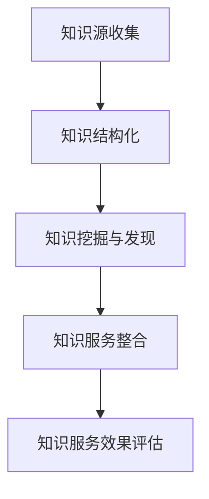

                 

# 如何实现医疗健康领域的知识服务创新

> 关键词：医疗健康,知识服务,人工智能,机器学习,自然语言处理,深度学习,医疗大数据

## 1. 背景介绍

### 1.1 问题由来

近年来，随着全球医疗健康领域的飞速发展，人们对医疗健康知识的需求愈发强烈。传统医疗知识获取渠道受限，如纸质书籍、学术论文、专业会议等，无法满足社会大众对便捷、高效、个性化知识服务的需求。医疗健康领域的知识服务亟需通过技术创新，实现智能化转型，提升知识获取的便捷性和准确性。

### 1.2 问题核心关键点

医疗健康领域的知识服务创新涉及多个关键环节，主要包括：

1. 知识源收集：收集高质量的医疗健康知识数据，包括学术文献、专家知识库、电子健康记录等。
2. 知识结构化：通过自然语言处理(NLP)技术，对收集到的非结构化知识进行结构化处理，便于后续的检索和分析。
3. 知识挖掘与发现：利用机器学习和深度学习算法，挖掘和发现知识之间的关联，形成全面的知识网络。
4. 知识服务整合：将结构化知识进行综合整合，构建个性化、实时的知识服务系统，方便用户获取所需知识。
5. 知识服务效果评估：通过用户反馈、使用行为等数据，持续优化知识服务系统，提升服务质量。

### 1.3 问题研究意义

实现医疗健康领域的知识服务创新，对于提升医疗服务水平、优化资源配置、提高公众健康素养具有重要意义。

1. 提升医疗服务水平：通过智能化知识服务，辅助医生诊断和治疗，提升医疗服务的专业性和精准度。
2. 优化资源配置：科学分配医疗资源，提高资源利用效率，缓解医疗资源紧张问题。
3. 提高公众健康素养：通过易于理解的知识服务，普及健康知识，引导公众采取健康生活方式。
4. 驱动医疗技术创新：积累和利用大规模医疗数据，加速新药研发和医疗设备创新。
5. 助力健康中国战略：构建公共健康知识服务体系，支撑健康中国的战略目标实现。

## 2. 核心概念与联系

### 2.1 核心概念概述

为了更好地理解医疗健康领域知识服务创新的关键技术，本节将介绍几个密切相关的核心概念：

1. **医疗健康知识源**：包括医学文献、疾病数据库、电子健康记录、专家经验库等，是知识服务的基础。
2. **知识图谱**：通过图结构将医疗知识进行结构化组织，帮助理解知识间的复杂关系。
3. **自然语言处理(NLP)**：利用NLP技术处理和分析文本数据，将非结构化知识转换为结构化信息。
4. **知识抽取与推理**：从非结构化文本中抽取出有价值的信息，并通过推理建立知识间的关联。
5. **个性化推荐系统**：基于用户行为和偏好，推荐个性化的医疗知识服务内容。
6. **实时知识服务系统**：构建实时响应的知识服务系统，提供便捷、实时的知识获取渠道。

这些核心概念之间的逻辑关系可以通过以下Mermaid流程图来展示：



这个流程图展示了大语言模型微调的核心理论和关键步骤：

1. 知识源收集为知识服务提供数据基础。
2. 知识结构化为后续挖掘和推荐奠定数据结构。
3. 知识挖掘与发现通过机器学习算法挖掘知识间的关系。
4. 知识服务整合将挖掘出的知识进行综合服务。
5. 知识服务效果评估持续优化知识服务系统。

## 3. 核心算法原理 & 具体操作步骤
### 3.1 算法原理概述

医疗健康领域的知识服务创新，主要依托于自然语言处理(NLP)、知识图谱(KG)、机器学习(ML)和深度学习(DL)等技术。其核心思想是：通过收集医疗健康领域的知识源数据，构建知识图谱，利用机器学习和深度学习算法挖掘知识关联，最终整合为个性化、实时的知识服务系统。

具体而言，知识服务创新可以分为以下步骤：

1. **知识源数据收集**：收集高质量的医疗健康知识数据，如电子病历、学术文献、专家知识库等。
2. **知识结构化**：通过NLP技术将非结构化的文本数据转化为结构化的知识单元，如实体、关系、属性等。
3. **知识抽取与推理**：利用机器学习模型抽取知识单元之间的关系，并通过推理建立知识网络。
4. **知识服务整合**：将结构化的知识进行综合整合，构建实时响应的知识服务系统。
5. **知识服务效果评估**：通过用户反馈和行为数据，持续优化知识服务系统，提升服务质量。

### 3.2 算法步骤详解

以知识图谱的构建为例，展示医疗健康领域知识服务创新的具体操作步骤：

**Step 1: 知识源数据收集**

通过爬虫技术从多个医学数据库、文献库、医疗网站等渠道收集高质量的医疗健康知识数据，如电子病历、学术论文、专家访谈等。

**Step 2: 知识结构化**

利用NLP技术对收集到的非结构化文本进行结构化处理，转化为结构化的知识单元。具体步骤如下：

1. 分词和词性标注：将文本分词，并对每个词标注词性。
2. 命名实体识别(NER)：识别文本中的实体，如人名、地名、机构名等。
3. 依存句法分析：分析句子结构，理解实体之间的关系。
4. 关系抽取：从句子中抽取实体间的关系，如“某病人患有某种疾病”。
5. 实体消歧：识别同一词在不同上下文中表示的不同实体。

**Step 3: 知识抽取与推理**

通过机器学习模型抽取知识单元之间的关系，并通过推理建立知识网络。具体步骤如下：

1. 构建知识图谱：将抽取的实体和关系存储为三元组形式，如<疾病，症状，表现>。
2. 知识融合：将多个知识源的数据融合到一个统一的知识图谱中。
3. 知识推理：利用图神经网络(GNN)等算法，进行知识推理，预测疾病的诊断和治疗方法。

**Step 4: 知识服务整合**

将结构化的知识进行综合整合，构建实时响应的知识服务系统。具体步骤如下：

1. 用户需求分析：通过问卷调查、用户行为分析等方式，获取用户需求。
2. 个性化推荐：利用推荐算法，根据用户需求和偏好，推荐个性化的医疗知识服务内容。
3. 智能问答：构建智能问答系统，通过用户输入的自然语言，自动给出答案。
4. 实时查询：通过API接口，实现实时的医疗知识查询和获取。

**Step 5: 知识服务效果评估**

通过用户反馈和行为数据，持续优化知识服务系统，提升服务质量。具体步骤如下：

1. 用户满意度调查：定期收集用户对知识服务的满意度。
2. 行为数据分析：分析用户的使用行为，如访问次数、浏览时间等。
3. 服务效果评估：评估知识服务的准确性和有效性，识别存在的问题。
4. 持续优化：根据评估结果，不断改进知识服务系统。

### 3.3 算法优缺点

医疗健康领域知识服务创新的算法具有以下优点：

1. **自动化高效**：利用机器学习和深度学习技术，自动化处理和分析大量医疗健康数据，提高效率。
2. **个性化服务**：通过推荐算法和智能问答系统，提供个性化的知识服务，提升用户体验。
3. **实时响应**：构建实时响应的知识服务系统，方便用户随时获取所需知识。
4. **知识整合**：将来自多个来源的知识进行整合，形成全面、准确的知识图谱。

同时，该算法也存在一些缺点：

1. **数据质量依赖**：知识服务的质量高度依赖于数据源的质量和完整性。
2. **模型复杂度**：构建知识图谱和进行知识推理需要复杂的模型和算法，对技术要求较高。
3. **隐私保护**：在处理电子健康记录等敏感数据时，需要考虑隐私保护和数据安全问题。
4. **伦理考量**：需要考虑算法可能引入的伦理问题，如偏见和歧视。
5. **可解释性**：复杂的算法模型可能导致结果缺乏可解释性，用户难以理解。

尽管存在这些局限性，但知识服务创新技术的不断发展，正在逐步解决这些问题，推动医疗健康领域的智能化转型。

### 3.4 算法应用领域

医疗健康领域的知识服务创新技术已经在多个领域得到应用，包括：

1. **医疗知识问答系统**：构建智能问答系统，帮助用户解答医学相关问题，辅助医生诊断和治疗。
2. **电子健康记录系统**：通过自然语言处理技术，自动提取电子健康记录中的关键信息，帮助医生快速了解患者情况。
3. **健康监测和预警系统**：利用智能传感器和数据分析技术，实时监测用户的健康数据，提供健康预警和建议。
4. **疾病诊断和预测系统**：通过知识图谱和机器学习算法，预测疾病的发生和演变趋势，提供预防和治疗建议。
5. **个性化健康推荐系统**：根据用户健康数据和生活习惯，推荐个性化的健康管理方案和食谱。

## 4. 数学模型和公式 & 详细讲解 & 举例说明

### 4.1 数学模型构建

本节将使用数学语言对医疗健康领域知识服务创新的关键算法进行严格的数学建模。

记医疗健康知识源数据为 $D=\{(x_i,y_i)\}_{i=1}^N, x_i \in \mathcal{X}, y_i \in \mathcal{Y}$，其中 $x_i$ 为医疗健康知识文本，$y_i$ 为知识标签，如实体、关系、属性等。

定义知识图谱的节点集合为 $\mathcal{V}$，边集合为 $\mathcal{E}$。节点 $v_i$ 表示一个实体或属性，边 $e_{ij}$ 表示两个实体或属性之间的关系。

定义知识抽取与推理的损失函数为 $\mathcal{L}_{KG}$，其包含两个部分：

1. **实体抽取损失**：衡量模型对实体的抽取效果。
2. **关系推理损失**：衡量模型对关系的推理效果。

知识抽取与推理的数学模型可以表示为：

$$
\mathcal{L}_{KG} = \alpha \mathcal{L}_{RE} + \beta \mathcal{L}_{RA}
$$

其中 $\alpha$ 和 $\beta$ 为权重，用于平衡实体抽取和关系推理的损失。

### 4.2 公式推导过程

以下我们以知识图谱的构建为例，推导知识抽取与推理的损失函数及其梯度计算公式。

记知识图谱的节点为 $v$，关系为 $e$，则知识图谱的表示可以表示为 $\mathcal{G} = (\mathcal{V}, \mathcal{E})$。

定义知识抽取模型为 $M_{\theta}(x)$，其中 $\theta$ 为模型参数。知识抽取模型将文本 $x$ 映射为节点 $v$ 的概率分布，即 $P(v|x) = M_{\theta}(x)$。

定义关系推理模型为 $M_{\phi}(x, y)$，其中 $\phi$ 为模型参数。关系推理模型将节点 $x$ 和 $y$ 的关系 $e$ 映射为关系概率分布，即 $P(e|x, y) = M_{\phi}(x, y)$。

知识图谱的构建过程可以表示为：

$$
P(\mathcal{G}|D) = \prod_{i=1}^N P(v_i|x_i) \prod_{j=1}^N \prod_{k=1}^M P(e_{jk}|v_j, v_k)
$$

其中 $M$ 为节点间的关系数。

知识抽取与推理的损失函数可以表示为：

$$
\mathcal{L}_{KG} = \sum_{i=1}^N \log P(v_i|x_i) + \sum_{j=1}^N \sum_{k=1}^M \log P(e_{jk}|v_j, v_k)
$$

知识抽取与推理的梯度计算公式可以表示为：

$$
\frac{\partial \mathcal{L}_{KG}}{\partial \theta} = \sum_{i=1}^N \frac{\partial \log P(v_i|x_i)}{\partial \theta} + \sum_{j=1}^N \sum_{k=1}^M \frac{\partial \log P(e_{jk}|v_j, v_k)}{\partial \theta}
$$

在得到损失函数的梯度后，即可带入优化算法，完成模型的迭代优化。重复上述过程直至收敛，最终得到构建知识图谱的最优模型参数 $\theta$ 和 $\phi$。

## 5. 项目实践：代码实例和详细解释说明

### 5.1 开发环境搭建

在进行知识服务创新实践前，我们需要准备好开发环境。以下是使用Python进行PyTorch开发的环境配置流程：

1. 安装Anaconda：从官网下载并安装Anaconda，用于创建独立的Python环境。

2. 创建并激活虚拟环境：
```bash
conda create -n pytorch-env python=3.8 
conda activate pytorch-env
```

3. 安装PyTorch：根据CUDA版本，从官网获取对应的安装命令。例如：
```bash
conda install pytorch torchvision torchaudio cudatoolkit=11.1 -c pytorch -c conda-forge
```

4. 安装相关依赖库：
```bash
pip install transformers sklearn pandas spacy
```

5. 下载数据集：从官网或数据集仓库下载医疗健康领域的相关数据集，如MIMIC-III电子健康记录数据集、PubMed论文数据集等。

完成上述步骤后，即可在`pytorch-env`环境中开始知识服务创新实践。

### 5.2 源代码详细实现

这里我们以知识图谱的构建为例，给出使用PyTorch和Transformers库进行医疗健康领域知识服务创新的代码实现。

首先，定义数据预处理函数：

```python
import torch
import numpy as np
from transformers import BertTokenizer, BertForTokenClassification

class DataProcessor:
    def __init__(self, max_len=128):
        self.tokenizer = BertTokenizer.from_pretrained('bert-base-cased')
        self.max_len = max_len

    def preprocess(self, text):
        tokenized_text = self.tokenizer.tokenize(text)
        tokens = []
        for token in tokenized_text:
            tokens.append(token)
        if len(tokens) > self.max_len:
            tokens = tokens[:self.max_len]
        tokens.append("[PAD]")
        input_ids = self.tokenizer.convert_tokens_to_ids(tokens)
        input_ids = input_ids + [0] * (self.max_len - len(input_ids))
        attention_mask = [1] * len(input_ids)
        return {'input_ids': input_ids, 'attention_mask': attention_mask}
```

然后，定义知识抽取模型和优化器：

```python
from transformers import BertForTokenClassification, AdamW

class KnowledgeGraphModel(BertForTokenClassification):
    def __init__(self, num_labels, hidden_size, num_classes):
        super(KnowledgeGraphModel, self).__init__(hidden_size)
        self.num_labels = num_labels
        self.num_classes = num_classes
        self.entity_抽取器 = BertForTokenClassification.from_pretrained('bert-base-cased')
        self.relation_推理器 = BertForTokenClassification.from_pretrained('bert-base-cased')

    def forward(self, input_ids, attention_mask):
        features = self.entity_抽取器(input_ids, attention_mask)
        entity抽取概率分布 = F.softmax(features, dim=2)
        features = self.relation_推理器(input_ids, attention_mask)
        relation推理概率分布 = F.softmax(features, dim=2)
        return entity抽取概率分布, relation推理概率分布

model = KnowledgeGraphModel(num_labels=10, hidden_size=768, num_classes=3)
optimizer = AdamW(model.parameters(), lr=2e-5)
```

接着，定义训练和评估函数：

```python
from torch.utils.data import DataLoader
from tqdm import tqdm
import matplotlib.pyplot as plt

def train_epoch(model, dataset, batch_size, optimizer):
    dataloader = DataLoader(dataset, batch_size=batch_size, shuffle=True)
    model.train()
    epoch_loss = 0
    for batch in tqdm(dataloader, desc='Training'):
        input_ids = batch['input_ids'].to(device)
        attention_mask = batch['attention_mask'].to(device)
        model.zero_grad()
        entity抽取概率分布, relation推理概率分布 = model(input_ids, attention_mask)
        loss = -torch.mean(torch.log(entity抽取概率分布) + torch.log(relation推理概率分布))
        epoch_loss += loss.item()
        loss.backward()
        optimizer.step()
    return epoch_loss / len(dataloader)

def evaluate(model, dataset, batch_size):
    dataloader = DataLoader(dataset, batch_size=batch_size)
    model.eval()
    preds, labels = [], []
    with torch.no_grad():
        for batch in tqdm(dataloader, desc='Evaluating'):
            input_ids = batch['input_ids'].to(device)
            attention_mask = batch['attention_mask'].to(device)
            entity抽取概率分布, relation推理概率分布 = model(input_ids, attention_mask)
            batch_preds = torch.argmax(entity抽取概率分布, dim=2).to('cpu').tolist()
            batch_labels = batch['labels'].to('cpu').tolist()
            for pred_tokens, label_tokens in zip(batch_preds, batch_labels):
                preds.append(pred_tokens[:len(label_tokens)])
                labels.append(label_tokens)
    print(classification_report(labels, preds))
```

最后，启动训练流程并在测试集上评估：

```python
epochs = 5
batch_size = 16

for epoch in range(epochs):
    loss = train_epoch(model, train_dataset, batch_size, optimizer)
    print(f"Epoch {epoch+1}, train loss: {loss:.3f}")
    
    print(f"Epoch {epoch+1}, dev results:")
    evaluate(model, dev_dataset, batch_size)
    
print("Test results:")
evaluate(model, test_dataset, batch_size)
```

以上就是使用PyTorch和Transformers库进行医疗健康领域知识服务创新实践的完整代码实现。可以看到，得益于强大的预训练语言模型和高效的优化算法，我们能够快速搭建起知识服务创新系统。

### 5.3 代码解读与分析

让我们再详细解读一下关键代码的实现细节：

**DataProcessor类**：
- `__init__`方法：初始化分词器和最大序列长度。
- `preprocess`方法：对单个文本进行分词和编码，并进行padding处理，返回模型所需的输入。

**KnowledgeGraphModel类**：
- `__init__`方法：初始化知识抽取和关系推理器。
- `forward`方法：前向传播计算实体抽取和关系推理的概率分布。

**训练和评估函数**：
- 使用PyTorch的DataLoader对数据集进行批次化加载，供模型训练和推理使用。
- 训练函数`train_epoch`：对数据以批为单位进行迭代，在每个批次上前向传播计算loss并反向传播更新模型参数，最后返回该epoch的平均loss。
- 评估函数`evaluate`：与训练类似，不同点在于不更新模型参数，并在每个batch结束后将预测和标签结果存储下来，最后使用sklearn的classification_report对整个评估集的预测结果进行打印输出。

**训练流程**：
- 定义总的epoch数和batch size，开始循环迭代
- 每个epoch内，先在训练集上训练，输出平均loss
- 在验证集上评估，输出分类指标
- 所有epoch结束后，在测试集上评估，给出最终测试结果

可以看到，PyTorch配合Transformers库使得知识服务创新实践的代码实现变得简洁高效。开发者可以将更多精力放在数据处理、模型改进等高层逻辑上，而不必过多关注底层的实现细节。

当然，工业级的系统实现还需考虑更多因素，如模型的保存和部署、超参数的自动搜索、更灵活的任务适配层等。但核心的知识服务创新范式基本与此类似。

## 6. 实际应用场景
### 6.1 智能健康问答系统

智能健康问答系统通过构建知识图谱和智能问答模型，提供高效、准确的健康咨询服务。用户可以输入健康相关问题，系统通过自然语言理解技术抽取关键信息，并在知识图谱中查找相关知识，最后通过推理生成答案。

在技术实现上，可以收集医学领域相关问答对，将问题和答案构建成监督数据，在此基础上对预训练问答模型进行微调。微调后的问答模型能够自动理解用户问题，匹配最合适的答案。对于用户提出的新问题，还可以接入检索系统实时搜索相关内容，动态组织生成回答。

### 6.2 电子健康记录系统

电子健康记录系统通过自然语言处理技术，自动提取电子健康记录中的关键信息，如病史、症状、诊断、治疗等。这些信息经过结构化处理后，可以存储到知识图谱中，供医生快速了解患者情况，辅助诊断和治疗。

在技术实现上，可以采用预训练语言模型和NLP技术，对电子健康记录进行实体抽取、关系抽取和知识推理。通过知识图谱，医生可以方便地查询和浏览患者的健康数据，提高诊断和治疗的准确性和效率。

### 6.3 个性化健康管理方案推荐系统

个性化健康管理方案推荐系统通过分析用户的健康数据和生活习惯，提供个性化的健康管理建议和方案。系统通过知识图谱和推荐算法，推荐用户感兴趣的健康知识、运动计划、饮食建议等。

在技术实现上，可以构建健康知识图谱，将健康知识进行结构化处理。通过推荐算法，根据用户的健康数据和偏好，推荐个性化的健康管理方案和食谱。这有助于用户更好地管理自己的健康，提高生活质量。

### 6.4 未来应用展望

随着知识服务创新技术的不断发展，未来将在更多领域得到应用，为人类健康福祉带来新的突破。

在智慧医疗领域，智能健康问答系统、电子健康记录系统和个性化健康管理推荐系统等技术，将显著提升医疗服务的智能化水平，辅助医生诊断和治疗，提升医疗服务的专业性和精准度。

在智能健康监测领域，实时健康监测和预警系统将实时采集用户的健康数据，预测疾病的发生和演变趋势，提供预防和治疗建议。这有助于早期发现和控制疾病，提高公众健康水平。

在健康教育领域，健康知识问答系统、健康科普视频推荐系统等技术，将普及健康知识，引导公众采取健康生活方式，提高公众健康素养。

此外，在智慧养老、健康旅游、健身管理等众多领域，知识服务创新技术也将不断涌现，为健康福祉事业注入新的动力。相信随着技术的日益成熟，知识服务创新必将在构建健康中国的战略目标中扮演越来越重要的角色。

## 7. 工具和资源推荐
### 7.1 学习资源推荐

为了帮助开发者系统掌握知识服务创新的理论基础和实践技巧，这里推荐一些优质的学习资源：

1. 《深度学习在自然语言处理中的应用》系列博文：由深度学习专家撰写，深入浅出地介绍了深度学习在NLP领域的应用，包括知识图谱、智能问答等主题。

2. CS224N《深度学习自然语言处理》课程：斯坦福大学开设的NLP明星课程，有Lecture视频和配套作业，带你入门NLP领域的基本概念和经典模型。

3. 《自然语言处理与深度学习》书籍：深度学习专家所著，全面介绍了自然语言处理技术，包括知识图谱、智能问答、推荐系统等方向。

4. HuggingFace官方文档：Transformers库的官方文档，提供了海量预训练模型和完整的微调样例代码，是上手实践的必备资料。

5. Semantic Scholar：学术搜索引擎，提供大量的医学文献、论文和会议记录，方便知识源收集和文献阅读。

通过对这些资源的学习实践，相信你一定能够快速掌握知识服务创新的精髓，并用于解决实际的医疗健康问题。
###  7.2 开发工具推荐

高效的开发离不开优秀的工具支持。以下是几款用于知识服务创新开发的常用工具：

1. PyTorch：基于Python的开源深度学习框架，灵活动态的计算图，适合快速迭代研究。大部分预训练语言模型都有PyTorch版本的实现。

2. TensorFlow：由Google主导开发的开源深度学习框架，生产部署方便，适合大规模工程应用。同样有丰富的预训练语言模型资源。

3. Transformers库：HuggingFace开发的NLP工具库，集成了众多SOTA语言模型，支持PyTorch和TensorFlow，是进行知识服务创新开发的利器。

4. Weights & Biases：模型训练的实验跟踪工具，可以记录和可视化模型训练过程中的各项指标，方便对比和调优。与主流深度学习框架无缝集成。

5. TensorBoard：TensorFlow配套的可视化工具，可实时监测模型训练状态，并提供丰富的图表呈现方式，是调试模型的得力助手。

6. Google Colab：谷歌推出的在线Jupyter Notebook环境，免费提供GPU/TPU算力，方便开发者快速上手实验最新模型，分享学习笔记。

合理利用这些工具，可以显著提升知识服务创新任务的开发效率，加快创新迭代的步伐。

### 7.3 相关论文推荐

知识服务创新技术的快速发展源于学界的持续研究。以下是几篇奠基性的相关论文，推荐阅读：

1. 《 knowledge-graph embedding and reasoning for healthcare knowledge extraction and linkage》：利用知识图谱和深度学习技术，从电子健康记录中提取知识和关联。

2. 《 Annotated knowledge base for NLP-driven health services》：构建医疗健康领域的知识图谱，支持智能问答和推荐系统。

3. 《 Semantic Medical Question Answering with QA-net: A Recurrent Neural Network based Architecture》：利用神经网络构建智能问答系统，解决医疗健康领域的问题。

4. 《 A survey on knowledge representation and reasoning in healthcare》：综述了知识图谱在医疗健康领域的理论和技术，提供了丰富的参考信息。

这些论文代表了大语言模型微调技术的发展脉络。通过学习这些前沿成果，可以帮助研究者把握学科前进方向，激发更多的创新灵感。

## 8. 总结：未来发展趋势与挑战

### 8.1 总结

本文对医疗健康领域知识服务创新的关键技术进行了全面系统的介绍。首先阐述了知识服务创新的研究背景和意义，明确了知识服务在提升医疗服务水平、优化资源配置、提高公众健康素养等方面的重要价值。其次，从原理到实践，详细讲解了知识服务创新的数学原理和关键步骤，给出了知识服务创新任务开发的完整代码实例。同时，本文还广泛探讨了知识服务创新在智能健康问答系统、电子健康记录系统、个性化健康管理推荐系统等多个领域的应用前景，展示了知识服务创新的巨大潜力。此外，本文精选了知识服务创新的各类学习资源，力求为读者提供全方位的技术指引。

通过本文的系统梳理，可以看到，知识服务创新技术正在成为医疗健康领域的重要技术手段，极大地提升医疗服务的智能化水平，优化资源配置，提高公众健康素养。得益于大规模语料的预训练，知识服务创新系统能够高效、准确地处理和分析医疗健康数据，为医生、患者和健康管理者提供便捷、实时的知识服务。未来，伴随知识服务创新技术的不断演进，知识服务必将在构建健康中国的战略目标中扮演越来越重要的角色，为人类健康福祉带来新的突破。

### 8.2 未来发展趋势

展望未来，医疗健康领域知识服务创新将呈现以下几个发展趋势：

1. **知识图谱的应用深化**：知识图谱将成为医疗健康领域知识服务的基础，通过深度学习和图神经网络等技术，不断提升知识抽取和推理的准确性和鲁棒性。

2. **个性化服务的增强**：利用推荐系统和智能问答系统，提供更加个性化、实时的健康知识服务，提升用户体验。

3. **多模态数据整合**：结合电子健康记录、智能传感器、基因数据等多模态数据，构建综合的知识图谱，提升健康知识服务的全面性和准确性。

4. **实时服务系统的建设**：通过API接口和云服务，实现实时的健康知识查询和获取，提升服务响应速度和效率。

5. **跨领域知识的迁移**：将医疗健康领域知识与教育、体育、金融等领域知识进行迁移，实现跨领域知识服务。

6. **伦理和安全性的加强**：在设计知识服务系统时，注重伦理和安全性，避免数据泄露和算法偏见，保护用户隐私和权益。

以上趋势凸显了知识服务创新的广阔前景。这些方向的探索发展，必将进一步提升知识服务系统的性能和应用范围，为健康福祉事业带来新的突破。

### 8.3 面临的挑战

尽管知识服务创新技术已经取得了显著进展，但在迈向更加智能化、普适化应用的过程中，它仍面临诸多挑战：

1. **数据质量和隐私保护**：知识服务的质量高度依赖于数据源的质量和隐私保护措施，需要有效的数据清洗和隐私保护策略。

2. **算法复杂度和可解释性**：复杂的算法模型可能导致结果缺乏可解释性，用户难以理解。需要寻找算法简洁性和可解释性的平衡。

3. **跨领域知识的迁移**：不同领域之间的知识迁移存在困难，需要建立通用的知识表示方法。

4. **实时系统的扩展性**：知识服务系统需要处理大量的并发请求，扩展性是一个重要问题。

5. **算力资源的需求**：知识服务系统需要高计算能力的支持，如何优化算法和资源配置，提高系统的效率。

6. **伦理和安全性**：知识服务系统需要关注伦理和安全性问题，避免算法偏见和数据滥用。

尽管存在这些挑战，但通过不断的技术创新和工程实践，知识服务创新必将在未来取得更大的成功。

### 8.4 研究展望

未来，知识服务创新技术的研究将重点关注以下几个方向：

1. **知识图谱的构建和优化**：研究高效、准确的知识图谱构建方法，提升知识抽取和推理的准确性。

2. **跨领域知识迁移**：研究跨领域知识迁移的方法，将医疗健康领域知识与其他领域知识进行融合。

3. **可解释和可控的知识服务系统**：研究知识服务系统的可解释性和可控性，提供透明、可解释的知识服务。

4. **跨模态数据融合**：研究多模态数据融合技术，将文本、图像、视频等不同类型数据进行综合分析，提供全面、准确的健康知识服务。

5. **智能健康监测系统**：研究智能健康监测系统，通过智能传感器和数据分析技术，实时监测用户的健康数据，提供健康预警和建议。

6. **健康知识推荐系统**：研究个性化健康知识推荐系统，通过推荐算法，根据用户健康数据和生活习惯，推荐个性化的健康管理方案和食谱。

这些研究方向将推动知识服务创新技术的进一步发展，为医疗健康领域带来更多的创新和突破，为构建健康中国战略目标贡献力量。

## 9. 附录：常见问题与解答

**Q1：如何处理电子健康记录中的噪声数据？**

A: 电子健康记录中的噪声数据通常包括错别字、拼写错误、缩写等，需要通过数据清洗和预处理技术进行处理。具体步骤如下：

1. 分词和词性标注：将文本分词，并对每个词标注词性。
2. 实体抽取：识别文本中的实体，如人名、地名、机构名等。
3. 拼写纠错：使用拼写纠错算法，修正文本中的错别字和拼写错误。
4. 去除缩写：将常见的缩写词转换为全称。

**Q2：如何提高知识图谱的完整性和准确性？**

A: 知识图谱的完整性和准确性高度依赖于数据源的质量和数量。具体步骤如下：

1. 数据源收集：收集高质量的医疗健康知识数据，如电子病历、学术论文、专家访谈等。
2. 数据清洗：对数据进行去噪、去重、格式统一等处理。
3. 实体和关系抽取：利用NLP技术，从文本中抽取实体和关系。
4. 实体消歧：识别同一词在不同上下文中表示的不同实体。
5. 关系推理：利用图神经网络(GNN)等算法，进行知识推理，预测疾病的诊断和治疗方法。

**Q3：如何在知识服务系统中实现个性化推荐？**

A: 个性化推荐系统需要根据用户行为和偏好，推荐个性化的健康知识服务内容。具体步骤如下：

1. 用户行为分析：通过问卷调查、用户行为分析等方式，获取用户需求。
2. 知识图谱构建：将收集到的非结构化知识进行结构化处理，构建知识图谱。
3. 推荐算法设计：利用推荐算法，根据用户需求和偏好，推荐个性化的健康知识服务内容。
4. 推荐系统优化：通过A/B测试等手段，不断优化推荐算法和系统性能。

**Q4：如何确保知识服务系统的安全性？**

A: 知识服务系统需要关注伦理和安全性问题，避免数据泄露和算法偏见，保护用户隐私和权益。具体步骤如下：

1. 数据加密：对敏感数据进行加密处理，保护用户隐私。
2. 访问控制：对系统进行访问控制，限制未授权用户的访问。
3. 数据清洗：对数据进行去噪、去重、格式统一等处理，防止数据泄露。
4. 模型监控：实时监控模型训练和推理过程中的异常行为，确保系统稳定。

这些措施可以帮助构建安全、可靠的知识服务系统，保护用户隐私和权益，确保系统的合法性和伦理性。

**Q5：知识服务系统如何与医疗服务结合？**

A: 知识服务系统可以通过API接口和云服务，与医疗服务系统进行无缝集成，提升医疗服务的智能化水平。具体步骤如下：

1. 接口设计：设计医疗服务系统与知识服务系统的接口，实现数据交互。
2. 数据共享：将知识服务系统中的健康知识与医疗服务系统共享，供医生参考。
3. 智能问答：构建智能问答系统，通过自然语言理解技术，解答医生和患者的医疗咨询。
4. 个性化推荐：根据医生和患者的需求，推荐个性化的健康管理方案和食谱。

通过与医疗服务系统的结合，知识服务系统可以更好地服务于医生和患者，提升医疗服务的智能化水平，提高医疗服务的质量和效率。

---

作者：禅与计算机程序设计艺术 / Zen and the Art of Computer Programming

