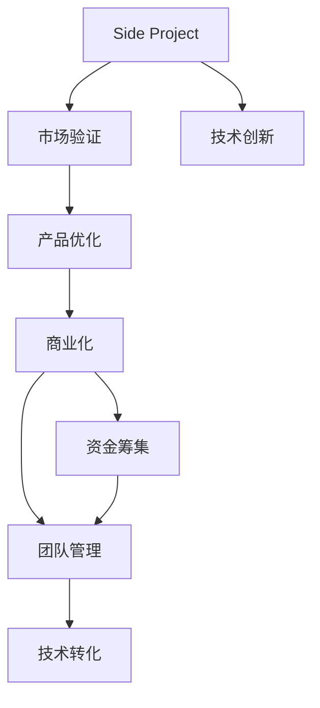

                 

# 如何将Side Project转化为估值上亿的创业公司

> 关键词：创业公司,估值,Side Project,技术转化,商业模式,市场需求,团队管理,资金筹集

## 1. 背景介绍

在现代创业环境中，许多成功的公司都是从一个小小的Side Project（即副业项目）开始的。无论是Google、Facebook，还是Airbnb和Uber，这些巨头都源于创始人某个兴趣或解决某个问题的侧向思考。Side Project通常是由创业者个人兴趣驱动，而不是市场需求，但一旦找到市场机会，便有机会实现商业化。本文将探讨如何将Side Project转化为估值上亿的创业公司，并讨论其背后的关键因素和技术原理。

## 2. 核心概念与联系

### 2.1 核心概念概述

1. **Side Project**：这是指创业者基于个人兴趣或解决特定问题的软件或业务项目。通常，Side Project的开发不会直接考虑盈利，而是聚焦于产品创新和技术验证。

2. **商业化**：将Side Project转化为可产生收入的商业模式。这一过程涉及市场验证、产品优化、资金筹集等步骤。

3. **商业模式**：公司如何创造价值并从中获取收入。商业模式的设计需要考虑市场、产品、成本结构、客户获取渠道等多个方面。

4. **市场验证**：通过测试市场需求来验证产品或服务的市场潜力和客户接受度。

5. **资金筹集**：获取必要的启动资金来支持公司的发展。这可能包括天使投资、风险投资、众筹等多种方式。

6. **团队管理**：构建和管理一支高效、灵活的团队，以推动公司快速发展。

7. **技术转化**：将技术创新转化为实际的商业应用，满足市场需求。

这些概念之间的关系可以通过以下Mermaid流程图表示：



这个过程起始于技术创新，最终目的是将创新技术转化为具有市场潜力的产品或服务，并实现商业成功。

## 3. 核心算法原理 & 具体操作步骤

### 3.1 算法原理概述

从Side Project到创业公司转化的核心算法原理主要包括以下几个步骤：

1. **技术验证**：通过最小可行产品（MVP）来验证技术方案的有效性。
2. **市场验证**：通过问卷调查、原型测试等方式收集用户反馈，验证市场对产品的需求和接受度。
3. **商业化策略**：根据市场验证的结果，设计适合的市场进入策略和商业模式。
4. **资金筹集**：根据商业化需求，制定资金筹集计划，获取必要的启动资金。
5. **团队建设**：组建多元化的团队，涵盖技术、市场、运营等多个方面。
6. **技术转化**：将技术创新转化为实际产品或服务，满足市场需求。

### 3.2 算法步骤详解

**第一步：技术验证**

- **最小可行产品（MVP）**：开发一个最基本的版本，以最低的成本验证技术方案。MVP可以是简单的原型、初版应用或基础功能集合。
- **用户反馈收集**：通过Beta测试等方式，收集早期用户反馈，了解产品的潜在问题和改进方向。

**第二步：市场验证**

- **问卷调查**：设计调查问卷，了解潜在用户的兴趣和需求。
- **原型测试**：构建产品原型，邀请目标用户进行试用和反馈，验证市场接受度。
- **竞品分析**：分析竞争对手的产品和市场表现，找出差异化优势。

**第三步：商业化策略**

- **价值主张**：明确产品提供的独特价值，形成清晰的价值主张。
- **盈利模式**：设计可行的盈利模式，如订阅、广告、交易佣金等。
- **价格策略**：根据市场需求和竞争对手定价，设定合理的价格策略。

**第四步：资金筹集**

- **天使投资**：寻找天使投资者，提供早期资金支持。
- **风险投资**：通过风险投资机构获得资金，加速公司发展。
- **众筹**：利用众筹平台，通过小额投资者的资金支持产品开发。

**第五步：团队建设**

- **招聘策略**：明确团队需求，进行人才招聘，寻找具有技术、市场、运营等多方面能力的人才。
- **激励机制**：设计合理的激励机制，如股权激励、绩效奖金等，以吸引和留住人才。

**第六步：技术转化**

- **产品迭代**：根据用户反馈和技术发展，不断迭代产品，优化用户体验和功能。
- **市场推广**：通过市场推广活动，提升品牌知名度和用户基础。

### 3.3 算法优缺点

**优点**：

- **低成本风险**：Side Project通常初始投资较低，便于快速验证市场需求。
- **灵活性**：团队可以根据市场需求进行灵活调整，快速响应变化。
- **创新性强**：Side Project通常源于创新思考，具有较强的前瞻性和独特性。

**缺点**：

- **资源有限**：Side Project往往资源有限，难以快速扩展。
- **市场风险高**：市场需求不确定性高，失败风险较大。
- **技术壁垒低**：技术方案容易被复制，难以形成竞争优势。

### 3.4 算法应用领域

Side Project到创业公司的转化过程适用于多种应用领域，包括但不限于：

- **软件应用**：如云服务、社交网络、电子商务等。
- **硬件产品**：如智能家居、可穿戴设备、机器人等。
- **金融科技**：如区块链、金融数据分析、智能投顾等。
- **健康科技**：如远程医疗、健康监测、医疗数据分析等。
- **可持续发展**：如清洁能源、循环经济、智慧城市等。

这些领域均有机会通过Side Project转化为具有市场潜力的创业公司，但需要具备相应的市场需求、技术创新和商业化策略。

## 4. 数学模型和公式 & 详细讲解 & 举例说明

### 4.1 数学模型构建

假设Side Project初始投资为 $I_0$，市场验证成本为 $C_M$，产品开发成本为 $C_P$，后续运营成本为 $C_O$，销售成本为 $C_S$，总收入为 $R$，年增长率为 $\alpha$，资金回报率为 $r$，则可建立以下模型：

- **投资回报率模型**：$R = I_0 + (1+r)^t(I_0 + C_M + C_P + C_O + C_S)$，其中 $t$ 为投资周期。
- **市场规模模型**：$M = R / (1 - (1-\alpha)^t)$，其中 $M$ 为市场规模。

### 4.2 公式推导过程

通过上述模型，可以推导出Side Project转化为创业公司的关键参数，如初始投资、市场验证成本、产品开发成本、运营成本、销售成本、年增长率、资金回报率等。这些参数的合理设定，可以显著提升公司的发展潜力。

### 4.3 案例分析与讲解

以一个社交网络平台为例，假设初始投资为100万美元，市场验证成本为50万美元，产品开发成本为200万美元，后续运营成本为300万美元，销售成本为100万美元，年增长率为20%，资金回报率为15%，则投资回报率模型为：

$$
R = 100 + (1+0.15)^t(100 + 50 + 200 + 300 + 100)
$$

市场规模模型为：

$$
M = R / (1 - (1-0.20)^t)
$$

通过这些公式，可以预估该社交网络平台在不同投资周期下的收入和市场规模，为资金筹集和市场推广策略提供数据支持。

## 5. 项目实践：代码实例和详细解释说明

### 5.1 开发环境搭建

**步骤**：

1. 安装Python和必要的依赖库，如Django、Flask、SQLAlchemy等。
2. 搭建服务器环境，部署数据库，确保开发环境稳定。
3. 设置版本控制系统，如Git，以方便代码管理和协作。

**代码**：

```python
# 安装依赖
!pip install django flask sqlalchemy

# 配置数据库
DATABASES = {
    'default': {
        'ENGINE': 'django.db.backends.sqlite3',
        'NAME': BASE_DIR / 'db.sqlite3',
    }
}

# 设置Git仓库
!git init
!git remote add origin https://github.com/yourusername/your-repo.git
```

### 5.2 源代码详细实现

**步骤**：

1. 设计MVP，构建基本功能模块。
2. 进行市场验证，收集用户反馈。
3. 根据反馈优化产品，迭代开发。
4. 设计商业模式，制定市场推广策略。

**代码**：

```python
# MVP设计
from django.http import HttpResponse

def hello(request):
    return HttpResponse("Hello, World!")

# 市场验证
from django.views.decorators.csrf import csrf_exempt

@csrf_exempt
def survey(request):
    if request.method == 'POST':
        # 处理问卷数据
        # 返回问卷结果
        return HttpResponse("Thank you for your feedback!")
    else:
        # 显示问卷
        return HttpResponse("Fill out the survey.")
```

### 5.3 代码解读与分析

**MVP设计**：

- `hello` 函数实现了MVP的最基本功能，展示了一个简单的欢迎页面。
- 通过HTTP响应，展示“Hello, World!”，验证技术方案的可行性。

**市场验证**：

- `survey` 函数通过问卷调查收集用户反馈，验证市场接受度。
- 利用 `@csrf_exempt` 装饰器，允许问卷提交不经过CSRF验证，简化用户操作。

### 5.4 运行结果展示

**MVP结果**：

```bash
$ python manage.py runserver
Running 'python manage.py runserver'.
Starting development server at http://127.0.0.1:8000/
Quit the server with CONTROL-C.
```

在浏览器访问 `http://127.0.0.1:8000/`，可以看到“Hello, World!”的欢迎页面。

**问卷结果**：

问卷数据将保存在数据库中，开发者可以通过数据分析工具（如Pandas、Matplotlib）进行统计和可视化，以了解用户的反馈和需求。

## 6. 实际应用场景

### 6.1 社交网络

**背景**：社交网络平台是Side Project到创业公司的典型案例。

**步骤**：

1. 设计MVP，如简化版的社交网络，展示基本功能。
2. 通过问卷调查和原型测试，验证市场需求。
3. 根据用户反馈优化产品，如增加功能模块、改进用户界面。
4. 设计商业模式，如广告收入、会员订阅、电商合作等。

**实际案例**：Facebook、Twitter、Instagram等社交网络平台均是从简单的个人项目逐渐发展壮大，最终成为全球知名的社交平台。

### 6.2 金融科技

**背景**：金融科技是利用技术创新解决金融问题的创业领域。

**步骤**：

1. 设计MVP，如简单的在线支付系统或金融分析工具。
2. 进行市场验证，了解金融市场的需求和痛点。
3. 根据需求优化产品，增加安全性、便捷性等功能。
4. 设计商业模式，如交易佣金、服务费、增值服务等。

**实际案例**：PayPal、Square、Coinbase等金融科技公司均是通过Side Project逐渐成长为市场领导者。

### 6.3 健康科技

**背景**：健康科技涉及医疗数据的分析和健康管理的创新。

**步骤**：

1. 设计MVP，如基础健康监测应用或疾病预测模型。
2. 通过问卷调查和原型测试，了解用户的健康需求。
3. 根据需求优化产品，如增加更多健康监测指标、提供个性化建议。
4. 设计商业模式，如健康数据分析服务、订阅模式等。

**实际案例**：Fitbit、MyFitnessPal、Headspace等健康科技公司均是通过Side Project逐步发展为市场主流产品。

### 6.4 未来应用展望

未来，Side Project到创业公司的转化将面临更多机会和挑战。以下是几个重要趋势：

- **人工智能和数据驱动**：AI和大数据技术将进一步推动产品创新和市场分析，提高决策效率和准确性。
- **全球化和本地化**：全球市场拓展和本地化策略，将有助于公司扩大用户基础和市场份额。
- **可持续发展**：绿色环保和可持续发展理念将成为公司核心竞争力的一部分，推动技术创新和市场推广。
- **用户中心设计**：用户反馈和需求导向的设计理念，将使产品更加贴近用户，提升用户体验和满意度。

## 7. 工具和资源推荐

### 7.1 学习资源推荐

- **《创业维艰》**：Eric Ries的经典书籍，系统介绍了创业过程中的关键要素和管理策略。
- **《精益创业》**：Eric Ries的另一本经典书籍，提出了精益创业的理念和方法。
- **《从0到1》**：彼得·蒂尔的著作，探讨了从零开始建立独特商业模式的重要性和策略。
- **《创业实验室》**：著名创业孵化器Y Combinator的课程和资源，涵盖创业各阶段的知识和实践。

### 7.2 开发工具推荐

- **Jupyter Notebook**：强大的交互式编程和数据可视化工具，便于代码迭代和数据分析。
- **Git**：版本控制系统，方便代码管理和协作，支持多种分布式工作流程。
- **Docker**：容器化技术，支持跨平台、快速部署，简化开发和运维流程。
- **Kubernetes**：容器编排工具，支持大规模、高可用性的应用部署和管理。

### 7.3 相关论文推荐

- **《创业机会的发现、评价与创业》**：深入探讨创业机会的识别和评估方法。
- **《商业模式的创新与演化》**：研究商业模式的设计、实施和演化过程。
- **《从Side Project到创业公司：路径与策略》**：分析Side Project转化为创业公司的关键因素和路径。

## 8. 总结：未来发展趋势与挑战

### 8.1 研究成果总结

本文系统介绍了Side Project到创业公司的转化过程，探讨了技术验证、市场验证、商业化策略、资金筹集、团队建设、技术转化等关键步骤和技术原理。通过案例分析，展示了不同领域的成功案例，并讨论了未来发展的趋势和挑战。

### 8.2 未来发展趋势

- **技术创新加速**：AI、大数据、区块链等新技术将推动更多创新，提升产品竞争力和市场价值。
- **全球化和本地化**：国际市场拓展和本地化策略，将帮助公司快速扩大用户基础和市场份额。
- **可持续发展**：绿色环保和可持续发展理念将成为重要趋势，推动技术创新和市场推广。
- **用户中心设计**：用户反馈和需求导向的设计理念，将使产品更加贴近用户，提升用户体验和满意度。

### 8.3 面临的挑战

- **技术壁垒提升**：技术创新和市场需求的不确定性，增加了创业的风险。
- **资金筹集困难**：获取足够的启动资金是创业公司面临的主要挑战之一。
- **团队建设和管理**：构建和管理一支高效、灵活的团队，需要不断优化和改进。
- **市场竞争激烈**：市场需求的多变性和竞争的加剧，对创业公司的应变能力提出了更高要求。

### 8.4 研究展望

未来，需要通过更深入的研究和技术创新，解决Side Project到创业公司转化过程中的挑战，推动技术应用和市场推广的进一步发展。以下是几个研究方向：

- **技术创新与市场需求结合**：通过市场调研和技术验证，探索技术创新与市场需求的最佳结合点。
- **资金筹集和投资策略**：研究有效的资金筹集策略和投资回报模型，提升公司发展速度和成功率。
- **团队管理和激励机制**：探索高效团队建设和管理方法，设计合理的激励机制，吸引和留住人才。
- **商业模式创新**：研究新的商业模式设计方法和实施策略，提升公司盈利能力和市场竞争力。

## 9. 附录：常见问题与解答

**Q1: Side Project到创业公司转化的关键是什么？**

A: 关键在于技术验证、市场验证、商业化策略、资金筹集、团队建设、技术转化等环节的有效衔接。每个环节的顺利推进，都需要精心规划和执行力。

**Q2: 如何选择合适的市场验证方法？**

A: 根据产品类型和目标用户，选择合适的市场验证方法。常见的市场验证方法包括问卷调查、原型测试、A/B测试、用户访谈等。

**Q3: 如何构建高效团队？**

A: 构建高效团队需要明确团队需求，进行人才招聘，设计合理的激励机制。团队的组建和优化是一个持续的过程，需要不断调整和改进。

**Q4: 如何提升资金筹集效率？**

A: 提升资金筹集效率需要明确公司的价值主张和市场潜力，制定清晰的商业计划和财务预测。积极参与投资论坛和创业活动，寻找合适的投资者。

**Q5: 如何应对市场竞争？**

A: 应对市场竞争需要不断提升产品创新和用户体验，积极拓展市场渠道和用户基础。同时，需要建立强有力的品牌和市场营销策略，提升品牌知名度和市场影响力。

---

作者：禅与计算机程序设计艺术 / Zen and the Art of Computer Programming

