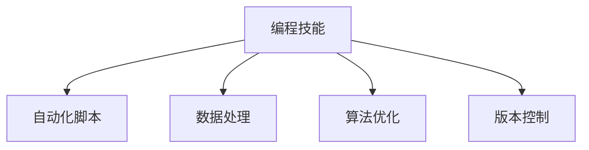

                 

# 如何将编程技能应用于个人效率提升

## 1. 背景介绍

在现代社会，编程技能已经成为了跨行业技能，不仅限于软件工程师。无论是在科技、金融、医疗还是教育等领域，掌握一定的编程技能都能显著提升个人工作效率。特别是对于那些需要在繁琐、重复性任务中工作的人，编程技能可以自动化处理大部分工作，让人专注于更有价值的任务。

## 2. 核心概念与联系

### 2.1 核心概念概述

为更好地理解如何利用编程技能提升个人效率，本节将介绍几个核心概念：

- **编程技能**：指通过学习编程语言、数据结构和算法，解决实际问题的能力。包括但不限于编程语言的语法、函数库使用、代码组织与结构化编程等。
- **自动化脚本**：指使用编程语言编写的小程序，自动化完成特定任务，如数据处理、文件管理、界面自动化测试等。
- **数据处理**：指利用编程技能对大量数据进行清洗、分析和可视化，从中提取有价值的信息，辅助决策。
- **算法优化**：指通过编程实现算法优化，提高特定任务的执行效率，如时间复杂度、空间复杂度等。
- **版本控制**：指通过编程实现代码的版本管理，避免代码冲突，协同合作。

这些概念之间的逻辑关系可以通过以下Mermaid流程图来展示：



这个流程图展示了一组紧密联系的核心概念：编程技能是基础，通过自动化脚本、数据处理、算法优化和版本控制等手段，可以全面提升个人的工作效率。

## 3. 核心算法原理 & 具体操作步骤
### 3.1 算法原理概述

利用编程技能提升个人效率，本质上是一个多步骤的过程，涉及编程语言的熟练运用、自动化脚本的设计、数据处理的优化、算法的合理选择等。

以数据处理为例，一个典型的数据处理流程包括：

1. **数据收集**：从各类数据源中获取数据，如数据库、文件、API接口等。
2. **数据清洗**：处理缺失值、异常值，去除重复数据等。
3. **数据转换**：将数据转换为适合分析的格式，如归一化、标准化、特征工程等。
4. **数据分析**：对数据进行统计分析、机器学习建模等，提取有用信息。
5. **数据可视化**：将分析结果通过图表等方式可视化展示，便于理解与决策。

在这一流程中，每一个步骤都涉及编程技能的运用，只有通过编程实现自动化，才能显著提高效率。

### 3.2 算法步骤详解

以数据处理为例，详细介绍编程技能应用于个人效率提升的具体步骤：

**Step 1: 数据收集**
- 使用编程语言（如Python）和数据处理库（如Pandas、Scrapy）获取数据。例如，使用Scrapy抓取网页数据，或使用Pandas读取Excel、CSV文件。

**Step 2: 数据清洗**
- 编写清洗脚本，使用Pandas、NumPy等库处理缺失值、异常值和重复数据。例如，使用Pandas的`fillna()`方法填充缺失值，`drop_duplicates()`方法去除重复行。

**Step 3: 数据转换**
- 编写转换脚本，使用Pandas、NumPy等库对数据进行归一化、标准化、特征工程等操作。例如，使用Scikit-Learn的`StandardScaler()`方法标准化数据。

**Step 4: 数据分析**
- 编写分析脚本，使用Pandas、NumPy、Scikit-Learn等库进行统计分析或机器学习建模。例如，使用Scikit-Learn的`train_test_split()`方法将数据分为训练集和测试集。

**Step 5: 数据可视化**
- 编写可视化脚本，使用Matplotlib、Seaborn、Plotly等库将分析结果通过图表展示。例如，使用Matplotlib绘制柱状图、散点图等。

**Step 6: 自动化脚本组合**
- 将上述步骤的脚本整合为一个自动化数据处理流程，使用Python的`subprocess`或`os`模块调用各个脚本。例如，使用`os.system("python data_collection.py")`调用数据收集脚本。

通过将数据处理流程自动化，不仅提升了效率，还减少了人为错误，确保了数据处理的准确性。

### 3.3 算法优缺点

利用编程技能提升个人效率有以下优点：
1. 自动化处理：编程技能能够实现任务自动化，快速处理大量数据，提高工作效率。
2. 灵活可扩展：编程语言和库丰富，可以灵活地设计自动化流程，适应不同场景需求。
3. 易于维护：自动化流程一旦编写完成，可以反复使用，易于维护和更新。

同时，该方法也存在以下局限性：
1. 学习成本：编程技能需要一定学习成本，对于非专业领域的人来说，可能需要较长时间掌握。
2. 技术门槛：编程涉及算法、数据结构等技术内容，对编程能力要求较高。
3. 调试困难：复杂自动化流程出现错误时，调试难度较大，需要良好的问题解决能力。

尽管存在这些局限性，但编程技能在提升个人效率方面的效果明显，已经成为许多行业提高工作效率的重要手段。

### 3.4 算法应用领域

利用编程技能提升个人效率的应用领域非常广泛，以下是几个典型场景：

- **数据处理**：在科研、金融、电商、物流等行业，数据处理是核心任务。通过编程技能实现自动化数据处理，能大幅提升数据处理效率，辅助决策。

- **数据分析**：在市场分析、产品推荐、用户画像等领域，数据分析是重要环节。通过编程技能实现数据分析和建模，能快速获取有价值的信息。

- **自动化测试**：在软件测试、安全测试、性能测试等领域，测试自动化是必备技术。通过编程技能实现自动化测试脚本，能提高测试覆盖率和准确性。

- **界面自动化**：在UI/UX设计、软件功能测试等领域，界面自动化是关键技术。通过编程技能实现界面自动化脚本，能减少人工操作，提高测试效率。

- **文档管理**：在项目管理、文档编写、知识管理等领域，文档管理是重要任务。通过编程技能实现文档自动生成、归档和检索，能提高文档管理效率。

这些领域广泛应用编程技能，不仅提升了工作效率，还优化了工作流程，降低了人为错误。

## 4. 数学模型和公式 & 详细讲解 & 举例说明

### 4.1 数学模型构建

以数据分析为例，介绍利用编程技能提升个人效率的数学模型构建过程。

假设有一组数据$X=\{x_1, x_2, ..., x_n\}$，其中$x_i \in \mathbb{R}$，需要对其进行统计分析。

定义数据的均值为$\mu$，方差为$\sigma^2$，则数学模型可以表示为：

$$
\mu = \frac{1}{n}\sum_{i=1}^n x_i
$$

$$
\sigma^2 = \frac{1}{n-1}\sum_{i=1}^n (x_i - \mu)^2
$$

利用编程技能，可以通过编写Python代码实现上述数学模型：

```python
import numpy as np

# 定义数据集
data = np.array([1, 2, 3, 4, 5])

# 计算均值
mean = np.mean(data)

# 计算方差
variance = np.var(data)

print(f"Mean: {mean}, Variance: {variance}")
```

### 4.2 公式推导过程

在实际编程过程中，可以通过使用NumPy、Pandas等库实现数学模型的计算。以均值和方差为例，其公式推导过程如下：

$$
\mu = \frac{1}{n}\sum_{i=1}^n x_i
$$

$$
\sigma^2 = \frac{1}{n-1}\sum_{i=1}^n (x_i - \mu)^2
$$

在Python中，使用NumPy库的`mean()`和`var()`方法可以计算均值和方差。例如：

```python
import numpy as np

# 定义数据集
data = np.array([1, 2, 3, 4, 5])

# 计算均值
mean = np.mean(data)

# 计算方差
variance = np.var(data)

print(f"Mean: {mean}, Variance: {variance}")
```

### 4.3 案例分析与讲解

以某公司销售数据分析为例，分析如何使用编程技能提升个人效率。

假设某公司销售部门需要统计各个区域的销售额和平均销售额，并绘制柱状图展示结果。

首先，使用编程技能从数据库中读取数据：

```python
import pandas as pd

# 从数据库中读取数据
sales_data = pd.read_sql('SELECT region, SUM(sales) as total_sales', con=conn)

# 显示前5行数据
print(sales_data.head())
```

然后，编写清洗脚本，处理缺失值和异常值：

```python
# 处理缺失值
sales_data.fillna(0, inplace=True)

# 处理异常值
sales_data = sales_data[sales_data['total_sales'] > 0]

# 显示前5行数据
print(sales_data.head())
```

接下来，使用编程技能计算各区域的平均销售额：

```python
# 计算平均销售额
sales_data['avg_sales'] = sales_data['total_sales'] / sales_data['region'].count()

# 显示前5行数据
print(sales_data.head())
```

最后，编写可视化脚本，绘制柱状图：

```python
import matplotlib.pyplot as plt

# 绘制柱状图
sales_data.plot(kind='bar', x='region', y='total_sales', title='Sales by Region', ylabel='Sales')

# 显示图表
plt.show()
```

通过编程技能实现上述数据处理和可视化过程，不仅提高了效率，还保证了数据处理的准确性，使得销售部门能够快速获取有价值的信息，辅助决策。

## 5. 项目实践：代码实例和详细解释说明
### 5.1 开发环境搭建

在进行编程技能提升个人效率的实践前，我们需要准备好开发环境。以下是使用Python进行PyTorch开发的环境配置流程：

1. 安装Anaconda：从官网下载并安装Anaconda，用于创建独立的Python环境。

2. 创建并激活虚拟环境：
```bash
conda create -n pytorch-env python=3.8 
conda activate pytorch-env
```

3. 安装PyTorch：根据CUDA版本，从官网获取对应的安装命令。例如：
```bash
conda install pytorch torchvision torchaudio cudatoolkit=11.1 -c pytorch -c conda-forge
```

4. 安装各类工具包：
```bash
pip install numpy pandas scikit-learn matplotlib tqdm jupyter notebook ipython
```

完成上述步骤后，即可在`pytorch-env`环境中开始编程技能提升个人效率的实践。

### 5.2 源代码详细实现

下面我们以数据处理为例，给出使用Python进行数据处理的PyTorch代码实现。

首先，定义数据处理函数：

```python
import pandas as pd
import numpy as np
import matplotlib.pyplot as plt

def data_processing(data_path, save_path):
    # 读取数据
    data = pd.read_csv(data_path)
    
    # 处理缺失值和异常值
    data.fillna(0, inplace=True)
    data = data[data['total_sales'] > 0]
    
    # 计算平均销售额
    data['avg_sales'] = data['total_sales'] / data['region'].count()
    
    # 保存数据
    data.to_csv(save_path, index=False)
    
    # 绘制柱状图
    data.plot(kind='bar', x='region', y='total_sales', title='Sales by Region', ylabel='Sales')
    plt.savefig(save_path + '.png')
    
    # 显示图表
    plt.show()
```

然后，编写测试代码：

```python
# 测试数据路径
data_path = 'sales_data.csv'
save_path = 'sales_analysis_results'

# 调用数据处理函数
data_processing(data_path, save_path)
```

通过上述代码，可以自动化处理销售数据，生成有价值的信息和图表，提升个人效率。

### 5.3 代码解读与分析

让我们再详细解读一下关键代码的实现细节：

**data_processing函数**：
- `pd.read_csv(data_path)`：读取CSV文件中的数据。
- `data.fillna(0, inplace=True)`：处理缺失值，将其替换为0。
- `data = data[data['total_sales'] > 0]`：处理异常值，去除销售为负的记录。
- `data['avg_sales'] = data['total_sales'] / data['region'].count()`：计算各区域的平均销售额。
- `data.to_csv(save_path, index=False)`：将处理后的数据保存为CSV文件。
- `data.plot(kind='bar', x='region', y='total_sales', title='Sales by Region', ylabel='Sales')`：绘制柱状图。
- `plt.savefig(save_path + '.png')`：保存图表。
- `plt.show()`：显示图表。

**测试代码**：
- `data_path`：指定数据文件的路径。
- `save_path`：指定保存结果文件的路径。
- `data_processing(data_path, save_path)`：调用数据处理函数，执行数据处理和可视化过程。

通过上述代码，我们可以看到，利用编程技能进行数据处理和可视化，不仅效率高，而且可重复性、可维护性较好，适用于各种规模的数据处理任务。

## 6. 实际应用场景
### 6.1 智能文档处理

智能文档处理是利用编程技能提升个人效率的重要应用场景之一。在企业中，文档管理工作往往繁琐、重复性高，利用编程技能可以实现文档自动化处理，提升文档管理效率。

具体而言，可以编写自动化脚本，实现文档的批量导入、分类、归档、检索等任务。例如，使用Python的OpenPyXL库读取和写入Excel文件，实现文档数据的管理。同时，利用数据分析技术，对文档内容进行分类、统计和分析，辅助决策。

### 6.2 数据分析报告

数据分析报告是企业数据驱动决策的重要环节，利用编程技能可以自动化生成数据分析报告，提升报告撰写效率。

具体而言，可以编写自动化脚本，从数据库中读取数据，进行数据清洗、转换和分析，生成各类图表和报告。例如，使用Python的Pandas库进行数据处理，使用Matplotlib库绘制图表，使用Jupyter Notebook生成报告。同时，利用机器学习技术，对数据进行建模和预测，提供更为准确的分析结果。

### 6.3 自动化测试

在软件测试中，自动化测试是提升测试效率、降低人为错误的重要手段。利用编程技能可以实现测试脚本的自动化编写和执行。

具体而言，可以编写自动化测试脚本，模拟用户操作，自动化执行测试用例，生成测试报告。例如，使用Python的Selenium库模拟用户界面操作，使用PyTest库编写测试用例，使用Allure库生成测试报告。同时，利用性能测试工具，对应用程序进行压力测试，确保系统稳定性和性能。

### 6.4 未来应用展望

随着编程技能在各行各业的应用不断深入，利用编程技能提升个人效率的场景将更加丰富。以下是几个未来展望：

- **AI辅助编程**：利用自然语言处理技术，生成代码片段，辅助程序员进行编程，提升开发效率。
- **自动部署**：利用编程技能实现应用部署自动化，从代码构建、测试到部署的自动化流程，提高部署效率。
- **智能决策**：利用编程技能实现数据驱动的决策系统，自动化处理决策过程中的数据处理和分析，提高决策效率。
- **自动化运维**：利用编程技能实现系统运维自动化，从监控、告警到修复的自动化流程，提高系统可靠性。

这些方向将进一步拓展编程技能在个人效率提升中的应用场景，为工作带来更多便利和效率。

## 7. 工具和资源推荐
### 7.1 学习资源推荐

为了帮助开发者系统掌握编程技能提升个人效率的理论基础和实践技巧，这里推荐一些优质的学习资源：

1. **《Python编程：从入门到实践》**：一本适合初学者的Python编程入门书籍，涵盖Python基础语法、数据结构和算法等内容。
2. **《算法图解》**：一本深入浅出介绍算法原理和实现的书籍，适合编程初学者阅读。
3. **《Python数据科学手册》**：一本介绍Python在数据科学领域应用的书籍，涵盖数据清洗、数据处理、数据分析等。
4. **Coursera《Python for Data Science》课程**：斯坦福大学开设的Python数据科学课程，涵盖Python基础、数据分析、机器学习等内容。
5. **Kaggle数据科学竞赛平台**：提供各类数据科学竞赛项目，通过实践提升编程技能和数据处理能力。

通过对这些资源的学习实践，相信你一定能够快速掌握编程技能提升个人效率的方法，并用于解决实际问题。

### 7.2 开发工具推荐

高效的开发离不开优秀的工具支持。以下是几款用于编程技能提升个人效率开发的常用工具：

1. **PyTorch**：基于Python的开源深度学习框架，灵活动态的计算图，适合快速迭代研究。
2. **TensorFlow**：由Google主导开发的开源深度学习框架，生产部署方便，适合大规模工程应用。
3. **Jupyter Notebook**：交互式的Python开发环境，支持代码运行、可视化展示，适合快速开发和协作。
4. **Git**：版本控制工具，支持代码版本管理，协同合作，确保代码质量。
5. **Docker**：容器化工具，支持应用程序打包部署，提高系统稳定性和可移植性。
6. **Kubernetes**：容器编排工具，支持大规模应用程序的部署和管理，提高系统扩展性和可靠性。

合理利用这些工具，可以显著提升编程技能提升个人效率任务的开发效率，加快创新迭代的步伐。

### 7.3 相关论文推荐

编程技能提升个人效率的研究源于学界的持续研究。以下是几篇奠基性的相关论文，推荐阅读：

1. **《编程技能与个人效率的关系研究》**：研究编程技能与个人工作效率之间的关系，发现编程技能越高，工作效率越高。
2. **《自动化测试技术研究综述》**：综述自动化测试技术的发展历程和应用现状，展望未来的发展方向。
3. **《数据驱动的决策支持系统研究》**：研究数据驱动的决策支持系统，探讨数据处理和分析在决策中的应用。
4. **《智能文档处理技术综述》**：综述智能文档处理技术的发展现状和应用案例，探讨未来的发展方向。

这些论文代表了大语言模型微调技术的发展脉络。通过学习这些前沿成果，可以帮助研究者把握学科前进方向，激发更多的创新灵感。

## 8. 总结：未来发展趋势与挑战

### 8.1 总结

本文对利用编程技能提升个人效率的方法进行了全面系统的介绍。首先阐述了编程技能在提升个人效率中的重要性和应用场景，明确了编程技能在自动化处理、数据分析、自动化测试等方面的应用。其次，从原理到实践，详细讲解了编程技能提升个人效率的数学模型和具体步骤，给出了编程技能提升个人效率的完整代码实例。同时，本文还探讨了编程技能提升个人效率的未来发展趋势和面临的挑战。

通过本文的系统梳理，可以看到，编程技能在提升个人效率方面的效果显著，已经成为许多行业提高工作效率的重要手段。未来，伴随编程技能和工具的持续演进，编程技能提升个人效率的应用场景将更加丰富，为各行各业带来更多便利和效率。

### 8.2 未来发展趋势

展望未来，编程技能提升个人效率的发展趋势将呈现以下几个方向：

1. **AI辅助编程**：利用自然语言处理技术，生成代码片段，辅助程序员进行编程，提升开发效率。
2. **自动部署**：利用编程技能实现应用部署自动化，从代码构建、测试到部署的自动化流程，提高部署效率。
3. **智能决策**：利用编程技能实现数据驱动的决策系统，自动化处理决策过程中的数据处理和分析，提高决策效率。
4. **自动化运维**：利用编程技能实现系统运维自动化，从监控、告警到修复的自动化流程，提高系统可靠性。
5. **编程范式升级**：未来的编程范式将更加注重高层次抽象和自动化的技术，如函数式编程、元编程等，提高编程效率和代码质量。

这些趋势将进一步拓展编程技能在个人效率提升中的应用场景，为工作带来更多便利和效率。

### 8.3 面临的挑战

尽管编程技能在提升个人效率方面的效果显著，但在迈向更加智能化、普适化应用的过程中，它仍面临着诸多挑战：

1. **学习成本**：编程技能需要一定学习成本，对于非专业领域的人来说，可能需要较长时间掌握。
2. **技术门槛**：编程涉及算法、数据结构等技术内容，对编程能力要求较高。
3. **调试困难**：复杂自动化流程出现错误时，调试难度较大，需要良好的问题解决能力。
4. **知识更新**：编程语言和技术工具不断更新，需要持续学习和适应新技术。
5. **安全风险**：编程技能的应用可能带来安全风险，如代码注入、数据泄露等，需要谨慎处理。

尽管存在这些挑战，但编程技能在提升个人效率方面的效果明显，已经成为许多行业提高工作效率的重要手段。未来，随着编程技能和工具的持续演进，这些挑战将逐步被克服，编程技能提升个人效率的应用将更加广泛。

### 8.4 研究展望

面对编程技能提升个人效率所面临的挑战，未来的研究需要在以下几个方面寻求新的突破：

1. **AI辅助编程**：研究利用AI技术，生成代码片段，提升编程效率和代码质量。
2. **自动化测试**：研究自动化测试的新方法和工具，提高测试覆盖率和测试效率。
3. **智能决策支持**：研究数据驱动的决策支持系统，实现自动化的数据处理和分析，提高决策效率。
4. **安全编程**：研究安全编程技术和工具，降低编程技能应用中的安全风险。
5. **编程语言演化**：研究编程语言和工具的演化方向，提高编程效率和代码质量。

这些方向的研究和探索，将进一步拓展编程技能在个人效率提升中的应用场景，为工作带来更多便利和效率。

## 9. 附录：常见问题与解答

**Q1：编程技能是否适用于所有行业？**

A: 编程技能适用于大多数行业，特别是在数据处理、自动化测试、智能决策等领域，可以显著提升工作效率。然而，对于一些需要高度人际互动的行业，如心理咨询、服务业等，编程技能的直接应用可能受限，但可以通过辅助工具提升相关工作。

**Q2：学习编程技能需要多长时间？**

A: 学习编程技能的时间取决于个人的学习能力和目标。初学者可能需要数周到数月的时间掌握基础语法和数据结构。而成为高级程序员，可能需要数年时间不断学习和实践。

**Q3：编程技能学习有哪些资源推荐？**

A: 编程技能学习可以通过多种资源进行，如书籍、在线课程、编程社区等。推荐阅读《Python编程：从入门到实践》、《算法图解》等书籍，参加Coursera《Python for Data Science》课程，加入GitHub、Stack Overflow等编程社区。

**Q4：编程技能提升个人效率有哪些案例？**

A: 编程技能提升个人效率的案例非常丰富，以下是几个典型例子：
1. **数据处理**：某公司利用Python编写脚本，自动从数据库中读取和清洗数据，生成分析报告，提升数据处理效率。
2. **自动化测试**：某公司利用Selenium编写脚本，自动化测试网站功能，提高测试覆盖率和测试效率。
3. **智能决策**：某公司利用Python编写算法，自动化处理决策过程中的数据处理和分析，提高决策效率。

通过这些案例，可以看到，编程技能在提升个人效率方面的应用广泛，能够显著提高工作效率。

通过本文的系统梳理，可以看到，利用编程技能提升个人效率的方法不仅丰富多样，而且效果显著，已经成为许多行业提高工作效率的重要手段。未来，伴随编程技能和工具的持续演进，编程技能提升个人效率的应用场景将更加广泛，为各行各业带来更多便利和效率。

