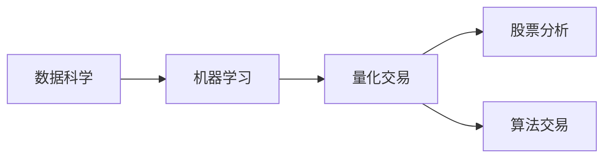

                 

# 如何将编程技能应用于自动化投资

> 关键词：自动化投资, 机器学习, 量化交易, 数据科学, 股票分析, 算法交易

## 1. 背景介绍

在金融投资的领域中，传统的基于经验和方法的投资方式已经逐渐被更加智能和精准的自动化投资所替代。自动化投资通过算法和数据驱动的方式，在多个维度（如市场分析、风险控制、策略执行等）实现对投资策略的优化和自动化，从而提升投资效率和收益。编程技能，尤其是数据科学、机器学习、算法交易等方面的知识，在自动化投资中起到了关键的作用。

自动化投资系统通常包括数据收集、数据分析、策略制定、模型训练和验证、交易执行等多个环节，每个环节都需要深厚的编程技能作为支撑。本文将介绍如何将编程技能应用于自动化投资，并涵盖从理论到实践的各个方面。

## 2. 核心概念与联系

### 2.1 核心概念概述

为了理解如何将编程技能应用于自动化投资，我们首先介绍几个关键概念：

- **数据科学(Data Science)**：通过数据收集、处理和分析，揭示数据背后的规律和趋势，为投资决策提供支持。

- **机器学习(Machine Learning)**：一种通过数据训练模型，让模型能够从数据中学习规律并做出预测或决策的技术。

- **量化交易(Quantitative Trading)**：利用数学模型、统计分析和计算机算法进行交易决策，以实现自动化、高频和精准的交易。

- **股票分析(Stock Analysis)**：使用各种方法分析股票的历史价格和相关数据，预测股票的走势和价值。

- **算法交易(Algorithmic Trading)**：基于数学模型和计算机算法自动执行交易，以实现策略的自动化和快速响应市场变化。

这些概念之间的关系可以通过以下Mermaid流程图展示：



### 2.2 核心概念原理和架构的 Mermaid 流程图


这个流程图展示了自动化投资系统的核心架构，包括数据采集、清洗、存储、特征工程、模型训练、验证、策略实施、交易执行和监控等多个环节。

## 3. 核心算法原理 & 具体操作步骤

### 3.1 算法原理概述

在自动化投资中，常用的算法包括：

- **统计分析**：如回归分析、时间序列分析等，用于发现价格变化的模式和规律。

- **机器学习模型**：如线性回归、随机森林、神经网络等，用于预测股票价格和市场走势。

- **量化交易算法**：如动量策略、均值回归策略、高盛算法等，用于自动执行交易决策。

### 3.2 算法步骤详解

以下是自动化投资中常见的算法步骤：

1. **数据收集**：从各大交易所、新闻、社交媒体等渠道收集股票价格、交易量、财务报表、新闻报道等多维数据。

2. **数据清洗**：对收集到的数据进行去重、缺失值处理、异常值检测等，保证数据的质量。

3. **特征工程**：通过技术手段从原始数据中提取有意义的特征，如移动平均、相对强弱指数(RSI)、成交量指标等。

4. **模型训练**：使用历史数据训练机器学习模型，选择最优模型参数，构建投资策略。

5. **模型验证**：使用历史数据验证模型的准确性和稳定性，确保模型不会过拟合。

6. **策略实施**：将模型应用于实时数据，自动进行交易决策。

7. **交易执行**：通过API接口将交易指令发送到交易所执行，实现自动交易。

8. **交易监控**：实时监控交易情况，防止模型失效或出现异常情况，及时调整策略。

### 3.3 算法优缺点

自动化投资的算法有以下优点：

- **客观性**：算法决策不受人类情绪和偏见的影响，更加客观公正。
- **高效性**：自动交易可以24小时不间断运行，快速响应市场变化。
- **一致性**：模型一旦训练完毕，即可重复应用，确保策略的一致性和稳定性。

同时，也存在一些缺点：

- **复杂性**：模型设计和优化过程复杂，需要深厚的编程和数学知识。
- **技术门槛高**：对于普通的投资者来说，使用自动化投资系统需要较高的技术门槛。
- **数据依赖**：模型的准确性高度依赖于数据的质量和数量。

### 3.4 算法应用领域

自动化投资的应用领域非常广泛，包括但不限于：

- **股票交易**：使用量化交易策略，自动执行买卖操作。
- **外汇交易**：利用算法进行货币对的多空策略，实现高频交易。
- **期货和期权交易**：使用量化策略进行套利和风险管理。
- **债券交易**：进行债券的定价和风险分析，自动化交易。
- **加密货币交易**：使用算法进行加密货币市场的交易和套利。

## 4. 数学模型和公式 & 详细讲解 & 举例说明

### 4.1 数学模型构建

在自动化投资中，常用的数学模型包括：

- **线性回归模型**：用于预测股票价格和市场趋势，公式为：
$$
y = \beta_0 + \beta_1 x_1 + \beta_2 x_2 + \ldots + \beta_n x_n + \epsilon
$$
其中 $y$ 为预测值，$\beta_i$ 为回归系数，$x_i$ 为自变量，$\epsilon$ 为误差项。

- **随机森林模型**：用于处理高维数据和复杂关系，公式为：
$$
F(x) = \frac{1}{M} \sum_{m=1}^M f_m(x)
$$
其中 $M$ 为森林中树的个数，$f_m$ 为第 $m$ 棵树。

### 4.2 公式推导过程

- **线性回归模型推导**：
  - 假设数据集 $D=\{(x_i,y_i)\}_{i=1}^N$，其中 $x_i$ 为自变量，$y_i$ 为因变量。
  - 最小二乘法求解回归系数 $\beta$：
$$
\beta = (X^TX)^{-1}X^Ty
$$
  - 将数据带入公式计算，得到回归模型。

- **随机森林模型推导**：
  - 通过自助法从数据集 $D$ 中随机抽取 $B$ 个样本，每个样本容量为 $N$，生成 $B$ 棵树。
  - 第 $m$ 棵树中，先随机选取特征，然后计算其信息增益，选择最优特征，作为树的根节点。
  - 根据最优特征对数据进行分割，递归构建树。
  - 最终，森林中所有树的预测结果取平均值，得到随机森林模型。

### 4.3 案例分析与讲解

假设我们要构建一个预测股票价格变化的随机森林模型：

1. **数据采集**：收集过去一年的每日股票价格、成交量、财务报表等数据。
2. **数据清洗**：去除缺失值和异常值，保证数据完整性。
3. **特征工程**：计算移动平均、RSI指标、成交量指标等。
4. **模型训练**：使用随机森林算法，训练出最优模型。
5. **模型验证**：使用验证集验证模型准确性，调整参数。
6. **策略实施**：将模型应用于实时数据，自动进行买卖操作。
7. **交易执行**：通过API接口发送到交易所执行交易。
8. **交易监控**：实时监控交易情况，防止模型失效或出现异常情况。

## 5. 项目实践：代码实例和详细解释说明

### 5.1 开发环境搭建

在自动化投资项目的开发过程中，我们需要使用多种编程语言和工具，如Python、R、SQL、MATLAB等。以下是基本的开发环境搭建步骤：

1. **安装Python**：
   - 下载并安装Python最新版本，设置环境变量。
   - 安装必要的依赖库，如NumPy、Pandas、Scikit-learn等。

2. **安装R**：
   - 下载并安装R最新版。
   - 安装必要的R包，如dplyr、ggplot2、tidyr等。

3. **安装SQL工具**：
   - 安装MySQL、PostgreSQL等数据库管理系统。
   - 使用SQL查询工具如PyMySQL、psycopg2等进行数据操作。

4. **安装MATLAB**：
   - 下载并安装MATLAB最新版。
   - 使用MATLAB进行数值计算和可视化。

### 5.2 源代码详细实现

以下是使用Python进行股票价格预测的代码实现：

```python
import pandas as pd
from sklearn.ensemble import RandomForestRegressor
from sklearn.model_selection import train_test_split

# 数据读取
df = pd.read_csv('stock_data.csv')

# 特征工程
features = ['price', 'volume', 'rsi', 'ema']
X = df[features]
y = df['price']

# 模型训练
X_train, X_test, y_train, y_test = train_test_split(X, y, test_size=0.2)
model = RandomForestRegressor(n_estimators=100, random_state=42)
model.fit(X_train, y_train)

# 模型验证
score = model.score(X_test, y_test)
print('R-squared:', score)

# 策略实施
real_data = pd.read_csv('real_data.csv')
real_features = features
real_X = real_data[real_features]
predictions = model.predict(real_X)
```

### 5.3 代码解读与分析

- **数据读取**：使用Pandas读取CSV格式的数据文件。
- **特征工程**：选取历史价格、成交量、RSI指标等特征，构建输入特征集X和目标变量y。
- **模型训练**：使用随机森林回归模型进行训练，调整参数。
- **模型验证**：使用测试集验证模型效果，输出R平方值。
- **策略实施**：将模型应用于实时数据，预测股票价格。

## 6. 实际应用场景

### 6.1 股票交易

在股票交易中，量化交易算法被广泛应用，常见的算法有动量策略、均值回归策略、高盛算法等。这些算法通过历史数据训练出模型，实时计算股票价格变化，自动执行买卖操作，从而实现自动化交易。

### 6.2 外汇交易

外汇交易中，量化交易同样扮演着重要角色。算法可以分析多币种间的汇率变化，执行套利策略，实现高频交易。

### 6.3 期货和期权交易

期货和期权交易需要高精度和高频率的决策，算法可以在市场波动时迅速调整策略，最大化收益。

### 6.4 债券交易

债券交易中，量化策略可以分析债券的信用评级、利率变化等因素，实现债券的定价和风险管理。

### 6.5 加密货币交易

加密货币市场波动剧烈，算法可以快速响应市场变化，执行自动交易，实现套利和风险管理。

## 7. 工具和资源推荐

### 7.1 学习资源推荐

为了掌握自动化投资的编程技能，推荐以下学习资源：

- **Coursera**：提供数据科学、机器学习、量化交易等课程，系统学习相关知识。
- **Kaggle**：进行数据科学竞赛，积累实战经验。
- **GitHub**：阅读开源项目，学习先进技术。
- **Arxiv**：阅读最新的学术论文，了解最新进展。

### 7.2 开发工具推荐

以下是几个常用的自动化投资开发工具：

- **Python**：作为数据科学和机器学习的主流语言，Python拥有丰富的库和框架。
- **R**：主要用于统计分析和数据可视化。
- **SQL**：用于数据库查询和管理。
- **MATLAB**：用于数值计算和可视化。

### 7.3 相关论文推荐

以下是几篇经典的自动化投资论文，推荐阅读：

- **Quantitative Trading: How to Build Your Own Algorithmic Trading Business**：详细介绍了量化交易的策略和实践。
- **Algorithmic Trading**：涵盖量化交易的各个方面，包括策略设计、模型构建和系统实现。
- **Machine Learning in Finance**：探讨了机器学习在金融领域的各种应用，如风险评估、信用评分等。

## 8. 总结：未来发展趋势与挑战

### 8.1 研究成果总结

自动化投资在金融领域的应用取得了显著的成果，提升了投资效率和收益。编程技能在其中起到了关键作用。

### 8.2 未来发展趋势

未来，自动化投资将呈现以下几个发展趋势：

- **智能化增强**：随着AI技术的发展，自动化投资系统将更加智能化，能够自动调整策略和参数，适应市场变化。
- **多模态融合**：未来的投资系统将融合多种数据源，如市场数据、社交媒体数据、财务数据等，提供更全面的投资决策支持。
- **个性化定制**：根据不同投资者的风险偏好和投资目标，提供个性化的投资建议和策略。
- **跨领域应用**：自动化投资将扩展到更多领域，如房地产、艺术品等，实现全方位的自动化投资。

### 8.3 面临的挑战

尽管自动化投资取得了一些成果，但也面临以下挑战：

- **数据质量问题**：数据的准确性和完整性直接影响到投资策略的可靠性。
- **模型复杂性**：自动化投资模型通常较为复杂，难以理解和解释。
- **技术门槛高**：投资者需要具备较高的编程和数学知识，才能使用自动化投资系统。
- **市场变化快**：市场环境快速变化，需要实时调整策略，才能保持竞争力。

### 8.4 研究展望

未来，自动化投资需要解决以下问题：

- **提高数据质量**：采用数据清洗和增强技术，提高数据的准确性和完整性。
- **简化模型复杂性**：开发更加简单和易解释的模型，降低技术门槛。
- **适应市场变化**：实时监控市场情况，动态调整策略，应对快速变化的市场环境。
- **融合跨领域数据**：实现多数据源的融合和分析，提供更全面的投资决策支持。

## 9. 附录：常见问题与解答

### 9.1 常见问题与解答

**Q1：自动化投资是否适用于所有投资者？**

A: 自动化投资适用于有较高技术能力和风险承受能力的投资者。但对于普通投资者，建议先进行模拟测试，熟悉系统的使用方法，再逐步应用到实际投资中。

**Q2：自动化投资系统如何处理数据质量问题？**

A: 数据质量问题主要通过数据清洗和增强技术来解决。常见的处理方法包括缺失值填补、异常值检测、数据标准化等。

**Q3：自动化投资系统的核心优势是什么？**

A: 自动化投资系统的核心优势在于客观性、高效性和一致性。算法决策不受人类情绪和偏见的影响，能够24小时不间断运行，确保策略的一致性和稳定性。

**Q4：自动化投资系统是否需要不断维护和更新？**

A: 是的，自动化投资系统需要根据市场变化和数据更新，定期维护和更新策略和模型，确保系统的持续优化和稳定运行。

**Q5：自动化投资系统如何平衡风险和收益？**

A: 自动化投资系统通过风险控制算法，如止损、限仓、动态调整策略等，平衡风险和收益。需要根据投资者风险偏好，设定合理的参数和阈值。

---

作者：禅与计算机程序设计艺术 / Zen and the Art of Computer Programming

