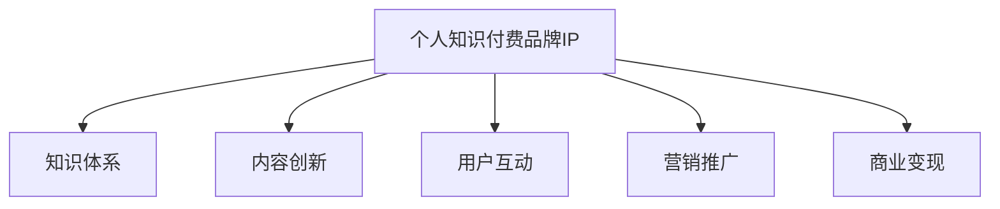

                 

# 如何打造个人知识付费品牌IP

## 1. 背景介绍

### 1.1 问题由来

随着互联网的发展和信息时代的来临，知识付费已经成为了一种新的经济模式，尤其在知识消费需求日益增长的今天，个人品牌IP在知识付费领域的重要性也愈发凸显。在知识付费领域，个人IP不仅是知识的提供者，更是知识的传播者和引领者。打造个人知识付费品牌IP，不仅能提升个人品牌价值，还能为受众提供更高质量和更有价值的知识服务。

### 1.2 问题核心关键点

打造个人知识付费品牌IP的核心关键点在于：

- 构建知识体系：建立专业的知识体系，形成核心竞争力。
- 内容创新：提供新颖、高质量的内容，满足受众的需求和期待。
- 用户互动：与用户进行互动，建立良好的关系和信任基础。
- 营销推广：采用有效的营销策略，提升品牌知名度和影响力。
- 商业变现：实现商业变现，提高个人品牌价值和经济效益。

### 1.3 问题研究意义

个人知识付费品牌IP的打造，对于知识生产者和消费者都具有重要意义：

1. 对于知识生产者而言，打造个人品牌IP能够提升其在知识付费市场中的竞争力，吸引更多受众，增加收入来源。
2. 对于知识消费者而言，借助知名IP能够获得更多优质内容，提升学习效率，达到更好的知识吸收效果。

## 2. 核心概念与联系

### 2.1 核心概念概述

为更好地理解个人知识付费品牌IP的打造，本节将介绍几个密切相关的核心概念：

- 个人知识付费品牌IP：指在知识付费领域内，以个人为主体，通过提供高质量的知识内容，建立有影响力的人格特质和品牌形象，最终形成稳定的受众群体和商业变现能力。
- 知识体系：指围绕某一特定领域，组织和构建的系统的、完整的知识体系框架。
- 内容创新：指不断推出新的、独到的知识内容和形式，提升内容的吸引力和价值。
- 用户互动：指通过各种方式与受众进行沟通和交流，建立良好的互动关系，提升用户粘性。
- 营销推广：指利用各种渠道和策略，提高个人品牌的知名度和影响力。
- 商业变现：指通过知识付费平台的销售渠道，将知识服务转化为实际的收入。

这些核心概念之间的逻辑关系可以通过以下Mermaid流程图来展示：



这个流程图展示出个人品牌IP的形成过程：

1. 个人品牌IP的构建以知识体系为核心。
2. 内容创新和用户互动为个人品牌IP的强化提供动力。
3. 营销推广为个人品牌IP的扩展和延伸提供渠道。
4. 商业变现则为个人品牌IP的长期发展提供经济支持。

## 3. 核心算法原理 & 具体操作步骤

### 3.1 算法原理概述

个人知识付费品牌IP的打造，本质上是一个多目标优化问题。其核心思想是：通过持续优化知识体系、内容创新、用户互动、营销推广和商业变现等各个环节，最终形成有影响力的个人品牌。

形式化地，设知识体系为 $K$，内容创新为 $C$，用户互动为 $I$，营销推广为 $M$，商业变现能力为 $R$。则个人品牌IP的优化目标为：

$$
\max_{K, C, I, M, R} \{V(K, C, I, M, R)\}
$$

其中 $V$ 为品牌价值的量化函数，综合考虑知识体系的质量、内容创新的新颖性、用户互动的深度、营销推广的广度和商业变现的能力。

### 3.2 算法步骤详解

个人品牌IP的打造一般包括以下几个关键步骤：

**Step 1: 知识体系构建**

- 根据个人兴趣和专长，梳理并构建一个结构化的知识体系框架。
- 通过阅读、研究、实践等方式，不断丰富和完善知识体系，使其具有权威性和实用性。

**Step 2: 内容创新**

- 定期推出新的知识内容，如文章、视频、直播等，保持内容的活跃性和新鲜感。
- 采用多样化的内容形式，如图文结合、互动问答、案例分析等，提升用户阅读体验。

**Step 3: 用户互动**

- 利用社交媒体、论坛、直播等平台与受众进行互动，回答用户问题，提供个性化建议。
- 定期开展线上线下活动，如读书会、研讨会、讲座等，增强用户参与感。

**Step 4: 营销推广**

- 利用SEO、社交媒体广告、邮件营销等手段，提升品牌知名度。
- 参与行业会议、活动、论坛等，扩大个人品牌影响力。

**Step 5: 商业变现**

- 在知识付费平台开设专栏或课程，提供有偿的知识服务。
- 通过文章打赏、社群付费、赞助合作等方式，实现商业变现。

### 3.3 算法优缺点

个人知识付费品牌IP的打造方法具有以下优点：

1. 提升品牌价值：通过持续优化各个环节，逐步提升品牌知名度和影响力。
2. 满足用户需求：内容创新和用户互动能更好地满足用户需求，提升用户满意度和忠诚度。
3. 促进商业变现：品牌价值的提升有助于推动商业变现，实现经济收益。

同时，该方法也存在一定的局限性：

1. 高门槛要求：需要具备较强的知识储备和表达能力，才能打造高质量的个人品牌。
2. 时间和资源投入大：从内容创作到营销推广，需要大量的时间和资源投入。
3. 品牌维护难度大：品牌形象的维护需要持续的投入和努力，稍有懈怠可能影响品牌声誉。

尽管存在这些局限性，但个人品牌IP的打造对于知识生产者和消费者都具有重要的价值，是知识付费领域的重要发展方向。

### 3.4 算法应用领域

个人知识付费品牌IP的打造方法，在知识付费领域已经得到了广泛的应用，涵盖了许多不同的领域，如：

- 技术分享：如编程、数据分析、人工智能等，提供技术培训和项目实战经验。
- 商业管理：如财务管理、市场营销、企业管理等，提供商业实战策略和案例分析。
- 教育培训：如K-12教育、职业培训、语言学习等，提供教育资源和指导。
- 健康生活：如健身、饮食、心理健康等，提供健康指导和生活建议。
- 文化娱乐：如影视评论、文学创作、音乐表演等，提供文化知识和艺术欣赏。

这些领域都是个人知识付费品牌IP的主要应用场景，个人品牌IP的打造为这些领域注入了新的活力，推动了知识付费的产业升级。

## 4. 数学模型和公式 & 详细讲解 & 举例说明

### 4.1 数学模型构建

设品牌价值的量化函数为：

$$
V(K, C, I, M, R) = f(K) + g(C) + h(I) + j(M) + k(R)
$$

其中：

- $f(K)$ 为知识体系的质量贡献。
- $g(C)$ 为内容创新的新颖性贡献。
- $h(I)$ 为用户互动的深度贡献。
- $j(M)$ 为营销推广的广度贡献。
- $k(R)$ 为商业变现能力贡献。

### 4.2 公式推导过程

具体而言，我们可以使用AHP（层次分析法）对品牌价值进行量化计算：

1. 构建层次结构：分为目标层、准则层和方案层。
2. 构建判断矩阵：对每个准则和方案，建立判断矩阵，进行两两比较。
3. 求权重向量：通过求解判断矩阵的特征向量，得到各准则和方案的权重。
4. 综合评价：将各准则和方案的权重与实际值进行综合，得到品牌价值的量化结果。

例如，假设某知识生产者 $A$ 的知识体系 $K_A$、内容创新 $C_A$、用户互动 $I_A$、营销推广 $M_A$ 和商业变现能力 $R_A$ 的量化值分别为：

- $K_A = 85$
- $C_A = 90$
- $I_A = 80$
- $M_A = 75$
- $R_A = 80$

根据判断矩阵，计算各准则和方案的权重向量：

- $f(K_A) = 0.6 \times 85$
- $g(C_A) = 0.3 \times 90$
- $h(I_A) = 0.1 \times 80$
- $j(M_A) = 0.3 \times 75$
- $k(R_A) = 0.2 \times 80$

将各准则和方案的权重与实际值进行综合，得到品牌价值的量化结果：

$$
V(K_A, C_A, I_A, M_A, R_A) = 0.6 \times 85 + 0.3 \times 90 + 0.1 \times 80 + 0.3 \times 75 + 0.2 \times 80 = 86.5
$$

即该知识生产者 $A$ 的品牌价值为 $86.5$。

### 4.3 案例分析与讲解

假设某知识生产者 $B$ 在知识付费平台提供了一门“Python数据分析实战”课程，具体步骤如下：

1. **知识体系构建**：
   - 梳理了Python数据分析的完整知识体系，涵盖数据清洗、数据可视化、机器学习等环节。
   - 结合自己的实践经验，编写了详细的教程和案例分析。

2. **内容创新**：
   - 定期推出新的内容，如数据分析项目实战、Python技巧分享等。
   - 采用视频直播的形式，实时解答用户问题，提升互动性。

3. **用户互动**：
   - 在社交媒体上定期发布课程内容预告，吸引用户关注。
   - 在课程讨论区收集用户反馈，及时调整课程内容和形式。

4. **营销推广**：
   - 利用SEO优化，提升课程在搜索引擎中的排名。
   - 参与行业会议，与业内人士进行交流，扩大知名度。

5. **商业变现**：
   - 在知识付费平台开设课程，定价为 $99/期$。
   - 通过学员打赏、课程推荐等方式，实现额外收入。

通过以上步骤，知识生产者 $B$ 能够逐步提升品牌知名度和影响力，实现商业变现，提升个人品牌价值。

## 5. 项目实践：代码实例和详细解释说明

### 5.1 开发环境搭建

在进行个人知识付费品牌IP的打造时，需要一个完整的开发环境。以下是搭建开发环境的详细步骤：

1. 安装Python：在操作系统中安装Python解释器和相关库。
2. 安装Jupyter Notebook：安装Jupyter Notebook，用于编写和运行Python代码。
3. 安装Django：安装Django框架，用于搭建个人网站。
4. 安装Pillow：安装Pillow库，用于图片处理。
5. 安装Flask：安装Flask框架，用于搭建API接口。

完成上述步骤后，即可在本地搭建完整的开发环境，开始个人品牌IP的打造。

### 5.2 源代码详细实现

以下是一个简单的Python Flask应用，用于个人知识付费品牌IP的营销推广：

```python
from flask import Flask, request, jsonify

app = Flask(__name__)

@app.route('/register', methods=['POST'])
def register():
    data = request.json
    # 注册流程，将用户信息存入数据库
    return jsonify({'status': 'success'})

@app.route('/login', methods=['POST'])
def login():
    data = request.json
    # 登录流程，验证用户信息，返回Token
    return jsonify({'status': 'success', 'token': 'abc123'})

@app.route('/dashboard', methods=['GET'])
def dashboard():
    token = request.args.get('token')
    # 访问仪表盘，获取用户数据分析
    return jsonify({'status': 'success', 'data': {}})

if __name__ == '__main__':
    app.run(debug=True)
```

### 5.3 代码解读与分析

让我们再详细解读一下关键代码的实现细节：

**注册与登录功能**：
- `register` 函数用于处理用户注册请求，将用户信息存入数据库。
- `login` 函数用于处理用户登录请求，验证用户信息，返回Token。

**仪表盘功能**：
- `dashboard` 函数用于处理仪表盘访问请求，获取用户数据分析，返回数据结果。

整个应用使用Flask框架，提供了简单的注册、登录和仪表盘功能，方便个人知识付费品牌IP的管理和推广。

### 5.4 运行结果展示

运行上述代码后，可以在本地启动Flask应用，通过浏览器访问 `http://localhost:5000`，看到注册、登录和仪表盘页面，完成个人知识付费品牌IP的初步搭建。

## 6. 实际应用场景

### 6.1 技术分享平台

个人知识付费品牌IP在技术分享平台上具有广泛的应用前景。技术分享平台为知识生产者提供了一个展示和传播知识的舞台，也吸引了大批技术爱好者和从业者。通过打造个人品牌IP，技术分享者可以迅速提升自身影响力，获得更多粉丝和关注。

例如，某技术分享者可以开设Python、Java、机器学习等领域的专栏或课程，定期分享最新的技术动态、项目实战经验、编程技巧等内容。通过与用户互动、开展线上线下活动等方式，建立稳定的受众群体，最终实现商业变现。

### 6.2 商业管理咨询

商业管理咨询领域也需要个人知识付费品牌IP的支持。随着企业管理的复杂性和竞争性加剧，许多企业急需专业的管理咨询顾问。通过打造个人品牌IP，商业管理咨询者可以展示自己的专业知识和管理经验，获得更多企业客户的认可和信任。

例如，某商业管理咨询者可以开设财务管理、市场营销、企业管理等领域的课程或咨询服务，提供实用的管理策略和案例分析。通过在社交媒体上发布专业见解，参加行业会议，扩大知名度，吸引更多企业客户，最终实现商业变现。

### 6.3 教育培训平台

教育培训平台是个人知识付费品牌IP的重要应用场景之一。教育培训平台为各类教育机构和个人提供了展示和传播知识的机会，吸引了大批学习者。通过打造个人品牌IP，教育培训者可以提升自身影响力，获得更多学员和客户。

例如，某教育培训者可以开设K-12教育、职业培训、语言学习等领域的课程或辅导，提供优质的教学资源和个性化指导。通过在社交媒体上发布学习心得、与学员互动，建立稳定的学员群体，最终实现商业变现。

### 6.4 未来应用展望

随着知识付费市场的不断发展，个人知识付费品牌IP的应用场景还将不断扩展，为更多领域带来变革性影响。

在智慧医疗领域，个人知识付费品牌IP可以为医生和患者提供高质量的医学知识和咨询服务，提升医疗服务的智能化水平。

在智能教育领域，个人知识付费品牌IP可以为学生和教师提供全面的教育资源和指导，提升教育质量和公平性。

在智慧城市治理中，个人知识付费品牌IP可以为城市管理者提供科学的城市规划和管理建议，提高城市管理的自动化和智能化水平。

此外，在企业生产、社会治理、文娱传媒等众多领域，个人知识付费品牌IP也将不断涌现，为经济社会发展注入新的动力。

## 7. 工具和资源推荐

### 7.1 学习资源推荐

为了帮助开发者系统掌握个人知识付费品牌IP的打造过程，这里推荐一些优质的学习资源：

1. 《知识付费平台运营实战》系列博文：由知识付费平台运营专家撰写，深入浅出地介绍了知识付费平台的搭建、运营和优化策略。

2. 《内容营销：打造个人品牌IP》课程：知名内容营销专家开设的课程，涵盖内容创作、社交媒体营销、用户互动等环节，教你如何打造有影响力的个人品牌IP。

3. 《打造个人知识付费品牌IP》书籍：全面介绍了个人知识付费品牌IP的打造过程，包括知识体系构建、内容创新、用户互动、营销推广和商业变现等环节，适合有一定行业背景的读者。

4. Udemy《知识付费课程设计》课程：由知识付费课程设计专家开设的课程，教你如何设计高效、有趣、有价值的知识课程。

5. Coursera《数字营销》课程：由知名大学开设的课程，涵盖数字营销的各个环节，帮助你提升营销推广能力。

通过对这些资源的学习实践，相信你一定能够快速掌握个人知识付费品牌IP的打造精髓，并用于解决实际的NLP问题。

### 7.2 开发工具推荐

高效的开发离不开优秀的工具支持。以下是几款用于个人知识付费品牌IP开发的常用工具：

1. Python：作为知识付费品牌IP开发的常用语言，Python具有简单易用、功能强大的特点，适合快速迭代研究。

2. Jupyter Notebook：用于编写和运行Python代码，支持交互式开发和实时预览。

3. Django：用于搭建个人网站，支持丰富的功能模块和插件，适合搭建知识付费平台。

4. Flask：用于搭建API接口，轻量级且易于扩展，适合实现复杂的营销推广功能。

5. Markdown：用于编写博客和文档，格式简洁易读，支持丰富的排版和格式功能。

6. GitHub：用于版本控制和代码托管，支持团队协作和项目管理，适合知识付费品牌IP的持续优化和迭代。

合理利用这些工具，可以显著提升个人知识付费品牌IP的开发效率，加快创新迭代的步伐。

### 7.3 相关论文推荐

个人知识付费品牌IP的发展源于学界的持续研究。以下是几篇奠基性的相关论文，推荐阅读：

1. 《知识付费平台的运营策略与挑战》：分析了知识付费平台的运营策略和面临的挑战，提出了一系列优化建议。

2. 《内容营销的理论与实践》：探讨了内容营销的理论基础和实际应用，提供了丰富的案例和策略。

3. 《知识付费平台的商业模式分析》：分析了知识付费平台的商业模式和盈利模式，提出了多种商业变现策略。

4. 《社交媒体对知识付费品牌IP的影响》：研究了社交媒体对个人品牌IP的影响，提出了增强社交媒体互动的策略。

5. 《知识付费平台的流量获取与用户留存》：探讨了知识付费平台的流量获取和用户留存问题，提出了优化建议。

这些论文代表了大知识付费品牌IP的发展脉络。通过学习这些前沿成果，可以帮助研究者把握学科前进方向，激发更多的创新灵感。

## 8. 总结：未来发展趋势与挑战

### 8.1 总结

本文对个人知识付费品牌IP的打造方法进行了全面系统的介绍。首先阐述了个人知识付费品牌IP在知识付费领域的重要性和构建过程。其次，从原理到实践，详细讲解了知识体系构建、内容创新、用户互动、营销推广和商业变现等各个环节，给出了个人品牌IP的完整代码实例。同时，本文还广泛探讨了个人知识付费品牌IP在技术分享、商业管理咨询、教育培训等多个领域的应用前景，展示了个人品牌IP的巨大潜力。此外，本文精选了知识付费平台开发、内容创作、用户互动等各类学习资源，力求为读者提供全方位的技术指引。

通过本文的系统梳理，可以看到，个人知识付费品牌IP的打造是一个多目标优化问题，需要持续优化知识体系、内容创新、用户互动、营销推广和商业变现等各个环节，才能逐步形成有影响力的品牌。未来，伴随知识付费市场的不断发展和技术的持续创新，个人品牌IP必将在更多的领域和场景中大放异彩。

### 8.2 未来发展趋势

展望未来，个人知识付费品牌IP的打造将呈现以下几个发展趋势：

1. 技术融合增强：随着AI、大数据、区块链等技术的普及，个人品牌IP将与更多技术手段相结合，提升智能化水平和安全性。

2. 内容多样化发展：除了传统的文字、视频、音频等形式，个人品牌IP将逐渐向交互式、沉浸式等新型内容形式扩展，提升用户体验。

3. 用户互动深化：利用AI聊天机器人、智能推荐等技术，深入挖掘用户需求，提供个性化、定制化的内容和服务。

4. 营销策略创新：借助社交媒体、短视频平台等新兴渠道，实现精准营销，提升品牌传播效果。

5. 商业变现多样化：除了传统的课程销售、打赏等形式，个人品牌IP将探索更多元化的商业变现途径，如品牌代言、知识变现、版权交易等。

这些趋势凸显了个人知识付费品牌IP的广阔前景，为知识生产者和消费者带来了新的机遇和挑战。

### 8.3 面临的挑战

尽管个人知识付费品牌IP的打造取得了瞩目成就，但在迈向更加智能化、普适化应用的过程中，它仍面临着诸多挑战：

1. 知识体系构建难度大：需要具备较强的专业知识和表达能力，才能构建系统的知识体系框架。

2. 内容创新和用户互动成本高：内容创作和用户互动需要大量时间和精力，且难以保证持续输出高质量内容。

3. 营销推广难度大：利用新兴渠道和方式进行品牌推广，需要不断学习和适应。

4. 商业变现风险高：商业变现涉及复杂的运营和盈利模式，需要较强的市场洞察和运营能力。

5. 品牌维护难度大：个人品牌IP需要持续的维护和优化，稍有懈怠可能影响品牌声誉。

尽管存在这些挑战，但通过持续优化和创新，个人知识付费品牌IP仍将在知识付费领域取得更大的成功。

### 8.4 研究展望

面对个人知识付费品牌IP所面临的种种挑战，未来的研究需要在以下几个方面寻求新的突破：

1. 优化知识体系构建方法：利用人工智能和大数据分析，构建更加系统、全面的知识体系框架。

2. 创新内容创作和用户互动方式：借助AI生成、自动化工具等技术，提高内容创作效率，增强用户互动体验。

3. 探索新兴渠道和方式进行品牌推广：利用社交媒体、短视频平台等新兴渠道，实现精准营销，提升品牌传播效果。

4. 构建多元化的商业变现模式：探索更多元化的商业变现途径，如品牌代言、知识变现、版权交易等，提升商业变现能力。

5. 加强品牌维护和优化：利用AI监测和分析工具，实时评估品牌健康状态，及时调整和优化策略。

这些研究方向的探索，必将引领个人知识付费品牌IP的持续发展，为知识付费领域注入新的活力和动力。

## 9. 附录：常见问题与解答

**Q1: 如何判断个人知识付费品牌IP的成功？**

A: 个人知识付费品牌IP的成功可以从以下几个方面进行衡量：

1. 用户数量：关注品牌IP的粉丝和订阅用户数量，是否呈现持续增长的趋势。
2. 内容质量：评估品牌IP提供的内容质量，是否具有专业性、实用性和新颖性。
3. 用户互动：分析用户互动数据，如评论、点赞、分享等，是否积极参与和反馈。
4. 商业变现：统计品牌IP的收入来源和盈利模式，是否实现了商业变现。

**Q2: 个人知识付费品牌IP的定位应如何确定？**

A: 确定个人知识付费品牌IP的定位需要考虑以下几个因素：

1. 自身兴趣和专长：选择自己最熟悉和擅长的领域，建立知识体系和内容创作基础。
2. 目标用户需求：分析目标用户的需求和痛点，选择具有市场潜力的领域进行切入。
3. 市场竞争情况：调研市场竞争情况，选择具有差异化和竞争优势的领域进行定位。
4. 商业变现策略：考虑商业变现的可行性，选择具备较好商业前景的领域进行打造。

**Q3: 个人知识付费品牌IP的营销推广策略有哪些？**

A: 个人知识付费品牌IP的营销推广策略包括：

1. 社交媒体营销：利用微信、微博、抖音等社交平台进行品牌推广，吸引更多用户关注和参与。
2. 内容营销：通过撰写文章、制作视频等方式，分享高质量内容，吸引更多用户访问和订阅。
3. SEO优化：优化网站和博客的SEO策略，提升搜索引擎排名，获取更多流量。
4. 付费广告：利用Google Ad、Baidu推广等平台进行付费广告投放，提高品牌知名度。
5. 线下活动：举办线上线下活动，如讲座、读书会、研讨会等，增强用户参与感和互动性。

**Q4: 个人知识付费品牌IP的品牌维护策略有哪些？**

A: 个人知识付费品牌IP的品牌维护策略包括：

1. 持续优化内容：定期推出高质量内容，保持内容更新和活跃性。
2. 建立用户社区：通过社交媒体、微信群等方式，建立用户社区，增强用户粘性和互动。
3. 用户反馈机制：建立用户反馈机制，及时了解用户需求和意见，进行改进和优化。
4. 品牌宣传和保护：利用法律手段，保护品牌知识产权，防止侵权和恶意竞争。
5. 定期评估和调整：定期评估品牌健康状态，及时调整策略和优化方案。

这些策略能够帮助个人知识付费品牌IP保持长期稳定发展，提升品牌价值和经济效益。

**Q5: 个人知识付费品牌IP如何实现商业变现？**

A: 个人知识付费品牌IP的商业变现可以通过以下途径实现：

1. 知识付费课程：在知识付费平台开设课程，提供有偿的知识服务。
2. 付费会员服务：提供高级会员服务，提供额外的知识资源和个性化指导。
3. 广告和赞助：通过品牌广告和赞助合作等方式，实现商业变现。
4. 周边产品销售：开发与品牌IP相关的周边产品，如图书、课程资料等，进行销售。
5. 咨询服务：提供专业咨询和个性化指导，实现增值服务。

通过以上商业变现途径，个人知识付费品牌IP能够实现长期稳定的收入来源，提升品牌价值。

---

作者：禅与计算机程序设计艺术 / Zen and the Art of Computer Programming

