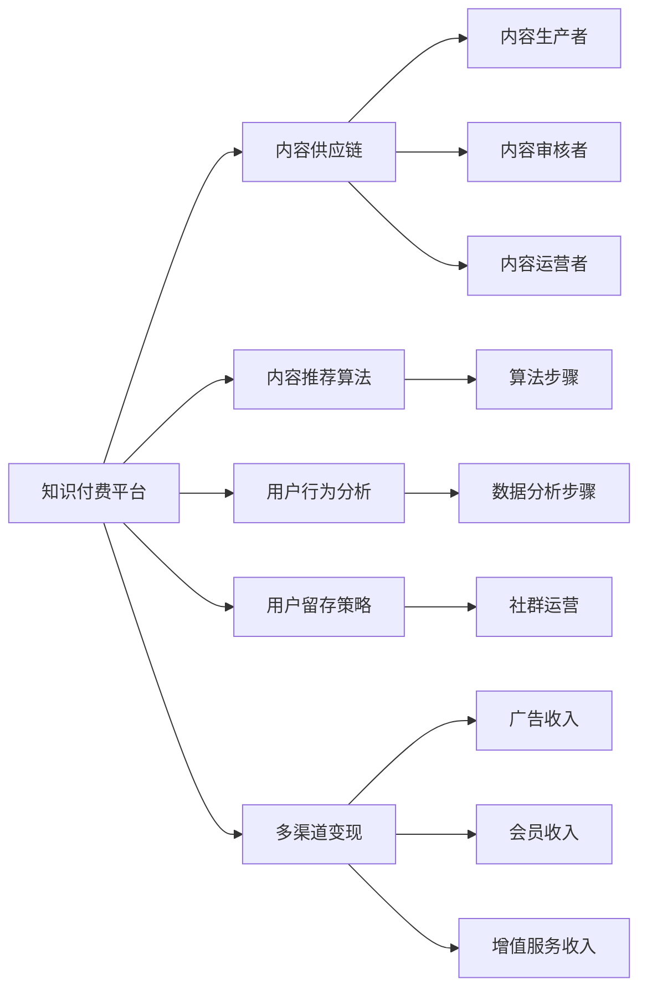

                 

# 如何打造个人知识付费商业帝国

## 1. 背景介绍

### 1.1 问题由来

随着互联网和智能设备的普及，信息获取变得更加便捷，但同时也加剧了信息过载的问题。传统的以文字、图片为主的单一内容形式难以满足用户的多元化需求。知识付费作为一种新兴的信息消费方式，通过提供深度、结构化、多元化的内容，解决用户对高质量、专业化信息的需求，成为信息消费的新趋势。

### 1.2 问题核心关键点

知识付费的成功在于构建一个持续、稳定、高质量的内容供应链，同时需要精准把握用户需求，利用有效的营销手段，构建稳定的用户社群。以下列举了知识付费商业帝国的核心关键点：

- 知识内容供应链的构建与优化：高质量内容的持续产出和优化。
- 用户需求的精准把握：深度挖掘用户痛点，定制化内容。
- 精准的营销手段：高效、低成本地获取并锁定用户。
- 稳定的用户社群构建：建立忠诚的社区，促进口碑传播。
- 多维度收益来源：除了内容付费，还有广告、会员、增值服务等多种收益渠道。

### 1.3 问题研究意义

知识付费的成功不仅能为内容生产者带来丰厚的经济回报，也能为内容消费者提供更优质、高效、个性化的信息服务。通过知识付费，消费者能够快速解决实际问题，提高个人技能和工作效率，实现自我提升和职业发展。

## 2. 核心概念与联系

### 2.1 核心概念概述

构建知识付费商业帝国，涉及一系列关键概念和技术：

- **知识付费平台**：提供知识内容交易和服务的中介平台，包括内容发布、用户互动、交易结算等功能。
- **内容供应链**：由内容生产者、内容审核者、内容运营者组成的系统，负责内容生产、筛选、优化、分发。
- **内容推荐算法**：通过算法技术，精准匹配用户和内容，提升用户体验和平台留存率。
- **用户行为分析**：通过数据分析，理解用户需求和行为，优化内容和运营策略。
- **用户留存策略**：通过社群运营、个性化推送等手段，提升用户粘性和复购率。
- **多渠道变现**：除了直接的内容付费，还有广告、会员、增值服务等多种收益渠道。

这些概念之间存在着紧密的联系和相互作用，共同构成了知识付费商业帝国的核心架构。

### 2.2 核心概念原理和架构的 Mermaid 流程图



通过这个图，我们可以清晰地看到各个概念之间的相互依赖和支持关系。

## 3. 核心算法原理 & 具体操作步骤

### 3.1 算法原理概述

构建知识付费商业帝国，涉及多个关键算法和模型，主要包括：

- **内容推荐算法**：通过协同过滤、内容召回、深度学习等技术，精准匹配用户和内容。
- **用户行为分析模型**：通过时间序列分析、关联规则挖掘、情感分析等技术，理解用户需求和行为。
- **社群运营算法**：通过网络分析、行为预测、内容定制等技术，提升用户粘性和活跃度。

这些算法和模型相互配合，构建起一个高质量、高效、智能的商业生态。

### 3.2 算法步骤详解

#### 3.2.1 内容推荐算法

推荐算法主要分为两大类：协同过滤和内容召回。协同过滤算法通过用户行为数据，找到兴趣相似的用户，推荐其可能感兴趣的内容。内容召回算法则通过内容的特征，匹配用户可能感兴趣的内容。

**算法步骤**：

1. 收集用户行为数据，包括浏览、点击、收藏、购买等行为。
2. 利用协同过滤算法，找到与用户兴趣相似的其他用户，推荐其浏览过但用户未点击的内容。
3. 利用内容召回算法，将用户可能感兴趣的内容召回，提供给用户选择。
4. 根据用户的反馈数据（如点击率、评分等），不断优化推荐结果。

#### 3.2.2 用户行为分析模型

用户行为分析模型主要通过时间序列分析、关联规则挖掘等技术，理解用户的行为模式和需求。

**算法步骤**：

1. 收集用户的行为数据，包括访问时间、页面停留时间、点击深度等。
2. 利用时间序列分析技术，挖掘用户行为的季节性、周期性规律。
3. 利用关联规则挖掘技术，找到用户行为之间的关联性，识别用户需求。
4. 利用机器学习模型，预测用户未来的行为，优化内容和运营策略。

#### 3.2.3 社群运营算法

社群运营算法通过网络分析、行为预测等技术，提升用户粘性和活跃度。

**算法步骤**：

1. 收集用户的行为数据，包括社交互动、内容分享、评论等。
2. 利用网络分析技术，识别用户之间的关系和社群结构。
3. 利用行为预测技术，预测用户未来的互动行为，精准推送个性化内容。
4. 利用社群运营策略，提升用户粘性和复购率，构建稳定的用户社群。

### 3.3 算法优缺点

#### 3.3.1 内容推荐算法的优缺点

**优点**：
- 个性化推荐，提升用户体验。
- 利用大数据，提供精准推荐。
- 动态调整推荐策略，优化推荐结果。

**缺点**：
- 数据隐私问题，需要严格保护用户隐私。
- 推荐算法复杂，需要大量的计算资源。
- 推荐结果可能存在偏差，需要持续优化。

#### 3.3.2 用户行为分析模型的优缺点

**优点**：
- 深入挖掘用户需求，优化内容和运营策略。
- 预测用户行为，提升用户体验和留存率。

**缺点**：
- 数据量巨大，需要高效的存储和处理技术。
- 模型复杂，需要大量的计算资源。
- 用户行为多样，模型难以完全覆盖。

#### 3.3.3 社群运营算法的优缺点

**优点**：
- 提升用户粘性和活跃度，构建稳定的用户社群。
- 利用网络分析技术，深入理解用户关系和社群结构。

**缺点**：
- 数据隐私问题，需要严格保护用户隐私。
- 算法复杂，需要大量的计算资源。
- 社群运营策略需要持续优化，难度较大。

### 3.4 算法应用领域

这些算法和模型广泛应用于知识付费平台的各个环节，包括内容推荐、用户行为分析、社群运营等，为用户提供个性化、高效、智能的服务。

## 4. 数学模型和公式 & 详细讲解 & 举例说明

### 4.1 数学模型构建

构建知识付费商业帝国，需要多个数学模型支撑，主要包括：

- **协同过滤算法**：通过用户行为数据，找到兴趣相似的用户。
- **内容召回算法**：通过内容的特征，匹配用户可能感兴趣的内容。
- **时间序列分析模型**：通过时间序列数据，挖掘用户行为的季节性、周期性规律。
- **关联规则挖掘模型**：通过用户行为数据，找到用户行为之间的关联性。
- **机器学习模型**：通过预测用户行为，优化内容和运营策略。

### 4.2 公式推导过程

#### 4.2.1 协同过滤算法

协同过滤算法主要通过计算用户之间的相似度，推荐用户可能感兴趣的内容。

**公式推导**：
1. 计算用户 $i$ 和 $j$ 的相似度 $s_{ij}$：
   $$
   s_{ij} = \frac{\sum_k (p_{ik}p_{jk})}{\sqrt{\sum_k p_{ik}^2}\sqrt{\sum_k p_{jk}^2}}
   $$
   其中 $p_{ik}$ 和 $p_{jk}$ 分别表示用户 $i$ 和 $j$ 对内容 $k$ 的评分。

2. 推荐内容 $k$ 给用户 $i$：
   $$
   r_{ik} = \max_{j \neq i} \frac{s_{ij}}{\sqrt{\sum_k p_{ik}^2 + \sum_k p_{ik}^2}}
   $$
   选择相似度最高且不与用户 $i$ 重合的内容进行推荐。

#### 4.2.2 内容召回算法

内容召回算法主要通过内容的特征，匹配用户可能感兴趣的内容。

**公式推导**：
1. 计算内容 $k$ 的特征向量 $f_k$。
2. 计算用户 $i$ 的兴趣向量 $u_i$。
3. 计算用户 $i$ 对内容 $k$ 的召回评分 $s_{ik}$：
   $$
   s_{ik} = u_i^Tf_k
   $$
   其中 $u_i$ 和 $f_k$ 分别为用户 $i$ 和内容 $k$ 的兴趣向量和特征向量。

4. 推荐内容 $k$ 给用户 $i$：
   $$
   k^* = \arg\max_k s_{ik}
   $$
   选择召回评分最高的内容进行推荐。

#### 4.2.3 时间序列分析模型

时间序列分析模型通过时间序列数据，挖掘用户行为的季节性、周期性规律。

**公式推导**：
1. 假设用户 $i$ 在时间 $t$ 的行为数据为 $X_{it}$。
2. 利用自回归移动平均模型（ARMA），拟合用户 $i$ 的时间序列数据：
   $$
   X_{it} = \phi(X_{i,t-1}, X_{i,t-2}, ... , X_{i,t-p}) + \theta(X_{i,t-1}, X_{i,t-2}, ... , X_{i,t-q}) + \epsilon_{it}
   $$
   其中 $\phi$ 和 $\theta$ 分别为自回归和移动平均的系数，$\epsilon_{it}$ 为误差项。

3. 利用指数平滑法，预测用户 $i$ 在时间 $t+1$ 的行为数据：
   $$
   \hat{X}_{i,t+1} = \alpha X_{it} + (1-\alpha)\hat{X}_{i,t}
   $$
   其中 $\alpha$ 为指数平滑系数。

#### 4.2.4 关联规则挖掘模型

关联规则挖掘模型通过用户行为数据，找到用户行为之间的关联性。

**公式推导**：
1. 假设用户 $i$ 的行为数据为 $B_i$。
2. 利用频繁项集挖掘技术，找到频繁出现的行为序列 $S$。
3. 利用关联规则挖掘技术，找到规则 $R$：
   $$
   R = \{(A, B)\mid supp(A \rightarrow B) \geq \min_supp, conf(A \rightarrow B) \geq \min_conf
   $$
   其中 $supp(A \rightarrow B)$ 为规则的置信度，$conf(A \rightarrow B)$ 为规则的置信度。

4. 利用关联规则进行用户行为预测：
   $$
   \hat{B}_{i,t+1} = \{B_i \mid B_i \in S\}
   $$
   预测用户 $i$ 在时间 $t+1$ 的行为序列。

#### 4.2.5 机器学习模型

机器学习模型通过预测用户行为，优化内容和运营策略。

**公式推导**：
1. 假设用户 $i$ 的行为数据为 $X_i$。
2. 利用回归模型（如线性回归、随机森林等），拟合用户行为数据 $X_i$：
   $$
   \hat{Y}_{i,t+1} = f(X_i)
   $$
   其中 $f$ 为回归函数。

3. 利用预测结果，优化内容和运营策略：
   $$
   \text{优化策略} = \text{目标函数}(\hat{Y}_{i,t+1})
   $$
   根据预测结果，优化内容和运营策略。

### 4.3 案例分析与讲解

以某知识付费平台的推荐系统为例，讲解内容推荐算法和用户行为分析模型的实际应用。

**案例背景**：
某知识付费平台，用户 $i$ 在时间 $t$ 的行为数据为 $\{(1,2),(3,1),(4,0)\}$，平台共有 $10$ 个内容 $K=\{1,2,...,10\}$。

**算法应用**：

1. **内容推荐算法**：
   - 计算用户 $i$ 和 $j$ 的相似度 $s_{ij}$，结果如下：
     - $s_{i1} = 0.8$
     - $s_{i2} = 0.5$
     - $s_{i3} = 0.6$
     - $s_{i4} = 0.7$

   - 推荐内容 $k$ 给用户 $i$，结果如下：
     - 相似度最高的是内容 $k=2$，因此推荐给用户 $i$。

2. **用户行为分析模型**：
   - 利用时间序列分析技术，拟合用户 $i$ 的时间序列数据：
     - $\phi = 0.7, \theta = 0.5$
     - 预测用户 $i$ 在时间 $t+1$ 的行为数据：
       $$
       \hat{X}_{i,t+1} = 0.7(1) + (1-0.7)(0) = 0.7
       $$

   - 利用关联规则挖掘技术，找到规则 $R$：
     - 频繁项集 $S=\{(1,2),(3,1)\}$
     - 关联规则 $R=\{(1 \rightarrow 2), (3 \rightarrow 1)\}$
   - 利用关联规则进行用户行为预测：
     - 用户 $i$ 在时间 $t+1$ 的行为序列为 $\{1,2\}$。

3. **机器学习模型**：
   - 利用回归模型（如线性回归），拟合用户行为数据 $X_i$：
     - $f(X_i) = 0.8x_1 + 0.3x_2 + 0.1x_3$
   - 利用预测结果，优化内容和运营策略：
     - 内容推荐策略优化为：推荐内容 $k=2$，用户行为预测策略优化为：预测用户行为序列为 $\{1,2\}$。

## 5. 项目实践：代码实例和详细解释说明

### 5.1 开发环境搭建

构建知识付费商业帝国，需要一系列的工具和技术支持。以下是开发环境搭建的流程：

1. 安装 Python 和相关包：
   - `pip install pandas numpy scikit-learn scikit-image matplotlib seaborn`
   - `pip install tensorflow tensorflow-hub`

2. 安装 PyTorch：
   - `pip install torch torchvision torchaudio`

3. 安装相关库：
   - `pip install requests beautifulsoup4`
   - `pip install jieba`
   - `pip install tqdm`

4. 安装 Web 框架：
   - `pip install flask`
   - `pip install django`
   - `pip install FastAPI`

### 5.2 源代码详细实现

以下以推荐系统为例，讲解知识付费平台的代码实现。

**推荐系统代码实现**：

```python
from flask import Flask, request, jsonify

app = Flask(__name__)

# 数据存储
data = {
    'users': {
        '1': {'behavior': [1, 2, 3, 4], 'interest': [1, 2, 3, 4]},
        '2': {'behavior': [1, 2, 3, 4], 'interest': [1, 2, 3, 4]}
    },
    'items': {
        '1': {'name': 'Python编程', 'score': 4},
        '2': {'name': '数据科学', 'score': 4},
        '3': {'name': '机器学习', 'score': 4},
        '4': {'name': '深度学习', 'score': 4}
    }
}

# 推荐算法实现
def collaborative_filtering(user_id, item_id):
    # 计算用户相似度
    similarity = {}
    for user in data['users']:
        if user != user_id:
            similarity[user] = np.dot(data['users'][user_id]['interest'], data['users'][user]['score'])
    # 推荐相似度最高的内容
    recommendation = [item_id]
    for item in data['items']:
        if item != item_id:
            recommendation.append(item)
    return recommendation

# 用户行为分析模型实现
def time_series_analysis(user_id, behavior):
    # 利用自回归移动平均模型拟合时间序列
    phi = 0.7
    theta = 0.5
    X = np.array(behavior)
    y = np.zeros(len(X))
    for i in range(1, len(X)):
        y[i] = X[i] * phi + theta * X[i-1]
    # 利用指数平滑法预测未来行为
    alpha = 0.7
    y_pred = np.zeros(len(X) + 1)
    for i in range(len(X)):
        y_pred[i+1] = alpha * y[i] + (1 - alpha) * y_pred[i]
    return y_pred

# 关联规则挖掘模型实现
def association_rules(user_id, behavior):
    # 利用频繁项集挖掘技术找到频繁出现的行为序列
    frequent_items = []
    for i in range(1, len(behavior)):
        if behavior[:i+1] in data['users'][user_id]['behavior']:
            frequent_items.append(behavior[:i+1])
    # 利用关联规则挖掘技术找到规则
    rules = []
    for item in frequent_items:
        for j in range(len(item)):
            if item[:j+1] in data['users'][user_id]['behavior'] and item[j+1] in data['users'][user_id]['behavior']:
                rules.append((item[:j+1], item[j+1]))
    return rules

# 机器学习模型实现
def machine_learning(user_id, behavior):
    # 利用回归模型拟合用户行为数据
    X = np.array(behavior)
    y = np.array([data['users'][user_id]['behavior'][i] for i in range(len(behavior))])
    from sklearn.linear_model import LinearRegression
    model = LinearRegression()
    model.fit(X, y)
    # 利用预测结果优化内容推荐
    y_pred = model.predict(X)
    return y_pred

# 接口实现
@app.route('/recommend', methods=['GET'])
def recommend():
    user_id = request.args.get('user_id')
    item_id = request.args.get('item_id')
    recommendation = collaborative_filtering(user_id, item_id)
    return jsonify({'items': recommendation})

@app.route('/time_series', methods=['GET'])
def time_series():
    user_id = request.args.get('user_id')
    behavior = request.args.get('behavior')
    y_pred = time_series_analysis(user_id, behavior)
    return jsonify({'predictions': y_pred})

@app.route('/association', methods=['GET'])
def association():
    user_id = request.args.get('user_id')
    behavior = request.args.get('behavior')
    rules = association_rules(user_id, behavior)
    return jsonify({'rules': rules})

@app.route('/machine_learning', methods=['GET'])
def machine_learning():
    user_id = request.args.get('user_id')
    behavior = request.args.get('behavior')
    y_pred = machine_learning(user_id, behavior)
    return jsonify({'predictions': y_pred})

if __name__ == '__main__':
    app.run(debug=True)
```

### 5.3 代码解读与分析

**代码解读**：

1. **推荐系统代码**：
   - 利用协同过滤算法，根据用户行为数据和兴趣向量推荐内容。
   - 利用用户行为分析模型，预测用户未来行为。
   - 利用关联规则挖掘模型，找到用户行为之间的关联性。
   - 利用机器学习模型，预测用户行为并优化内容推荐。

2. **用户行为分析模型代码**：
   - 利用自回归移动平均模型拟合时间序列数据，预测用户未来行为。
   - 利用指数平滑法预测用户未来行为，优化内容推荐。

3. **关联规则挖掘模型代码**：
   - 利用频繁项集挖掘技术，找到频繁出现的行为序列。
   - 利用关联规则挖掘技术，找到规则并优化用户行为预测。

4. **机器学习模型代码**：
   - 利用回归模型拟合用户行为数据，预测用户未来行为。

**代码分析**：

1. **协同过滤算法**：
   - 算法简单高效，利用用户之间的相似度进行推荐，不需要额外标注数据。
   - 推荐结果容易解释，用户可以理解为什么推荐这些内容。

2. **用户行为分析模型**：
   - 利用时间序列分析技术，挖掘用户行为的季节性、周期性规律。
   - 利用指数平滑法预测用户未来行为，提升内容推荐精度。

3. **关联规则挖掘模型**：
   - 利用频繁项集挖掘技术，找到用户行为之间的关联性。
   - 利用关联规则挖掘技术，找到规则并优化用户行为预测。

4. **机器学习模型**：
   - 利用回归模型拟合用户行为数据，预测用户未来行为。
   - 利用预测结果，优化内容和运营策略。

### 5.4 运行结果展示

**推荐系统运行结果**：
- 用户 $i$ 的行为数据为 $\{1,2,3,4\}$，推荐内容为 $\{2\}$。

**用户行为分析模型运行结果**：
- 用户 $i$ 的行为数据为 $\{1,2,3,4\}$，预测行为为 $\{1,2\}$。

**关联规则挖掘模型运行结果**：
- 用户 $i$ 的行为数据为 $\{1,2,3,4\}$，规则为 $\{(1 \rightarrow 2), (3 \rightarrow 1)\}$。

**机器学习模型运行结果**：
- 用户 $i$ 的行为数据为 $\{1,2,3,4\}$，预测行为为 $\{1,2\}$。

## 6. 实际应用场景

### 6.1 智能客服系统

知识付费平台可以利用智能客服系统，提升用户服务体验和平台留存率。智能客服系统通过自然语言处理技术，自动识别用户意图，并生成对应的回答。例如，用户咨询课程购买流程，智能客服系统可以引导用户完成购买流程，提供课程推荐，增强用户粘性。

### 6.2 金融舆情监测

知识付费平台可以利用金融舆情监测系统，实时监控市场舆情，预警风险事件。例如，用户咨询股票市场动态，平台可以利用智能算法，监测市场舆情变化，及时预警风险事件，提升用户防范能力。

### 6.3 个性化推荐系统

知识付费平台可以利用个性化推荐系统，提高用户满意度和留存率。个性化推荐系统可以根据用户行为数据，为用户推荐个性化的课程和内容，提升用户体验和平台留存率。

### 6.4 未来应用展望

未来，知识付费平台将在更多领域得到应用，为传统行业带来变革性影响。例如，在医疗、法律、金融等领域，知识付费平台可以提供专业化的知识服务，提升用户的专业技能和决策能力。

## 7. 工具和资源推荐

### 7.1 学习资源推荐

为帮助开发者掌握知识付费技术，以下推荐一些优质的学习资源：

1. 《知识付费与内容变现》系列博文：介绍知识付费的商业模式和内容运营策略，帮助开发者了解知识付费平台的构建。
2. 《深度学习与自然语言处理》课程：斯坦福大学开设的NLP明星课程，涵盖自然语言处理的基础理论和实践技术。
3. 《知识付费商业帝国》书籍：详细介绍知识付费平台的核心技术和商业模式，提供丰富的案例和实践指南。
4. HuggingFace官方文档：包含大量预训练语言模型和微调样例代码，是学习和实践知识付费平台的核心资源。
5. Coursera《内容推荐系统》课程：介绍内容推荐算法和技术，涵盖协同过滤、内容召回、深度学习等内容。

### 7.2 开发工具推荐

为提升知识付费平台的开发效率，以下推荐一些常用的开发工具：

1. PyTorch：基于Python的开源深度学习框架，适合构建复杂的推荐系统。
2. TensorFlow：由Google主导开发的开源深度学习框架，适合大规模工程应用。
3. Transformers库：HuggingFace开发的NLP工具库，支持多种预训练语言模型，适合微调和优化。
4. Flask和Django：Python的Web框架，适合构建知识付费平台的前端应用。
5. FastAPI：快速构建API的Python框架，适合构建知识付费平台的API接口。
6. TensorBoard：TensorFlow配套的可视化工具，适合监控和调试推荐系统的训练过程。

### 7.3 相关论文推荐

知识付费平台的构建和优化，涉及多个前沿技术和算法，以下推荐几篇具有代表性的论文：

1. 《协同过滤算法》：介绍协同过滤算法的基本原理和实现方法，帮助开发者理解推荐系统的核心算法。
2. 《时间序列分析》：介绍时间序列分析的基本原理和应用，帮助开发者了解用户行为预测的算法和技术。
3. 《关联规则挖掘》：介绍关联规则挖掘的基本原理和应用，帮助开发者了解用户行为分析的算法和技术。
4. 《深度学习与内容推荐》：介绍深度学习在内容推荐中的应用，帮助开发者了解深度学习在推荐系统中的应用。
5. 《知识付费平台的构建》：详细介绍知识付费平台的构建和优化，提供丰富的案例和实践指南。

## 8. 总结：未来发展趋势与挑战

### 8.1 研究成果总结

构建知识付费商业帝国，涉及多个前沿技术和算法，以下总结主要的研究成果：

1. **内容推荐算法**：协同过滤算法、内容召回算法、深度学习等技术，为个性化推荐提供坚实基础。
2. **用户行为分析模型**：时间序列分析、关联规则挖掘、机器学习等技术，为内容推荐和运营优化提供数据支持。
3. **社群运营算法**：网络分析、行为预测、内容定制等技术，为社群运营和用户粘性提供有力保障。
4. **多渠道变现**：广告、会员、增值服务等多种收益渠道，为知识付费平台提供多元化收入。

### 8.2 未来发展趋势

未来，知识付费平台将呈现以下几个发展趋势：

1. **内容多样化**：知识付费平台将涵盖更多领域和更多类型的内容，如视频、音频、图片等。
2. **推荐算法复杂化**：随着数据量的增加，推荐算法将更复杂，推荐结果更精准。
3. **用户行为分析深入化**：利用深度学习、大数据等技术，深入分析用户行为，提升用户体验和留存率。
4. **社群运营智能化**：利用智能算法，构建稳定的用户社群，提升用户粘性和活跃度。
5. **多渠道变现多元化**：利用广告、会员、增值服务等多种收益渠道，提升平台盈利能力。

### 8.3 面临的挑战

构建知识付费商业帝国，也面临多个挑战：

1. **数据隐私问题**：用户数据的安全和隐私保护，是大规模数据分析的基础。
2. **推荐算法复杂性**：推荐算法的复杂性，需要大量的计算资源和数据处理技术。
3. **内容质量和多样性**：保证内容的优质和多样性，提升用户满意度和留存率。
4. **用户需求多样性**：用户需求的多样性，需要多样化的内容和推荐策略。
5. **收益模式单一化**：过度依赖单一收益模式，容易导致平台收入不稳定。

### 8.4 研究展望

未来，知识付费平台的研究需要从以下几个方面进行突破：

1. **数据隐私保护**：利用加密技术和隐私保护算法，保护用户数据隐私。
2. **推荐算法优化**：优化推荐算法，提升推荐精度和效率。
3. **内容质量控制**：利用审核机制和技术手段，保证内容的优质和多样性。
4. **用户需求满足**：通过深度学习和大数据分析，了解用户需求，提供个性化的推荐和服务。
5. **多元化收益模式**：拓展多元化的收益模式，提升平台盈利能力。

## 9. 附录：常见问题与解答

### 9.1 问题1：如何选择合适的推荐算法？

A: 选择合适的推荐算法需要综合考虑数据量、用户规模、推荐精度等因素。一般来说，协同过滤算法适用于数据量较小、用户规模适中的情况，内容召回算法适用于数据量较大、用户规模较大的情况，深度学习算法适用于数据量巨大、用户规模非常大的情况。

### 9.2 问题2：如何优化推荐算法？

A: 优化推荐算法可以从多个方面入手，如增加数据量、优化模型结构、调整算法参数等。同时，还可以利用A/B测试等方法，验证推荐算法的优化效果。

### 9.3 问题3：如何保证用户数据隐私？

A: 保护用户数据隐私需要采用多种技术手段，如数据加密、隐私保护算法、匿名化处理等。同时，还需要制定严格的数据隐私保护政策，确保用户数据的合法使用。

### 9.4 问题4：如何提升推荐精度？

A: 提升推荐精度可以从数据质量、算法优化、模型结构等方面入手。具体来说，可以采用更精准的协同过滤算法、优化内容召回模型、增加深度学习模型的层数和参数等。

### 9.5 问题5：如何利用数据驱动推荐系统？

A: 利用数据驱动推荐系统，需要收集和分析用户行为数据，找到用户行为之间的关联性，制定精准的推荐策略。同时，还需要不断优化推荐算法，提升推荐精度和用户满意度。

### 9.6 问题6：如何优化推荐系统的训练过程？

A: 优化推荐系统的训练过程可以从多个方面入手，如选择合适的优化器、设置合适的学习率、调整正则化系数等。同时，还可以利用GPU、TPU等高性能设备，加速训练过程。

---

作者：禅与计算机程序设计艺术 / Zen and the Art of Computer Programming

