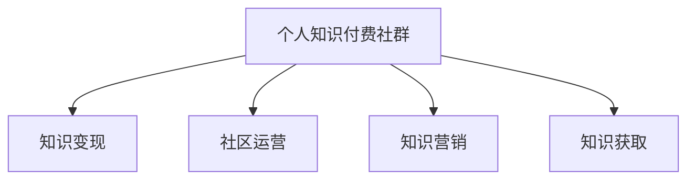

                 

# 如何打造个人知识付费社群

## 1. 背景介绍

### 1.1 问题由来
随着互联网的普及和知识经济的兴起，个人知识付费社群（Personal Knowledge Community, PKC）作为一种新兴的线上内容平台，正迅速在各行各业中崛起。这种新型社群不仅打破了传统的教育和知识传播模式，还为内容创作者提供了全新的商业模式和价值实现路径。然而，与成功的互联网平台相比，个人知识付费社群仍然存在诸多挑战，需要从多个维度进行细致的规划和运营。

### 1.2 问题核心关键点
个人知识付费社群的核心问题在于如何吸引优质内容创作者、构建稳定的用户群体，并实现持续的商业变现。同时，还需确保平台的用户体验、内容质量和法律合规性，以维持社群的健康成长。

### 1.3 问题研究意义
研究个人知识付费社群的构建和管理，对于推动知识变现、加速知识传播、优化教育资源配置具有重要意义：

1. 促进知识流通。PKC为知识创作者提供了一个新的变现渠道，使其可以借助互联网平台高效传播知识，分享智慧。
2. 提升学习效率。用户可以通过集中筛选优质内容，快速获得有价值的知识，提升个人和学习组织的学习效率。
3. 优化教育资源。PKC可以将优质教育资源聚集在一起，避免资源浪费，促进教育公平。
4. 激发创新活力。内容创作者在PKC上不断探索新的内容形式和表达方式，推动知识产出的多样化。
5. 推动产业升级。PKC与传统教育模式的结合，为行业带来了新的商业机会，促进产业转型升级。

## 2. 核心概念与联系

### 2.1 核心概念概述

为更好地理解个人知识付费社群的构建方法，本节将介绍几个密切相关的核心概念：

- **个人知识付费社群(PKC)**：一种以个人知识创作者为核心，通过知识内容付费获取收入的线上社群模式。PKC通常采用订阅制、单次购买等方式，提供知识内容的消费服务。

- **知识变现**：指将知识产品化的过程，通过在线课程、电子书、知识卡片、咨询等多种方式，将个人智慧转化为商业价值。

- **社区运营**：指通过社群管理、用户互动、内容推荐等手段，维护社群健康、活跃、稳定的发展。

- **知识营销**：通过社群内部传播、社交媒体推广等方式，吸引更多用户关注和付费，扩大社群影响力。

- **知识获取**：指用户通过购买或订阅社群中的内容，获取并利用知识以提高个人或组织能力的过程。

这些核心概念之间的逻辑关系可以通过以下Mermaid流程图来展示：



这个流程图展示了个知识付费社群的核心概念及其之间的关系：

1. 个人知识付费社群通过知识变现实现商业化。
2. 社区运营是社群健康发展的关键，需要精细化管理。
3. 知识营销吸引用户关注，提升社群影响力。
4. 知识获取是用户参与社群的直接动机，必须提供有价值的内容。

## 3. 核心算法原理 & 具体操作步骤

### 3.1 算法原理概述

个人知识付费社群的构建和管理，主要涉及以下算法原理：

- **用户行为分析**：通过分析用户访问、购买、评论等行为，了解用户需求和偏好，优化内容推荐策略。
- **内容质量评估**：构建内容质量评价体系，对内容进行多维度评估，筛选优质内容，提升用户体验。
- **用户互动管理**：利用社区管理工具，增强用户互动，如讨论区、问答、直播等，提升用户粘性。
- **付费模型设计**：设计合理的付费模型，如订阅制、单次购买、按需购买等，满足不同用户需求。
- **收益分配策略**：根据内容价值和用户消费行为，设计公平合理的收益分配机制，激励优质内容创作。
- **法律合规管理**：确保社群内容符合法律法规要求，避免版权侵权、虚假宣传等问题。

### 3.2 算法步骤详解

个人知识付费社群的构建和管理，可以分为以下几个关键步骤：

**Step 1: 定义社群定位**

- 明确社群的主要目标用户和核心需求。
- 确定社群的核心竞争优势和独特价值主张。

**Step 2: 选择合适的平台和工具**

- 选择适合的在线平台，如Udemy、Coursera、知识星球等。
- 使用社群管理工具，如Discord、Slack、飞书等。

**Step 3: 招募优质内容创作者**

- 通过社交媒体、行业论坛、合作伙伴等方式，寻找和招募高质量的知识创作者。
- 通过测试课程、试用服务等方式，验证创作者的内容质量。

**Step 4: 构建社群运营团队**

- 组建由社群管理、内容运营、技术支持等组成的运营团队。
- 制定详细的运营流程和标准，确保社群规范运营。

**Step 5: 制定内容策略**

- 根据目标用户需求和市场趋势，设计多样化、高价值的内容形式。
- 建立内容质量评估机制，筛选优质内容，提升用户满意度。

**Step 6: 营销推广**

- 利用社交媒体、搜索引擎优化(SEO)、邮件营销等方式，推广社群产品。
- 设计吸引用户付费的优惠政策，提高用户转化率。

**Step 7: 用户互动与反馈**

- 利用社区讨论区、问答、直播等工具，增强用户互动。
- 收集用户反馈，持续优化社群内容和服务。

**Step 8: 数据分析与优化**

- 通过用户行为数据、收益数据分析，了解社群运营效果。
- 根据数据反馈，不断优化内容策略和运营策略。

### 3.3 算法优缺点

个人知识付费社群的构建和管理，具有以下优点：

1. 便于内容分发。平台可以快速分发优质内容，打破时间和空间的限制。
2. 提高用户参与度。社区互动工具提升用户粘性，增强社群活力。
3. 精准定向广告。通过数据分析，精准推送广告，提升广告效果。
4. 灵活收费模式。多种付费模式满足不同用户需求，提升变现能力。
5. 动态收益分配。根据内容价值和用户行为，公平分配收益，激励创作者。

同时，该方法也存在一些局限性：

1. 用户信任感不足。社群建立初期，用户对创作者和平台缺乏信任，转化率较低。
2. 运营成本较高。社群管理、内容制作、推广营销等成本较高，需要持续投入。
3. 版权法律风险。社群内容涉及知识产权问题，可能存在法律风险。
4. 内容质量参差不齐。优质内容创作者的数量和质量影响社群整体质量。
5. 市场竞争激烈。知识付费市场竞争激烈，获取用户和用户留存难度较大。

尽管存在这些局限性，但就目前而言，个人知识付费社群仍然是知识变现的重要方式。未来相关研究的重点在于如何进一步优化内容质量、降低运营成本、提升用户信任感，同时兼顾法律合规性和用户体验。

### 3.4 算法应用领域

个人知识付费社群在知识传播、在线教育、企业培训、医疗咨询等多个领域均有广泛应用：

- **在线教育**：通过PKC，学生可以快速获取高质量的在线课程，提升学习效果。
- **企业培训**：公司可以利用PKC，提供有针对性的员工培训，提升员工技能和团队协作能力。
- **医疗咨询**：医生和专家可以开设PKC，提供专业医疗咨询服务，解答患者疑问。
- **职业培训**：职业培训师可以开设PKC，提供技能培训和职业发展指导，帮助学员提升就业竞争力。
- **技能共享**：各类技能人才可以开设PKC，分享个人经验和技巧，形成知识共享平台。

除了上述这些领域外，个人知识付费社群还可以创新性地应用到更多场景中，如兴趣社区、爱好交流、文化普及等，为知识传播和技能提升带来更多可能性。

## 4. 数学模型和公式 & 详细讲解  
### 4.1 数学模型构建

本节将使用数学语言对个人知识付费社群的构建方法进行更加严格的刻画。

记社群中第$i$位用户的付费频率为$p_i$，第$j$位内容创作者的内容质量为$q_j$，则内容创作者平均收益$R$可以表示为：

$$
R = \frac{1}{N}\sum_{i=1}^N p_i \times q_i
$$

其中，$N$为社群总用户数。

为提升内容创作者收益，需要最大化平均收益$R$。假设内容创作者向平台支付的广告费用为$C$，平台对内容的补贴为$S$，则平均收益$R$的优化问题可以表示为：

$$
\max_{p_i, q_i} R = \max_{p_i, q_i} \frac{1}{N}\sum_{i=1}^N p_i \times q_i \quad \text{s.t.} \quad \sum_{i=1}^N p_i = D, \sum_{i=1}^N p_i \times q_i \leq C + S
$$

其中$D$为社群总消费金额，$C$和$S$为广告费用和内容补贴，约束条件限制了广告和补贴的使用范围。

### 4.2 公式推导过程

上述优化问题可以通过拉格朗日乘子法求解。引入拉格朗日乘子$\lambda$和$\mu$，构造拉格朗日函数：

$$
\mathcal{L}(p_i, q_i, \lambda, \mu) = \frac{1}{N}\sum_{i=1}^N p_i \times q_i + \lambda \left(\sum_{i=1}^N p_i - D\right) + \mu \left(\sum_{i=1}^N p_i \times q_i - C - S\right)
$$

对$p_i$和$q_i$求偏导数，得：

$$
\frac{\partial \mathcal{L}}{\partial p_i} = \frac{q_i}{N} + \lambda - \mu q_i = 0
$$

$$
\frac{\partial \mathcal{L}}{\partial q_i} = \frac{p_i}{N} - \mu = 0
$$

联立求解得：

$$
\mu = \frac{1}{N}\sum_{i=1}^N \frac{p_i}{q_i}
$$

$$
\lambda = \frac{C+S}{D} - \frac{1}{N}\sum_{i=1}^N \frac{p_i}{q_i}
$$

将$\mu$和$\lambda$代回平均收益公式，得：

$$
R = \frac{C+S}{D} \times \frac{1}{N}\sum_{i=1}^N p_i = \frac{C+S}{D} \times \frac{1}{N}\sum_{i=1}^N p_i \times \frac{q_i}{q_i}
$$

最终，内容创作者应根据广告费用和补贴费用，调整内容定价策略，最大化自身收益。

### 4.3 案例分析与讲解

以在线教育平台为例，可以进一步分析该数学模型：

设在线教育平台上有$N=1000$位学生，内容创作者为$M=100$人，平台收集到每个学生每学期的付费频率$p_i$和每门课程的质量评分$q_j$。

假设每门课程的订阅价格为$p_j$，平台总收入$D=20000$元，每门课程的运营费用为$C=2000$元，平台对优质课程的补贴为$S=500$元。

利用上述数学模型计算平台收益分配情况：

1. 首先计算出每位学生的平均付费频率$\bar{p}=\frac{1}{N}\sum_{i=1}^N p_i$。
2. 利用$\bar{p}$计算出平均课程质量$\bar{q}=\frac{1}{M}\sum_{j=1}^M \frac{p_j}{q_j}$。
3. 根据平台总收入和运营费用计算出内容补贴总额$S'=20000-2000=18000$元。
4. 计算出每位内容创作者的平均补贴$\bar{S}=\frac{S'}{M}=180$元。
5. 利用$\bar{p}$和$\bar{S}$计算出每位内容创作者的平均收益$\bar{R}=\frac{20000-2000+500}{1000} \times \bar{p} \times \bar{q}=17.5$元。

通过这个案例，可以看到数学模型在实际应用中的作用。平台可以根据这些参数，制定合理的内容定价策略和补贴政策，优化收益分配，提升整体运营效率。

## 5. 项目实践：代码实例和详细解释说明
### 5.1 开发环境搭建

在进行社群实践前，我们需要准备好开发环境。以下是使用Python进行Flask开发的环境配置流程：

1. 安装Anaconda：从官网下载并安装Anaconda，用于创建独立的Python环境。

2. 创建并激活虚拟环境：
```bash
conda create -n pkc-env python=3.8 
conda activate pkc-env
```

3. 安装Flask：从官网获取安装命令，进行安装。
```bash
pip install flask
```

4. 安装Flask-RESTful：用于构建RESTful API。
```bash
pip install flask-restful
```

5. 安装SQLAlchemy：用于数据库操作。
```bash
pip install sqlalchemy
```

6. 安装Flask-SQLAlchemy：用于Flask和SQLAlchemy的集成。
```bash
pip install flask-sqlalchemy
```

7. 安装Flask-Login：用于用户认证管理。
```bash
pip install flask-login
```

完成上述步骤后，即可在`pkc-env`环境中开始社群实践。

### 5.2 源代码详细实现

这里我们以用户注册和课程订阅为例，给出使用Flask构建个人知识付费社群的Python代码实现。

首先，定义用户和课程的数据库模型：

```python
from flask_sqlalchemy import SQLAlchemy

db = SQLAlchemy()

class User(db.Model):
    id = db.Column(db.Integer, primary_key=True)
    username = db.Column(db.String(100), unique=True, nullable=False)
    password = db.Column(db.String(100), nullable=False)
    is_admin = db.Column(db.Boolean, default=False)

class Course(db.Model):
    id = db.Column(db.Integer, primary_key=True)
    title = db.Column(db.String(100), nullable=False)
    price = db.Column(db.Float, nullable=False)
    quality_score = db.Column(db.Float, nullable=False)
    creator_id = db.Column(db.Integer, db.ForeignKey('user.id'), nullable=False)
    creator = db.relationship('User', backref='courses')
```

然后，定义用户注册和课程订阅的API接口：

```python
from flask import Flask, request, jsonify
from flask_restful import Resource, Api
from flask_login import LoginManager, login_user, logout_user, login_required

app = Flask(__name__)
app.config['SQLALCHEMY_DATABASE_URI'] = 'sqlite:///data.db'
db.init_app(app)

login_manager = LoginManager()
login_manager.init_app(app)

@app.route('/login', methods=['POST'])
def login():
    username = request.json.get('username', None)
    password = request.json.get('password', None)
    user = User.query.filter_by(username=username).first()
    if user and user.password == password:
        login_user(user)
        return jsonify(user.username)
    return jsonify({'error': 'Invalid username or password'}), 401

@app.route('/logout')
@login_required
def logout():
    logout_user()
    return jsonify({'message': 'Logged out successfully'})

@app.route('/courses', methods=['GET'])
@login_required
def get_courses():
    courses = Course.query.all()
    return jsonify([{'id': course.id, 'title': course.title, 'price': course.price} for course in courses])
```

最后，启动Flask应用并在测试服务器上运行：

```python
if __name__ == '__main__':
    app.run(debug=True, host='0.0.0.0')
```

以上就是使用Flask构建个人知识付费社群的完整代码实现。可以看到，通过Flask等Python框架，可以高效地实现社群管理、用户注册、课程订阅等功能。

### 5.3 代码解读与分析

让我们再详细解读一下关键代码的实现细节：

**User和Course类**：
- `__init__`方法：初始化用户和课程的基本信息，如用户名、密码、价格等。
- `__repr__`方法：自定义类对象的字符串表示形式，方便调试。

**登录与注销接口**：
- 登录接口`/login`：接收用户名和密码，验证后使用`login_user`函数将用户信息保存在Session中。
- 注销接口`/logout`：使用`logout_user`函数将用户信息从Session中删除。

**课程列表接口**：
- 查询接口`/get_courses`：使用`@login_required`装饰器限制未登录用户访问，通过`Course`模型查询所有课程，并返回JSON格式的数据。

这些接口实现展示了Flask框架的基本使用，但仍需针对具体需求进行进一步开发和优化。

## 6. 实际应用场景

### 6.1 智能课程推荐

个人知识付费社群的核心功能之一是推荐系统，通过分析用户行为和课程属性，为用户推荐个性化的课程，提升用户满意度和付费转化率。

在技术实现上，可以收集用户的浏览历史、评分数据、订阅记录等行为信息，构建用户画像。利用协同过滤、内容推荐等算法，对用户进行个性化推荐。在课程推荐时，可以结合课程质量评分、用户评分、评论数据等信息，提升推荐的准确性和多样性。

### 6.2 社群互动与社区管理

社群互动和社区管理是个人知识付费社群的另一核心功能，通过增强用户粘性和互动性，提升社群的活跃度和用户粘性。

在技术实现上，可以设计讨论区、问答、直播等互动工具，促进用户之间的交流和分享。同时，利用社区管理工具，如Discord、Slack等，建立管理团队，维护社群秩序，处理用户反馈，优化社群环境。

### 6.3 数据与内容分析

数据与内容分析是个人知识付费社群的重要组成部分，通过数据分析，可以了解社群运营效果，提升内容质量，优化用户体验。

在技术实现上，可以使用SQLAlchemy等数据库工具，保存和查询用户行为、课程互动、收益分配等数据。利用数据分析工具，如Python的Pandas、NumPy，进行数据清洗、统计和可视化，发现社群运营中的问题和改进点。

### 6.4 未来应用展望

随着个人知识付费社群的发展，未来将出现更多创新应用：

1. 虚拟讲师。利用VR/AR技术，将课程内容变成虚拟讲师，提升用户的沉浸感和互动性。
2. 社交学习。通过社群内的知识交流和合作，建立学习伙伴关系，促进共同学习。
3. 内容众包。利用众包平台，邀请专家和用户共同制作课程内容，提升内容质量和多样性。
4. 个性化服务。根据用户需求，提供定制化的学习方案和咨询服务，提升用户满意度。
5. 跨平台协同。建立多平台内容互通机制，提升内容共享和跨平台学习体验。
6. 智能客服。利用自然语言处理技术，提供智能客服系统，提升用户服务体验。

通过这些创新应用，个人知识付费社群将进一步扩大应用范围，提升用户体验和社群活跃度，成为知识传播和技能提升的重要平台。

## 7. 工具和资源推荐
### 7.1 学习资源推荐

为了帮助开发者系统掌握个人知识付费社群的构建技术，这里推荐一些优质的学习资源：

1. 《Flask Web Development》书籍：介绍Flask框架的基本用法和高级特性，适合初学者快速上手。
2. 《Python Web Development with Flask》课程：Coursera提供的Flask和RESTful开发课程，系统讲解Web开发流程和实践技巧。
3. 《Kaggle和Flask实战》视频教程：实战型教学，展示如何使用Flask和Kaggle平台进行数据分析和可视化。
4. 《知识社区与推荐系统》课程：斯坦福大学提供的数据科学课程，涵盖知识社区和推荐系统的核心算法和实践方法。
5. 《社区运营的艺术》书籍：介绍了社群管理的理论基础和实战技巧，适合社区运营人员阅读。

通过对这些资源的学习实践，相信你一定能够快速掌握Flask框架和社区运营技术，构建成功运营的个人知识付费社群。

### 7.2 开发工具推荐

高效的开发离不开优秀的工具支持。以下是几款用于个人知识付费社群开发的常用工具：

1. Flask：轻量级Web框架，易于上手，适合快速迭代开发。
2. RESTful：用于构建RESTful API，提供RESTful风格的接口设计。
3. SQLAlchemy：SQLAlchemy提供了ORM工具，方便进行数据库操作。
4. Flask-Login：提供用户认证管理功能，方便进行用户管理。
5. Discord和Slack：社区互动工具，提供聊天、直播、讨论等功能。
6. Python和R：数据分析工具，方便进行数据处理和可视化。
7. Jupyter Notebook：数据分析和实验工具，支持代码编写和数据分析。

合理利用这些工具，可以显著提升社群开发的效率，加快创新迭代的步伐。

### 7.3 相关论文推荐

个人知识付费社群的研究来源于学界的持续探索。以下是几篇奠基性的相关论文，推荐阅读：

1. "Collaborative Filtering for Implicit Feedback Datasets"（N.J. Davenport, T.R. Shih）：介绍了协同过滤算法的核心原理和应用。
2. "Scalable Matrix Decomposition Techniques for Recommender Systems"（S. Finin, R. Adhikari）：提出基于矩阵分解的推荐算法，解决大规模推荐系统的可扩展性问题。
3. "Neural Collaborative Filtering"（S. Gao, F. Xu）：展示了深度学习在推荐系统中的应用，提升了推荐的准确性和多样性。
4. "A Survey of Multi-User Recommendation Systems"（Z. Yuan, H. Jing, T. Zhang）：综述了多用户推荐系统的理论基础和实践方法，提供了丰富的参考。
5. "Social Recommendation Systems: Principles, Practices and Trends"（K.-P. Chang, M.-S. Yang）：介绍了社交推荐系统的基本原理和最新趋势，涵盖了多方面的推荐算法和应用。

这些论文代表了个知识付费社群的研究发展脉络。通过学习这些前沿成果，可以帮助研究者把握学科前进方向，激发更多的创新灵感。

## 8. 总结：未来发展趋势与挑战

### 8.1 总结

本文对个人知识付费社群的构建和管理进行了全面系统的介绍。首先阐述了PKC在知识传播和技能提升中的重要作用，明确了社区运营、内容推荐和用户管理等关键问题。其次，从原理到实践，详细讲解了Flask框架的构建方法和社群运营的数学模型。同时，本文还探讨了PKC在在线教育、企业培训、医疗咨询等多个领域的应用前景，展示了其广阔的发展空间。最后，本文精选了PKC的相关学习资源、开发工具和研究论文，为读者提供了全方位的技术指引。

通过本文的系统梳理，可以看到，个人知识付费社群作为一种新型知识传播模式，正迅速崛起，成为知识变现的重要手段。其在提升学习效率、优化教育资源配置等方面的独特价值，使得PKC未来具有广阔的发展前景。

### 8.2 未来发展趋势

展望未来，个人知识付费社群将呈现以下几个发展趋势：

1. 移动化普及。随着移动设备的发展和普及，社群将逐渐从PC端转移到移动端，提升用户体验和便捷性。
2. 社会化增强。社群将更加注重社会化元素，通过社交网络和社区互动，提升用户粘性和社群活力。
3. 大数据应用。利用大数据分析技术，进行用户行为预测和内容推荐，提升社群运营效果。
4. 内容多样化。除了课程内容，社群将逐渐扩展到在线书籍、工具、服务等多样化内容形式，提升用户需求满足度。
5. 智能化升级。引入人工智能技术，如推荐系统、自然语言处理等，提升社群智能水平，优化用户体验。
6. 全球化扩展。打破地域限制，利用国际化社区，拓展用户规模和市场范围。

这些趋势凸显了个人知识付费社群的广阔前景。随着技术手段的不断创新和改进，PKC必将在知识传播和技能提升领域发挥更大的作用，推动社会的知识共享和创新发展。

### 8.3 面临的挑战

尽管个人知识付费社群在知识变现和内容传播方面取得了一定的成就，但在走向成熟和普及的过程中，仍面临诸多挑战：

1. 用户隐私保护。社群需要确保用户数据安全和隐私保护，避免数据泄露和滥用。
2. 版权法律风险。社群内容涉及版权问题，需要合理使用和保护知识产权。
3. 内容质量管控。高质量的内容是社群的核心，需要建立严格的内容审核机制，避免低质量内容泛滥。
4. 用户信任感不足。社群初期用户转化率较低，需要不断优化社群运营和用户管理策略。
5. 技术门槛较高。社群开发和运营需要较高的技术门槛，需要优秀的技术团队和资源支持。
6. 盈利模式单一。当前社群主要依赖课程销售，需要拓展更多盈利模式，提升商业价值。

这些挑战需要在社群发展的各个环节进行深入思考和不断改进，以确保社群的长期健康发展和商业可持续性。

### 8.4 研究展望

面对社群发展中的种种挑战，未来的研究需要在以下几个方面寻求新的突破：

1. 用户行为分析与预测。利用大数据和机器学习技术，深入分析用户行为和需求，预测用户付费倾向，提升精准推荐效果。
2. 内容推荐算法优化。引入协同过滤、深度学习等算法，提升内容推荐的准确性和多样性，优化用户学习体验。
3. 社群运营自动化。开发智能化的社群管理工具，提高运营效率和效果，降低人工管理成本。
4. 用户互动与社区管理。设计更多互动工具和社区管理策略，增强用户粘性和社群活力，提升用户满意度。
5. 知识变现多样化。拓展更多盈利模式，如知识付费、内容众包、广告投放等，提升社群的商业价值和可持续发展能力。
6. 社交网络与社群结合。利用社交网络技术和社区互动工具，建立更加紧密的社交关系，提升社群影响力和用户信任感。

这些研究方向的探索，必将引领个人知识付费社群迈向更高的台阶，为知识传播和技能提升带来新的可能。

## 9. 附录：常见问题与解答

**Q1：如何吸引优质内容创作者？**

A: 吸引优质内容创作者主要靠以下几方面：
1. 提供丰厚的收益。通过设置合理的定价策略和收益分配机制，确保内容创作者可以获取高额收益。
2. 提供优质平台。确保平台有稳定的用户群体和较高的市场知名度，增加创作者曝光机会。
3. 提供支持服务。为创作者提供技术支持、内容推广、版权保护等服务，降低创作风险。
4. 提供社区互动。建立社群交流平台，促进创作者之间的交流和合作，提升创作热情。
5. 提供持续激励。设立各类激励措施，如评选优秀创作者、提供专项资助等，持续激发创作者动力。

**Q2：如何构建高质量的课程内容？**

A: 构建高质量的课程内容需要从多个维度进行考量：
1. 内容选题。选择用户需求旺盛、市场价值高、知识深度适宜的选题，确保内容价值。
2. 内容制作。通过内容创作和团队合作，制作高质量的课程视频、图文、音频等。
3. 内容审核。建立严格的内容审核机制，确保课程内容的准确性和科学性。
4. 内容更新。定期更新课程内容，确保知识的时效性和实用性。
5. 用户反馈。收集用户反馈，持续优化课程内容，提升用户满意度。

**Q3：如何设计合理的定价策略？**

A: 设计合理的定价策略需要考虑以下因素：
1. 内容质量。课程内容质量越高，定价应越高，反之则低。
2. 用户需求。根据目标用户群体和市场需求，设置合理的定价区间。
3. 用户粘性。对于用户粘性较高的社群，可以适当降低定价门槛，增加用户转化率。
4. 收益分配。确保定价策略能够兼顾内容创作者和平台的利益，实现共赢。
5. 竞争环境。观察竞争对手的定价策略，确保自己的定价在市场上有竞争力。

**Q4：如何进行用户数据分析？**

A: 用户数据分析主要包括以下几个方面：
1. 数据收集。收集用户行为数据，如浏览记录、课程评分、互动行为等。
2. 数据存储。利用数据库技术，对数据进行存储和管理。
3. 数据分析。使用数据分析工具，如Python的Pandas、NumPy，进行数据清洗、统计和可视化。
4. 用户画像。通过数据挖掘，建立用户画像，了解用户需求和行为特点。
5. 预测建模。利用机器学习算法，进行用户行为预测和内容推荐。

**Q5：如何进行内容推荐？**

A: 内容推荐主要涉及以下步骤：
1. 用户画像。建立用户画像，了解用户需求和兴趣。
2. 内容标签。对课程内容进行标签化处理，方便搜索和推荐。
3. 相似度计算。利用协同过滤、内容推荐等算法，计算用户和内容之间的相似度。
4. 推荐排序。根据相似度计算结果，对课程进行排序，推荐给用户。
5. 反馈调整。根据用户反馈，调整推荐算法，提升推荐效果。

这些问题的回答展示了个人知识付费社群的核心技术和运营策略，帮助开发者更好地理解和实践社群构建。

---

作者：禅与计算机程序设计艺术 / Zen and the Art of Computer Programming

