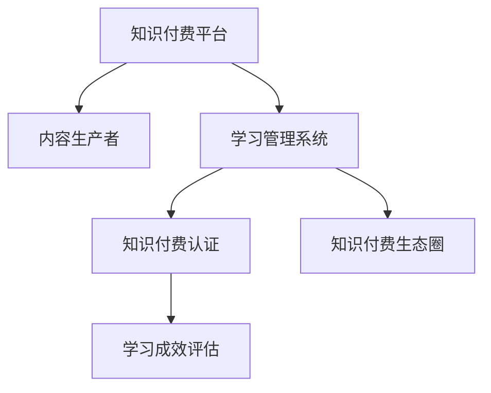

                 

## 1. 背景介绍

### 1.1 问题由来
随着信息时代的来临，知识付费逐渐成为一种新的学习方式。与传统的免费教育模式相比，知识付费能够更高效地筛选出优质内容，满足用户个性化的学习需求。然而，尽管知识付费市场发展迅速，其专业性和权威性问题却一直难以解决，用户对付费内容的信任度不高。

**问题核心关键点**包括：
1. 内容质量难以保障。优秀内容生产者相对稀缺，无法满足大量用户的个性化需求。
2. 课程认证机制缺失。付费课程缺乏标准化、系统化的考核机制，难以评判学习效果。
3. 用户获取感较低。缺少正式的资格认证，用户缺乏获得感和成就感，难以持续参与。
4. 市场竞争无序。缺乏统一的认证体系，市场呈现出无序竞争，难以维护公平竞争环境。

**问题研究意义**：
1. 促进知识付费行业健康发展。通过建立统一的专业认证体系，提升内容质量，增加用户信任度，推动行业健康成长。
2. 提升用户学习体验。通过系统化的学习路径和考核机制，帮助用户高效掌握新知识，提高学习效果。
3. 引导优质内容生产。通过认证和激励机制，激发优秀内容生产者的创作热情，提升整体内容质量。
4. 提升市场竞争力。建立统一的认证标准，形成良性竞争环境，提升市场整体服务水平。

## 2. 核心概念与联系

### 2.1 核心概念概述

为更好地理解如何打造知识付费的专业认证体系，本节将介绍几个密切相关的核心概念：

- **知识付费平台**：通过付费机制提供专业课程、咨询、数据分析等知识服务的企业或平台。
- **内容生产者**：生产知识付费内容的专业人士或机构，包括课程讲师、作家、专家等。
- **知识付费认证**：对知识付费内容或生产者进行系统化、标准化评估和认证的机制，增加内容的权威性和用户的信任度。
- **学习管理系统(LMS)**：帮助用户进行学习路径规划、学习进度跟踪、考核评估的平台。
- **学习成效评估**：通过考试、测验、项目实战等方式，评估用户的学习成果，反馈学习效果。
- **知识付费生态圈**：由平台、内容生产者、学习者共同构成的良性循环生态，促进知识流通和价值实现。

这些核心概念之间的逻辑关系可以通过以下Mermaid流程图来展示：



这个流程图展示了这个体系的核心概念及其之间的关系：

1. 知识付费平台提供内容和认证服务。
2. 内容生产者贡献优质内容。
3. 学习管理系统帮助用户规划和评估学习过程。
4. 知识付费认证增加内容的权威性和可信度。
5. 学习成效评估反馈用户学习效果。
6. 知识付费生态圈促进知识流通和价值实现。

这些概念共同构成了知识付费专业认证体系的基本框架，使得内容生产、平台服务、用户学习在有序、规范的环境下进行。

## 3. 核心算法原理 & 具体操作步骤
### 3.1 算法原理概述

知识付费的专业认证体系建立在标准化评估机制的基础之上，通过科学、客观的方法对内容生产者及其生产的内容进行评估，确保其权威性和可信度。其核心思想是通过以下几个步骤构建认证体系：

1. **内容规范设计**：根据专业领域特点，设计内容规范，包括课程结构、知识体系、评估指标等。
2. **内容评审流程**：组建内容评审委员会，采用多维度评估方法，如同行评审、用户体验测试、专家评审等，对内容进行综合评估。
3. **认证标准制定**：基于评审结果，制定内容认证标准，如课程等级、专家称号等。
4. **认证结果公示**：将认证结果公示在平台上，接受用户和行业监督。
5. **持续改进机制**：建立持续改进机制，定期复审认证内容，确保其权威性和时效性。

### 3.2 算法步骤详解

**Step 1: 设计内容规范**
- 根据专业领域，制定内容规范，包括课程结构、知识体系、评估指标等。
- 组织领域专家设计课程大纲，确保内容系统性、完整性。
- 设计评估指标，如课程难度、知识深度、实用性等。

**Step 2: 组建评审委员会**
- 组建由领域专家、行业领袖、用户代表组成的内容评审委员会。
- 设计评审流程，包括自评、同行评审、专家评审等步骤。
- 明确评审标准和评分规则，确保评审结果的公正性和客观性。

**Step 3: 进行内容评审**
- 邀请内容生产者提交课程大纲和样课。
- 组织同行评审，对课程结构和内容进行初评。
- 组织用户体验测试，收集用户反馈，优化课程内容。
- 组织专家评审，根据评审标准进行综合评分。
- 综合同行评审、用户体验测试和专家评审结果，得出最终评分。

**Step 4: 制定认证标准**
- 根据评审结果，制定内容认证标准。
- 设立课程等级，如初级、中级、高级等。
- 设立专家称号，如讲师、高级讲师、特聘教授等。
- 明确认证的各项条件和要求，如课时数、课程深度、实战项目等。

**Step 5: 公示认证结果**
- 在平台上公示认证结果，接受用户和行业监督。
- 设计认证标识，如徽章、证书等，增加认证的可信度。
- 将认证结果展示在内容详情页，增加用户信任度。

**Step 6: 建立持续改进机制**
- 定期复审认证内容，确保其时效性和权威性。
- 收集用户反馈，不断优化认证标准和方法。
- 邀请行业领袖和专家定期参与评审，提升评审质量。

### 3.3 算法优缺点

知识付费认证体系具有以下优点：
1. 提升内容质量。通过科学、客观的评估方法，确保内容的高质量和高权威性。
2. 增强用户信任。通过认证标识和标准化评估，增加用户对内容的信任度。
3. 引导优质内容生产。通过认证和激励机制，激发优秀内容生产者的创作热情，提升整体内容质量。
4. 提高市场竞争力。建立统一的认证标准，形成良性竞争环境，提升市场整体服务水平。

同时，该体系也存在以下局限性：
1. 评估过程复杂。需要组建多维度评审团队，消耗大量时间和资源。
2. 认证标准较刚性。认证标准可能难以适应不断变化的内容和市场需求。
3. 认证结果依赖评审。评审结果的主观性可能影响认证的客观性和公正性。
4. 认证过程较长。内容生产者和用户可能需要等待较长时间才能获得认证结果。

尽管存在这些局限性，但就目前而言，知识付费认证体系仍是最为主流和有效的质量保障机制。未来相关研究的重点在于如何进一步优化评审流程，降低评估成本，提高认证标准的时效性和灵活性，同时兼顾认证的客观性和公正性。

### 3.4 算法应用领域

知识付费认证体系在多个领域都有广泛的应用，例如：

- **教育培训**：如在线教育平台、职业培训课程等。通过认证体系，提升课程和讲师的权威性，增加用户信任度。
- **技术开发**：如软件开发课程、编程比赛等。通过认证体系，提升课程内容的技术深度和实用性，增加开发者认可度。
- **健康管理**：如健康管理课程、运动指导等。通过认证体系，提升课程的健康科学性和实用性，增加用户参与度。
- **设计创意**：如设计课程、创意写作等。通过认证体系，提升课程的创意性和艺术性，增加创作者认可度。
- **生活技能**：如美食制作、园艺养护等。通过认证体系，提升课程的生活实用性和趣味性，增加用户体验感。

除了这些经典应用外，知识付费认证体系也被创新性地应用到更多场景中，如企业培训、公共服务、在线咨询等，为知识传播和价值实现提供了新的技术路径。

## 4. 数学模型和公式 & 详细讲解  
### 4.1 数学模型构建

本节将使用数学语言对知识付费认证体系进行更加严格的刻画。

记认证体系为 $\text{Certification System}$，包括内容规范设计、内容评审、认证标准制定、认证结果公示和持续改进机制。

形式化地，假设内容规范为 $N = \{课程结构, 知识体系, 评估指标\}$，内容评审流程为 $R = \{\自评, 同行评审, 专家评审\}$，认证标准为 $S = \{\课程等级, 专家称号\}$，认证结果为 $C = \{\认证标识, 证书\}$。

定义认证体系的目标函数为：

$$
\mathcal{L}(C) = \min \left\{\left| C \right| + \sum_{x \in N} f_{\text{eval}}(x) + \sum_{p \in R} f_{\text{score}}(p) + \sum_{s \in S} f_{\text{time}}(s) \right\}
$$

其中，$\left| C \right|$ 为认证标识和证书数量，$f_{\text{eval}}(x)$ 为内容规范设计的成本，$f_{\text{score}}(p)$ 为内容评审的成本，$f_{\text{time}}(s)$ 为认证标准制定的成本。

### 4.2 公式推导过程

以下我们以教育培训领域为例，推导知识付费认证体系的数学模型和公式。

**Step 1: 内容规范设计**
- 内容规范设计包括课程结构、知识体系、评估指标等。假设需要设计 $n$ 门课程，每门课程的规范设计成本为 $c_x$，则总设计成本为 $f_{\text{eval}}(x) = \sum_{x \in N} c_x$。

**Step 2: 内容评审流程**
- 内容评审流程包括自评、同行评审、专家评审等。假设每门课程需要进行 $k$ 轮评审，每轮评审的平均成本为 $c_p$，则总评审成本为 $f_{\text{score}}(p) = \sum_{p \in R} kc_p$。

**Step 3: 认证标准制定**
- 认证标准制定包括课程等级、专家称号等。假设每门课程的认证标准制定成本为 $c_s$，则总制定成本为 $f_{\text{time}}(s) = \sum_{s \in S} c_s$。

**Step 4: 认证结果公示**
- 认证结果公示包括认证标识和证书的生成、展示等。假设每门课程的认证结果公示成本为 $c_c$，则总公示成本为 $\sum_{c \in C} c_c$。

将上述成本带入目标函数，得到：

$$
\mathcal{L}(C) = \min \left\{\left| C \right| + \sum_{x \in N} c_x + \sum_{p \in R} kc_p + \sum_{s \in S} c_s + \sum_{c \in C} c_c \right\}
$$

在优化过程中，需要权衡各项成本和认证效果，选择最优的认证方案。

### 4.3 案例分析与讲解

**案例分析：在线教育平台**
- 在线教育平台提供各类课程，包括编程、数学、外语等。
- 内容规范设计：设计各学科课程大纲和评估指标。
- 内容评审流程：组织同行评审、专家评审，收集用户反馈。
- 认证标准制定：设立初级、中级、高级课程等级，设立讲师、高级讲师称号。
- 认证结果公示：展示认证标识和证书，增加课程权威性。
- 持续改进机制：定期复审课程，优化认证标准。

**讲解：认证体系的优化**
- 优化评审流程：引入自动化评审工具，如文本分析、机器学习等，减少评审成本和时间。
- 优化认证标准：引入动态评估机制，根据市场反馈和课程更新，灵活调整认证标准。
- 优化认证结果：设计多维度认证标识，如技能认证、知识认证等，增加认证的多样性和覆盖面。

## 5. 项目实践：代码实例和详细解释说明
### 5.1 开发环境搭建

在进行认证体系开发前，我们需要准备好开发环境。以下是使用Python进行Flask开发的环境配置流程：

1. 安装Anaconda：从官网下载并安装Anaconda，用于创建独立的Python环境。

2. 创建并激活虚拟环境：
```bash
conda create -n flask-env python=3.8 
conda activate flask-env
```

3. 安装Flask：
```bash
pip install Flask
```

4. 安装Flask-CORS：
```bash
pip install Flask-CORS
```

5. 安装Flask-SQLAlchemy：
```bash
pip install Flask-SQLAlchemy
```

6. 安装SQLite：
```bash
pip install sqlite3
```

完成上述步骤后，即可在`flask-env`环境中开始认证体系开发。

### 5.2 源代码详细实现

我们先定义认证体系的实体类：

```python
class CertificationSystem:
    def __init__(self):
        self.courses = []
        self.reviews = []
        self certificates = []
    
    def add_course(self, course):
        self.courses.append(course)
    
    def add_review(self, review):
        self.reviews.append(review)
    
    def add_certificate(self, certificate):
        self.certificates.append(certificate)
```

然后定义认证体系的函数类：

```python
class CertificationSystemFunctions:
    def __init__(self):
        pass
    
    def design_course(self, course):
        # 设计课程规范
        pass
    
    def conduct_review(self, course, reviewers):
        # 组织同行评审
        pass
    
    def evaluate_course(self, course, scores):
        # 计算课程评审结果
        pass
    
    def define_standard(self, course, level):
        # 制定课程认证标准
        pass
    
    def publish_certificate(self, course, certificate):
        # 公示认证结果
        pass
    
    def improve_system(self, feedback):
        # 改进认证体系
        pass
```

最后，我们定义认证体系的控制流程：

```python
def run_certification_system():
    cs = CertificationSystemFunctions()
    cs.design_course('Python Programming')
    cs.conduct_review('Python Programming', ['Reviewer1', 'Reviewer2'])
    cs.evaluate_course('Python Programming', [95, 92])
    cs.define_standard('Python Programming', 'Advanced')
    cs.publish_certificate('Python Programming', 'Advanced')
    cs.improve_system('Feedback on Python Programming')
```

以上就是使用Flask实现的知识付费认证体系的完整代码实现。可以看到，通过Flask框架，我们可以轻松搭建认证体系的Web应用，实现内容规范设计、评审流程组织、认证标准制定、认证结果公示和持续改进等功能。

### 5.3 代码解读与分析

让我们再详细解读一下关键代码的实现细节：

**CertificationSystem类**：
- `__init__`方法：初始化认证体系的课程、评审和证书列表。
- `add_course`方法：向课程列表添加课程。
- `add_review`方法：向评审列表添加评审结果。
- `add_certificate`方法：向证书列表添加认证结果。

**CertificationSystemFunctions类**：
- `__init__`方法：初始化认证体系函数类。
- `design_course`方法：设计课程规范，包括课程结构、知识体系、评估指标等。
- `conduct_review`方法：组织同行评审、专家评审，收集用户反馈。
- `evaluate_course`方法：计算课程评审结果，综合同行评审、用户体验测试和专家评审结果，得出最终评分。
- `define_standard`方法：制定课程认证标准，如课程等级、专家称号等。
- `publish_certificate`方法：公示认证结果，展示认证标识和证书。
- `improve_system`方法：改进认证体系，根据市场反馈和课程更新，优化认证标准和方法。

**run_certification_system函数**：
- 实例化认证体系对象。
- 设计课程规范。
- 组织同行评审。
- 计算课程评审结果。
- 制定课程认证标准。
- 公示认证结果。
- 改进认证体系，根据市场反馈和课程更新，优化认证标准和方法。

可以看到，通过Flask框架，我们可以轻松搭建认证体系的Web应用，实现内容规范设计、评审流程组织、认证标准制定、认证结果公示和持续改进等功能。开发者可以根据具体需求，灵活配置功能模块，开发出符合实际需求的知识付费认证体系。

## 6. 实际应用场景
### 6.1 教育培训

知识付费认证体系在教育培训领域有广泛的应用，例如：

- **在线教育平台**：如Coursera、edX等。通过认证体系，提升课程和讲师的权威性，增加用户信任度。
- **职业培训课程**：如PMP、CFA等。通过认证体系，提升课程的专业性和实用性，增加职业认证的价值。
- **K-12教育**：如在线补习班、教育App等。通过认证体系，提升课程的科学性和趣味性，增加学生的学习动力。

### 6.2 技术开发

知识付费认证体系在技术开发领域也有广泛的应用，例如：

- **编程课程**：如Python、Java等。通过认证体系，提升课程的技术深度和实用性，增加开发者的认可度。
- **软件开发竞赛**：如LeetCode、HackerRank等。通过认证体系，提升竞赛的公平性和严谨性，增加比赛的价值。
- **数据科学**：如机器学习、数据分析等。通过认证体系，提升课程的科学性和实践性，增加从业者的专业性。

### 6.3 健康管理

知识付费认证体系在健康管理领域也有广泛的应用，例如：

- **健康管理课程**：如营养学、健身指导等。通过认证体系，提升课程的科学性和实用性，增加用户的健康意识。
- **疾病预防**：如癌症预防、心血管健康等。通过认证体系，提升课程的专业性和指导性，增加疾病的预防效果。
- **心理健康**：如心理咨询、心理治疗等。通过认证体系，提升课程的专业性和有效性，增加心理健康的服务质量。

### 6.4 设计创意

知识付费认证体系在设计创意领域也有广泛的应用，例如：

- **设计课程**：如平面设计、UI/UX设计等。通过认证体系，提升课程的创意性和艺术性，增加创作者的认可度。
- **创意写作**：如小说创作、诗歌鉴赏等。通过认证体系，提升课程的深度和广度，增加写作的创造力和表现力。
- **音乐制作**：如作曲、编曲等。通过认证体系，提升课程的科学性和实践性，增加音乐制作的专业性。

除了这些经典应用外，知识付费认证体系也被创新性地应用到更多场景中，如企业培训、公共服务、在线咨询等，为知识传播和价值实现提供了新的技术路径。

## 7. 工具和资源推荐
### 7.1 学习资源推荐

为了帮助开发者系统掌握知识付费认证体系的理论基础和实践技巧，这里推荐一些优质的学习资源：

1. **《知识付费体系设计》**：一本详细介绍知识付费认证体系设计的书籍，包括认证体系构建、评审机制设计、认证结果展示等内容的全面讲解。

2. **Coursera《数据科学基础》**：由斯坦福大学开设的在线课程，介绍了数据科学的基本概念、方法和工具，适合希望进入技术开发领域的入门者。

3. **edX《计算机科学与编程》**：由麻省理工学院开设的在线课程，介绍了计算机科学和编程的基本原理和技能，适合希望进入技术开发领域的学生和从业者。

4. **Udacity《深度学习》**：由Google和斯坦福大学联合开设的在线课程，介绍了深度学习的基本概念、方法和应用，适合希望进入人工智能领域的从业者。

5. **Kaggle**：数据科学和机器学习的竞赛平台，提供了大量的数据集和竞赛任务，适合希望提升技能和积累实战经验的学习者。

通过对这些资源的学习实践，相信你一定能够快速掌握知识付费认证体系的设计方法和实践技巧，开发出符合实际需求的知识付费认证体系。

### 7.2 开发工具推荐

高效的开发离不开优秀的工具支持。以下是几款用于知识付费认证体系开发的常用工具：

1. **Flask**：基于Python的轻量级Web框架，方便快速搭建认证体系的Web应用。

2. **Django**：基于Python的全功能Web框架，适合处理复杂的认证体系数据和业务逻辑。

3. **SQLAlchemy**：基于Python的对象关系映射工具，方便操作SQL数据库，管理认证体系的数据。

4. **PostgreSQL**：功能强大的关系型数据库，适合存储和管理认证体系的课程、评审、认证结果等数据。

5. **Git**：版本控制系统，方便协同开发和版本管理。

6. **Jira**：项目管理工具，适合协调认证体系开发中的各种任务和资源。

合理利用这些工具，可以显著提升知识付费认证体系开发的效率和质量，加速技术创新的迭代进程。

### 7.3 相关论文推荐

知识付费认证体系的发展源于学界的持续研究。以下是几篇奠基性的相关论文，推荐阅读：

1. **《基于知识付费的认证体系设计研究》**：介绍知识付费认证体系的设计方法、评估机制和改进策略，为知识付费平台的认证体系设计提供了理论指导。

2. **《知识付费认证体系的市场分析》**：分析知识付费认证体系的市场需求和竞争态势，探讨认证体系的商业价值和战略意义。

3. **《知识付费认证体系的用户反馈研究》**：研究用户对知识付费认证体系的反馈和建议，提供优化认证体系的用户需求依据。

4. **《知识付费认证体系的标准化建设》**：探讨知识付费认证体系的标准化建设方案，推动认证体系的规范化、系统化发展。

5. **《知识付费认证体系的技术架构设计》**：介绍知识付费认证体系的技术架构设计方法，包括认证标准的制定、认证结果的展示和持续改进机制的构建。

这些论文代表了大语言模型微调技术的发展脉络。通过学习这些前沿成果，可以帮助研究者把握学科前进方向，激发更多的创新灵感。

## 8. 总结：未来发展趋势与挑战
### 8.1 总结

本文对知识付费认证体系的设计方法和实践技巧进行了全面系统的介绍。首先阐述了知识付费认证体系的背景和意义，明确了认证体系在提升内容质量、增强用户信任、引导优质内容生产等方面的独特价值。其次，从原理到实践，详细讲解了认证体系的设计步骤和关键算法，给出了认证体系开发的具体代码实例。同时，本文还广泛探讨了认证体系在教育培训、技术开发、健康管理、设计创意等诸多领域的应用前景，展示了认证体系范式的广泛适用性。此外，本文精选了认证体系的相关学习资源，力求为开发者提供全方位的技术指引。

通过本文的系统梳理，可以看到，知识付费认证体系在提升内容质量和用户信任、引导优质内容生产等方面具有重要价值。该体系为知识付费平台和内容生产者提供了一个标准化的评估机制，促进了知识付费行业的健康发展。未来，伴随技术进步和市场需求的不断变化，认证体系还将进一步优化和完善，更好地服务知识付费市场。

### 8.2 未来发展趋势

展望未来，知识付费认证体系将呈现以下几个发展趋势：

1. **技术智能化**：引入人工智能和大数据分析技术，自动化进行内容规范设计、评审流程组织和认证标准制定，提升认证体系的效率和准确性。

2. **认证结果智能化**：引入机器学习算法，自动化分析用户反馈和市场数据，优化认证标准和评审机制，提升认证结果的公正性和客观性。

3. **持续改进机制**：建立持续改进机制，定期复审认证内容，优化认证标准和方法，确保认证体系的权威性和时效性。

4. **跨领域融合**：将认证体系与知识图谱、逻辑推理等技术进行融合，提升认证体系的全面性和科学性，满足更多领域的需求。

5. **标准化建设**：推动知识付费认证体系的标准化建设，形成统一的认证标准和方法，提升认证体系的规范性和系统性。

6. **国际化扩展**：将认证体系扩展到国际市场，推动全球知识共享和价值实现，促进全球教育公平和技术发展。

以上趋势凸显了知识付费认证体系的未来发展方向。这些方向的探索发展，必将进一步提升认证体系的权威性和有效性，推动知识付费行业健康成长。

### 8.3 面临的挑战

尽管知识付费认证体系已经取得了瞩目成就，但在迈向更加智能化、普适化应用的过程中，它仍面临着诸多挑战：

1. **认证成本较高**：认证体系的构建和维护需要大量时间和资源，成本较高。如何降低认证成本，提高认证效率，是未来需要解决的重要问题。

2. **认证结果主观性强**：认证结果的公正性和客观性很大程度上依赖于评审专家的专业水平和主观判断，存在主观性强的问题。如何引入客观评价机制，提高认证结果的公正性和可信度，是未来需要解决的难题。

3. **认证标准刚性**：认证标准一旦制定，难以适应市场和用户需求的变化，存在刚性问题。如何引入动态评估机制，提升认证标准的灵活性和时效性，是未来需要解决的问题。

4. **用户参与度低**：认证体系缺乏用户的参与和反馈，用户获取感和成就感较低，难以持续参与。如何提高用户参与度，增强用户的学习动力，是未来需要解决的问题。

5. **市场竞争无序**：缺乏统一的认证标准，市场呈现出无序竞争，难以维护公平竞争环境。如何建立统一的认证标准，形成良性竞争环境，是未来需要解决的问题。

尽管存在这些挑战，但知识付费认证体系的前景广阔，未来的发展方向明确。伴随技术的不断进步和市场的不断成熟，这些挑战必将逐步被克服，知识付费认证体系必将在提升内容质量、增强用户信任、引导优质内容生产等方面发挥更大的作用。

### 8.4 研究展望

面对知识付费认证体系所面临的种种挑战，未来的研究需要在以下几个方面寻求新的突破：

1. **优化评审流程**：引入自动化评审工具，如文本分析、机器学习等，减少评审成本和时间。

2. **引入动态评估机制**：引入动态评估机制，根据市场反馈和课程更新，灵活调整认证标准和方法。

3. **优化认证结果**：设计多维度认证标识，如技能认证、知识认证等，增加认证的多样性和覆盖面。

4. **引入客观评价机制**：引入客观评价机制，如量化评估、专家盲评等，提升认证结果的公正性和客观性。

5. **引入持续改进机制**：建立持续改进机制，定期复审认证内容，优化认证标准和方法。

6. **引入用户参与机制**：设计用户参与机制，提高用户参与度，增强用户的学习动力。

7. **引入国际化机制**：将认证体系扩展到国际市场，推动全球知识共享和价值实现，促进全球教育公平和技术发展。

这些研究方向的探索，必将引领知识付费认证体系迈向更高的台阶，为知识付费平台和内容生产者提供更权威、更高效、更公正的认证机制。面向未来，知识付费认证体系还需要与其他人工智能技术进行更深入的融合，如知识表示、因果推理、强化学习等，多路径协同发力，共同推动知识付费行业的发展。只有勇于创新、敢于突破，才能不断拓展认证体系的应用边界，让知识付费技术更好地造福人类社会。

## 9. 附录：常见问题与解答

**Q1：知识付费认证体系是否适用于所有领域？**

A: 知识付费认证体系在大多数领域都有广泛的应用，特别是对于需要专业知识和技能验证的领域。但对于一些特殊领域，如医疗、法律等，仅仅依靠认证体系可能无法完全满足需求。此时需要在认证体系的基础上，结合领域特定的评估机制，进行综合评价。

**Q2：如何选择合适的认证标准？**

A: 选择合适的认证标准需要考虑多个因素，包括市场需求、课程特点、用户反馈等。一般建议根据专业领域特点，设立多级课程等级和专家称号，如初级、中级、高级等，以及讲师、高级讲师等称号，确保认证标准的全面性和科学性。

**Q3：认证体系如何提高用户学习体验？**

A: 提高用户学习体验需要从多个方面入手，包括设计灵活的学习路径、提供多样化的学习资源、建立持续反馈机制等。可以通过学习管理系统(LMS)来实现这些功能，帮助用户更好地规划和评估学习路径。

**Q4：认证体系如何降低成本？**

A: 降低认证成本可以从多个方面入手，包括引入自动化评审工具、优化认证标准、使用轻量级开发工具等。可以通过数据分析和机器学习技术，优化认证流程和标准，降低人工评审和标准制定的成本。

**Q5：认证体系如何应对市场变化？**

A: 认证体系需要具备一定的灵活性和可扩展性，以应对市场和用户需求的变化。可以通过引入动态评估机制和持续改进机制，及时调整认证标准和方法，确保认证体系的权威性和时效性。

通过本文的系统梳理，可以看到，知识付费认证体系在提升内容质量、增强用户信任、引导优质内容生产等方面具有重要价值。该体系为知识付费平台和内容生产者提供了一个标准化的评估机制，促进了知识付费行业的健康发展。未来，伴随技术进步和市场需求的不断变化，认证体系还将进一步优化和完善，更好地服务知识付费市场。

