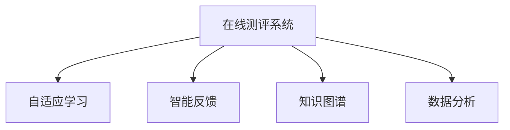

                 

# 如何打造知识付费的在线测评系统

## 1. 背景介绍

### 1.1 问题由来
随着互联网技术的迅速发展，知识付费平台逐渐成为用户获取知识、技能的重要渠道。然而，如何确保用户能够获得高质量的知识内容，以及如何衡量用户的学习效果，成为了知识付费平台急需解决的问题。在线测评系统的构建，不仅能够帮助平台提升课程质量，还能为学员提供科学的反馈，提高学习效率，因此具有极高的市场价值。

### 1.2 问题核心关键点
打造知识付费的在线测评系统，核心关键点在于如何通过技术手段，构建一个可靠、高效、易于维护的测评系统。具体包括：

- 测评模型的构建与优化
- 测评数据的采集与管理
- 测评结果的分析和呈现
- 测评系统的技术架构设计
- 测评系统的安全性与隐私保护
- 测评系统的部署与维护

### 1.3 问题研究意义
在线测评系统的成功构建，对于知识付费平台具有以下重要意义：

1. **提升课程质量**：通过测评数据，平台可以及时发现课程中的不足，进行针对性的优化和调整，确保课程内容的高质量。
2. **提高用户满意度**：科学的测评结果能帮助学员了解自己的学习情况，明确学习方向，从而提高学习效果和满意度。
3. **增强平台竞争力**：优质的测评系统可以成为平台的重要卖点，吸引更多用户和内容创作者加入，增强平台的市场竞争力。
4. **推动教育技术发展**：测评系统的建设和应用，能够推动教育技术的发展，为更多领域提供可借鉴的技术解决方案。

## 2. 核心概念与联系

### 2.1 核心概念概述

为更好地理解如何构建在线测评系统，本节将介绍几个关键概念及其相互联系：

- **在线测评系统**：指利用计算机技术，对用户的学习行为进行科学评估的系统，包括自适应学习、智能反馈等功能。
- **自适应学习**：根据用户的学习表现，动态调整学习路径和内容，提供个性化的学习体验。
- **智能反馈**：利用自然语言处理(NLP)、机器学习等技术，对用户的学习结果进行智能化分析和评估。
- **知识图谱**：描述知识领域中实体和关系的语义网络，帮助系统进行知识关联和推理。
- **数据分析**：通过对测评数据的统计和分析，生成报表和可视化结果，辅助教育决策。

这些概念之间的逻辑关系可以通过以下Mermaid流程图来展示：



这个流程图展示了在线测评系统的核心构成及其与自适应学习、智能反馈、知识图谱和数据分析的关系。

## 3. 核心算法原理 & 具体操作步骤
### 3.1 算法原理概述

在线测评系统的核心算法原理，主要围绕数据采集、模型训练、结果分析和输出等方面展开。

- **数据采集**：收集用户的学习行为数据，如点击、阅读、答题、评论等。
- **模型训练**：构建并训练机器学习模型，用于分析用户的学习数据，预测学习效果。
- **结果分析**：对模型的输出结果进行分析和解读，生成可视化的测评报告。
- **输出呈现**：将测评报告呈现给用户和教育者，提供科学的反馈和指导。

### 3.2 算法步骤详解

#### 3.2.1 数据采集

数据采集是测评系统构建的基础，关键在于如何设计合适的数据收集方式，确保数据的多样性和代表性。具体步骤如下：

1. **行为追踪**：在课程中嵌入追踪代码，实时记录用户的学习行为，包括页面访问、视频观看、问答互动等。
2. **数据清洗**：对收集到的数据进行清洗和处理，去除异常和噪声，确保数据质量。
3. **数据存储**：将清洗后的数据存储在数据库中，方便后续分析和查询。

#### 3.2.2 模型训练

模型训练是测评系统的核心，通过训练机器学习模型，生成预测和评估结果。具体步骤如下：

1. **特征工程**：从采集到的数据中提取特征，如学习时长、答题正确率、视频观看次数等。
2. **模型选择**：选择合适的机器学习模型，如决策树、随机森林、神经网络等。
3. **训练优化**：使用交叉验证等技术优化模型参数，提升模型预测精度。
4. **结果验证**：在测试集上验证模型性能，确保模型泛化能力强。

#### 3.2.3 结果分析

结果分析是测评系统的输出环节，通过分析模型的输出结果，生成科学合理的测评报告。具体步骤如下：

1. **指标计算**：计算各项测评指标，如学习进度、答题正确率、知识掌握程度等。
2. **可视化展示**：将测评结果可视化，生成图表、报表等，便于用户和教育者理解。
3. **反馈机制**：根据测评结果，提供个性化的学习建议和改进方案。

#### 3.2.4 输出呈现

输出呈现是测评系统的最后一步，将分析结果呈现给用户和教育者。具体步骤如下：

1. **界面设计**：设计简洁直观的用户界面，展示测评结果和反馈。
2. **交互设计**：设计友好的交互方式，便于用户查看和操作。
3. **通知机制**：通过邮件、短信等方式，及时通知用户测评结果和改进建议。

### 3.3 算法优缺点

在线测评系统具有以下优点：

- **自动化**：通过机器学习模型，实现自动化评估，节省人力成本。
- **个性化**：通过自适应学习，提供个性化学习路径，提升学习效果。
- **客观性**：通过科学的数据分析和模型评估，提供客观公正的测评结果。

同时，该系统也存在一定的局限性：

- **数据依赖**：测评系统的准确性依赖于数据的质量和多样性。
- **模型泛化**：模型训练数据的代表性不足，可能导致模型泛化能力弱。
- **结果解释**：测评系统的输出结果难以完全解释，用户难以理解其中的原因。

尽管存在这些局限性，但通过合理设计和优化，在线测评系统仍可以在教育领域发挥重要作用，成为知识付费平台的重要工具。

### 3.4 算法应用领域

在线测评系统主要应用于以下领域：

1. **在线教育平台**：提供科学的测评和反馈，帮助教育者优化课程内容，提升学员学习效果。
2. **企业培训系统**：通过测评学员的学习表现，进行人才评估和职业发展规划。
3. **在线考试系统**：对考生进行标准化测试，评估其知识掌握程度。
4. **学术研究领域**：通过测评数据，研究用户学习行为和知识掌握规律，推动教育技术发展。

## 4. 数学模型和公式 & 详细讲解 & 举例说明
### 4.1 数学模型构建

在线测评系统的数学模型主要包括以下几个部分：

- **用户行为模型**：描述用户学习行为的数据模型，如点击率、阅读时长、答题次数等。
- **测评模型**：用于分析用户学习数据，预测学习效果的机器学习模型。
- **结果分析模型**：对测评结果进行统计和分析的模型，如回归分析、聚类分析等。

### 4.2 公式推导过程

以回归分析为例，假设用户的学习行为可以用线性模型表示，即：

$$
y = \theta_0 + \theta_1 x_1 + \theta_2 x_2 + \ldots + \theta_n x_n + \epsilon
$$

其中 $y$ 为用户的学习效果，$x_i$ 为影响因素，$\theta_i$ 为回归系数，$\epsilon$ 为误差项。

利用最小二乘法，求解回归系数 $\theta_i$ 的过程如下：

$$
\hat{\theta} = \arg\min_{\theta} \sum_{i=1}^n (y_i - \hat{y}_i)^2
$$

求解得到回归系数 $\hat{\theta}$ 后，可以通过模型预测用户的学习效果。

### 4.3 案例分析与讲解

假设我们有一个在线教育平台，记录了用户在不同课程中的学习行为数据，包括课程名称、学习时长、答题正确率等。通过回归分析模型，我们可以预测用户在不同课程中的学习效果。具体步骤如下：

1. **数据准备**：收集用户的课程名称、学习时长、答题正确率等数据，构建特征向量 $X$。
2. **模型训练**：使用线性回归模型，训练得到回归系数 $\hat{\theta}$。
3. **结果预测**：对新课程进行预测，得到用户在该课程中的学习效果 $y$。

## 5. 项目实践：代码实例和详细解释说明
### 5.1 开发环境搭建

在进行测评系统开发前，我们需要准备好开发环境。以下是使用Python进行Pandas、Scikit-learn、TensorFlow等库开发的环境配置流程：

1. 安装Anaconda：从官网下载并安装Anaconda，用于创建独立的Python环境。

2. 创建并激活虚拟环境：
```bash
conda create -n py-env python=3.8 
conda activate py-env
```

3. 安装必要的库：
```bash
pip install pandas scikit-learn tensorflow matplotlib seaborn jupyter notebook ipython
```

4. 安装TensorFlow和Keras：
```bash
pip install tensorflow keras
```

完成上述步骤后，即可在`py-env`环境中开始测评系统开发。

### 5.2 源代码详细实现

下面以用户行为数据为例，展示如何使用Pandas、Scikit-learn和TensorFlow进行在线测评系统的开发。

首先，定义数据预处理函数：

```python
import pandas as pd
import numpy as np
from sklearn.preprocessing import StandardScaler
from sklearn.model_selection import train_test_split

def preprocess_data(data):
    # 数据清洗
    data.dropna(inplace=True)
    data.drop_duplicates(inplace=True)
    
    # 特征工程
    features = data[['learning_time', 'answer_correct_rate']]
    target = data['learning_effect']
    
    # 标准化处理
    scaler = StandardScaler()
    features = scaler.fit_transform(features)
    
    # 数据分割
    X_train, X_test, y_train, y_test = train_test_split(features, target, test_size=0.2, random_state=42)
    
    return X_train, X_test, y_train, y_test
```

然后，定义模型训练函数：

```python
from sklearn.linear_model import LinearRegression
from tensorflow.keras.models import Sequential
from tensorflow.keras.layers import Dense

def train_model(X_train, y_train):
    # 模型选择
    model = Sequential()
    model.add(Dense(units=64, activation='relu', input_dim=X_train.shape[1]))
    model.add(Dense(units=1, activation='linear'))
    
    # 模型训练
    model.compile(optimizer='adam', loss='mse')
    model.fit(X_train, y_train, epochs=50, batch_size=32, verbose=0)
    
    return model
```

最后，定义结果分析函数：

```python
import matplotlib.pyplot as plt
import seaborn as sns

def analyze_result(model, X_test, y_test):
    # 模型预测
    y_pred = model.predict(X_test)
    
    # 可视化结果
    sns.scatterplot(x=X_test[:, 0], y=y_test, color='blue', label='Actual')
    sns.scatterplot(x=X_test[:, 0], y=y_pred, color='red', label='Predicted')
    plt.xlabel('Learning Time')
    plt.ylabel('Learning Effect')
    plt.legend()
    plt.show()
```

通过上述代码，我们实现了数据预处理、模型训练和结果分析的过程。

### 5.3 代码解读与分析

让我们再详细解读一下关键代码的实现细节：

**数据预处理函数preprocess_data**：
- `dropna`和`drop_duplicates`：去除数据中的缺失值和重复数据，确保数据质量。
- `StandardScaler`：对特征进行标准化处理，使得数据具有相同的尺度，便于模型训练。
- `train_test_split`：将数据集分为训练集和测试集，用于模型评估和验证。

**模型训练函数train_model**：
- `Sequential`和`Dense`：使用Keras构建多层感知器模型，用于回归预测。
- `model.compile`和`model.fit`：编译模型并拟合训练数据，使用Adam优化器和均方误差损失函数。

**结果分析函数analyze_result**：
- `model.predict`：对测试集进行预测，得到预测值。
- `sns.scatterplot`：使用Seaborn库绘制预测结果与真实值之间的散点图，直观展示模型性能。

通过上述代码，我们可以看到在线测评系统的核心逻辑包括数据预处理、模型训练和结果分析。

## 6. 实际应用场景
### 6.1 智能辅导系统

在线测评系统在智能辅导系统中的应用，能够实时评估学员的学习效果，提供个性化辅导建议。例如，在编程课程中，系统可以记录学员的代码提交记录、测试通过率等数据，通过机器学习模型预测学员的编程水平，并推荐相应的编程题目进行练习。

### 6.2 企业培训评估

在企业培训系统中，在线测评系统可以帮助HR部门评估员工的学习效果，进行人才选拔和晋升。例如，通过记录员工的学习记录、考试成绩等数据，系统可以生成综合评估报告，提供科学的参考依据。

### 6.3 在线教育平台

在线测评系统在在线教育平台中的应用，可以提供科学的课程评估，帮助教育者优化课程内容。例如，系统可以记录学员在不同课程中的学习数据，通过回归分析模型预测学员的学习效果，进而调整课程难度和内容。

### 6.4 未来应用展望

未来，在线测评系统将会在更多领域得到应用，推动教育技术的不断发展。

- **个性化学习**：通过智能分析用户的学习行为，提供个性化的学习建议，提升学习效果。
- **动态调整课程**：根据用户的学习数据，动态调整课程难度和内容，满足不同用户的需求。
- **多模态评估**：结合视频、音频等多模态数据，提升评估的全面性和准确性。
- **实时反馈机制**：通过实时数据采集和分析，提供即时的学习反馈，帮助用户及时调整学习策略。

## 7. 工具和资源推荐
### 7.1 学习资源推荐

为了帮助开发者系统掌握在线测评系统的开发，这里推荐一些优质的学习资源：

1. 《Python数据分析》系列博文：详细介绍了使用Pandas进行数据处理和分析的常用方法。

2. 《机器学习实战》书籍：全面介绍了机器学习的基本原理和应用，包括回归分析、分类、聚类等。

3. 《深度学习入门》书籍：介绍了深度学习的基本概念和常用模型，适合初学者入门。

4. Kaggle在线平台：提供丰富的数据集和竞赛，帮助开发者实践机器学习模型。

5. TensorFlow官方文档：提供详细的TensorFlow API文档，方便开发者进行模型开发。

通过对这些资源的学习实践，相信你一定能够快速掌握在线测评系统的开发技巧，并用于解决实际的测评问题。

### 7.2 开发工具推荐

高效的开发离不开优秀的工具支持。以下是几款用于在线测评系统开发的常用工具：

1. Jupyter Notebook：基于Python的交互式开发环境，支持代码块和注释的混排展示，适合数据探索和模型开发。

2. Visual Studio Code：功能强大的代码编辑器，支持Python、Scikit-learn、TensorFlow等库的集成开发。

3. Anaconda：集成数据科学环境的工具包，提供了Python、NumPy、Pandas等库的预安装，方便快速开发。

4. TensorFlow和Keras：用于构建和训练深度学习模型的开源框架，支持多种神经网络模型的实现。

5. PyTorch：用于构建和训练深度学习模型的开源框架，灵活高效，适合研究型开发。

合理利用这些工具，可以显著提升在线测评系统的开发效率，加快创新迭代的步伐。

### 7.3 相关论文推荐

在线测评系统的建设和应用，涉及多个前沿的研究领域。以下是几篇奠基性的相关论文，推荐阅读：

1. Learning to Predict and Adapt in Educational Settings：介绍了机器学习在教育评估中的应用，提出了自适应学习系统的构想。

2. Deep Learning in Large-Scale Online Education：讨论了深度学习在在线教育中的潜力，探讨了在线测评系统的构建方法。

3. Knowledge Graph-Based Learning Analytics：介绍了知识图谱在教育数据分析中的应用，提供了基于知识图谱的测评系统架构。

4. Personalized Recommendation for Students' Learning Style：探讨了个性化推荐系统在教育领域的应用，研究了测评数据与推荐算法之间的关系。

这些论文代表了大规模在线测评系统的研究进展，通过学习这些前沿成果，可以帮助研究者把握学科前进方向，激发更多的创新灵感。

## 8. 总结：未来发展趋势与挑战
### 8.1 总结

本文对如何构建在线测评系统进行了全面系统的介绍。首先阐述了在线测评系统的背景和意义，明确了测评系统在知识付费平台、企业培训、在线教育等多个领域的应用价值。其次，从原理到实践，详细讲解了在线测评系统的各个环节，包括数据采集、模型训练、结果分析和输出呈现，提供了完整的代码实例和解释分析。最后，本文还展望了在线测评系统的未来发展趋势和面临的挑战，强调了技术创新和工程实践的重要性。

通过本文的系统梳理，可以看到，在线测评系统为知识付费平台和教育技术的发展提供了重要的技术支撑，其未来潜力巨大，值得深入研究和应用。

### 8.2 未来发展趋势

展望未来，在线测评系统将呈现以下几个发展趋势：

1. **多模态数据融合**：结合视频、音频等多模态数据，提升测评的全面性和准确性。
2. **自适应学习技术**：通过动态调整学习路径和内容，提供个性化的学习体验。
3. **智能反馈机制**：利用自然语言处理(NLP)和机器学习技术，提供科学的反馈和建议。
4. **跨领域应用拓展**：将测评系统应用于更多领域，如医疗、金融、零售等，推动跨领域知识迁移。
5. **实时数据分析**：通过实时数据采集和分析，提供即时的学习反馈和建议，提升用户满意度。

### 8.3 面临的挑战

尽管在线测评系统具有广阔的应用前景，但在构建和应用过程中，仍面临以下挑战：

1. **数据质量问题**：数据采集过程中的噪声和缺失值可能影响测评结果的准确性。
2. **模型泛化能力**：模型训练数据的不足可能导致模型泛化能力弱。
3. **隐私和安全**：测评数据的隐私保护和安全传输是一个重要问题，需采取有效的技术措施。
4. **用户接受度**：测评系统的使用需要用户的主动配合，用户接受度和参与度可能影响系统效果。
5. **技术门槛高**：测评系统的开发需要一定的技术基础，对开发者的要求较高。

尽管存在这些挑战，但通过持续的技术创新和工程优化，在线测评系统有望克服困难，实现更广泛的应用。

### 8.4 研究展望

未来的研究需要在以下几个方面寻求新的突破：

1. **无监督和半监督学习**：探索无监督和半监督学习算法，减少对标注数据的需求，提高测评系统的鲁棒性。
2. **多任务学习**：研究多任务学习算法，提升测评系统对多个任务的综合评估能力。
3. **跨领域知识迁移**：研究跨领域知识迁移方法，提升测评系统的泛化能力，拓展应用领域。
4. **在线实时评估**：研究在线实时评估技术，提高测评系统的实时性，满足用户需求。
5. **智能生成技术**：探索基于生成模型的测评系统，提升测评结果的准确性和可解释性。

这些研究方向的探索，必将引领在线测评系统向更高的台阶发展，为教育技术带来新的突破。

## 9. 附录：常见问题与解答
**Q1：在线测评系统如何保证数据隐私和安全？**

A: 在线测评系统的数据隐私和安全是一个重要问题，需采取以下技术措施：
1. 数据加密：对用户数据进行加密处理，防止数据泄露。
2. 访问控制：采用角色权限控制，限制不同用户对数据的访问权限。
3. 数据匿名化：对敏感数据进行去标识化处理，防止数据被滥用。
4. 安全传输：使用HTTPS协议进行数据传输，保证数据在传输过程中的安全。

**Q2：在线测评系统的用户接受度如何提升？**

A: 提升在线测评系统的用户接受度，可以从以下几个方面入手：
1. 界面设计：设计简洁、易用的用户界面，提升用户体验。
2. 提示引导：通过智能提示和引导，帮助用户了解测评系统的功能和使用方法。
3. 即时反馈：提供即时反馈和建议，满足用户的需求。
4. 社交功能：增加社交功能，如学习讨论、分享成果等，提升用户参与度。

**Q3：在线测评系统的技术门槛高吗？**

A: 在线测评系统的技术门槛相对较高，需要一定的编程、数据处理和机器学习知识。但通过学习和实践，可以逐步掌握所需技能。

**Q4：在线测评系统的数据采集方法有哪些？**

A: 在线测评系统的数据采集方法包括：
1. 行为追踪：通过埋点代码记录用户的学习行为，如点击、观看、答题等。
2. 问卷调查：通过问卷调查获取用户的反馈数据。
3. 实验设计：通过实验设计获取用户的实际效果数据。

通过合理的技术手段和用户参与，可以采集到高质量的测评数据，提升系统的准确性和可靠性。

---

作者：禅与计算机程序设计艺术 / Zen and the Art of Computer Programming

