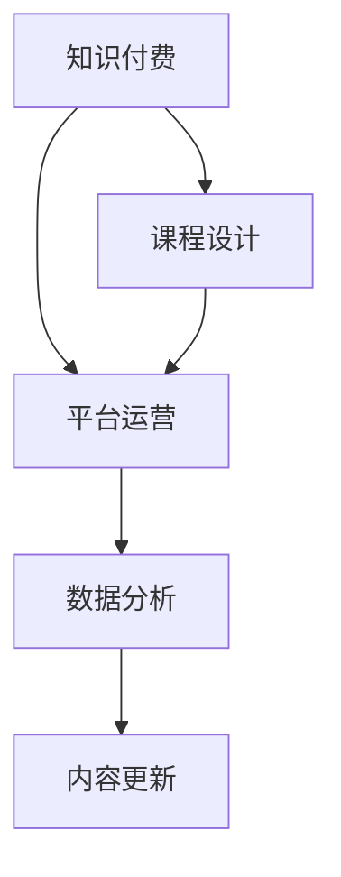

                 

# 如何打造高口碑的程序员知识付费产品

## 1. 背景介绍

### 1.1 问题由来

在当今信息爆炸的时代，程序员需要不断学习新知识，以跟上技术进步的步伐。然而，在繁杂的学习资源中，质量参差不齐，难以筛选出真正有价值的知识。知识付费的出现，为程序员提供了一个高效获取专业知识的新途径。然而，许多知识付费产品，尽管内容丰富，但用户体验欠佳，口碑不佳。如何打造高口碑的程序员知识付费产品，成为众多产品团队关注的焦点。

### 1.2 问题核心关键点

高口碑的程序员知识付费产品，应当具备以下特点：
- **质量保证**：内容真实可靠，经过严格审核，避免误导信息。
- **用户体验**：界面友好，交互顺畅，易于使用。
- **知识体系**：系统完整，条理清晰，易于学习。
- **互动交流**：社区活跃，用户参与度高，便于问题解决。
- **服务响应**：技术支持到位，问题反馈迅速，便于及时改进。

## 2. 核心概念与联系

### 2.1 核心概念概述

在知识付费产品的构建中，涉及多个核心概念：

- **知识付费**：程序员通过付费获取高质量的学习内容，提升自身技能。
- **课程设计**：以系统化、结构化的方式，设计课程内容，帮助学员高效学习。
- **平台运营**：构建一个稳定、高效的平台，提供课程发布、学员互动、服务支持等全流程支持。
- **数据分析**：利用数据分析工具，了解学员行为，优化课程内容和平台功能。
- **内容更新**：定期更新课程内容，确保知识的时效性和实用性。

这些概念之间的逻辑关系可以通过以下Mermaid流程图来展示：



该流程图展示了知识付费产品的构建流程：

1. 首先，知识付费作为一个整体概念，为课程设计、平台运营等环节提供了目标和方向。
2. 课程设计聚焦于内容的规划和构建，是知识付费的核心。
3. 平台运营则是将课程发布、学员互动等功能落地的保障。
4. 数据分析和内容更新，则是为了持续优化课程和平台，确保其与时俱进。

## 3. 核心算法原理 & 具体操作步骤

### 3.1 算法原理概述

知识付费产品的核心在于内容的生产和消费，因此构建高口碑产品的关键在于算法的设计和应用。

### 3.2 算法步骤详解

**Step 1: 课程内容设计**
- 确定课程主题和目标受众，设计课程大纲。
- 根据大纲，邀请行业专家进行内容创作。
- 使用Kaggle、Github等平台，获取开放数据集作为案例分析素材。
- 进行内容审核，确保知识准确无误。

**Step 2: 平台功能搭建**
- 选择合适的技术栈，如React、Vue、Flask等。
- 设计用户界面(UI)和用户交互(UI)流程，确保界面友好。
- 实现用户注册、登录、支付等功能，保障平台稳定运行。
- 集成第三方工具，如支付网关、视频播讲平台等，提升用户体验。

**Step 3: 数据分析与反馈**
- 利用Google Analytics、Mixpanel等工具，收集用户行为数据。
- 使用数据可视化工具，如Tableau、Power BI，进行数据报表分析。
- 根据用户反馈，进行产品迭代，优化课程内容和学习体验。

**Step 4: 内容更新与迭代**
- 定期发布新课程，保持内容新鲜度。
- 邀请行业专家进行内容审核，确保知识的准确性。
- 根据用户反馈，调整课程内容和难度，满足学员需求。
- 定期进行课程评价，根据评价结果进行调整和优化。

### 3.3 算法优缺点

高口碑知识付费产品的构建，具有一定的优点和局限性：

**优点**：
- **知识时效性**：课程内容实时更新，确保知识的时效性和实用性。
- **用户体验**：友好的界面设计和完善的交互流程，提升学习效率。
- **内容质量保证**：专家审核和课程评价机制，确保内容的高质量。
- **服务响应**：及时的技术支持和问题反馈，增强用户信任。

**局限性**：
- **成本投入**：课程设计和平台搭建需要大量的资源投入。
- **用户依赖**：高度依赖平台服务，难以应对突发情况。
- **内容差异化**：难以在课程内容上实现差异化竞争。

## 4. 数学模型和公式 & 详细讲解

### 4.1 数学模型构建

在知识付费产品的构建中，我们可以利用数学模型来优化课程设计和平台功能。例如，可以利用协同过滤算法，根据用户行为推荐课程；利用回归分析，预测用户流失率等。

### 4.2 公式推导过程

以推荐算法为例，常见的协同过滤算法包括基于用户的协同过滤和基于物品的协同过滤。其核心思想是根据用户行为或物品属性，推荐相似的物品或用户。以下是一个简单的协同过滤算法公式：

$$
\text{推荐列表} = \text{用户画像} \times \text{物品相似度矩阵}
$$

其中，用户画像为用户的兴趣标签或行为记录，物品相似度矩阵为物品之间的相似度计算结果。

### 4.3 案例分析与讲解

以某编程课程平台为例，利用协同过滤算法进行推荐。首先，收集用户在学习过程中的行为数据，如观看课程时间、答题次数等。然后，根据这些行为数据，计算用户画像。接着，根据物品相似度矩阵，计算推荐列表。最后，将推荐列表展示给用户，引导其进行下一步学习。

## 5. 项目实践：代码实例和详细解释说明

### 5.1 开发环境搭建

在开发知识付费产品时，需要搭建一个稳定的开发环境。以下是Python开发环境的具体配置流程：

1. 安装Anaconda：从官网下载并安装Anaconda，用于创建独立的Python环境。

2. 创建并激活虚拟环境：
```bash
conda create -n py37 python=3.7 
conda activate py37
```

3. 安装开发工具：
```bash
pip install numpy pandas matplotlib scikit-learn
```

4. 安装编程框架：
```bash
pip install flask
```

5. 安装其他工具：
```bash
pip install google-auth google-auth-oauthlib google-auth-httplib2 google-api-python-client google-auth-netrc
```

### 5.2 源代码详细实现

以下是一个简单的Python Flask应用程序，用于搭建知识付费产品的基本功能：

```python
from flask import Flask, render_template, request, redirect, url_for
from flask_sqlalchemy import SQLAlchemy

app = Flask(__name__)
app.config['SQLALCHEMY_DATABASE_URI'] = 'sqlite:///course.db'
db = SQLAlchemy(app)

class Course(db.Model):
    id = db.Column(db.Integer, primary_key=True)
    title = db.Column(db.String(100))
    description = db.Column(db.Text)
    price = db.Column(db.Float)

@app.route('/')
def index():
    courses = Course.query.all()
    return render_template('index.html', courses=courses)

@app.route('/register', methods=['GET', 'POST'])
def register():
    if request.method == 'POST':
        course_id = request.form['course_id']
        Course.query.filter_by(id=course_id).update({' purchased': True })
        return redirect(url_for('index'))
    return render_template('register.html')

@app.route('/logout')
def logout():
    return redirect(url_for('index'))
```

### 5.3 代码解读与分析

在上述代码中，我们使用Flask框架，创建了一个简单的知识付费产品。代码主要分为以下几个部分：

1. 首先，创建了一个Flask应用实例。
2. 配置了SQLite数据库，用于存储课程信息。
3. 定义了一个`Course`模型，包含课程的标题、描述和价格等属性。
4. 创建了一个`index`路由，用于展示所有课程。
5. 创建了一个`register`路由，用于购买课程。
6. 创建了一个`logout`路由，用于退出登录。

通过上述代码，我们可以看到知识付费产品的基本功能，包括课程展示、购买和退出登录。当然，这只是一个简单的示例，实际的开发中还需要添加更多功能和细节。

### 5.4 运行结果展示

在运行上述代码后，可以通过浏览器访问`http://localhost:5000`，查看课程信息。用户可以通过点击课程名称，进入课程详情页，并进行购买。

## 6. 实际应用场景

### 6.1 知识管理平台

知识付费产品可以应用于知识管理平台，帮助企业内部的员工进行知识共享和技能提升。平台可以提供各类专业课程、技术博客、案例分析等，提升员工的整体素质和工作效率。

### 6.2 技术培训系统

知识付费产品可以应用于技术培训机构，为学员提供系统的课程内容和实战练习。通过互动交流和项目实战，学员可以更好地掌握编程技能，提升就业竞争力。

### 6.3 在线教育平台

知识付费产品可以应用于在线教育平台，为广大学员提供高质量的课程资源。平台可以根据学员的学习进度和需求，进行个性化推荐，提升学习效果。

### 6.4 未来应用展望

随着人工智能和机器学习技术的发展，知识付费产品可以进一步优化和创新，提升用户体验和课程质量。例如，可以引入AI助教，根据学员的学习情况，进行个性化辅导和推荐；可以利用自然语言处理技术，自动生成课程总结和笔记，帮助学员更好地掌握知识点。

## 7. 工具和资源推荐

### 7.1 学习资源推荐

为帮助开发者系统掌握知识付费产品的构建，这里推荐一些优质的学习资源：

1. Coursera、edX等在线课程平台：提供系统化、结构化的课程设计学习路径。
2. Udacity、Udemy等编程课程平台：提供实战性的编程练习和项目实践。
3. GitHub、CSDN等开源社区：获取开源课程代码和社区交流，提升编程技能。
4. Kaggle、Pinterest等数据竞赛平台：参与数据竞赛，提升数据处理和算法能力。
5. PyCon、FPSB等技术会议：参加技术会议，了解最新的技术和趋势。

### 7.2 开发工具推荐

高效的开发离不开优秀的工具支持。以下是几款用于知识付费产品开发的常用工具：

1. Flask、Django等Web框架：提供完整的Web开发框架，支持快速开发和部署。
2. MySQL、PostgreSQL等数据库：支持高效的数据存储和查询。
3. Docker、Kubernetes等容器化工具：支持应用的稳定运行和扩展。
4. Git、SVN等版本控制工具：支持代码的协作和版本管理。
5. JIRA、Trello等项目管理工具：支持任务分配和进度跟踪。

### 7.3 相关论文推荐

知识付费产品的构建涉及多个前沿技术领域。以下是几篇奠基性的相关论文，推荐阅读：

1. "Machine Learning for Educational Personalization: From Analysis to Action"（教育个性化机器学习：从分析到行动）：探索机器学习在教育中的应用，为知识付费产品提供数据驱动的个性化推荐方案。
2. "Building an Online Learning System with Artificial Intelligence"（基于人工智能的在线学习系统构建）：介绍基于人工智能的在线学习系统设计，包括课程推荐、学习路径优化等。
3. "AI for Personalized Learning: From Intelligent Tutoring to Automated Learning Analytics"（人工智能在个性化学习中的应用：从智能辅导到自动学习分析）：介绍AI技术在个性化学习中的运用，提升学习效果和用户体验。

## 8. 总结：未来发展趋势与挑战

### 8.1 研究成果总结

知识付费产品已经成为程序员获取专业知识的重要途径。其构建的核心在于课程设计和平台运营，通过高质量的内容和良好的用户体验，提升用户口碑。

### 8.2 未来发展趋势

知识付费产品的发展将呈现以下趋势：

1. **内容生态**：构建丰富的课程内容和社区资源，吸引更多用户参与。
2. **技术创新**：引入AI、机器学习等前沿技术，提升课程推荐和学习效果。
3. **个性化定制**：根据用户的学习行为和偏好，提供个性化的课程和推荐。
4. **多元化服务**：拓展到在线培训、技术支持、职业规划等多元化服务。
5. **国际化布局**：将产品推广到全球市场，提升国际影响力。

### 8.3 面临的挑战

尽管知识付费产品已经取得了显著进展，但在发展过程中仍面临诸多挑战：

1. **课程质量控制**：课程内容的质量和实用性需要持续优化。
2. **用户流失问题**：用户流失率高，需要不断改进平台功能和用户体验。
3. **技术难点**：平台技术和课程设计的复杂性需要不断攻关。
4. **市场竞争**：市场竞争激烈，需要差异化竞争策略。
5. **数据隐私**：用户数据隐私保护需要严格遵守相关法规。

### 8.4 研究展望

未来，知识付费产品的发展需要在以下几个方面进行深入研究：

1. **课程内容**：开发更多高质量的课程内容，满足用户的多样化需求。
2. **个性化推荐**：利用AI和机器学习技术，提升课程推荐的效果。
3. **社区互动**：建立活跃的社区，促进用户之间的交流和协作。
4. **技术优化**：优化平台技术架构，提升系统的稳定性和性能。
5. **市场拓展**：拓展市场份额，提升全球影响力。

## 9. 附录：常见问题与解答

**Q1：如何设计课程内容？**

A: 课程设计需要考虑以下几点：
1. 确定课程主题和目标受众，设计课程大纲。
2. 邀请行业专家进行内容创作。
3. 利用开放数据集进行案例分析。
4. 进行内容审核，确保知识准确无误。

**Q2：如何选择推荐算法？**

A: 推荐算法的选择需要根据具体需求和数据特点进行。常见推荐算法包括协同过滤、基于内容的推荐、基于用户画像的推荐等。可以根据数据类型和用户行为，选择合适的推荐算法。

**Q3：如何进行用户数据分析？**

A: 用户数据分析可以通过以下步骤进行：
1. 收集用户行为数据，如观看时间、答题次数等。
2. 使用数据可视化工具，如Tableau、Power BI，进行数据报表分析。
3. 根据数据分析结果，进行产品迭代和优化。

**Q4：如何处理用户流失问题？**

A: 用户流失问题可以通过以下措施处理：
1. 提升课程质量和用户体验，吸引用户留存。
2. 增加用户互动和社区交流，提升用户参与度。
3. 提供个性化的课程推荐和辅导，满足用户需求。

**Q5：如何保护用户数据隐私？**

A: 用户数据隐私保护需要严格遵守相关法规，如GDPR、CCPA等。具体措施包括：
1. 数据匿名化处理，防止数据泄露。
2. 数据加密存储，保障数据安全。
3. 用户数据使用透明，明确数据用途和权限。

---

作者：禅与计算机程序设计艺术 / Zen and the Art of Computer Programming

