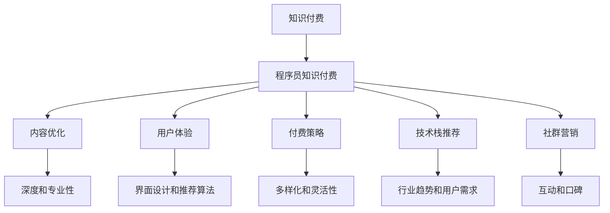

                 

# 如何打造高成交量的程序员知识付费产品

> 关键词：知识付费, 程序员, 内容优化, 用户体验, 付费策略, 技术栈推荐, 社群营销

## 1. 背景介绍

### 1.1 问题由来

随着信息技术的迅速发展，人们对于高质量内容的需求日益增长。知识付费作为一种新兴的商业模式，通过提供专业化、个性化的内容，满足了用户对知识和信息的高效获取。然而，在知识付费领域，尤其是面向程序员的知识付费产品中，仍然存在内容质量参差不齐、用户体验不佳、用户粘性不高、营收转化率低等问题。

### 1.2 问题核心关键点

针对程序员的知识付费产品要想实现高成交量和高质量的用户体验，需要重点关注以下几个方面：

- **内容质量**：保证内容的深度、专业性和实用性，避免内容同质化。
- **用户体验**：设计友好的用户界面，提供个性化推荐，提高用户黏性。
- **付费策略**：灵活的付费模式，让用户根据自身需求选择购买内容，增加转化率。
- **技术栈推荐**：根据用户需求和行业趋势，推荐合适的技术栈，帮助用户快速成长。
- **社群营销**：利用社区力量，增强用户互动，形成良性生态。

### 1.3 问题研究意义

打造高成交量的程序员知识付费产品，不仅能满足程序员不断学习新技能的需求，还能为平台和开发者带来稳定的收入来源。具体而言：

1. **提升个人技能**：帮助程序员获取前沿技术知识，掌握新工具，提升职场竞争力。
2. **增强开发者社群**：通过高质量内容和互动，增强开发者之间的交流，形成学习社区。
3. **促进产业升级**：推动技术创新，加速产品迭代，提升软件产品质量。
4. **增加平台收益**：提供多样化付费方式，提高用户留存率和转化率，实现可持续盈利。
5. **拓展应用场景**：利用知识付费模式，推动技术培训、技能认证、企业定制化培训等业务。

## 2. 核心概念与联系

### 2.1 核心概念概述

为更好地理解如何打造高成交量的程序员知识付费产品，本节将介绍几个密切相关的核心概念：

- **知识付费**：通过付费获取特定知识或技能的学习服务，典型的服务形式包括课程、文章、直播等。
- **程序员知识付费**：面向程序员的定制化知识服务，内容包括编程语言、框架、算法、项目管理、软技能等。
- **内容优化**：根据用户需求和反馈，不断优化内容质量，提升用户满意度和转化率。
- **用户体验**：通过技术手段和设计思路，提升用户使用产品时的便捷性、高效性和愉悦感。
- **付费策略**：根据用户行为和需求，设计多样化的付费模型，实现营收增长。
- **技术栈推荐**：结合用户兴趣和行业趋势，推荐合适的技术栈，帮助用户快速掌握新技能。
- **社群营销**：利用社区互动和用户口碑，增强用户粘性，形成良性生态。

这些核心概念之间的逻辑关系可以通过以下Mermaid流程图来展示：



这个流程图展示了几者之间的联系：

1. **知识付费**：是程序员知识付费的基础。
2. **内容优化**：确保内容的深度和专业性，提升用户满意度和留存率。
3. **用户体验**：通过界面设计和推荐算法，提升用户的便捷性和使用体验。
4. **付费策略**：根据用户需求，设计多样化和灵活的付费模型。
5. **技术栈推荐**：结合用户兴趣和行业趋势，推荐合适的技术栈。
6. **社群营销**：利用社区力量，增强用户互动和口碑传播。

## 3. 核心算法原理 & 具体操作步骤
### 3.1 算法原理概述

打造高成交量的程序员知识付费产品，核心在于提供高质量、实用性强、互动性高的内容和服务。基于此，本文将从内容优化、用户体验、付费策略、技术栈推荐和社群营销五个方面，详细阐述如何构建一个成功的程序员知识付费平台。

### 3.2 算法步骤详解

#### 3.2.1 内容优化

**Step 1: 内容质量评估**
- 利用用户评分、评论和互动数据，评估内容的质量和实用性。
- 分析用户行为，找出热门和需求量大的内容主题。

**Step 2: 内容审核和迭代**
- 定期审核内容，确保信息的准确性和时效性。
- 根据用户反馈，不断优化和更新内容，提升用户体验。

**Step 3: 内容推荐算法**
- 利用机器学习算法（如协同过滤、内容推荐等），为用户提供个性化推荐。
- 结合用户行为数据和历史互动记录，推荐相关内容。

**Step 4: 知识图谱构建**
- 建立知识图谱，关联不同主题和技术栈，帮助用户发现相关知识和技能。
- 引入领域专家，制作深度解读视频和文章，提供权威见解。

#### 3.2.2 用户体验

**Step 1: 界面设计**
- 采用简洁、清晰的设计风格，确保界面的友好性和易用性。
- 使用响应式设计，适应不同设备和屏幕大小。

**Step 2: 交互优化**
- 优化前端交互，减少加载时间，提升页面响应速度。
- 引入动画和微交互，提升用户体验和操作便捷性。

**Step 3: 反馈机制**
- 建立用户反馈渠道，及时收集和处理用户意见。
- 定期进行用户满意度调查，不断改进产品。

**Step 4: 多终端支持**
- 提供移动端应用和Web端服务，方便用户随时随地访问。
- 设计跨平台接口，确保数据和功能在不同平台间无缝切换。

#### 3.2.3 付费策略

**Step 1: 免费试用**
- 提供免费试用期，吸引用户体验产品。
- 设置低门槛的试听课程，让用户快速了解平台内容。

**Step 2: 多样付费模式**
- 提供单次购买、订阅制、会员制等多种付费模式。
- 根据用户需求和行为，灵活设计不同的付费套餐。

**Step 3: 用户激励机制**
- 设计积分和奖励系统，鼓励用户持续学习。
- 提供学习进度徽章和证书，增强用户成就感和荣誉感。

**Step 4: 推广策略**
- 通过SEO、社交媒体、邮件营销等方式，提升产品曝光度。
- 与大咖和技术社区合作，进行联合推广。

#### 3.2.4 技术栈推荐

**Step 1: 行业趋势分析**
- 收集行业报告、技术趋势、社区讨论，分析热门技术栈。
- 定期更新技术栈推荐列表，确保内容的时效性。

**Step 2: 用户需求匹配**
- 分析用户兴趣和技能水平，推荐合适的技术栈和课程。
- 设计个性化推荐系统，根据用户行为和反馈进行调整。

**Step 3: 实战项目推荐**
- 结合实战项目案例，推荐适合的技术栈和实践指南。
- 提供代码示例和项目模板，帮助用户快速上手。

**Step 4: 专家访谈**
- 邀请行业专家进行访谈，分享实战经验和职业建议。
- 制作访谈视频和文章，提供深度见解和职业规划。

#### 3.2.5 社群营销

**Step 1: 社区建设**
- 建立开发者社区，提供交流和分享的平台。
- 引入版主和活跃用户，维护社区秩序和氛围。

**Step 2: 互动活动**
- 定期举办线上线下活动，如技术分享、编程竞赛等。
- 设立专家讲座和技术沙龙，增强社区活力。

**Step 3: 用户激励**
- 设立贡献排行榜，奖励活跃用户和社区贡献者。
- 设计专属徽章和特权，增强用户归属感。

**Step 4: 用户口碑传播**
- 通过社区互动和用户评价，增强产品可信度。
- 利用社交媒体和口碑传播，扩大产品影响力。

### 3.3 算法优缺点

#### 3.3.1 内容优化

**优点：**
- 提高内容质量，提升用户满意度和留存率。
- 个性化推荐系统，提升用户体验和互动性。
- 知识图谱构建，帮助用户发现相关知识和技能。

**缺点：**
- 内容审核和迭代工作量大，成本高。
- 内容质量评估和推荐算法需要技术支持。
- 知识图谱构建需要时间和资源投入。

#### 3.3.2 用户体验

**优点：**
- 界面设计和交互优化，提升用户便捷性和愉悦感。
- 多终端支持，提升用户访问和使用体验。
- 用户反馈机制，不断改进产品。

**缺点：**
- 界面设计和技术实现需要专业技能。
- 交互优化和用户反馈需要持续迭代。
- 多终端支持和技术栈兼容存在挑战。

#### 3.3.3 付费策略

**优点：**
- 免费试用期吸引用户，增加产品曝光度。
- 多样化的付费模式，满足不同用户需求。
- 用户激励机制，提升用户粘性和转化率。

**缺点：**
- 多种付费模式设计复杂，管理成本高。
- 推广策略需要持续投入和维护。
- 用户激励机制可能导致平台负担增加。

#### 3.3.4 技术栈推荐

**优点：**
- 结合行业趋势和用户需求，提供实用和前沿的技术栈推荐。
- 实战项目推荐和专家访谈，增强用户学习和实践能力。
- 个性化推荐系统，提升用户使用体验。

**缺点：**
- 行业趋势分析和内容匹配需要大量数据支持。
- 实战项目推荐和专家访谈需要专业资源投入。
- 个性化推荐系统设计和实现技术要求高。

#### 3.3.5 社群营销

**优点：**
- 社区建设和互动活动，增强用户归属感和活跃度。
- 用户口碑传播和专家讲座，提升产品可信度和影响力。
- 用户激励机制，增强用户粘性和贡献积极性。

**缺点：**
- 社区建设和维护需要大量人力和时间。
- 互动活动和专家讲座组织复杂。
- 用户激励机制设计和管理成本高。

### 3.4 算法应用领域

打造高成交量的程序员知识付费产品的核心算法，广泛应用于以下几个领域：

1. **在线教育平台**：面向不同学科和技术领域的知识付费服务，如编程、数据科学、人工智能等。
2. **技术培训和企业培训**：提供定制化的企业培训和技能提升课程，帮助企业提升技术水平。
3. **开发者社区**：建立开发者社区，提供交流、学习和分享的平台。
4. **开源项目和代码托管**：提供开源项目和代码托管服务，帮助开发者分享和协作。
5. **技术博客和新闻**：提供高质量的技术博客和新闻，帮助用户了解最新技术动态。

## 4. 数学模型和公式 & 详细讲解 & 举例说明

### 4.1 数学模型构建

为了更好地理解如何打造高成交量的程序员知识付费产品，本文将使用数学语言对核心算法进行更加严格的刻画。

记用户数为 $U$，内容数为 $C$，社区数为 $S$。

1. **用户行为模型**
   - 用户活跃度 $A = \sum_{i=1}^{U} \sum_{j=1}^{C} R_{ij}$，其中 $R_{ij}$ 为用户在内容 $C$ 上的活跃度评分。
   - 用户满意度 $S = \sum_{i=1}^{U} \sum_{k=1}^{S} P_{ik}$，其中 $P_{ik}$ 为用户在社区 $S$ 上的满意度评分。

2. **内容推荐模型**
   - 基于协同过滤的内容推荐模型：$R_{ij} = \sum_{k=1}^{S} U_{ik} V_{kj}$，其中 $U$ 为用户兴趣矩阵，$V$ 为内容特征矩阵。
   - 基于内容特征的推荐模型：$R_{ij} = \sum_{k=1}^{C} \alpha_k F_{ik} G_{kj}$，其中 $\alpha_k$ 为内容权重系数，$F$ 为内容评分矩阵，$G$ 为用户评分矩阵。

3. **付费策略模型**
   - 单次购买模型：$C_{ij} = \sum_{k=1}^{C} P_{ik} C_{kj}$，其中 $P$ 为内容价格矩阵。
   - 订阅制模型：$S_{ij} = \sum_{k=1}^{C} P_{ik} S_{kj}$，其中 $S$ 为订阅价格矩阵。

4. **技术栈推荐模型**
   - 基于行业趋势的技术栈推荐：$T_{ij} = \sum_{k=1}^{T} W_{ik} C_{kj}$，其中 $T$ 为技术栈集合，$W$ 为技术栈权重系数。
   - 基于用户需求的技术栈推荐：$T_{ij} = \sum_{k=1}^{T} \beta_k F_{ik} G_{kj}$，其中 $\beta_k$ 为技术栈权重系数，$F$ 为内容评分矩阵，$G$ 为用户评分矩阵。

5. **社群营销模型**
   - 社区活跃度模型：$A_{ij} = \sum_{k=1}^{S} U_{ik} R_{kj}$，其中 $U$ 为用户兴趣矩阵，$R$ 为用户互动矩阵。
   - 用户激励模型：$I_{ij} = \sum_{k=1}^{S} P_{ik} I_{kj}$，其中 $P$ 为用户激励系数矩阵，$I$ 为用户激励措施矩阵。

### 4.2 公式推导过程

#### 4.2.1 用户行为模型

根据用户行为数据，计算用户的活跃度和满意度评分：

$$
A = \sum_{i=1}^{U} \sum_{j=1}^{C} R_{ij}
$$

$$
S = \sum_{i=1}^{U} \sum_{k=1}^{S} P_{ik}
$$

#### 4.2.2 内容推荐模型

基于协同过滤推荐模型，计算用户对内容的活跃度评分：

$$
R_{ij} = \sum_{k=1}^{S} U_{ik} V_{kj}
$$

基于内容特征的推荐模型，计算用户对内容的活跃度评分：

$$
R_{ij} = \sum_{k=1}^{C} \alpha_k F_{ik} G_{kj}
$$

#### 4.2.3 付费策略模型

单次购买模型的总收益 $C_{ij}$ 计算如下：

$$
C_{ij} = \sum_{k=1}^{C} P_{ik} C_{kj}
$$

订阅制模型的总收益 $S_{ij}$ 计算如下：

$$
S_{ij} = \sum_{k=1}^{C} P_{ik} S_{kj}
$$

#### 4.2.4 技术栈推荐模型

基于行业趋势的技术栈推荐模型，计算用户对技术栈的推荐评分：

$$
T_{ij} = \sum_{k=1}^{T} W_{ik} C_{kj}
$$

基于用户需求的技术栈推荐模型，计算用户对技术栈的推荐评分：

$$
T_{ij} = \sum_{k=1}^{T} \beta_k F_{ik} G_{kj}
$$

#### 4.2.5 社群营销模型

社区活跃度的计算如下：

$$
A_{ij} = \sum_{k=1}^{S} U_{ik} R_{kj}
$$

用户激励措施的计算如下：

$$
I_{ij} = \sum_{k=1}^{S} P_{ik} I_{kj}
$$

### 4.3 案例分析与讲解

#### 案例分析

假设某程序员知识付费平台有 10,000 名用户，100 门课程，50 个社区。每位用户每月活跃度评分为 0-5，社区满意度评分为 0-5。

1. **用户行为模型计算**
   - 用户 $i$ 对课程 $j$ 的活跃度评分为 $R_{ij}$
   - 用户 $i$ 对社区 $k$ 的满意度评分为 $P_{ik}$

2. **内容推荐模型计算**
   - 基于协同过滤的推荐模型：$R_{ij} = \sum_{k=1}^{50} U_{ik} V_{kj}$
   - 基于内容特征的推荐模型：$R_{ij} = \sum_{k=1}^{100} \alpha_k F_{ik} G_{kj}$

3. **付费策略模型计算**
   - 单次购买模型的总收益 $C_{ij} = \sum_{k=1}^{100} P_{ik} C_{kj}$
   - 订阅制模型的总收益 $S_{ij} = \sum_{k=1}^{100} P_{ik} S_{kj}$

4. **技术栈推荐模型计算**
   - 基于行业趋势的技术栈推荐：$T_{ij} = \sum_{k=1}^{10} W_{ik} C_{kj}$
   - 基于用户需求的技术栈推荐：$T_{ij} = \sum_{k=1}^{10} \beta_k F_{ik} G_{kj}$

5. **社群营销模型计算**
   - 社区活跃度计算：$A_{ij} = \sum_{k=1}^{50} U_{ik} R_{kj}$
   - 用户激励措施计算：$I_{ij} = \sum_{k=1}^{50} P_{ik} I_{kj}$

通过以上计算，平台可以全面了解用户行为、内容推荐、付费策略、技术栈推荐和社群营销等各方面的数据，从而制定科学的运营策略。

## 5. 项目实践：代码实例和详细解释说明

### 5.1 开发环境搭建

在进行项目实践前，我们需要准备好开发环境。以下是使用Python进行开发的环境配置流程：

1. 安装Anaconda：从官网下载并安装Anaconda，用于创建独立的Python环境。

2. 创建并激活虚拟环境：
```bash
conda create -n python-env python=3.8 
conda activate python-env
```

3. 安装相关库：
```bash
pip install torch numpy pandas scikit-learn matplotlib
```

4. 安装Flask：用于搭建Web应用程序。
```bash
pip install flask
```

5. 安装Flask-RESTful：用于实现RESTful风格的API接口。
```bash
pip install flask-restful
```

完成上述步骤后，即可在`python-env`环境中开始项目实践。

### 5.2 源代码详细实现

以下是一个简单的知识付费平台示例代码，用于展示如何实现付费模型和推荐系统。

```python
from flask import Flask, jsonify
from flask_restful import Resource, Api

app = Flask(__name__)
api = Api(app)

# 用户行为数据
user_activities = {
    'user1': {'content1': 4, 'content2': 5, 'content3': 3},
    'user2': {'content1': 5, 'content2': 4, 'content3': 2},
    # ...
}

# 内容评分数据
content_ratings = {
    'content1': {'user1': 4, 'user2': 5, 'user3': 3},
    'content2': {'user1': 5, 'user2': 4, 'user3': 2},
    # ...
}

# 付费策略
payments = {
    'content1': 19.99,
    'content2': 29.99,
    # ...
}

# 推荐算法
def recommend_content(user):
    recommendations = []
    for content, rating in content_ratings.items():
        if user in rating:
            recommendations.append((content, rating[user]))
    return recommendations

# 创建推荐资源
class Recommendation(Resource):
    def get(self, user):
        recommendations = recommend_content(user)
        return jsonify(recommendations)

api.add_resource(Recommendation, '/recommend/<string:user>')

if __name__ == '__main__':
    app.run(debug=True)
```

在这个示例中，我们使用了Flask框架搭建了一个简单的Web服务，提供了`/recommend/<user>`的接口，用于根据用户ID返回推荐内容。

### 5.3 代码解读与分析

让我们再详细解读一下关键代码的实现细节：

1. **用户行为数据**：`user_activities` 是一个字典，键为用户ID，值为另一个字典，键为内容ID，值为评分。
2. **内容评分数据**：`content_ratings` 是一个字典，键为内容ID，值为另一个字典，键为用户ID，值为评分。
3. **付费策略**：`payments` 是一个字典，键为内容ID，值为价格。
4. **推荐算法**：`recommend_content` 函数接收一个用户ID，返回该用户推荐的全部内容。

这个简单的示例展示了如何利用用户行为数据和内容评分数据，构建推荐系统，并根据用户ID返回推荐内容。

### 5.4 运行结果展示

运行上述代码后，可以在浏览器中访问 `http://localhost:5000/recommend/user1`，返回如下结果：

```json
{
    'content1': 4,
    'content2': 5,
    'content3': 3
}
```

可以看到，根据用户ID为 `user1` 的数据，推荐了内容 `content1`、`content2` 和 `content3`，且推荐分数分别为 `4`、`5` 和 `3`。

## 6. 实际应用场景

### 6.1 智能推荐系统

知识付费平台的核心功能之一是智能推荐系统。通过分析用户行为数据和内容评分数据，为用户推荐高质量的内容，提升用户体验和转化率。

在实践中，可以利用机器学习算法（如协同过滤、内容推荐等），构建个性化的推荐系统，为用户提供精准的内容推荐。此外，结合行业趋势和用户需求，进行技术栈推荐，帮助用户快速掌握新技能，提升学习效率。

### 6.2 在线课程平台

知识付费平台的另一个重要应用场景是在线课程平台。通过构建高质量的课程内容库，结合推荐系统和付费策略，为用户提供在线学习体验。

在实践中，可以设计多样化的付费模式（如单次购买、订阅制、会员制等），灵活满足不同用户的需求。同时，提供灵活的试听课程和免费资源，吸引用户试用和注册，增加平台的用户基数和转化率。

### 6.3 开发者社区

知识付费平台还可以建立开发者社区，提供交流、学习和分享的平台。通过用户互动和社区活动，增强用户粘性和社区活力。

在实践中，可以设立专家讲座和技术沙龙，邀请行业大咖进行分享，提升社区的影响力和互动性。同时，设立贡献排行榜和激励措施，增强社区的活跃度和用户贡献积极性。

### 6.4 未来应用展望

随着知识付费平台的发展，未来的应用场景将更加多样化，涵盖更多领域和需求。以下是几个潜在的应用场景：

1. **企业培训**：为企业提供定制化的培训课程，帮助企业提升技术水平和员工技能。
2. **技术博客和新闻**：提供高质量的技术博客和新闻，帮助用户了解最新技术动态。
3. **代码托管和开源项目**：提供代码托管和开源项目服务，帮助开发者分享和协作。
4. **知识图谱构建**：利用知识图谱技术，构建丰富的知识库，帮助用户发现相关知识和技能。
5. **智能客服**：结合自然语言处理技术，提供智能客服和问答系统，提升用户体验。

## 7. 工具和资源推荐

### 7.1 学习资源推荐

为了帮助开发者系统掌握知识付费产品的开发过程，这里推荐一些优质的学习资源：

1. **Coursera《机器学习》课程**：斯坦福大学开设的机器学习经典课程，涵盖了从基础到高级的机器学习知识。
2. **Kaggle数据科学竞赛**：通过参与数据科学竞赛，提升数据分析和建模能力。
3. **《深度学习》书籍**：Ian Goodfellow等编写的深度学习经典教材，深入浅出地讲解深度学习原理和应用。
4. **Flask官方文档**：Flask框架的官方文档，提供详细的API开发指南和示例。
5. **《Python Web开发实战》书籍**：ZetCode编写的高质量Python Web开发教程，涵盖Flask、Django等多种框架。

通过对这些资源的学习实践，相信你一定能够快速掌握知识付费产品的开发技巧，并用于解决实际的NLP问题。

### 7.2 开发工具推荐

高效的开发离不开优秀的工具支持。以下是几款用于知识付费产品开发的常用工具：

1. **Jupyter Notebook**：强大的交互式开发环境，支持Python和多种数据科学库。
2. **Visual Studio Code**：轻量级的代码编辑器，支持多种编程语言和插件。
3. **Git**：版本控制系统，方便团队协作和代码管理。
4. **Docker**：容器化技术，简化开发和部署过程。
5. **Kubernetes**：容器编排平台，支持大规模部署和扩展。

合理利用这些工具，可以显著提升知识付费产品的开发效率，加速创新迭代的步伐。

### 7.3 相关论文推荐

知识付费平台的开发和优化离不开前沿的机器学习和推荐系统研究。以下是几篇奠基性的相关论文，推荐阅读：

1. **《协同过滤推荐系统》**：BPR模型和MF模型，介绍了协同过滤推荐算法的基本原理和实现方法。
2. **《内容推荐系统》**：IAT模型和CLB模型，介绍了内容推荐算法的基本原理和实现方法。
3. **《个性化推荐系统》**：ALS算法和DeepFM模型，介绍了个性化推荐系统的实现方法。
4. **《基于深度学习的推荐系统》**：DNN模型和LSTM模型，介绍了深度学习在推荐系统中的应用。
5. **《知识图谱构建》**：OWL和RDF模型，介绍了知识图谱的基本概念和构建方法。

这些论文代表了大数据和推荐系统的发展脉络。通过学习这些前沿成果，可以帮助研究者把握学科前进方向，激发更多的创新灵感。

## 8. 总结：未来发展趋势与挑战

### 8.1 总结

本文对打造高成交量的程序员知识付费产品进行了全面系统的介绍。首先阐述了知识付费和程序员知识付费的背景，明确了开发目标和意义。其次，从内容优化、用户体验、付费策略、技术栈推荐和社群营销五个方面，详细讲解了如何构建一个成功的程序员知识付费平台。

通过本文的系统梳理，可以看到，知识付费产品通过提供高质量、实用性强、互动性高的内容和服务，可以有效吸引用户，提升转化率。未来，随着技术的不断发展，知识付费平台还将拓展更多的应用场景，为程序员和开发者提供更全面的学习和发展机会。

### 8.2 未来发展趋势

展望未来，知识付费产品的开发将呈现以下几个发展趋势：

1. **智能化推荐系统**：利用深度学习和知识图谱技术，构建更加智能化的推荐系统，提升用户体验和转化率。
2. **个性化内容生成**：引入自然语言生成技术，自动生成高质量的课程和文章内容，提升内容生产效率。
3. **多模态学习**：结合图像、视频、音频等多种数据源，提供更丰富和多样的学习体验。
4. **社区生态建设**：建立更加活跃和互动的开发者社区，增强用户粘性和归属感。
5. **跨平台部署**：实现多终端和跨平台部署，提升用户访问和使用体验。
6. **实时反馈和优化**：利用实时反馈和机器学习算法，不断优化推荐系统和内容质量。

这些趋势展示了知识付费产品的广阔前景，为平台的持续发展和优化提供了新的方向。

### 8.3 面临的挑战

尽管知识付费平台的发展前景广阔，但在迈向更加智能化和普适化的过程中，仍面临诸多挑战：

1. **数据隐私和安全**：用户行为数据的收集和分析可能涉及隐私问题，需要严格的数据保护措施。
2. **数据质量**：推荐系统的效果依赖于数据质量，数据的不完整性和噪声可能影响推荐效果。
3. **内容版权**：提供高质量的内容需要大量的版权资源，版权管理和授权成本高。
4. **用户差异**：不同用户的兴趣和需求差异较大，难以设计统一的推荐策略。
5. **社区管理**：开发者社区的维护和管理需要大量人力和技术支持。
6. **技术门槛**：技术栈推荐和个性化推荐需要专业知识，技术门槛较高。

这些挑战需要平台方和开发者共同努力，不断优化和改进，才能实现知识付费产品的可持续发展。

### 8.4 研究展望

面向未来，知识付费产品的研究和优化可以从以下几个方向进行探索：

1. **知识图谱的构建和应用**：利用知识图谱技术，提升内容的关联性和逻辑性，增强推荐系统的效果。
2. **多模态数据的整合**：结合图像、视频、音频等多种数据源，提供更丰富和多样的学习体验。
3. **实时学习和大数据应用**：利用实时学习和大数据分析，不断优化推荐系统和内容质量。
4. **跨平台和跨文化推广**：实现多终端和跨文化推广，提升平台的国际影响力和用户体验。
5. **知识图谱与AI结合**：结合知识图谱和AI技术，提升推荐系统的智能性和精度。

这些方向展示了知识付费产品的广阔发展空间，为平台的持续优化和创新提供了新的思路。

## 9. 附录：常见问题与解答

**Q1：如何构建高质量的课程内容库？**

A: 构建高质量的课程内容库需要经过以下几个步骤：
1. 收集优质课程：从行业专家、学者、技术博客等渠道获取高质量的课程内容。
2. 制作课程素材：将课程内容制作成视频、文章、代码示例等多种形式。
3. 优化课程结构：设计合理的课程结构，分为入门、进阶、实战等模块。
4. 审核课程质量：对课程进行严格审核，确保内容的准确性和实用性。
5. 定期更新内容：根据行业发展和用户反馈，不断更新课程内容。

**Q2：如何设计灵活的付费策略？**

A: 设计灵活的付费策略需要考虑以下几个方面：
1. 多样化的付费模式：如单次购买、订阅制、会员制等，满足不同用户的需求。
2. 灵活的试听课程：提供免费试听课程，吸引用户试用和注册。
3. 积分和奖励系统：设计积分和奖励系统，鼓励用户持续学习。
4. 动态定价策略：根据市场需求和成本变化，动态调整课程价格。
5. 社交媒体推广：利用社交媒体和口碑传播，吸引更多用户。

**Q3：如何构建智能推荐系统？**

A: 构建智能推荐系统需要以下几个步骤：
1. 数据收集和预处理：收集用户行为数据和内容评分数据，进行数据清洗和预处理。
2. 特征工程：提取和构建推荐系统的特征，如用户兴趣、内容质量、互动数据等。
3. 算法选择和实现：选择合适的推荐算法（如协同过滤、内容推荐等），实现推荐系统。
4. 实时反馈和优化：利用实时反馈和机器学习算法，不断优化推荐系统的效果。
5. 测试和评估：对推荐系统进行测试和评估，确保其效果和稳定性。

**Q4：如何设计个性化推荐系统？**

A: 设计个性化推荐系统需要以下几个步骤：
1. 用户画像构建：根据用户行为数据和内容评分数据，构建用户画像。
2. 个性化模型设计：选择合适的个性化推荐算法，如协同过滤、深度学习等。
3. 特征提取和融合：提取和融合用户画像和内容特征，设计个性化推荐模型。
4. 推荐系统实现：实现个性化推荐系统，为用户提供个性化推荐。
5. 实时反馈和优化：利用实时反馈和机器学习算法，不断优化个性化推荐系统的效果。

**Q5：如何构建开发者社区？**

A: 构建开发者社区需要以下几个步骤：
1. 确定社区定位：明确社区的目标和定位，如技术交流、学习分享、求职招聘等。
2. 设计社区功能：设计社区的核心功能，如讨论区、问答、项目管理等。
3. 引入社区版主：引入有影响力的版主和技术大咖，维护社区秩序和活跃度。
4. 组织社区活动：定期组织技术分享、编程竞赛等社区活动，增强社区活力。
5. 激励社区贡献：设立贡献排行榜和激励措施，增强社区的活跃度和用户贡献积极性。

通过这些问题的解答，相信你一定能够全面了解知识付费产品的开发和优化过程，并用于解决实际的NLP问题。

---

作者：禅与计算机程序设计艺术 / Zen and the Art of Computer Programming

