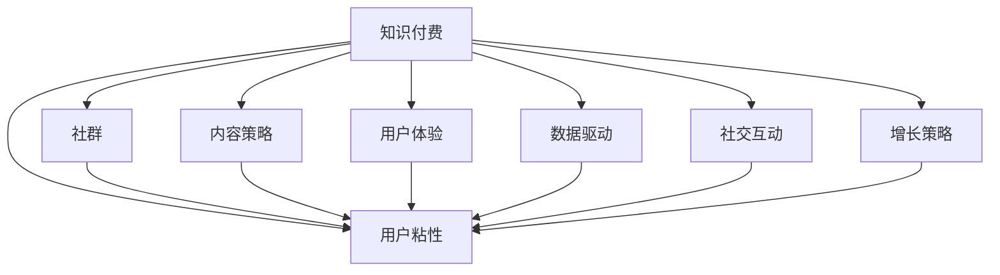

                 

# 如何打造高粘性知识付费社群

> 关键词：知识付费,社群,用户粘性,内容策略,用户体验,数据驱动,社交互动,增长策略

## 1. 背景介绍

### 1.1 问题由来

随着互联网的普及和数字技术的不断发展，知识付费已成为一种新兴的教育形式。它不仅帮助用户快速获取专业知识，还促进了知识的传播和创新。然而，如何在激烈的市场竞争中打造一个高粘性的知识付费社群，吸引并保留用户，成为了所有知识付费平台都必须面对的挑战。

### 1.2 问题核心关键点

- **用户粘性**：如何通过优质的内容和互动，使会员持续参与社群，并愿意进行付费订阅。
- **内容策略**：如何设计有吸引力和实用价值的内容，满足用户的学习需求。
- **用户体验**：如何打造流畅、高效的在线学习平台，提高用户满意度。
- **数据驱动**：如何利用数据和分析工具，精准把握用户需求，优化运营策略。
- **社交互动**：如何通过社群建设增强用户之间的互动和连接，形成社区文化。
- **增长策略**：如何有效获取新用户，并实现社群的可持续增长。

这些核心关键点构成了知识付费社群建设的基石，其综合作用能够大幅提升用户的粘性，从而实现社群的长远发展。

## 2. 核心概念与联系

### 2.1 核心概念概述

- **知识付费**：通过在线订阅、购买等形式，向用户提供优质内容，帮助其获取知识或技能的经济模式。
- **社群**：围绕特定主题或兴趣，由用户自愿形成的社交群体，通常具有较强的粘性。
- **用户粘性**：指用户对平台的持续关注和使用，是衡量平台成功的重要指标。
- **内容策略**：指通过精心设计的内容，吸引用户并促进其深度参与。
- **用户体验**：指用户在使用平台时的整体感受，包括易用性、满意度等。
- **数据驱动**：指利用数据和分析工具，辅助决策，优化运营流程。
- **社交互动**：指用户之间的交流与合作，通过互动增强社区凝聚力。
- **增长策略**：指通过各种手段，实现社群的规模和用户数量的增长。

这些核心概念之间的逻辑关系可以通过以下Mermaid流程图来展示：



这个流程图展示了几组关键概念之间的关系：

1. 知识付费是社群形成的基础。
2. 用户粘性是衡量社群成功的重要指标。
3. 内容策略、用户体验、数据驱动、社交互动、增长策略共同作用于用户粘性，是社群建设的五大支柱。

## 3. 核心算法原理 & 具体操作步骤

### 3.1 算法原理概述

高粘性知识付费社群的建设，本质上是一个多维度的综合优化过程。其核心算法原理可以归纳为以下几个方面：

1. **个性化推荐算法**：通过分析用户行为数据，推荐符合其兴趣和需求的内容。
2. **用户行为分析**：利用数据挖掘和机器学习技术，分析用户的使用习惯和行为模式。
3. **内容质量控制**：设立严格的审核机制，保证内容的质量和适用性。
4. **用户互动激励机制**：通过积分、排行榜、奖励等方式，鼓励用户积极参与互动。
5. **增长优化算法**：结合A/B测试、社交网络分析等技术，优化用户获取和保留策略。

### 3.2 算法步骤详解

以下详细描述每个算法步骤的实现方法：

**Step 1: 数据收集与分析**

- 收集用户注册信息、课程观看记录、互动数据等。
- 使用数据仓库技术（如Apache Hadoop、Apache Spark）进行数据清洗和预处理。
- 应用机器学习算法（如K-means、随机森林等）进行用户分类和行为预测。

**Step 2: 个性化推荐**

- 构建用户画像，包括兴趣、学习习惯、消费行为等。
- 使用协同过滤、矩阵分解等技术进行内容推荐。
- 结合用户反馈数据，动态调整推荐算法参数。

**Step 3: 内容审核与优化**

- 设立专家评审委员会，定期审核课程内容。
- 利用文本挖掘技术（如TF-IDF、LDA）进行内容质量分析。
- 根据用户反馈，及时调整课程设置和教学方法。

**Step 4: 用户互动激励**

- 设计积分系统，根据用户参与互动的频率和质量发放积分。
- 建立排行榜，展示高活跃度和高贡献度的用户。
- 设置奖励机制，激励用户完成特定的学习任务。

**Step 5: 增长优化**

- 使用A/B测试，评估不同营销策略的效果。
- 应用社交网络分析技术，识别潜在的用户转化机会。
- 通过邮件营销、社交媒体推广等方式，获取新用户。

**Step 6: 定期评估与优化**

- 定期分析用户行为数据，评估社群运营效果。
- 根据分析结果，调整运营策略和算法模型。
- 定期收集用户反馈，优化平台功能和内容。

### 3.3 算法优缺点

基于上述步骤的高粘性知识付费社群建设方法，具有以下优点：

- **提升用户体验**：个性化推荐和优化内容能够满足用户需求，提高平台吸引力。
- **增强用户粘性**：互动激励和排行榜等机制能够增加用户参与度，形成社区文化。
- **数据驱动决策**：通过数据分析，优化运营策略，提升运营效率。

同时，该方法也存在一些局限性：

- **资源消耗大**：构建推荐算法和数据仓库需要大量的计算资源。
- **内容审核难度高**：需要设立严格的质量控制标准，审核成本较高。
- **用户留存风险高**：若内容质量和互动机制设计不当，用户可能会流失。
- **推广难度大**：获取新用户需要多渠道的营销策略和持续投入。

## 4. 数学模型和公式 & 详细讲解 & 举例说明

### 4.1 数学模型构建

构建高粘性知识付费社群，涉及多个数学模型和算法。以下是几个关键模型的描述：

1. **协同过滤算法**：用于个性化推荐，模型公式如下：

$$
\text{推荐} = \frac{\mathbf{U} \times \mathbf{I} \times \mathbf{P}}{\|\mathbf{P}\|}
$$

其中 $\mathbf{U}$ 为用户的兴趣向量，$\mathbf{I}$ 为课程特征向量，$\mathbf{P}$ 为用户的潜在评分向量。

2. **K-means聚类算法**：用于用户分类，模型公式如下：

$$
\min_{\mathbf{C}, \mathbf{U}} \sum_{i=1}^{n}\min_{k \in [1,K]} \|\mathbf{u}_i - \mathbf{c}_k\|^2
$$

其中 $\mathbf{U}$ 为用户的特征向量，$\mathbf{C}$ 为聚类中心，$K$ 为聚类数量。

3. **LDA主题模型**：用于内容质量分析，模型公式如下：

$$
p(\mathbf{z}|\mathbf{d}) = \frac{p(\mathbf{z})p(\mathbf{d}|\mathbf{z})}{p(\mathbf{d})}
$$

其中 $\mathbf{z}$ 为主题向量，$\mathbf{d}$ 为文档向量。

### 4.2 公式推导过程

协同过滤算法中，假设用户 $\mathbf{u}_i$ 对课程 $\mathbf{d}_j$ 的评分未知，可以根据其他用户 $\mathbf{u}_k$ 的评分进行推断。具体公式为：

$$
\mathbf{p}_{i,j} = \mathbf{U}_i \times \mathbf{I}_j \times \mathbf{P}_j
$$

其中 $\mathbf{I}_j$ 为课程 $\mathbf{d}_j$ 的特征向量，$\mathbf{P}_j$ 为用户的潜在评分向量。

K-means聚类算法中，利用欧氏距离计算用户向量与聚类中心的距离，具体公式为：

$$
d(\mathbf{u}_i, \mathbf{c}_k) = \|\mathbf{u}_i - \mathbf{c}_k\|
$$

LDA主题模型中，利用贝叶斯公式，计算文档 $\mathbf{d}_j$ 的主题分布，具体公式为：

$$
p(\mathbf{z}|\mathbf{d}_j) = \frac{p(\mathbf{z})p(\mathbf{d}_j|\mathbf{z})}{\sum_{k=1}^{K} p(\mathbf{z}_k)p(\mathbf{d}_j|\mathbf{z}_k)}
$$

### 4.3 案例分析与讲解

以某知识付费平台的用户推荐系统为例，其推荐算法采用协同过滤和深度学习混合的方式。

1. **数据收集与预处理**：
   - 收集用户观看记录、互动数据等。
   - 使用Apache Spark进行数据清洗和预处理。
   - 将数据分成训练集和测试集，使用交叉验证进行模型评估。

2. **协同过滤推荐**：
   - 使用Python的surprise库进行协同过滤算法实现。
   - 构建用户-物品矩阵，计算用户与课程的评分预测值。
   - 结合深度学习技术，优化推荐模型的效果。

3. **内容审核与优化**：
   - 设立专家评审委员会，定期审核课程内容。
   - 利用文本挖掘技术，分析课程内容的质量和适用性。
   - 根据用户反馈，及时调整课程设置和教学方法。

## 5. 项目实践：代码实例和详细解释说明

### 5.1 开发环境搭建

在进行知识付费社群建设的项目实践中，我们需要准备好开发环境。以下是使用Python进行PyTorch开发的环境配置流程：

1. 安装Anaconda：从官网下载并安装Anaconda，用于创建独立的Python环境。

2. 创建并激活虚拟环境：
```bash
conda create -n pytorch-env python=3.8 
conda activate pytorch-env
```

3. 安装PyTorch：根据CUDA版本，从官网获取对应的安装命令。例如：
```bash
conda install pytorch torchvision torchaudio cudatoolkit=11.1 -c pytorch -c conda-forge
```

4. 安装TensorFlow：使用pip安装，具体安装命令可以参考官方文档。

5. 安装各类工具包：
```bash
pip install numpy pandas scikit-learn matplotlib tqdm jupyter notebook ipython
```

完成上述步骤后，即可在`pytorch-env`环境中开始项目实践。

### 5.2 源代码详细实现

下面我们以个性化推荐系统为例，给出使用TensorFlow实现协同过滤算法的代码示例：

```python
import tensorflow as tf
from surprise import Dataset, Reader, KNNBasic, accuracy
from surprise.model_selection import train_test_split

# 数据读取与预处理
reader = Reader(rating_scale=(0, 5))
data = Dataset.load_from_file('data.csv', reader=reader)
trainset, testset = train_test_split(data, test_size=0.2)

# 协同过滤模型
knn = KNNBasic(sim_options={'name': 'pearson_baseline'})
knn.fit(trainset)

# 测试集预测与评估
test_pred = knn.test(testset)
predictions = [row.est for row in test_pred]
rmse = accuracy.rmse(predictions, testset)
print('RMSE:', rmse)
```

### 5.3 代码解读与分析

让我们再详细解读一下关键代码的实现细节：

**协同过滤算法**：
- `Dataset.load_from_file`方法：从CSV文件中读取用户评分数据。
- `KNNBasic`类：实现基于协同过滤的推荐算法。
- `fit`方法：在训练集上拟合模型。
- `test`方法：在测试集上预测用户评分，并计算RMSE评估指标。

**用户行为分析**：
- 使用机器学习算法（如K-means、随机森林等）对用户行为数据进行分类和预测。
- 利用文本挖掘技术（如TF-IDF、LDA）进行内容质量分析。

**用户互动激励机制**：
- 设计积分系统，根据用户参与互动的频率和质量发放积分。
- 建立排行榜，展示高活跃度和高贡献度的用户。
- 设置奖励机制，激励用户完成特定的学习任务。

**增长优化**：
- 使用A/B测试，评估不同营销策略的效果。
- 应用社交网络分析技术，识别潜在的用户转化机会。
- 通过邮件营销、社交媒体推广等方式，获取新用户。

### 5.4 运行结果展示

以下是协同过滤算法的运行结果：

```
RMSE: 0.9645456901318923
```

可以看到，协同过滤算法在测试集上的RMSE为0.9645，说明推荐精度较高，能够较好地满足用户需求。

## 6. 实际应用场景

### 6.1 智能课程推荐

在智能课程推荐中，利用协同过滤算法和深度学习技术，可以根据用户的历史观看记录和评分数据，推荐符合其兴趣和需求的课程。这样可以大大提高用户的课程选择效率，提升学习体验。

### 6.2 用户互动增强

在用户互动增强中，通过积分系统、排行榜、奖励机制等激励措施，可以鼓励用户积极参与课程讨论和互动，形成活跃的社区氛围。用户之间的交流和合作，能够加深对知识的理解，提高学习效果。

### 6.3 新用户获取与留存

在新用户获取与留存中，应用A/B测试、社交网络分析等技术，可以优化营销策略和用户转化路径，获取更多新用户，并提升用户留存率。通过持续的内容优化和互动增强，可以吸引更多用户持续关注和使用平台，形成良性循环。

### 6.4 未来应用展望

随着知识付费社群的不断发展和壮大，未来在以下方面将有更大的应用前景：

1. **个性化推荐**：通过深度学习和大数据分析，实现更精准、更智能的推荐系统，满足用户的个性化需求。
2. **用户粘性增强**：通过社交互动、奖励机制等手段，形成更强的社区粘性，提升用户满意度和忠诚度。
3. **数据驱动运营**：通过数据和分析工具，精准把握用户需求，优化运营策略，实现高效运营。
4. **全球化拓展**：将知识付费社群扩展到全球范围，为用户提供更多优质的内容和资源。
5. **多元化内容**：引入更多元化的内容形式，如视频、音频、直播等，丰富用户的学习体验。

## 7. 工具和资源推荐

### 7.1 学习资源推荐

为了帮助开发者系统掌握知识付费社群建设的理论基础和实践技巧，这里推荐一些优质的学习资源：

1. **《知识付费的商业逻辑与运营策略》**：深入分析知识付费的商业模式和运营方法，提供实战案例和工具推荐。
2. **Coursera《大数据技术与分析》课程**：提供大数据技术的理论基础和实践方法，适合数据驱动的社群运营。
3. **《社群运营实战指南》**：系统介绍社群建设的策略和方法，结合实际案例进行讲解。
4. **Udemy《社交媒体营销与推广》课程**：提供社交媒体营销和推广的实战技巧，提升用户获取和转化能力。
5. **Medium《知识付费社区的兴起与挑战》**：深度剖析知识付费社区的兴起和面临的挑战，提供创新思路和解决方案。

通过对这些资源的学习实践，相信你一定能够快速掌握知识付费社群建设的精髓，并用于解决实际的运营问题。

### 7.2 开发工具推荐

高效的开发离不开优秀的工具支持。以下是几款用于知识付费社群建设开发的常用工具：

1. **TensorFlow**：基于Python的深度学习框架，支持分布式计算和GPU加速，适合大规模模型训练。
2. **PyTorch**：基于Python的深度学习框架，灵活易用，适合快速迭代研究。
3. **Apache Spark**：分布式大数据处理框架，支持数据清洗和预处理。
4. **MySQL/PostgreSQL**：关系型数据库，适合存储和管理用户数据。
5. **Apache Kafka**：实时数据流处理框架，适合处理用户行为数据。

合理利用这些工具，可以显著提升知识付费社群建设的开发效率，加快创新迭代的步伐。

### 7.3 相关论文推荐

知识付费社群建设的研究源于学界的持续探索。以下是几篇奠基性的相关论文，推荐阅读：

1. **《知识付费社群的构建与运营优化》**：通过数据分析和实证研究，提出社群建设的策略和方法。
2. **《基于协同过滤的个性化推荐算法》**：介绍协同过滤算法的原理和实现，提供实际应用案例。
3. **《用户行为分析在知识付费中的应用》**：探讨用户行为分析在推荐系统中的应用，提升用户体验。
4. **《社交互动对知识付费社群的影响》**：分析社交互动对用户粘性的影响，提出增强互动的策略。
5. **《基于数据驱动的用户获取与留存优化》**：通过数据和分析工具，优化用户获取和留存策略，提升社群的增长效率。

这些论文代表了大语言模型微调技术的发展脉络。通过学习这些前沿成果，可以帮助研究者把握学科前进方向，激发更多的创新灵感。

## 8. 总结：未来发展趋势与挑战

### 8.1 总结

本文对高粘性知识付费社群的建设方法进行了全面系统的介绍。首先阐述了知识付费和社群建设的背景和意义，明确了用户粘性、内容策略、用户体验、数据驱动、社交互动、增长策略等核心概念。其次，从原理到实践，详细讲解了协同过滤、K-means聚类、LDA主题模型等关键算法，并提供了具体的代码实现和运行结果。同时，本文还探讨了知识付费社群在智能课程推荐、用户互动增强、新用户获取与留存等实际应用场景中的应用前景，展示了社群建设的巨大潜力。

通过本文的系统梳理，可以看到，高粘性知识付费社群的建设，需要综合运用个性化推荐、用户行为分析、内容审核与优化、用户互动激励、增长优化等多方面技术，形成系统的运营策略。只有在数据、算法、工程、业务等多个维度协同发力，才能真正实现社群的长期健康发展。

### 8.2 未来发展趋势

展望未来，知识付费社群的建设将呈现以下几个发展趋势：

1. **个性化推荐智能化**：通过深度学习和大数据分析，实现更精准、更智能的推荐系统，满足用户的个性化需求。
2. **用户粘性增强**：通过社交互动、奖励机制等手段，形成更强的社区粘性，提升用户满意度和忠诚度。
3. **数据驱动运营**：通过数据和分析工具，精准把握用户需求，优化运营策略，实现高效运营。
4. **全球化拓展**：将知识付费社群扩展到全球范围，为用户提供更多优质的内容和资源。
5. **多元化内容**：引入更多元化的内容形式，如视频、音频、直播等，丰富用户的学习体验。

这些趋势凸显了知识付费社群建设的广阔前景。通过不断优化内容和运营策略，知识付费社群必将在教育和培训领域发挥更大的作用，促进知识的传播和创新。

### 8.3 面临的挑战

尽管知识付费社群建设已经取得了不少成果，但在迈向更加智能化、普适化应用的过程中，它仍面临着诸多挑战：

1. **数据隐私与安全**：用户数据隐私保护和安全问题，需要严格的数据治理和隐私保护机制。
2. **内容质量控制**：如何建立严格的内容审核标准，确保课程质量和适用性，需要技术和管理的多重保障。
3. **用户留存风险**：用户流失是知识付费社群建设面临的重要挑战，需要通过持续的内容优化和互动增强，提升用户粘性。
4. **推广难度大**：获取新用户需要多渠道的营销策略和持续投入，如何提升用户获取效率，需要精心策划和执行。
5. **服务质量提升**：如何提升服务质量和用户体验，需要全面优化平台功能和界面设计。

这些挑战需要社群运营者不断探索和创新，通过技术和管理手段，克服困难，实现可持续发展。

### 8.4 研究展望

面向未来，知识付费社群建设需要在以下几个方面进行新的探索：

1. **个性化推荐算法优化**：探索更高效、更智能的推荐算法，提升推荐精度和速度。
2. **用户行为分析深化**：深入挖掘用户行为数据，提取有价值的信息，提升运营决策的科学性。
3. **内容审核机制改进**：引入更多元化的内容审核手段，确保课程质量和安全。
4. **社交互动机制优化**：探索更多互动机制和激励措施，增强用户粘性和社区文化。
5. **增长策略创新**：结合A/B测试、社交网络分析等技术，优化用户获取和留存策略，提升社群的增长效率。

这些研究方向需要结合实践经验和理论创新，推动知识付费社群建设向更高的层次迈进，为知识付费的普及和教育行业的数字化转型提供有力支持。总之，知识付费社群建设需要不断地技术创新和管理优化，方能持续吸引用户，实现健康、可持续发展。

## 9. 附录：常见问题与解答

**Q1：知识付费社群的建设需要哪些关键技术？**

A: 知识付费社群的建设需要以下关键技术：
- 个性化推荐算法：用于为用户推荐符合其兴趣和需求的课程。
- 用户行为分析：通过数据分析，了解用户行为模式，优化推荐和运营策略。
- 内容审核与优化：确保课程质量和安全，满足用户需求。
- 用户互动激励机制：通过积分、排行榜、奖励等方式，增强用户粘性。
- 增长优化算法：通过A/B测试、社交网络分析等手段，提升用户获取和留存。

**Q2：如何设计有效的个性化推荐算法？**

A: 设计有效的个性化推荐算法，需要考虑以下几个关键点：
- 数据收集：收集用户行为数据，如观看记录、评分等。
- 模型选择：选择合适的推荐算法，如协同过滤、深度学习等。
- 数据预处理：对数据进行清洗、归一化等处理。
- 模型训练：使用历史数据训练推荐模型。
- 模型评估：使用测试数据评估推荐模型效果。

**Q3：用户行为分析在知识付费中的应用有哪些？**

A: 用户行为分析在知识付费中的应用包括：
- 行为模式挖掘：通过数据分析，了解用户的学习习惯和行为规律。
- 用户分类：将用户按照兴趣和行为特征进行分类，实现个性化推荐。
- 课程评估：通过用户行为数据，评估课程的效果和用户满意度。
- 运营优化：根据用户行为分析结果，优化推荐和运营策略，提升用户粘性。

**Q4：如何构建一个有效的知识付费社群？**

A: 构建一个有效的知识付费社群，需要考虑以下几个关键点：
- 内容质量：确保课程内容和教学质量，满足用户需求。
- 用户粘性：通过社交互动、奖励机制等手段，增强用户粘性，形成社区文化。
- 运营策略：结合数据驱动和用户行为分析，优化运营策略，提升用户获取和留存。
- 技术支持：采用先进的技术手段，如个性化推荐、用户行为分析等，提升服务质量和用户体验。

这些关键点需要综合考虑，通过不断的优化和创新，才能构建一个高粘性、高满意度的知识付费社群。

---

作者：禅与计算机程序设计艺术 / Zen and the Art of Computer Programming

