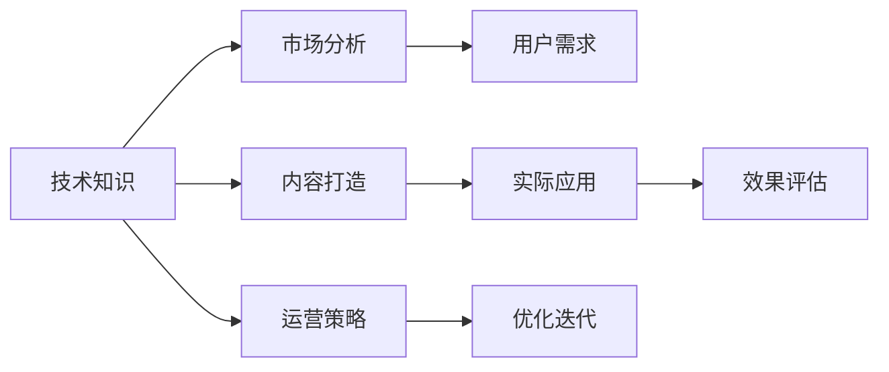

                 

# 如何打造高质量的技术知识付费内容

> 关键词：知识付费,技术内容,内容打造,市场分析,运营策略,用户需求

## 1. 背景介绍

### 1.1 问题由来
随着互联网的普及和信息技术的飞速发展，人们获取信息的渠道日益多样化，知识付费市场逐渐崛起。技术类知识付费内容凭借其专业性和实用性，赢得了大量用户的青睐。然而，目前市场上的技术内容质量参差不齐，过度炒作现象严重，用户购买体验差。如何打造高质量的技术知识付费内容，成为业内人士关注的焦点。

### 1.2 问题核心关键点
高质量的技术知识付费内容，其核心关键点在于内容的实用性、深入性和可操作性。这些内容应紧跟技术发展前沿，结合实际应用场景，使读者能够在实践中真正受益。此外，高质量内容应具备良好的结构框架和丰富的案例分析，帮助读者理解原理、掌握技巧，并灵活应用到具体项目中。

## 2. 核心概念与联系

### 2.1 核心概念概述

在技术知识付费内容创作过程中，涉及多个关键概念，其相互联系如下图所示：



- 技术知识：指具体领域的核心技术、原理和应用实践。
- 内容打造：将技术知识转化为易于理解、操作性强的内容形式。
- 市场分析：了解目标市场的需求、趋势和竞争情况。
- 用户需求：分析用户痛点、兴趣点，明确内容的价值点。
- 运营策略：制定内容推广、销售和用户服务的策略。
- 实际应用：将内容应用于实际项目中，验证其效果和实用性。
- 效果评估：通过反馈和数据分析，评估内容的质量和用户满意度。
- 优化迭代：根据反馈和数据分析，持续改进内容，提升用户价值。

这些概念共同构成了高质量技术知识付费内容的创作流程，从技术知识出发，经过内容打造、市场分析、用户需求分析和运营策略制定，最终应用于实际项目，并根据效果评估和反馈不断优化迭代。

## 3. 核心算法原理 & 具体操作步骤
### 3.1 算法原理概述

高质量技术知识付费内容的打造，是一个多目标优化的过程。其核心在于内容价值的最大化，即在技术知识的基础上，通过内容打造、市场分析、用户需求分析和运营策略制定，使内容能够高效传递给用户，并在实际应用中产生积极影响。

### 3.2 算法步骤详解

1. **技术知识收集与整理**
   - 从学术研究、技术论坛、技术博客、专业书籍等渠道收集相关技术知识。
   - 整理分类，提炼核心内容，去除过时或无关信息。

2. **内容打造与呈现**
   - 将技术知识转化为易于理解、操作性强的形式，如教程、案例、实战项目等。
   - 编写高质量的文档和代码示例，提供详细的步骤说明。
   - 采用多媒体形式，如视频、音频、图表等，增强内容吸引力。

3. **市场分析与定位**
   - 通过市场调研、用户反馈、竞争对手分析等手段，了解目标市场和用户需求。
   - 确定内容的目标用户群体，明确内容的市场定位和价值主张。

4. **用户需求分析**
   - 分析目标用户的需求、痛点和兴趣点，确定内容的关键价值点。
   - 通过问卷调查、用户访谈等方式，获取用户反馈，持续优化内容。

5. **运营策略制定**
   - 制定内容推广策略，选择合适的渠道和平台，提升内容的曝光率和用户参与度。
   - 制定销售策略，设计合理的定价和购买方式，吸引用户订阅和付费。
   - 制定用户服务策略，提供优质的客服和技术支持，提升用户满意度。

6. **实际应用与效果评估**
   - 将内容应用于实际项目中，验证其效果和实用性。
   - 通过用户反馈、内容阅读量、课程评分等数据，评估内容的价值和用户满意度。
   - 根据评估结果，调整和优化内容，提升用户体验。

### 3.3 算法优缺点

高质量技术知识付费内容的打造，具有以下优点：
- 紧跟技术发展前沿，用户能够及时获取最新的技术信息。
- 通过内容打造和案例分析，使技术知识易于理解和操作。
- 根据用户需求和市场分析，提升内容的用户价值。

同时，该方法也存在以下缺点：
- 需要投入大量时间和精力进行市场调研和内容打造。
- 内容更新频率要求高，需要持续优化和迭代。
- 存在一定的市场风险，内容质量和用户反馈不理想时可能导致亏损。

尽管存在这些局限性，但高质量内容对于技术类知识付费市场的重要性不言而喻。未来，随着技术知识付费市场的持续发展，不断优化和提升内容质量将是关键。

### 3.4 算法应用领域

高质量技术知识付费内容，主要应用于以下领域：

- 软件开发：如Java、Python、前端开发、后端开发等。
- 数据科学：如机器学习、大数据、数据可视化等。
- 网络安全：如渗透测试、漏洞分析、安全防护等。
- 人工智能：如深度学习、自然语言处理、计算机视觉等。
- 物联网：如智能家居、工业物联网、车联网等。

这些领域的技术内容需求量大、更新快，通过高质量的知识付费内容，用户能够快速掌握相关技术，提升工作和学习效率。

## 4. 数学模型和公式 & 详细讲解 & 举例说明

### 4.1 数学模型构建

假设技术知识内容为 $X$，市场分析为 $M$，用户需求为 $D$，运营策略为 $S$，实际应用效果为 $A$。高质量内容打造的数学模型为：

$$ C = f(X, M, D, S, A) $$

其中，$C$ 表示内容价值，$f$ 为映射函数。

### 4.2 公式推导过程

1. **技术知识** $X$
   - 技术知识包括核心概念、算法原理、应用实践等。
   - 例如，Java编程语言的内容，包含类、接口、继承、多态等核心概念，以及面向对象编程的基本原理和Java标准库的应用实践。

2. **市场分析** $M$
   - 市场分析包括目标市场、竞争对手、用户需求等。
   - 例如，Java编程语言的市场分析，关注Java在企业级开发、Web开发、安卓开发等领域的受欢迎程度，以及与Python、C#等竞争对手的比较。

3. **用户需求** $D$
   - 用户需求包括用户痛点、兴趣点、期望值等。
   - 例如，Java编程语言的用户需求，关注初学者快速上手、企业开发人员提高效率、开发架构师设计复杂系统等不同层次的需求。

4. **运营策略** $S$
   - 运营策略包括推广、销售、用户服务等。
   - 例如，Java编程语言的内容运营策略，关注通过YouTube视频、博客、社区论坛等渠道推广，以及提供在线课程、技术支持等服务。

5. **实际应用** $A$
   - 实际应用包括内容在实际项目中的应用效果和用户反馈。
   - 例如，Java编程语言的内容应用，关注用户是否能够通过学习内容成功开发一个Java应用程序，并反馈内容的质量和实用性。

### 4.3 案例分析与讲解

以下以一个具体的技术内容案例来分析：

**案例：Python数据科学教程**

1. **技术知识** $X$
   - 内容覆盖Python基础语法、数据处理、数据分析、机器学习等核心概念。

2. **市场分析** $M$
   - 数据科学领域在金融、医疗、零售、互联网等领域有广泛应用，需求量大。

3. **用户需求** $D$
   - 用户分为初学者、中级开发者、高级开发者三个层次，分别关注基础语法、数据处理、机器学习算法等不同内容。

4. **运营策略** $S$
   - 通过Kaggle竞赛、GitHub项目、技术博客等渠道推广。
   - 提供基础课程、实战项目、技术支持等服务。

5. **实际应用** $A$
   - 用户反馈：初学者能够快速上手，中级开发者能够掌握数据处理和机器学习技能，高级开发者能够应用到实际项目中。

## 5. 项目实践：代码实例和详细解释说明
### 5.1 开发环境搭建

为了创建高质量的技术知识付费内容，需要进行系统的开发环境搭建。以下是一些必要的工具和资源：

1. **开发工具**
   - 代码编辑器：如Visual Studio Code、Atom等。
   - 版本控制系统：如Git、SVN等。
   - 代码托管平台：如GitHub、GitLab等。

2. **内容管理系统**
   - 用于创建和发布内容，如WordPress、Joomla等。
   - 用于发布代码和文档，如Jekyll、GitHub Pages等。

3. **在线学习平台**
   - 用于发布和推广课程，如Udemy、Coursera等。

4. **数据分析工具**
   - 用于评估内容效果和用户反馈，如Google Analytics、Mixpanel等。

### 5.2 源代码详细实现

以下是一个具体的技术内容代码实现示例，以Python数据科学教程为例：

1. **代码编辑器**
   - 使用Visual Studio Code创建项目文件夹，编写代码文件。

```python
import pandas as pd
import numpy as np
import matplotlib.pyplot as plt

# 读取数据集
data = pd.read_csv('data.csv')

# 数据处理
data['age'] = data['age'].astype(int)
data = data[data['age'] >= 18]

# 数据可视化
plt.hist(data['age'], bins=20)
plt.xlabel('Age')
plt.ylabel('Frequency')
plt.title('Distribution of Ages')
plt.show()
```

2. **代码托管平台**
   - 将代码上传到GitHub仓库，设置仓库权限，协作开发。

3. **内容管理系统**
   - 使用Jekyll创建博客，发布Python代码和数据科学教程。

```yaml
name: myblog
content: |
  ---
  title: 'Python Data Science Tutorial'
  author: 'John Doe'
  date: '2021-07-01'
  ---

  <h1>Python Data Science Tutorial</h1>
  <p>Learn Python data science with this tutorial.</p>
  <ul>
    <li>Importing Data</li>
    <li>Exploratory Data Analysis</li>
    <li>Visualizing Data</li>
    <li>Machine Learning</li>
  </ul>
  <p><a href="#Importing-Data">Importing Data</a></p>
  <h2 id="Importing-Data">Importing Data</h2>
  <p>Import the necessary libraries and read the data into a Pandas DataFrame.</p>
  <code class="language-python">
    import pandas as pd
    data = pd.read_csv('data.csv')
  </code>
  <p><a href="#Exploratory-Data-Analysis">Exploratory Data Analysis</a></p>
  <h2 id="Exploratory-Data-Analysis">Exploratory Data Analysis</h2>
  <p>Perform exploratory data analysis on the dataset.</p>
  <code class="language-python">
    data.info()
    data.describe()
  </code>
  <p><a href="#Visualizing-Data">Visualizing Data</a></p>
  <h2 id="Visualizing-Data">Visualizing Data</h2>
  <p>Create visualizations using Matplotlib and Seaborn.</p>
  <code class="language-python">
    import matplotlib.pyplot as plt
    import seaborn as sns
    plt.hist(data['age'], bins=20)
    sns.barplot(x='gender', y='income', data=data)
  </code>
  <p><a href="#Machine-Learning">Machine Learning</a></p>
  <h2 id="Machine-Learning">Machine Learning</h2>
  <p>Train a machine learning model using scikit-learn.</p>
  <code class="language-python">
    from sklearn.linear_model import LinearRegression
    model = LinearRegression()
    model.fit(data[['age', 'income']], data['income'])
  </code>
```

### 5.3 代码解读与分析

**代码编辑器**
- 使用Visual Studio Code编写代码，设置快捷键和自动化工具，提升开发效率。
- 使用Git进行版本控制，保证代码的历史记录和多人协作。

**代码托管平台**
- 将代码上传到GitHub仓库，利用Git分支和pull request功能，方便代码审查和版本管理。

**内容管理系统**
- 使用Jekyll创建静态博客，使用Markdown语法编写博客内容，发布到GitHub Pages上。
- 通过Jekyll插件，将代码高亮显示，提升用户体验。

### 5.4 运行结果展示

**代码编辑器**
- 代码运行后，在浏览器中查看代码执行结果，实时查看数据处理和分析结果。

**代码托管平台**
- 代码仓库中的分支和pull request功能，方便团队协作开发和代码审查。

**内容管理系统**
- 博客内容发布后，可以通过GitHub Pages查看博客效果，收集用户反馈，进行内容优化。

## 6. 实际应用场景
### 6.1 技术培训课程

高质量技术内容，在技术培训课程中应用广泛。企业可以通过购买技术付费内容，进行内部培训，提升员工的技术水平和工作效率。例如，Google提供的技术培训课程，涵盖了机器学习、数据分析、云平台等多个领域。

### 6.2 在线技术社区

技术社区可以提供高质量的技术内容，供用户学习和交流。如Stack Overflow、GitHub等平台，通过技术问答、代码示例、项目分享等形式，提供丰富的技术资源，帮助用户解决实际问题。

### 6.3 技术博客和博客平台

技术博客和博客平台，可以发布高质量的技术文章和代码示例，分享技术经验，提升个人品牌和影响力。如Medium、CSDN等平台，汇聚了大量技术作者，用户可以通过阅读博客内容，学习新技术和实践经验。

### 6.4 技术咨询服务

技术咨询服务，可以通过高质量的技术内容，为客户提供专业化的技术支持。如技术咨询公司、技术博客作者等，通过发布深度技术文章和案例分析，帮助客户解决技术难题，提升业务效率。

## 7. 工具和资源推荐
### 7.1 学习资源推荐

为了帮助开发者系统掌握高质量技术内容创作的方法，这里推荐一些优质的学习资源：

1. **《技术写作的艺术》（The Art of Technical Writing）**
   - 详细介绍了技术内容创作的方法和技巧，包括内容结构、写作风格、用户体验等。

2. **《内容策略：如何将内容转化为价值》（Content Strategy: A Practical Approach）**
   - 介绍了内容策略的定义、方法和工具，帮助创作者制定内容战略。

3. **《内容营销精要》（Content Marketing: The Definitive Guide）**
   - 提供了内容营销的策略、技巧和案例，帮助创作者提升内容影响力。

4. **《学习如何学习》（Learning How to Learn）**
   - 介绍了学习方法、认知心理学和神经科学，帮助创作者提高学习效率。

5. **《技术内容创作：从零到一》（Technical Content Creation: From Zero to One）**
   - 提供了技术内容创作的工具、技巧和实践案例，帮助创作者提升技术内容质量。

### 7.2 开发工具推荐

高效的内容创作离不开优秀的工具支持。以下是几款用于内容创作和管理的常用工具：

1. **Jekyll**
   - 一个开源的静态网站生成器，适合创建高质量的博客和文档。

2. **Medium**
   - 一个集成的内容创作平台，提供了写作工具、社区讨论和流量曝光等功能。

3. **Grammarly**
   - 一个自动语法检查工具，帮助创作者提升文章质量和可读性。

4. **GitHub Pages**
   - 一个免费的静态网站托管服务，适合发布博客和技术文档。

5. **Trello**
   - 一个项目管理工具，帮助创作者规划内容创作流程和进度。

### 7.3 相关论文推荐

高质量技术内容创作的研究，涵盖多个领域，以下是几篇代表性的论文，推荐阅读：

1. **《内容创作与策略》（Content Creation and Strategy）**
   - 介绍了内容创作和策略制定的方法，提供了一个全面的框架。

2. **《技术内容创作：方法与实践》（Technical Content Creation: Method and Practice）**
   - 提供了技术内容创作的实践案例和技巧，帮助创作者提升内容质量。

3. **《技术内容策略与优化》（Technical Content Strategy and Optimization）**
   - 介绍了技术内容策略的定义、方法和工具，提供了一个具体的优化方法。

## 8. 总结：未来发展趋势与挑战
### 8.1 研究成果总结

高质量技术内容创作，是一个不断迭代和优化的过程。目前，已有许多成功案例，如Google的培训课程、Stack Overflow的技术问答、Medium的技术博客等，通过持续的内容优化和创新，吸引了大量用户，提升了技术水平和工作效率。

### 8.2 未来发展趋势

未来，高质量技术内容创作将呈现以下几个趋势：

1. **内容质量提升**
   - 通过系统化的方法和工具，提升内容的质量和可操作性，确保用户能够快速理解和应用。

2. **内容形式多样化**
   - 采用视频、音频、互动式内容等多种形式，提升用户的学习体验和参与度。

3. **内容互动化**
   - 通过在线问答、社区讨论等方式，增强用户与内容的互动，提升用户满意度。

4. **内容定制化**
   - 根据用户需求和反馈，定制化内容，满足用户个性化的学习需求。

5. **内容实时化**
   - 通过持续的内容更新和迭代，保持内容的时效性和实用性，提升用户价值。

### 8.3 面临的挑战

高质量技术内容创作，仍面临诸多挑战：

1. **内容生产成本高**
   - 高质量内容的创作需要投入大量时间和精力，包括调研、写作、编辑等环节，成本较高。

2. **市场竞争激烈**
   - 技术内容市场竞争激烈，如何打造具有差异化和竞争力的内容，是一个重要挑战。

3. **用户需求多样化**
   - 不同用户群体对技术内容的需求各异，如何满足不同层次用户的需求，是一个复杂问题。

4. **内容质量控制**
   - 高质量内容的创作需要严格的审核和质量控制，确保内容的质量和实用性。

5. **内容更新频率**
   - 技术领域更新快，需要持续更新内容，保持其时效性和实用性。

### 8.4 研究展望

未来的高质量技术内容创作，需要在以下几个方面进行深入研究和探索：

1. **内容自动化生产**
   - 利用人工智能和自然语言处理技术，自动化生成高质量的技术内容。

2. **内容智能推荐**
   - 利用机器学习和推荐算法，智能推荐高质量的技术内容，提升用户获取内容的效率。

3. **内容多渠道分发**
   - 通过多种渠道分发内容，提升内容的曝光率和用户覆盖面。

4. **内容质量评估**
   - 建立科学的内容质量评估体系，确保内容的实用性和价值。

5. **内容用户反馈**
   - 收集用户反馈，进行持续的内容优化和改进，提升用户满意度和忠诚度。

## 9. 附录：常见问题与解答

**Q1: 如何确保内容的质量？**

A: 高质量内容需经过多轮审核和质量控制，包括内容结构、写作风格、实用性等多个维度。创作者可采用同行评审、用户反馈等方式，持续优化和改进内容。

**Q2: 内容创作的成本如何控制？**

A: 可采用内容模板和自动化工具，提升内容创作的效率和质量，降低成本。同时，合理利用开源社区的资源，共享高质量的内容素材。

**Q3: 如何提升内容的互动性？**

A: 可采用在线问答、社区讨论等方式，增强用户与内容的互动。同时，利用社交媒体平台，扩大内容的传播范围，提升用户的参与度。

**Q4: 如何平衡内容的广度和深度？**

A: 根据目标用户的需求和层次，合理平衡内容的广度和深度。初级用户需要广度，了解基础知识；高级用户需要深度，掌握高级技能。

**Q5: 如何持续提升内容的价值？**

A: 通过持续的内容更新和迭代，保持内容的时效性和实用性。收集用户反馈，进行内容优化和改进，提升用户价值。

---

作者：禅与计算机程序设计艺术 / Zen and the Art of Computer Programming

