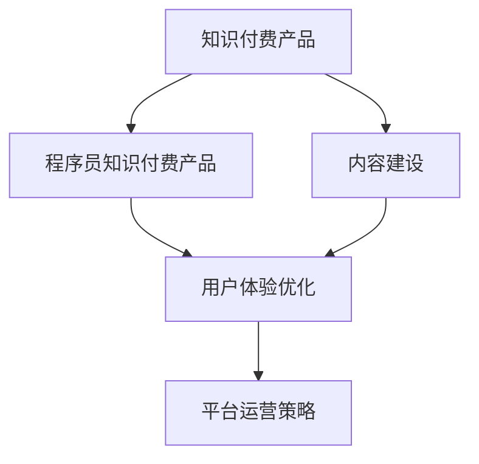
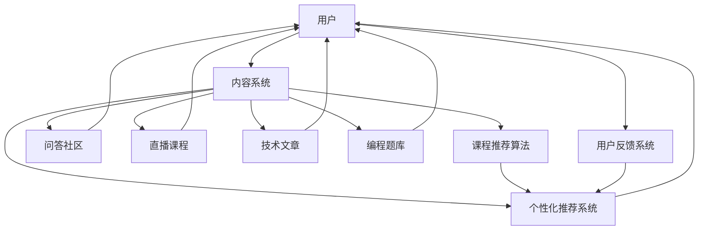

                 

# 如何打造高质量的程序员知识付费产品

## 1. 背景介绍

### 1.1 问题由来

随着互联网和移动通信技术的快速发展，知识付费模式已成为快速普及和广泛接受的新型教育方式。在IT领域，程序员知识付费产品更是随着技术栈的不断更新迭代，逐渐成为一种重要的知识传播和分享渠道。然而，质量参差不齐、内容同质化、用户体验欠佳等问题，导致许多知识付费产品未能取得良好的市场反馈和用户粘性。

针对以上问题，本文将探讨如何打造高质量的程序员知识付费产品，聚焦于内容建设、用户体验优化、平台运营策略等关键环节，提出系统性的策略和方法。

## 2. 核心概念与联系

### 2.1 核心概念概述

为更好地理解程序员知识付费产品的打造过程，本节将介绍几个密切相关的核心概念：

- 知识付费产品：以知识付费为商业模式，通过平台向用户提供高质量技术知识的学习服务，如课程、文章、问答、直播等。
- 程序员知识付费产品：专门针对IT程序员的知识付费产品，提供与编程语言、开发框架、技术架构、项目开发等相关的技术知识和实践经验。
- 内容建设：构建高质量的内容体系，是知识付费产品吸引用户、实现价值传递的核心。
- 用户体验优化：提升产品使用便捷性和交互性，使用户有更好的学习体验。
- 平台运营策略：通过有效的运营策略提升平台流量、提高用户留存率，实现商业变现。

这些核心概念之间的逻辑关系可以通过以下Mermaid流程图来展示：



### 2.2 核心概念原理和架构的 Mermaid 流程图



这个流程图展示了大语言模型的核心概念及其之间的关系：

1. 用户是知识付费产品的主要服务对象，所有内容系统都围绕用户需求进行构建。
2. 内容系统包括课程推荐算法、个性化推荐系统、问答社区、直播课程、技术文章、编程题库等多个子系统，共同构成知识传递的核心。
3. 推荐系统、问答社区、直播课程、技术文章、编程题库等多个模块，都能够从内容系统中获取数据进行交互，最终服务于用户。
4. 用户反馈系统能够及时获取用户对内容的评价和反馈，并根据反馈调整内容推荐策略和优化用户体验。

## 3. 核心算法原理 & 具体操作步骤

### 3.1 算法原理概述

打造高质量的程序员知识付费产品，核心在于构建和优化内容系统，提升用户体验，并通过有效的运营策略实现商业变现。

基于以上目标，本文将从内容推荐、个性化推荐、用户行为分析等角度，探讨如何构建高效、智能、灵活的内容体系。

### 3.2 算法步骤详解

#### 3.2.1 内容建设
内容建设是知识付费产品的基础。以下是构建高质量内容体系的详细步骤：

1. **定位目标用户群体**：
   - 对目标用户进行市场调研，分析其需求和痛点，确定知识付费产品的方向。
   - 例如，对于初级开发者，内容应涵盖基础知识、实战项目、编程基础等；对于中级开发者，内容则需包括进阶技术、算法与数据结构、架构设计等。

2. **确定课程结构**：
   - 设计课程的层次结构，包括基础、进阶、高阶等多个层次。
   - 各层次课程之间需有合理的衔接和进阶关系，保证学习路径的连贯性和完整性。

3. **整合课程资源**：
   - 筛选和整合优质课程资源，确保内容的系统性和权威性。
   - 课程资源应涵盖视频、PPT、代码示例、习题等多种形式。

4. **邀请专家讲师**：
   - 寻找并邀请行业内的专家和资深开发者作为讲师，确保课程内容的深度和专业性。
   - 通过构建讲师团，不仅丰富课程资源，还能通过讲师的社交效应提升课程影响力。

5. **开发课程评价系统**：
   - 开发课程评价系统，收集用户对课程的评价反馈，及时调整课程内容和教学方法。
   - 评价系统应包括课程质量、讲师讲授效果、课程实用价值等多维度的评价指标。

#### 3.2.2 内容推荐
内容推荐是知识付费产品的核心功能之一，其目标是提高用户的使用效率和满意度。以下是实现高效内容推荐的步骤：

1. **用户画像构建**：
   - 通过问卷调查、行为数据分析等方法，构建用户画像。
   - 用户画像应包括用户兴趣、学习进度、职业背景等关键信息。

2. **内容标签和特征提取**：
   - 为每门课程和每个知识点打上标签，形成内容库。
   - 提取课程的特征，如难度、时长、讲师资质等，供推荐系统使用。

3. **推荐算法设计**：
   - 设计推荐算法，包括协同过滤、基于内容的推荐、混合推荐等。
   - 推荐算法应考虑个性化、多样性、实时性等多方面的需求，以提升推荐效果。

4. **推荐系统优化**：
   - 定期更新和优化推荐模型，确保推荐结果的准确性和时效性。
   - 引入用户反馈，动态调整推荐策略，提升用户体验。

#### 3.2.3 个性化推荐
个性化推荐是知识付费产品的重要功能，其目标是提升用户粘性和满意度。以下是实现个性化推荐的详细步骤：

1. **行为数据分析**：
   - 收集和分析用户的行为数据，如浏览记录、观看时长、互动频率等。
   - 通过数据挖掘和机器学习技术，发现用户的行为模式和偏好。

2. **推荐模型训练**：
   - 利用行为数据分析结果，训练个性化推荐模型，生成个性化的课程推荐列表。
   - 推荐模型应采用深度学习、强化学习等算法，提高推荐精度。

3. **推荐结果展示**：
   - 设计个性化的推荐界面，展示推荐课程列表。
   - 推荐界面应简洁直观，便于用户快速浏览和选择。

#### 3.2.4 用户行为分析
用户行为分析是知识付费产品的关键功能之一，其目标是优化用户体验和提升用户粘性。以下是实现用户行为分析的步骤：

1. **数据采集**：
   - 通过日志、互动数据等方式，采集用户的行为数据。
   - 数据采集应覆盖用户使用产品的各个环节，如课程浏览、学习进度、互动交流等。

2. **数据处理**：
   - 对采集的数据进行清洗、去重、分类等处理，确保数据质量。
   - 使用数据挖掘和机器学习技术，提取用户的行为特征和模式。

3. **行为分析**：
   - 分析用户的行为数据，了解用户的学习进度、兴趣偏好等。
   - 通过行为分析，优化课程推荐、课程设计、内容布局等，提升用户体验。

### 3.3 算法优缺点

#### 3.3.1 优点
1. **提升内容利用率**：通过个性化推荐和内容推荐，提高用户对内容的使用效率和满意度，降低流失率。
2. **降低用户获取成本**：推荐系统帮助用户快速找到感兴趣的内容，降低其查找和筛选的难度和时间。
3. **提升用户粘性**：个性化推荐和行为分析功能，使用户能够更深入地使用知识付费产品，提高用户粘性。

#### 3.3.2 缺点
1. **数据隐私问题**：需要收集大量的用户行为数据，可能涉及隐私问题。
2. **算法复杂度高**：推荐系统、个性化推荐等算法涉及复杂的机器学习模型，开发和优化难度较大。
3. **推荐效果依赖数据质量**：推荐效果依赖于用户数据的完整性和准确性，数据采集和处理过程中可能会出现误差。

### 3.4 算法应用领域

#### 3.4.1 课程推荐系统
课程推荐系统是知识付费产品的核心功能之一，其目标是提高用户对课程的使用效率和满意度。以下是课程推荐系统的详细步骤：

1. **用户画像构建**：
   - 通过问卷调查、行为数据分析等方法，构建用户画像。
   - 用户画像应包括用户兴趣、学习进度、职业背景等关键信息。

2. **内容标签和特征提取**：
   - 为每门课程和每个知识点打上标签，形成内容库。
   - 提取课程的特征，如难度、时长、讲师资质等，供推荐系统使用。

3. **推荐算法设计**：
   - 设计推荐算法，包括协同过滤、基于内容的推荐、混合推荐等。
   - 推荐算法应考虑个性化、多样性、实时性等多方面的需求，以提升推荐效果。

4. **推荐系统优化**：
   - 定期更新和优化推荐模型，确保推荐结果的准确性和时效性。
   - 引入用户反馈，动态调整推荐策略，提升用户体验。

## 4. 数学模型和公式 & 详细讲解

### 4.1 数学模型构建

构建课程推荐系统，需要设计数学模型来描述用户和课程之间的互动关系。以下是一个基于协同过滤的推荐模型：

设用户集合为 $U=\{u_1, u_2, ..., u_n\}$，课程集合为 $I=\{i_1, i_2, ..., i_m\}$，用户 $u$ 对课程 $i$ 的评分 $r_{ui} \in [1, 5]$。

设用户 $u$ 和课程 $i$ 的相似度为 $s_{ui}$，基于协同过滤的推荐模型为：

$$
\hat{r}_{ui} = \frac{\sum_{j \in N(u)} r_{uj} s_{ij}}{\sqrt{\sum_{j \in N(u)} s_{uj}^2}} + b
$$

其中 $N(u)$ 为用户 $u$ 的邻居集合，$b$ 为截距项，需通过训练数据进行优化。

### 4.2 公式推导过程

以上公式为基于协同过滤的推荐模型，以下是其推导过程：

1. **用户相似度计算**：
   - 计算用户 $u$ 和用户 $j$ 的相似度 $s_{uj}$，计算公式如下：

$$
s_{uj} = \frac{\sum_{k=1}^{n} r_{uk} r_{jk}}{\sqrt{\sum_{k=1}^{n} r_{uk}^2 \cdot \sum_{k=1}^{n} r_{jk}^2}} \in [-1, 1]
$$

2. **课程相似度计算**：
   - 计算课程 $i$ 和课程 $j$ 的相似度 $s_{ij}$，计算公式如下：

$$
s_{ij} = \frac{\sum_{k=1}^{m} r_{ik} r_{kj}}{\sqrt{\sum_{k=1}^{m} r_{ik}^2 \cdot \sum_{k=1}^{m} r_{kj}^2}} \in [-1, 1]
$$

3. **推荐结果计算**：
   - 根据用户 $u$ 的评分和邻居用户的评分，计算课程 $i$ 的预测评分 $\hat{r}_{ui}$，计算公式如下：

$$
\hat{r}_{ui} = \frac{\sum_{j \in N(u)} r_{uj} s_{ij}}{\sqrt{\sum_{j \in N(u)} s_{uj}^2}} + b
$$

其中 $b$ 为截距项，需通过训练数据进行优化。

### 4.3 案例分析与讲解

#### 4.3.1 课程推荐案例

假设有三个用户 $u_1$、$u_2$、$u_3$，分别对 5 门课程进行了评分，如表所示：

| 课程 | 用户1 | 用户2 | 用户3 | 用户1 | 用户2 | 用户3 |
|------|-------|-------|-------|-------|-------|-------|
| 课程1 | 3     | 4     | 5     | 1     | 2     | 5     |
| 课程2 | 5     | 4     | 3     | 4     | 5     | 2     |
| 课程3 | 4     | 3     | 4     | 2     | 3     | 5     |
| 课程4 | 2     | 5     | 2     | 3     | 4     | 4     |
| 课程5 | 1     | 2     | 1     | 5     | 5     | 3     |

假定用户1和用户3的相似度为 $s_{13}=0.8$，用户2和用户3的相似度为 $s_{23}=0.9$。

对于用户1，基于协同过滤的推荐结果如下：

$$
\hat{r}_{11} = \frac{r_{13} s_{23}}{\sqrt{s_{13}^2 + s_{23}^2}} + b = \frac{5 \times 0.9}{\sqrt{0.8^2 + 0.9^2}} + b
$$

$$
\hat{r}_{12} = \frac{r_{13} s_{33}}{\sqrt{s_{13}^2 + s_{33}^2}} + b = \frac{5 \times 0.5}{\sqrt{0.8^2 + 0.5^2}} + b
$$

$$
\hat{r}_{13} = \frac{r_{12} s_{33}}{\sqrt{s_{12}^2 + s_{33}^2}} + b = \frac{1 \times 0.5}{\sqrt{0.9^2 + 0.5^2}} + b
$$

其中 $b$ 为截距项，需通过训练数据进行优化。

## 5. 项目实践：代码实例和详细解释说明

### 5.1 开发环境搭建

在进行知识付费产品开发前，我们需要准备好开发环境。以下是使用Python进行Django开发的环境配置流程：

1. 安装Anaconda：从官网下载并安装Anaconda，用于创建独立的Python环境。

2. 创建并激活虚拟环境：
```bash
conda create -n pytorch-env python=3.8 
conda activate pytorch-env
```

3. 安装Django：通过命令安装Django框架，以便构建知识付费产品的后端功能。

```bash
pip install django
```

4. 安装Flask：通过命令安装Flask框架，以便实现知识付费产品的API接口。

```bash
pip install flask
```

5. 安装SQLite：通过命令安装SQLite数据库，用于存储课程、用户、行为等数据。

```bash
pip install sqlite3
```

完成上述步骤后，即可在`pytorch-env`环境中开始知识付费产品的开发。

### 5.2 源代码详细实现

我们以一个简单的知识付费产品为例，展示Django框架的开发流程。

首先，创建Django项目和应用：

```bash
django-admin startproject myproject
cd myproject
python manage.py startapp course
```

然后，定义课程和用户模型：

```python
# models.py

from django.db import models
from django.contrib.auth.models import User

class Course(models.Model):
    title = models.CharField(max_length=255)
    description = models.TextField()
    creator = models.ForeignKey(User, on_delete=models.CASCADE)
    rating = models.FloatField(default=0)
    views = models.IntegerField(default=0)
    def __str__(self):
        return self.title

class User(models.Model):
    username = models.CharField(max_length=255)
    email = models.EmailField(unique=True)
    first_name = models.CharField(max_length=255)
    last_name = models.CharField(max_length=255)
    def __str__(self):
        return self.username
```

接着，定义视图和模板：

```python
# views.py

from django.shortcuts import render
from .models import Course, User

def course_list(request):
    courses = Course.objects.all()
    return render(request, 'course/course_list.html', {'courses': courses})

def course_detail(request, course_id):
    course = Course.objects.get(id=course_id)
    return render(request, 'course/course_detail.html', {'course': course})

def course_search(request):
    query = request.GET.get('q')
    courses = Course.objects.filter(title__icontains=query)
    return render(request, 'course/course_list.html', {'courses': courses})
```

最后，定义URL映射：

```python
# urls.py

from django.urls import path
from . import views

urlpatterns = [
    path('', views.course_list, name='course_list'),
    path('course/<int:course_id>/', views.course_detail, name='course_detail'),
    path('search/', views.course_search, name='course_search')
]
```

完成上述步骤后，知识付费产品的基本功能模块就搭建好了。

### 5.3 代码解读与分析

以下是代码的关键部分和解释：

**models.py**：
- 定义了Course和User两个模型，分别用于存储课程和用户信息。
- 通过Django的内置模型字段，实现了对数据的基本存储和查询功能。

**views.py**：
- 定义了三个视图函数，分别用于展示课程列表、课程详情和课程搜索。
- 通过Django的模板引擎，实现了对数据的渲染展示。

**urls.py**：
- 定义了三个URL映射，分别对应课程列表、课程详情和课程搜索页面。

完成这些基本功能的实现后，可以进行进一步的功能扩展和优化。例如，可以增加用户注册、登录、评论、评分等模块，引入Django的Admin后台进行数据管理，优化数据库查询性能等。

## 6. 实际应用场景

### 6.1 智能客服系统

智能客服系统是知识付费产品的重要应用场景之一。通过构建智能客服系统，用户可以实时获取课程咨询和答疑，提高学习效率。

在实际应用中，可以开发智能客服机器人，通过自然语言处理技术，理解用户提出的问题，并快速检索和匹配相关课程，提供精准的课程推荐。同时，还可以通过构建知识图谱，提升客服机器人的知识检索和推理能力，实现更加智能的问答服务。

### 6.2 金融舆情监测

金融舆情监测是知识付费产品的另一重要应用场景。通过构建金融舆情监测系统，用户可以实时获取市场舆情动态，规避投资风险。

在实际应用中，可以开发基于自然语言处理和数据分析的舆情监测系统，对金融新闻、评论、公告等进行实时分析，识别出市场波动、风险预警等信息。同时，可以通过构建舆情知识图谱，提升系统的知识检索和推理能力，实现更加智能的舆情监测。

### 6.3 个性化推荐系统

个性化推荐系统是知识付费产品的核心功能之一。通过构建个性化推荐系统，用户可以获取定制化的课程推荐，提高学习效率。

在实际应用中，可以开发基于协同过滤、基于内容的推荐、混合推荐等多种算法的推荐系统。通过用户行为数据和课程特征，生成个性化的课程推荐列表，满足不同用户的学习需求。同时，可以通过引入用户反馈，动态调整推荐策略，提升推荐精度。

## 7. 工具和资源推荐

### 7.1 学习资源推荐

为了帮助开发者系统掌握知识付费产品的开发技术，这里推荐一些优质的学习资源：

1. Django官方文档：Django官方文档详细介绍了Django框架的使用方法和最佳实践，是Django开发的基础。

2. Flask官方文档：Flask官方文档详细介绍了Flask框架的使用方法和最佳实践，是Flask开发的基础。

3. SQLite官方文档：SQLite官方文档详细介绍了SQLite数据库的使用方法和最佳实践，是数据库开发的基础。

4. Django REST framework官方文档：Django REST framework官方文档详细介绍了RESTful API的设计方法和最佳实践，是API开发的基础。

5. 知识付费产品实战教程：通过实战教程，深入了解知识付费产品的开发流程和实战技巧。

通过这些资源的学习实践，相信你一定能够快速掌握知识付费产品的开发技术，并将其应用于实际项目中。

### 7.2 开发工具推荐

高效的开发离不开优秀的工具支持。以下是几款用于知识付费产品开发的常用工具：

1. PyCharm：PyCharm是Python开发者的IDE，提供了代码自动补全、调试、测试等丰富功能，是开发知识付费产品的理想选择。

2. Git：Git是版本控制系统，能够方便地管理和协调多人协作开发，是知识付费产品开发的基础。

3. Docker：Docker是容器化技术，能够将应用打包到容器中，方便部署和管理，是知识付费产品部署的理想选择。

4. Kubernetes：Kubernetes是容器编排技术，能够自动化管理容器集群，提升知识付费产品的可扩展性和稳定性，是知识付费产品部署的理想选择。

5. Jenkins：Jenkins是持续集成和持续部署工具，能够自动化构建、测试和部署知识付费产品，是知识付费产品开发的理想选择。

合理利用这些工具，可以显著提升知识付费产品的开发效率，加快创新迭代的步伐。

### 7.3 相关论文推荐

知识付费产品的发展源于学界的持续研究。以下是几篇奠基性的相关论文，推荐阅读：

1. Apprenda: The New Infrastructural Paradigm for Cloud Computing：提出Apprenda平台，实现了云资源的自动化部署和管理。

2. Learning from Social Media Chatter：介绍从社交媒体中提取舆情信息的自然语言处理技术。

3. Building a P2P Analytics Network：介绍构建P2P网络监控系统的方法和技术。

4. Knowledge-Intensive Recommender Systems: Architecture and Recommendation Algorithms：介绍知识图谱在推荐系统中的应用。

这些论文代表了大语言模型微调技术的发展脉络。通过学习这些前沿成果，可以帮助研究者把握学科前进方向，激发更多的创新灵感。

## 8. 总结：未来发展趋势与挑战

### 8.1 总结

本文对打造高质量的程序员知识付费产品进行了全面系统的介绍。首先阐述了知识付费产品的重要性和目前存在的问题，明确了知识付费产品的方向和目标。其次，从内容建设、用户体验优化、平台运营策略等关键环节，详细讲解了知识付费产品的开发方法和实践技巧。最后，探讨了知识付费产品的发展趋势和面临的挑战，提出了系统性的解决方案。

通过本文的系统梳理，可以看到，知识付费产品开发是一项复杂而系统的工程，需要在内容建设、用户体验、平台运营等方面全面考虑，才能打造出高质量的产品。相信通过本文的学习，能够为开发高质量的程序员知识付费产品提供有力的指导。

### 8.2 未来发展趋势

展望未来，知识付费产品的开发将呈现以下几个发展趋势：

1. **智能化**：知识付费产品将引入更多AI技术，如自然语言处理、推荐算法等，实现更加智能的推荐和分析。

2. **个性化**：知识付费产品将根据用户的行为数据，提供个性化的课程推荐和互动体验，满足不同用户的学习需求。

3. **社交化**：知识付费产品将引入社交元素，如讨论区、评论系统等，增加用户互动，提升学习效率。

4. **模块化**：知识付费产品将采用模块化设计，便于定制化和扩展，提升产品的灵活性和可扩展性。

5. **国际化**：知识付费产品将支持多语言和跨文化的学习，满足全球用户的学习需求。

6. **云化**：知识付费产品将采用云平台进行部署和管理，实现灵活的资源扩展和高效的数据存储。

这些趋势将使知识付费产品更加智能、个性化、社交化和模块化，成为教育行业的重要组成部分。

### 8.3 面临的挑战

尽管知识付费产品的开发已经取得了一定的成果，但在迈向成熟和普及的过程中，仍面临诸多挑战：

1. **用户获取成本高**：知识付费产品的用户获取成本较高，需要投入大量的营销和推广资源。

2. **课程资源缺乏**：高质量的课程资源相对较少，需要更多的讲师和内容提供者。

3. **数据隐私问题**：用户行为数据的收集和处理涉及隐私问题，需要严格的隐私保护措施。

4. **用户体验问题**：知识付费产品的用户体验需要进一步提升，以吸引更多用户。

5. **盈利模式单一**：知识付费产品的盈利模式相对单一，需要探索更多的盈利渠道。

6. **竞争激烈**：知识付费产品的市场竞争激烈，需要不断创新和优化，才能保持竞争力。

这些挑战需要在知识付费产品的开发过程中予以重视，通过持续创新和优化，逐步克服。

### 8.4 研究展望

未来的知识付费产品开发需要在以下几个方面寻求新的突破：

1. **引入更多AI技术**：通过引入更多AI技术，如自然语言处理、推荐算法等，提升知识付费产品的智能化和个性化水平。

2. **探索新的盈利模式**：通过多渠道的盈利模式，如课程销售、广告、会员订阅等，提升知识付费产品的盈利能力。

3. **提升用户体验**：通过优化用户体验，如增加互动、提高课程质量等，提升用户粘性和满意度。

4. **加强社交化**：通过引入社交元素，增加用户互动，提升知识付费产品的社交属性。

5. **采用云平台**：通过云平台进行部署和管理，实现灵活的资源扩展和高效的数据存储。

这些研究方向的探索，必将引领知识付费产品迈向更高的台阶，为教育行业带来新的变革。

## 9. 附录：常见问题与解答

**Q1：如何确定知识付费产品的课程内容？**

A: 课程内容应根据目标用户群体的需求和痛点进行设计。可以通过问卷调查、市场调研等方式，了解用户的真实需求和期望，并结合讲师的专业背景和课程资源，确定课程内容。课程内容应涵盖基础知识、进阶技术、实际应用等，具有系统性和实用性。

**Q2：如何优化知识付费产品的用户体验？**

A: 优化用户体验需要从多个方面入手，包括界面设计、交互方式、内容呈现等。界面设计应简洁直观，便于用户快速导航和操作。交互方式应灵活多样，支持多种交互形式，如语音识别、手写输入等。内容呈现应采用多媒体形式，如视频、图片、动画等，提升用户的学习体验。

**Q3：如何应对知识付费产品的用户获取成本高问题？**

A: 用户获取成本高是知识付费产品的常见问题。可以通过以下方式进行优化：
1. 精准定位目标用户群体，提高营销效率。
2. 利用社交媒体、搜索引擎优化等手段，提升产品曝光度。
3. 通过内容免费、试听体验等方式，吸引用户注册和付费。
4. 开展用户推荐、奖励机制等活动，激励用户分享和传播。

**Q4：如何处理知识付费产品的数据隐私问题？**

A: 数据隐私问题是知识付费产品的常见问题，需要通过以下方式进行优化：
1. 遵守相关法律法规，如GDPR、CCPA等，保护用户隐私。
2. 对用户行为数据进行去标识化处理，确保数据隐私安全。
3. 对数据使用进行严格控制，仅用于优化产品性能和提升用户体验。
4. 建立数据访问和使用的安全机制，确保数据不被滥用。

通过这些措施，可以有效保障知识付费产品的数据隐私安全，提高用户的信任和满意度。

**Q5：如何构建知识付费产品的个性化推荐系统？**

A: 构建个性化推荐系统需要从以下几个方面入手：
1. 收集用户行为数据，如浏览记录、观看时长、互动频率等。
2. 对用户行为数据进行清洗和处理，提取用户行为特征。
3. 选择合适的推荐算法，如协同过滤、基于内容的推荐、混合推荐等。
4. 对推荐模型进行训练和优化，提升推荐精度和效果。
5. 对推荐结果进行展示和反馈，优化推荐策略。

通过以上步骤，可以构建高效、个性化的推荐系统，提升用户的学习效率和满意度。

作者：禅与计算机程序设计艺术 / Zen and the Art of Computer Programming

