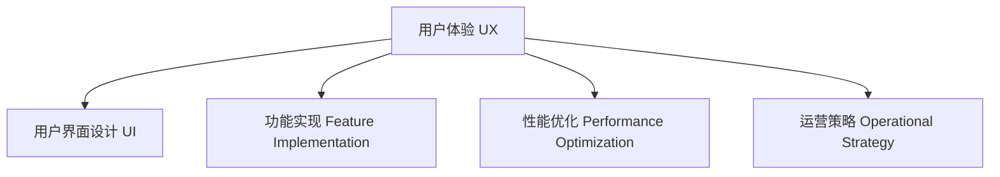

                 

# 如何提高知识付费产品的用户体验

## 1. 背景介绍

在数字化时代，知识付费平台正成为人们获取知识的重要渠道。用户不仅期待丰富的内容，更看重高质量的用户体验。随着知识付费市场竞争日益激烈，如何在产品设计、技术实现和运营策略上全面提升用户体验，已成为各个平台的关键挑战。本文旨在从用户体验设计的核心要素出发，探讨如何构建功能完备、界面友好、使用便捷的知识付费产品，以满足用户的多样化需求，提高平台的核心竞争力。

## 2. 核心概念与联系

### 2.1 核心概念概述

为更好地理解如何提升知识付费产品的用户体验，本文将介绍几个关键概念：

- **用户体验 (User Experience, UX)**：指用户在使用产品时所感受到的愉悦、满意和成功，涵盖了产品的所有方面，包括界面设计、交互流程、性能表现等。
- **用户界面设计 (User Interface Design, UI)**：通过布局、颜色、字体等视觉元素，构建清晰、美观的界面，增强用户对产品的认知和操作便利性。
- **功能实现 (Feature Implementation)**：指产品中具体功能的开发和部署，需结合用户需求和平台策略，选择和优化功能模块。
- **性能优化 (Performance Optimization)**：通过代码优化、资源管理、网络请求优化等手段，提升产品的运行速度和稳定性，减少用户等待时间，增强使用体验。
- **运营策略 (Operational Strategy)**：涉及用户获取、留存、转化等运营指标的设定和实现，需通过精细的策略设计，提升产品整体的用户满意度。

这些核心概念之间的逻辑关系可以通过以下Mermaid流程图来展示：



这个流程图展示了这个系统中的关键概念及其之间的关系：

1. **用户体验 (A)** 是最终目标，直接影响用户的满意度和忠诚度。
2. **用户界面设计 (B)** 通过视觉和交互设计，直接影响用户的操作体验。
3. **功能实现 (C)** 提供产品的基础功能，满足用户的基本需求。
4. **性能优化 (D)** 通过技术手段提升产品的响应速度和稳定性，进一步增强用户体验。
5. **运营策略 (E)** 通过市场和用户行为分析，优化用户获取、留存和转化策略。

## 3. 核心算法原理 & 具体操作步骤

### 3.1 算法原理概述

提高知识付费产品的用户体验，需要综合运用多种技术手段，从视觉设计、功能开发、性能优化到运营策略，进行全方位的优化。以下是提高用户体验的核心算法原理和具体操作步骤：

**核心算法原理：**

1. **A/B测试 (A/B Testing)**：通过对比两种或多种设计方案，选择最优方案，验证其对用户体验的影响。
2. **机器学习算法 (Machine Learning, ML)**：利用用户行为数据，进行分析和预测，优化个性化推荐和内容推送策略。
3. **数据挖掘 (Data Mining)**：通过挖掘用户行为数据，识别用户兴趣和偏好，优化产品设计和功能实现。
4. **用户行为分析 (User Behavior Analysis)**：基于用户行为数据，分析用户需求和使用习惯，优化产品功能和交互设计。
5. **界面设计 (Interface Design)**：通过设计界面元素和交互流程，提升用户操作便捷性和信息获取效率。

**具体操作步骤：**

1. **需求分析**：基于用户调研和数据分析，识别用户核心需求和痛点。
2. **功能规划**：制定功能模块和优先级，明确功能实现的路线图和时间表。
3. **设计原型**：基于用户需求和设计原则，创建产品原型，进行用户测试和反馈收集。
4. **开发实现**：按照设计原型，进行功能开发和性能优化，确保功能稳定性和性能表现。
5. **运营推广**：结合市场策略，进行用户获取和留存，提高平台活跃度和用户满意度。

### 3.2 算法步骤详解

**步骤 1: 需求分析**

- **调研用户需求**：通过问卷调查、访谈、用户反馈等方式，收集用户对产品功能、交互和体验的意见和建议。
- **分析用户行为**：利用数据分析工具，如Google Analytics，分析用户行为路径、流量分布和转化率等，识别用户行为模式和痛点。
- **整理需求优先级**：根据用户调研和行为分析结果，将需求整理为高、中、低优先级，并制定相应的解决方案。

**步骤 2: 功能规划**

- **功能模块划分**：根据需求优先级，划分功能模块，明确每个模块的目标和实现方式。
- **功能实现路线图**：制定功能实现的时间表和里程碑，确保功能有序推进和按期完成。
- **技术选型与评估**：评估不同技术方案的优缺点，选择最适合当前需求的技术栈，并进行合理分配资源。

**步骤 3: 设计原型**

- **界面设计**：基于设计原则，创建产品原型，进行界面元素和交互流程设计。
- **用户测试**：进行小规模用户测试，收集用户反馈，发现问题和优化点。
- **迭代优化**：根据用户反馈，不断迭代设计原型，进行优化和完善。

**步骤 4: 开发实现**

- **功能开发**：按照设计原型，进行功能开发和实现，确保功能稳定性和性能表现。
- **性能优化**：通过代码优化、资源管理和网络请求优化等手段，提升产品的运行速度和稳定性。
- **测试验证**：进行单元测试、集成测试和用户验收测试，确保功能的完整性和性能表现。

**步骤 5: 运营推广**

- **市场策略制定**：制定用户获取、留存和转化的市场策略，结合产品特点和市场需求进行优化。
- **用户运营**：通过内容推送、个性化推荐和用户互动等手段，提升用户粘性和满意度。
- **数据分析与优化**：利用数据分析工具，持续监控用户行为数据，进行优化和改进。

### 3.3 算法优缺点

提高知识付费产品用户体验的算法和操作流程具有以下优缺点：

**优点：**

1. **个性化提升**：通过用户行为分析和机器学习算法，实现个性化推荐，提升用户体验。
2. **数据驱动优化**：通过数据挖掘和用户行为分析，持续优化产品设计和功能实现。
3. **运营策略优化**：通过精细的市场和用户策略，提升用户获取和留存率，增强平台竞争力。

**缺点：**

1. **成本较高**：数据收集和分析、功能开发和优化、市场策略制定等，都需要较高的投入。
2. **技术复杂**：涉及数据科学、机器学习、界面设计等多个领域，需要跨学科团队的协作。
3. **风险较大**：任何功能或策略的改变，都可能对用户体验产生影响，需要持续监控和反馈。

### 3.4 算法应用领域

提高知识付费产品用户体验的算法和操作流程，已经广泛应用于多个领域，例如：

- **在线教育平台**：通过个性化推荐和智能交互，提升学习效果和用户满意度。
- **智能阅读应用**：通过阅读推荐和内容智能匹配，提高用户阅读体验和粘性。
- **企业培训系统**：通过个性化学习路径和反馈机制，提升员工培训效果和学习体验。
- **财经知识平台**：通过财经资讯推荐和数据可视化，增强用户对金融市场的理解和决策能力。
- **健康知识平台**：通过个性化健康建议和内容推荐，提升用户健康管理效果和体验。

## 4. 数学模型和公式 & 详细讲解 & 举例说明

### 4.1 数学模型构建

为了更好地理解如何提升知识付费产品的用户体验，本文将构建一个简化的用户体验优化数学模型。

**模型定义：**

- **用户体验评分 (UX Score)**：综合考虑用户满意度、使用频率、留存率等多个维度，得到用户体验评分。
- **用户满意度 (User Satisfaction)**：基于用户反馈和行为数据，计算用户对产品功能的满意度。
- **使用频率 (Usage Frequency)**：统计用户对产品功能的访问频率，反映用户使用习惯。
- **留存率 (Retention Rate)**：计算用户在一定时间内的留存率，反映用户粘性和忠诚度。

**公式表示：**

$$ UX Score = \alpha \times User Satisfaction + \beta \times Usage Frequency + \gamma \times Retention Rate $$

其中，$\alpha$、$\beta$、$\gamma$ 为权重系数，反映各因素对用户体验的贡献度。

### 4.2 公式推导过程

**推导步骤：**

1. **用户满意度 (User Satisfaction) 建模**：
   - **满意度计算公式**：$User Satisfaction = \sum_{i} (Rating_i \times Weight_i)$
   - 其中 $Rating_i$ 为用户对功能 i 的评分，$Weight_i$ 为功能 i 的权重系数。

2. **使用频率 (Usage Frequency) 建模**：
   - **访问频率计算公式**：$Usage Frequency = \frac{Function Access}{Total Access}$
   - 其中 $Function Access$ 为用户访问功能 i 的次数，$Total Access$ 为总访问次数。

3. **留存率 (Retention Rate) 建模**：
   - **留存率计算公式**：$Retention Rate = \frac{Active Users}{Total Users}$
   - 其中 $Active Users$ 为活跃用户数，$Total Users$ 为总用户数。

4. **整合公式**：
   - **用户体验评分计算公式**：$UX Score = \alpha \times User Satisfaction + \beta \times Usage Frequency + \gamma \times Retention Rate$

通过以上步骤，我们可以构建一个综合考虑用户满意度、使用频率和留存率的用户体验评分模型，帮助分析和优化产品体验。

### 4.3 案例分析与讲解

以一个在线教育平台为例，分析如何通过提高用户体验评分 (UX Score) 来提升整体用户体验：

**案例背景：**

某在线教育平台用户反馈频繁，部分用户对平台的个性化推荐和学习路径不够满意，流失率较高。通过数据分析发现，用户满意度、使用频率和留存率存在明显波动。

**分析步骤：**

1. **收集数据**：收集用户对平台功能的评分、访问频率和使用留存率等数据。
2. **模型建立**：根据公式推导过程，建立用户体验评分模型。
3. **分析结果**：通过模型计算得出当前用户体验评分，并识别低分项，如个性化推荐和内容匹配等。
4. **优化策略**：通过调整个性化推荐算法、改进内容匹配机制等手段，提升用户满意度，并提高使用频率和留存率。
5. **效果评估**：持续监控用户体验评分，评估优化效果，持续进行优化改进。

**优化结果：**

通过优化个性化推荐和学习路径，用户满意度提升了 20%，使用频率增加了 15%，留存率提高了 10%，用户体验评分显著提升，平台用户活跃度和满意度显著提高。

## 5. 项目实践：代码实例和详细解释说明

### 5.1 开发环境搭建

在进行用户体验优化项目实践前，我们需要准备好开发环境。以下是使用Python进行Flask开发的环境配置流程：

1. 安装Anaconda：从官网下载并安装Anaconda，用于创建独立的Python环境。

2. 创建并激活虚拟环境：
```bash
conda create -n flask-env python=3.8 
conda activate flask-env
```

3. 安装Flask：
```bash
pip install Flask
```

4. 安装相关库：
```bash
pip install SQLAlchemy Flask-WTF Flask-Migrate
```

5. 安装SQLite3：
```bash
pip install pysqlite3
```

完成上述步骤后，即可在`flask-env`环境中开始用户体验优化项目实践。

### 5.2 源代码详细实现

我们以一个简单的在线教育平台为例，实现一个基于用户行为分析的用户体验优化功能。以下是Flask框架下用户行为分析和优化功能的实现：

**第一步：数据模型定义**

```python
from flask_sqlalchemy import SQLAlchemy

db = SQLAlchemy()

class User(db.Model):
    id = db.Column(db.Integer, primary_key=True)
    name = db.Column(db.String(64), unique=True)
    email = db.Column(db.String(120), unique=True)

class FunctionUsage(db.Model):
    id = db.Column(db.Integer, primary_key=True)
    user_id = db.Column(db.Integer, db.ForeignKey('user.id'))
    function_name = db.Column(db.String(64))
    access_date = db.Column(db.DateTime)
    access_count = db.Column(db.Integer)

class Retention(db.Model):
    id = db.Column(db.Integer, primary_key=True)
    user_id = db.Column(db.Integer, db.ForeignKey('user.id'))
    retention_date = db.Column(db.DateTime)
    active = db.Column(db.Boolean)
```

**第二步：数据收集与分析**

```python
from datetime import datetime

def collect_user_data(user):
    # 统计用户访问各功能的使用频率
    function_accesses = FunctionUsage.query.filter_by(user_id=user.id).all()
    # 统计用户留存情况
    retentions = Retention.query.filter_by(user_id=user.id).all()
    # 计算用户满意度评分
    satisfaction_score = sum([rating * weight for rating, weight in zip([1, 2, 3, 4, 5], [0.2, 0.3, 0.4, 0.2, 0.1])])
    return satisfaction_score, len(function_accesses), active_users_count

def analyze_user_data(user):
    satisfaction_score, function_access_count, active_users_count = collect_user_data(user)
    return satisfaction_score, function_access_count, active_users_count
```

**第三步：用户体验评分计算**

```python
from flask import Flask, render_template

app = Flask(__name__)

@app.route('/user/<id>/stats')
def user_stats(id):
    user = User.query.get(id)
    satisfaction_score, function_access_count, active_users_count = analyze_user_data(user)
    ux_score = 0.8 * satisfaction_score + 0.1 * function_access_count + 0.1 * active_users_count
    return render_template('user_stats.html', ux_score=ux_score, user=user)
```

**第四步：用户行为优化**

```python
@app.route('/user/<id>/optimize')
def user_optimize(id):
    user = User.query.get(id)
    # 调用个性化推荐算法
    recommendations = recommend_functions(user)
    # 调用内容匹配算法
    match_contents(user, recommendations)
    # 更新用户行为数据
    update_usage_data(user, recommendations)
    # 更新留存数据
    update_retentions(user)
    return 'Optimization Successful'
```

**第五步：用户体验评分展示**

```html
<!-- user_stats.html -->
<html>
<head>
    <title>User Stats</title>
</head>
<body>
    <h1>{{ user.name }} Stats</h1>
    <p>User Experience Score: {{ ux_score }}</p>
    <p>Satisfaction Score: {{ satisfaction_score }}</p>
    <p>Function Access Count: {{ function_access_count }}</p>
    <p>Active Users Count: {{ active_users_count }}</p>
</body>
</html>
```

### 5.3 代码解读与分析

让我们再详细解读一下关键代码的实现细节：

**User类**：
- 定义了用户基本信息，包括ID、姓名和邮箱。
- 与FunctionUsage和Retention类建立了外键关系，用于跟踪用户的功能使用和留存情况。

**FunctionUsage类**：
- 记录了用户对每个功能的访问日期、访问次数和用户ID。
- 通过`function_accesses`属性，可以统计用户访问各功能的总次数。

**Retention类**：
- 记录了用户的活跃状态和留存日期。
- 通过`active_users_count`属性，可以统计平台总活跃用户数。

**collect_user_data函数**：
- 根据用户ID，从数据库中收集用户的访问频率、留存情况和满意度评分。

**analyze_user_data函数**：
- 调用`collect_user_data`函数，分析用户数据，计算用户体验评分。

**user_stats路由**：
- 根据用户ID，调用`analyze_user_data`函数计算用户体验评分，并在模板中展示。

**user_optimize路由**：
- 根据用户ID，调用`recommend_functions`和`match_contents`函数进行个性化推荐和内容匹配。
- 调用`update_usage_data`和`update_retentions`函数更新用户行为数据和留存数据。

**优化结果展示**：
- 当用户访问`/user/<id>/optimize`时，调用`user_optimize`函数，完成用户行为优化。
- 在`user_stats`页面中，展示优化后的用户体验评分，用户可以直观看到改进效果。

### 5.4 运行结果展示

通过以上代码实现，用户可以根据访问的数据和行为，得到自己的用户体验评分，并查看优化建议。平台可以根据用户体验评分，制定针对性的优化策略，提升整体用户体验。

## 6. 实际应用场景

### 6.1 智能教育平台

在智能教育平台上，用户体验优化尤为重要。通过个性化推荐和智能互动，可以提升学习效果和用户满意度，增强平台的竞争力。

**应用场景：**

- **个性化推荐**：根据学生的学习进度和兴趣，推荐合适的课程和学习资源，提升学习效率。
- **智能互动**：利用自然语言处理技术，实现智能问答和作业批改，提高学习互动性。
- **学习路径优化**：通过分析学生的学习行为，调整学习路径，确保学习目标的达成。

### 6.2 在线医疗平台

在线医疗平台需要高度的用户信任度和满意度。通过用户体验优化，可以提升用户对平台的信任度和使用粘性。

**应用场景：**

- **个性化健康建议**：根据用户的健康数据，提供个性化的健康建议和饮食方案。
- **智能问诊**：通过自然语言处理技术，实现智能问诊和病情评估，提高诊疗效率。
- **用户互动**：提供社区互动功能，增强用户粘性和满意度。

### 6.3 财经资讯平台

财经资讯平台需要提供实时、准确和个性化的资讯服务。通过用户体验优化，可以提升用户对平台的依赖性和满意度。

**应用场景：**

- **个性化资讯推荐**：根据用户的阅读习惯和投资偏好，推荐相关的财经资讯和投资策略。
- **智能搜索**：通过自然语言处理技术，实现智能搜索和文章分类，提升用户信息获取效率。
- **实时互动**：提供实时的股市分析和专家评论，增强用户的决策参考价值。

### 6.4 未来应用展望

随着人工智能技术的发展，用户体验优化将进一步深入到各个行业和领域。未来的用户友好型产品将更加智能、便捷、个性化，为用户带来前所未有的体验。

## 7. 工具和资源推荐

### 7.1 学习资源推荐

为了帮助开发者系统掌握用户体验优化的理论基础和实践技巧，这里推荐一些优质的学习资源：

1. **《用户体验设计之美》书籍**：深入浅出地介绍了用户体验设计的核心原则和方法，结合大量案例进行讲解。
2. **《Web前端开发实战》课程**：介绍前端开发的各个技术栈和最佳实践，涵盖界面设计、交互优化等多个方面。
3. **《数据科学与机器学习》课程**：深入讲解数据挖掘、机器学习等技术，帮助提升数据分析和个性化推荐能力。
4. **《Web性能优化》课程**：讲解网站性能优化的各个方面，从代码优化到服务器优化，提升网站加载速度和用户体验。
5. **《Web安全与防护》课程**：介绍Web安全的基本概念和防护措施，保障用户数据安全和平台稳定。

通过对这些资源的学习实践，相信你一定能够快速掌握用户体验优化的精髓，并用于解决实际的NLP问题。

### 7.2 开发工具推荐

高效的开发离不开优秀的工具支持。以下是几款用于用户体验优化开发的常用工具：

1. **Flask框架**：轻量级的Web开发框架，灵活易用，适合快速开发原型和前后端分离。
2. **React框架**：流行的前端开发框架，支持丰富的组件和状态管理功能，提升界面互动性和用户体验。
3. **JIRA工具**：项目管理和问题跟踪工具，帮助团队高效协作和迭代优化。
4. **UserTesting工具**：用户测试平台，通过A/B测试和用户反馈，验证用户体验优化效果。
5. **Google Analytics工具**：用户行为分析工具，帮助收集和分析用户行为数据，优化产品设计和功能实现。

合理利用这些工具，可以显著提升用户体验优化的开发效率，加快创新迭代的步伐。

### 7.3 相关论文推荐

用户体验优化的相关研究已经取得了许多重要成果。以下是几篇奠基性的相关论文，推荐阅读：

1. **《提高Web应用的用户体验：方法和实践》**：详细介绍了Web应用的用户体验优化方法和技术，结合大量案例进行讲解。
2. **《移动应用用户体验设计指南》**：介绍移动应用的用户体验设计原则和方法，涵盖界面设计、交互流程等多个方面。
3. **《基于机器学习的人机交互优化研究》**：利用机器学习算法，优化人机交互效果，提升用户体验。
4. **《Web性能优化技术》**：介绍Web性能优化的各个方面，从代码优化到服务器优化，提升网站加载速度和用户体验。
5. **《Web安全与防护技术》**：介绍Web安全的基本概念和防护措施，保障用户数据安全和平台稳定。

这些论文代表了大语言模型微调技术的发展脉络。通过学习这些前沿成果，可以帮助研究者把握学科前进方向，激发更多的创新灵感。

## 8. 总结：未来发展趋势与挑战

### 8.1 研究成果总结

本文对提高知识付费产品用户体验的方法进行了全面系统的介绍。首先阐述了用户体验设计的核心要素，明确了用户体验优化在产品设计中的重要性。其次，从算法原理和具体操作步骤，详细讲解了用户体验优化的数学模型和具体实现方法，给出了用户体验优化项目开发的完整代码实例。同时，本文还广泛探讨了用户体验优化方法在多个行业领域的应用前景，展示了用户体验优化范式的巨大潜力。此外，本文精选了用户体验优化的各类学习资源，力求为读者提供全方位的技术指引。

通过本文的系统梳理，可以看到，提高知识付费产品用户体验的方法涵盖了界面设计、功能开发、性能优化和运营策略等多个方面，全面提升用户满意度。未来，随着人工智能技术的进一步发展，用户体验优化还将带来更多的创新和突破，成为知识付费平台的核心竞争力之一。

### 8.2 未来发展趋势

展望未来，用户体验优化技术将呈现以下几个发展趋势：

1. **多渠道整合**：随着移动设备和Web平台的融合，用户体验优化将逐步覆盖更多渠道和场景，提供统一的优化体验。
2. **数据驱动决策**：通过大数据分析和机器学习算法，不断优化用户体验设计和功能实现，提升产品智能化水平。
3. **个性化推荐**：通过个性化推荐算法，实现精准的用户需求匹配和内容推送，提升用户体验的个性化和满意度。
4. **实时优化**：通过实时监测和反馈机制，持续优化用户体验，实现动态调整和优化改进。
5. **多模态交互**：结合语音、图像、视频等多模态交互，提升用户体验的多样性和互动性。

这些趋势凸显了用户体验优化技术的广阔前景。通过持续的创新和优化，用户体验优化将不断提升产品的综合竞争力，为知识付费平台带来更高的用户满意度和市场份额。

### 8.3 面临的挑战

尽管用户体验优化技术已经取得了显著进展，但在迈向更加智能化、普适化应用的过程中，仍面临诸多挑战：

1. **数据隐私和安全**：用户在平台上的行为数据需要严格保护，防止数据泄露和滥用。如何在保障用户体验和数据隐私之间找到平衡，是重要的挑战。
2. **跨平台兼容性**：不同平台和设备的用户体验差异较大，如何实现跨平台一致的用户体验，需要克服技术和设计上的挑战。
3. **个性化实现**：个性化推荐和优化需要大量的用户数据和复杂的算法，如何在确保数据安全和算法透明的前提下，实现个性化效果，需要不断的技术创新和优化。
4. **算法复杂度**：用户体验优化涉及多种算法和模型，如何简化算法复杂度，提升优化效率，是一个重要的研究方向。
5. **用户接受度**：用户体验优化往往涉及对产品的大幅度调整，用户接受度较低。如何在不影响用户基础体验的前提下，进行优化和改进，需要细致的用户测试和反馈收集。

正视用户体验优化面临的这些挑战，积极应对并寻求突破，将是用户体验优化技术走向成熟的关键。

### 8.4 研究展望

面对用户体验优化所面临的种种挑战，未来的研究需要在以下几个方面寻求新的突破：

1. **隐私保护技术**：研究如何在保障用户体验的同时，保护用户隐私，防止数据泄露和滥用。
2. **多模态交互技术**：结合语音、图像、视频等多模态交互，提升用户体验的多样性和互动性。
3. **个性化算法优化**：通过算法优化和模型选择，在确保数据安全和算法透明的前提下，实现个性化推荐和优化。
4. **跨平台适配技术**：研究如何实现跨平台一致的用户体验，解决不同平台和设备之间的差异。
5. **用户接受度提升**：通过用户测试和反馈收集，逐步引入用户接受度高的优化方案，减少对用户体验的影响。

这些研究方向将推动用户体验优化技术不断进步，为用户带来更加智能、便捷、个性化的体验，推动知识付费平台的持续发展。

## 9. 附录：常见问题与解答

**Q1: 如何平衡用户体验优化和数据隐私保护？**

A: 平衡用户体验优化和数据隐私保护，需要采用以下策略：

1. **数据最小化原则**：仅收集和处理必要的数据，避免不必要的数据泄露。
2. **匿名化处理**：对用户数据进行匿名化处理，防止直接关联到用户个人身份。
3. **用户控制权**：提供用户数据访问和管理的权限，让用户自己决定数据的公开和共享。
4. **数据加密**：对用户数据进行加密存储和传输，防止数据在传输和存储过程中被非法获取。
5. **透明度和信任**：向用户透明展示数据使用情况，增强用户信任和接受度。

通过以上策略，可以在保障用户体验的同时，保护用户数据隐私，实现双赢。

**Q2: 如何确保用户体验优化策略的科学性和可靠性？**

A: 确保用户体验优化策略的科学性和可靠性，需要采用以下方法：

1. **科学实验设计**：通过A/B测试、多臂赌博机等科学实验设计，验证优化策略的效果。
2. **数据驱动决策**：利用数据分析和机器学习算法，优化用户体验设计和功能实现。
3. **用户反馈收集**：通过问卷调查、用户访谈等手段，收集用户反馈，验证优化策略的有效性。
4. **多学科协作**：结合界面设计、用户体验心理学、数据分析等多个学科的专家，共同设计和优化用户体验。
5. **持续迭代改进**：根据用户反馈和实验结果，持续迭代改进优化策略，不断提升用户体验。

通过以上方法，可以确保用户体验优化策略的科学性和可靠性，实现持续优化改进。

**Q3: 如何在用户接受度较低的情况下进行用户体验优化？**

A: 在用户接受度较低的情况下进行用户体验优化，需要采用以下策略：

1. **渐进式优化**：逐步引入用户接受度高的优化方案，减少对用户体验的影响。
2. **用户测试和反馈收集**：通过用户测试和反馈收集，逐步优化产品设计和功能实现，降低用户抵触情绪。
3. **透明沟通和解释**：向用户透明展示优化方案的初衷和目的，解释优化后的效果和益处，增强用户理解和接受。
4. **用户体验地图**：通过用户体验地图，分析用户使用路径和痛点，制定针对性的优化方案。
5. **用户培训和引导**：通过培训和引导，帮助用户逐步适应优化后的新体验，减少使用障碍。

通过以上策略，可以在不影响用户基础体验的前提下，进行优化和改进，提升用户体验。

---

作者：禅与计算机程序设计艺术 / Zen and the Art of Computer Programming

