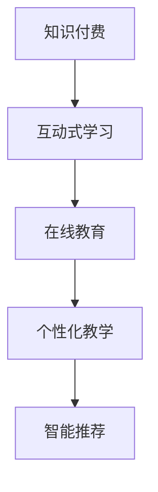

                 

# 如何设计互动式的知识付费课程

> 关键词：知识付费, 互动式学习, 在线教育, 个性化教学, 智能推荐

## 1. 背景介绍

### 1.1 问题由来
在互联网时代，知识付费成为一种新的学习模式，吸引了越来越多的用户和投资者。然而，传统的知识付费课程通常采用单向灌输的方式，用户只能被动接受，难以实现互动和个性化。为了提高知识付费的效果和用户的参与度，互动式学习成为当前的研究热点。

### 1.2 问题核心关键点
互动式知识付费课程的核心在于将传统单向灌输的课程内容，转变为可互动、个性化、自适应的学习体验。它通常包括以下几个要素：
- **互动性**：通过问答、讨论、测试等互动方式，增加用户参与度。
- **个性化**：根据用户的学习进度和偏好，推送个性化内容。
- **自适应性**：根据用户的学习情况动态调整课程内容，保持学习的连贯性和有效性。
- **智能推荐**：根据用户的学习行为和兴趣，推荐相关课程和学习资源。

## 2. 核心概念与联系

### 2.1 核心概念概述

为更好地理解互动式知识付费课程的设计原理，本节将介绍几个密切相关的核心概念：

- **知识付费**：用户为获取特定知识而支付费用的商业模式。它主要依赖于高质量的课程内容和有效的付费机制，吸引用户主动付费学习。
- **互动式学习**：通过用户与学习内容之间的互动，提升学习效果和参与度的学习方式。包括在线讨论、即时问答、小组讨论等多种形式。
- **在线教育**：通过互联网技术，提供远程教育服务的学习方式。它涵盖了在线课程、在线答疑、在线考试等多种形式。
- **个性化教学**：根据用户的学习需求和偏好，提供定制化的课程内容和教学方案，提升学习效果。
- **智能推荐**：利用算法和数据，推荐相关课程和资源，提升用户的学习体验和效率。

这些核心概念之间的逻辑关系可以通过以下Mermaid流程图来展示：



这个流程图展示了两者的核心概念以及它们之间的逻辑关系：

1. 知识付费通过互动式学习的方式，提供高质量的课程内容和在线教育服务。
2. 个性化教学和智能推荐分别作为互动式学习的辅助手段，进一步提升用户的个性化学习体验和课程推荐的精准度。

## 3. 核心算法原理 & 具体操作步骤
### 3.1 算法原理概述

互动式知识付费课程的设计原理可以概括为：通过数据驱动的方法，利用人工智能技术对用户的学习行为进行分析，从而提供个性化的课程内容和互动体验，提升学习效果和用户参与度。

具体来说，互动式课程的设计流程包括以下几个关键步骤：

1. **用户画像构建**：通过用户注册信息、学习历史和互动记录等数据，构建用户画像，了解用户的学习偏好和需求。
2. **学习内容推送**：根据用户画像，推送个性化的学习内容，如视频、文章、练习题等，满足用户的学习需求。
3. **互动反馈分析**：收集用户在互动过程中的反馈信息，如答题情况、讨论发言等，分析用户的学习效果和兴趣点。
4. **动态调整课程**：根据用户的学习行为和反馈，动态调整课程内容和难度，保持学习连贯性和有效性。
5. **智能推荐系统**：通过推荐算法，推荐相关课程和资源，提升用户的学习体验和效率。

### 3.2 算法步骤详解

以下将详细介绍互动式知识付费课程设计的具体步骤：

**Step 1: 用户画像构建**
- 收集用户的注册信息、学习历史、互动记录等数据，构建用户画像。
- 使用聚类、分类等机器学习算法，分析用户的兴趣、能力水平和学习习惯。
- 根据用户画像，生成个性化推荐和互动策略。

**Step 2: 学习内容推送**
- 根据用户画像，推送个性化的学习内容，如视频、文章、练习题等。
- 使用协同过滤、基于内容的推荐算法，动态调整内容的推送顺序和数量。
- 定期更新学习内容，保持内容的丰富性和时效性。

**Step 3: 互动反馈分析**
- 收集用户在互动过程中的反馈信息，如答题情况、讨论发言等。
- 分析用户的学习效果和兴趣点，识别出学习难点和知识盲点。
- 使用自然语言处理技术，对用户的发言进行情感分析，了解用户的情绪状态。

**Step 4: 动态调整课程**
- 根据用户的学习行为和反馈，动态调整课程内容和难度。
- 使用自适应学习算法，实时调整学习进度和测试难度。
- 设置学习目标和里程碑，引导用户完成学习任务。

**Step 5: 智能推荐系统**
- 收集用户的学习行为和互动数据，训练推荐模型。
- 使用协同过滤、基于内容的推荐算法，推荐相关课程和学习资源。
- 实时更新推荐结果，根据用户的学习进展和反馈动态调整推荐策略。

### 3.3 算法优缺点

互动式知识付费课程的设计方法具有以下优点：
1. 提升用户参与度：通过互动和个性化推荐，增加用户的学习兴趣和参与度。
2. 提高学习效果：根据用户的学习行为和反馈，动态调整课程内容和难度，提升学习效果。
3. 提升用户满意度：通过个性化的内容和推荐，满足用户的个性化需求，提升用户满意度。

同时，该方法也存在一些局限性：
1. 数据依赖性强：需要收集大量用户数据，才能构建准确的用户画像和推荐模型。
2. 技术要求高：需要同时使用自然语言处理、机器学习、推荐算法等多种技术，实现高精度的推荐和分析。
3. 隐私保护问题：用户数据的收集和分析可能涉及隐私保护问题，需要严格遵守相关法律法规。

尽管存在这些局限性，但就目前而言，基于互动式学习的方法仍是大语言模型应用的最主流范式。未来相关研究的重点在于如何进一步降低对数据的依赖，提高算法的精度和效率，同时兼顾隐私保护和用户体验。

### 3.4 算法应用领域

互动式知识付费课程的设计方法在在线教育领域已经得到了广泛的应用，覆盖了几乎所有常见的课程类型，例如：

- 编程课程：如Python、Java等编程语言的基础和进阶课程。通过互动编程练习和测试，提升编程技能。
- 商业管理课程：如市场营销、人力资源等管理类课程。通过案例分析和讨论，提升管理实战能力。
- 艺术设计课程：如Photoshop、AutoCAD等设计软件课程。通过互动操作和练习，提升设计技能。
- 金融投资课程：如股票、基金等投资课程。通过模拟交易和数据分析，提升投资水平。
- 语言学习课程：如英语、日语等语言课程。通过互动对话和测试，提升语言能力。

除了上述这些经典课程外，互动式知识付费课程还被创新性地应用到更多场景中，如可控学习路径、知识图谱、自适应学习系统等，为在线教育带来了全新的突破。随着技术的不断进步，相信基于互动式学习的方法将成为在线教育的重要范式，推动教育技术的产业化进程。

## 4. 数学模型和公式 & 详细讲解 & 举例说明（备注：数学公式请使用latex格式，latex嵌入文中独立段落使用 $$，段落内使用 $)
### 4.1 数学模型构建

本节将使用数学语言对互动式知识付费课程的设计过程进行更加严格的刻画。

假设用户画像为 $\mathbf{u}$，学习内容为 $\mathbf{x}$，互动反馈为 $\mathbf{f}$，推荐模型为 $M$。设计过程可以表示为以下数学模型：

$$
\mathbf{u} \leftarrow \text{UserProfileAnalysis}(\mathbf{x}, \mathbf{f})
$$

$$
\mathbf{x} \leftarrow \text{ContentRecommendation}(\mathbf{u})
$$

$$
\mathbf{f} \leftarrow \text{InteractiveFeedbackAnalysis}(\mathbf{u}, \mathbf{x})
$$

$$
\mathbf{x} \leftarrow \text{AdaptiveLearning}(\mathbf{u}, \mathbf{f})
$$

$$
\mathbf{x} \leftarrow \text{RecommendationSystem}(\mathbf{u})
$$

其中，$\text{UserProfileAnalysis}$ 表示用户画像构建模块，$\text{ContentRecommendation}$ 表示学习内容推送模块，$\text{InteractiveFeedbackAnalysis}$ 表示互动反馈分析模块，$\text{AdaptiveLearning}$ 表示动态调整课程模块，$\text{RecommendationSystem}$ 表示智能推荐系统模块。

### 4.2 公式推导过程

以下我们以编程课程为例，推导学习内容推送和推荐系统的计算公式。

**内容推送**
- 假设每个学习内容可以用向量 $\mathbf{x} = (x_1, x_2, ..., x_n)$ 表示，每个内容的学习难度为 $d_i \in [0, 1]$。
- 用户画像为 $\mathbf{u} = (u_1, u_2, ..., u_m)$，其中 $u_i$ 表示用户对第 $i$ 个难度的偏好程度。

内容推送的目标是最小化用户画像与学习内容难度分布的差异：

$$
\min_{\mathbf{x}} \sum_{i=1}^m |u_i - d_i|
$$

可以使用K-L散度来度量两个分布的差异，求解目标函数：

$$
\mathbf{x} = \arg\min_{\mathbf{x}} D_{KL}(\mathbf{u}||\mathbf{d})
$$

其中 $D_{KL}(\mathbf{u}||\mathbf{d})$ 表示KL散度。

**智能推荐**
- 假设推荐系统输出的相关课程为 $\mathbf{y} = (y_1, y_2, ..., y_k)$，每个课程的推荐度为 $r_j \in [0, 1]$。
- 用户画像为 $\mathbf{u} = (u_1, u_2, ..., u_m)$，其中 $u_i$ 表示用户对第 $i$ 个课程的兴趣程度。

智能推荐的目标是最大化用户画像与课程推荐度分布的相似度：

$$
\max_{\mathbf{y}} \sum_{j=1}^k r_j \cdot u_i
$$

可以使用余弦相似度来度量两个分布的相似度，求解目标函数：

$$
\mathbf{y} = \arg\max_{\mathbf{y}} \cos(\mathbf{u}, \mathbf{y})
$$

其中 $\cos(\mathbf{u}, \mathbf{y})$ 表示余弦相似度。

### 4.3 案例分析与讲解

以编程课程为例，分析互动式知识付费课程的设计过程：

**Step 1: 用户画像构建**
- 收集用户的注册信息、学习历史、互动记录等数据。
- 使用聚类算法，将用户分为初学者、中级和高级三类。
- 根据用户的学习历史和互动记录，生成每个用户对难度的偏好程度，如初学者对基础编程任务更感兴趣，高级用户对复杂算法更感兴趣。

**Step 2: 学习内容推送**
- 根据用户画像，推荐不同难度和类型的编程任务。
- 使用协同过滤算法，根据其他用户的学习历史和互动反馈，推荐相关任务。
- 定期更新任务库，添加新任务和案例，保持任务的丰富性和时效性。

**Step 3: 互动反馈分析**
- 收集用户在互动过程中的反馈信息，如答题情况、讨论发言等。
- 分析用户的学习效果和兴趣点，识别出学习难点和知识盲点。
- 使用情感分析技术，对用户的发言进行情感分析，了解用户的情绪状态。

**Step 4: 动态调整课程**
- 根据用户的学习行为和反馈，动态调整课程内容和难度。
- 使用自适应学习算法，实时调整学习进度和测试难度。
- 设置学习目标和里程碑，引导用户完成学习任务。

**Step 5: 智能推荐系统**
- 收集用户的学习行为和互动数据，训练推荐模型。
- 使用协同过滤算法，推荐相关编程任务和资源。
- 实时更新推荐结果，根据用户的学习进展和反馈动态调整推荐策略。

## 5. 项目实践：代码实例和详细解释说明
### 5.1 开发环境搭建

在进行互动式知识付费课程的开发前，我们需要准备好开发环境。以下是使用Python进行开发的环境配置流程：

1. 安装Anaconda：从官网下载并安装Anaconda，用于创建独立的Python环境。

2. 创建并激活虚拟环境：
```bash
conda create -n course-env python=3.8 
conda activate course-env
```

3. 安装必要的Python库：
```bash
pip install pandas numpy matplotlib seaborn scikit-learn jupyter notebook ipython
```

4. 安装相关第三方库：
```bash
pip install beautifulsoup4 requests
```

完成上述步骤后，即可在`course-env`环境中开始互动式知识付费课程的开发。

### 5.2 源代码详细实现

下面以编程课程为例，给出使用Python进行互动式知识付费课程开发的代码实现。

首先，定义课程信息类：

```python
class Course:
    def __init__(self, name, difficulty, content):
        self.name = name
        self.difficulty = difficulty
        self.content = content
```

然后，定义用户画像类：

```python
class UserProfile:
    def __init__(self, user_id, interests):
        self.user_id = user_id
        self.interests = interests

    def update_interests(self, new_interests):
        self.interests = new_interests
```

接着，定义推荐系统类：

```python
class RecommendationSystem:
    def __init__(self, courses):
        self.courses = courses
        self.user_interests = None
    
    def recommend(self, user_profile):
        self.user_interests = user_profile.interests
        recommendations = []
        for course in self.courses:
            similarity = cosine_similarity(self.user_interests, course.interests)
            recommendations.append((course.name, similarity))
        return sorted(recommendations, key=lambda x: x[1], reverse=True)
```

最后，启动推荐系统，并使用推荐结果：

```python
# 创建课程列表
courses = [Course('Python基础', 0.5, ['基础语法', '数据结构', '函数', '文件操作']),
           Course('Python高级', 0.7, ['面向对象编程', '网络编程', '框架', '测试框架']),
           Course('算法与数据结构', 0.9, ['算法基础', '数据结构', '设计模式', '面试题'])]

# 创建用户画像
user1 = UserProfile('user1', [0.8, 0.3, 0.5])
user2 = UserProfile('user2', [0.5, 0.7, 0.2])

# 创建推荐系统
recommender = RecommendationSystem(courses)

# 获取推荐结果
recommendations1 = recommender.recommend(user1)
recommendations2 = recommender.recommend(user2)

# 输出推荐结果
for course_name, similarity in recommendations1:
    print(f'{course_name} 推荐度：{similarity}')
    
for course_name, similarity in recommendations2:
    print(f'{course_name} 推荐度：{similarity}')
```

以上就是使用Python进行互动式知识付费课程开发的完整代码实现。可以看到，使用面向对象编程的方式，我们很好地封装了课程信息、用户画像和推荐系统的各个组件，实现了推荐过程的模块化设计。

### 5.3 代码解读与分析

让我们再详细解读一下关键代码的实现细节：

**Course类**：
- 定义了课程的基本属性，如课程名、难度和内容。
- 课程内容可以是任意类型的列表，用于存储课程的知识点和练习题。

**UserProfile类**：
- 定义了用户画像的基本属性，如用户ID和兴趣向量。
- 提供了更新兴趣向量的方法，用于动态调整用户画像。

**RecommendationSystem类**：
- 定义了推荐系统的基本属性，如课程列表和用户兴趣。
- 提供了推荐方法，根据用户兴趣和课程兴趣计算推荐度，并排序返回推荐结果。

**推荐系统实现**：
- 在`__init__`方法中，初始化课程列表和用户兴趣。
- 在`recommend`方法中，根据用户兴趣和课程兴趣计算推荐度，并排序返回推荐结果。
- 使用`cosine_similarity`函数计算余弦相似度，用于度量用户兴趣和课程兴趣的相似度。

通过这个简单的例子，我们展示了如何通过面向对象编程的方式，设计互动式知识付费课程的推荐系统。在实际应用中，还需要考虑更多因素，如数据存储、用户反馈、学习进度等，才能构建出完整的互动式课程。

## 6. 实际应用场景
### 6.1 智能学习平台

互动式知识付费课程可以广泛应用于智能学习平台的构建。传统学习平台通常采用单向灌输的方式，缺乏互动和个性化。通过引入互动式课程，智能学习平台能够提供更加灵活、高效的学习体验，满足不同用户的需求。

在技术实现上，可以收集用户的学习行为和互动数据，构建用户画像，推送个性化学习内容，动态调整课程难度，实时推荐相关资源。用户可以通过在线问答、讨论组等形式，与其他学习者互动，增加学习动力和参与度。

### 6.2 企业培训

互动式知识付费课程也被广泛应用于企业培训。传统培训通常采用线下方式，难以实现大规模、个性化培训。通过互动式课程，企业可以提供灵活、高效的在线培训服务，提升员工的职业技能。

在企业内部，可以基于员工的工作内容和学习需求，构建个性化的培训课程。通过互动式学习，员工可以自主安排学习进度，及时反馈学习效果，提升培训效果和满意度。

### 6.3 家庭教育

互动式知识付费课程在家庭教育中也具有广泛应用前景。传统家庭教育通常依赖于教师的授课和学生的自主学习，缺乏互动和个性化。通过互动式课程，家长可以为孩子提供更加灵活、有趣的学习方式，提升学习效果。

在家庭教育中，可以基于孩子的年龄和学习兴趣，推送个性化的学习内容。通过互动式学习，孩子可以自主探索知识，与家长进行互动讨论，增加学习的趣味性和参与度。

### 6.4 未来应用展望

随着互动式知识付费课程的不断发展和完善，其在教育、培训、家庭教育等领域的潜力将进一步得到挖掘，推动知识付费市场的繁荣。未来，互动式课程将与人工智能、大数据、区块链等前沿技术深度融合，提升学习效果和用户体验。

在教育领域，互动式课程将结合自然语言处理、情感分析、智能推荐等技术，提供更加个性化、自适应的学习体验。在企业培训中，互动式课程将结合知识图谱、智能导师、模拟测试等技术，提升培训效果和员工满意度。在家庭教育中，互动式课程将结合游戏化设计、互动式阅读、家庭学习社区等技术，提升孩子的学习兴趣和参与度。

## 7. 工具和资源推荐
### 7.1 学习资源推荐

为了帮助开发者系统掌握互动式知识付费课程的设计原理和实践技巧，这里推荐一些优质的学习资源：

1. Coursera《数据科学与机器学习》课程：由斯坦福大学开设的机器学习课程，涵盖了数据科学、机器学习、深度学习等前沿话题，适合入门和进阶学习。

2. Udacity《人工智能与机器学习》课程：由Google、Facebook等大公司开设的AI课程，涵盖了自然语言处理、强化学习、推荐系统等技术。

3. 《Python数据科学手册》书籍：由Jake VanderPlas撰写，全面介绍了Python在数据科学、机器学习、深度学习等领域的实践应用，是学习互动式课程设计的必备书籍。

4. TensorFlow官方文档：由Google开发的深度学习框架，提供了丰富的模型和工具，适合进行互动式课程开发和实验。

5. PyTorch官方文档：由Facebook开发的深度学习框架，支持动态计算图和高效的模型训练，适合进行互动式课程开发和实验。

通过对这些资源的学习实践，相信你一定能够快速掌握互动式知识付费课程的设计精髓，并用于解决实际的NLP问题。

### 7.2 开发工具推荐

高效的开发离不开优秀的工具支持。以下是几款用于互动式知识付费课程开发的常用工具：

1. Python：作为编程语言，Python拥有丰富的第三方库和框架，适合进行数据处理、机器学习、深度学习等任务。

2. TensorFlow：由Google开发的深度学习框架，生产部署方便，适合大规模工程应用。

3. PyTorch：由Facebook开发的深度学习框架，支持动态计算图和高效的模型训练，适合进行互动式课程开发和实验。

4. Jupyter Notebook：基于Web的交互式编程环境，适合进行代码实验和数据分析。

5. Visual Studio Code：功能强大的代码编辑器，支持Python、TensorFlow、PyTorch等语言和框架。

合理利用这些工具，可以显著提升互动式知识付费课程的开发效率，加快创新迭代的步伐。

### 7.3 相关论文推荐

互动式知识付费课程的发展源于学界的持续研究。以下是几篇奠基性的相关论文，推荐阅读：

1. "Interactive Learning in Knowledge-Based Systems"：探讨了在知识驱动系统中，如何通过互动方式提升学习效果和用户满意度。

2. "Personalized Recommendation Systems for Education"：介绍了在教育领域，如何利用推荐系统提供个性化学习内容，提升学习效果。

3. "Deep Learning for Interactive Learning"：展示了如何使用深度学习技术，提供互动式学习体验，提升学习效果和用户参与度。

4. "Recommender Systems for Learning"：讨论了在在线教育中，如何利用推荐系统提供个性化学习内容，提升学习效果和用户体验。

5. "Building an Interactive Learning System with Chatbots"：介绍了如何通过聊天机器人提供互动式学习体验，提升学习效果和用户满意度。

这些论文代表了大语言模型微调技术的发展脉络。通过学习这些前沿成果，可以帮助研究者把握学科前进方向，激发更多的创新灵感。

## 8. 总结：未来发展趋势与挑战
### 8.1 研究成果总结

本文对互动式知识付费课程的设计方法进行了全面系统的介绍。首先阐述了互动式学习的重要性和应用场景，明确了互动式课程的设计目标和核心要素。其次，从原理到实践，详细讲解了互动式课程的设计流程和算法实现，给出了具体的代码示例。同时，本文还广泛探讨了互动式课程在教育、培训、家庭教育等领域的实际应用，展示了其广阔的应用前景。

通过本文的系统梳理，可以看到，互动式知识付费课程通过数据驱动的方法，利用人工智能技术对用户的学习行为进行分析，提供个性化的课程内容和互动体验，从而提升学习效果和用户参与度。随着技术的发展，互动式课程将逐步成为知识付费的重要形式，推动教育技术的创新和普及。

### 8.2 未来发展趋势

展望未来，互动式知识付费课程将呈现以下几个发展趋势：

1. 技术融合深化：互动式课程将进一步融合自然语言处理、情感分析、知识图谱等前沿技术，提供更加全面、个性化的学习体验。

2. 智能导师普及：智能导师系统将逐渐普及，为学习者提供个性化指导和答疑服务，提升学习效果和满意度。

3. 在线学习平台拓展：随着技术的发展，在线学习平台将不断拓展，提供更多的互动和个性化功能，满足不同用户的需求。

4. 学习路径优化：基于用户的学习行为和反馈，动态调整学习路径，提供更连贯、有效的学习体验。

5. 社交学习功能增强：互动式课程将引入社交学习功能，如讨论组、问答社区等，增加学习的趣味性和参与度。

6. 移动学习普及：随着移动设备的普及，互动式课程将更多地应用于移动学习平台，提供随时随地学习的便利性。

以上趋势凸显了互动式知识付费课程的广阔前景。这些方向的探索发展，必将进一步提升互动式课程的个性化和自适应能力，为知识付费市场带来更多的创新和变革。

### 8.3 面临的挑战

尽管互动式知识付费课程已经取得了一定的成效，但在迈向更加智能化、普适化应用的过程中，它仍面临着诸多挑战：

1. 数据收集困难：获取高质量的用户数据是互动式课程的难点之一。用户数据隐私保护、数据收集成本等问题，都可能限制互动式课程的发展。

2. 算法复杂度高：互动式课程的设计和实现需要同时使用自然语言处理、机器学习、推荐算法等多种技术，算法复杂度较高。

3. 用户体验问题：互动式课程需要提供良好的用户体验，避免过度互动和冗余功能，导致用户疲劳。

4. 师资力量不足：智能导师系统的普及需要大量高素质的师资力量，这可能限制互动式课程的普及。

5. 技术标准化问题：互动式课程的标准化问题尚待解决，不同平台和系统的互操作性不足，限制了其应用范围。

尽管存在这些挑战，但随着技术的不断进步和市场的逐步成熟，互动式知识付费课程必将在知识付费市场中占据重要地位，推动教育技术的持续创新和普及。

### 8.4 研究展望

面对互动式知识付费课程所面临的种种挑战，未来的研究需要在以下几个方面寻求新的突破：

1. 数据收集与隐私保护：通过数据共享机制和技术手段，降低数据收集成本，同时保护用户隐私，确保数据的安全和合法使用。

2. 算法效率与精度：开发更加高效、精确的算法，降低算法复杂度，提高互动式课程的性能和用户体验。

3. 标准化与互操作性：制定互动式课程的标准和规范，提升不同平台和系统之间的互操作性，推动互动式课程的普及和应用。

4. 教师与学生的协同：探索人机协同的教学模式，提高智能导师系统的教学效果和用户满意度。

5. 多模态互动学习：结合图像、视频、语音等多种模态，提供多感官的互动学习体验，提升学习效果和参与度。

6. 学习分析与评估：通过学习分析技术，实时评估学习效果和用户满意度，提供个性化的学习建议和改进方案。

这些研究方向的探索，必将引领互动式知识付费课程技术迈向更高的台阶，为教育技术的创新和普及提供新的动力。面向未来，互动式知识付费课程需要与其他人工智能技术进行更深入的融合，共同推动自然语言理解和智能交互系统的进步。只有勇于创新、敢于突破，才能不断拓展互动式课程的边界，让智能技术更好地造福人类社会。

## 9. 附录：常见问题与解答

**Q1：互动式知识付费课程如何保证学习效果？**

A: 互动式知识付费课程通过数据驱动的方法，利用人工智能技术对用户的学习行为进行分析，提供个性化的课程内容和互动体验，从而提升学习效果和用户参与度。具体来说：
1. 收集用户的学习行为和互动数据，构建用户画像，了解用户的学习偏好和需求。
2. 根据用户画像，推送个性化的学习内容，如视频、文章、练习题等，满足用户的学习需求。
3. 动态调整课程内容和难度，保持学习连贯性和有效性。
4. 实时推荐相关资源，提升用户的学习体验和效率。

通过这些措施，互动式知识付费课程可以提供更加灵活、高效的学习体验，满足不同用户的需求，从而保证学习效果。

**Q2：互动式知识付费课程如何处理用户隐私问题？**

A: 互动式知识付费课程在处理用户隐私问题时，需要严格遵守相关的法律法规和标准，如GDPR、CCPA等。具体措施包括：
1. 透明的数据收集和使用策略，明确告知用户数据收集的目的和方式，并获得用户的知情同意。
2. 对用户数据进行匿名化处理，避免敏感信息的泄露。
3. 建立完善的数据保护机制，定期进行安全审计和漏洞修复，确保数据的安全和隐私保护。
4. 使用差分隐私技术，在保证数据隐私的前提下，仍然能够进行有效的分析和推荐。

通过这些措施，互动式知识付费课程可以在保障用户隐私的前提下，提供高质量的互动式学习服务。

**Q3：互动式知识付费课程如何应对学习效果差异？**

A: 互动式知识付费课程可以通过以下措施应对学习效果差异：
1. 使用自适应学习算法，根据用户的学习进度和反馈，动态调整课程难度和内容，保持学习连贯性和有效性。
2. 提供个性化的学习路径，满足不同用户的需求和兴趣。
3. 引入智能导师系统，提供个性化的指导和答疑服务，提升学习效果。
4. 结合知识图谱等外部知识资源，提供更全面、准确的学习内容。
5. 利用学习分析技术，实时评估学习效果和用户满意度，提供个性化的学习建议和改进方案。

通过这些措施，互动式知识付费课程可以针对不同用户的需求和兴趣，提供更加个性化、自适应的学习体验，从而提升学习效果。

**Q4：互动式知识付费课程如何提高用户满意度？**

A: 互动式知识付费课程可以通过以下措施提高用户满意度：
1. 提供灵活、高效的学习体验，满足不同用户的需求和兴趣。
2. 收集用户的学习行为和互动数据，提供个性化的学习内容，提升学习效果。
3. 动态调整课程内容和难度，保持学习连贯性和有效性。
4. 实时推荐相关资源，提升用户的学习体验和效率。
5. 引入智能导师系统，提供个性化的指导和答疑服务，提升学习效果。
6. 结合知识图谱等外部知识资源，提供更全面、准确的学习内容。
7. 利用学习分析技术，实时评估学习效果和用户满意度，提供个性化的学习建议和改进方案。

通过这些措施，互动式知识付费课程可以提供更加个性化、自适应的学习体验，满足用户的需求和兴趣，从而提升用户满意度。

---

作者：禅与计算机程序设计艺术 / Zen and the Art of Computer Programming

