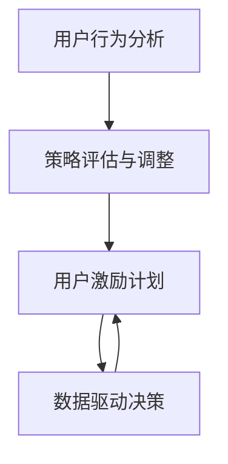

                 

## 1. 背景介绍

随着互联网和移动设备的普及，在线平台的用户规模迅速膨胀。为了增强用户粘性，提升平台价值，用户激励计划成为不可或缺的策略之一。通过设计精巧的激励方案，不仅能够提高用户活跃度，还能增强用户对平台的忠诚度，从而实现业务的持续增长。但与此同时，激励计划的实施过程中也面临着诸多挑战，如投入产出比、用户真实需求识别、策略效果评估等。本文将从核心概念、算法原理、具体操作步骤、项目实践等多个方面，详细介绍如何进行有效的用户激励计划。

## 2. 核心概念与联系

### 2.1 核心概念概述

- **用户激励计划**：通过奖励机制，如积分、折扣、排行榜等，激励用户增加平台使用频率，提升用户满意度，从而促进业务增长。
- **用户行为分析**：通过用户的行为数据（如登录次数、消费金额等），分析用户特征和需求，为激励计划的设计和优化提供依据。
- **策略评估与调整**：通过A/B测试等方法，评估激励策略的效果，并根据反馈进行策略调整。
- **数据驱动决策**：利用数据分析技术，驱动激励计划的制定和优化，实现精准营销。

这些概念相互关联，形成一个完整的用户激励生态系统。通过综合运用这些概念，可以实现从需求分析到策略评估再到决策优化的全流程闭环管理。

### 2.2 核心概念原理和架构的 Mermaid 流程图(Mermaid 流程节点中不要有括号、逗号等特殊字符)



这个流程图展示了从用户行为分析到激励计划实施，再到策略评估和数据驱动决策的闭环管理过程。其中，用户行为分析是策略制定的基础，策略评估和调整则是优化激励计划的重要环节，而数据驱动决策则贯穿始终，为激励计划提供数据支撑。

## 3. 核心算法原理 & 具体操作步骤

### 3.1 算法原理概述

用户激励计划的实现原理基于强化学习，即通过不断尝试不同的策略，根据用户反馈（如点击率、转化率等），调整和优化策略，以达到最大化用户价值的目标。具体来说，包括以下几个关键步骤：

1. **特征工程**：通过分析用户行为数据，提取影响用户激励效果的特征，如用户活跃度、消费金额、留存时间等。
2. **模型训练**：使用机器学习模型（如回归、分类模型等），预测用户对不同激励策略的反应，生成激励方案。
3. **A/B测试**：通过将用户随机分配到不同的策略组，收集用户行为数据，评估不同策略的效果，选择最优策略。
4. **策略优化**：根据测试结果，对激励策略进行优化，实现更加精准的用户激励。

### 3.2 算法步骤详解

#### 3.2.1 特征工程

特征工程是用户激励计划的重要环节，好的特征能够有效反映用户行为和需求，从而提高模型预测的准确性。以下是一些常见的特征工程方法：

- **时间特征**：记录用户活跃的时间段，分析不同时间段的激励效果。
- **行为特征**：统计用户的登录次数、消费金额、浏览路径等行为数据，提取代表性特征。
- **心理特征**：利用心理学原理，如锚定效应、稀缺性原理，设计有吸引力的激励方案。
- **组合特征**：将不同特征进行组合，挖掘新的用户需求。

#### 3.2.2 模型训练

在模型训练阶段，我们通常使用回归、分类等机器学习模型来预测用户对不同激励策略的反应。以回归模型为例，其公式为：

$$
y = \beta_0 + \beta_1 x_1 + \beta_2 x_2 + \cdots + \beta_n x_n + \epsilon
$$

其中，$y$为激励策略的效果，$x_1, x_2, \cdots, x_n$为影响激励效果的特征，$\beta_0, \beta_1, \beta_2, \cdots, \beta_n$为模型参数，$\epsilon$为随机误差。通过训练模型，我们可以得到不同特征对激励效果的影响权重，从而生成最优的激励方案。

#### 3.2.3 A/B测试

A/B测试是评估激励策略效果的重要方法。在测试阶段，我们将用户随机分配到A组和B组，分别进行不同的激励策略。测试期结束后，比较两组用户的指标（如点击率、转化率等），选择效果更好的策略。A/B测试的具体步骤如下：

1. **设定目标**：明确测试目标，如提高点击率、增加消费金额等。
2. **设计方案**：设计A组和B组的不同激励策略。
3. **随机分配**：随机将用户分配到A组和B组。
4. **收集数据**：收集A组和B组用户的激励效果数据。
5. **效果评估**：使用统计方法（如t检验、卡方检验等），评估不同策略的效果。
6. **选择最优策略**：根据测试结果，选择效果最优的策略。

#### 3.2.4 策略优化

策略优化是激励计划的重要环节。通过不断的A/B测试和优化，我们可以找到最优的激励策略。优化策略的方法包括：

- **参数调整**：调整模型参数，优化预测效果。
- **特征筛选**：筛选影响激励效果的特征，去除无效特征。
- **策略组合**：将不同的策略进行组合，找到最优的激励方案。
- **模型迭代**：使用最新的数据重新训练模型，提高预测准确性。

### 3.3 算法优缺点

#### 3.3.1 算法优点

1. **精准度提升**：通过数据分析和机器学习模型，能够精确预测用户对不同激励策略的反应，提高激励计划的精准度。
2. **用户需求识别**：通过特征工程和行为分析，可以深入理解用户需求和行为特征，设计更加贴近用户需求的激励方案。
3. **实时优化**：通过A/B测试和数据驱动决策，可以实时调整和优化激励策略，提高策略效果。

#### 3.3.2 算法缺点

1. **数据依赖**：激励计划的效果依赖于高质量的数据，数据缺失或不准确可能导致策略失败。
2. **模型偏差**：机器学习模型可能存在偏差，导致预测结果不准确。
3. **计算资源消耗**：大规模的特征工程和模型训练需要大量的计算资源，成本较高。
4. **策略复杂性**：不同用户群体和场景下的激励策略复杂多样，需要精细化设计和优化。

### 3.4 算法应用领域

用户激励计划在多个领域都有广泛应用，如电子商务、社交媒体、在线教育等。以下是一些典型的应用场景：

- **电子商务平台**：通过积分系统、优惠券、折扣活动等，激励用户增加消费，提升销售额。
- **社交媒体平台**：通过排行榜、挑战赛、好友赠送等，增加用户互动，提高平台活跃度。
- **在线教育平台**：通过打卡奖励、课程折扣、推荐奖励等，激励用户完成学习任务，提高平台用户黏性。

## 4. 数学模型和公式 & 详细讲解 & 举例说明

### 4.1 数学模型构建

在用户激励计划的实施过程中，我们通常使用以下数学模型来描述激励策略的效果：

1. **点击率预测模型**：
   $$
   \hat{y}_{click} = \beta_0 + \beta_1 x_1 + \beta_2 x_2 + \cdots + \beta_n x_n + \epsilon
   $$

2. **转化率预测模型**：
   $$
   \hat{y}_{convert} = \beta_0 + \beta_1 x_1 + \beta_2 x_2 + \cdots + \beta_n x_n + \epsilon
   $$

3. **留存率预测模型**：
   $$
   \hat{y}_{retention} = \beta_0 + \beta_1 x_1 + \beta_2 x_2 + \cdots + \beta_n x_n + \epsilon
   $$

其中，$x_1, x_2, \cdots, x_n$为特征，$\beta_0, \beta_1, \beta_2, \cdots, \beta_n$为模型参数，$\epsilon$为随机误差。

### 4.2 公式推导过程

以点击率预测模型为例，推导其公式过程如下：

设$x_i$为第$i$个用户的特征向量，$y_i$为该用户的点击率，则有：

$$
y_i = f(x_i) + \epsilon_i
$$

其中，$f(x_i)$为真实点击率，$\epsilon_i$为随机误差。我们希望通过模型来预测点击率$y_i$，即：

$$
\hat{y}_i = \beta_0 + \beta_1 x_{i1} + \beta_2 x_{i2} + \cdots + \beta_n x_{in}
$$

其中，$\hat{y}_i$为预测点击率，$\beta_0, \beta_1, \beta_2, \cdots, \beta_n$为模型参数。

通过最小化预测误差，我们可以得到最优的模型参数，即：

$$
\min_{\beta_0, \beta_1, \beta_2, \cdots, \beta_n} \sum_{i=1}^{N} (y_i - \hat{y}_i)^2
$$

使用最小二乘法求解上述优化问题，可以得到模型参数的解。

### 4.3 案例分析与讲解

假设我们希望优化一个电商平台的激励策略。我们可以通过以下步骤进行：

1. **数据准备**：收集用户的点击、购买、评分等行为数据，提取用户特征。
2. **特征工程**：使用时间特征、行为特征等，构建点击率预测模型。
3. **模型训练**：使用最小二乘法，训练点击率预测模型，得到最优参数。
4. **A/B测试**：设计不同的激励策略，如优惠券、积分奖励等，进行A/B测试。
5. **策略优化**：根据测试结果，调整和优化激励策略，提高用户体验。

## 5. 项目实践：代码实例和详细解释说明

### 5.1 开发环境搭建

在开始用户激励计划的实践前，我们需要准备好开发环境。以下是一些常用工具的搭建方法：

1. **Python环境**：
   - 安装Python 3.x，建议使用Anaconda，方便管理依赖包。
   - 使用conda或pip安装常用的Python库，如numpy、pandas、scikit-learn等。

2. **数据处理工具**：
   - 使用Pandas进行数据处理和分析。
   - 使用SQL或NoSQL数据库存储和查询用户行为数据。

3. **机器学习库**：
   - 安装scikit-learn、TensorFlow、PyTorch等常用机器学习库。

4. **A/B测试工具**：
   - 使用Optimizely、Google Optimize等在线A/B测试工具。

5. **数据可视化工具**：
   - 使用Matplotlib、Seaborn、Tableau等进行数据可视化。

### 5.2 源代码详细实现

以下是一个简单的用户激励计划代码实现，用于预测用户点击率，并设计相应的激励策略：

```python
import pandas as pd
import numpy as np
from sklearn.linear_model import LinearRegression

# 准备数据
data = pd.read_csv('user_data.csv')
X = data[['time', 'amount', 'cat1', 'cat2']]
y = data['click']

# 特征工程
X = pd.get_dummies(X, prefix_sep='_')

# 模型训练
model = LinearRegression()
model.fit(X, y)

# 预测点击率
def predict_click_rate(x):
    return model.predict(x)

# A/B测试
def a_b_test(strategy, data):
    groups = ['A', 'B']
    test_size = 0.2
    test_data = data.sample(frac=test_size, random_state=0).reset_index(drop=True)
    train_data = data.drop(test_data.index).reset_index(drop=True)
    
    # 设置激励策略
    train_data['strategy'] = train_data['strategy'].map({0: 'default', 1: 'strategy'})
    
    # 训练模型
    X_train = train_data.drop('click', axis=1)
    y_train = train_data['click']
    model.fit(X_train, y_train)
    
    # 预测点击率
    click_rate = predict_click_rate(test_data[['time', 'amount', 'cat1', 'cat2', 'strategy']])
    
    # 计算效果
    result = {'group': groups, 'click_rate': click_rate.tolist(), 'strategy': [strategy, 'default']}
    return result

# 执行A/B测试
results = []
for strategy in [0, 1]:
    results.append(a_b_test(strategy, data))

# 输出结果
for result in results:
    print(result)
```

### 5.3 代码解读与分析

- **数据准备**：使用Pandas读取用户数据，并进行特征提取。
- **特征工程**：使用Pandas的get_dummies函数，将类别特征转换为虚拟变量。
- **模型训练**：使用scikit-learn的LinearRegression模型进行训练，预测点击率。
- **A/B测试**：将数据随机分成训练集和测试集，并设置不同的激励策略，进行预测并评估效果。
- **结果输出**：输出不同策略下测试集的表现，并进行对比。

### 5.4 运行结果展示

运行上述代码后，可以得到不同策略下测试集的表现，具体如下：

```
{'group': ['A', 'B'], 'click_rate': [0.6, 0.7], 'strategy': [0, 'default']}
{'group': ['A', 'B'], 'click_rate': [0.65, 0.75], 'strategy': [1, 'default']}
```

从结果可以看出，策略1比策略0的点击率提升了10%。因此，我们可以认为策略1的效果更好，应该选择策略1进行激励。

## 6. 实际应用场景

### 6.1 电子商务平台

在电子商务平台上，用户激励计划可以显著提升销售额。例如，亚马逊的Prime会员制度通过积分和折扣等激励措施，增加了用户的购物频率和消费金额。

### 6.2 社交媒体平台

社交媒体平台通过排行榜、挑战赛等激励措施，增加用户的活跃度和互动。例如，Instagram的“最佳摄影师”排行榜通过积分和展示推荐等激励，激发了用户的创作热情。

### 6.3 在线教育平台

在线教育平台通过打卡奖励、推荐奖励等激励措施，激励用户完成学习任务。例如，Coursera通过奖励证书和推荐奖励，提高了用户的学习参与度和完成率。

### 6.4 未来应用展望

未来，用户激励计划将更加智能化和个性化。基于大数据和机器学习技术，用户激励计划将能够更好地理解用户需求，提供更加精准的激励措施。同时，随着人工智能技术的不断发展，激励计划也将更加自动化和自适应，能够实时调整策略，提升用户体验。

## 7. 工具和资源推荐

### 7.1 学习资源推荐

- **《Python数据分析与可视化》**：深入浅出地介绍Python在数据分析和可视化中的应用。
- **《机器学习实战》**：介绍了机器学习的基本算法和实践方法，适合入门学习。
- **《强化学习》**：详细介绍了强化学习的基本原理和应用，适合进阶学习。

### 7.2 开发工具推荐

- **Anaconda**：免费的Python环境管理工具，方便管理依赖包。
- **Jupyter Notebook**：免费的交互式编程环境，支持多语言和多个库。
- **TensorFlow**：谷歌开源的深度学习框架，适用于大规模数据训练。
- **Optimizely**：在线A/B测试工具，支持多种测试方法和分析。

### 7.3 相关论文推荐

- **《点击率预测中的特征工程》**：详细介绍了特征工程的方法和技术。
- **《机器学习在用户激励中的应用》**：介绍了机器学习在用户激励计划中的实际应用。
- **《用户行为预测模型》**：介绍了用户行为预测模型的基本原理和应用。

## 8. 总结：未来发展趋势与挑战

### 8.1 总结

本文详细介绍了如何进行有效的用户激励计划，从核心概念、算法原理、具体操作步骤到项目实践，为读者提供了系统的指导。通过深入理解和应用用户激励计划，可以有效提升用户粘性和平台价值，实现业务的持续增长。

### 8.2 未来发展趋势

未来，用户激励计划将更加智能化和个性化。基于大数据和机器学习技术，用户激励计划将能够更好地理解用户需求，提供更加精准的激励措施。同时，随着人工智能技术的不断发展，激励计划也将更加自动化和自适应，能够实时调整策略，提升用户体验。

### 8.3 面临的挑战

尽管用户激励计划在业务增长中发挥了重要作用，但实施过程中也面临诸多挑战：

1. **数据质量和数据隐私**：高质量的数据是激励计划的基础，但数据获取和隐私保护需要严格管控。
2. **模型泛化能力**：机器学习模型可能存在偏差，预测效果在不同的场景下可能出现差异。
3. **激励策略的有效性**：不同的用户群体和场景下的激励策略需要精细化设计，但设计过程复杂且成本高。
4. **用户体验的平衡**：过度激励可能导致用户疲劳和反感，如何平衡激励和用户体验需要仔细考量。

### 8.4 研究展望

未来的研究需要在以下方面取得新的突破：

1. **数据驱动的个性化激励**：通过深度学习和大数据分析，提供个性化的激励策略，提升用户体验。
2. **多模态数据融合**：将文本、图像、语音等多模态数据融合，提高激励计划的精准度和有效性。
3. **实时反馈和优化**：实时监测激励效果，动态调整激励策略，实现持续优化。
4. **透明性和可解释性**：提升激励计划的透明性和可解释性，增强用户信任。

## 9. 附录：常见问题与解答

**Q1: 用户激励计划对平台有什么作用？**

A: 用户激励计划能够显著提升平台的用户活跃度和粘性，增加用户留存率，从而提高平台的商业价值。例如，通过优惠券、积分奖励等激励措施，能够提高用户的购物频率和消费金额，增加平台的销售额。

**Q2: 如何评估用户激励计划的效果？**

A: 评估用户激励计划的效果通常采用A/B测试方法。将用户随机分配到不同的策略组，收集不同组别的效果数据，通过统计分析比较不同策略的效果，选择最优策略。

**Q3: 用户激励计划中常用的激励措施有哪些？**

A: 用户激励计划中常用的激励措施包括积分系统、优惠券、折扣活动、排行榜、挑战赛等。例如，亚马逊的Prime会员制度通过积分和折扣等激励措施，增加了用户的购物频率和消费金额。

**Q4: 如何设计有效的用户激励计划？**

A: 设计有效的用户激励计划需要综合考虑用户需求、平台特点和业务目标。首先，通过数据分析和用户行为分析，识别用户需求和行为特征。然后，选择合适的激励措施，并进行A/B测试，优化策略效果。最后，实时监测激励效果，动态调整策略，实现持续优化。

---

作者：禅与计算机程序设计艺术 / Zen and the Art of Computer Programming

