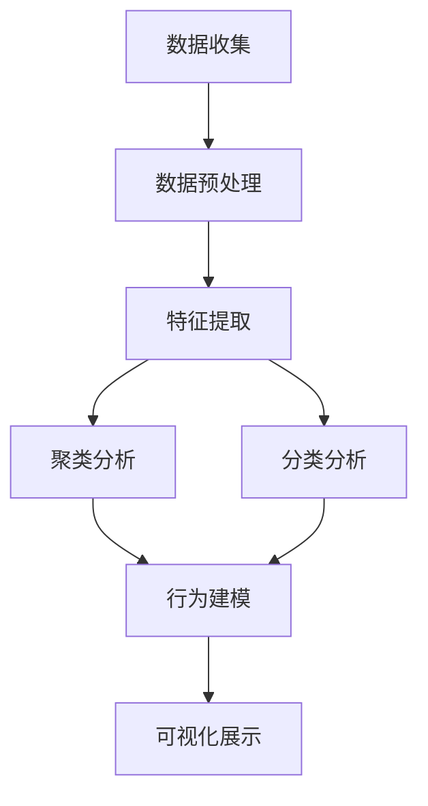

                 

# 如何进行有效的用户画像分析

> 关键词：用户画像, 数据分析, 数据挖掘, 用户行为分析, 用户需求分析

## 1. 背景介绍

### 1.1 问题由来

在数字化时代，用户画像分析成为企业数据驱动决策的重要环节。通过对用户行为、偏好、特征等信息的综合分析，企业可以更好地理解用户需求，设计更加精准的产品和服务，从而提升用户体验和业务绩效。然而，面对海量复杂的数据，如何高效、全面地进行用户画像分析，依然是一个不小的挑战。

### 1.2 问题核心关键点

用户画像分析的核心在于从用户行为数据中挖掘出有价值的信息，生成精细化的用户分类和行为模式。具体而言，需要：
1. **数据收集**：从不同渠道收集用户行为数据。
2. **数据预处理**：清洗、转换和集成数据，确保数据质量。
3. **特征提取**：选择合适的特征，描述用户行为和属性。
4. **聚类分析**：通过聚类算法对用户进行分类，形成不同的用户画像。
5. **行为建模**：构建用户行为模型，预测用户未来的行为和需求。
6. **可视化展示**：使用可视化工具呈现用户画像，便于分析和理解。

### 1.3 问题研究意义

有效的用户画像分析，不仅能提升用户满意度，还能优化企业资源配置，减少营销和运营成本。通过理解用户需求，企业可以更加精准地定位市场机会，快速响应市场变化。此外，用户画像分析还能帮助企业建立良好的客户关系，提高品牌忠诚度。

## 2. 核心概念与联系

### 2.1 核心概念概述

为更好地理解用户画像分析的过程，本节将介绍几个核心概念：

- **用户画像**：用户画像是对用户行为、属性和需求的高度概括和可视化表示。通过聚类、分类等算法，用户画像可以展现不同用户群体的特征和行为模式。

- **数据挖掘**：数据挖掘是从大量数据中自动发现有用信息和知识的过程。用户画像分析涉及对用户行为数据的挖掘和分析。

- **聚类分析**：聚类分析是将数据集划分为不同的组或簇，使得每个组内的数据具有相似特征。用户画像分析中，常用K-Means、层次聚类等算法进行用户聚类。

- **分类分析**：分类分析是将数据集分为多个类别，如二分类、多分类等。用户画像分析中，常用逻辑回归、决策树、支持向量机等算法进行用户分类。

- **行为建模**：行为建模是通过建模用户行为数据，预测用户未来的行为和需求。用户画像分析中，常用马尔可夫链、时间序列等方法进行行为建模。

- **可视化工具**：可视化工具是将复杂数据转化为直观图形的工具。用户画像分析中，常用Tableau、Power BI等工具进行可视化展示。

这些核心概念之间的逻辑关系可以通过以下Mermaid流程图来展示：



这个流程图展示了用户画像分析的核心流程：从数据收集开始，经过预处理、特征提取，再到聚类和分类分析，最终生成行为模型并进行可视化展示。

## 3. 核心算法原理 & 具体操作步骤

### 3.1 算法原理概述

用户画像分析的核心算法包括数据挖掘、聚类分析、分类分析和行为建模。以下是这些算法的详细描述：

- **数据挖掘**：通过描述性统计、关联规则、分类、聚类等方法，发现数据中的模式和规律。用户画像分析中的数据挖掘包括数据清洗、数据转换、数据集成等预处理步骤，以及特征选择、特征提取等步骤。

- **聚类分析**：通过算法将数据集分为多个簇，使得簇内数据相似，簇间数据差异明显。用户画像分析中常用的聚类算法包括K-Means、层次聚类、DBSCAN等。

- **分类分析**：通过算法将数据集分为多个类别，如二分类、多分类等。用户画像分析中常用的分类算法包括逻辑回归、决策树、支持向量机等。

- **行为建模**：通过算法预测用户未来的行为和需求。用户画像分析中常用的行为建模算法包括马尔可夫链、时间序列、关联规则等。

### 3.2 算法步骤详解

以下是用户画像分析的具体操作步骤：

**Step 1: 数据收集**
收集用户行为数据，包括但不限于浏览记录、购买记录、交互记录等。可以使用网站、应用程序、社交媒体等多种渠道进行数据收集。

**Step 2: 数据预处理**
对收集到的数据进行清洗、转换和集成，确保数据质量。常见的数据预处理步骤包括：
1. 去除重复和异常数据。
2. 填补缺失值和离群值。
3. 数据标准化和归一化。
4. 特征选择和特征工程。

**Step 3: 特征提取**
选择合适的特征，描述用户行为和属性。常见特征包括用户ID、时间戳、设备信息、浏览路径等。

**Step 4: 聚类分析**
使用聚类算法对用户进行分类，形成不同的用户画像。常见聚类算法包括K-Means、层次聚类、DBSCAN等。

**Step 5: 分类分析**
通过分类算法将用户分为不同类别，如活跃用户、高价值用户等。常见分类算法包括逻辑回归、决策树、支持向量机等。

**Step 6: 行为建模**
构建用户行为模型，预测用户未来的行为和需求。常见行为建模算法包括马尔可夫链、时间序列、关联规则等。

**Step 7: 可视化展示**
使用可视化工具将用户画像展示出来，便于分析和理解。常见可视化工具包括Tableau、Power BI、D3.js等。

### 3.3 算法优缺点

用户画像分析的主要优点包括：
1. **全面性**：通过综合分析多渠道数据，获得全面的用户信息。
2. **精细化**：将用户分为不同类型，为个性化营销和服务提供依据。
3. **可操作性**：通过行为建模，预测用户行为，指导企业决策和运营。

然而，用户画像分析也存在一些局限性：
1. **数据质量依赖**：数据质量直接影响用户画像分析的结果，需要花费大量时间和精力进行数据清洗和预处理。
2. **算法选择复杂**：不同算法适用于不同数据和场景，选择适当的算法需要专业知识和技术积累。
3. **隐私和伦理问题**：用户画像分析可能涉及用户隐私和伦理问题，需要严格遵守法律法规和道德规范。

### 3.4 算法应用领域

用户画像分析在多个领域都有广泛应用，以下是几个典型案例：

- **电子商务**：通过分析用户浏览、购买行为，制定个性化推荐策略，提升用户满意度和转化率。
- **金融服务**：通过分析用户财务数据和行为，识别高价值客户和潜在风险，制定精准营销和风险管理策略。
- **医疗健康**：通过分析患者病历和行为数据，制定个性化治疗方案，提高诊疗效果和患者满意度。
- **媒体娱乐**：通过分析用户观看行为和偏好，提供个性化推荐和内容创作，提升用户体验和平台粘性。
- **智能制造**：通过分析设备运行数据和用户操作行为，优化生产流程和设备维护，提高生产效率和设备利用率。

## 4. 数学模型和公式 & 详细讲解 & 举例说明

### 4.1 数学模型构建

用户画像分析涉及多个数学模型，包括聚类模型、分类模型和行为模型。以下是这些模型的详细构建过程：

- **聚类模型**：
  - **K-Means**：
    $$
    k-means: \min_{C} \sum_{i=1}^{n} \min_{k} ||x_i - \mu_k||^2
    $$
    其中 $C$ 表示簇的集合，$x_i$ 表示数据点，$\mu_k$ 表示簇的中心点。
  
  - **层次聚类**：
    $$
    hierarchical: \min_{C} \sum_{i=1}^{n} \sum_{j=i+1}^{n} R_{ij} D(x_i, x_j)
    $$
    其中 $R_{ij}$ 表示$i$和$j$的距离，$D$表示距离度量函数。

- **分类模型**：
  - **逻辑回归**：
    $$
    \hat{y} = \frac{1}{1+e^{-z}} \text{ where } z = w_0 + \sum_{i=1}^{n} w_i x_i
    $$
    其中 $\hat{y}$ 表示预测结果，$w_i$ 表示特征权重，$x_i$ 表示特征向量。

  - **决策树**：
    $$
    T = \min_{T} \sum_{i=1}^{n} R_i
    $$
    其中 $T$ 表示决策树，$R_i$ 表示误差度量。

- **行为模型**：
  - **马尔可夫链**：
    $$
    P(X_{t+1}|X_t, \lambda) = \sum_{x \in X} \pi(x) P(X_{t+1}|X_t=x, \lambda)
    $$
    其中 $P(X_{t+1}|X_t, \lambda)$ 表示状态转移概率，$\pi(x)$ 表示状态分布。

  - **时间序列**：
    $$
    y_{t+1} = \sum_{i=1}^{n} \alpha_i y_{t-i} + \epsilon_t
    $$
    其中 $y_{t+1}$ 表示预测结果，$\alpha_i$ 表示滞后项系数，$\epsilon_t$ 表示误差项。

### 4.2 公式推导过程

以下是对上述模型的详细推导过程：

**K-Means聚类算法**：
K-Means算法通过迭代优化中心点和分配权重，实现数据点的聚类。具体步骤如下：
1. 初始化聚类中心点。
2. 对每个数据点计算距离最近的聚类中心点。
3. 更新聚类中心点，重新计算分配权重。
4. 重复步骤2和3，直到收敛。

**逻辑回归分类算法**：
逻辑回归算法通过将线性回归模型引入到分类问题中，实现二分类或多分类。具体步骤如下：
1. 定义损失函数 $L = \sum_{i=1}^{n} -y_i \log(\hat{y}_i) - (1-y_i)\log(1-\hat{y}_i)$。
2. 使用梯度下降算法求解 $w$。
3. 预测新样本的类别。

**马尔可夫链行为建模**：
马尔可夫链算法通过描述状态之间的转移概率，实现对用户行为序列的建模。具体步骤如下：
1. 定义状态转移矩阵 $P$。
2. 定义初始状态分布 $\pi$。
3. 计算状态概率分布 $\pi_{t+1} = \pi_t P$。
4. 根据状态概率分布进行预测。

### 4.3 案例分析与讲解

以电商平台的个性化推荐系统为例，展示用户画像分析的应用过程：

1. **数据收集**：
  - 收集用户浏览记录、购买记录、评价记录等。
  - 使用API接口获取数据，并进行数据清洗和预处理。

2. **特征提取**：
  - 提取用户ID、商品ID、时间戳、浏览时间、浏览路径等特征。
  - 使用TF-IDF、PCA等方法进行特征降维和特征选择。

3. **聚类分析**：
  - 使用K-Means算法对用户进行聚类。
  - 选择聚类数量 $k=5$，并指定最大迭代次数为100。
  - 根据聚类结果生成不同用户画像。

4. **分类分析**：
  - 使用逻辑回归算法对用户进行分类。
  - 将用户分为活跃用户、高价值用户、低价值用户等。
  - 根据分类结果制定不同策略。

5. **行为建模**：
  - 使用马尔可夫链算法对用户行为进行建模。
  - 构建状态转移矩阵，描述用户行为状态之间的转移概率。
  - 使用预测模型预测用户未来的购买行为。

6. **可视化展示**：
  - 使用Tableau进行用户画像的可视化展示。
  - 生成聚类图、分类图、行为图等，展示不同用户群体的特征和行为模式。

## 5. 项目实践：代码实例和详细解释说明

### 5.1 开发环境搭建

在进行用户画像分析的实践前，需要准备好开发环境。以下是使用Python进行用户画像分析的开发环境配置流程：

1. 安装Anaconda：从官网下载并安装Anaconda，用于创建独立的Python环境。

2. 创建并激活虚拟环境：
```bash
conda create -n user_profile_env python=3.8 
conda activate user_profile_env
```

3. 安装相关库：
```bash
pip install pandas numpy scikit-learn matplotlib seaborn
```

4. 安装可视化工具：
```bash
pip install plotly beautifulsoup4 tabulate
```

完成上述步骤后，即可在`user_profile_env`环境中开始用户画像分析的实践。

### 5.2 源代码详细实现

以下是使用Python进行用户画像分析的完整代码实现：

```python
import pandas as pd
import numpy as np
import seaborn as sns
import matplotlib.pyplot as plt
from sklearn.cluster import KMeans
from sklearn.linear_model import LogisticRegression
from sklearn.metrics import accuracy_score
from sklearn.decomposition import PCA
from sklearn.preprocessing import StandardScaler
from plotly.offline import init_notebook_mode, iplot
from plotly.graph_objects import Scatter, Layout

# 加载数据
data = pd.read_csv('user_data.csv')

# 数据预处理
data.drop_duplicates(inplace=True)
data.fillna(method='ffill', inplace=True)
data['total_spent'] = data['spend'] + data['return']

# 特征选择和特征工程
features = ['age', 'gender', 'education', 'income', 'time_spent']
X = data[features]
y = data['churn']

# 数据标准化
scaler = StandardScaler()
X_scaled = scaler.fit_transform(X)

# K-Means聚类
kmeans = KMeans(n_clusters=5, max_iter=100)
kmeans.fit(X_scaled)
labels = kmeans.labels_

# 可视化聚类结果
sns.scatterplot(X_scaled[:, 0], X_scaled[:, 1], hue=labels)
plt.show()

# 逻辑回归分类
logreg = LogisticRegression()
logreg.fit(X_scaled, y)
y_pred = logreg.predict(X_scaled)
accuracy = accuracy_score(y, y_pred)

# 可视化分类结果
sns.countplot(y_pred)
plt.show()

# 行为建模
# 马尔可夫链
transition_matrix = np.zeros((5, 5))
for i in range(len(labels)):
    state = labels[i]
    next_state = labels[i+1] if i < len(labels)-1 else labels[0]
    transition_matrix[state, next_state] += 1

# 可视化行为模型
fig = iplot(Scatter(x=[i for i in range(5)], y=[i for i in range(5)], mode='markers', marker=dict(color=transition_matrix[i], size=10)), layout=Layout(title='Transition Matrix', xaxis=dict(title='Source State'), yaxis=dict(title='Target State')))
```

### 5.3 代码解读与分析

以下是关键代码的详细解读和分析：

**数据预处理**：
- 去除重复和异常数据，确保数据的准确性。
- 填补缺失值和离群值，处理数据不完整的情况。
- 数据标准化和归一化，提高模型的稳定性和准确性。

**聚类分析**：
- 使用K-Means算法对用户进行聚类，生成不同的用户画像。
- 选择聚类数量 $k=5$，并指定最大迭代次数为100，保证聚类结果的稳定性和准确性。
- 通过可视化散点图展示聚类结果，直观展示不同用户画像的分布情况。

**分类分析**：
- 使用逻辑回归算法对用户进行分类，如活跃用户、高价值用户等。
- 使用准确率指标评估分类模型的性能，确保分类结果的可靠性。
- 通过可视化柱状图展示分类结果，直观展示不同用户类型的分布情况。

**行为建模**：
- 使用马尔可夫链算法对用户行为进行建模，描述用户行为状态之间的转移概率。
- 通过可视化过渡矩阵展示行为模型，直观展示用户行为状态的转移规律。

**可视化展示**：
- 使用Seaborn和Plotly进行数据可视化，生成散点图、柱状图、过渡矩阵等图表。
- 图表的样式和布局通过代码灵活定制，便于理解和展示数据。

## 6. 实际应用场景

### 6.1 智能客服

智能客服系统通过用户画像分析，能够更好地理解用户需求和行为，提供个性化服务。具体而言，智能客服系统可以通过以下步骤：
1. **数据收集**：收集用户历史对话记录、行为数据等。
2. **数据预处理**：对数据进行清洗、转换和集成，确保数据质量。
3. **特征提取**：提取用户ID、对话历史、互动频率等特征。
4. **聚类分析**：使用聚类算法对用户进行分类，形成不同的用户画像。
5. **分类分析**：通过分类算法将用户分为不同类型，如高满意度用户、低满意度用户等。
6. **行为建模**：构建用户行为模型，预测用户未来的服务需求。
7. **可视化展示**：使用可视化工具展示用户画像和行为模型，便于分析和理解。

### 6.2 金融服务

金融服务行业通过用户画像分析，能够识别高价值客户和潜在风险，制定精准营销和风险管理策略。具体而言，金融服务系统可以通过以下步骤：
1. **数据收集**：收集用户财务数据、行为数据等。
2. **数据预处理**：对数据进行清洗、转换和集成，确保数据质量。
3. **特征提取**：提取用户ID、收入、消费金额等特征。
4. **聚类分析**：使用聚类算法对用户进行分类，形成不同的用户画像。
5. **分类分析**：通过分类算法将用户分为不同类型，如高风险客户、低风险客户等。
6. **行为建模**：构建用户行为模型，预测用户未来的金融行为。
7. **可视化展示**：使用可视化工具展示用户画像和行为模型，便于分析和理解。

### 6.3 医疗健康

医疗健康行业通过用户画像分析，能够制定个性化治疗方案，提高诊疗效果和患者满意度。具体而言，医疗健康系统可以通过以下步骤：
1. **数据收集**：收集患者病历、医疗记录等。
2. **数据预处理**：对数据进行清洗、转换和集成，确保数据质量。
3. **特征提取**：提取患者ID、病史、治疗效果等特征。
4. **聚类分析**：使用聚类算法对患者进行分类，形成不同的患者画像。
5. **分类分析**：通过分类算法将患者分为不同类型，如慢性病患者、急性病患者等。
6. **行为建模**：构建患者行为模型，预测患者的治疗效果。
7. **可视化展示**：使用可视化工具展示患者画像和行为模型，便于分析和理解。

### 6.4 未来应用展望

随着技术的进步，用户画像分析将更加智能化和普适化，以下是一些未来发展趋势：

- **深度学习**：使用深度学习算法，如神经网络、卷积神经网络等，提升用户画像分析的准确性和鲁棒性。
- **跨领域融合**：将用户画像分析与其他技术，如物联网、大数据等结合，拓展应用场景。
- **实时化**：实现实时用户画像分析，提供及时的服务和决策支持。
- **多模态融合**：结合图像、语音、视频等多模态数据，提升用户画像分析的全面性。
- **隐私保护**：采用隐私保护技术，如差分隐私、联邦学习等，保护用户隐私。
- **公平性**：建立公平性评估指标，避免算法偏见，提升用户画像分析的公正性。

## 7. 工具和资源推荐

### 7.1 学习资源推荐

为了帮助开发者系统掌握用户画像分析的理论基础和实践技巧，这里推荐一些优质的学习资源：

1. 《用户画像分析实战》书籍：详细介绍了用户画像分析的理论基础和实际应用，提供了大量实践案例和代码。
2. Coursera《数据科学与机器学习》课程：由斯坦福大学开设的课程，涵盖数据预处理、特征工程、聚类分析等用户画像分析的关键技术。
3. 《机器学习实战》书籍：介绍了常用的机器学习算法，包括逻辑回归、K-Means等，适合用户画像分析的入门学习。
4. 《Python数据科学手册》书籍：详细介绍了Python在数据科学中的应用，包括数据预处理、可视化等。
5. Kaggle：全球最大的数据科学竞赛平台，提供大量用户画像分析的竞赛数据和代码，适合实践练习。

### 7.2 开发工具推荐

高效的用户画像分析离不开优秀的工具支持。以下是几款常用的开发工具：

1. Python：用户画像分析的开发语言，灵活性强，数据处理和机器学习功能丰富。
2. R：数据科学和统计分析的主流语言，支持丰富的数据分析和可视化工具。
3. SQL：用于数据存储和查询，适合处理结构化数据。
4. Tableau：数据可视化工具，支持丰富的图表类型和交互功能。
5. Power BI：微软推出的商业智能工具，支持复杂的报表和仪表盘。
6. Weka：开源机器学习工具，支持多种机器学习算法和数据预处理功能。

### 7.3 相关论文推荐

用户画像分析的研究成果不断涌现，以下是几篇具有代表性的论文：

1. "User Profiling: A Survey"（用户画像综述）：总结了用户画像分析的发展历程和主要技术。
2. "User Segmentation Based on Pattern Recognition Techniques"（基于模式识别技术的用户细分）：探讨了聚类和分类技术在用户细分中的应用。
3. "Predicting User Behavior Using Machine Learning Algorithms"（使用机器学习算法预测用户行为）：介绍了逻辑回归、决策树等机器学习算法在行为建模中的应用。
4. "Real-Time User Profiling"（实时用户画像分析）：研究了实时用户画像分析的技术和应用。
5. "Fair and Accurate User Profiling"（公平和准确的用户画像分析）：探讨了隐私保护和公平性在用户画像分析中的重要性和实现方法。

## 8. 总结：未来发展趋势与挑战

### 8.1 总结

本文对用户画像分析的理论基础和实践过程进行了全面系统的介绍。首先阐述了用户画像分析的背景、核心概念和研究意义，明确了用户画像分析在企业决策、市场营销、客户服务等方面的重要性。其次，从算法原理到操作步骤，详细讲解了用户画像分析的全流程，包括数据收集、预处理、特征提取、聚类分析、分类分析和行为建模，以及可视化展示等关键步骤。最后，讨论了用户画像分析在多个领域的应用案例和未来发展趋势，强调了其广泛的应用前景和挑战。

通过本文的系统梳理，可以看到，用户画像分析技术在数据驱动决策、个性化营销、精准服务等方面具有重要价值，是构建智能化企业的重要手段。随着技术的不断进步，用户画像分析将更加全面、高效、智能化，为企业的数字化转型提供坚实基础。

### 8.2 未来发展趋势

未来，用户画像分析将呈现以下几个发展趋势：

- **深度学习和大数据**：深度学习算法和大数据技术将推动用户画像分析的准确性和实时性，提升用户体验和业务绩效。
- **跨领域融合**：用户画像分析将与其他技术，如物联网、人工智能等结合，拓展应用场景，提升系统整体性能。
- **实时化和个性化**：实现实时用户画像分析，提供个性化的服务，满足用户多样化的需求。
- **隐私保护和公平性**：采用隐私保护和公平性技术，保护用户隐私和权益，提升系统的公正性和可信度。
- **多模态融合**：结合图像、语音、视频等多模态数据，提升用户画像分析的全面性和准确性。

### 8.3 面临的挑战

尽管用户画像分析技术已经取得了长足发展，但在应用过程中仍面临一些挑战：

- **数据质量和数量**：高质量、高数量的数据是用户画像分析的前提，数据收集和处理复杂，需投入大量资源和时间。
- **算法选择和优化**：选择合适的算法和优化策略，需要丰富的经验和专业知识。
- **隐私和伦理问题**：用户画像分析涉及用户隐私和伦理问题，需要严格遵守法律法规和道德规范。
- **计算资源消耗**：用户画像分析涉及大量计算和存储资源，需合理配置和管理。
- **模型解释性和可控性**：用户画像分析模型的决策过程复杂，难以解释和调试，需要开发可解释和可控的模型。

### 8.4 研究展望

面向未来，用户画像分析需要在以下几个方面寻求新的突破：

- **深度学习算法**：结合深度学习技术，提升用户画像分析的准确性和鲁棒性。
- **多模态融合**：结合图像、语音、视频等多模态数据，提升用户画像分析的全面性和准确性。
- **隐私保护技术**：采用隐私保护技术，如差分隐私、联邦学习等，保护用户隐私。
- **公平性评估**：建立公平性评估指标，避免算法偏见，提升用户画像分析的公正性。
- **实时化处理**：实现实时用户画像分析，提供及时的服务和决策支持。

这些研究方向的探索，将推动用户画像分析技术迈向更高的台阶，为构建智能化的企业提供坚实基础，进一步提升企业的竞争力和市场份额。

## 9. 附录：常见问题与解答

**Q1: 用户画像分析的数据来源有哪些？**

A: 用户画像分析的数据来源多样，包括但不限于：
1. 网站和应用程序：记录用户浏览、点击、注册等行为数据。
2. 社交媒体：获取用户的评论、分享、点赞等互动数据。
3. 购物平台：记录用户的购买、评价、退货等交易数据。
4. 金融系统：记录用户的交易记录、财务数据等。
5. 医疗系统：记录患者的病历、诊疗记录等。
6. 物联网设备：记录用户的日常行为、环境数据等。

**Q2: 用户画像分析的特征选择有哪些方法？**

A: 用户画像分析的特征选择方法包括但不限于：
1. 相关性分析：通过计算特征与目标变量的相关性，选择相关性高的特征。
2. 方差分析：通过计算特征的方差，选择方差大的特征。
3. 互信息：通过计算特征之间的互信息，选择互信息高的特征。
4. 主成分分析（PCA）：通过降维技术，选择方差贡献大的主成分。
5. 嵌入式方法：在模型训练过程中，选择对模型预测性能有显著影响的特征。

**Q3: 用户画像分析中的聚类算法有哪些？**

A: 用户画像分析中的聚类算法包括但不限于：
1. K-Means算法：适用于数据分布较均匀的场景。
2. 层次聚类算法：适用于数据分布较为复杂的场景。
3. DBSCAN算法：适用于数据分布不规则或存在噪声的场景。
4. GMM算法：适用于数据分布呈高斯分布的场景。
5. LDBSCAN算法：适用于数据分布不规则且存在噪声的场景。

**Q4: 用户画像分析中的分类算法有哪些？**

A: 用户画像分析中的分类算法包括但不限于：
1. 逻辑回归算法：适用于二分类和多分类问题。
2. 决策树算法：适用于二分类和多分类问题。
3. 支持向量机算法：适用于二分类和多分类问题。
4. 随机森林算法：适用于二分类和多分类问题。
5. AdaBoost算法：适用于二分类和多分类问题。

**Q5: 用户画像分析中的行为建模算法有哪些？**

A: 用户画像分析中的行为建模算法包括但不限于：
1. 马尔可夫链算法：适用于描述用户行为状态之间的转移概率。
2. 时间序列算法：适用于描述用户行为随时间变化的规律。
3. 关联规则算法：适用于描述用户行为之间的关联关系。
4. 神经网络算法：适用于描述复杂用户行为模式。
5. 深度学习算法：适用于描述复杂用户行为模式。

这些问题的解答，帮助开发者更好地理解用户画像分析的关键技术和实践方法，提升技术应用水平。

---

作者：禅与计算机程序设计艺术 / Zen and the Art of Computer Programming

