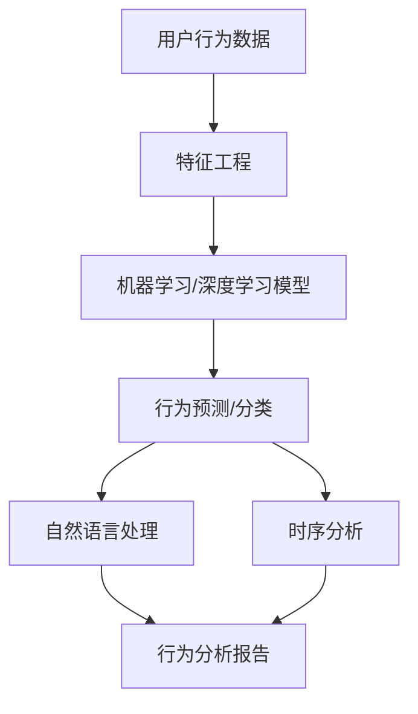

                 

# 如何进行有效的用户行为分析

> 关键词：用户行为分析, 数据挖掘, 机器学习, 深度学习, 特征工程, 自然语言处理, 时序分析, 应用场景, 技术难点, 展望与挑战

## 1. 背景介绍

### 1.1 问题由来

在数字化时代，如何深度挖掘用户行为数据，揭示背后的规律与趋势，已成为各行业竞争的关键。无论是电商、金融、社交、游戏，还是教育、医疗、政务等众多领域，用户行为分析都扮演着至关重要的角色。例如，电商平台通过分析用户点击、浏览、购买行为，可以精准推荐商品，优化用户购物体验；金融公司利用用户交易数据，可以识别风险，进行投资决策；社交平台通过用户互动数据，可以优化算法，提升用户体验。

### 1.2 问题核心关键点

用户行为分析的目的是通过分析用户的各种行为数据，如点击、浏览、搜索、购买、互动等，从中挖掘出有价值的信息和规律，以指导业务决策，提升用户体验，创造商业价值。实现这一目标，需要考虑以下几个核心关键点：

- **数据获取**：如何高效、全面地获取用户行为数据。
- **数据预处理**：如何清洗、转换、集成多源数据，使其适于分析。
- **特征工程**：如何设计有效的特征，提取有意义的特征组合。
- **模型选择**：如何选择合适的机器学习或深度学习模型，进行行为预测或分类。
- **模型评估**：如何评价模型的预测效果，识别其局限与改进方向。
- **部署应用**：如何将模型应用到实际业务场景，实现业务目标。

### 1.3 问题研究意义

用户行为分析是数据驱动决策的核心技术之一，对于提升用户满意度、优化业务流程、增强市场竞争力具有重要作用。具体而言，用户行为分析可以帮助企业：

- **提升用户体验**：通过分析用户行为，提供个性化推荐，提升用户体验。
- **优化资源配置**：通过预测用户需求，优化资源配置，提高业务效率。
- **增加用户粘性**：通过理解用户行为，设计出满足用户需求的产品和服务，增加用户粘性。
- **防范风险**：通过行为异常检测，提前识别潜在风险，保障业务安全。

## 2. 核心概念与联系

### 2.1 核心概念概述

要理解如何进行有效的用户行为分析，首先需要明确几个核心概念：

- **用户行为数据**：用户在应用、网站、产品上的行为数据，包括但不限于点击、浏览、搜索、购买、评论、互动等。
- **行为分析模型**：用于分析用户行为，预测用户行为，分类的机器学习或深度学习模型。
- **特征工程**：基于用户行为数据，设计、提取、组合特征的过程。
- **自然语言处理**：处理文本数据，提取特征，进行情感分析、主题建模等任务的技术。
- **时序分析**：处理时间序列数据，预测未来趋势，进行异常检测的技术。

这些核心概念之间的联系紧密，通过特征工程将用户行为数据转化为机器学习或深度学习模型可处理的特征向量，再由模型进行行为预测或分类，并利用自然语言处理和时序分析技术进行深入挖掘，从而揭示用户行为背后的规律与趋势。

### 2.2 核心概念原理和架构的 Mermaid 流程图



这个流程图展示了从用户行为数据到最终行为分析报告的流程。首先通过特征工程将原始数据转化为可处理的特征向量，再由机器学习或深度学习模型进行预测或分类。在此基础上，利用自然语言处理和时序分析技术进行深入挖掘，并生成分析报告，帮助业务决策。

## 3. 核心算法原理 & 具体操作步骤

### 3.1 算法原理概述

用户行为分析的算法原理主要基于机器学习和深度学习，通过对用户行为数据进行建模，预测用户未来行为，或分类用户行为类型。具体的算法原理和操作步骤如下：

1. **数据获取**：收集用户行为数据，包括日志数据、点击数据、交易数据等。
2. **数据预处理**：清洗、去重、转换、集成数据，生成特征向量。
3. **特征工程**：设计有效的特征，包括用户属性特征、行为特征、上下文特征等。
4. **模型选择**：根据任务需求，选择合适的机器学习或深度学习模型，如回归、分类、聚类、序列模型等。
5. **模型训练**：在训练集上训练模型，调整超参数，优化模型性能。
6. **模型评估**：在验证集上评估模型性能，选择最优模型。
7. **模型应用**：在测试集上测试模型性能，部署到实际业务场景。

### 3.2 算法步骤详解

**Step 1: 数据获取与预处理**

数据获取与预处理是用户行为分析的基础。具体步骤如下：

- **数据收集**：通过日志、埋点、API等方式，收集用户行为数据。确保数据的全面性和准确性。
- **数据清洗**：去除噪声、处理缺失值、处理异常值，确保数据的质量。
- **数据转换**：将原始数据转换为模型可接受的格式，如时间戳、用户ID、设备ID等。
- **数据集成**：将来自不同来源的数据集成在一起，形成统一的、一致的数据视图。

**Step 2: 特征工程**

特征工程是用户行为分析的核心环节。具体步骤如下：

- **特征设计**：根据任务需求，设计有效的特征，如用户属性特征、行为特征、上下文特征等。
- **特征提取**：通过算法或规则，从原始数据中提取特征。例如，通过时间戳提取时序特征，通过文本数据提取情感特征。
- **特征组合**：将不同的特征进行组合，形成新的特征，提高模型的预测能力。

**Step 3: 模型选择与训练**

模型选择与训练是用户行为分析的关键步骤。具体步骤如下：

- **模型选择**：根据任务需求，选择适当的机器学习或深度学习模型，如回归模型、分类模型、序列模型等。
- **模型训练**：使用训练集训练模型，调整超参数，优化模型性能。常用的超参数包括学习率、正则化系数、批大小等。
- **模型评估**：在验证集上评估模型性能，选择最优模型。常用的评估指标包括准确率、召回率、F1值等。

**Step 4: 模型应用与部署**

模型应用与部署是将用户行为分析结果应用于实际业务场景的关键步骤。具体步骤如下：

- **模型测试**：在测试集上测试模型性能，确保模型可靠。
- **模型部署**：将模型部署到实际业务场景中，进行实时行为预测或分类。
- **效果监控**：实时监控模型的预测效果，根据反馈调整模型参数，优化模型性能。

### 3.3 算法优缺点

用户行为分析算法具有以下优点：

- **预测能力强**：通过机器学习和深度学习模型，可以对用户行为进行精准预测和分类。
- **灵活性高**：可以根据任务需求，选择不同的模型，设计不同的特征。
- **可解释性强**：模型内部的决策逻辑可解释性强，有助于理解和优化业务决策。

但同时也存在一些缺点：

- **数据依赖性强**：模型的性能依赖于数据的全面性和准确性，数据质量不佳时，模型性能受影响。
- **计算资源需求高**：大规模数据的处理和模型训练需要高计算资源，硬件成本较高。
- **超参数调优复杂**：模型性能受超参数影响大，需要大量试验和调整。

### 3.4 算法应用领域

用户行为分析算法广泛应用在电商、金融、社交、游戏、教育等多个领域，具体应用场景如下：

- **电商推荐系统**：通过分析用户点击、浏览、购买行为，提供个性化推荐，提升用户体验。
- **金融风险控制**：利用用户交易数据，识别风险用户，进行风险控制和投资决策。
- **社交网络分析**：通过分析用户互动数据，优化算法，提升用户粘性，增加用户留存率。
- **游戏用户分析**：通过分析用户行为数据，优化游戏设计，提高用户粘性和游戏收益。
- **教育学习分析**：通过分析学生学习行为，提供个性化教学，提升学习效果。

## 4. 数学模型和公式 & 详细讲解 & 举例说明

### 4.1 数学模型构建

用户行为分析的数学模型主要基于机器学习和深度学习，常见模型包括线性回归、决策树、随机森林、支持向量机、神经网络、卷积神经网络等。

以线性回归模型为例，其数学模型如下：

$$
y = \theta_0 + \theta_1x_1 + \theta_2x_2 + \cdots + \theta_nx_n
$$

其中，$y$ 为预测结果，$x_i$ 为输入特征，$\theta_i$ 为模型参数。

### 4.2 公式推导过程

以线性回归模型的梯度下降算法为例，其公式推导过程如下：

假设训练集为 $D=\{(x_i,y_i)\}_{i=1}^N$，其中 $x_i=(x_{i1},x_{i2},\cdots,x_{in})$ 为输入特征向量，$y_i$ 为标签。

目标函数为均方误差：

$$
L(\theta) = \frac{1}{2N}\sum_{i=1}^N(y_i - \theta_0 - \theta_1x_{i1} - \theta_2x_{i2} - \cdots - \theta_nx_{in})^2
$$

梯度下降算法的更新规则为：

$$
\theta_j \leftarrow \theta_j - \eta \frac{1}{N}\sum_{i=1}^N (y_i - \theta_0 - \theta_1x_{i1} - \theta_2x_{i2} - \cdots - \theta_nx_{in})
$$

其中，$\eta$ 为学习率，控制每次更新的步长。

### 4.3 案例分析与讲解

以电商推荐系统为例，其核心目标是预测用户是否会购买某一商品。假设训练集为 $D=\{(x_i,y_i)\}_{i=1}^N$，其中 $x_i$ 为用户的浏览记录，$y_i$ 为是否购买。

使用线性回归模型进行预测，设计特征包括用户的浏览次数、浏览时间、浏览商品类型等。模型训练过程如下：

- **数据预处理**：清洗、转换、集成用户浏览记录数据。
- **特征工程**：设计特征 $x_1$ 表示浏览次数，$x_2$ 表示浏览时间，$x_3$ 表示浏览商品类型。
- **模型选择**：选择线性回归模型。
- **模型训练**：在训练集上训练模型，调整学习率、正则化系数等超参数。
- **模型评估**：在验证集上评估模型性能，选择最优模型。
- **模型应用**：在测试集上测试模型性能，部署到推荐系统中，实时预测用户是否会购买某一商品。

## 5. 项目实践：代码实例和详细解释说明

### 5.1 开发环境搭建

进行用户行为分析项目开发，需要搭建良好的开发环境。以下是在Python环境中搭建开发环境的详细步骤：

1. **安装Python**：确保安装了Python 3.x版本，可以通过官网下载安装包进行安装。
2. **安装依赖库**：使用pip安装必要的依赖库，如numpy、pandas、scikit-learn、tensorflow等。
3. **配置环境**：使用virtualenv或conda创建虚拟环境，确保开发环境与生产环境一致。
4. **版本控制**：使用git进行版本控制，记录开发过程中的修改和更新。

### 5.2 源代码详细实现

以下是一个简单的电商推荐系统示例代码，使用scikit-learn库进行线性回归模型训练和预测：

```python
import numpy as np
from sklearn.linear_model import LinearRegression

# 准备数据
X = np.array([[1, 2, 3], [4, 5, 6], [7, 8, 9]])
y = np.array([1, 2, 3])

# 训练模型
model = LinearRegression()
model.fit(X, y)

# 预测结果
print(model.predict([[10, 11, 12]]))
```

### 5.3 代码解读与分析

在上述代码中，首先准备了数据X和标签y，然后使用scikit-learn库的LinearRegression模型进行训练，最后使用predict方法进行预测。

其中，模型的训练过程如下：

- **X**：输入特征向量，由三列数据组成，分别表示用户的浏览次数、浏览时间、浏览商品类型。
- **y**：标签，表示用户是否购买。
- **LinearRegression**：线性回归模型，用于拟合输入特征和标签之间的关系。
- **model.fit(X, y)**：使用训练数据X和标签y训练模型，调整模型参数。
- **model.predict([[10, 11, 12]])**：使用新数据[[10, 11, 12]]进行预测，输出预测结果。

## 6. 实际应用场景

### 6.1 智能推荐

智能推荐系统是用户行为分析的重要应用之一。电商、视频、音乐等平台都依赖推荐系统，为用户提供个性化的内容和服务。

智能推荐系统的核心是预测用户对某一商品或内容的兴趣程度，基于预测结果进行排序推荐。具体步骤如下：

- **数据收集**：收集用户浏览、点击、购买等行为数据。
- **数据预处理**：清洗、转换、集成数据，生成特征向量。
- **特征工程**：设计有效的特征，如用户属性特征、行为特征、上下文特征等。
- **模型选择**：选择适当的机器学习或深度学习模型，如协同过滤、矩阵分解、神经网络等。
- **模型训练**：使用训练集训练模型，调整超参数，优化模型性能。
- **模型应用**：在测试集上测试模型性能，部署到推荐系统中，实时推荐商品或内容。

### 6.2 风险控制

金融行业面临的风险控制需求日益增多，用户行为分析成为风险控制的重要手段。通过分析用户交易数据，可以识别出异常交易行为，提前进行风险预警。

风险控制系统的核心是识别异常交易行为，预测用户是否存在欺诈行为。具体步骤如下：

- **数据收集**：收集用户交易数据，包括交易金额、交易时间、交易类型等。
- **数据预处理**：清洗、转换、集成数据，生成特征向量。
- **特征工程**：设计有效的特征，如交易金额、交易时间、交易类型等。
- **模型选择**：选择适当的机器学习或深度学习模型，如异常检测模型、神经网络等。
- **模型训练**：使用训练集训练模型，调整超参数，优化模型性能。
- **模型应用**：在测试集上测试模型性能，部署到风险控制系统中，实时识别异常交易行为。

### 6.3 用户流失预测

用户流失是企业面临的重大挑战之一，预测用户流失成为用户行为分析的重要应用。通过分析用户行为数据，可以预测用户流失概率，提前进行挽留策略。

用户流失预测系统的核心是预测用户是否会流失。具体步骤如下：

- **数据收集**：收集用户行为数据，包括登录次数、使用频率、投诉记录等。
- **数据预处理**：清洗、转换、集成数据，生成特征向量。
- **特征工程**：设计有效的特征，如用户属性特征、行为特征、上下文特征等。
- **模型选择**：选择适当的机器学习或深度学习模型，如逻辑回归、神经网络等。
- **模型训练**：使用训练集训练模型，调整超参数，优化模型性能。
- **模型应用**：在测试集上测试模型性能，部署到流失预测系统中，实时预测用户流失概率。

## 7. 工具和资源推荐

### 7.1 学习资源推荐

- **Coursera**：提供多门机器学习和深度学习的课程，帮助学习者掌握核心概念和技术。
- **Kaggle**：提供丰富的数据集和竞赛项目，实践机器学习和深度学习算法。
- **Google Colab**：提供免费的GPU/TPU资源，帮助学习者快速迭代实验。

### 7.2 开发工具推荐

- **Jupyter Notebook**：交互式的编程环境，支持Python、R等多种编程语言。
- **PyTorch**：强大的深度学习框架，支持分布式计算和动态图优化。
- **TensorFlow**：灵活的深度学习框架，支持多种模型和算法。
- **Scikit-learn**：流行的机器学习库，提供丰富的模型和工具。

### 7.3 相关论文推荐

- **《深度学习》（Ian Goodfellow等著）**：全面介绍深度学习理论和算法，适合深入学习。
- **《机器学习实战》（Peter Harrington著）**：提供实用的机器学习项目，帮助学习者实践技能。
- **《Python机器学习》（Sebastian Raschka著）**：详细介绍机器学习算法和工具，适合Python初学者。

## 8. 总结：未来发展趋势与挑战

### 8.1 研究成果总结

用户行为分析是数据驱动决策的核心技术之一，通过分析用户行为数据，揭示背后的规律与趋势，为用户提供个性化服务，优化业务流程，增加商业价值。近年来，随着机器学习、深度学习技术的发展，用户行为分析已经从简单的统计分析向复杂的数据挖掘和预测分析转变。

### 8.2 未来发展趋势

未来，用户行为分析技术将呈现以下几个发展趋势：

- **深度学习的应用普及**：深度学习在图像、语音、自然语言处理等领域取得了巨大成功，未来将在用户行为分析中得到广泛应用。
- **多模态数据的融合**：用户行为数据不仅包括文本数据，还包括图片、视频、音频等多模态数据，未来将通过多模态数据的融合，提升分析效果。
- **联邦学习的应用**：联邦学习能够在不共享用户数据的情况下，进行模型训练和更新，未来将在用户行为分析中得到广泛应用。
- **自动化特征工程**：自动化特征工程能够自动发现和提取有效特征，未来将在用户行为分析中得到广泛应用。

### 8.3 面临的挑战

虽然用户行为分析技术在许多领域已经取得了显著成果，但仍然面临一些挑战：

- **数据隐私保护**：用户行为数据涉及隐私问题，如何在保护隐私的同时进行数据分析，是一个重要挑战。
- **模型可解释性**：复杂模型的可解释性差，难以解释模型的决策过程，未来需要更多可解释性强的模型。
- **数据质量控制**：用户行为数据的质量直接影响模型性能，未来需要更高效的数据质量控制方法。
- **跨领域应用**：不同领域的用户行为数据具有不同的特性，如何通用化用户行为分析模型，是一个重要挑战。

### 8.4 研究展望

未来，用户行为分析技术将更多地融合其他技术，如知识图谱、因果推理、强化学习等，实现更全面的用户行为理解。同时，也将更加注重隐私保护、模型可解释性、数据质量控制等方面的挑战，推动用户行为分析技术的不断进步。

## 9. 附录：常见问题与解答

**Q1: 用户行为分析与用户画像有何不同？**

A: 用户行为分析侧重于分析用户的行为数据，预测用户未来行为或分类用户行为类型，而用户画像侧重于描述用户的基本特征和行为习惯，构建用户画像库。两者相互补充，共同为用户画像的构建和分析提供数据支持。

**Q2: 用户行为分析中，数据隐私保护有哪些方法？**

A: 数据隐私保护是用户行为分析中必须重视的问题。以下是一些常见的方法：

- **差分隐私**：在数据中加入噪声，保护用户隐私。
- **联邦学习**：在本地设备上进行模型训练，保护数据隐私。
- **匿名化**：去除或模糊化用户身份信息，保护用户隐私。
- **访问控制**：控制数据访问权限，确保数据安全。

**Q3: 用户行为分析中，如何处理缺失数据？**

A: 缺失数据是用户行为分析中常见的问题，以下是一些处理缺失数据的方法：

- **删除法**：删除缺失数据较多的样本或特征，简化数据。
- **插补法**：通过平均值、中位数、回归等方法，填充缺失数据。
- **集成法**：通过集成多个模型，提高数据预测能力。

**Q4: 用户行为分析中，如何选择模型？**

A: 选择模型需要考虑任务需求、数据特性、计算资源等因素。以下是一些选择模型的建议：

- **回归任务**：选择线性回归、决策树、随机森林等模型。
- **分类任务**：选择逻辑回归、支持向量机、神经网络等模型。
- **序列任务**：选择循环神经网络、卷积神经网络、长短时记忆网络等模型。

---

作者：禅与计算机程序设计艺术 / Zen and the Art of Computer Programming

