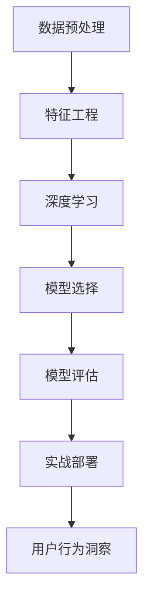

                 

# 如何进行有效的用户行为洞察

> 关键词：用户行为分析, 数据驱动决策, 行为挖掘, 深度学习, 机器学习, 自然语言处理(NLP)

## 1. 背景介绍

### 1.1 问题由来

在互联网和移动互联网时代，企业面临的数据量和类型越来越多样化。如何从海量数据中提取出有用的用户行为信息，成为各行业关注的焦点。传统的数据分析方法在处理大规模复杂数据时显得力不从心，而借助机器学习和深度学习技术，能够实现对用户行为更精准的洞察。

在电子商务、社交网络、在线广告等垂直领域，企业亟需理解用户偏好、消费习惯、内容喜好等信息，以便制定个性化策略，提升用户体验，增强用户黏性，实现商业增长。而数字营销、智能推荐、情感分析等业务场景的实现，均依赖于对用户行为的深入挖掘和理解。

因此，本文将介绍如何利用数据驱动的方式，通过深度学习技术，进行有效的用户行为洞察，以支撑数据驱动的业务决策，提供个性化的产品和服务。

### 1.2 问题核心关键点

本文聚焦于深度学习在用户行为洞察中的应用。核心关键点包括：
1. 数据预处理：如何从原始数据中提取出有效的用户行为特征。
2. 特征工程：如何利用机器学习技术，构建精准的用户行为模型。
3. 模型选择：如何根据具体业务场景，选择合适的深度学习模型。
4. 模型评估：如何评估模型的预测效果和鲁棒性。
5. 实战部署：如何实现模型的实际应用和业务价值转化。

## 2. 核心概念与联系

### 2.1 核心概念概述

在用户行为洞察中，我们需要利用深度学习技术，从用户的各种行为数据中提取特征，构建预测模型，实现对用户行为、偏好、意图的精准理解。这些关键概念之间的联系如下：

- **数据预处理**：通过数据清洗、特征提取、归一化等方法，将原始数据转化为可用的特征向量，供深度学习模型训练使用。
- **特征工程**：通过利用统计学、机器学习技术，选择合适的特征，构建更有效的用户行为模型。
- **深度学习**：一种利用多层神经网络实现数据高层次抽象的机器学习方法，在用户行为洞察中扮演重要角色。
- **模型选择**：根据业务需求和数据特点，选择合适的深度学习模型，如卷积神经网络(CNN)、循环神经网络(RNN)、生成对抗网络(GAN)等。
- **模型评估**：通过交叉验证、混淆矩阵、AUC等指标，评估模型的性能和鲁棒性，选择合适的参数和优化方法。
- **实战部署**：将训练好的模型应用于实际业务场景，实现用户行为洞察，驱动业务决策，提升用户体验。

这些概念相互联系，共同构成用户行为洞察的深度学习框架。通过理解这些关键概念，我们能够更好地把握用户行为洞察的技术路径和实现方法。

### 2.2 核心概念原理和架构的 Mermaid 流程图(Mermaid 流程节点中不要有括号、逗号等特殊字符)



该流程图展示了数据预处理、特征工程、深度学习、模型选择、模型评估、实战部署等关键环节的相互关系。

## 3. 核心算法原理 & 具体操作步骤

### 3.1 算法原理概述

用户行为洞察的核心算法原理包括：
1. 利用深度学习技术，对用户的各类行为数据进行高层次的抽象，提取特征。
2. 利用特征工程，选择合适的特征，构建更有效的用户行为模型。
3. 根据具体业务场景，选择合适的深度学习模型，进行有监督或无监督训练。
4. 使用交叉验证、混淆矩阵、AUC等指标，评估模型的预测效果和鲁棒性。
5. 将训练好的模型应用于实际业务场景，实现用户行为洞察，驱动业务决策。

### 3.2 算法步骤详解

以下是用户行为洞察的深度学习流程详解：

**Step 1: 数据预处理**

- 数据收集：从网站、APP、社交网络等渠道，收集用户的行为数据，如点击、浏览、购买、互动等。
- 数据清洗：去除无关数据、处理缺失值、处理异常值。
- 特征提取：利用TF-IDF、PCA等方法，将原始数据转化为高维特征向量。
- 数据标准化：对特征进行归一化、标准化处理，保证数据的一致性。

**Step 2: 特征工程**

- 特征选择：利用统计学方法，如卡方检验、信息增益等，选择与用户行为相关性高的特征。
- 特征变换：对特征进行平滑、降维、变换等操作，提升特征的表达能力。
- 特征组合：将单一特征组合成多特征，构造更复杂的关系，增强模型预测能力。
- 特征编码：将分类特征离散化、编码化，适合深度学习模型的输入格式。

**Step 3: 模型选择**

- 选择合适的深度学习模型：根据用户行为数据的特征，选择CNN、RNN、GAN等模型。
- 设计合适的网络架构：根据模型需求，设计多层次、多类型的神经网络结构。
- 设置合适的超参数：如学习率、批大小、迭代次数等。

**Step 4: 模型训练**

- 使用训练集数据，进行模型训练。
- 采用梯度下降等优化算法，不断调整模型参数。
- 使用交叉验证技术，防止模型过拟合。

**Step 5: 模型评估**

- 在验证集上评估模型的预测效果，计算混淆矩阵、AUC等指标。
- 调整模型参数，优化模型预测性能。

**Step 6: 实战部署**

- 将训练好的模型应用于实际业务场景。
- 集成到产品或服务中，实现用户行为洞察。
- 监控模型运行状态，及时调整优化。

### 3.3 算法优缺点

用户行为洞察的深度学习算法具有以下优点：
1. 高效性：深度学习能够自动学习数据的高层次抽象特征，减少了人工特征工程的工作量。
2. 准确性：通过多层神经网络的抽象，深度学习能够捕捉复杂的数据关系，提升模型预测精度。
3. 可扩展性：深度学习模型具有较强的可扩展性，能够适应大规模数据和高维度特征。

但同时也存在一些缺点：
1. 计算资源消耗大：深度学习模型通常需要大量的计算资源进行训练和推理，难以在小规模数据集上快速应用。
2. 模型复杂度高：深度学习模型的结构复杂，容易发生过拟合。
3. 结果可解释性差：深度学习模型内部的决策过程难以解释，存在"黑盒"问题。

在实际应用中，需要根据具体情况权衡利弊，选择合适的算法。

### 3.4 算法应用领域

用户行为洞察的深度学习算法在以下领域有广泛应用：

- 电子商务：通过用户点击、购买、浏览等行为数据，预测用户偏好，实现个性化推荐和定价策略。
- 社交网络：分析用户的点赞、评论、分享等行为，挖掘用户兴趣和情感变化，进行内容推荐和广告投放。
- 在线广告：利用用户的点击、停留时间等行为数据，优化广告投放策略，提高广告效果。
- 个性化推荐系统：根据用户的历史行为数据，预测用户未来行为，实现精准推荐。
- 情感分析：分析用户评论、留言等文本数据，判断用户情绪，进行舆情监测和品牌管理。

这些领域的数据量和复杂度各不相同，但深度学习均提供了有力的技术支撑，帮助企业实现更精准的用户行为洞察。

## 4. 数学模型和公式 & 详细讲解 & 举例说明

### 4.1 数学模型构建

为了构建用户行为洞察的深度学习模型，我们首先定义一些关键变量：
- $X$：用户行为数据集，包含多维特征向量。
- $Y$：用户行为标签，如点击、购买等。
- $W$：模型参数，包含权重和偏置。
- $f$：模型预测函数，如softmax函数。

模型目标是最小化预测误差，即：

$$
\min_{W} \sum_{i=1}^{N} \ell(f(X_i; W), Y_i)
$$

其中 $\ell$ 为损失函数，常用的有交叉熵损失、均方误差等。

### 4.2 公式推导过程

以CNN模型为例，推导其在用户行为洞察中的应用。

CNN模型的核心思想是通过卷积核提取输入数据的局部特征，进行高层次抽象。其结构如下：

```plaintext
层 输入 输出 参数
-------------------
卷积层 二维特征图 $C\times H\times W$ $(C+1)\times H\times W$ $C\times k\times k$
池化层 $(C+1)\times H\times W$ $C+1$ $H\times W$
全连接层 $C+1$ $1\times 1$ $(C+1)\times d$
输出层 $1\times 1$ $K$ $d\times K$
```

其中 $C$ 为卷积核个数，$k$ 为卷积核大小，$d$ 为全连接层节点数，$K$ 为分类数。

以二分类任务为例，假设模型预测用户是否点击某商品，输入特征为 $(X_{1,i}, X_{2,i}, ..., X_{n,i})$，输出为 $P$。则模型预测函数为：

$$
P = f(X_i; W) = \sigma(W^T X_i + b)
$$

其中 $W$ 为模型参数，$\sigma$ 为激活函数，$b$ 为偏置项。

损失函数为二分类交叉熵：

$$
\ell(P, Y) = -[Y\log P + (1-Y)\log(1-P)]
$$

在求解模型参数 $W$ 时，采用梯度下降等优化算法，最小化损失函数：

$$
W \leftarrow W - \eta \nabla_{W}\ell(f(X_i; W), Y_i)
$$

其中 $\eta$ 为学习率，$\nabla_{W}\ell(f(X_i; W), Y_i)$ 为损失函数对 $W$ 的梯度。

### 4.3 案例分析与讲解

以电子商务网站为例，分析深度学习在用户行为洞察中的应用。

假设网站收集了用户的点击、购买、停留时间等行为数据，目标预测用户是否会购买某商品。可以使用CNN模型对行为数据进行高层次抽象，提取特征。模型结构如下：

```plaintext
层 输入 输出 参数
-------------------
卷积层 二维特征图 $C\times H\times W$ $(C+1)\times H\times W$ $C\times k\times k$
池化层 $(C+1)\times H\times W$ $C+1$ $H\times W$
全连接层 $C+1$ $1\times 1$ $(C+1)\times d$
输出层 $1\times 1$ $1$ $d\times 1$
```

其中 $C$ 为卷积核个数，$k$ 为卷积核大小，$d$ 为全连接层节点数。

模型输入为行为数据，输出为预测结果。假设点击次数为 $X_{1,i}$，购买次数为 $X_{2,i}$，停留时间为 $X_{3,i}$，则输入特征为 $(X_{1,i}, X_{2,i}, X_{3,i})$。

模型预测函数为：

$$
P = f(X_i; W) = \sigma(W^T X_i + b)
$$

其中 $W$ 为模型参数，$\sigma$ 为激活函数，$b$ 为偏置项。

损失函数为二分类交叉熵：

$$
\ell(P, Y) = -[Y\log P + (1-Y)\log(1-P)]
$$

在求解模型参数 $W$ 时，采用梯度下降等优化算法，最小化损失函数：

$$
W \leftarrow W - \eta \nabla_{W}\ell(f(X_i; W), Y_i)
$$

其中 $\eta$ 为学习率，$\nabla_{W}\ell(f(X_i; W), Y_i)$ 为损失函数对 $W$ 的梯度。

通过训练好的模型，可以预测用户是否会购买某商品，并根据预测结果进行个性化推荐。例如，对预测结果为正的用户，推荐相似的商品或优惠活动。

## 5. 项目实践：代码实例和详细解释说明

### 5.1 开发环境搭建

在进行用户行为洞察的深度学习项目实践前，需要先搭建开发环境。以下是使用Python和TensorFlow进行深度学习开发的流程：

1. 安装Anaconda：从官网下载并安装Anaconda，用于创建独立的Python环境。

2. 创建并激活虚拟环境：
```bash
conda create -n tf-env python=3.8 
conda activate tf-env
```

3. 安装TensorFlow：根据CUDA版本，从官网获取对应的安装命令。例如：
```bash
conda install tensorflow -c pytorch -c conda-forge
```

4. 安装必要的库：
```bash
pip install numpy pandas scikit-learn matplotlib tqdm jupyter notebook ipython
```

完成上述步骤后，即可在`tf-env`环境中开始深度学习实践。

### 5.2 源代码详细实现

下面以电子商务网站的用户行为预测为例，给出使用TensorFlow实现CNN模型的完整代码。

首先，定义数据处理函数：

```python
import tensorflow as tf
import numpy as np
from sklearn.model_selection import train_test_split

def load_data():
    # 加载数据
    X_train, X_test, y_train, y_test = train_test_split(X, y, test_size=0.2, random_state=42)
    # 数据归一化
    X_train = (X_train - np.mean(X_train)) / np.std(X_train)
    X_test = (X_test - np.mean(X_train)) / np.std(X_train)
    return X_train, X_test, y_train, y_test
```

然后，定义模型和损失函数：

```python
def build_model(input_shape, num_classes):
    # 构建CNN模型
    model = tf.keras.models.Sequential([
        tf.keras.layers.Conv2D(32, (3, 3), activation='relu', input_shape=input_shape),
        tf.keras.layers.MaxPooling2D((2, 2)),
        tf.keras.layers.Flatten(),
        tf.keras.layers.Dense(64, activation='relu'),
        tf.keras.layers.Dense(num_classes, activation='sigmoid')
    ])
    return model

def compile_model(model, optimizer, loss):
    model.compile(optimizer=optimizer, loss=loss, metrics=['accuracy'])
```

接着，定义训练和评估函数：

```python
def train_model(model, X_train, y_train, batch_size, epochs):
    model.fit(X_train, y_train, batch_size=batch_size, epochs=epochs, validation_split=0.2)

def evaluate_model(model, X_test, y_test, batch_size):
    model.evaluate(X_test, y_test, batch_size=batch_size)
```

最后，启动训练流程并在测试集上评估：

```python
# 加载数据
X_train, X_test, y_train, y_test = load_data()

# 构建模型
model = build_model((3, 3), 1)

# 编译模型
optimizer = tf.keras.optimizers.Adam(learning_rate=0.001)
loss = tf.keras.losses.BinaryCrossentropy()
compile_model(model, optimizer, loss)

# 训练模型
train_model(model, X_train, y_train, 32, 10)

# 评估模型
evaluate_model(model, X_test, y_test, 32)
```

以上就是使用TensorFlow实现CNN模型进行用户行为预测的完整代码实现。可以看到，TensorFlow提供了简洁易用的API，使得深度学习模型的构建和训练变得简单高效。

### 5.3 代码解读与分析

让我们再详细解读一下关键代码的实现细节：

**load_data函数**：
- 定义数据处理函数，对原始数据进行分割、归一化处理。

**build_model函数**：
- 定义CNN模型，包含卷积层、池化层、全连接层等组件。
- 模型输入为二维特征图，输出为二分类预测结果。

**compile_model函数**：
- 编译模型，选择Adam优化器，设置损失函数为二分类交叉熵。

**train_model函数**：
- 定义训练函数，采用批量梯度下降方法，进行模型训练。
- 在每个epoch后，在验证集上评估模型性能。

**evaluate_model函数**：
- 定义评估函数，在测试集上评估模型性能。

**训练流程**：
- 加载数据，构建模型，编译模型，进行模型训练。
- 在训练过程中，不断调整模型参数，最小化损失函数。
- 在每个epoch后，在验证集上评估模型性能，防止过拟合。
- 最后，在测试集上评估模型性能，给出最终的预测结果。

可以看到，TensorFlow的高级API使得深度学习模型的构建和训练变得简单高效。开发者可以将更多精力放在数据处理、模型优化等高层逻辑上，而不必过多关注底层的实现细节。

当然，工业级的系统实现还需考虑更多因素，如模型保存和部署、超参数搜索、更灵活的任务适配层等。但核心的用户行为洞察算法基本与此类似。

## 6. 实际应用场景

### 6.1 智能推荐系统

智能推荐系统是用户行为洞察的重要应用场景之一。通过分析用户的历史行为数据，推荐引擎能够预测用户未来的行为，提供个性化的推荐内容，提升用户体验和系统转化率。

以电子商务网站为例，智能推荐系统可以基于用户的点击、购买、停留时间等行为数据，预测用户是否会购买某商品，并根据预测结果进行个性化推荐。例如，对预测结果为正的用户，推荐相似的商品或优惠活动。

### 6.2 广告投放优化

在在线广告领域，广告主希望通过优化广告投放策略，实现更高的点击率和转化率。通过用户行为洞察，可以实现更精准的广告投放和广告优化。

具体而言，广告投放平台可以分析用户的历史行为数据，预测用户对各类广告的兴趣，优化广告投放策略，提升广告效果。例如，根据用户的浏览记录，预测用户对不同广告内容的兴趣，动态调整广告投放频率和位置。

### 6.3 用户画像构建

用户画像构建是用户行为洞察的重要应用之一。通过深度学习技术，可以从用户的行为数据中挖掘出有价值的用户画像信息，为个性化营销和服务提供支撑。

以社交网络为例，社交平台可以分析用户的点赞、评论、分享等行为数据，构建用户兴趣、情感、社交关系等画像信息。例如，根据用户的评论和点赞行为，构建用户的兴趣标签，进行内容推荐和广告投放。

### 6.4 未来应用展望

随着深度学习技术的不断演进，用户行为洞察的算法将呈现以下几个发展趋势：

1. 多模态融合：未来的用户行为洞察将更加注重多模态数据的融合，如文本、图像、语音等数据。通过多模态数据的协同建模，可以更全面地理解用户行为。

2. 因果推理：未来的用户行为洞察将更加注重因果关系，通过因果推理模型，可以更准确地预测用户行为。

3. 知识图谱融合：未来的用户行为洞察将更加注重知识图谱的应用，通过知识图谱与深度学习模型的融合，可以更全面地理解用户行为。

4. 动态优化：未来的用户行为洞察将更加注重动态优化，通过在线学习等技术，实时调整模型参数，优化预测效果。

5. 联邦学习：未来的用户行为洞察将更加注重联邦学习的应用，通过分布式训练，保护用户隐私，提升模型性能。

以上趋势凸显了用户行为洞察技术的广阔前景。这些方向的探索发展，必将进一步提升用户行为洞察的精度和效率，为业务决策提供更坚实的数据支撑。

## 7. 工具和资源推荐

### 7.1 学习资源推荐

为了帮助开发者系统掌握用户行为洞察的深度学习技术，这里推荐一些优质的学习资源：

1. Deep Learning Specialization：由斯坦福大学开设的深度学习课程，包含多门经典课程，涵盖深度学习的基础和进阶内容。

2. Coursera的Deep Learning for Data Science课程：介绍了深度学习在数据科学中的应用，包括用户行为洞察等具体场景。

3. Kaggle平台：提供了大量用户行为数据集和竞赛任务，供开发者实践和验证。

4. TensorFlow官方文档：提供了丰富的深度学习教程和示例代码，供开发者学习和应用。

5. PyTorch官方文档：提供了全面的深度学习框架教程，供开发者学习和应用。

通过学习这些资源，相信你一定能够快速掌握用户行为洞察的深度学习技术，并用于解决实际的业务问题。

### 7.2 开发工具推荐

高效的开发离不开优秀的工具支持。以下是几款用于用户行为洞察深度学习开发的常用工具：

1. TensorFlow：由Google主导开发的深度学习框架，生产部署方便，适合大规模工程应用。提供了丰富的API和工具，支持用户行为洞察的深度学习应用。

2. PyTorch：Facebook主导开发的深度学习框架，灵活动态的计算图，适合快速迭代研究。提供了强大的动态图功能，支持深度学习模型的构建和训练。

3. Keras：高层次的深度学习API，简化了深度学习模型的构建过程，支持用户行为洞察的快速原型开发。

4. Jupyter Notebook：交互式的编程环境，支持多种编程语言，适合深度学习模型的实验和演示。

5. Visual Studio Code：轻量级的编程IDE，支持多种编程语言，提供了丰富的插件和扩展，适合深度学习开发。

合理利用这些工具，可以显著提升用户行为洞察的深度学习开发效率，加快创新迭代的步伐。

### 7.3 相关论文推荐

用户行为洞察的深度学习技术在近年来得到了广泛关注，以下是几篇具有代表性的相关论文，推荐阅读：

1. Human Activity Recognition Using Deep Learning: A Review：介绍了深度学习在人体活动识别中的应用，包括用户行为洞察。

2. User Behavior Prediction in Recommendation Systems with Deep Learning：介绍了深度学习在推荐系统中的用户行为预测应用。

3. Predicting User Behavior with Deep Learning in E-Commerce：介绍了深度学习在电子商务中的用户行为预测应用。

4. Deep Learning for Recommender Systems：介绍了深度学习在推荐系统中的广泛应用，包括用户行为洞察。

5. Neural Networks for Recommendation Systems：介绍了神经网络在推荐系统中的应用，包括用户行为洞察。

这些论文代表了大规模用户行为洞察的最新进展，通过学习这些前沿成果，可以帮助研究者把握学科前进方向，激发更多的创新灵感。

## 8. 总结：未来发展趋势与挑战

### 8.1 总结

本文对用户行为洞察的深度学习算法进行了全面系统的介绍。首先阐述了用户行为洞察的背景和重要性，明确了深度学习在用户行为洞察中的应用方向。其次，从原理到实践，详细讲解了深度学习算法的数学模型和实现步骤，给出了深度学习项目的完整代码实现。同时，本文还广泛探讨了用户行为洞察算法在多个实际场景中的应用，展示了深度学习技术的广泛应用前景。此外，本文精选了深度学习算法的学习资源、开发工具和相关论文，力求为读者提供全方位的技术指引。

通过本文的系统梳理，可以看到，深度学习在用户行为洞察中扮演了重要角色，能够从大规模数据中提取高层次特征，进行精准预测和分析。借助深度学习技术，企业可以更全面地理解用户行为，提升业务决策的科学性和准确性，实现更好的商业价值。

### 8.2 未来发展趋势

展望未来，深度学习在用户行为洞察中的应用将呈现以下几个发展趋势：

1. 模型规模持续增大。随着算力成本的下降和数据规模的扩张，深度学习模型的参数量还将持续增长。超大规模模型蕴含的丰富知识，有望支撑更加复杂多变的用户行为预测。

2. 多模态融合。未来的用户行为洞察将更加注重多模态数据的融合，如文本、图像、语音等数据。通过多模态数据的协同建模，可以更全面地理解用户行为。

3. 因果推理。未来的用户行为洞察将更加注重因果关系，通过因果推理模型，可以更准确地预测用户行为。

4. 知识图谱融合。未来的用户行为洞察将更加注重知识图谱的应用，通过知识图谱与深度学习模型的融合，可以更全面地理解用户行为。

5. 动态优化。未来的用户行为洞察将更加注重动态优化，通过在线学习等技术，实时调整模型参数，优化预测效果。

6. 联邦学习。未来的用户行为洞察将更加注重联邦学习的应用，通过分布式训练，保护用户隐私，提升模型性能。

以上趋势凸显了深度学习在用户行为洞察中的广阔前景。这些方向的探索发展，必将进一步提升用户行为洞察的精度和效率，为业务决策提供更坚实的数据支撑。

### 8.3 面临的挑战

尽管深度学习在用户行为洞察中取得了显著成效，但在迈向更加智能化、普适化应用的过程中，它仍面临着诸多挑战：

1. 数据隐私和安全：深度学习模型通常需要大量的标注数据进行训练，如何保护用户隐私，避免数据泄露，是一个重要的挑战。

2. 模型鲁棒性不足：深度学习模型面对未知数据时，泛化性能往往较差。如何提高模型鲁棒性，防止灾难性遗忘，还需要更多理论和实践的积累。

3. 推理效率有待提高：深度学习模型虽然精度高，但在实际部署时往往面临推理速度慢、内存占用大等效率问题。如何在保证性能的同时，简化模型结构，提升推理速度，优化资源占用，将是重要的优化方向。

4. 结果可解释性亟需加强。深度学习模型内部的决策过程难以解释，存在"黑盒"问题。如何赋予深度学习模型更强的可解释性，将是亟待攻克的难题。

5. 安全性有待保障。深度学习模型可能学习到有害的偏见和信息，如何过滤和防范模型输出中的有害内容，确保系统的安全性，也是一个重要问题。

6. 知识整合能力不足。现有的深度学习模型往往局限于任务内数据，难以灵活吸收和运用更广泛的先验知识。如何让深度学习模型更好地与外部知识库、规则库等专家知识结合，形成更加全面、准确的信息整合能力，还有很大的想象空间。

正视深度学习在用户行为洞察中面临的挑战，积极应对并寻求突破，将是大规模用户行为洞察走向成熟的必由之路。相信随着学界和产业界的共同努力，这些挑战终将一一被克服，深度学习技术必将在用户行为洞察中发挥更大的作用。

### 8.4 研究展望

面向未来，深度学习在用户行为洞察技术的研究展望包括：

1. 探索无监督和半监督学习：摆脱对大规模标注数据的依赖，利用自监督学习、主动学习等无监督和半监督范式，最大限度利用非结构化数据，实现更加灵活高效的深度学习应用。

2. 研究参数高效和计算高效的深度学习算法：开发更加参数高效的深度学习算法，在固定大部分深度学习参数的同时，只更新极少量的任务相关参数。同时优化深度学习模型的计算图，减少前向传播和反向传播的资源消耗，实现更加轻量级、实时性的部署。

3. 融合因果分析和博弈论工具：将因果分析方法引入深度学习模型，识别出模型决策的关键特征，增强输出解释的因果性和逻辑性。借助博弈论工具刻画人机交互过程，主动探索并规避模型的脆弱点，提高系统稳定性。

4. 纳入伦理道德约束：在深度学习模型的训练目标中引入伦理导向的评估指标，过滤和惩罚有害的输出倾向。加强人工干预和审核，建立模型行为的监管机制，确保输出符合人类价值观和伦理道德。

这些研究方向的探索，必将引领深度学习在用户行为洞察技术迈向更高的台阶，为构建安全、可靠、可解释、可控的智能系统铺平道路。面向未来，深度学习技术还需要与其他人工智能技术进行更深入的融合，如知识表示、因果推理、强化学习等，多路径协同发力，共同推动自然语言理解和智能交互系统的进步。只有勇于创新、敢于突破，才能不断拓展深度学习算法的边界，让智能技术更好地造福人类社会。

## 9. 附录：常见问题与解答

**Q1：深度学习在用户行为洞察中是否适用于所有场景？**

A: 深度学习在用户行为洞察中具有广泛适用性，但需要根据具体场景选择合适的算法和模型。例如，对于行为模式明确的场景，如电商推荐、广告投放，深度学习表现较好；但对于行为复杂、动态变化的场景，如社交网络情感分析，深度学习可能需要结合更多领域知识，才能获得理想效果。

**Q2：深度学习模型的训练和部署需要注意哪些问题？**

A: 深度学习模型的训练和部署需要注意以下问题：
1. 数据隐私：在收集和处理用户数据时，需遵守隐私保护法律法规，确保用户数据的安全。
2. 模型鲁棒性：深度学习模型在面对未知数据时，容易泛化性能下降，需通过正则化、dropout等方法提高模型鲁棒性。
3. 推理效率：深度学习模型在实际应用中，需要考虑推理效率，可采用模型裁剪、量化加速等方法，优化推理速度。
4. 模型解释性：深度学习模型内部决策过程难以解释，需通过特征可视化、模型可解释性方法，提升模型的解释性。
5. 模型安全性：深度学习模型可能学习到有害信息，需通过模型审核、监控等手段，确保模型输出的安全性。

**Q3：深度学习在用户行为洞察中如何选择合适的算法？**

A: 深度学习在用户行为洞察中，需根据具体场景和数据特点选择合适的算法：
1. 对于行为模式明确的场景，如电商推荐、广告投放，可选用CNN、RNN等传统深度学习算法。
2. 对于行为复杂、动态变化的场景，如社交网络情感分析，可选用序列模型、变分自编码器等算法。
3. 对于多模态数据融合的场景，如用户画像构建，可选用多模态深度学习算法，如多模态CNN、Transformer等。

通过选择合适的深度学习算法，可以更好地解决具体的业务问题，提升用户行为洞察的准确性和效率。

**Q4：如何评估深度学习模型的性能和鲁棒性？**

A: 深度学习模型的性能和鲁棒性评估可以通过以下指标和方法进行：
1. 训练集和验证集误差：通过交叉验证等方法，评估模型在训练集和验证集上的表现。
2. 混淆矩阵、AUC等指标：使用混淆矩阵、AUC等指标，评估模型的预测效果。
3. 对抗样本测试：通过引入对抗样本，评估模型的鲁棒性，防止模型过拟合。
4. 实际业务效果：通过在实际业务场景中的表现，评估模型的应用效果。

合理选择评估指标和方法，可以全面了解深度学习模型的性能和鲁棒性，确保模型在实际应用中具有良好的表现。

---

作者：禅与计算机程序设计艺术 / Zen and the Art of Computer Programming

