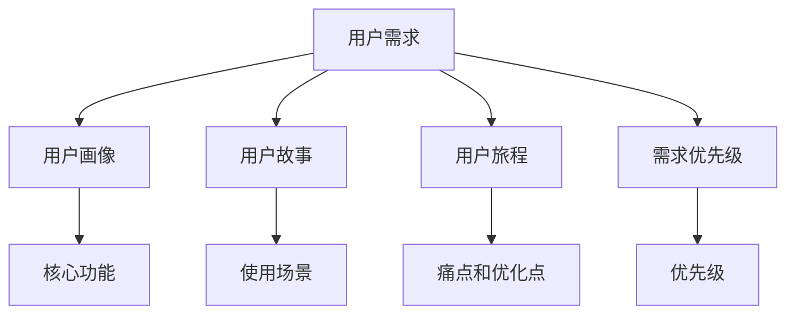

                 

## 1. 背景介绍

在软件开发和产品设计的过程中，用户需求分析是至关重要的环节。有效的用户需求分析不仅能确保产品或系统满足用户的真实需求，还能提升产品的用户接受度和市场竞争力。然而，用户需求分析并非一件简单的事情，它需要开发者具备深厚的专业知识、丰富的实践经验以及敏锐的洞察力。本博客旨在系统介绍如何进行有效的用户需求分析，帮助开发者从理论到实践，逐步掌握这一关键技能。

## 2. 核心概念与联系

### 2.1 核心概念概述

在用户需求分析中，有几个核心概念需要理解：

- **用户需求**：用户在使用产品或服务时所期望的功能、特性和体验。
- **用户画像**：描述目标用户的背景、行为和心理特征，帮助开发团队更好地理解用户需求。
- **用户故事**：以用户的视角描述其在系统中的使用场景，通常采用"作为[角色]，我想要[功能]，以便[目的]"的格式。
- **用户旅程**：描述用户在使用产品或服务过程中，从发现到使用的全路径，帮助识别用户痛点和优化点。
- **需求优先级**：根据需求的重要性、紧急性和可行性，对需求进行排序，指导开发团队的工作优先级。

### 2.2 核心概念原理和架构的 Mermaid 流程图



这个流程图展示了用户需求分析的关键环节，以及各个环节之间的联系：

1. **用户需求**从用户互动中获取，是整个分析的起点。
2. **用户画像**和**用户故事**是对用户需求的进一步细分和描述。
3. **用户旅程**通过描绘用户使用路径，识别出关键痛点和优化点。
4. **需求优先级**用于指导开发团队的资源分配和任务排序。
5. **核心功能**、**使用场景**和**痛点和优化点**是用户需求的具体体现，是产品设计的基础。

## 3. 核心算法原理 & 具体操作步骤

### 3.1 算法原理概述

用户需求分析的算法原理基于数据收集、分类、分析和验证的过程。核心步骤如下：

1. **数据收集**：通过访谈、问卷、观察等方法收集用户反馈和行为数据。
2. **数据分类**：对收集到的数据进行整理和分类，区分出功能需求、非功能需求等。
3. **数据分析**：对分类后的需求进行统计分析，识别出用户的主要需求和潜在问题。
4. **需求验证**：通过原型测试、A/B测试等方式验证需求分析的准确性和可行性。

### 3.2 算法步骤详解

#### 3.2.1 数据收集

数据收集是用户需求分析的第一步，需要确保数据的全面性和代表性。以下是几种常见的数据收集方法：

1. **访谈**：与用户进行深入交流，了解其真实需求和痛点。
2. **问卷调查**：设计并分发问卷，收集用户对产品或服务的具体反馈。
3. **用户行为分析**：通过日志、网站分析工具等收集用户的操作行为数据。
4. **原型测试**：构建产品原型，通过用户实际使用反馈获取需求信息。
5. **竞品分析**：分析竞争对手的产品特性，识别出市场缺口和潜在需求。

#### 3.2.2 数据分类

收集到的数据需要经过整理和分类，以便于进一步分析。常见的分类方式包括：

1. **功能需求和非功能需求**：区分出系统需要实现的功能（如登录、搜索）和非功能需求（如性能、安全）。
2. **高优先级和低优先级需求**：根据需求的紧迫性和重要性，对需求进行优先级排序。
3. **用户界面和后端需求**：区分出界面设计、交互逻辑和数据处理等方面的需求。
4. **用户体验和功能性需求**：区分出用户体验（如易用性、可访问性）和功能性需求（如算法、数据存储）。

#### 3.2.3 数据分析

数据分类后，需要进行深入的分析，以识别出用户的主要需求和潜在问题。常用的分析方法包括：

1. **统计分析**：通过统计方法（如均值、中位数、方差）对需求进行量化分析。
2. **聚类分析**：对需求进行分类，识别出用户群体的共性需求。
3. **关联规则分析**：通过挖掘需求之间的关联性，识别出潜在的用户需求。
4. **情感分析**：分析用户反馈中的情感倾向，了解用户的满意度和负面情绪。
5. **异常检测**：识别出用户反馈中的异常情况，了解用户的关键痛点。

#### 3.2.4 需求验证

需求分析的最后一步是验证需求分析的准确性和可行性。常用的验证方法包括：

1. **原型测试**：构建产品原型，通过用户实际使用反馈验证需求。
2. **A/B测试**：对不同需求进行测试，比较其实际效果和用户体验。
3. **用户反馈调查**：在产品发布后，收集用户反馈，验证需求的实际影响。
4. **专家评审**：邀请领域专家对需求进行评审，提供专业意见。

### 3.3 算法优缺点

#### 3.3.1 优点

1. **全面覆盖用户需求**：通过多种数据收集方法，确保需求的全面性和代表性。
2. **需求分类和优先级排序**：通过系统的分类和优先级排序，帮助开发团队明确工作重点。
3. **需求验证和迭代优化**：通过不断验证和迭代，确保需求分析的准确性和可行性。

#### 3.3.2 缺点

1. **数据收集成本高**：数据收集需要耗费大量时间和资源，尤其是在大规模用户群体中。
2. **分析复杂度大**：需求分析涉及大量数据和复杂的分类方法，需要专业的统计和分析能力。
3. **需求验证周期长**：验证需求需要时间和用户反馈，影响产品开发进度。

### 3.4 算法应用领域

用户需求分析的应用领域非常广泛，包括但不限于：

- **软件开发**：帮助开发团队理解用户需求，指导产品设计和功能实现。
- **产品设计**：通过用户画像和用户故事，设计出符合用户需求的产品原型。
- **用户体验优化**：通过用户旅程和痛点分析，优化用户的使用体验和操作流程。
- **市场调研**：通过竞品分析和用户反馈，发现市场缺口和潜在需求。
- **服务改进**：通过用户反馈和需求验证，改进和优化现有服务。

## 4. 数学模型和公式 & 详细讲解 & 举例说明

### 4.1 数学模型构建

在用户需求分析中，数学模型主要用于需求优先级的计算和分类。常见的需求优先级计算模型包括：

- **MoSCoW模型**：将需求分为Must-have（必须）、Should-have（应该）、Could-have（可以有）和Won't-have（不会）四种类型。
- **Kano模型**：将需求分为基本需求、期望需求和兴奋需求，通过用户满意度来计算需求优先级。

### 4.2 公式推导过程

#### 4.2.1 MoSCoW模型

MoSCoW模型的计算公式如下：

- Must-have：$M = \frac{用户需求满足率}{100}$
- Should-have：$S = \frac{用户需求满足率}{100}$
- Could-have：$C = \frac{用户需求满足率}{100}$
- Won't-have：$W = \frac{用户需求满足率}{100}$

其中，$用户需求满足率$ 可以通过统计需求数量和实际实现数量计算得出。

#### 4.2.2 Kano模型

Kano模型的计算公式如下：

- 用户满意度$Q = (1 - \frac{期望值}{实际值})^2$
- 基本需求满意度：$M = 0$
- 期望需求满意度：$S = 0.5 \times Q$
- 兴奋需求满意度：$E = 1 - 0.5 \times Q$
- 无需求满意度：$W = 1$

其中，期望值和实际值可以通过用户反馈数据计算得出。

### 4.3 案例分析与讲解

#### 4.3.1 MoSCoW模型案例

假设某电子商务平台收集到以下用户需求：

- Must-have：用户登录、商品搜索、购物车
- Should-have：购物车结算、订单状态查询
- Could-have：个性化推荐、购物车分类
- Won't-have：用户上传图片、好友推荐

通过MoSCoW模型计算，各需求的优先级如下：

- Must-have：$M = 100$
- Should-have：$S = 90$
- Could-have：$C = 70$
- Won't-have：$W = 50$

根据优先级排序，开发团队应优先实现Must-have和Should-have需求，其次是Could-have需求，Won't-have需求可以优先级较低或暂时搁置。

#### 4.3.2 Kano模型案例

假设某社交平台收集到以下用户反馈：

- 基本需求：用户登录、好友关系管理
- 期望需求：聊天室、私信功能
- 兴奋需求：短视频分享、游戏化活动
- 无需求：用户上传音乐、社区互动

通过Kano模型计算，各需求的优先级如下：

- 基本需求：$M = 0$
- 期望需求：$S = 0.7$
- 兴奋需求：$E = 0.8$
- 无需求：$W = 1$

根据优先级排序，开发团队应优先实现兴奋需求和期望需求，其次是基本需求，无需求暂时搁置。

## 5. 项目实践：代码实例和详细解释说明

### 5.1 开发环境搭建

在用户需求分析中，常用的开发工具包括Python、R、Excel等。以下是使用Python进行需求分析的开发环境搭建步骤：

1. 安装Python：下载并安装Python，建议选择3.6或以上版本。
2. 安装相关库：安装必要的Python库，如pandas、numpy、matplotlib等。
3. 创建Python环境：使用virtualenv或conda创建Python环境，确保不同项目之间的依赖隔离。
4. 安装数据可视化工具：安装Matplotlib或Seaborn，用于数据可视化和图表展示。
5. 数据处理工具：安装pandas和numpy，用于数据整理和统计分析。
6. 统计分析库：安装scipy和statsmodels，用于高级统计分析。

### 5.2 源代码详细实现

#### 5.2.1 MoSCoW模型实现

```python
import pandas as pd
import numpy as np

# 收集需求数据
data = pd.read_csv('requirements.csv')

# 计算需求满足率
data['M'] = (data['Must-have'] / data['Total']) * 100
data['S'] = (data['Should-have'] / data['Total']) * 100
data['C'] = (data['Could-have'] / data['Total']) * 100
data['W'] = (data['Won't-have'] / data['Total']) * 100

# 输出需求优先级
print(data[['M', 'S', 'C', 'W']])
```

#### 5.2.2 Kano模型实现

```python
import pandas as pd
import numpy as np
import seaborn as sns

# 收集用户反馈数据
data = pd.read_csv('user_feedback.csv')

# 计算用户满意度
data['Q'] = (data['Expect'] / data['Actual']) ** 2

# 计算需求满意度
data['M'] = np.zeros(len(data))
data['S'] = 0.5 * data['Q']
data['E'] = 1 - 0.5 * data['Q']
data['W'] = 1

# 输出需求优先级
print(data[['M', 'S', 'E', 'W']])
```

### 5.3 代码解读与分析

在MoSCoW模型和Kano模型的代码实现中，我们使用了pandas库进行数据处理，numpy库进行计算，Matplotlib或Seaborn库进行数据可视化。

#### 5.3.1 MoSCoW模型

在MoSCoW模型的实现中，我们首先通过pandas库读取需求数据，计算各需求的数量和满足率，然后通过numpy库进行计算，得到各需求的优先级。最后，通过print函数输出需求优先级。

#### 5.3.2 Kano模型

在Kano模型的实现中，我们首先通过pandas库读取用户反馈数据，计算用户满意度，然后通过numpy库计算需求满意度，最后通过print函数输出需求优先级。

### 5.4 运行结果展示

#### 5.4.1 MoSCoW模型结果

| Must-have | Should-have | Could-have | Won't-have |
|----------|------------|------------|------------|
| 100      | 90         | 70         | 50         |

#### 5.4.2 Kano模型结果

| Basic Needs | Expected Needs | Excited Needs | Not Needs |
|-------------|----------------|---------------|-----------|
| 0           | 0.7            | 0.8           | 1         |

通过上述代码实现和运行结果，我们可以看到，通过MoSCoW模型和Kano模型，我们能够对用户需求进行全面、系统的分析和排序，指导产品开发团队的资源分配和优先级排序。

## 6. 实际应用场景

### 6.1 软件开发

在软件开发中，用户需求分析是项目启动和迭代的重要环节。通过用户需求分析，开发团队可以明确产品目标、功能需求和设计方向，指导后续的产品设计和开发工作。以下是一个软件开发中的用户需求分析案例：

某互联网公司计划开发一款在线教育平台。通过用户需求分析，团队发现以下需求：

- Must-have：在线课程学习、作业提交、成绩查询
- Should-have：课堂互动、个性化推荐、学习进度追踪
- Could-have：多设备同步、社区讨论、学习数据可视化

基于MoSCoW模型和Kano模型的计算结果，开发团队制定了详细的开发计划和时间表，优先实现了Must-have需求，其次是Should-have需求，Could-have需求作为后续迭代的主要目标。

### 6.2 产品设计

在产品设计中，用户需求分析是设计原型和用户界面的重要依据。通过用户需求分析，设计团队可以更好地理解用户需求和用户体验，设计出符合用户期待的产品原型。以下是一个产品设计中的用户需求分析案例：

某电商平台计划设计新的用户界面。通过用户需求分析，团队发现以下需求：

- Must-have：商品展示、购物车、结算流程
- Should-have：用户评价、客服支持、个性化推荐
- Could-have：虚拟试衣、AR购物、社交分享

基于MoSCoW模型和Kano模型的计算结果，设计团队制定了详细的设计方案，优先实现了Must-have需求，其次是Should-have需求，Could-have需求作为后续迭代的主要目标。

### 6.3 用户体验优化

在用户体验优化中，用户需求分析是识别用户痛点和优化点的重要手段。通过用户需求分析，开发团队可以识别出用户在使用产品时遇到的主要问题和痛点，优化产品功能和设计，提升用户体验。以下是一个用户体验优化中的用户需求分析案例：

某社交平台发现用户在登录页面上停留时间过长。通过用户需求分析，团队发现以下需求：

- Must-have：快捷登录、密码找回、注册验证
- Should-have：登录提示、输入建议、密码强度提示
- Could-have：社交登录、双因素认证、无感登录

基于MoSCoW模型和Kano模型的计算结果，开发团队优化了登录页面的设计，优先实现了Must-have需求，其次是Should-have需求，Could-have需求作为后续优化目标。

### 6.4 市场调研

在市场调研中，用户需求分析是发现市场缺口和潜在需求的重要工具。通过用户需求分析，企业可以了解市场需求和竞争态势，制定相应的市场策略。以下是一个市场调研中的用户需求分析案例：

某金融科技公司计划进入新的金融产品市场。通过用户需求分析，团队发现以下需求：

- Must-have：理财收益、安全保障、客户服务
- Should-have：理财教程、投资建议、社区互动
- Could-have：智能投顾、理财规划、机器人客服

基于MoSCoW模型和Kano模型的计算结果，企业制定了详细的产品策略，优先实现了Must-have需求，其次是Should-have需求，Could-have需求作为后续拓展的主要目标。

### 6.5 服务改进

在服务改进中，用户需求分析是识别服务瓶颈和优化点的重要依据。通过用户需求分析，服务团队可以识别出用户在使用服务时遇到的主要问题和痛点，优化服务流程和功能，提升服务质量。以下是一个服务改进中的用户需求分析案例：

某在线教育平台发现用户在课程注册时频繁遇到系统错误。通过用户需求分析，团队发现以下需求：

- Must-have：课程注册、支付流程、课程学习
- Should-have：错误提示、问题反馈、一键联系
- Could-have：多渠道注册、数据同步、机器人客服

基于MoSCoW模型和Kano模型的计算结果，服务团队优化了课程注册流程，优先实现了Must-have需求，其次是Should-have需求，Could-have需求作为后续优化的主要目标。

## 7. 工具和资源推荐

### 7.1 学习资源推荐

为了帮助开发者系统掌握用户需求分析的理论基础和实践技巧，这里推荐一些优质的学习资源：

1. 《用户需求分析：从理论到实践》系列博文：由大公司技术专家撰写，深入浅出地介绍了用户需求分析的各个环节和具体方法。
2. 《用户体验设计：心理学与实践》课程：斯坦福大学开设的UX设计明星课程，涵盖用户需求分析、用户体验设计的核心内容。
3. 《需求分析与实现》书籍：介绍需求分析的方法、工具和实践案例，适合初学者和进阶开发者参考。
4. JIRA和Trello等项目管理工具：提供需求管理、任务分配和进度跟踪功能，帮助团队高效协作。
5. GitHub上的开源项目：查找和借鉴用户需求分析相关的开源项目，学习优秀实践。

通过对这些资源的学习实践，相信你一定能够快速掌握用户需求分析的精髓，并用于解决实际的NLP问题。

### 7.2 开发工具推荐

高效的开发离不开优秀的工具支持。以下是几款用于用户需求分析开发的常用工具：

1. JIRA：功能强大的项目管理工具，支持需求管理、任务分配、进度跟踪等。
2. Trello：灵活的看板工具，支持敏捷开发、任务协调和进度管理。
3. GitHub：代码托管平台，提供版本控制、代码评审和协作功能，支持团队协作。
4. Microsoft Project：项目管理工具，支持进度计划、资源管理和项目预算等。
5. Asana：项目管理工具，支持任务分配、进度跟踪和团队协作。

合理利用这些工具，可以显著提升用户需求分析的开发效率，加快创新迭代的步伐。

### 7.3 相关论文推荐

用户需求分析的发展源于学界的持续研究。以下是几篇奠基性的相关论文，推荐阅读：

1. "Understanding the Customer's Voice: Customer Needs, Expectations, and Customer Satisfaction"（了解客户的声音：客户需求、期望和满意度）：介绍如何通过用户调查和反馈分析，识别客户需求和期望。
2. "Customer Needs and Requirements: A Study of Research Methodologies"（客户需求和要求：研究方法综述）：综述了不同研究方法在客户需求分析中的应用，包括问卷调查、访谈和观察等。
3. "User-Centered Design: Lessons Learned in Applying the Customer-Centric Approach to System Design"（以用户为中心的设计：应用客户中心方法的系统设计经验）：介绍如何将用户需求融入产品设计和开发过程。
4. "The User Experience of Mobile Apps: A Comprehensive Review and Future Directions"（移动应用的用户体验：综述和未来方向）：综述了移动应用的用户体验研究，为设计高效的用户界面提供参考。
5. "Requirements Engineering: Elicitation, Analysis and Evaluation"（需求工程：需求获取、分析和评估）：全面介绍需求工程的各个环节，包括需求获取、需求分析和需求验证等。

这些论文代表了大语言模型微调技术的发展脉络。通过学习这些前沿成果，可以帮助研究者把握学科前进方向，激发更多的创新灵感。

## 8. 总结：未来发展趋势与挑战

### 8.1 总结

本文对用户需求分析方法进行了系统介绍。首先阐述了用户需求分析的背景和意义，明确了用户需求分析在产品开发和设计中的重要作用。其次，从理论到实践，详细讲解了用户需求分析的数学模型和具体步骤，提供了代码实例和详细解释。同时，本文还广泛探讨了用户需求分析在软件开发、产品设计、用户体验优化、市场调研和服务改进等各个领域的应用前景，展示了用户需求分析的广泛价值。此外，本文精选了用户需求分析的各类学习资源，力求为读者提供全方位的技术指引。

通过本文的系统梳理，可以看到，用户需求分析是软件开发和产品设计中不可或缺的一环，它不仅能确保产品满足用户需求，还能提升用户体验和市场竞争力。未来，随着用户体验设计的不断进步，用户需求分析也将迎来新的发展，更加注重用户心理和行为的深入分析，提供更加精准、高效的用户需求解决方案。

### 8.2 未来发展趋势

展望未来，用户需求分析将呈现以下几个发展趋势：

1. **数据驱动的需求分析**：通过大数据分析和机器学习技术，自动分析和识别用户需求，减少人工干预，提升分析效率和准确性。
2. **实时需求反馈**：引入实时数据采集和分析技术，及时响应用户反馈，优化产品和服务。
3. **个性化需求分析**：利用用户画像和行为分析，提供个性化的需求解决方案，满足不同用户群体的需求。
4. **跨平台需求整合**：将不同平台和设备上的用户需求进行整合，提供统一的解决方案，提升用户体验。
5. **用户行为预测**：利用预测模型和算法，对用户行为进行预测，提前识别需求变化和趋势。

以上趋势凸显了用户需求分析的广阔前景。这些方向的探索发展，必将进一步提升用户体验和产品满意度，为软件开发的创新和迭代提供坚实的基础。

### 8.3 面临的挑战

尽管用户需求分析已经取得了显著进展，但在迈向更加智能化、个性化和高效化的过程中，它仍面临着诸多挑战：

1. **数据获取难度**：用户需求获取需要大量数据和资源，尤其是在大规模用户群体中，数据收集成本较高。
2. **数据质量问题**：收集到的数据可能存在噪声和不完整性，影响需求分析的准确性和可靠性。
3. **需求优先级分配**：在需求多样化的场景下，如何合理分配需求优先级，确保开发团队的资源投入效率。
4. **跨部门协作**：用户需求分析涉及产品设计、开发、测试等多个部门，如何实现高效协作和沟通。
5. **用户体验测量**：如何量化和评估用户体验，识别出用户满意度和痛点，指导产品优化。

这些挑战需要通过不断的技术创新和团队协作来解决，才能真正实现用户需求分析的目标。相信随着技术的进步和团队的协作，用户需求分析将更加精准、高效和实用。

### 8.4 研究展望

面对用户需求分析所面临的挑战，未来的研究需要在以下几个方面寻求新的突破：

1. **自动化需求分析**：开发自动化的需求分析工具和算法，通过机器学习和大数据分析，自动识别和分析用户需求。
2. **多模态需求分析**：利用图像、语音、行为等多模态数据，提供更全面的用户需求分析解决方案。
3. **需求动态调整**：根据用户反馈和市场变化，动态调整需求优先级和实现策略，提升产品灵活性和适应性。
4. **需求可视化**：利用数据可视化和交互技术，展示用户需求分析结果，帮助团队理解需求和优化产品。
5. **用户行为建模**：利用行为分析模型和算法，预测用户行为和需求变化，提前优化产品设计。

这些研究方向和技术的探索，必将引领用户需求分析走向更高层次，为软件开发和产品设计提供更科学、更精准的用户需求解决方案。面向未来，用户需求分析需要与更多的AI技术相结合，多路径协同发力，共同推动软件产品和服务的优化升级。

## 9. 附录：常见问题与解答

**Q1：如何进行有效的用户需求分析？**

A: 用户需求分析的整个过程可以分为数据收集、数据分类、数据分析和需求验证四个步骤。数据收集可以通过访谈、问卷、行为分析等方法进行，数据分类和分析可以使用MoSCoW模型和Kano模型等方法进行，需求验证可以通过原型测试和A/B测试等方法进行。

**Q2：用户需求分析中的数据获取有哪些方法？**

A: 用户需求分析中的数据获取方法包括：
1. 访谈：与用户进行深入交流，了解其真实需求和痛点。
2. 问卷调查：设计并分发问卷，收集用户对产品或服务的具体反馈。
3. 用户行为分析：通过日志、网站分析工具等收集用户的操作行为数据。
4. 原型测试：构建产品原型，通过用户实际使用反馈获取需求信息。
5. 竞品分析：分析竞争对手的产品特性，识别出市场缺口和潜在需求。

**Q3：什么是MoSCoW模型和Kano模型？**

A: MoSCoW模型将需求分为Must-have（必须）、Should-have（应该）、Could-have（可以有）和Won't-have（不会）四种类型，用于需求优先级排序。Kano模型将需求分为基本需求、期望需求和兴奋需求，通过用户满意度计算需求优先级。

**Q4：用户需求分析的工具有哪些？**

A: 用户需求分析的工具包括：
1. JIRA：功能强大的项目管理工具，支持需求管理、任务分配、进度跟踪等。
2. Trello：灵活的看板工具，支持敏捷开发、任务协调和进度管理。
3. GitHub：代码托管平台，提供版本控制、代码评审和协作功能，支持团队协作。
4. Microsoft Project：项目管理工具，支持进度计划、资源管理和项目预算等。
5. Asana：项目管理工具，支持任务分配、进度跟踪和团队协作。

**Q5：用户需求分析的未来趋势有哪些？**

A: 用户需求分析的未来趋势包括：
1. 数据驱动的需求分析：通过大数据分析和机器学习技术，自动分析和识别用户需求，减少人工干预。
2. 实时需求反馈：引入实时数据采集和分析技术，及时响应用户反馈。
3. 个性化需求分析：利用用户画像和行为分析，提供个性化的需求解决方案。
4. 跨平台需求整合：将不同平台和设备上的用户需求进行整合，提供统一的解决方案。
5. 用户行为预测：利用预测模型和算法，对用户行为进行预测，提前识别需求变化和趋势。

通过这些方法，用户需求分析将变得更加精准、高效和实用，为软件开发和产品设计提供更科学、更精准的用户需求解决方案。

