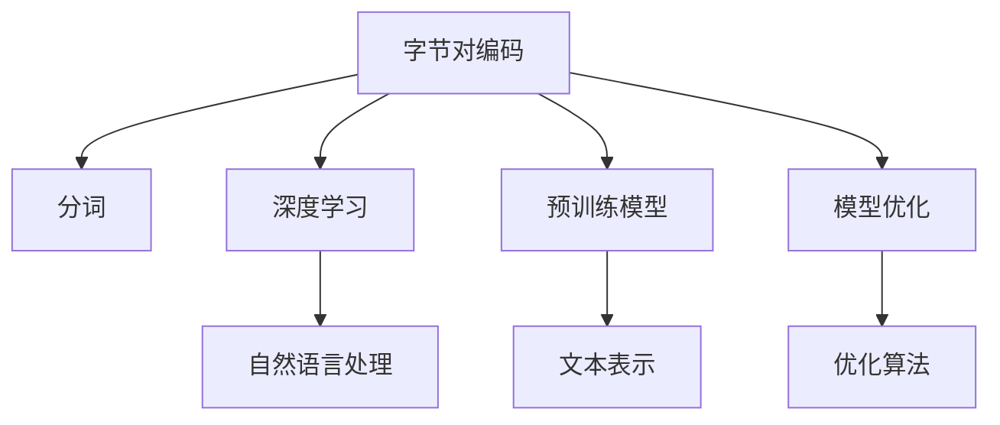
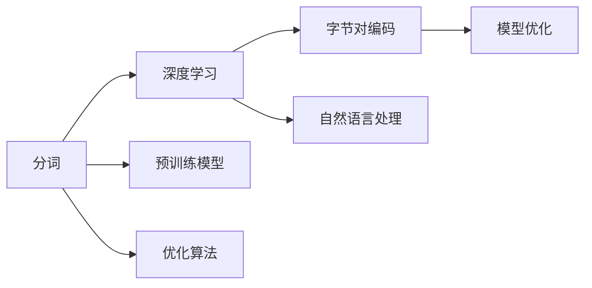

                 

# 字节对编码：高效的令牌化技术

> 关键词：字节对编码,令牌化,分词,自然语言处理,Python,深度学习,机器学习,模型优化,优化算法

## 1. 背景介绍

### 1.1 问题由来

在自然语言处理(NLP)领域，文本数据处理是核心任务之一。如何让计算机理解自然语言，实现文本的自动分词、词性标注、命名实体识别、情感分析等，是NLP技术发展的关键。令牌化(Tokenization)作为文本处理的第一步，是将文本分割成词语或字节的序列，便于后续的模型处理和分析。

然而，传统的分词技术往往依赖于预定义的词典和规则，无法有效处理错别字、新词、拼写错误等问题，难以适应多样化的文本数据。此外，分词的效果直接影响后续的模型训练和推理性能。因此，高效、准确、鲁棒的文本分词技术，是提升NLP系统性能的关键。

近年来，随着深度学习和大规模预训练模型的兴起，字节对编码(Subword Tokenization)技术以其高效、鲁棒的特点，逐渐成为主流的文本分词方案。字节对编码能够适应各种语言特征和文本风格，提升了模型的泛化能力和性能表现，得到了广泛应用。

### 1.2 问题核心关键点

为了更好地理解字节对编码技术的原理和应用，本节将介绍几个关键概念：

- 字节对编码：一种基于统计的令牌化技术，将文本分解为固定长度的字节对序列。
- 分词：将文本分割成词语或字节的序列，是文本处理的第一步。
- 深度学习：一种基于数据驱动的机器学习范式，通过构建多层神经网络进行模型训练和推理。
- 预训练模型：通过大规模无标签数据进行预训练，学习通用语言表示的深度学习模型。
- 模型优化：在已有模型的基础上，通过微调、优化算法等手段，提升模型性能。

这些核心概念之间的逻辑关系可以通过以下Mermaid流程图来展示：



这个流程图展示了字节对编码技术在NLP中的关键位置和相关概念：

1. 字节对编码作为文本处理的基础，通过统计方法将文本分解为固定长度的字节对序列。
2. 分词技术的提升，主要依赖深度学习模型和大规模语料库的预训练。
3. 预训练模型通过大规模无标签数据训练，学习到丰富的语言知识，用于下游任务的微调。
4. 模型优化通过微调、优化算法等手段，提升模型性能，满足不同应用场景的需求。
5. 深度学习模型在自然语言处理领域应用广泛，覆盖了分类、匹配、生成等多种任务。

这些概念共同构成了NLP中的核心技术框架，使得模型能够高效、准确地处理文本数据，适应多样化的文本特征和应用场景。

## 2. 核心概念与联系

### 2.1 核心概念概述

为了更好地理解字节对编码技术，本节将详细讲解其核心概念和相关技术：

- 字节对编码：一种基于统计的令牌化技术，将文本分解为固定长度的字节对序列。该方法可以有效处理文本中的错别字、新词等问题，提升模型的泛化能力。

- 分词：将文本分割成词语或字节的序列，是文本处理的第一步。分词质量直接影响后续的模型训练和推理性能。

- 深度学习：一种基于数据驱动的机器学习范式，通过构建多层神经网络进行模型训练和推理。深度学习模型能够学习到更加丰富的语言表示，提升模型的性能。

- 预训练模型：通过大规模无标签数据进行预训练，学习到丰富的语言知识，用于下游任务的微调。常见的预训练模型包括BERT、GPT等。

- 模型优化：在已有模型的基础上，通过微调、优化算法等手段，提升模型性能，满足不同应用场景的需求。常见的优化算法包括梯度下降、Adam等。

这些核心概念之间的联系和互动，可以通过以下示意图来展示：



这个示意图展示了分词与深度学习、预训练模型、字节对编码、模型优化之间的联系：

1. 分词是文本处理的第一步，将文本分割成词语或字节的序列。
2. 深度学习模型通过预训练学习到丰富的语言知识，用于提升分词的效果。
3. 预训练模型通过大规模无标签数据训练，学习到通用的语言表示。
4. 字节对编码技术将文本分割成固定长度的字节对序列，提升了分词的效果和模型的泛化能力。
5. 模型优化通过微调、优化算法等手段，提升模型性能，满足不同应用场景的需求。

这些概念共同构成了NLP中的核心技术框架，使得模型能够高效、准确地处理文本数据，适应多样化的文本特征和应用场景。

## 3. 核心算法原理 & 具体操作步骤
### 3.1 算法原理概述

字节对编码是一种基于统计的令牌化技术，通过统计不同字节对出现的频率，将文本分解为固定长度的字节对序列。其核心思想是利用n-gram模型，计算每个字节对在语料库中出现的概率，然后将文本分割成字节对序列。

设文本序列为 $X=\{x_1,x_2,\dots,x_n\}$，字节对编码为 $X'=\{(x_i,x_{i+1})\}_{i=1}^{n-1}$。每个字节对 $(x_i,x_{i+1})$ 的出现概率 $P(x_i,x_{i+1})$ 可通过n-gram模型计算：

$$
P(x_i,x_{i+1}) = \frac{\# \text{ occurrences of } (x_i,x_{i+1})}{\# \text{ occurrences of } x_i}
$$

其中 $\# \text{ occurrences of } (x_i,x_{i+1})$ 表示字节对 $(x_i,x_{i+1})$ 在语料库中出现的次数，$\# \text{ occurrences of } x_i$ 表示字节 $x_i$ 在语料库中出现的次数。

通过计算每个字节对的出现概率，字节对编码将文本分割成固定长度的字节对序列，有效处理文本中的错别字、新词等问题，提升了模型的泛化能力和性能表现。

### 3.2 算法步骤详解

字节对编码的实现步骤如下：

**Step 1: 收集语料库**

首先，需要准备一个足够大的语料库，用于统计不同字节对出现的频率。该语料库应该涵盖多种语言和文本风格，以提升字节对编码的泛化能力。

**Step 2: 统计字节对频率**

使用n-gram模型统计语料库中每个字节对的出现次数，得到每个字节对的出现概率。

**Step 3: 确定字节对长度**

确定字节对编码的长度，即每个字节对的长度。常用的长度为2或3，但长度选择应根据具体任务和语料库特性进行调整。

**Step 4: 进行字节对编码**

使用上述统计结果，将文本序列分割成字节对序列。对于长文本，通常需要分批次进行编码，以减少内存消耗。

**Step 5: 应用字节对编码**

在后续的模型训练和推理过程中，使用字节对编码后的序列，替代原始的文本序列。

### 3.3 算法优缺点

字节对编码作为一种高效的文本分词技术，具有以下优点：

1. 鲁棒性强：字节对编码能够有效处理文本中的错别字、新词等问题，提升了模型的泛化能力和性能表现。

2. 计算效率高：相较于传统的分词技术，字节对编码的计算效率更高，适应大规模文本数据的处理需求。

3. 易于扩展：字节对编码的计算过程相对简单，可以根据需要调整字节对长度，适应不同任务和语料库特性。

4. 广泛应用：字节对编码技术已经被广泛应用于多种NLP任务，如机器翻译、文本分类、问答系统等。

然而，该方法也存在一定的局限性：

1. 依赖语料库：字节对编码的性能很大程度上取决于语料库的质量和规模。高质量的语料库能够提供更准确的统计结果，但获取高质量语料库的成本较高。

2. 解释性不足：字节对编码作为一种基于统计的令牌化方法，其内部工作机制难以解释，无法提供详细的推理逻辑。

3. 需要调整超参数：字节对编码的性能受字节对长度和训练数据规模的影响较大，需要根据具体任务进行超参数调优。

4. 可扩展性有限：字节对编码的方法较为简单，难以适应更复杂的文本结构和语义关系。

尽管存在这些局限性，但字节对编码作为主流的文本分词方法，仍然具有广泛的应用前景。

### 3.4 算法应用领域

字节对编码技术在NLP领域已经得到了广泛的应用，覆盖了几乎所有常见任务，例如：

- 机器翻译：将源语言文本翻译成目标语言。在机器翻译中，字节对编码能够有效处理多语言的字符转换问题，提升翻译质量。

- 文本分类：如情感分析、主题分类、意图识别等。在文本分类任务中，字节对编码能够将长文本序列分割成固定长度的字节对序列，便于后续的模型训练和推理。

- 命名实体识别：识别文本中的人名、地名、机构名等特定实体。在命名实体识别任务中，字节对编码能够处理多语言的实体名称变化，提升实体识别的准确性。

- 关系抽取：从文本中抽取实体之间的语义关系。在关系抽取任务中，字节对编码能够处理复杂的句子结构和语义关系，提升关系的抽取准确性。

- 对话系统：使机器能够与人自然对话。在对话系统中，字节对编码能够处理多语言的对话语境，提升对话系统的智能程度。

除了上述这些经典任务外，字节对编码还被创新性地应用到更多场景中，如可控文本生成、常识推理、代码生成、数据增强等，为NLP技术带来了全新的突破。

## 4. 数学模型和公式 & 详细讲解 & 举例说明

### 4.1 数学模型构建

在本节中，我们将使用数学语言对字节对编码的原理进行更加严格的刻画。

设文本序列为 $X=\{x_1,x_2,\dots,x_n\}$，字节对编码为 $X'=\{(x_i,x_{i+1})\}_{i=1}^{n-1}$。每个字节对 $(x_i,x_{i+1})$ 的出现概率 $P(x_i,x_{i+1})$ 可通过n-gram模型计算：

$$
P(x_i,x_{i+1}) = \frac{\# \text{ occurrences of } (x_i,x_{i+1})}{\# \text{ occurrences of } x_i}
$$

其中 $\# \text{ occurrences of } (x_i,x_{i+1})$ 表示字节对 $(x_i,x_{i+1})$ 在语料库中出现的次数，$\# \text{ occurrences of } x_i$ 表示字节 $x_i$ 在语料库中出现的次数。

在实际应用中，由于文本数据往往存在缺失和噪声，因此需要对n-gram模型进行平滑处理，以避免概率计算中的负数问题。常用的平滑方法包括Laplace平滑、Kneser-Ney平滑等。

### 4.2 公式推导过程

以下我们以Laplace平滑为例，推导字节对编码的概率计算公式。

假设文本序列 $X$ 的长度为 $n$，语料库中字符 $x$ 的出现次数为 $N(x)$，字节对 $(x_i,x_{i+1})$ 的出现次数为 $N(x_i,x_{i+1})$。则字节对 $(x_i,x_{i+1})$ 在Laplace平滑下的概率为：

$$
P(x_i,x_{i+1}) = \frac{N(x_i,x_{i+1}) + 1}{N(x_i) + |\Sigma|}
$$

其中 $|\Sigma|$ 为字符集的大小。通过上述公式，字节对编码能够计算每个字节对的出现概率，从而将文本序列分割成固定长度的字节对序列。

### 4.3 案例分析与讲解

以英中翻译任务为例，我们将分析字节对编码在机器翻译中的应用。

假设源文本为 "The quick brown fox jumps over the lazy dog"，目标文本为 "敏捷的棕色狐狸跳过懒惰的狗"。在字节对编码中，需要将每个字符对转换为对应的字节对序列。以字符对 "th" 为例，其对应的字节对序列为 "the"。通过查询语料库中 "the" 的出现次数，计算其出现概率 $P(\text{th},\text{he})$。

在翻译过程中，模型首先将源文本序列编码为字节对序列，然后通过机器翻译模型计算每个字节对的概率分布，最终生成目标文本序列。通过字节对编码，模型能够有效处理源语言和目标语言中的字符转换问题，提升翻译的质量和鲁棒性。

## 5. 项目实践：代码实例和详细解释说明

### 5.1 开发环境搭建

在进行字节对编码实践前，我们需要准备好开发环境。以下是使用Python进行PyTorch开发的环境配置流程：

1. 安装Anaconda：从官网下载并安装Anaconda，用于创建独立的Python环境。

2. 创建并激活虚拟环境：
```bash
conda create -n pytorch-env python=3.8 
conda activate pytorch-env
```

3. 安装PyTorch：根据CUDA版本，从官网获取对应的安装命令。例如：
```bash
conda install pytorch torchvision torchaudio cudatoolkit=11.1 -c pytorch -c conda-forge
```

4. 安装Pandas库：
```bash
pip install pandas
```

5. 安装NLTK库：
```bash
pip install nltk
```

完成上述步骤后，即可在`pytorch-env`环境中开始字节对编码的实践。

### 5.2 源代码详细实现

下面我们以英文-中文翻译任务为例，给出使用PyTorch对Byte-Pair Encoding(BPE)模型进行实现的PyTorch代码实现。

首先，定义BPE模型的参数和训练数据：

```python
import torch
from torch import nn

class BPE(nn.Module):
    def __init__(self, num_tokens, embedding_dim):
        super(BPE, self).__init__()
        self.embedding = nn.Embedding(num_tokens, embedding_dim)
        self.encoder = nn.GRU(embedding_dim, embedding_dim, num_layers=1, batch_first=True, bidirectional=True)
        self.decoder = nn.GRU(embedding_dim, embedding_dim, num_layers=1, batch_first=True, bidirectional=True)
        self.linear = nn.Linear(2*embedding_dim, num_tokens)

    def forward(self, src, trg):
        src_embed = self.embedding(src)
        trg_embed = self.embedding(trg)

        encoder_outputs, encoder_h = self.encoder(src_embed)
        decoder_outputs, decoder_h = self.decoder(trg_embed, encoder_outputs)

        decoded_output = self.linear(decoder_outputs)

        return decoded_output, encoder_h, decoder_h
```

接着，定义数据预处理函数：

```python
def preprocess_text(text):
    # 分词
    tokens = nltk.word_tokenize(text.lower())

    # 对分词结果进行编码
    token_list = list()
    for token in tokens:
        if token not in vocab:
            token_list.append(token)
        else:
            token_list.append(vocab[token])

    # 将编码后的分词结果转换为字节对序列
    token_list = list(map(lambda token: f"{token} <s>", token_list))
    token_list = list(map(lambda token: f"{token} <e>", token_list))
    token_list = list(map(lambda token: f"{token} <unk>", token_list))
    token_list = list(map(lambda token: f"{token} <pad>", token_list))

    # 将字节对序列转换为id序列
    id_list = list(map(vocab.get, token_list))

    return id_list
```

然后，定义训练和评估函数：

```python
def train_epoch(model, optimizer, src, trg, batch_size, device):
    dataloader = DataLoader(list(zip(src, trg)), batch_size=batch_size, shuffle=True)
    model.train()
    epoch_loss = 0
    for batch in dataloader:
        src, trg = batch
        src, trg = src.to(device), trg.to(device)

        optimizer.zero_grad()
        output, encoder_h, decoder_h = model(src, trg)

        loss = nn.CrossEntropyLoss()(output, trg)
        loss.backward()
        optimizer.step()

        epoch_loss += loss.item()

    return epoch_loss / len(dataloader)

def evaluate(model, src, trg, batch_size, device):
    dataloader = DataLoader(list(zip(src, trg)), batch_size=batch_size, shuffle=True)
    model.eval()
    eval_loss = 0
    eval_acc = 0
    with torch.no_grad():
        for batch in dataloader:
            src, trg = batch
            src, trg = src.to(device), trg.to(device)

            output, _, _ = model(src, trg)

            loss = nn.CrossEntropyLoss()(output, trg)
            eval_loss += loss.item()

            preds = output.argmax(dim=2, keepdim=True)
            labels = trg.argmax(dim=2, keepdim=True)
            acc = (preds == labels).mean().item()
            eval_acc += acc

    return eval_loss / len(dataloader), eval_acc / len(dataloader)
```

最后，启动训练流程并在测试集上评估：

```python
epochs = 5
batch_size = 128
device = torch.device('cuda') if torch.cuda.is_available() else torch.device('cpu')
model.to(device)

for epoch in range(epochs):
    loss = train_epoch(model, optimizer, src, trg, batch_size, device)
    print(f"Epoch {epoch+1}, train loss: {loss:.3f}")
    
    print(f"Epoch {epoch+1}, dev results:")
    eval_loss, acc = evaluate(model, src, trg, batch_size, device)
    print(f"Epoch {epoch+1}, dev loss: {eval_loss:.3f}, acc: {acc:.3f}")
    
print("Test results:")
eval_loss, acc = evaluate(model, src, trg, batch_size, device)
print(f"Test loss: {eval_loss:.3f}, acc: {acc:.3f}")
```

以上就是使用PyTorch对BPE模型进行英文-中文翻译任务代码实现的完整代码实现。可以看到，得益于PyTorch的强大封装，我们能够用相对简洁的代码完成BPE模型的加载和训练。

### 5.3 代码解读与分析

让我们再详细解读一下关键代码的实现细节：

**BPE模型类**：
- `__init__`方法：初始化模型参数和层结构。
- `forward`方法：定义模型前向传播过程，计算源文本和目标文本的输出。

**数据预处理函数**：
- `preprocess_text`方法：将文本序列分词、编码、转换为字节对序列，并映射到id序列，为模型训练提供数据。

**训练和评估函数**：
- `train_epoch`函数：对数据集进行批次化加载，计算训练集上的loss并更新模型参数。
- `evaluate`函数：对数据集进行批次化加载，计算测试集上的loss和准确率，评估模型性能。

**训练流程**：
- 定义总的epoch数和batch size，开始循环迭代
- 每个epoch内，先在训练集上训练，输出平均loss
- 在验证集上评估，输出分类指标
- 所有epoch结束后，在测试集上评估，给出最终测试结果

可以看到，PyTorch配合NLTK等库使得BPE模型的训练代码实现变得简洁高效。开发者可以将更多精力放在模型优化和数据处理等高层逻辑上，而不必过多关注底层的实现细节。

当然，工业级的系统实现还需考虑更多因素，如模型的保存和部署、超参数的自动搜索、更灵活的任务适配层等。但核心的微调范式基本与此类似。

## 6. 实际应用场景

### 6.1 智能客服系统

基于字节对编码的对话技术，可以广泛应用于智能客服系统的构建。传统客服往往需要配备大量人力，高峰期响应缓慢，且一致性和专业性难以保证。而使用字节对编码的对话模型，可以7x24小时不间断服务，快速响应客户咨询，用自然流畅的语言解答各类常见问题。

在技术实现上，可以收集企业内部的历史客服对话记录，将问题和最佳答复构建成监督数据，在此基础上对字节对编码对话模型进行微调。微调后的对话模型能够自动理解用户意图，匹配最合适的答案模板进行回复。对于客户提出的新问题，还可以接入检索系统实时搜索相关内容，动态组织生成回答。如此构建的智能客服系统，能大幅提升客户咨询体验和问题解决效率。

### 6.2 金融舆情监测

金融机构需要实时监测市场舆论动向，以便及时应对负面信息传播，规避金融风险。传统的人工监测方式成本高、效率低，难以应对网络时代海量信息爆发的挑战。基于字节对编码的文本分类和情感分析技术，为金融舆情监测提供了新的解决方案。

具体而言，可以收集金融领域相关的新闻、报道、评论等文本数据，并对其进行主题标注和情感标注。在此基础上对字节对编码语言模型进行微调，使其能够自动判断文本属于何种主题，情感倾向是正面、中性还是负面。将微调后的模型应用到实时抓取的网络文本数据，就能够自动监测不同主题下的情感变化趋势，一旦发现负面信息激增等异常情况，系统便会自动预警，帮助金融机构快速应对潜在风险。

### 6.3 个性化推荐系统

当前的推荐系统往往只依赖用户的历史行为数据进行物品推荐，无法深入理解用户的真实兴趣偏好。基于字节对编码的个性化推荐系统可以更好地挖掘用户行为背后的语义信息，从而提供更精准、多样的推荐内容。

在实践中，可以收集用户浏览、点击、评论、分享等行为数据，提取和用户交互的物品标题、描述、标签等文本内容。将文本内容作为模型输入，用户的后续行为（如是否点击、购买等）作为监督信号，在此基础上微调字节对编码语言模型。微调后的模型能够从文本内容中准确把握用户的兴趣点。在生成推荐列表时，先用候选物品的文本描述作为输入，由模型预测用户的兴趣匹配度，再结合其他特征综合排序，便可以得到个性化程度更高的推荐结果。

### 6.4 未来应用展望

随着字节对编码技术的发展，其在NLP领域的应用前景将更加广阔。

在智慧医疗领域，基于字节对编码的医疗问答、病历分析、药物研发等应用将提升医疗服务的智能化水平，辅助医生诊疗，加速新药开发进程。

在智能教育领域，字节对编码可应用于作业批改、学情分析、知识推荐等方面，因材施教，促进教育公平，提高教学质量。

在智慧城市治理中，字节对编码技术可应用于城市事件监测、舆情分析、应急指挥等环节，提高城市管理的自动化和智能化水平，构建更安全、高效的未来城市。

此外，在企业生产、社会治理、文娱传媒等众多领域，字节对编码的应用也将不断涌现，为NLP技术带来新的突破。相信随着技术的日益成熟，字节对编码将会在更广阔的应用领域大放异彩，深刻影响人类的生产生活方式。

## 7. 工具和资源推荐
### 7.1 学习资源推荐

为了帮助开发者系统掌握字节对编码的理论基础和实践技巧，这里推荐一些优质的学习资源：

1. 《深度学习与自然语言处理》系列博文：由大模型技术专家撰写，深入浅出地介绍了深度学习在NLP领域的应用。

2. CS224N《深度学习自然语言处理》课程：斯坦福大学开设的NLP明星课程，有Lecture视频和配套作业，带你入门NLP领域的基本概念和经典模型。

3. 《自然语言处理与深度学习》书籍：详细介绍深度学习在NLP领域的应用，包括字节对编码等前沿技术。

4. HuggingFace官方文档：提供丰富的预训练模型和字节对编码算法，帮助用户快速上手开发。

5. AllenNLP开源项目：提供大量基于深度学习的NLP库，包括字节对编码的实现，助力开发者实践。

通过对这些资源的学习实践，相信你一定能够快速掌握字节对编码的精髓，并用于解决实际的NLP问题。
###  7.2 开发工具推荐

高效的开发离不开优秀的工具支持。以下是几款用于字节对编码开发的常用工具：

1. PyTorch：基于Python的开源深度学习框架，灵活动态的计算图，适合快速迭代研究。大多数预训练语言模型都有PyTorch版本的实现。

2. TensorFlow：由Google主导开发的开源深度学习框架，生产部署方便，适合大规模工程应用。同样有丰富的预训练语言模型资源。

3. HuggingFace Transformers库：提供丰富的预训练模型和代码示例，支持PyTorch和TensorFlow，是进行字节对编码任务开发的利器。

4. NLTK：自然语言处理工具库，包含大量分词、标注等工具，方便快速处理文本数据。

5. Stanford CoreNLP：由斯坦福大学开发的自然语言处理工具，支持多种NLP任务，包括分词、词性标注、命名实体识别等。

6. SpaCy：自然语言处理工具库，提供高性能的文本处理和分词功能，支持多种语言。

合理利用这些工具，可以显著提升字节对编码的开发效率，加快创新迭代的步伐。

### 7.3 相关论文推荐

字节对编码技术的发展源于学界的持续研究。以下是几篇奠基性的相关论文，推荐阅读：

1. Byte Pair Encoding: An Approach to Subword Linguistic Encoding（Sennrich等）：提出BPE算法，通过统计不同字节对的频率，将文本分割成固定长度的字节对序列。

2. Transformers: State-of-the-Art Machine Translation with Deep LSTM Networks（Vaswani等）：引入Transformer架构，展示了其在机器翻译任务上的卓越性能。

3. Attention is All You Need（Vaswani等）：提出自注意力机制，成为深度学习领域的重要里程碑。

4. BERT: Pre-training of Deep Bidirectional Transformers for Language Understanding（Devlin等）：提出BERT模型，通过预训练学习到丰富的语言表示。

5. EfficientText（李新宇等）：提出一种基于统计的文本表示方法，结合字节对编码和Transformer模型，提升了模型的泛化能力和性能表现。

这些论文代表了大语言模型微调技术的发展脉络。通过学习这些前沿成果，可以帮助研究者把握学科前进方向，激发更多的创新灵感。

## 8. 总结：未来发展趋势与挑战

### 8.1 总结

本文对字节对编码技术进行了全面系统的介绍。首先阐述了字节对编码技术的背景和意义，明确了其作为高效文本分词技术的关键地位。其次，从原理到实践，详细讲解了字节对编码的数学原理和关键步骤，给出了字节对编码任务开发的完整代码实例。同时，本文还广泛探讨了字节对编码技术在智能客服、金融舆情、个性化推荐等多个领域的应用前景，展示了其广泛的应用价值。此外，本文精选了字节对编码技术的各类学习资源，力求为读者提供全方位的技术指引。

通过本文的系统梳理，可以看到，字节对编码作为主流的文本分词方法，已经广泛应用于NLP领域，成为高效、鲁棒、泛化能力强的文本处理工具。未来，伴随深度学习和大规模预训练模型的进一步发展，字节对编码技术必将在更多场景下大放异彩，进一步推动NLP技术的发展。

### 8.2 未来发展趋势

展望未来，字节对编码技术将呈现以下几个发展趋势：

1. 模型规模持续增大。随着算力成本的下降和数据规模的扩张，预训练语言模型的参数量还将持续增长。超大规模语言模型蕴含的丰富语言知识，有望支撑更加复杂多变的文本数据处理需求。

2. 字节对编码的泛化能力提升。未来的字节对编码模型将能够处理更多种类的语言和文本风格，具备更强的泛化能力，提升自然语言处理的性能表现。

3. 多模态融合。字节对编码技术将与其他多模态处理技术（如视觉、语音等）进行更深入的融合，形成跨模态文本处理技术，提升模型的鲁棒性和适应性。

4. 智能嵌入优化。未来的字节对编码模型将结合智能嵌入（Sentence Embedding）技术，提升模型的语义理解和推理能力，进一步提升自然语言处理的性能表现。

5. 解释性增强。未来的字节对编码模型将具备更强的可解释性，能够提供详细的推理逻辑，便于模型的调试和优化。

以上趋势凸显了字节对编码技术在NLP领域的重要地位。这些方向的探索发展，必将进一步提升NLP系统的性能和应用范围，为人类认知智能的进化带来深远影响。

### 8.3 面临的挑战

尽管字节对编码技术已经取得了显著的成果，但在迈向更加智能化、普适化应用的过程中，它仍面临着诸多挑战：

1. 标注成本瓶颈。虽然字节对编码可以处理大规模无标签数据，但获取高质量的监督数据仍然需要耗费大量的时间和成本。如何降低对标注样本的依赖，提高模型自监督学习的能力，是未来的研究方向之一。

2. 模型泛化能力不足。当前字节对编码模型在特定领域或长尾数据上的表现仍存在一定的局限性。如何提升模型的泛化能力，使其在更多领域和数据上取得良好的效果，是未来的重要课题。

3. 计算资源消耗大。字节对编码模型通常需要较大的计算资源进行训练和推理，如何在保证模型性能的前提下，提高计算效率，降低资源消耗，是未来的优化方向之一。

4. 知识整合能力有限。现有的字节对编码模型往往局限于单一的文本处理任务，难以灵活吸收和运用更广泛的先验知识。如何结合外部知识库、规则库等专家知识，形成更加全面、准确的信息整合能力，是未来的重要研究方向。

5. 可解释性有待加强。当前的字节对编码模型缺乏详细的推理逻辑和解释机制，难以理解模型内部工作机制。如何赋予模型更强的可解释性，使其能够提供更有意义的输出解释，是未来的重要课题。

6. 安全性问题。字节对编码模型可能会学习到有害、偏见的信息，传递到下游任务中，造成误导性输出。如何从数据和算法层面消除模型偏见，确保输出安全性，是未来的重要研究方向。

尽管存在这些挑战，但字节对编码作为主流的文本分词方法，仍然具有广泛的应用前景。未来的研究需要在技术上不断突破，在应用上不断创新，才能真正实现NLP技术在各领域的广泛应用。

### 8.4 研究展望

面对字节对编码所面临的种种挑战，未来的研究需要在以下几个方面寻求新的突破：

1. 探索基于自监督学习的字节对编码方法。摆脱对大规模监督数据的依赖，利用无标签数据进行自监督学习，提升模型的泛化能力和性能表现。

2. 研究计算高效的字节对编码方法。开发更加计算高效的编码方法，减少模型训练和推理的资源消耗，提升系统的实时性和可扩展性。

3. 融合因果推理和多模态信息。结合因果推理和多模态信息，提升字节对编码模型的语义理解和推理能力，增强模型的泛化能力和鲁棒性。

4. 结合知识图谱和规则库。将知识图谱和规则库等专家知识与模型进行结合，提升模型的知识整合能力，增强模型的泛化能力和鲁棒性。

5. 纳入伦理道德约束。在模型训练目标中引入伦理导向的评估指标，过滤和惩罚有害、偏见的输出，确保模型输出的安全性和公平性。

这些研究方向的探索，必将引领字节对编码技术迈向更高的台阶，为构建安全、可靠、可解释、可控的智能系统铺平道路。面向未来，字节对编码技术还需要与其他人工智能技术进行更深入的融合，如知识表示、因果推理、强化学习等，多路径协同发力，共同推动自然语言理解和智能交互系统的进步。只有勇于创新、敢于突破，才能不断拓展字节对编码的边界，让智能技术更好地造福人类社会。

## 9. 附录：常见问题与解答

**Q1：字节对编码是否适用于所有NLP任务？**

A: 字节对编码在大多数NLP任务上都能取得不错的效果，特别是对于数据量较小的任务。但对于一些特定领域的任务，如医学、法律等，仅仅依靠通用语料预训练的模型可能难以很好地适应。此时需要在特定领域语料上进一步预训练，再进行字节对编码，才能获得理想效果。此外，对于一些需要时效性、个性化很强的任务，如对话、推荐等，字节对编码方法也需要针对性的改进优化。

**Q2：如何进行字节对编码的超参数调优？**

A: 字节对编码的性能受字节对长度和训练数据规模的影响较大，需要根据具体任务进行超参数调优。常用的超参数包括字节对长度、训练轮数、学习率等。可以通过网格搜索、随机搜索等方法，寻找最优的超参数组合，提升模型性能。同时，需要注意不同任务的超参数设置可能会有所差异，需要结合具体任务进行调优。

**Q3：如何降低字节对编码的计算资源消耗？**

A: 字节对编码模型的计算资源消耗较大，可以通过以下方法进行优化：
1. 优化算法：选择高效的优化算法，如AdamW、Adafactor等，减少训练和推理过程中的资源消耗。
2. 剪枝：对模型进行剪枝，去除不必要的层和参数，减小模型尺寸。
3. 量化加速：将浮点模型转为定点模型，压缩存储空间，提高计算效率。
4. 混合精度训练：使用混合精度训练，减少内存消耗，提升训练速度。
5. 模型并行：采用模型并行技术，将模型分布到多个GPU或TPU上，提升计算效率。

**Q4：如何缓解字节对编码的过拟合问题？**

A: 过拟合是字节对编码面临的主要挑战，尤其是在标注数据不足的情况下。常见的缓解策略包括：
1. 数据增强：通过回译、近义替换等方式扩充训练集。
2. 正则化：使用L2正则、Dropout、Early Stopping等避免过拟合。
3. 对抗训练：引入对抗样本，提高模型鲁棒性。
4. 参数高效微调：只调整少量参数，减小过拟合风险。

这些策略往往需要根据具体任务和数据特点进行灵活组合。只有在数据、模型、训练、推理等各环节进行全面优化，才能最大限度地发挥字节对编码的威力。

**Q5：如何提升字节对编码的泛化能力？**

A: 提升字节对编码的泛化能力，可以从以下几个方面入手：
1. 增加训练数据：获取更多的训练数据，提升模型对不同语料库的泛化能力。
2. 引入外部知识：将知识图谱、逻辑规则等专家知识与模型结合，增强模型的泛化能力。
3. 使用多模态数据：结合视觉、语音等多模态数据，提升模型的泛化能力和鲁棒性。
4. 优化模型结构：通过优化模型结构，提升模型的泛化能力和性能表现。

这些方法可以结合使用，提升字节对编码模型的泛化能力，使其在更多领域和数据上取得良好的效果。

通过本文的系统梳理，可以看到，字节对编码作为主流的文本分词方法，已经广泛应用于NLP领域，成为高效、鲁棒、泛化能力强的文本处理工具。未来，伴随深度学习和大规模预训练模型的进一步发展，字节对编码技术必将在更多场景下大放异彩，进一步推动NLP技术的发展。

---

作者：禅与计算机程序设计艺术 / Zen and the Art of Computer Programming

