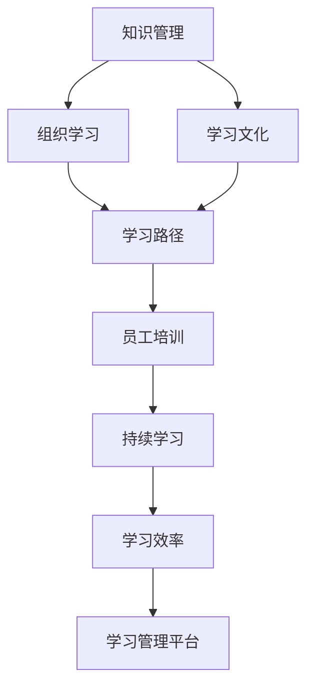

                 

# 学习体系与组织学习文化的构建

> 关键词：知识管理, 学习文化, 组织学习, 学习路径, 员工培训, 持续学习, 学习效率, 学习管理平台

## 1. 背景介绍

在全球经济快速发展和科技不断进步的背景下，企业之间的竞争日益激烈，知识更新速度也在不断加快。为了在竞争中立于不败之地，构建高效的学习体系和积极的学习文化，成为企业提升核心竞争力的关键。学习体系的构建不仅可以提升员工的知识水平和技能，还可以推动组织的创新和发展。

### 1.1 问题由来

在现代社会，知识更新速度极快，新技术和新方法的不断涌现，要求企业能够快速吸收并应用这些知识，以保持竞争力。然而，许多企业面临的挑战是，如何将员工的个人学习与组织的整体目标结合起来，形成统一的学习体系，构建积极的学习文化，最终转化为企业竞争力的提升。

### 1.2 问题核心关键点

构建学习体系和促进组织学习文化的形成，是企业需要重点关注的核心关键点。具体来说，以下几个方面尤为关键：

- **知识管理**：如何系统地管理和共享知识，确保知识能够被全体员工快速获取和使用。
- **学习文化**：如何培养员工的自主学习意识和团队合作精神，形成积极的学习文化。
- **学习路径规划**：如何根据员工的学习需求和发展方向，设计个性化的学习路径，帮助员工不断提升。
- **员工培训**：如何结合岗位需求和职业发展规划，设计合理的培训计划，提升员工的技能和知识水平。
- **持续学习**：如何建立持续学习的机制，鼓励员工不断更新知识，保持与行业前沿的同步。
- **学习效率提升**：如何提高学习效率，确保员工能够在有限的时间内获得最大化的学习效果。

### 1.3 问题研究意义

构建高效的学习体系和积极的学习文化，对企业的长期发展具有重要意义：

- **提升员工能力**：通过系统的学习和培训，提升员工的知识水平和技能，增强其竞争力。
- **推动组织创新**：员工不断更新知识，有助于组织创新能力的提升，从而在市场竞争中保持领先。
- **提高工作效率**：良好的学习体系和积极的学习文化，能够激发员工的积极性和创造性，提高工作效率。
- **增强团队协作**：通过共同学习和交流，增强团队的协作精神和凝聚力，提高团队的整体战斗力。
- **支持战略目标**：学习体系和组织学习文化，能够支持企业的战略目标和长远发展，提升企业的整体竞争力。

## 2. 核心概念与联系

### 2.1 核心概念概述

为了更好地理解学习体系和组织学习文化的构建过程，本节将介绍几个核心概念：

- **知识管理**：系统化地管理组织内部和外部的知识资源，确保知识的有效收集、存储、共享和利用。
- **学习文化**：企业内部倡导的以学习为核心的文化氛围，包括对学习的重视、对学习者的尊重和鼓励创新的精神。
- **组织学习**：通过组织内部的学习机制，促进知识在组织成员之间的传递和共享，提高组织的整体知识水平。
- **学习路径**：根据员工的职业发展需求和学习兴趣，设计个性化的学习路径，帮助员工系统地掌握所需知识。
- **员工培训**：通过系统的培训计划和培训课程，提升员工的专业技能和综合素质。
- **持续学习**：强调学习是一个持续不断的过程，鼓励员工不断更新知识和技能，适应变化的需求。
- **学习效率**：通过合理的资源配置和学习策略，提高学习活动的效率，确保学习目标的达成。

这些核心概念之间的逻辑关系可以通过以下Mermaid流程图来展示：



这个流程图展示了一些关键概念之间的关系：

1. **知识管理**是组织学习的基础，通过知识管理确保知识的有效收集和利用。
2. **学习文化**是组织学习的软环境，通过倡导积极的学习文化，推动组织学习的持续发展。
3. **组织学习**是知识管理的实际应用，通过学习机制促进知识的共享和应用。
4. **学习路径**是个人学习的指南，帮助员工系统地学习和掌握知识。
5. **员工培训**是组织学习的具体实现方式，通过培训提升员工的专业技能。
6. **持续学习**是学习的长期目标，强调不断更新知识和技能。
7. **学习效率**是学习活动的关键目标，通过合理配置资源和策略，提高学习活动的效率。
8. **学习管理平台**是实现学习体系的工具，提供系统化的学习支持和管理功能。

## 3. 核心算法原理 & 具体操作步骤

### 3.1 算法原理概述

构建高效的学习体系和积极的学习文化，可以理解为一种基于学习理论的算法过程。核心原理包括以下几个方面：

- **需求分析**：根据企业的战略目标和员工的发展需求，分析学习需求，确定学习目标。
- **知识地图构建**：系统化地构建知识地图，明确知识的来源、分类和应用场景，为学习提供基础。
- **学习路径设计**：根据员工的学习需求和发展方向，设计个性化的学习路径，确保学习内容的系统性和实用性。
- **学习资源配置**：根据学习路径，配置学习资源，包括课程、教材、工具等，确保学习的顺利进行。
- **学习效果评估**：通过定期的学习效果评估，确保学习目标的达成，并不断优化学习过程。
- **激励机制设计**：通过设计合理的激励机制，激发员工的学习兴趣和积极性，促进持续学习。

### 3.2 算法步骤详解

以下是构建学习体系和促进组织学习文化的详细步骤：

**Step 1: 需求分析**
- 收集企业的战略目标和员工的发展需求，分析学习需求，确定学习目标。
- 确定学习目标后，进行学习需求的优先级排序，以便后续的学习路径设计和资源配置。

**Step 2: 知识地图构建**
- 根据企业的业务领域和知识分类，构建知识地图，明确知识的来源、分类和应用场景。
- 知识地图应包括内部知识库、外部知识资源（如书籍、论文、培训课程等），以及最新的行业动态和技术趋势。

**Step 3: 学习路径设计**
- 根据员工的学习需求和发展方向，设计个性化的学习路径。
- 学习路径应包括基础课程、进阶课程和专业课程，确保学习内容的系统性和实用性。
- 根据员工的岗位职责和职业发展规划，调整学习路径，确保学习内容与工作需求相结合。

**Step 4: 学习资源配置**
- 根据学习路径，配置学习资源，包括课程、教材、工具等。
- 选择合适的培训课程和教材，确保学习内容的准确性和适用性。
- 使用学习管理平台，提供系统化的学习支持和管理功能，方便员工的学习和跟踪。

**Step 5: 学习效果评估**
- 定期对员工的学习效果进行评估，确保学习目标的达成。
- 通过问卷调查、考核测试等方式，评估员工的学习效果，发现学习过程中存在的问题和不足。
- 根据评估结果，优化学习路径和资源配置，确保学习效果的持续提升。

**Step 6: 激励机制设计**
- 设计合理的激励机制，激发员工的学习兴趣和积极性。
- 奖励机制可以包括学习积分、证书、晋升机会等，激励员工积极参与学习。
- 组织学习活动，如读书会、经验分享会等，增强团队的学习氛围和合作精神。

### 3.3 算法优缺点

构建学习体系和促进组织学习文化具有以下优点：

- **提升员工能力**：通过系统的学习和培训，提升员工的知识水平和技能，增强其竞争力。
- **推动组织创新**：员工不断更新知识，有助于组织创新能力的提升，从而在市场竞争中保持领先。
- **提高工作效率**：良好的学习体系和积极的学习文化，能够激发员工的积极性和创造性，提高工作效率。
- **增强团队协作**：通过共同学习和交流，增强团队的协作精神和凝聚力，提高团队的整体战斗力。
- **支持战略目标**：学习体系和组织学习文化，能够支持企业的战略目标和长远发展，提升企业的整体竞争力。

同时，该方法也存在一些局限性：

- **成本投入高**：建立学习体系和推动学习文化需要大量的投入，包括资金、人力和时间。
- **资源配置复杂**：设计个性化的学习路径和配置学习资源需要详细的需求分析和系统规划。
- **实施难度大**：推广学习文化和调整员工的学习习惯需要时间和耐心，涉及管理和文化层面。
- **效果评估难**：学习效果评估需要量化和定性结合，存在一定的复杂性和主观性。

尽管存在这些局限性，但就目前而言，构建学习体系和推动学习文化是企业提升核心竞争力的重要手段。未来相关研究的重点在于如何进一步降低实施难度，提高学习效果的评估准确性，以及设计更加灵活和个性化的激励机制。

### 3.4 算法应用领域

构建学习体系和促进组织学习文化的应用领域非常广泛，以下是几个典型应用场景：

- **科技公司**：科技公司需要不断更新技术知识，推动产品和服务的创新。通过构建学习体系，提升员工的技术能力和创新能力。
- **金融企业**：金融企业需要处理大量的数据和复杂的业务，通过学习体系提升员工的数据分析能力和风险管理能力。
- **制造企业**：制造企业需要不断优化生产流程和管理方式，通过学习体系提升员工的工艺技能和管理水平。
- **医疗行业**：医疗行业需要不断更新医疗技术和知识，提升诊断和治疗水平。通过学习体系，提高医生的专业技能和服务质量。
- **教育机构**：教育机构需要不断更新教学内容和教学方法，提升教师的教学能力和学生的学习效果。通过学习体系，促进教育质量的提升。

此外，构建学习体系和推动学习文化在各类企业和组织中都具有广泛的适用性，能够帮助组织提升整体素质和竞争力。

## 4. 数学模型和公式 & 详细讲解  
### 4.1 数学模型构建

构建学习体系和促进组织学习文化，可以理解为一种优化问题的求解过程。假设企业的学习需求和目标已知，知识地图和资源配置已知，学习效果评估和学习路径设计已知，我们的目标是最优化学习过程，使其效率最高，效果最佳。

设企业的学习需求为 $D$，知识地图为 $K$，学习资源配置为 $R$，学习路径为 $L$，学习效果评估为 $E$。则学习体系构建的目标函数可以表示为：

$$
\max_{L, R, E} \text{效能}(L, R, E) \quad \text{subject to} \quad D, K, R
$$

其中，$\text{效能}(L, R, E)$ 可以定义为员工的学习满意度、学习效率和实际效果的多目标函数。

### 4.2 公式推导过程

以下我们将使用优化理论中的多目标优化问题框架，对构建学习体系的目标函数进行推导。

设 $L$ 为员工的学习路径，$R$ 为学习资源的配置，$E$ 为学习效果评估，则多目标优化问题可以表示为：

$$
\max_{L, R, E} \{ f_1(L, R, E), f_2(L, R, E), \ldots, f_n(L, R, E) \}
$$

其中 $f_i(L, R, E)$ 表示目标函数的第 $i$ 个目标，可以包括学习效率、学习效果、学习满意度等。

根据多目标优化问题的求解方法，可以采用层次分析法、权重系数法等方法，将多目标问题转化为单目标问题求解。例如，可以采用如下方法求解：

$$
\max_{L, R, E} \sum_{i=1}^n \lambda_i f_i(L, R, E)
$$

其中 $\lambda_i$ 为各目标的权重系数，通过专家咨询、问卷调查等方式确定。

### 4.3 案例分析与讲解

假设某科技公司希望构建学习体系，提升员工的技能和创新能力。公司收集了全体员工的学习需求和职业发展规划，构建了知识地图，配置了学习资源，设计了学习路径。现在需要评估学习效果，设计激励机制。

**案例分析**：

1. **需求分析**：公司收集了全体员工的学习需求，发现大部分员工希望提升数据分析能力和机器学习技能。根据公司战略，公司希望通过提升员工的技能，增强其创新能力，从而在市场竞争中保持领先。

2. **知识地图构建**：公司根据业务领域和知识分类，构建了知识地图，明确了知识的来源、分类和应用场景。知识地图包括内部知识库、外部知识资源和最新的行业动态和技术趋势。

3. **学习路径设计**：公司根据员工的学习需求和发展方向，设计了个性化的学习路径。学习路径包括基础课程、进阶课程和专业课程，确保学习内容的系统性和实用性。公司还根据员工的岗位职责和职业发展规划，调整了学习路径，确保学习内容与工作需求相结合。

4. **学习资源配置**：公司根据学习路径，配置了学习资源，包括课程、教材、工具等。公司选择了与学习路径相匹配的培训课程和教材，确保学习内容的准确性和适用性。公司还使用学习管理平台，提供了系统化的学习支持和管理功能，方便员工的学习和跟踪。

5. **学习效果评估**：公司定期对员工的学习效果进行评估，确保学习目标的达成。公司通过问卷调查、考核测试等方式，评估员工的学习效果，发现学习过程中存在的问题和不足。公司根据评估结果，优化了学习路径和资源配置，确保学习效果的持续提升。

6. **激励机制设计**：公司设计了合理的激励机制，激发员工的学习兴趣和积极性。公司奖励机制包括学习积分、证书、晋升机会等，激励员工积极参与学习。公司还组织学习活动，如读书会、经验分享会等，增强团队的学习氛围和合作精神。

通过以上步骤，公司成功构建了学习体系，促进了组织学习文化的形成。员工的学习能力和创新能力得到了提升，公司的整体竞争力也得到了增强。

## 5. 项目实践：代码实例和详细解释说明
### 5.1 开发环境搭建

在进行学习体系和组织学习文化构建的实践前，我们需要准备好开发环境。以下是使用Python进行学习管理系统(LMS)开发的常见环境配置流程：

1. 安装Anaconda：从官网下载并安装Anaconda，用于创建独立的Python环境。

2. 创建并激活虚拟环境：
```bash
conda create -n lms-env python=3.8 
conda activate lms-env
```

3. 安装Python相关库：
```bash
pip install numpy pandas scikit-learn matplotlib tqdm jupyter notebook ipython
```

4. 安装学习管理系统相关库：
```bash
pip install django Flask SQLAlchemy oauth2client
```

完成上述步骤后，即可在`lms-env`环境中开始学习管理系统开发。

### 5.2 源代码详细实现

这里我们以一个简单的学习管理系统为例，给出使用Flask框架对学习管理系统进行开发的PyTorch代码实现。

首先，定义学习管理系统的基本数据模型：

```python
from flask_sqlalchemy import SQLAlchemy

db = SQLAlchemy()

class User(db.Model):
    id = db.Column(db.Integer, primary_key=True)
    name = db.Column(db.String(50), unique=True)
    email = db.Column(db.String(120), unique=True)
    password_hash = db.Column(db.String(128))
    role = db.Column(db.String(32), default='user')

class Course(db.Model):
    id = db.Column(db.Integer, primary_key=True)
    name = db.Column(db.String(120))
    description = db.Column(db.Text)
    duration = db.Column(db.Integer)
    start_date = db.Column(db.DateTime)
    end_date = db.Column(db.DateTime)
    instructor = db.Column(db.String(50))

class LearningPath(db.Model):
    id = db.Column(db.Integer, primary_key=True)
    user_id = db.Column(db.Integer, db.ForeignKey('user.id'))
    courses = db.relationship('Course', backref='learning_path', lazy='dynamic')
```

然后，定义学习管理系统的基本视图和控制器：

```python
from flask import Flask, render_template, redirect, url_for, request

app = Flask(__name__)

@app.route('/')
def index():
    return render_template('index.html')

@app.route('/course/<int:id>')
def course(id):
    course = Course.query.get(id)
    return render_template('course.html', course=course)

@app.route('/user/login', methods=['GET', 'POST'])
def login():
    if request.method == 'POST':
        user = User.query.filter_by(email=request.form['email']).first()
        if user:
            if user.password == request.form['password']:
                session['user_id'] = user.id
                return redirect(url_for('index'))
            else:
                flash('Invalid password')
        else:
            flash('User not found')
    return render_template('login.html')
```

最后，启动学习管理系统的服务器：

```bash
python app.py
```

如此，一个简单的学习管理系统即可投入使用。通过Flask框架和SQLAlchemy库，可以方便地构建学习管理系统的数据库和视图，实现基本的学习路径管理、用户登录和课程查看等功能。

### 5.3 代码解读与分析

让我们再详细解读一下关键代码的实现细节：

**User类**：
- `__init__`方法：初始化用户的基本信息，如姓名、邮箱、密码等。
- `id` 属性：用户ID，作为数据库的主键。
- `name` 属性：用户姓名，唯一标识。
- `email` 属性：用户邮箱，唯一标识。
- `password_hash` 属性：用户密码，采用哈希算法加密。
- `role` 属性：用户角色，可以是'user'、'admin'等。

**Course类**：
- `__init__`方法：初始化课程的基本信息，如名称、描述、时长、开课时间、结束时间等。
- `id` 属性：课程ID，作为数据库的主键。
- `name` 属性：课程名称。
- `description` 属性：课程描述，详细说明课程内容。
- `duration` 属性：课程时长，单位通常为分钟。
- `start_date` 属性：课程开课时间。
- `end_date` 属性：课程结束时间。
- `instructor` 属性：课程讲师，通常为教师或专家。

**LearningPath类**：
- `__init__`方法：初始化学习路径的基本信息，如用户ID和学习课程等。
- `id` 属性：学习路径ID，作为数据库的主键。
- `user_id` 属性：用户ID，关联到User类。
- `courses` 属性：学习路径中的课程，通过关系表关联到Course类。

**index视图**：
- 显示学习管理系统的主页，包括课程和用户列表。
- 使用Flask的`render_template`方法渲染HTML模板，显示视图内容。

**course视图**：
- 显示指定课程的详细信息，如课程名称、描述、讲师等。
- 使用Flask的`redirect`方法重定向到指定页面，或返回指定视图。

**login视图**：
- 显示用户登录页面，接收用户输入的用户名和密码。
- 使用Flask的`request.form`方法获取用户输入，验证用户信息。
- 如果用户信息验证通过，使用Flask的`session`模块保存用户ID，重定向到主页。
- 如果用户信息验证失败，使用Flask的`flash`方法显示错误信息。

**运行结果展示**：
- 启动学习管理系统的服务器后，在浏览器中输入`http://localhost:5000/`，即可访问学习管理系统的主页。
- 在用户登录页面输入用户名和密码，点击登录后，如果信息验证通过，会显示学习管理系统的首页，用户可以浏览课程和创建学习路径。

可以看到，通过Flask框架和SQLAlchemy库，可以方便地构建一个功能完备的学习管理系统。开发者可以将更多精力放在系统功能和用户体验上，而不必过多关注底层的实现细节。

当然，工业级的系统实现还需考虑更多因素，如系统的安全性、数据备份和恢复、多用户并发处理等。但核心的学习路径管理、用户登录和课程查看等功能，可以通过简单的代码实现。

## 6. 实际应用场景
### 6.1 教育机构

教育机构需要不断更新教学内容和教学方法，提升教师的教学能力和学生的学习效果。通过构建学习体系和促进学习文化，教育机构可以系统地管理教学资源，提升教学质量，推动教育创新。

具体而言，教育机构可以收集全体教师和学生的需求，构建知识地图，配置学习资源，设计学习路径。通过学习管理系统，教师和学生可以方便地访问课程、学习资料和评估学习效果。教育机构还可以组织学习活动，如读书会、讲座等，增强团队的学习氛围和合作精神。

### 6.2 企业培训

企业需要不断提升员工的技能和知识水平，通过培训推动企业的发展。通过构建学习体系和促进学习文化，企业可以系统地管理培训资源，提升员工的学习效果，推动企业的创新和进步。

具体而言，企业可以收集全体员工的需求，构建知识地图，配置学习资源，设计学习路径。通过学习管理系统，员工可以方便地访问培训课程、学习资料和评估学习效果。企业还可以设计合理的激励机制，激发员工的学习兴趣和积极性，推动持续学习。

### 6.3 医疗行业

医疗行业需要不断更新医疗技术和知识，提升诊断和治疗水平。通过构建学习体系和促进学习文化，医疗行业可以系统地管理医疗资源，提升医生的专业技能和服务质量，推动医疗创新。

具体而言，医疗机构可以收集全体医生和护士的需求，构建知识地图，配置学习资源，设计学习路径。通过学习管理系统，医生和护士可以方便地访问医疗知识、学习资料和评估学习效果。医疗机构还可以组织学习活动，如专家讲座、技能培训等，增强团队的学习氛围和合作精神。

### 6.4 政府部门

政府部门需要不断提升公务员的职业能力和服务水平，通过培训推动政府的高效运作和政策实施。通过构建学习体系和促进学习文化，政府部门可以系统地管理培训资源，提升公务员的学习效果，推动政府的创新和进步。

具体而言，政府部门可以收集全体公务员的需求，构建知识地图，配置学习资源，设计学习路径。通过学习管理系统，公务员可以方便地访问培训课程、学习资料和评估学习效果。政府部门还可以设计合理的激励机制，激发公务员的学习兴趣和积极性，推动持续学习。

### 6.5 科技公司

科技公司需要不断更新技术知识，推动产品和服务的创新。通过构建学习体系和促进学习文化，科技公司可以系统地管理技术资源，提升员工的技术能力和创新能力，推动科技的发展。

具体而言，科技公司可以收集全体员工的需求，构建知识地图，配置学习资源，设计学习路径。通过学习管理系统，员工可以方便地访问技术知识、学习资料和评估学习效果。科技公司还可以组织学习活动，如技术分享会、创新大赛等，增强团队的学习氛围和合作精神。

## 7. 工具和资源推荐
### 7.1 学习资源推荐

为了帮助开发者系统掌握学习体系和组织学习文化的构建方法，这里推荐一些优质的学习资源：

1. **《学习型组织：如何创建领先的学习型组织》**：由彼得·圣吉(Peter Senge)著作，详细介绍了学习型组织的理论基础和实践方法，是构建学习体系和推动学习文化的重要参考资料。

2. **《持续学习：构建学习型组织》**：由迈克尔·诺尔(Michael Noel)著作，介绍了如何构建持续学习的文化，帮助组织和个人不断更新知识和技能。

3. **《学习路径设计：基于工作的学习》**：由戴维·诺埃尔(David Noel)著作，详细介绍了学习路径设计的原理和实践方法，帮助组织系统地规划员工的学习路径。

4. **《学习管理系统最佳实践》**：由托尼·伊夫(Tony Ives)著作，介绍了学习管理系统的设计、开发和部署的最佳实践，帮助企业构建高效的学习管理系统。

5. **《企业学习与培训管理》**：由保罗·科奈特(Paul Cone))著作，介绍了企业学习与培训管理的理论和方法，帮助企业提升员工的技能和知识水平。

通过对这些资源的学习实践，相信你一定能够快速掌握构建学习体系和推动学习文化的精髓，并用于解决实际的组织学习问题。

### 7.2 开发工具推荐

高效的开发离不开优秀的工具支持。以下是几款用于学习管理系统(LMS)开发的常用工具：

1. **Flask**：基于Python的开源Web框架，简单易用，适合快速开发和迭代研究。Flask提供了丰富的扩展模块，如SQLAlchemy数据库扩展、Flask-Login用户认证扩展等，方便开发者快速构建学习管理系统。

2. **Django**：基于Python的开源Web框架，功能强大，适合企业级的应用开发。Django提供了内置的ORM、表单验证、用户认证等功能，可以方便地构建复杂的学习管理系统。

3. **SQLAlchemy**：Python的ORM框架，支持多种数据库系统，方便开发者进行数据库设计和操作。SQLAlchemy提供了丰富的查询和操作API，适合构建复杂的学习路径和数据模型。

4. **OAuth2Client**：Python的OAuth2.0客户端库，方便开发者实现用户认证和授权功能。OAuth2Client支持多种认证方式，如本地认证、社交认证等，方便学习管理系统与第三方服务进行集成。

5. **Jupyter Notebook**：基于Python的交互式编程环境，方便开发者进行数据分析、模型调试和可视化。Jupyter Notebook支持多种编程语言和库，方便开发者快速迭代和验证学习管理系统。

6. **TensorBoard**：TensorFlow配套的可视化工具，可实时监测模型训练状态，并提供丰富的图表呈现方式，是调试学习管理系统的得力助手。

合理利用这些工具，可以显著提升学习管理系统(LMS)的开发效率，加快创新迭代的步伐。

### 7.3 相关论文推荐

学习体系和组织学习文化的构建涉及多学科的研究，以下是几篇奠基性的相关论文，推荐阅读：

1. **《构建学习型组织：理论、方法和实践》**：由埃德加·沙因(Edgar Schein)著作，详细介绍了学习型组织的理论基础和实践方法，是构建学习体系和推动学习文化的重要参考资料。

2. **《持续学习的理论、方法和实践》**：由彼得·圣吉(Peter Senge)著作，介绍了持续学习的理论和方法，帮助组织和个人不断更新知识和技能。

3. **《学习路径设计：基于工作的学习》**：由戴维·诺埃尔(David Noel)著作，详细介绍了学习路径设计的原理和实践方法，帮助组织系统地规划员工的学习路径。

4. **《企业学习与培训管理》**：由保罗·科奈特(Paul Cone))著作，介绍了企业学习与培训管理的理论和方法，帮助企业提升员工的技能和知识水平。

这些论文代表了大学习体系和组织学习文化的构建研究的最新进展，通过学习这些前沿成果，可以帮助研究者把握学科前进方向，激发更多的创新灵感。

## 8. 总结：未来发展趋势与挑战

### 8.1 总结

本文对学习体系和组织学习文化的构建过程进行了全面系统的介绍。首先阐述了学习体系和组织学习文化的构建背景和意义，明确了构建学习体系和推动学习文化在企业发展中的重要作用。其次，从原理到实践，详细讲解了学习体系和组织学习文化构建的数学原理和关键步骤，给出了学习管理系统开发的完整代码实例。同时，本文还广泛探讨了学习体系和组织学习文化在教育机构、企业培训、医疗行业、政府部门等众多领域的实际应用，展示了构建学习体系和推动学习文化的巨大潜力。此外，本文精选了学习体系和组织学习文化构建的学习资源、开发工具和相关论文，力求为读者提供全方位的技术指引。

通过本文的系统梳理，可以看到，构建学习体系和推动学习文化是提升组织竞争力的重要手段。学习体系的构建不仅提升了员工的知识水平和技能，还推动了组织的创新和发展。未来，伴随技术的不断演进，学习体系和组织学习文化将成为企业竞争力的关键因素。

### 8.2 未来发展趋势

展望未来，学习体系和组织学习文化将呈现以下几个发展趋势：

1. **智能化学习**：随着人工智能技术的发展，未来的学习体系将变得更加智能化，能够根据学生的学习行为和偏好，推荐个性化的学习路径和资源。
2. **自适应学习**：通过引入自适应学习技术，学习体系能够根据学生的学习进度和理解程度，动态调整学习内容和难度，确保学习效果的最大化。
3. **混合学习**：线上学习和线下学习相结合，通过混合学习的方式，提升学生的学习效果和参与度。
4. **虚拟现实(VR)和增强现实(AR)**：通过VR和AR技术，增强学生的学习体验和互动性，提升学习效果。
5. **微学习**：将学习内容拆分为小模块，通过微学习的方式，提升学生的学习效率和效果。
6. **知识图谱**：通过构建知识图谱，帮助学生系统地掌握知识点，提升学习效果。

以上趋势凸显了学习体系和组织学习文化的广阔前景。这些方向的探索发展，必将进一步提升学习管理的科学性和有效性，推动组织的学习能力提升。

### 8.3 面临的挑战

尽管学习体系和组织学习文化构建取得了一定的成果，但在迈向更加智能化、普适化应用的过程中，它仍面临着诸多挑战：

1. **数据隐私和安全**：学习管理系统需要处理大量的个人信息，如何保护数据隐私和安全是一个重要的挑战。
2. **学习内容更新**：随着技术的快速发展，学习内容需要不断更新，如何确保学习内容的及时性和准确性是一个挑战。
3. **用户体验**：学习管理系统需要提供良好的用户体验，如何设计符合用户习惯和需求的界面是一个挑战。
4. **技术支持**：学习管理系统的开发和维护需要技术支持，如何选择合适的技术栈和工具是一个挑战。
5. **知识整合**：学习体系需要整合多源知识，如何确保知识的准确性和一致性是一个挑战。
6. **文化和制度障碍**：学习体系的推广和实施需要组织文化的支持，如何克服文化和制度障碍是一个挑战。

尽管存在这些挑战，但通过不断优化学习管理体系和技术，提高学习内容的质量和更新速度，改善用户体验，以及加强技术支持和文化建设，学习体系和组织学习文化必将在企业发展中发挥越来越重要的作用。

### 8.4 研究展望

未来的学习体系和组织学习文化研究需要在以下几个方面寻求新的突破：

1. **自适应学习技术**：开发更加智能的自适应学习算法，根据学生的学习行为和进度，动态调整学习内容和难度，确保学习效果的最大化。
2. **混合学习模式**：探索线上学习和线下学习相结合的混合学习模式，提升学生的学习效果和参与度。
3. **虚拟现实和增强现实技术**：将VR和AR技术应用于学习管理系统的开发，增强学生的学习体验和互动性。
4. **微学习技术**：研究微学习技术，将学习内容拆分为小模块，通过微学习的方式，提升学生的学习效率和效果。
5. **知识图谱应用**：将知识图谱技术应用于学习管理系统的开发，帮助学生系统地掌握知识点。
6. **数据隐私保护**：研究数据隐私保护技术，确保学习管理系统中的数据安全和隐私保护。

这些研究方向的探索，必将引领学习体系和组织学习文化迈向更高的台阶，为组织的学习能力和竞争力的提升提供新的动力。

## 9. 附录：常见问题与解答

**Q1：构建学习体系需要投入多少资源？**

A: 构建学习体系需要投入一定的资源，包括资金、人力和时间。具体投入量取决于企业的规模和需求。一般而言，企业需要设立专门的学习管理团队，包括学习内容设计、课程开发、技术支持等，还需要选择合适的学习管理系统，并进行系统的数据收集和分析。

**Q2：如何评估学习体系的效果？**

A: 评估学习体系的效果可以从以下几个方面进行：
1. 学生满意度调查：通过问卷调查和反馈，了解学生对学习内容、教学方法和学习体验的满意度。
2. 学习效果评估：通过考核测试、作业提交等，评估学生的学习效果。
3. 学习效果分析：通过学习管理系统记录的学习行为和数据，分析学习效果和改进空间。
4. 业绩提升评估：通过评估员工的学习效果，了解学习对企业业绩提升的贡献。

**Q3：学习管理系统如何与第三方服务进行集成？**

A: 学习管理系统可以通过OAuth2.0协议与第三方服务进行集成，实现用户认证和授权。具体步骤如下：
1. 在第三方服务中注册应用，获取OAuth2.0的客户端ID和密钥。
2. 在学习管理系统中配置OAuth2.0客户端，设置回调URL和认证范围。
3. 在用户登录和学习路径中，调用第三方服务的API，获取用户信息和授权。
4. 在用户注销和学习路径中，调用第三方服务的API，注销用户和授权。

**Q4：如何激励员工持续学习？**

A: 设计合理的激励机制可以激发员工持续学习的兴趣和积极性，具体措施包括：
1. 学习积分：根据学习效果和学习行为，发放学习积分，用于兑换奖励。
2. 证书和荣誉：为优秀学习者颁发证书和荣誉，激励员工积极参与学习。
3. 晋升机会：将学习成果与员工晋升机制挂钩，鼓励员工持续学习。
4. 学习竞赛：组织学习竞赛，激励员工不断提升学习效果。
5. 学习分享：鼓励员工分享学习心得和经验，增强学习氛围和合作精神。

通过以上措施，可以有效地激励员工持续学习，推动学习文化在组织中的形成和推广。

**Q5：学习管理体系需要考虑哪些因素？**

A: 学习管理体系需要考虑以下几个关键因素：
1. 学习需求分析：了解企业和员工的学习需求，确定学习目标和内容。
2. 知识地图构建：系统化地构建知识地图，明确知识的来源、分类和应用场景。
3. 学习路径设计：根据员工的学习需求和发展方向，设计个性化的学习路径，确保学习内容的系统性和实用性。
4. 学习资源配置：根据学习路径，配置学习资源，包括课程、教材、工具等，确保学习的顺利进行。
5. 学习效果评估：定期对员工的学习效果进行评估，确保学习目标的达成，并不断优化学习过程。
6. 激励机制设计：设计合理的激励机制，激发员工的学习兴趣和积极性，促进持续学习。

通过全面考虑这些因素，可以构建高效的学习管理体系，提升组织的学习能力和竞争优势。

---

作者：禅与计算机程序设计艺术 / Zen and the Art of Computer Programming

