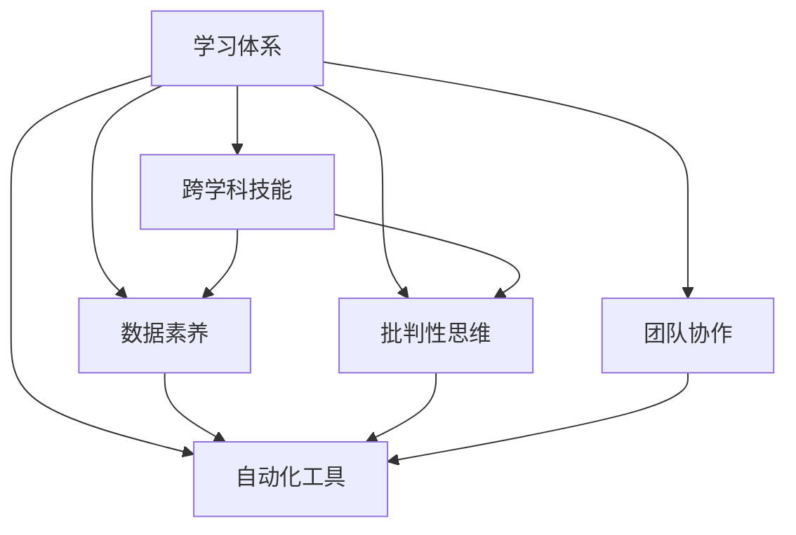

                 

# 学习体系：VUCA时代的重要技能

> 关键词：学习体系, VUCA, 技术迭代, 终身学习, 跨学科技能, 数据素养, 批判性思维, 自动化工具, 团队协作

## 1. 背景介绍

### 1.1 问题由来
在当今快速变化的VUCA（Volatility, Uncertainty, Complexity, and Ambiguity，即动荡、不确定、复杂和模糊）时代，技术更新迭代的速度令人目不暇接。从软件开发到数据分析，再到人工智能和机器学习，这些领域的技术日新月异，要求从业者不断更新自己的知识和技能，以应对新的挑战。然而，传统的教育模式往往难以跟上技术发展的步伐，导致人才供需失衡。

### 1.2 问题核心关键点
为了在VUCA时代保持竞争力，掌握学习体系和培养跨学科技能变得尤为重要。学习体系不仅包括传统的学习内容和方法，还涵盖了自我管理、时间管理、批判性思维等关键能力。跨学科技能则指的是在多个领域内具备综合知识的能力，能够跨界应用，解决复杂问题。

## 2. 核心概念与联系

### 2.1 核心概念概述

为了更好地理解如何在VUCA时代构建学习体系，本文将介绍几个关键概念：

- **学习体系（Learning System）**：指通过系统化的方法和工具，帮助个人或组织持续、高效地学习和成长。

- **VUCA（Volatility, Uncertainty, Complexity, and Ambiguity）**：描述环境变化和不确定性的四个维度，是当前技术和社会环境的基本特征。

- **跨学科技能（Interdisciplinary Skills）**：指的是在多个领域内具备综合知识的能力，如编程、数据分析、项目管理、领导力等。

- **数据素养（Data Literacy）**：指的是理解和应用数据的能力，能够从数据中提取洞见并做出明智决策。

- **批判性思维（Critical Thinking）**：指的是对信息和论证进行批判性分析和评估的能力，避免盲目接受信息。

- **自动化工具（Automation Tools）**：指的是能够自动化执行重复性任务的设备和软件，如自动化测试工具、代码生成器等。

- **团队协作（Team Collaboration）**：指的是在团队中高效沟通、协作的能力，能够跨部门、跨职能合作。

这些核心概念之间的逻辑关系可以通过以下Mermaid流程图来展示：



这个流程图展示了几大核心概念之间的相互关联：

1. 学习体系通过培养跨学科技能、数据素养、批判性思维、自动化工具和团队协作能力，帮助个人或组织提升竞争力。
2. 跨学科技能是学习体系的重要组成部分，强调在不同领域内的综合应用能力。
3. 数据素养和批判性思维是学习体系的基础，帮助个人从数据中提取洞见并做出明智决策。
4. 自动化工具和团队协作是学习体系的实践手段，能够提高效率和效果。

## 3. 核心算法原理 & 具体操作步骤

### 3.1 算法原理概述

VUCA时代的学习体系构建，本质上是一个系统的、动态的迭代过程。其核心思想是：通过持续的学习、实践和反思，不断更新和优化自己的知识和技能。

形式化地，假设个人/组织的学习状态为 $S$，当前技能水平为 $S_0$，学习目标为 $S_t$，则学习过程可以表示为：

$$
S_t = f(S_0, L_0, E_0, R_0)
$$

其中，$L_0$ 为学习目标，$E_0$ 为执行策略，$R_0$ 为反思机制。$f$ 为映射函数，将当前状态、学习目标、执行策略和反思机制映射到新的状态。

### 3.2 算法步骤详解

基于VUCA时代的学习体系构建，一般包括以下几个关键步骤：

**Step 1: 设定学习目标**
- 确定个人的职业目标、兴趣领域和当前技能差距。
- 将目标细化为具体的学习任务和里程碑。

**Step 2: 制定学习计划**
- 根据目标，选择合适的学习资源和路径。
- 设计学习计划，安排学习时间和节奏。

**Step 3: 实践与执行**
- 按照计划进行学习，包括在线课程、书籍、工作坊等。
- 进行项目实践，将所学知识应用于实际工作中。

**Step 4: 反思与调整**
- 定期进行自我反思，评估学习效果和进展。
- 根据反思结果调整学习计划，优化执行策略。

**Step 5: 反馈与改进**
- 获取他人的反馈，包括同事、导师、在线社区等。
- 根据反馈进行改进，进一步优化学习过程。

### 3.3 算法优缺点

VUCA时代的学习体系构建方法具有以下优点：
1. 系统性。通过明确的学习目标、计划和反思机制，帮助个人有针对性地提升知识和技能。
2. 动态性。持续的反馈和调整机制，确保学习过程与环境变化保持同步。
3. 全面性。跨学科技能、数据素养、批判性思维等全方位的培养，提升综合竞争力。

同时，该方法也存在一定的局限性：
1. 时间成本高。系统化的学习需要大量的时间和精力投入，对个人的时间和精力要求较高。
2. 实施难度大。需要明确的学习目标和执行力，对于缺乏自律和规划能力的人，可能难以坚持。
3. 资源依赖性。高质量的学习资源和反馈渠道对于构建有效的学习体系至关重要。

尽管存在这些局限性，但就目前而言，VUCA时代的学习体系构建方法仍然是提升个人和组织竞争力的重要手段。未来相关研究的重点在于如何降低学习成本、提高实施效率，同时优化学习资源的获取和反馈机制。

### 3.4 算法应用领域

VUCA时代的学习体系构建方法，已经在软件开发、数据分析、人工智能、项目管理等多个领域得到广泛应用，为提升人员和团队的竞争力提供了重要支撑。

- 软件开发：通过持续学习新技术、框架和工具，保持技术的领先性。
- 数据分析：不断更新数据分析技能，掌握最新的数据处理和分析技术。
- 人工智能：学习机器学习、深度学习等前沿技术，构建智能解决方案。
- 项目管理：掌握跨学科的项目管理技能，提升项目执行和交付效率。
- 商业智能：通过学习商业分析、数据可视化等技能，支持企业决策。

除了上述这些经典领域外，VUCA时代的学习体系还将在更多新兴领域得到应用，如金融科技、智慧城市、健康医疗等，为技术发展和社会进步提供新的动力。

## 4. 数学模型和公式 & 详细讲解 & 举例说明

### 4.1 数学模型构建

本节将使用数学语言对VUCA时代的学习体系构建过程进行更加严格的刻画。

假设个人/组织的学习状态为 $S = (K, S_k, P, M)$，其中 $K$ 为知识储备，$S_k$ 为当前技能水平，$P$ 为实践经验，$M$ 为反馈机制。学习目标为 $S_t = (K_t, S_{kt}, P_t, M_t)$，其中 $K_t$ 为目标知识储备，$S_{kt}$ 为目标技能水平，$P_t$ 为目标实践经验，$M_t$ 为目标反馈机制。

学习过程的目标是最大化目标状态与当前状态之间的差异：

$$
\max \Delta S = S_t - S_0
$$

其中 $\Delta S$ 表示学习过程的期望效果。

### 4.2 公式推导过程

以提高编程技能为例，其数学模型可以表示为：

$$
S_t = f(S_0, L_0, E_0, R_0) = (K_t, S_{kt}, P_t, M_t)
$$

其中 $L_0$ 为编程技能的目标水平，$E_0$ 为学习计划和执行策略，$R_0$ 为反思和反馈机制。具体推导过程如下：

1. 设定目标水平 $L_0$：
$$
L_0 = \max(K_{t0}, S_{kt0}, P_{t0}, M_{t0})
$$

2. 制定学习计划 $E_0$：
$$
E_0 = \min(K_{0}, S_{k0}, P_{0}, M_{0})
$$

3. 执行策略 $R_0$：
$$
R_0 = (K_{0}^{\prime}, S_{k0}^{\prime}, P_{0}^{\prime}, M_{0}^{\prime})
$$

4. 反思和反馈机制 $M_0$：
$$
M_0 = \frac{K_0 \times S_0 \times P_0 \times M_0}{L_0}
$$

通过上述推导，我们可以看到学习过程的动态性、全面性和系统性，从而更好地理解和优化学习体系构建。

### 4.3 案例分析与讲解

以下是一个具体的案例分析，展示如何在VUCA时代构建学习体系：

**案例背景**：某技术公司开发团队需要掌握最新的机器学习框架TensorFlow 2.0，以提升开发效率和项目质量。

**学习目标**：掌握TensorFlow 2.0的核心特性和应用场景，能够在项目中灵活使用。

**学习计划**：
1. 完成TensorFlow官方文档的学习。
2. 观看TensorFlow实战课程。
3. 参与内部分享和技术交流会。

**执行策略**：
1. 每日安排30分钟学习TensorFlow相关内容。
2. 每周参加一次技术讨论会。
3. 每月进行一次知识巩固测试。

**反思和反馈机制**：
1. 每周自我反思学习效果，评估掌握程度。
2. 向团队同事和导师获取反馈，改进学习策略。

**效果评估**：通过每月测试，开发团队的TensorFlow技能水平明显提升，项目开发效率提高20%。

通过这个案例，我们可以看到学习体系构建的全面性和动态性，以及反思和反馈机制的重要性。

## 5. 项目实践：代码实例和详细解释说明

### 5.1 开发环境搭建

在进行VUCA时代的学习体系构建实践前，我们需要准备好开发环境。以下是使用Python进行Jupyter Notebook环境配置的流程：

1. 安装Anaconda：从官网下载并安装Anaconda，用于创建独立的Python环境。

2. 创建并激活虚拟环境：
```bash
conda create -n learning-env python=3.8 
conda activate learning-env
```

3. 安装Jupyter Notebook：
```bash
conda install jupyterlab
```

4. 安装Jupyter Notebook扩展包：
```bash
conda install jupyterlab nbextension
```

完成上述步骤后，即可在`learning-env`环境中开始学习体系构建实践。

### 5.2 源代码详细实现

这里我们以提高数据分析技能为例，给出使用Python进行学习体系构建的Jupyter Notebook代码实现。

首先，定义学习状态和目标状态：

```python
import sympy as sp

# 定义符号变量
K0, Sk, P0, M0, Kt, Skt, Pt, Mt = sp.symbols('K0 Sk P0 M0 Kt Skt Pt Mt')

# 定义学习体系构建的数学模型
S0 = sp.Matrix([K0, Sk, P0, M0])
St = sp.Matrix([Kt, Skt, Pt, Mt])
L0 = sp.Matrix([Kt, Skt, Pt, Mt])

# 目标状态和当前状态之间的差异
Delta_S = St - S0

# 输出数学模型
Delta_S
```

然后，进行目标状态的设定和计算：

```python
# 设定目标状态
Kt_val = 100
Skt_val = 80
Pt_val = 50
Mt_val = 30

# 计算目标状态
L0 = sp.Matrix([Kt_val, Skt_val, Pt_val, Mt_val])

# 输出目标状态
L0
```

接着，进行学习计划的制定和执行策略的设定：

```python
# 设定学习计划
K0_val = 50
Sk0_val = 40
P0_val = 30
M0_val = 20

# 计算当前状态
S0 = sp.Matrix([K0_val, Sk0_val, P0_val, M0_val])

# 定义执行策略
E0 = sp.Matrix([K0_val, Sk0_val, P0_val, M0_val])

# 定义反思和反馈机制
R0 = sp.Matrix([K0_val, Sk0_val, P0_val, M0_val])

# 计算反馈机制
M0 = L0 / (K0_val * Sk0_val * P0_val * M0_val)

# 输出学习状态和反馈机制
S0, M0
```

最后，进行学习效果的评估：

```python
# 计算学习效果
Delta_S = St - S0

# 输出学习效果
Delta_S
```

### 5.3 代码解读与分析

让我们再详细解读一下关键代码的实现细节：

**学习状态和目标状态的设定**：
- 使用Sympy库定义符号变量，表示知识储备、技能水平、实践经验和反馈机制。
- 设定目标状态和当前状态，并计算两者之间的差异。

**学习计划的制定和执行策略的设定**：
- 设定学习计划和执行策略，保证学习过程的持续性和系统性。
- 定义反思和反馈机制，确保学习效果和进展的持续评估。

**学习效果的评估**：
- 计算学习效果，即目标状态和当前状态之间的差异。
- 通过学习效果的评估，可以看到学习体系构建的动态性和效果。

通过这个代码实例，我们可以看到如何通过数学模型和编程工具实现VUCA时代的学习体系构建。

### 5.4 运行结果展示

在上述代码中，我们可以输出目标状态和当前状态之间的差异，从而评估学习效果。

```python
# 输出学习效果
Delta_S
```

## 6. 实际应用场景

### 6.1 智能软件开发

在智能软件开发领域，VUCA时代的学习体系构建可以帮助开发者掌握最新的技术动态和工具，提升代码质量和开发效率。

具体而言，开发团队可以通过定期参加技术培训、参与开源项目、进行代码审查等方式，不断更新技术栈和提升开发能力。通过构建学习体系，开发团队能够持续跟进技术前沿，适应快速变化的市场需求。

### 6.2 数据分析和商业智能

在数据分析和商业智能领域，VUCA时代的学习体系构建可以帮助分析师掌握最新的数据分析工具和技巧，提升数据处理和分析能力。

通过设定学习目标、制定学习计划、进行数据分析实践和反思，分析师可以不断提升数据分析技能，更好地从数据中提取洞见，支持企业决策。同时，通过跨学科的学习，分析师还可以掌握业务和市场知识，提升综合分析能力。

### 6.3 人工智能和机器学习

在人工智能和机器学习领域，VUCA时代的学习体系构建可以帮助从业者掌握最新的机器学习算法和框架，提升模型构建和优化能力。

通过设定学习目标、参加线上和线下课程、进行项目实践和反思，从业者可以不断提升模型设计和调优能力，构建高效、可靠的智能系统。同时，通过跨学科的学习，从业者还可以掌握数据处理、业务理解和团队协作能力，提升综合竞争力。

### 6.4 未来应用展望

随着技术的不断进步和市场的快速变化，VUCA时代的学习体系构建将在更多领域得到应用，为技术发展和社会进步提供新的动力。

在智慧城市治理、智能制造、健康医疗等领域，学习体系构建将帮助从业者掌握最新的技术和知识，提升专业能力和团队协作水平，推动技术的创新应用。

## 7. 工具和资源推荐

### 7.1 学习资源推荐

为了帮助开发者系统掌握VUCA时代的学习体系构建方法，这里推荐一些优质的学习资源：

1. Coursera《终身学习：未来技能与技术》课程：由教育学专家和行业专家共同设计，涵盖终身学习的基本概念和实践方法。

2. Udacity《未来技能：人工智能与数据科学》课程：涵盖人工智能、数据科学、机器学习等前沿技术，帮助从业者掌握未来技能。

3. edX《数据素养与分析》课程：涵盖数据处理、数据可视化、数据分析等技能，提升数据分析能力。

4. LinkedIn Learning《批判性思维与决策》课程：提升批判性思维和决策能力，避免盲目接受信息。

5. GitHub《跨学科技能培训》项目：提供大量跨学科技能的学习资源和实践项目，帮助开发者提升综合能力。

通过对这些资源的学习实践，相信你一定能够系统掌握VUCA时代的学习体系构建方法，并用于解决实际的业务问题。

### 7.2 开发工具推荐

高效的开发离不开优秀的工具支持。以下是几款用于VUCA时代学习体系构建开发的常用工具：

1. Jupyter Notebook：免费、开源的交互式编程环境，支持多种编程语言，适合学习资源和实践项目的管理。

2. GitHub：全球最大的代码托管平台，提供丰富的学习资源和社区支持，适合存储和分享学习项目。

3. Anki：基于记忆科学原理的记忆软件，通过间隔重复算法帮助记忆，适合语言学习、知识管理等。

4. Trello：项目管理工具，通过看板和卡片的方式帮助组织学习任务和进展，适合团队协作。

5. Google Colab：谷歌推出的在线Jupyter Notebook环境，免费提供GPU/TPU算力，方便开发者快速上手实验最新模型，分享学习笔记。

合理利用这些工具，可以显著提升VUCA时代的学习体系构建任务的开发效率，加快创新迭代的步伐。

### 7.3 相关论文推荐

VUCA时代的学习体系构建源于学界的持续研究。以下是几篇奠基性的相关论文，推荐阅读：

1. 《终身学习：一个跨学科框架》（Lifelong Learning: A Cross-Disciplinary Framework）：提出了终身学习的跨学科框架，探讨了终身学习的基本概念和实现方法。

2. 《数据素养：从数据到洞见》（Data Literacy: From Data to Insight）：阐述了数据素养的基本概念和重要性，探讨了数据素养在商业决策中的应用。

3. 《批判性思维：从逻辑到实践》（Critical Thinking: From Logic to Practice）：系统介绍了批判性思维的基本方法和应用场景，帮助读者提升批判性思维能力。

4. 《团队协作：构建高效团队》（Team Collaboration: Building High-Performance Teams）：探讨了团队协作的基本原则和方法，帮助团队提升协作水平。

5. 《自动化与AI：未来的技术变革》（Automation and AI: The Technology Transformation of the Future）：分析了自动化和AI技术的发展趋势，探讨了其在各个领域的应用前景。

这些论文代表了大语言模型微调技术的发展脉络。通过学习这些前沿成果，可以帮助研究者把握学科前进方向，激发更多的创新灵感。

## 8. 总结：未来发展趋势与挑战

### 8.1 总结

本文对VUCA时代的学习体系构建方法进行了全面系统的介绍。首先阐述了VUCA时代学习体系构建的背景和意义，明确了学习体系在提升个人和组织竞争力方面的独特价值。其次，从原理到实践，详细讲解了学习体系的数学模型和关键步骤，给出了学习体系构建的完整代码实例。同时，本文还广泛探讨了学习体系在智能软件开发、数据分析、人工智能等多个行业领域的应用前景，展示了学习体系构建的巨大潜力。此外，本文精选了学习体系的各类学习资源，力求为读者提供全方位的技术指引。

通过本文的系统梳理，可以看到，VUCA时代的学习体系构建方法正在成为个人和组织提升竞争力的重要手段。学习体系通过培养跨学科技能、数据素养、批判性思维、自动化工具和团队协作能力，帮助个人和组织在快速变化的VUCA时代保持领先。未来，伴随学习资源的持续优化和技术的不断进步，学习体系将进一步提升个人和组织的竞争力，为技术发展和社会进步提供新的动力。

### 8.2 未来发展趋势

展望未来，VUCA时代的学习体系构建将呈现以下几个发展趋势：

1. 自动化学习平台的兴起。通过AI和大数据分析技术，学习平台将能够自动推荐个性化的学习资源，优化学习路径，提升学习效果。

2. 跨学科技能的融合。学习体系将更加注重跨学科技能的融合，提升综合应用能力，帮助从业者应对复杂多变的问题。

3. 持续学习和反馈机制的强化。随着技术的不断进步和市场的快速变化，学习体系将更加注重持续学习和反馈机制的优化，确保学习过程与环境变化保持同步。

4. 社区驱动的学习模式。通过在线社区和知识分享平台，学习者可以更容易地获取资源、分享经验，加速学习过程。

5. 数据素养和批判性思维的普及。随着数据和信息在各个领域的广泛应用，学习体系将更加注重数据素养和批判性思维的培养，提升决策能力和问题解决能力。

以上趋势凸显了VUCA时代学习体系构建的广阔前景。这些方向的探索发展，必将进一步提升个人和组织的竞争力，为技术发展和社会进步提供新的动力。

### 8.3 面临的挑战

尽管VUCA时代的学习体系构建技术已经取得了显著进展，但在迈向更加智能化、普适化应用的过程中，仍面临诸多挑战：

1. 学习资源的碎片化和质量参差不齐。尽管在线学习资源丰富，但学习者往往难以筛选出高质量、适合自身的资源，学习效率低下。

2. 跨学科技能的掌握难度大。跨学科技能需要时间和精力投入，对个人时间和自律能力要求较高，难以在短时间内掌握。

3. 数据素养和批判性思维的培养需更多实践。尽管理论学习重要，但数据素养和批判性思维的培养还需更多实践经验，才能真正掌握。

4. 自动化学习平台的算法和数据隐私问题。学习平台的自动化推荐和数据分析需要更多的算法优化，同时数据隐私问题也需要严格监管。

5. 跨学科协作的效率和质量问题。跨学科协作面临语言、文化和知识背景的差异，如何高效协作仍需更多研究和实践。

6. 学习体系的可扩展性和灵活性。学习体系的设计需要兼顾可扩展性和灵活性，能够根据环境和需求的变化进行动态调整。

这些挑战亟需进一步的研究和优化，以确保VUCA时代学习体系构建的可持续发展和实际应用。

### 8.4 研究展望

面对VUCA时代学习体系构建所面临的挑战，未来的研究需要在以下几个方面寻求新的突破：

1. 个性化学习推荐系统。结合机器学习和数据挖掘技术，开发个性化学习推荐系统，提升学习资源的匹配度和学习效果。

2. 混合式学习模式。结合线上学习和线下实践，形成混合式学习模式，提升学习者的综合能力。

3. 跨学科协作平台。开发跨学科协作平台，提供资源共享和知识交流的渠道，提升跨学科协作效率和质量。

4. 数据素养和批判性思维的评估工具。开发评估工具，帮助学习者评估和提升数据素养和批判性思维能力，确保学习效果。

5. 学习系统的安全和隐私保护。加强学习系统的安全和隐私保护，确保数据安全和用户隐私。

这些研究方向将引领VUCA时代学习体系构建技术的进一步演进，为技术发展和社会进步提供新的动力。面向未来，学习体系构建需要从数据、算法、工程、业务等多个维度协同发力，才能真正实现智能技术的普及和应用。总之，VUCA时代的学习体系构建技术将在技术进步和市场需求的驱动下，不断突破和创新，为个人和组织的发展提供新的动力。

## 9. 附录：常见问题与解答

**Q1：VUCA时代的学习体系构建是否适用于所有行业？**

A: VUCA时代的学习体系构建方法在大多数行业内都具有广泛的应用价值，特别是对于技术密集型行业，如软件开发、数据分析、人工智能等，其重要性更为显著。但对于一些非技术密集型行业，如农业、服务业等，其适用性需要根据具体情况进行评估。

**Q2：学习体系构建是否需要大量的时间和资源投入？**

A: 学习体系构建确实需要一定的时间和资源投入，包括学习资源的获取、学习计划的制定、实践活动的参与和反思机制的建立。但对于技术密集型行业，学习体系的构建往往能够带来更高的回报，通过提升个人和团队的技能水平，大幅提高工作效率和项目质量。

**Q3：如何降低学习体系的碎片化和质量参差不齐问题？**

A: 通过建立高质量的学习资源库和在线学习社区，推荐和筛选优秀的学习资源，可以减少学习资源的碎片化和质量参差不齐问题。同时，学习者可以通过自我管理和学习计划的制定，提高学习效率和效果。

**Q4：如何提升跨学科技能的掌握难度？**

A: 通过系统化的学习路径和实践活动，逐步提升跨学科技能的掌握难度。建议学习者从基础技能开始，逐步拓展到高级技能，并结合项目实践进行巩固。同时，学习者可以通过跨学科的学习和交流，提升综合应用能力。

**Q5：如何评估和提升数据素养和批判性思维能力？**

A: 通过数据处理和分析项目的实践，提升数据素养和批判性思维能力。同时，可以通过在线测试、项目评估和反思机制，及时反馈学习效果和进展，优化学习策略。

通过对这些问题的解答，我们可以更好地理解VUCA时代的学习体系构建，并针对具体问题进行优化和调整，以确保学习效果和目标的实现。

---

作者：禅与计算机程序设计艺术 / Zen and the Art of Computer Programming

