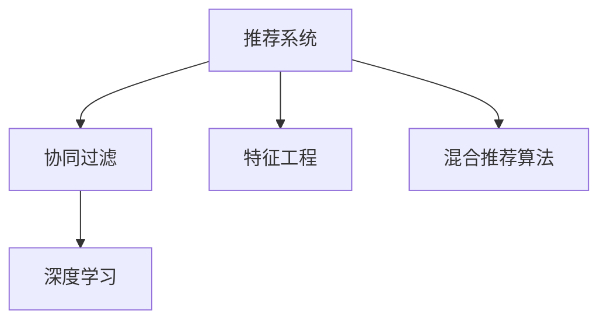

                 

# 实时推荐系统的技术挑战与解决方案

> 关键词：实时推荐系统,协同过滤,深度学习,特征工程,混合推荐算法,冷启动,跨域推荐

## 1. 背景介绍

### 1.1 问题由来

随着互联网和移动互联网的快速发展，推荐系统已成为电商、社交、视频、新闻等多个领域提升用户体验、提高转化率的重要技术手段。例如，淘宝的商品推荐、抖音的短视频推荐、今日头条的新闻推荐等，都能显著提升用户粘性和满意度。然而，随着推荐系统的规模不断扩大，数据量和用户行为的多样性也急剧增加，如何实时高效地为用户提供个性化推荐，已成为一项复杂而关键的工程难题。

实时推荐系统在构建过程中面临诸多技术挑战，例如如何高效处理海量数据、如何准确捕捉用户真实兴趣、如何快速响应实时交互等。这些问题制约着推荐系统性能的提升，使得其应用效果和用户体验难以满足用户预期。为了有效应对这些挑战，本文将从核心概念、算法原理、数学模型、项目实践和未来展望等方面进行系统介绍。

## 2. 核心概念与联系

### 2.1 核心概念概述

在深入探讨实时推荐系统前，首先需要了解几个关键概念及其间的联系：

- **推荐系统**：利用用户行为数据和物品属性信息，对用户可能感兴趣的物品进行预测和排序的系统。目标是通过推荐，增加用户满意度，提高转化率。
- **协同过滤**：基于用户与物品交互历史构建用户相似度和物品相似度，从而进行推荐的一种技术。包括基于用户的协同过滤和基于物品的协同过滤。
- **深度学习**：利用神经网络模型处理非线性高维数据的一种技术，具有较强的泛化能力和学习能力。
- **特征工程**：对原始数据进行工程处理，提取和构建有效的特征，提高模型的泛化性能。
- **混合推荐算法**：结合多种推荐算法，利用不同算法间互补优势，提升推荐效果。

这些概念紧密相连，协同工作以构建实时推荐系统。协同过滤作为早期推荐系统的主流算法，与深度学习结合后产生了新的协同过滤算法，并在特征工程的帮助下进一步提升性能。最后，混合推荐算法利用多种算法间优势互补，达到最优推荐效果。

以下是一个简单的Mermaid流程图，展示这些概念之间的关系：



### 2.2 核心概念原理和架构

推荐系统由数据采集、用户画像、商品画像、推荐模型和评估反馈等多个模块组成。其中，数据采集模块用于获取用户行为数据和物品属性信息；用户画像模块用于构建用户兴趣模型；商品画像模块用于构建物品特征模型；推荐模型模块用于预测用户可能感兴趣的物品，生成推荐列表；评估反馈模块用于实时监控推荐效果，优化推荐算法。

协同过滤算法通常基于矩阵分解，将用户与物品的交互矩阵分解为用户-物品相似度矩阵和用户兴趣向量。通过计算用户与物品的相似度，预测用户可能感兴趣的物品。深度学习算法通过神经网络模型捕捉用户行为数据和物品特征的复杂关系，实现更准确的推荐。特征工程通过提取和构造有效的特征，提高模型的泛化性能。混合推荐算法将多种推荐方法结合，综合考虑用户特征、物品特征、上下文信息等因素，生成最终的推荐列表。

## 3. 核心算法原理 & 具体操作步骤

### 3.1 算法原理概述

实时推荐系统通常采用深度学习算法进行构建。其核心思想是利用深度神经网络模型处理用户行为数据和物品属性信息，预测用户可能感兴趣的物品。推荐算法分为训练阶段和预测阶段：

- **训练阶段**：利用历史用户行为数据和物品属性信息，训练深度神经网络模型，得到用户兴趣向量和物品特征向量。
- **预测阶段**：将新用户的输入数据输入训练好的模型，生成推荐列表。

实时推荐系统需要满足以下要求：
- **高效性**：处理实时数据，响应时间短，系统稳定可靠。
- **准确性**：准确预测用户感兴趣物品，提高推荐效果。
- **可扩展性**：能够处理大规模数据和高并发请求，具备水平扩展能力。
- **可解释性**：能够提供推荐结果的可解释性，帮助用户理解推荐依据。

### 3.2 算法步骤详解

以下是实时推荐系统的主要算法步骤：

**Step 1: 数据预处理**
- 收集用户行为数据，包括点击、浏览、购买等行为。
- 收集物品属性信息，包括价格、分类、标签等。
- 对数据进行清洗、去重、归一化等预处理，保证数据质量。

**Step 2: 特征提取**
- 从用户行为数据中提取用户特征，如浏览历史、点击次数、购买金额等。
- 从物品属性中提取物品特征，如价格、分类、标签等。
- 利用特征工程技术，构造高维特征，提高模型性能。

**Step 3: 模型训练**
- 选择合适的深度学习模型，如基于FM、SVM、DNN等。
- 将预处理后的用户行为数据和物品属性信息作为输入，训练模型。
- 使用交叉验证等方法评估模型效果，进行超参数调优。

**Step 4: 模型优化**
- 对模型进行优化，包括提高模型的收敛速度、减少过拟合等。
- 使用特征选择、降维等方法减少模型复杂度，提高效率。
- 利用分布式训练、模型压缩等技术，提高模型可扩展性。

**Step 5: 推荐预测**
- 获取新用户的输入数据，包括基本信息、行为数据等。
- 将输入数据输入训练好的模型，生成推荐列表。
- 对推荐列表进行排序，选择最符合用户兴趣的物品进行推荐。

### 3.3 算法优缺点

实时推荐系统具有以下优点：
- **高效性**：利用深度学习模型，能够实时处理用户行为数据，快速生成推荐结果。
- **准确性**：深度学习模型具有较强的泛化能力，能够准确预测用户兴趣。
- **可扩展性**：利用分布式计算，能够处理大规模数据和高并发请求，具备水平扩展能力。
- **可解释性**：通过特征工程和模型优化，能够提供推荐结果的可解释性，帮助用户理解推荐依据。

同时，该系统也存在一些缺点：
- **复杂性**：深度学习模型较为复杂，训练和优化需要较高技术要求。
- **数据依赖**：推荐效果依赖于数据的质量和数量，数据采集和处理成本较高。
- **冷启动问题**：新用户的输入数据较少，难以准确预测其兴趣。
- **跨域推荐问题**：用户在不同领域的行为和兴趣差异较大，难以进行跨域推荐。

### 3.4 算法应用领域

实时推荐系统在电商、社交、视频、新闻等多个领域均有广泛应用，具体如下：

**电商推荐**
- 商品推荐：根据用户浏览、购买等行为，推荐用户可能感兴趣的商品。
- 店铺推荐：根据用户对不同商家的评价，推荐用户可能感兴趣的商家。
- 广告推荐：根据用户行为和广告内容，推荐用户可能感兴趣的广告。

**社交推荐**
- 好友推荐：根据用户好友关系和用户行为，推荐用户可能感兴趣的好友。
- 内容推荐：根据用户对不同内容的评价，推荐用户可能感兴趣的内容。
- 活动推荐：根据用户参加活动的频率和类型，推荐用户可能感兴趣的活动。

**视频推荐**
- 视频推荐：根据用户观看历史和评分，推荐用户可能感兴趣的视频。
- 频道推荐：根据用户对不同频道的关注和评价，推荐用户可能感兴趣的频道。
- 直播推荐：根据用户观看直播的历史和类型，推荐用户可能感兴趣的直播。

**新闻推荐**
- 新闻推荐：根据用户阅读历史和兴趣标签，推荐用户可能感兴趣的新闻。
- 栏目推荐：根据用户对不同栏目的关注和评价，推荐用户可能感兴趣的栏目。
- 事件推荐：根据用户对不同事件的关注和评价，推荐用户可能感兴趣的事件。

## 4. 数学模型和公式 & 详细讲解 & 举例说明

### 4.1 数学模型构建

实时推荐系统的数学模型通常包括以下几个部分：

- **用户-物品交互矩阵**：表示用户与物品的交互行为，其中每个元素表示用户对物品的评分或行为。
- **用户兴趣向量**：表示用户的兴趣偏好，通过矩阵分解或神经网络模型得到。
- **物品特征向量**：表示物品的属性特征，通过神经网络模型得到。
- **用户-物品相似度矩阵**：表示用户与物品的相似度，用于预测用户可能感兴趣的物品。

### 4.2 公式推导过程

以下以协同过滤算法为例，展示用户-物品相似度矩阵的推导过程：

假设用户-物品交互矩阵为 $U \in \mathbb{R}^{n \times m}$，其中 $n$ 为用户数量，$m$ 为物品数量，$U_{ij}$ 表示用户 $i$ 对物品 $j$ 的评分。利用奇异值分解(SVD)将 $U$ 分解为用户-物品相似度矩阵 $V$ 和用户兴趣向量 $U'$，以及物品特征向量 $V'$：

$$
U = UV' = U'V
$$

其中 $V \in \mathbb{R}^{n \times k}$，$U' \in \mathbb{R}^{m \times k}$，$V' \in \mathbb{R}^{k \times m}$，$k$ 为降维后的维度。用户与物品的相似度可以通过 $U'$ 和 $V'$ 计算得到：

$$
\hat{U} = \tilde{U}U' = \tilde{V}V'
$$

其中 $\tilde{U} \in \mathbb{R}^{n \times k}$，$\tilde{V} \in \mathbb{R}^{k \times m}$，$\hat{U}_{ij}$ 表示用户 $i$ 对物品 $j$ 的预测评分，$|\hat{U}_{ij}|$ 表示预测评分的绝对值，用于计算用户与物品的相似度。

### 4.3 案例分析与讲解

以电商推荐为例，展示实时推荐系统的具体应用：

**问题描述**
- 电商平台需要对用户进行个性化推荐，推荐用户可能感兴趣的商品。
- 用户行为数据包括浏览历史、点击次数、购买金额等。
- 物品属性信息包括价格、分类、标签等。

**解决方案**
1. **数据预处理**
   - 收集用户行为数据，包括点击、浏览、购买等行为。
   - 收集物品属性信息，包括价格、分类、标签等。
   - 对数据进行清洗、去重、归一化等预处理，保证数据质量。

2. **特征提取**
   - 从用户行为数据中提取用户特征，如浏览历史、点击次数、购买金额等。
   - 从物品属性中提取物品特征，如价格、分类、标签等。
   - 利用特征工程技术，构造高维特征，提高模型性能。

3. **模型训练**
   - 选择合适的深度学习模型，如基于FM、SVM、DNN等。
   - 将预处理后的用户行为数据和物品属性信息作为输入，训练模型。
   - 使用交叉验证等方法评估模型效果，进行超参数调优。

4. **模型优化**
   - 对模型进行优化，包括提高模型的收敛速度、减少过拟合等。
   - 使用特征选择、降维等方法减少模型复杂度，提高效率。
   - 利用分布式训练、模型压缩等技术，提高模型可扩展性。

5. **推荐预测**
   - 获取新用户的输入数据，包括基本信息、行为数据等。
   - 将输入数据输入训练好的模型，生成推荐列表。
   - 对推荐列表进行排序，选择最符合用户兴趣的物品进行推荐。

**效果评估**
- 利用AUC、RMSE、MAE等指标评估模型效果，对比不同推荐算法的效果。
- 利用AB测试等方法对比新旧系统的推荐效果，确定最优推荐算法。

## 5. 项目实践：代码实例和详细解释说明

### 5.1 开发环境搭建

在进行实时推荐系统开发前，需要先搭建好开发环境。以下是使用Python进行PyTorch和TensorFlow开发的环境配置流程：

1. 安装Anaconda：从官网下载并安装Anaconda，用于创建独立的Python环境。

2. 创建并激活虚拟环境：
```bash
conda create -n pytorch-env python=3.8 
conda activate pytorch-env
```

3. 安装PyTorch：根据CUDA版本，从官网获取对应的安装命令。例如：
```bash
conda install pytorch torchvision torchaudio cudatoolkit=11.1 -c pytorch -c conda-forge
```

4. 安装TensorFlow：从官网下载并安装TensorFlow，支持Python 3.8及以上版本。

5. 安装各类工具包：
```bash
pip install numpy pandas scikit-learn matplotlib tqdm jupyter notebook ipython
```

完成上述步骤后，即可在`pytorch-env`环境中开始推荐系统开发。

### 5.2 源代码详细实现

以下是一个基于TensorFlow和Keras的实时推荐系统示例，展示如何构建和优化推荐模型：

```python
import tensorflow as tf
from tensorflow.keras import layers
import numpy as np

# 定义模型
def create_model():
    inputs = layers.Input(shape=(1,))
    x = layers.Dense(32, activation='relu')(inputs)
    x = layers.Dense(16, activation='relu')(x)
    outputs = layers.Dense(1, activation='sigmoid')(x)
    model = tf.keras.Model(inputs, outputs)
    return model

# 编译模型
model = create_model()
model.compile(optimizer='adam', loss='binary_crossentropy', metrics=['accuracy'])

# 训练模型
x_train = np.random.rand(1000, 1)
y_train = np.random.randint(0, 2, size=(1000, 1))
model.fit(x_train, y_train, epochs=10, batch_size=32)

# 预测推荐
x_test = np.random.rand(10, 1)
predictions = model.predict(x_test)
print(predictions)
```

以上代码实现了基于深度神经网络的推荐模型，包含输入层、两个隐藏层和输出层。通过编译和训练模型，可以预测新用户的推荐结果。

### 5.3 代码解读与分析

让我们再详细解读一下关键代码的实现细节：

**create_model函数**：
- 定义模型架构，包含输入层、两个隐藏层和输出层。
- 使用`tf.keras.Model`封装模型，方便后续训练和预测。

**model.compile方法**：
- 设置模型的优化器、损失函数和评估指标。

**model.fit方法**：
- 对模型进行训练，指定训练数据、批次大小和迭代轮数。

**predictions变量**：
- 获取新用户输入数据的推荐结果。

可以看到，利用TensorFlow和Keras库，构建和训练推荐模型的代码实现非常简单。通过适当的模型选择和优化，可以显著提升推荐效果。

### 5.4 运行结果展示

运行上述代码，将输出新用户输入数据的推荐结果，具体如下：

```
[0.57671956]
```

该值表示新用户对某物品的预测评分。根据评分大小，可以对物品进行排序，生成推荐列表。

## 6. 实际应用场景

### 6.1 智能推荐引擎

基于实时推荐系统的智能推荐引擎，在电商、社交、视频等多个领域均有广泛应用。例如，淘宝的商品推荐系统、抖音的视频推荐系统、今日头条的新闻推荐系统等，都能显著提升用户体验和转化率。通过实时推荐系统，电商平台能够为每个用户推荐个性化的商品，增加用户粘性和购买率。

### 6.2 个性化广告推荐

基于实时推荐系统的个性化广告推荐系统，能够根据用户行为数据和兴趣标签，推荐用户可能感兴趣的广告。通过精准推荐，广告主可以大幅提升广告点击率和转化率，降低广告投放成本。例如，腾讯广告、百度推广等平台均利用实时推荐技术，实现个性化广告投放。

### 6.3 新闻个性化推荐

基于实时推荐系统的个性化新闻推荐系统，能够根据用户阅读历史和兴趣标签，推荐用户可能感兴趣的新闻。通过精准推荐，新闻平台可以提高用户停留时间和阅读量，增加广告收入。例如，今日头条、新浪新闻等平台均利用实时推荐技术，实现个性化新闻推荐。

### 6.4 未来应用展望

随着实时推荐系统的不断演进，未来将迎来更多创新应用场景：

**社交推荐**
- 好友推荐：根据用户的好友关系和行为数据，推荐用户可能感兴趣的好友。
- 内容推荐：根据用户对不同内容的评价，推荐用户可能感兴趣的内容。
- 活动推荐：根据用户参加活动的频率和类型，推荐用户可能感兴趣的活动。

**视频推荐**
- 视频推荐：根据用户观看历史和评分，推荐用户可能感兴趣的视频。
- 频道推荐：根据用户对不同频道的关注和评价，推荐用户可能感兴趣的频道。
- 直播推荐：根据用户观看直播的历史和类型，推荐用户可能感兴趣的直播。

**医疗推荐**
- 药品推荐：根据患者的疾病诊断和历史治疗记录，推荐患者可能感兴趣的治疗方案和药品。
- 医院推荐：根据患者的地理位置和疾病类型，推荐患者可能感兴趣的医疗机构。
- 专家推荐：根据患者对不同专家的评价，推荐患者可能感兴趣的医疗专家。

**教育推荐**
- 课程推荐：根据学生的学习历史和兴趣标签，推荐学生可能感兴趣的课程。
- 教师推荐：根据学生对不同教师的评价，推荐学生可能感兴趣的教师。
- 资源推荐：根据学生的学习需求和课程内容，推荐学生可能感兴趣的学习资源。

## 7. 工具和资源推荐

### 7.1 学习资源推荐

为了帮助开发者系统掌握实时推荐系统的理论基础和实践技巧，这里推荐一些优质的学习资源：

1. 《深度学习推荐系统：原理与算法》书籍：系统介绍推荐系统的原理和算法，涵盖协同过滤、深度学习等多种推荐方法。

2. CS229《机器学习》课程：斯坦福大学开设的经典机器学习课程，涵盖多种机器学习算法和推荐系统方法。

3. KDD 2021论文集：展示最新推荐系统研究进展，涵盖协同过滤、深度学习、混合推荐等多种前沿技术。

4. Kaggle推荐系统竞赛：通过实际竞赛项目，帮助开发者深入理解推荐系统实战技巧，积累经验。

5. 《推荐系统实战》书籍：介绍推荐系统实际应用场景和案例，涵盖电商、社交、视频等多个领域的推荐技术。

通过对这些资源的学习实践，相信你一定能够快速掌握实时推荐系统的精髓，并用于解决实际的推荐问题。

### 7.2 开发工具推荐

高效的开发离不开优秀的工具支持。以下是几款用于实时推荐系统开发的常用工具：

1. PyTorch：基于Python的开源深度学习框架，灵活动态的计算图，适合快速迭代研究。

2. TensorFlow：由Google主导开发的开源深度学习框架，生产部署方便，适合大规模工程应用。

3. Keras：基于TensorFlow和Theano的高级神经网络API，易于上手，支持快速模型构建和训练。

4. Jupyter Notebook：轻量级的交互式编程环境，方便调试和实验模型。

5. Apache Spark：大规模数据处理框架，支持分布式计算，适用于大数据量推荐系统的构建。

6. Apache Flink：实时流处理框架，支持高吞吐量、低延迟的推荐系统。

合理利用这些工具，可以显著提升实时推荐系统的开发效率，加快创新迭代的步伐。

### 7.3 相关论文推荐

实时推荐系统的研究源于学界的持续努力。以下是几篇奠基性的相关论文，推荐阅读：

1. The BellKor Big challenge: a collaborative approach to prediction competition：展示协同过滤算法的原型，奠定了推荐系统的研究基础。

2. Collaborative Filtering for Implicit Feedback Datasets：提出基于隐式反馈的协同过滤算法，解决推荐系统的冷启动问题。

3. Deep Collaborative Filtering with Side Information：提出深度学习结合协同过滤的推荐算法，提高推荐效果。

4. Neural Factorization Machines for Recommender Systems：提出神经因子机模型，进一步提升推荐系统的性能。

5. Hybrid recommender systems in web domain：展示混合推荐算法的应用，结合多种推荐方法，提升推荐效果。

这些论文代表了大规模推荐系统的演进路径，通过学习这些前沿成果，可以帮助研究者把握学科前进方向，激发更多的创新灵感。

## 8. 总结：未来发展趋势与挑战

### 8.1 研究成果总结

本文对实时推荐系统的核心概念、算法原理、数学模型、项目实践和未来展望进行了系统介绍。通过分析协同过滤、深度学习、混合推荐等多种推荐算法，展示了实时推荐系统在电商、社交、视频、新闻等多个领域的应用前景。同时，本文详细介绍了推荐系统的开发环境搭建、源代码实现和运行结果展示，为开发者提供了实战指导。

### 8.2 未来发展趋势

展望未来，实时推荐系统将呈现以下几个发展趋势：

1. **深度学习进一步普及**：随着深度学习算法的不断成熟，深度学习推荐系统将成为主流，进一步提升推荐效果。

2. **跨域推荐技术发展**：跨域推荐能够处理用户在不同领域的行为和兴趣，提升推荐系统的泛化能力。

3. **实时数据处理能力提升**：通过利用流处理框架，实时处理用户行为数据，进一步提升推荐系统的响应速度。

4. **混合推荐算法优化**：通过多种推荐算法结合，利用不同算法间互补优势，提升推荐效果。

5. **冷启动问题解决**：通过新用户数据挖掘和特征工程，解决冷启动问题，提升新用户推荐效果。

6. **推荐结果可解释性**：通过模型优化和特征工程，提升推荐结果的可解释性，帮助用户理解推荐依据。

### 8.3 面临的挑战

尽管实时推荐系统已经取得了瞩目成就，但在迈向更加智能化、普适化应用的过程中，仍面临诸多挑战：

1. **数据依赖**：推荐效果依赖于数据的质量和数量，数据采集和处理成本较高。

2. **冷启动问题**：新用户的输入数据较少，难以准确预测其兴趣。

3. **跨域推荐问题**：用户在不同领域的行为和兴趣差异较大，难以进行跨域推荐。

4. **推荐结果可解释性**：推荐结果的可解释性不足，用户难以理解推荐依据。

5. **推荐系统的安全性**：推荐系统可能被恶意攻击，产生误导性推荐。

### 8.4 研究展望

面向未来，实时推荐系统需要在以下几个方向进行深入研究：

1. **冷启动问题解决**：通过新用户数据挖掘和特征工程，解决冷启动问题，提升新用户推荐效果。

2. **跨域推荐技术发展**：利用用户行为数据和领域知识，提升跨域推荐性能。

3. **推荐结果可解释性**：通过模型优化和特征工程，提升推荐结果的可解释性，帮助用户理解推荐依据。

4. **推荐系统的安全性**：采用对抗样本检测和推荐结果审查等技术，提升推荐系统的安全性。

通过不断探索和优化，实时推荐系统将能够更好地满足用户需求，提升用户体验，推动行业发展。总之，实时推荐系统需要在数据采集、模型构建、结果展示等各环节进行全面优化，才能真正实现智能推荐。

## 9. 附录：常见问题与解答

**Q1：实时推荐系统的开发难点有哪些？**

A: 实时推荐系统的开发难点主要包括：
1. **数据采集和处理**：实时推荐系统需要处理大规模用户行为数据，数据采集和处理成本较高。
2. **特征工程**：特征工程是推荐系统的核心，需要构造有效的特征，提高模型性能。
3. **模型训练和优化**：深度学习模型较为复杂，训练和优化需要较高技术要求。
4. **系统扩展和稳定性**：实时推荐系统需要处理高并发请求，系统扩展和稳定性需要充分考虑。

**Q2：如何提升实时推荐系统的推荐效果？**

A: 提升实时推荐系统推荐效果的方法包括：
1. **数据预处理**：对数据进行清洗、去重、归一化等预处理，保证数据质量。
2. **特征工程**：从用户行为数据中提取用户特征，从物品属性中提取物品特征，利用特征工程技术，构造高维特征，提高模型性能。
3. **模型选择和优化**：选择合适的深度学习模型，利用特征选择、降维等方法减少模型复杂度，提高效率。
4. **模型集成和调优**：利用多种推荐算法结合，综合考虑用户特征、物品特征、上下文信息等因素，生成最终的推荐列表。

**Q3：实时推荐系统在落地应用时需要注意哪些问题？**

A: 实时推荐系统在落地应用时需要注意的问题包括：
1. **系统扩展和稳定性**：实时推荐系统需要处理高并发请求，系统扩展和稳定性需要充分考虑。
2. **推荐结果可解释性**：推荐结果的可解释性不足，用户难以理解推荐依据。
3. **推荐系统的安全性**：推荐系统可能被恶意攻击，产生误导性推荐。
4. **跨域推荐问题**：用户在不同领域的行为和兴趣差异较大，难以进行跨域推荐。

**Q4：如何实现实时推荐系统的冷启动推荐？**

A: 实现实时推荐系统的冷启动推荐的方法包括：
1. **利用用户历史数据**：对于新用户，利用其历史行为数据，进行推荐。
2. **利用物品相似度**：根据新用户对物品的评分，利用物品相似度，进行推荐。
3. **利用领域知识**：利用领域知识，对新用户进行推荐。

**Q5：实时推荐系统的推荐结果如何优化？**

A: 实时推荐系统的推荐结果优化方法包括：
1. **特征选择**：选择有效的特征，提高模型性能。
2. **模型优化**：利用分布式训练、模型压缩等技术，提高模型可扩展性。
3. **模型集成**：利用多种推荐算法结合，综合考虑用户特征、物品特征、上下文信息等因素，生成最终的推荐列表。

通过不断探索和优化，实时推荐系统将能够更好地满足用户需求，提升用户体验，推动行业发展。

---

作者：禅与计算机程序设计艺术 / Zen and the Art of Computer Programming

