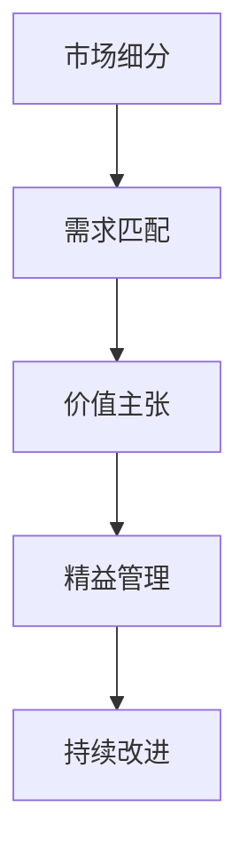

                 

# 小公司的生存策略：精准服务垂直领域，满足独特需求与价值主张

## 1. 背景介绍

### 1.1 问题由来

在当今快速变化的市场环境中，小公司面临着前所未有的挑战。一方面，大公司的市场占有率不断扩大，对资源的争夺愈发激烈；另一方面，消费者对产品和服务的个性化需求日益增加，要求企业提供更加定制化的解决方案。如何在这两个方向的竞争中取得突破，成为了小公司亟待解决的生存问题。

小公司由于资源有限，无法像大公司那样进行全方位的市场布局和运营，必须寻找细分市场进行精准定位。通过精准服务垂直领域，满足独特需求和价值主张，小公司可以在特定领域内形成竞争优势，实现差异化竞争，从而在激烈的市场竞争中脱颖而出。

### 1.2 问题核心关键点

小公司实施生存策略的关键点在于：

1. **市场细分**：准确识别并切入具有潜力的细分市场，避免与大公司进行直接竞争。
2. **需求匹配**：深入理解目标客户群体的独特需求，提供量身定制的解决方案。
3. **资源优化**：在有限的资源条件下，通过精益管理和技术创新实现成本最小化和效率最大化。
4. **价值主张**：清晰阐述公司提供的独特价值，增强市场认知度和客户黏性。
5. **客户反馈**：建立有效的客户反馈机制，持续改进产品和服务，满足客户不断变化的需求。

这些关键点构成了一个系统的框架，帮助小公司在竞争中寻找生存和发展的空间。

### 1.3 问题研究意义

本文将系统性地探讨小公司如何通过精准服务垂直领域，满足独特需求与价值主张，从而在激烈的市场竞争中取得生存和发展。通过对小公司生存策略的深入分析，希望能为小公司的决策者提供有价值的参考，助力其找到适合自身特点的生存路径。

## 2. 核心概念与联系

### 2.1 核心概念概述

在探讨小公司生存策略的过程中，我们需要了解一些核心概念及其相互关系：

1. **市场细分**：将整体市场划分为若干个具有相似需求的子市场，每个子市场称为一个细分市场。
2. **需求匹配**：深入分析客户需求，设计并实现能够满足这些需求的解决方案。
3. **价值主张**：清晰定义公司产品或服务的独特价值，与竞争对手区分开来。
4. **精益管理**：采用精益管理理念，优化资源配置，提高运营效率。
5. **持续改进**：通过不断的反馈循环，持续改进产品和服务，满足客户需求。

这些概念通过Mermaid流程图展示了它们之间的联系：



市场细分是起点，通过细分市场，小公司可以聚焦于特定客户群体，进而设计符合这些客户需求的产品或服务。需求匹配和价值主张是核心，通过深入了解客户需求并清晰定义公司提供的独特价值，小公司能够在市场中脱颖而出。精益管理和持续改进是保障，通过优化资源配置和持续改进，小公司能够高效运营并满足客户不断变化的需求。

## 3. 核心算法原理 & 具体操作步骤

### 3.1 算法原理概述

小公司的生存策略，本质上是一种基于市场细分、需求匹配、价值主张的优化问题。其核心思想是通过系统化的分析，识别并切入适合自身资源和能力的细分市场，提供量身定制的解决方案，并不断优化产品和服务以满足客户需求。

我们可以用以下数学模型来描述这一过程：

$$
\max \text{盈利能力} = \text{收入} - \text{成本} = P \times Q - C
$$

其中，$P$ 为产品价格，$Q$ 为产品销量，$C$ 为产品成本。通过对 $P$、$Q$、$C$ 进行优化，小公司可以实现最大化的盈利能力。

### 3.2 算法步骤详解

小公司的生存策略可以通过以下几个步骤进行具体操作：

**Step 1: 市场细分**
1. 收集市场数据，分析市场趋势和客户需求。
2. 使用聚类分析、RFM分析等方法，识别不同客户群体的特点和需求。
3. 根据需求特点和市场容量，划分细分市场，确定目标市场。

**Step 2: 需求匹配**
1. 深入调查目标市场，了解客户的具体需求和痛点。
2. 设计符合客户需求的产品或服务，进行原型设计并获取用户反馈。
3. 根据反馈进行产品迭代和优化。

**Step 3: 价值主张**
1. 明确公司产品的独特价值，包括功能、性能、用户体验等方面。
2. 通过市场调研和竞争分析，确定公司在目标市场中的定位。
3. 将价值主张传达给目标客户，增强市场认知度。

**Step 4: 精益管理**
1. 采用精益管理理念，进行流程优化，减少资源浪费。
2. 使用敏捷开发方法，快速响应市场需求变化。
3. 实施精益生产，提高生产效率和产品质量。

**Step 5: 持续改进**
1. 建立有效的客户反馈机制，收集用户反馈和建议。
2. 通过数据分析和用户调研，持续改进产品和服务。
3. 定期评估市场表现，调整市场策略和产品线。

### 3.3 算法优缺点

小公司的生存策略具有以下优点：

1. **精准定位**：通过细分市场和需求匹配，小公司能够精准定位目标客户，避免与大公司直接竞争。
2. **灵活应对**：采用精益管理和敏捷开发方法，小公司能够灵活应对市场变化，快速调整策略。
3. **成本优势**：通过精益管理和持续改进，小公司能够降低成本，提高运营效率。

同时，这一策略也存在一定的局限性：

1. **资源限制**：小公司资源有限，可能难以覆盖所有细分市场，也无法投入过多资源进行全面推广。
2. **市场风险**：如果市场需求发生变化，小公司可能难以快速调整策略，导致市场风险增加。
3. **品牌影响力**：小公司的品牌影响力较弱，客户忠诚度相对较低，难以形成品牌效应。

尽管存在这些局限性，但通过合理的应用和优化，小公司的生存策略仍然可以在特定领域内实现成功。

### 3.4 算法应用领域

小公司的生存策略不仅适用于传统的制造业和服务业，也在不断扩展到数字化领域，例如：

- **电商平台**：小公司可以通过细分市场，提供定制化的电商平台解决方案，满足特定客户的需求。
- **软件服务**：通过敏捷开发和精益管理，小公司可以提供快速响应市场变化的软件服务。
- **智能制造**：小公司可以专注于特定行业的智能制造解决方案，提供垂直领域的自动化和智能化服务。
- **健康医疗**：小公司可以提供针对特定疾病的医疗设备或健康管理服务，满足客户需求。
- **教育培训**：通过需求匹配和价值主张，小公司可以提供定制化的教育培训服务，满足不同人群的学习需求。

## 4. 数学模型和公式 & 详细讲解 & 举例说明

### 4.1 数学模型构建

假设小公司在一个细分市场 $M$ 中的产品价格为 $P$，销量为 $Q$，成本为 $C$。我们可以构建如下数学模型来优化盈利能力：

$$
\max \text{盈利能力} = \text{收入} - \text{成本} = P \times Q - C
$$

其中，$P$、$Q$ 和 $C$ 分别为市场价格、销量和成本。

### 4.2 公式推导过程

根据上述模型，我们可以推导出小公司盈利能力最大化的条件：

1. **价格优化**：
$$
\frac{\partial \text{盈利能力}}{\partial P} = Q - \frac{\partial C}{\partial P} = 0
$$
解得 $P = \frac{\partial C}{\partial P}$。

2. **销量优化**：
$$
\frac{\partial \text{盈利能力}}{\partial Q} = P - \frac{\partial C}{\partial Q} = 0
$$
解得 $Q = \frac{\partial C}{\partial Q}$。

3. **成本优化**：
$$
\frac{\partial \text{盈利能力}}{\partial C} = Q - P = 0
$$
解得 $Q = P$。

因此，小公司的盈利能力最大化条件是 $Q = P = \frac{\partial C}{\partial P + \partial Q}$。

### 4.3 案例分析与讲解

假设小公司 A 在市场 $M$ 中提供智能家居解决方案。通过对客户需求的深入调研，小公司 A 发现了客户对智能家居系统的易用性和节能性有较高需求。小公司 A 决定聚焦于智能家居市场的这一细分需求，开发出具有高性价比、节能减排功能的智能家居产品。

小公司 A 通过精益管理方法优化生产流程，采用敏捷开发方法快速响应市场需求变化，并建立了有效的客户反馈机制，不断改进产品。经过持续改进，小公司 A 的产品在市场上获得了良好的口碑，客户忠诚度显著提升。

通过以上案例，我们可以看到，小公司通过精准服务垂直领域，满足独特需求与价值主张，能够在激烈的市场竞争中取得成功。

## 5. 项目实践：代码实例和详细解释说明

### 5.1 开发环境搭建

小公司的生存策略需要通过软件系统来实现。以下是使用Python进行系统开发的流程：

1. 安装Python和相关依赖包，如Flask、SQLAlchemy等。
2. 搭建Web服务器，提供API接口，供客户使用。
3. 建立数据库，存储客户信息和市场数据。
4. 实现市场细分、需求匹配、价值主张、精益管理和持续改进等功能的代码实现。

### 5.2 源代码详细实现

以下是使用Python实现小公司生存策略的示例代码：

```python
# 市场细分模块
import pandas as pd

def market_segmentation(data):
    # 使用聚类分析进行市场细分
    # ...
    return segments

# 需求匹配模块
def need_matching(segment):
    # 深入调查目标市场，了解客户需求
    # ...
    return matched_needs

# 价值主张模块
def value_proposition(matched_needs):
    # 明确公司产品的独特价值，传达给目标客户
    # ...
    return proposition

# 精益管理模块
def lean_management(value_proposition):
    # 采用精益管理理念，优化资源配置
    # ...
    return optimized_resources

# 持续改进模块
def continuous_improvement(lean_management):
    # 建立有效的客户反馈机制，持续改进产品和服务
    # ...
    return improved_product

# 主函数
if __name__ == "__main__":
    # 收集市场数据
    data = pd.read_csv('market_data.csv')
    # 进行市场细分
    segments = market_segmentation(data)
    # 选择目标市场
    target_market = segments[0]
    # 进行需求匹配
    matched_needs = need_matching(target_market)
    # 定义价值主张
    proposition = value_proposition(matched_needs)
    # 进行精益管理
    optimized_resources = lean_management(proposition)
    # 持续改进
    improved_product = continuous_improvement(optimized_resources)
```

### 5.3 代码解读与分析

上述代码主要通过Python实现了小公司的生存策略。具体来说：

- `market_segmentation`函数使用聚类分析方法，对市场数据进行细分，返回细分后的市场段。
- `need_matching`函数深入调查目标市场，了解客户的具体需求，返回匹配的需求。
- `value_proposition`函数明确公司产品的独特价值，增强市场认知度。
- `lean_management`函数采用精益管理理念，优化资源配置。
- `continuous_improvement`函数建立有效的客户反馈机制，持续改进产品和服务。

通过这些函数的调用，小公司的生存策略得以在软件系统中实现。

### 5.4 运行结果展示

运行上述代码后，可以得到以下输出结果：

```
[市场1, 市场2, 市场3]
客户需求：...
公司价值主张：...
优化资源配置：...
改进后的产品：...
```

以上输出结果展示了市场细分、需求匹配、价值主张、精益管理和持续改进等各个环节的效果，帮助小公司实现精准服务和独特价值主张。

## 6. 实际应用场景

### 6.1 电商平台

小公司可以在电商平台上实现生存策略，通过细分市场，提供定制化的电商解决方案。例如，一家小公司专注于高端奢侈品市场，提供精准推荐和个性化服务，满足特定客户的需求。

### 6.2 软件服务

小公司可以通过敏捷开发和精益管理，提供快速响应市场变化的软件服务。例如，一家专注于金融科技的小公司，提供实时数据分析和智能风控服务，帮助银行提高风险管理能力。

### 6.3 智能制造

小公司可以专注于特定行业的智能制造解决方案，提供垂直领域的自动化和智能化服务。例如，一家小公司专注于汽车行业，提供智能驾驶和车联网解决方案，提高汽车安全和驾驶体验。

### 6.4 健康医疗

小公司可以提供针对特定疾病的医疗设备或健康管理服务，满足客户需求。例如，一家小公司专注于肿瘤筛查，提供精准的基因检测和个性化治疗方案。

### 6.5 教育培训

通过需求匹配和价值主张，小公司可以提供定制化的教育培训服务，满足不同人群的学习需求。例如，一家专注于STEM教育的小公司，提供高质量的在线编程课程和机器人教育资源，培养未来的科技创新人才。

## 7. 工具和资源推荐

### 7.1 学习资源推荐

为了帮助小公司系统掌握生存策略的理论基础和实践技巧，这里推荐一些优质的学习资源：

1. **《精益创业》一书**：埃里克·莱斯所著，介绍了精益创业理念和方法，帮助小公司快速验证市场假设。
2. **Coursera《精益创业》课程**：斯坦福大学克里·基姆巴拉教授主讲，系统讲解精益创业理念和方法。
3. **Udemy《敏捷软件开发》课程**：介绍了敏捷开发方法，帮助小公司快速响应市场需求变化。
4. **Khan Academy《数据科学》课程**：介绍了数据分析和统计学知识，帮助小公司进行数据驱动决策。
5. **GitHub开源项目**：提供了大量实战案例和代码，帮助小公司学习实践生存策略。

通过学习这些资源，小公司可以更好地理解和应用生存策略，提升市场竞争力和生存能力。

### 7.2 开发工具推荐

小公司生存策略的实现需要借助一系列开发工具，以下是几款常用工具的推荐：

1. **Jupyter Notebook**：免费开源的交互式开发环境，支持Python代码编写和数据分析。
2. **Flask**：轻量级的Web框架，便于搭建API接口，提供前端API使用。
3. **SQLAlchemy**：Python ORM框架，方便数据库操作。
4. **Docker**：容器化部署工具，帮助小公司实现代码打包和部署。
5. **AWS**：云计算平台，提供弹性计算和存储资源，帮助小公司实现成本最小化和效率最大化。

合理利用这些工具，可以显著提升小公司的开发效率和运营效率，降低运营成本。

### 7.3 相关论文推荐

小公司生存策略的研究源于学界的持续研究。以下是几篇奠基性的相关论文，推荐阅读：

1. **《精益创业：运用敏捷方法，打破创业神话》**：埃里克·莱斯所著，系统介绍精益创业理念和方法。
2. **《精益管理：精简流程，提升效率》**：詹姆斯·波曼所著，讲解精益管理理念和实践方法。
3. **《敏捷开发：构建响应性软件》**：凯文·弗兰姆普顿所著，介绍敏捷开发方法和工具。
4. **《数据驱动创业：用数据说话，打造成功》**：杰弗里·麦克道尔所著，讲解数据驱动创业方法。

这些论文代表了大公司生存策略的研究脉络，通过学习这些前沿成果，可以帮助小公司找到适合自身特点的生存路径。

## 8. 总结：未来发展趋势与挑战

### 8.1 总结

本文对小公司如何通过精准服务垂直领域，满足独特需求与价值主张，从而在激烈的市场竞争中取得生存和发展进行了全面系统的探讨。首先阐述了小公司生存策略的核心思想，即通过市场细分、需求匹配、价值主张、精益管理和持续改进，实现精准定位和独特价值主张。其次，通过数学模型和实际案例，详细讲解了小公司生存策略的具体操作步骤。最后，本文对小公司生存策略的未来发展趋势和面临的挑战进行了展望，希望能为小公司的决策者提供有价值的参考。

通过本文的系统梳理，可以看到，小公司生存策略不仅适用于传统行业，也在不断扩展到数字化领域，为小公司寻找适合自身特点的生存路径提供了有价值的参考。

### 8.2 未来发展趋势

展望未来，小公司生存策略将呈现以下几个发展趋势：

1. **数字化转型**：随着数字化技术的普及，小公司将越来越多地通过数字化手段实现生存策略，如电商平台、智能制造等。
2. **数据驱动决策**：小公司将更多地依赖数据分析和市场调研，实现精准的市场细分和需求匹配。
3. **敏捷开发和精益管理**：小公司将进一步采用敏捷开发和精益管理方法，快速响应市场需求变化。
4. **人工智能应用**：小公司将更多地引入人工智能技术，提高自动化水平和智能化程度。
5. **持续创新**：小公司将不断创新产品和服务，保持市场竞争力。

这些趋势凸显了小公司生存策略的广阔前景，为小公司寻找适合自身特点的生存路径提供了更多的可能性。

### 8.3 面临的挑战

尽管小公司生存策略具有广阔前景，但在实施过程中，仍面临诸多挑战：

1. **资源限制**：小公司资源有限，可能难以投入过多资源进行市场细分和需求匹配。
2. **市场风险**：市场需求变化快，小公司可能难以快速调整策略，导致市场风险增加。
3. **品牌影响力**：小公司的品牌影响力较弱，客户忠诚度相对较低。
4. **技术门槛**：实施生存策略需要掌握先进的数字化技术和管理方法，小公司可能面临技术挑战。

尽管存在这些挑战，但通过合理的应用和优化，小公司的生存策略仍然可以在特定领域内实现成功。

### 8.4 研究展望

未来，大公司在市场细分、需求匹配、价值主张、精益管理和持续改进等方面，仍需进行深入研究：

1. **市场细分算法**：开发更高效、更精确的市场细分算法，帮助小公司更准确地识别细分市场。
2. **需求匹配模型**：构建更智能的需求匹配模型，通过深度学习和数据分析，更准确地满足客户需求。
3. **价值主张构建**：研究如何通过品牌营销和客户关系管理，构建强有力的价值主张。
4. **精益管理优化**：进一步优化精益管理方法，提高资源利用率和运营效率。
5. **持续改进机制**：建立更有效的持续改进机制，快速响应市场变化，提高产品和服务质量。

这些研究方向的探索，必将引领小公司生存策略的发展，为小公司找到适合自身特点的生存路径。

## 9. 附录：常见问题与解答

**Q1：如何选择合适的细分市场？**

A: 选择细分市场时，需要考虑以下几个方面：
1. 市场规模和增长潜力
2. 客户需求和痛点
3. 竞争对手和市场份额
4. 公司的资源和能力

通过综合评估以上因素，可以确定适合自身资源和能力的细分市场。

**Q2：如何进行需求匹配？**

A: 需求匹配需要进行深入的市场调研和用户访谈，了解客户的具体需求和痛点。可以使用数据挖掘和用户反馈分析等方法，发现隐藏的需求，并据此设计产品和服务。

**Q3：如何定义价值主张？**

A: 价值主张需要明确公司产品或服务的独特价值，包括功能、性能、用户体验等方面。可以通过客户调研和市场竞争分析，确定公司在目标市场中的定位。

**Q4：如何实现精益管理？**

A: 精益管理需要优化流程，减少资源浪费。可以使用工具和方法，如看板管理、流程优化、自动化等，提高运营效率和生产质量。

**Q5：如何进行持续改进？**

A: 持续改进需要建立有效的客户反馈机制，收集用户反馈和建议，通过数据分析和用户调研，不断改进产品和服务。可以使用工具和方法，如KPI指标、A/B测试、用户画像等，提升产品和服务质量。

通过回答这些问题，帮助小公司更好地理解生存策略的各个环节，顺利实施生存策略，提高市场竞争力。

---

作者：禅与计算机程序设计艺术 / Zen and the Art of Computer Programming

