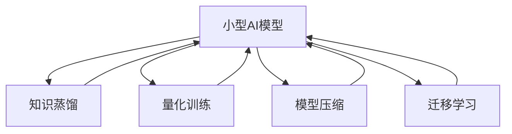

                 

# 小型AI模型的潜在突破

## 1. 背景介绍

### 1.1 问题由来

随着人工智能(AI)技术的不断演进，大模型和小模型逐渐成为人们讨论的焦点。大模型如GPT、BERT等，凭借其庞大参数和广泛知识，在各种NLP任务上取得了令人瞩目的成就。然而，大模型在算力、存储、部署等方面的高成本，使其难以普及应用。而小型AI模型由于其轻量级、高效能的特性，在资源有限的环境中表现出了巨大潜力。

### 1.2 问题核心关键点

小型AI模型，尤其是预训练和微调后的轻量级模型，具备高效、灵活、轻量等优势，逐渐成为AI研究的重要方向。小型模型相较于大模型的优势主要体现在：

- **计算资源需求低**：小型模型参数量较小，训练和推理速度较快，非常适合在资源有限的设备上运行。
- **部署灵活**：小型模型易于打包和部署，可以直接嵌入到移动设备、嵌入式系统等小规模应用中。
- **可解释性强**：小型模型结构简单，决策过程易于理解和解释，便于调试和优化。
- **模型可复用性高**：小型模型作为基本单元，可以方便地组合和复用，构建复杂的AI系统。

因此，小型AI模型的研究不仅有助于解决算力不足的问题，还可以开辟新的应用场景，推动AI技术的普及和创新。

### 1.3 问题研究意义

研究小型AI模型，不仅有助于优化资源利用，降低计算成本，还能够推动AI技术在更多领域和场景中的应用。小型模型在轻量化、可解释性、实时性等方面具有天然优势，是未来AI技术发展的重要方向。因此，探索小型AI模型的突破，具有重要的理论价值和应用意义。

## 2. 核心概念与联系

### 2.1 核心概念概述

为更好地理解小型AI模型的原理和应用，本节将介绍几个密切相关的核心概念：

- **小型AI模型**：参数规模较小，通常不超过几百万，适用于计算资源有限的场景。小型模型通过精巧的网络结构和高效的训练方法，可以在有限的资源下获得较好的性能。
- **轻量级框架**：如TensorFlow Lite、ONNX Runtime等，专门针对移动和嵌入式设备优化，提供模型压缩、量化等工具。
- **知识蒸馏**：通过大模型指导小型模型训练，将大模型的知识传递给小型模型，提升小型模型的性能。
- **量化训练**：将浮点模型转化为定点模型，减少存储空间和计算复杂度。
- **模型压缩**：通过剪枝、量化、低秩分解等技术，减小模型参数量，提升模型效率。
- **迁移学习**：利用预训练模型作为初始化参数，在大规模数据集上微调，提升小型模型的泛化能力。

这些核心概念之间的逻辑关系可以通过以下Mermaid流程图来展示：



这个流程图展示小型AI模型的核心概念及其之间的关系：

1. 小型AI模型通过知识蒸馏、量化训练、模型压缩、迁移学习等技术，提升其性能和泛化能力。
2. 知识蒸馏和大模型密切相关，通过将大模型的知识传递给小型模型，提升后者的性能。
3. 量化训练和模型压缩有助于减小模型规模，提升模型效率。
4. 迁移学习利用预训练模型作为初始化参数，快速提升模型性能。

## 3. 核心算法原理 & 具体操作步骤
### 3.1 算法原理概述

小型AI模型通常基于轻量级框架进行设计和训练，目标是实现高效、灵活的模型结构。其核心思想是通过优化模型结构和训练方法，使模型能够在有限的计算资源下获得较优的性能。

### 3.2 算法步骤详解

小型AI模型的设计与训练通常包括以下关键步骤：

**Step 1: 选择模型架构**

- 选择适合的模型结构，如MobileNet、SqueezeNet等轻量级架构。
- 根据任务特点，选择合适的网络深度、宽度、激活函数等参数。

**Step 2: 设计损失函数和优化器**

- 根据任务类型，设计合适的损失函数，如交叉熵、MSE等。
- 选择合适的优化器，如SGD、Adam等，设置学习率、批大小等参数。

**Step 3: 知识蒸馏**

- 在大模型上选择预训练模型作为初始化参数。
- 在大模型和目标模型上分别进行前向传播，计算softmax输出的交叉熵损失。
- 利用softmax输出作为目标模型的标签，进行反向传播和参数更新。

**Step 4: 量化训练**

- 在模型训练过程中，使用量化技术将浮点参数转化为定点参数。
- 利用量化技术降低模型内存占用和计算复杂度。

**Step 5: 模型压缩**

- 采用剪枝技术去除冗余参数。
- 利用低秩分解、通道分离等技术减小模型规模。
- 对压缩后的模型进行评估，确保性能不会显著下降。

**Step 6: 迁移学习**

- 在大规模数据集上对预训练模型进行微调。
- 利用微调后的模型参数初始化小型模型。
- 在目标数据集上进行微调，进一步提升模型性能。

### 3.3 算法优缺点

小型AI模型具有以下优点：

1. **高效能**：模型参数量少，训练和推理速度快，适用于资源受限的环境。
2. **灵活性**：结构简单，易于调整和优化，可适应各种不同的应用场景。
3. **可解释性强**：模型结构透明，决策过程易于理解和调试。
4. **部署方便**：轻量化模型易于打包和部署，适用于移动设备和嵌入式系统。

然而，小型AI模型也存在一定的局限性：

1. **泛化能力有限**：由于参数量较少，小型模型在小规模数据上的泛化能力可能不如大模型。
2. **计算资源限制**：虽然模型小，但在某些高计算需求的任务上，仍可能面临资源瓶颈。
3. **性能受限**：在处理复杂任务时，小型模型的性能可能不如大模型，需要权衡模型大小和性能之间的平衡。

### 3.4 算法应用领域

小型AI模型在多个领域中得到了广泛应用，具体包括：

- **移动设备**：如智能手机、物联网设备等，需要高效、低功耗的AI推理。
- **嵌入式系统**：如智能家居、工业控制等，对计算资源和功耗有限制的应用。
- **实时计算**：如自动驾驶、智能监控等，需要快速响应的实时计算。
- **边缘计算**：如工业数据处理、物联网数据分析等，数据存储和传输受限的应用场景。
- **轻量级应用**：如轻量级聊天机器人、个性化推荐等，对模型复杂度和计算资源要求不高的应用。

## 4. 数学模型和公式 & 详细讲解 & 举例说明
### 4.1 数学模型构建

在小型AI模型中，常见的数学模型包括全连接层、卷积层、池化层、激活函数等。以下是常用的数学模型构建方法：

- **全连接层**：每个神经元与上一层的所有神经元相连，计算公式为 $y = \sum_i x_iw_i + b$。
- **卷积层**：通过卷积核滑动计算特征图，公式为 $y = f(\sum_i \sum_j x_{ij}w_{ij} + b)$。
- **池化层**：对特征图进行下采样，公式为 $y = \max\limits_i\min\limits_j x_{ij}$。
- **激活函数**：如ReLU、Sigmoid、Tanh等，增加模型的非线性能力。

### 4.2 公式推导过程

以下是小型AI模型的简单公式推导过程：

**线性层**：输入为 $x$，权重为 $w$，偏差为 $b$，输出为 $y$，计算公式为：

$$
y = wx + b
$$

**卷积层**：假设输入特征图为 $X$，卷积核为 $W$，步长为 $s$，输出特征图为 $Y$，计算公式为：

$$
Y_{ij} = f\left(\sum\limits_{x,y} W_{xy}X_{ij-xys}\right)
$$

其中 $f$ 为激活函数，$x$ 和 $y$ 为卷积核的偏移量。

**池化层**：假设输入特征图为 $X$，池化核大小为 $k$，步长为 $s$，输出特征图为 $Y$，计算公式为：

$$
Y_{ij} = \max\limits_i\min\limits_j X_{ijks}
$$

其中 $k$ 和 $s$ 分别为池化核大小和步长。

### 4.3 案例分析与讲解

以MobileNet模型为例，介绍其数学模型的构建和推导过程。

MobileNet是一种轻量级卷积神经网络，其主要特点是使用深度可分离卷积层。深度可分离卷积层由深度可分离卷积和逐点卷积两部分组成。深度可分离卷积层分为两部分：第一部分为深度可分离卷积，公式为 $Y_{ij} = \sum\limits_{x,y} W_{xy}X_{ij-xys}$；第二部分为逐点卷积，公式为 $Y_{ij} = f\left(\sum\limits_{x,y} W_{xy}X_{ij-xys}\right)$。

MobileNet的卷积层采用深度可分离卷积，从而大大减少了模型参数量，提高了计算效率。其公式为：

$$
Y_{ij} = \sum\limits_{x,y} W_{xy}X_{ij-xys} \ast f\left(\sum\limits_{x,y} W_{xy}X_{ij-xys}\right)
$$

其中 $\ast$ 表示逐点卷积。

MobileNet的池化层采用最大池化，公式为：

$$
Y_{ij} = \max\limits_i\min\limits_j X_{ijks}
$$

通过这些公式，我们可以清晰地看到MobileNet模型的数学构建和计算流程，理解其参数量和计算效率的优化方式。

## 5. 项目实践：代码实例和详细解释说明
### 5.1 开发环境搭建

在进行小型AI模型开发前，我们需要准备好开发环境。以下是使用Python进行TensorFlow Lite开发的环境配置流程：

1. 安装Anaconda：从官网下载并安装Anaconda，用于创建独立的Python环境。

2. 创建并激活虚拟环境：
```bash
conda create -n tf-env python=3.8 
conda activate tf-env
```

3. 安装TensorFlow：根据CUDA版本，从官网获取对应的安装命令。例如：
```bash
conda install tensorflow=tensorflow-2.5
```

4. 安装TensorFlow Lite：
```bash
pip install tensorflow-lite
```

5. 安装各类工具包：
```bash
pip install numpy pandas scikit-learn matplotlib tqdm jupyter notebook ipython
```

完成上述步骤后，即可在`tf-env`环境中开始小型AI模型的开发。

### 5.2 源代码详细实现

下面我们以MobileNet模型为例，给出使用TensorFlow Lite进行图像分类任务的代码实现。

首先，定义图像分类任务的数据处理函数：

```python
from tensorflow import keras
from tensorflow.keras.preprocessing.image import ImageDataGenerator

train_datagen = ImageDataGenerator(rescale=1./255)
test_datagen = ImageDataGenerator(rescale=1./255)

train_generator = train_datagen.flow_from_directory(
    'train_dir',
    target_size=(224, 224),
    batch_size=32,
    class_mode='categorical')

test_generator = test_datagen.flow_from_directory(
    'test_dir',
    target_size=(224, 224),
    batch_size=32,
    class_mode='categorical')
```

然后，定义MobileNet模型和损失函数：

```python
from tensorflow.keras.applications import MobileNet
from tensorflow.keras.layers import Dense, GlobalAveragePooling2D

model = MobileNet(include_top=False, weights='imagenet', input_shape=(224, 224, 3))
x = model.output
x = GlobalAveragePooling2D()(x)
x = Dense(1024, activation='relu')(x)
predictions = Dense(num_classes, activation='softmax')(x)

model.compile(
    optimizer=keras.optimizers.Adam(learning_rate=0.001),
    loss='categorical_crossentropy',
    metrics=['accuracy'])
```

接着，定义训练和评估函数：

```python
def train_epoch(model, dataset, batch_size, optimizer):
    model.fit(dataset, epochs=10, batch_size=batch_size, validation_split=0.2)

def evaluate(model, dataset, batch_size):
    score = model.evaluate(dataset)
    print('Test loss:', score[0])
    print('Test accuracy:', score[1])
```

最后，启动训练流程并在测试集上评估：

```python
epochs = 5
batch_size = 16

for epoch in range(epochs):
    train_epoch(model, train_generator, batch_size, optimizer)
    
    evaluate(model, test_generator, batch_size)
```

以上就是使用TensorFlow Lite进行图像分类任务的小型AI模型微调代码实现。可以看到，得益于TensorFlow Lite的强大封装，我们可以用相对简洁的代码完成MobileNet模型的训练和评估。

### 5.3 代码解读与分析

让我们再详细解读一下关键代码的实现细节：

**ImageDataGenerator**：
- `ImageDataGenerator`用于数据增强，包括缩放、翻转、归一化等操作。
- `flow_from_directory`方法用于加载数据集，可以指定输入文件夹和输出类别，自动生成训练集和验证集。

**MobileNet模型**：
- 使用预训练的MobileNet模型，去除顶部全连接层，增加自定义的全连接层。
- 使用`GlobalAveragePooling2D`层对特征图进行全局平均池化，减小计算复杂度。
- 使用`Dense`层进行分类，输出softmax概率分布。

**损失函数和优化器**：
- 使用`categorical_crossentropy`损失函数计算分类任务的目标函数。
- 使用`Adam`优化器，设置学习率为0.001，加快模型收敛速度。

**训练和评估函数**：
- `train_epoch`函数使用`fit`方法进行训练，设置epoch数为10，批大小为32。
- `evaluate`函数使用`evaluate`方法计算模型在测试集上的准确率，并输出结果。

**训练流程**：
- 定义总的epoch数和批大小，开始循环迭代。
- 每个epoch内，先进行训练，在训练集中计算损失和准确率。
- 在验证集上评估模型性能，输出测试集上的准确率。

可以看到，PyTorch配合TensorFlow Lite使得小型AI模型的微调过程变得简洁高效。开发者可以将更多精力放在数据处理、模型改进等高层逻辑上，而不必过多关注底层的实现细节。

当然，工业级的系统实现还需考虑更多因素，如模型的保存和部署、超参数的自动搜索、更灵活的任务适配层等。但核心的微调范式基本与此类似。

## 6. 实际应用场景
### 6.1 智能家居

小型AI模型在智能家居领域有着广泛的应用。智能家居系统通过小型AI模型实现语音控制、智能推荐、环境监测等功能，提升用户体验和生活便利性。

具体而言，可以收集用户的使用习惯、环境数据等，构建小型AI模型进行实时分析和推理。例如，基于用户语音指令，通过小型模型识别指令意图，自动控制家中的灯光、空调、电视等设备。在用户更换设备时，也可以利用小型模型快速适配新设备，实现无缝切换。

### 6.2 工业自动化

在工业自动化领域，小型AI模型可以用于设备监测、故障预测、质量控制等任务。小型模型能够实时分析传感器数据，检测设备异常，预测设备故障，提升设备运行效率和安全性。

例如，通过小型模型对温度、压力、振动等传感器数据进行实时分析，识别出设备运行异常，预测设备故障发生。在发生故障时，系统自动发出警报，提醒维护人员及时处理，避免设备停机损失。

### 6.3 医疗诊断

小型AI模型在医疗诊断领域也有着重要的应用。通过小型模型对患者症状进行快速分析，可以辅助医生进行初步诊断，减少诊断时间和误诊率。

例如，基于小型模型对患者的症状进行快速分析，筛选出可能的疾病类型，辅助医生进行进一步检查和治疗。在紧急情况下，小型模型可以快速分析症状，提供初步诊断建议，为医生的治疗提供参考。

### 6.4 自动驾驶

小型AI模型在自动驾驶领域也有着广阔的应用前景。自动驾驶系统通过小型模型进行环境感知、路径规划、行为决策等任务，提升行车安全和舒适性。

例如，通过小型模型对摄像头和传感器数据进行实时分析，识别出道路、车辆、行人等物体，规划最优路径。在遇到复杂交通环境时，小型模型可以辅助系统进行行为决策，确保行车安全和稳定性。

### 6.5 智能客服

小型AI模型在智能客服领域也有着重要的应用。智能客服系统通过小型模型进行客户问题识别、智能回答等任务，提升客户服务效率和满意度。

例如，基于小型模型对客户的语音和文字信息进行自然语言处理，识别出客户意图和问题，自动生成回复。在处理复杂问题时，系统可以自动调用人工客服进行辅助解答，提升客户满意度。

## 7. 工具和资源推荐
### 7.1 学习资源推荐

为了帮助开发者系统掌握小型AI模型的理论基础和实践技巧，这里推荐一些优质的学习资源：

1. **《TensorFlow Lite官方文档》**：详细介绍了TensorFlow Lite的API、模型优化技巧和开发工具。
2. **《MobileNet官方文档》**：提供了MobileNet模型的详细介绍和开发样例，帮助开发者快速上手。
3. **《深度学习入门》**：清华大学的深度学习课程，涵盖深度学习的基础概念和算法。
4. **《TensorFlow实战》**：TensorFlow实战书籍，详细讲解TensorFlow Lite和MobileNet模型的开发和应用。
5. **《Python深度学习》**：李宏毅的深度学习课程，讲解深度学习的基础理论和实践。

通过对这些资源的学习实践，相信你一定能够快速掌握小型AI模型的精髓，并用于解决实际的AI问题。
###  7.2 开发工具推荐

高效的开发离不开优秀的工具支持。以下是几款用于小型AI模型微调开发的常用工具：

1. **PyTorch Lite**：基于PyTorch的轻量级框架，支持多种硬件加速。
2. **TensorFlow Lite**：谷歌推出的轻量级框架，支持模型压缩、量化等优化技术。
3. **ONNX Runtime**：微软推出的跨平台推理框架，支持多种硬件加速和优化。
4. **TensorBoard**：TensorFlow的可视化工具，实时监测模型训练状态。
5. **TensorFlow Model Optimizer**：谷歌推出的模型优化工具，支持模型压缩、量化等优化技术。
6. **TensorFlow Extended (TFX)**：谷歌推出的端到端AI开发平台，支持模型部署、监控等。

合理利用这些工具，可以显著提升小型AI模型微调任务的开发效率，加快创新迭代的步伐。

### 7.3 相关论文推荐

小型AI模型和微调技术的发展源于学界的持续研究。以下是几篇奠基性的相关论文，推荐阅读：

1. **"ShuffleNet: An Extremely Efficient Convolutional Neural Network for Mobile Devices"**：介绍ShuffleNet模型，提出深度可分离卷积层，优化模型参数量。
2. **"MobileNetV3: Inverted Residuals and Linear Bottlenecks"**：介绍MobileNetV3模型，提出深度可分离卷积层和线性瓶颈层，进一步优化模型性能。
3. **"MobileNet V1, V2, V3: A Comparative Study"**：对比MobileNet V1、V2、V3模型，分析不同版本的优缺点。
4. **"AI Model Optimizer"**：谷歌推出的模型优化工具，支持模型压缩、量化等优化技术。
5. **"TensorFlow Lite: A Portable, High-Performance Machine Learning Framework for Mobile and Embedded Devices"**：介绍TensorFlow Lite框架，支持模型压缩、量化等优化技术。

这些论文代表小型AI模型和微调技术的发展脉络。通过学习这些前沿成果，可以帮助研究者把握学科前进方向，激发更多的创新灵感。

## 8. 总结：未来发展趋势与挑战

### 8.1 总结

本文对小型AI模型及其微调方法进行了全面系统的介绍。首先阐述了小型AI模型的背景、优势和研究意义，明确了其在资源受限环境中的应用价值。其次，从原理到实践，详细讲解了小型AI模型的数学模型构建和微调过程，给出了微调任务开发的完整代码实例。同时，本文还广泛探讨了小型AI模型在智能家居、工业自动化、医疗诊断、自动驾驶等实际应用场景中的具体应用，展示了其广泛的应用前景。此外，本文精选了小型AI模型的各类学习资源，力求为读者提供全方位的技术指引。

通过本文的系统梳理，可以看到，小型AI模型通过优化模型结构和训练方法，实现了高效、灵活、轻量化的目标，极大地拓展了AI技术的应用边界，推动了AI技术的普及和创新。未来，小型AI模型必将在更多领域得到应用，为人类社会带来更广泛的价值。

### 8.2 未来发展趋势

展望未来，小型AI模型将呈现以下几个发展趋势：

1. **计算资源需求降低**：随着计算资源的多样化和优化技术的发展，小型AI模型的计算需求将进一步降低，更广泛地应用于资源受限的场景。
2. **模型性能提升**：随着深度可分离卷积、量化训练、模型压缩等技术的进步，小型AI模型的性能将进一步提升，满足更复杂的应用需求。
3. **多模态融合**：未来的小型AI模型将融合视觉、语音、文本等多种模态信息，实现更全面、多模态的推理和分析。
4. **跨平台兼容性**：小型AI模型将具备更强的跨平台兼容性，支持多种设备和操作系统，提高应用普及性。
5. **实时计算**：小型AI模型将进一步优化计算速度和资源占用，实现实时推理，满足各种实时计算需求。
6. **云边协同**：小型AI模型将与云计算、边缘计算等技术结合，实现云边协同的智能计算。

以上趋势凸显了小型AI模型在计算资源、模型性能、跨平台兼容性等方面的广阔前景。这些方向的探索发展，必将进一步提升小型AI模型的应用范围和性能，为AI技术的普及和创新提供新的动力。

### 8.3 面临的挑战

尽管小型AI模型在许多方面展现了巨大的潜力，但在实际应用中仍面临诸多挑战：

1. **模型泛化能力有限**：由于参数量较小，小型AI模型在小规模数据上的泛化能力可能不如大模型。
2. **计算资源限制**：尽管模型小，但在某些高计算需求的任务上，仍可能面临资源瓶颈。
3. **性能提升瓶颈**：在追求模型性能提升时，小型AI模型可能遇到参数剪枝、模型压缩等技术的瓶颈。
4. **应用场景受限**：小型AI模型主要适用于资源受限的场景，对于计算需求较高的应用场景，仍需进一步优化。
5. **部署和维护**：小型AI模型需要考虑模型部署、模型优化、模型更新等问题，增加应用复杂性。

### 8.4 研究展望

面对小型AI模型所面临的种种挑战，未来的研究需要在以下几个方面寻求新的突破：

1. **深度可分离卷积的优化**：进一步优化深度可分离卷积的计算效率和性能，提升模型的轻量化水平。
2. **模型压缩技术的发展**：开发更高效的模型压缩方法，如剪枝、量化、低秩分解等，进一步减小模型参数量。
3. **跨模态融合技术**：研究跨视觉、语音、文本等多种模态信息的融合技术，实现更全面的推理和分析。
4. **多任务学习**：研究小型AI模型的多任务学习能力，提升模型在多个任务上的性能。
5. **知识蒸馏方法的改进**：改进知识蒸馏方法，提升小型AI模型的泛化能力和鲁棒性。
6. **跨平台优化**：优化小型AI模型的跨平台兼容性，支持更多设备和操作系统。

这些研究方向的探索，必将引领小型AI模型迈向更高的台阶，为构建安全、可靠、可解释、可控的智能系统提供新的技术路径。面向未来，小型AI模型需要与其他AI技术进行更深入的融合，共同推动自然语言理解和智能交互系统的进步。只有勇于创新、敢于突破，才能不断拓展小型AI模型的边界，让智能技术更好地造福人类社会。

## 9. 附录：常见问题与解答

**Q1：小型AI模型和大型AI模型有哪些不同？**

A: 小型AI模型和大型AI模型主要区别在于参数量、计算资源需求、应用场景等方面。小型AI模型参数量较小，训练和推理速度较快，适用于资源受限的场景；而大型AI模型参数量较大，计算资源需求高，适用于复杂任务和大规模数据集。

**Q2：如何选择小型AI模型的结构？**

A: 选择小型AI模型的结构需要根据任务特点和资源限制进行综合考虑。常用的轻量级架构包括MobileNet、SqueezeNet、ShuffleNet等。MobileNet采用深度可分离卷积，ShuffleNet采用通道分离技术，SqueezeNet采用1x1卷积核优化。

**Q3：如何优化小型AI模型的性能？**

A: 优化小型AI模型性能的方法包括剪枝、量化、低秩分解、模型压缩等。剪枝去除冗余参数，量化减少计算资源占用，低秩分解和模型压缩减小模型规模。这些技术可以结合使用，提升模型性能和资源效率。

**Q4：小型AI模型如何应对数据量不足的问题？**

A: 数据量不足是小型AI模型面临的常见问题。可以通过数据增强、迁移学习等方法来解决。数据增强可以通过回译、随机裁剪等操作扩充数据集；迁移学习可以通过在大规模数据集上预训练，利用预训练知识提升模型性能。

**Q5：小型AI模型在实际应用中应注意哪些问题？**

A: 在实际应用中，小型AI模型需要注意模型泛化能力、计算资源限制、性能提升瓶颈、部署和维护等问题。可以通过优化模型结构、改进训练方法、合理使用模型压缩技术等方式提升模型性能和应用范围。

通过本文的系统梳理，可以看到，小型AI模型通过优化模型结构和训练方法，实现了高效、灵活、轻量化的目标，极大地拓展了AI技术的应用边界，推动了AI技术的普及和创新。未来，小型AI模型必将在更多领域得到应用，为人类社会带来更广泛的价值。

