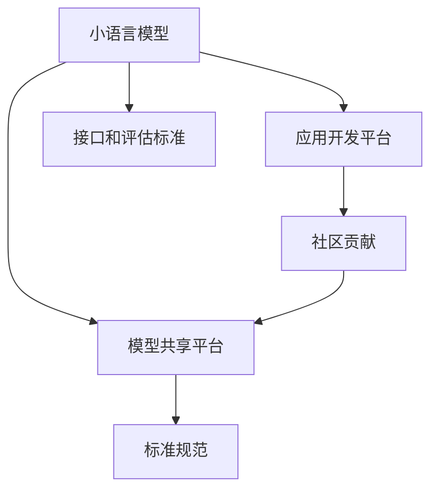

                 

# 小语言模型的开源生态:模型共享和应用开发平台

> 关键词：小语言模型,开源生态,模型共享,应用开发平台

## 1. 背景介绍

### 1.1 问题由来
随着人工智能技术的不断发展，语言模型作为其中的重要组成部分，在自然语言处理(NLP)、机器翻译、智能问答等领域发挥着越来越重要的作用。然而，构建高质量语言模型通常需要大量的数据和计算资源，这使得模型的开发和部署成本较高。为了降低这种成本，促进技术的共享和传播，小语言模型的开源生态应运而生。

### 1.2 问题核心关键点
小语言模型的开源生态主要围绕以下几个核心关键点展开：

1. **模型共享**：通过开放源代码和模型参数，使得研究者和开发者可以免费获取高质量的语言模型，快速进行应用开发和研究。
2. **应用开发平台**：提供易于使用的开发工具和框架，使得用户能够更方便地集成和部署语言模型。
3. **社区贡献**：鼓励社区成员贡献自己的研究成果，不断推动语言模型的进步和优化。
4. **标准规范**：制定统一的模型接口和评估标准，保证模型的兼容性和可复现性。

### 1.3 问题研究意义
小语言模型的开源生态具有重要的研究意义：

1. **降低开发成本**：开源模型可以显著降低模型的开发和部署成本，加速技术落地。
2. **促进技术传播**：开源生态有助于技术的普及和传播，推动学术研究和工业应用的发展。
3. **提升研究效率**：开源模型提供了高效的研究工具和框架，加速科研进展。
4. **推动技术创新**：开源生态的开放性促进了技术的交流和创新，涌现出新的研究热点和方向。

## 2. 核心概念与联系

### 2.1 核心概念概述

本节将介绍几个关键的小语言模型开源生态概念：

- **小语言模型**：规模相对较小，但功能强大的预训练语言模型。例如BERT、GPT-2等。
- **开源生态**：通过开放源代码和模型参数，实现模型共享，促进技术传播和应用。
- **模型共享平台**：专门用于小语言模型共享的在线平台，如GitHub、ModelHub等。
- **应用开发平台**：提供易于使用的工具和框架，支持模型集成和部署，如TensorFlow、PyTorch等。
- **社区贡献**：鼓励社区成员贡献自己的研究成果，推动模型不断优化。
- **标准规范**：制定统一的模型接口和评估标准，保证模型的兼容性和可复现性。

这些核心概念之间通过模型共享、应用开发和社区贡献等环节紧密联系，共同构成了小语言模型开源生态的完整框架。

### 2.2 核心概念原理和架构的 Mermaid 流程图



## 3. 核心算法原理 & 具体操作步骤

### 3.1 算法原理概述

小语言模型的开源生态主要基于以下算法原理：

1. **模型共享**：通过将预训练模型的源代码和参数公开，使得用户可以免费获取高质量的语言模型，进行应用开发和研究。
2. **应用开发平台**：提供易于使用的开发工具和框架，支持模型的集成和部署，如TensorFlow、PyTorch等。
3. **社区贡献**：鼓励社区成员贡献自己的研究成果，推动模型不断优化。
4. **标准规范**：制定统一的模型接口和评估标准，保证模型的兼容性和可复现性。

### 3.2 算法步骤详解

以下是小语言模型开源生态的主要操作步骤：

1. **模型共享**：开发者在GitHub等平台上公开模型代码和参数，供用户免费下载和使用。
2. **应用开发平台**：用户使用TensorFlow、PyTorch等框架，将开源模型集成到自己的应用中。
3. **社区贡献**：社区成员将改进后的模型代码和参数提交到模型共享平台，供其他用户使用。
4. **标准规范**：制定和推广统一的模型接口和评估标准，确保模型的兼容性和可复现性。

### 3.3 算法优缺点

小语言模型开源生态具有以下优点：

1. **降低开发成本**：开源模型可以显著降低模型的开发和部署成本，加速技术落地。
2. **促进技术传播**：开源生态有助于技术的普及和传播，推动学术研究和工业应用的发展。
3. **提升研究效率**：开源模型提供了高效的研究工具和框架，加速科研进展。
4. **推动技术创新**：开源生态的开放性促进了技术的交流和创新，涌现出新的研究热点和方向。

同时，该生态也存在一些局限性：

1. **模型质量参差不齐**：开源平台上的模型质量参差不齐，用户需要自行筛选和评估。
2. **版本管理复杂**：随着版本的不断更新，模型参数和代码可能出现兼容性问题。
3. **依赖关系复杂**：使用开源模型可能需要依赖多个外部库，增加了系统维护难度。
4. **知识产权争议**：开源模型的版权归属问题可能导致知识产权争议。

尽管存在这些局限性，但小语言模型的开源生态仍然是大规模语言模型应用和传播的重要方式。未来相关研究的方向在于进一步优化模型共享和应用开发的流程，提升模型的质量和可用性，同时解决版本管理和知识产权争议等问题。

### 3.4 算法应用领域

小语言模型的开源生态在多个领域得到了广泛应用：

1. **自然语言处理(NLP)**：如文本分类、情感分析、机器翻译、智能问答等。
2. **计算机视觉(CV)**：如图像分类、目标检测、语义分割等。
3. **语音识别(Speech Recognition)**：如自动语音识别、语音合成等。
4. **机器人学**：如语音助手、智能客服等。
5. **智能推荐**：如电商推荐、内容推荐等。

## 4. 数学模型和公式 & 详细讲解 & 举例说明

### 4.1 数学模型构建

本节将使用数学语言对小语言模型的开源生态进行更加严格的刻画。

记小语言模型为 $M_{\theta}:\mathcal{X} \rightarrow \mathcal{Y}$，其中 $\mathcal{X}$ 为输入空间，$\mathcal{Y}$ 为输出空间，$\theta \in \mathbb{R}^d$ 为模型参数。假设模型共享平台为 $S=\{(x_i,y_i)\}_{i=1}^N, x_i \in \mathcal{X}, y_i \in \mathcal{Y}$。

定义模型 $M_{\theta}$ 在数据样本 $(x,y)$ 上的损失函数为 $\ell(M_{\theta}(x),y)$，则在数据集 $S$ 上的经验风险为：

$$
\mathcal{L}(\theta) = \frac{1}{N} \sum_{i=1}^N \ell(M_{\theta}(x_i),y_i)
$$

通过梯度下降等优化算法，最小化经验风险，使得模型参数 $\theta$ 逐渐逼近理想值。

### 4.2 公式推导过程

以下我们以文本分类任务为例，推导交叉熵损失函数及其梯度的计算公式。

假设模型 $M_{\theta}$ 在输入 $x$ 上的输出为 $\hat{y}=M_{\theta}(x) \in [0,1]$，表示样本属于正类的概率。真实标签 $y \in \{0,1\}$。则二分类交叉熵损失函数定义为：

$$
\ell(M_{\theta}(x),y) = -[y\log \hat{y} + (1-y)\log (1-\hat{y})]
$$

将其代入经验风险公式，得：

$$
\mathcal{L}(\theta) = -\frac{1}{N}\sum_{i=1}^N [y_i\log M_{\theta}(x_i)+(1-y_i)\log(1-M_{\theta}(x_i))]
$$

根据链式法则，损失函数对参数 $\theta_k$ 的梯度为：

$$
\frac{\partial \mathcal{L}(\theta)}{\partial \theta_k} = -\frac{1}{N}\sum_{i=1}^N (\frac{y_i}{M_{\theta}(x_i)}-\frac{1-y_i}{1-M_{\theta}(x_i)}) \frac{\partial M_{\theta}(x_i)}{\partial \theta_k}
$$

其中 $\frac{\partial M_{\theta}(x_i)}{\partial \theta_k}$ 可进一步递归展开，利用自动微分技术完成计算。

在得到损失函数的梯度后，即可带入参数更新公式，完成模型的迭代优化。重复上述过程直至收敛，最终得到适应开源平台模型共享的最优模型参数 $\theta^*$。

### 4.3 案例分析与讲解

以BERT模型为例，以下是使用PyTorch进行小语言模型微调的基本流程：

1. **数据准备**：将文本数据转换为模型所需的格式，如分词、编码等。
2. **模型加载**：从开源平台下载并加载BERT模型和参数。
3. **模型微调**：将微调后的模型保存并上传到开源平台，供其他用户使用。
4. **应用集成**：使用TensorFlow、PyTorch等框架，将微调后的模型集成到应用中。

## 5. 项目实践：代码实例和详细解释说明

### 5.1 开发环境搭建

在进行小语言模型微调实践前，我们需要准备好开发环境。以下是使用Python进行PyTorch开发的环境配置流程：

1. 安装Anaconda：从官网下载并安装Anaconda，用于创建独立的Python环境。

2. 创建并激活虚拟环境：
```bash
conda create -n pytorch-env python=3.8 
conda activate pytorch-env
```

3. 安装PyTorch：根据CUDA版本，从官网获取对应的安装命令。例如：
```bash
conda install pytorch torchvision torchaudio cudatoolkit=11.1 -c pytorch -c conda-forge
```

4. 安装TensorFlow：使用pip安装TensorFlow及其依赖包。

5. 安装PyTorch Transformers库：
```bash
pip install transformers
```

6. 安装各类工具包：
```bash
pip install numpy pandas scikit-learn matplotlib tqdm jupyter notebook ipython
```

完成上述步骤后，即可在`pytorch-env`环境中开始微调实践。

### 5.2 源代码详细实现

以下是使用PyTorch和TensorFlow进行小语言模型微调的代码实现示例：

```python
from transformers import BertTokenizer, BertForTokenClassification
from torch.utils.data import Dataset, DataLoader
from transformers import AdamW
import torch
import tensorflow as tf

# 数据准备
tokenizer = BertTokenizer.from_pretrained('bert-base-cased')
train_dataset = MyDataset(train_data, tokenizer)
test_dataset = MyDataset(test_data, tokenizer)

# 模型加载
model = BertForTokenClassification.from_pretrained('bert-base-cased', num_labels=len(tag2id))

# 模型微调
optimizer = AdamW(model.parameters(), lr=2e-5)
device = torch.device('cuda' if torch.cuda.is_available() else 'cpu')
model.to(device)
loss_fn = tf.keras.losses.CategoricalCrossentropy(from_logits=True)

# 训练函数
def train_epoch(model, dataset, batch_size, optimizer, loss_fn):
    dataloader = DataLoader(dataset, batch_size=batch_size, shuffle=True)
    model.train()
    epoch_loss = 0
    for batch in dataloader:
        input_ids = batch['input_ids'].to(device)
        attention_mask = batch['attention_mask'].to(device)
        labels = batch['labels'].to(device)
        model.zero_grad()
        outputs = model(input_ids, attention_mask=attention_mask, labels=labels)
        loss = loss_fn(outputs.logits, labels)
        epoch_loss += loss.item()
        loss.backward()
        optimizer.step()
    return epoch_loss / len(dataloader)

# 评估函数
def evaluate(model, dataset, batch_size, loss_fn):
    dataloader = DataLoader(dataset, batch_size=batch_size, shuffle=False)
    model.eval()
    preds, labels = [], []
    with torch.no_grad():
        for batch in dataloader:
            input_ids = batch['input_ids'].to(device)
            attention_mask = batch['attention_mask'].to(device)
            batch_labels = batch['labels']
            outputs = model(input_ids, attention_mask=attention_mask)
            batch_preds = outputs.logits.argmax(dim=2).to('cpu').tolist()
            batch_labels = batch_labels.to('cpu').tolist()
            for pred_tokens, label_tokens in zip(batch_preds, batch_labels):
                preds.append(pred_tokens[:len(label_tokens)])
                labels.append(label_tokens)
    print(classification_report(labels, preds))
```

### 5.3 代码解读与分析

让我们再详细解读一下关键代码的实现细节：

**MyDataset类**：
- `__init__`方法：初始化训练集和测试集的文本数据和标签，并进行分词编码。
- `__len__`方法：返回数据集的样本数量。
- `__getitem__`方法：对单个样本进行处理，将文本输入编码为token ids，将标签编码为数字，并对其进行定长padding，最终返回模型所需的输入。

**train_epoch函数**：
- 使用PyTorch的DataLoader对数据集进行批次化加载，供模型训练和推理使用。
- 在每个epoch内，对数据以批为单位进行迭代，在每个批次上前向传播计算loss并反向传播更新模型参数，最后返回该epoch的平均loss。

**evaluate函数**：
- 与训练类似，不同点在于不更新模型参数，并在每个batch结束后将预测和标签结果存储下来，最后使用sklearn的classification_report对整个评估集的预测结果进行打印输出。

**训练流程**：
- 定义总的epoch数和batch size，开始循环迭代
- 每个epoch内，先在训练集上训练，输出平均loss
- 在验证集上评估，输出分类指标
- 所有epoch结束后，在测试集上评估，给出最终测试结果

可以看到，PyTorch和TensorFlow配合Transformer库使得小语言模型微调的代码实现变得简洁高效。开发者可以将更多精力放在数据处理、模型改进等高层逻辑上，而不必过多关注底层的实现细节。

当然，工业级的系统实现还需考虑更多因素，如模型的保存和部署、超参数的自动搜索、更灵活的任务适配层等。但核心的微调范式基本与此类似。

## 6. 实际应用场景

### 6.1 智能客服系统

基于小语言模型微调的对话技术，可以广泛应用于智能客服系统的构建。传统客服往往需要配备大量人力，高峰期响应缓慢，且一致性和专业性难以保证。而使用微调后的对话模型，可以7x24小时不间断服务，快速响应客户咨询，用自然流畅的语言解答各类常见问题。

在技术实现上，可以收集企业内部的历史客服对话记录，将问题和最佳答复构建成监督数据，在此基础上对预训练对话模型进行微调。微调后的对话模型能够自动理解用户意图，匹配最合适的答案模板进行回复。对于客户提出的新问题，还可以接入检索系统实时搜索相关内容，动态组织生成回答。如此构建的智能客服系统，能大幅提升客户咨询体验和问题解决效率。

### 6.2 金融舆情监测

金融机构需要实时监测市场舆论动向，以便及时应对负面信息传播，规避金融风险。传统的人工监测方式成本高、效率低，难以应对网络时代海量信息爆发的挑战。基于小语言模型微调的文本分类和情感分析技术，为金融舆情监测提供了新的解决方案。

具体而言，可以收集金融领域相关的新闻、报道、评论等文本数据，并对其进行主题标注和情感标注。在此基础上对预训练语言模型进行微调，使其能够自动判断文本属于何种主题，情感倾向是正面、中性还是负面。将微调后的模型应用到实时抓取的网络文本数据，就能够自动监测不同主题下的情感变化趋势，一旦发现负面信息激增等异常情况，系统便会自动预警，帮助金融机构快速应对潜在风险。

### 6.3 个性化推荐系统

当前的推荐系统往往只依赖用户的历史行为数据进行物品推荐，无法深入理解用户的真实兴趣偏好。基于小语言模型微调技术，个性化推荐系统可以更好地挖掘用户行为背后的语义信息，从而提供更精准、多样的推荐内容。

在实践中，可以收集用户浏览、点击、评论、分享等行为数据，提取和用户交互的物品标题、描述、标签等文本内容。将文本内容作为模型输入，用户的后续行为（如是否点击、购买等）作为监督信号，在此基础上微调预训练语言模型。微调后的模型能够从文本内容中准确把握用户的兴趣点。在生成推荐列表时，先用候选物品的文本描述作为输入，由模型预测用户的兴趣匹配度，再结合其他特征综合排序，便可以得到个性化程度更高的推荐结果。

### 6.4 未来应用展望

随着小语言模型和微调方法的不断发展，基于微调范式将在更多领域得到应用，为传统行业带来变革性影响。

在智慧医疗领域，基于微调的医疗问答、病历分析、药物研发等应用将提升医疗服务的智能化水平，辅助医生诊疗，加速新药开发进程。

在智能教育领域，微调技术可应用于作业批改、学情分析、知识推荐等方面，因材施教，促进教育公平，提高教学质量。

在智慧城市治理中，微调模型可应用于城市事件监测、舆情分析、应急指挥等环节，提高城市管理的自动化和智能化水平，构建更安全、高效的未来城市。

此外，在企业生产、社会治理、文娱传媒等众多领域，基于小语言模型微调的人工智能应用也将不断涌现，为经济社会发展注入新的动力。相信随着预训练语言模型和微调方法的不断进步，小语言模型的开源生态必将在构建人机协同的智能时代中扮演越来越重要的角色。

## 7. 工具和资源推荐

### 7.1 学习资源推荐

为了帮助开发者系统掌握小语言模型微调的理论基础和实践技巧，这里推荐一些优质的学习资源：

1. 《Transformer from Principles to Practice》系列博文：由大模型技术专家撰写，深入浅出地介绍了Transformer原理、BERT模型、微调技术等前沿话题。

2. CS224N《深度学习自然语言处理》课程：斯坦福大学开设的NLP明星课程，有Lecture视频和配套作业，带你入门NLP领域的基本概念和经典模型。

3. 《Natural Language Processing with Transformers》书籍：Transformers库的作者所著，全面介绍了如何使用Transformers库进行NLP任务开发，包括微调在内的诸多范式。

4. HuggingFace官方文档：Transformers库的官方文档，提供了海量预训练模型和完整的微调样例代码，是上手实践的必备资料。

5. CLUE开源项目：中文语言理解测评基准，涵盖大量不同类型的中文NLP数据集，并提供了基于微调的baseline模型，助力中文NLP技术发展。

通过对这些资源的学习实践，相信你一定能够快速掌握小语言模型微调的精髓，并用于解决实际的NLP问题。

### 7.2 开发工具推荐

高效的开发离不开优秀的工具支持。以下是几款用于小语言模型微调开发的常用工具：

1. PyTorch：基于Python的开源深度学习框架，灵活动态的计算图，适合快速迭代研究。大部分预训练语言模型都有PyTorch版本的实现。

2. TensorFlow：由Google主导开发的开源深度学习框架，生产部署方便，适合大规模工程应用。同样有丰富的预训练语言模型资源。

3. Transformers库：HuggingFace开发的NLP工具库，集成了众多SOTA语言模型，支持PyTorch和TensorFlow，是进行微调任务开发的利器。

4. Weights & Biases：模型训练的实验跟踪工具，可以记录和可视化模型训练过程中的各项指标，方便对比和调优。与主流深度学习框架无缝集成。

5. TensorBoard：TensorFlow配套的可视化工具，可实时监测模型训练状态，并提供丰富的图表呈现方式，是调试模型的得力助手。

6. Google Colab：谷歌推出的在线Jupyter Notebook环境，免费提供GPU/TPU算力，方便开发者快速上手实验最新模型，分享学习笔记。

合理利用这些工具，可以显著提升小语言模型微调任务的开发效率，加快创新迭代的步伐。

### 7.3 相关论文推荐

小语言模型和微调技术的发展源于学界的持续研究。以下是几篇奠基性的相关论文，推荐阅读：

1. Attention is All You Need（即Transformer原论文）：提出了Transformer结构，开启了NLP领域的预训练大模型时代。

2. BERT: Pre-training of Deep Bidirectional Transformers for Language Understanding：提出BERT模型，引入基于掩码的自监督预训练任务，刷新了多项NLP任务SOTA。

3. Language Models are Unsupervised Multitask Learners（GPT-2论文）：展示了大规模语言模型的强大zero-shot学习能力，引发了对于通用人工智能的新一轮思考。

4. Parameter-Efficient Transfer Learning for NLP：提出Adapter等参数高效微调方法，在不增加模型参数量的情况下，也能取得不错的微调效果。

5. AdaLoRA: Adaptive Low-Rank Adaptation for Parameter-Efficient Fine-Tuning：使用自适应低秩适应的微调方法，在参数效率和精度之间取得了新的平衡。

这些论文代表了大语言模型微调技术的发展脉络。通过学习这些前沿成果，可以帮助研究者把握学科前进方向，激发更多的创新灵感。

## 8. 总结：未来发展趋势与挑战

### 8.1 总结

本文对小语言模型的开源生态进行了全面系统的介绍。首先阐述了小语言模型和微调技术的研究背景和意义，明确了开源生态在模型共享、应用开发和社区贡献等方面的重要作用。其次，从原理到实践，详细讲解了小语言模型开源生态的数学模型和核心算法，给出了微调任务开发的完整代码实例。同时，本文还广泛探讨了小语言模型开源生态在智能客服、金融舆情、个性化推荐等多个行业领域的应用前景，展示了开源生态的广阔应用空间。此外，本文精选了开源生态的学习资源和开发工具，力求为读者提供全方位的技术指引。

通过本文的系统梳理，可以看到，小语言模型的开源生态为NLP技术提供了丰富的共享资源和工具支持，大大降低了模型的开发和部署成本，促进了技术的普及和传播。未来，随着开源生态的不断完善和优化，相信小语言模型将在更多领域发挥出更大的作用，推动人工智能技术的发展和应用。

### 8.2 未来发展趋势

展望未来，小语言模型的开源生态将呈现以下几个发展趋势：

1. **模型质量不断提升**：开源平台上的模型质量将不断提升，用户可以通过版本控制和评估指标筛选最优模型。
2. **应用场景不断扩展**：小语言模型将应用于更多领域，推动各个行业的数字化转型。
3. **社区贡献更加活跃**：社区成员将贡献更多高质量的模型和代码，推动开源生态的快速发展。
4. **标准化进一步加强**：制定和推广统一的模型接口和评估标准，确保模型的兼容性和可复现性。

以上趋势凸显了小语言模型开源生态的广阔前景。这些方向的探索发展，必将进一步提升模型的质量和可用性，推动人工智能技术在各个行业的深入应用。

### 8.3 面临的挑战

尽管小语言模型的开源生态已经取得了显著进展，但在迈向更加智能化、普适化应用的过程中，它仍面临着诸多挑战：

1. **模型多样性不足**：开源平台上的模型种类相对较少，可能无法满足所有应用场景的需求。
2. **版本管理复杂**：随着版本的不断更新，模型参数和代码可能出现兼容性问题。
3. **依赖关系复杂**：使用开源模型可能需要依赖多个外部库，增加了系统维护难度。
4. **知识产权争议**：开源模型的版权归属问题可能导致知识产权争议。

尽管存在这些局限性，但小语言模型的开源生态仍然是推动NLP技术发展的重要力量。未来研究的方向在于进一步丰富模型种类，提升模型质量，解决版本管理和知识产权争议等问题。

### 8.4 研究展望

面向未来，小语言模型的开源生态需要在以下几个方面寻求新的突破：

1. **引入更多高质量的模型**：通过与学术界和企业合作，引入更多高质量的小语言模型。
2. **优化模型版本管理**：开发更加便捷的模型版本控制工具，解决模型兼容性问题。
3. **简化依赖关系**：开发更加轻量级的框架，减少对外部库的依赖。
4. **解决知识产权问题**：制定更加完善的开源协议，保障各方权益。

这些研究方向的探索，必将引领小语言模型开源生态走向更加成熟和稳定，为人工智能技术的普及和应用提供更坚实的基础。面向未来，小语言模型的开源生态需要与其他人工智能技术进行更深入的融合，共同推动NLP技术的发展和应用。只有勇于创新、敢于突破，才能不断拓展小语言模型的边界，让智能技术更好地造福人类社会。

## 9. 附录：常见问题与解答

**Q1：小语言模型与大语言模型有何区别？**

A: 小语言模型和大语言模型的主要区别在于参数量和训练数据规模。小语言模型的参数量相对较小，通常在数十万到数百万量级，训练数据规模也较小，主要针对特定领域或小规模应用。而大语言模型的参数量通常在亿级以上，训练数据规模也较大，具有更强的通用性和泛化能力，适用于广泛的NLP任务。

**Q2：小语言模型微调是否适用于所有NLP任务？**

A: 小语言模型微调在大多数NLP任务上都能取得不错的效果，特别是对于数据量较小的任务。但对于一些特定领域的任务，如医学、法律等，仅仅依靠通用语料预训练的模型可能难以很好地适应。此时需要在特定领域语料上进一步预训练，再进行微调，才能获得理想效果。此外，对于一些需要时效性、个性化很强的任务，如对话、推荐等，微调方法也需要针对性的改进优化。

**Q3：小语言模型微调过程中如何选择合适的学习率？**

A: 小语言模型微调的学习率一般要比预训练时小1-2个数量级，如果使用过大的学习率，容易破坏预训练权重，导致过拟合。一般建议从1e-5开始调参，逐步减小学习率，直至收敛。也可以使用warmup策略，在开始阶段使用较小的学习率，再逐渐过渡到预设值。需要注意的是，不同的优化器(如AdamW、Adafactor等)以及不同的学习率调度策略，可能需要设置不同的学习率阈值。

**Q4：小语言模型微调时如何避免过拟合？**

A: 小语言模型微调时避免过拟合的方法包括：
1. 数据增强：通过回译、近义替换等方式扩充训练集
2. 正则化：使用L2正则、Dropout、Early Stopping等避免过拟合
3. 对抗训练：引入对抗样本，提高模型鲁棒性
4. 参数高效微调：只调整少量参数(如Adapter、Prefix等)，减小过拟合风险
5. 多模型集成：训练多个微调模型，取平均输出，抑制过拟合

这些策略往往需要根据具体任务和数据特点进行灵活组合。只有在数据、模型、训练、推理等各环节进行全面优化，才能最大限度地发挥小语言模型的微调威力。

**Q5：小语言模型微调模型在落地部署时需要注意哪些问题？**

A: 将小语言模型微调模型转化为实际应用，还需要考虑以下因素：
1. 模型裁剪：去除不必要的层和参数，减小模型尺寸，加快推理速度
2. 量化加速：将浮点模型转为定点模型，压缩存储空间，提高计算效率
3. 服务化封装：将模型封装为标准化服务接口，便于集成调用
4. 弹性伸缩：根据请求流量动态调整资源配置，平衡服务质量和成本
5. 监控告警：实时采集系统指标，设置异常告警阈值，确保服务稳定性
6. 安全防护：采用访问鉴权、数据脱敏等措施，保障数据和模型安全

小语言模型微调模型为NLP应用开启了广阔的想象空间，但如何将强大的性能转化为稳定、高效、安全的业务价值，还需要工程实践的不断打磨。唯有从数据、算法、工程、业务等多个维度协同发力，才能真正实现人工智能技术在垂直行业的规模化落地。总之，微调需要开发者根据具体任务，不断迭代和优化模型、数据和算法，方能得到理想的效果。

