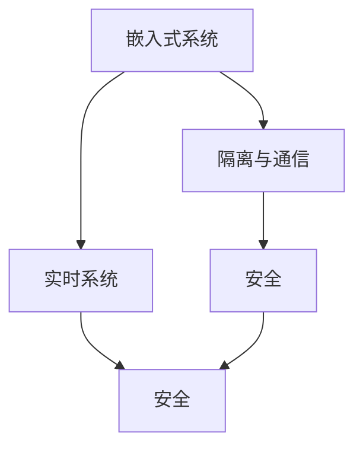

                 

# 嵌入式系统安全：保护设备

## 1. 背景介绍

### 1.1 问题由来

随着物联网(IoT)技术的快速发展，嵌入式系统在工业控制、智能家居、医疗健康、交通物流等领域得到了广泛应用。然而，嵌入式系统通常资源受限、难以升级，一旦遭受攻击，其脆弱性可能导致严重的安全问题，如设备控制被篡改、个人隐私泄露、系统功能失效等。如何保护这些关键的嵌入式设备，确保其安全稳定运行，成为当前的重要课题。

### 1.2 问题核心关键点

嵌入式系统安全主要面临以下关键问题：
- 资源受限。嵌入式设备通常内存、存储、处理器性能等资源有限，如何设计高效安全的算法和机制，以保障系统安全。
- 隔离与通信。嵌入式设备与外部环境（如互联网、云平台）通信，如何保障数据传输和通信的安全。
- 实时性要求。嵌入式系统任务实时性高，如何优化安全算法性能，以保持系统实时性。
- 软件与硬件协同。嵌入式系统依赖软硬件协同工作，如何在软硬件边界实现安全机制的部署与维护。
- 自适应性。嵌入式系统所处环境变化多端，如何设计自适应安全的算法，以适应环境变化。

## 2. 核心概念与联系

### 2.1 核心概念概述

为更好地理解嵌入式系统安全保护，本节将介绍几个关键概念：

- 嵌入式系统(Embedded System)：以应用为中心、软硬件紧密集成、强调系统可靠性和效率的计算系统。常见设备包括单片机、微控制器、SoC等。
- 安全(Security)：保障系统免受恶意攻击、确保系统安全和数据隐私的一种技术。
- 隔离与通信(Segmentation & Communication)：通过隔离措施和通信协议，保障系统内外的数据交换安全。
- 实时系统(Real-time System)：对系统性能有严格实时性要求，需要在限定的时间内完成系统任务。

这些概念之间的关系可以通过以下Mermaid流程图来展示：



这个流程图展示了几大核心概念之间的关系：

1. 嵌入式系统通过隔离和通信措施，保障自身安全和外界环境的安全。
2. 实时系统需要在保障安全的同时，保持高实时性。
3. 安全是保障嵌入式系统和实时系统安全的关键。

## 3. 核心算法原理 & 具体操作步骤

### 3.1 算法原理概述

嵌入式系统安全保护的核心算法原理是：通过隔离、加密、认证等技术手段，保障嵌入式系统的安全。其主要包含以下几个关键技术：

- 隔离技术：通过硬件和软件方法，将系统隔离为不同的安全区域，防止恶意代码跨区域传播。
- 加密技术：对数据进行加密处理，防止数据泄露和篡改。
- 认证技术：通过身份验证和权限控制，防止未授权的访问和操作。
- 实时性保障：在保障安全的前提下，优化算法性能，确保系统实时性。

### 3.2 算法步骤详解

#### 3.2.1 硬件隔离

硬件隔离是通过将嵌入式系统分割为多个独立的安全区域，防止恶意代码跨区域传播。主要步骤包括：

1. 区域划分：将嵌入式系统划分为若干区域，如安全区、控制区、数据区等，不同区域之间通过硬件逻辑门隔离。

2. 区域保护：为每个区域分配独立的处理器、存储器和硬件资源，确保每个区域的独立性和安全性。

3. 区域通信：通过专用通道或协议，实现不同区域之间数据的安全传输。

#### 3.2.2 数据加密

数据加密通过对数据进行加密处理，防止数据泄露和篡改。主要步骤包括：

1. 密钥生成：生成对称或非对称加密密钥，用于数据加密和解密。

2. 数据加密：对传输或存储的数据进行加密处理，防止未经授权的访问。

3. 密钥管理：密钥生成、分发、存储和销毁的过程必须严格控制，防止密钥泄露。

#### 3.2.3 认证技术

认证技术通过身份验证和权限控制，防止未授权的访问和操作。主要步骤包括：

1. 身份验证：对用户的身份进行验证，确保其合法性。

2. 权限控制：根据用户身份，分配相应的权限，防止越权操作。

3. 日志审计：记录所有用户操作，便于事后分析和审计。

#### 3.2.4 实时性保障

实时性保障在保障安全的前提下，优化算法性能，确保系统实时性。主要步骤包括：

1. 算法优化：对安全算法进行性能优化，如使用硬件加速、优化算法结构等。

2. 任务调度：通过优化任务调度算法，保证关键任务的实时性。

3. 资源管理：合理管理资源，防止资源冲突和耗尽。

### 3.3 算法优缺点

嵌入式系统安全保护的主要优点包括：

- 隔离保护：通过硬件和软件隔离，可以有效防止恶意代码跨区域传播，增强系统的安全性。
- 数据加密：通过加密技术，可以保障数据在传输和存储过程中的安全性，防止数据泄露和篡改。
- 认证控制：通过身份验证和权限控制，可以防止未授权访问和操作，保障系统的安全性。

其主要缺点包括：

- 资源消耗：隔离和加密等措施会消耗一定系统资源，可能影响系统的实时性。
- 部署复杂：安全机制的部署和维护需要专业知识，难度较大。
- 升级困难：嵌入式设备资源受限，升级和维护复杂，可能导致系统运行不稳定。

尽管存在这些缺点，但就目前而言，嵌入式系统安全保护仍是保障系统安全的主要手段。未来相关研究的方向在于如何进一步优化安全机制，降低资源消耗，提升系统实时性，同时保障系统的稳定性和可维护性。

### 3.4 算法应用领域

嵌入式系统安全保护技术在以下几个领域得到了广泛应用：

- 工业控制：如自动化生产线、机器人控制等。通过隔离和认证技术，保障控制系统安全。
- 医疗健康：如生命体征监测、远程医疗等。通过加密和认证技术，保障医疗数据的隐私和安全。
- 智能家居：如智能门锁、智能音箱等。通过隔离和加密技术，保障设备运行安全。
- 交通物流：如自动驾驶、智慧物流等。通过实时性和认证技术，保障系统实时性和操作安全。

除了这些应用领域外，嵌入式系统安全保护技术还应用于更多场景中，如能源管理、环境监测、农业自动化等，为各行业提供了全面的安全保障。

## 4. 数学模型和公式 & 详细讲解 & 举例说明

### 4.1 数学模型构建

嵌入式系统安全保护模型的主要数学模型包括：

- 隔离模型：通过隔离技术，将系统划分为多个独立的安全区域，模型表示为：
$$
S = \{A_1, A_2, ..., A_n\}
$$
其中 $S$ 表示系统，$A_i$ 表示第 $i$ 个安全区域。

- 加密模型：通过加密技术，对数据进行加密处理，模型表示为：
$$
E = \{e_1, e_2, ..., e_m\}
$$
其中 $E$ 表示加密数据，$e_i$ 表示第 $i$ 个数据块。

- 认证模型：通过认证技术，对用户身份和操作进行验证，模型表示为：
$$
I = \{i_1, i_2, ..., i_n\}
$$
其中 $I$ 表示认证信息，$i_i$ 表示第 $i$ 个身份信息。

### 4.2 公式推导过程

#### 4.2.1 隔离模型推导

假设嵌入式系统被划分为 $n$ 个安全区域，区域 $A_i$ 与区域 $A_j$ 之间存在一个逻辑门 $G_{ij}$，表示区域之间的通信通道。隔离模型推导如下：
$$
G_{ij} = \begin{cases}
1, & i \neq j \\
0, & i = j
\end{cases}
$$

#### 4.2.2 加密模型推导

假设加密算法为 $E_k(x)$，其中 $k$ 为加密密钥，$x$ 为原始数据。加密模型推导如下：
$$
E_k(x) = \begin{cases}
C, & \text{encryption} \\
x, & \text{decryption}
\end{cases}
$$

#### 4.2.3 认证模型推导

假设认证算法为 $I(a)$，其中 $a$ 为身份信息。认证模型推导如下：
$$
I(a) = \begin{cases}
1, & \text{valid} \\
0, & \text{invalid}
\end{cases}
$$

### 4.3 案例分析与讲解

假设一个工业自动化控制系统，被划分为安全区和控制区，需要进行实时性保护和数据加密。具体实现步骤如下：

1. 划分安全区域：将控制系统划分为安全区和控制区，通过硬件逻辑门隔离。

2. 数据加密：对控制区的指令和状态信息进行加密处理，防止数据泄露。

3. 实时性保护：通过优化算法性能，确保系统实时性。

4. 认证控制：对操作员的认证信息进行验证，防止未授权操作。

## 5. 项目实践：代码实例和详细解释说明

### 5.1 开发环境搭建

在进行嵌入式系统安全保护的项目实践前，需要先准备好开发环境。以下是使用C/C++进行嵌入式系统开发的典型环境配置流程：

1. 安装交叉编译器：如GCC、ARM、MIPS等，用于生成适合目标系统的可执行文件。

2. 配置开发板：根据目标系统类型，选择合适的开发板，如STMicroelectronics STM32、NXP i.MX、Qualcomm Snapdragon等。

3. 配置调试工具：如GDB、OpenOCD、JTAG等，用于系统调试和仿真。

4. 安装开发环境：如Make、Bash、Python等，用于编译、构建和测试代码。

5. 配置文件系统：如Yocto、Buildroot等，用于生成目标系统的文件系统。

完成上述步骤后，即可在开发板上进行嵌入式系统安全保护的实践。

### 5.2 源代码详细实现

以下是一个典型的嵌入式系统安全保护代码实现示例，使用C语言编写：

```c
#include <stdio.h>
#include <string.h>
#include <openssl/evp.h>

// 定义加密密钥
unsigned char key[16] = "0123456789abcdef0123456789abcdef";

// 定义加密函数
void encrypt(unsigned char *input, unsigned char *output, int length) {
    EVP_CIPHER_CTX *ctx;
    EVP_CIPHER *cipher;
    unsigned char iv[16] = "0123456789abcdef0123456789abcdef";
    int n;

    // 初始化加密上下文
    cipher = EVP_aes_256_cbc();
    ctx = EVP_CIPHER_CTX_new();
    EVP_CIPHER_CTX_init(ctx);
    EVP_CIPHER_CTX_set_iv_length(ctx, 16);
    EVP_CIPHER_CTX_set_key_length(ctx, 128);
    EVP_CIPHER_CTX_set_key(ctx, key, 16);
    EVP_CIPHER_CTX_set_iv(ctx, iv, 16);

    // 加密数据
    n = EVP_Encrypt_init(ctx);
    n = EVP_Encrypt_update(ctx, output, output, input, length);
    n = EVP_Encrypt_final_ex(ctx, output, &length);

    // 清理加密上下文
    EVP_CIPHER_CTX_free(ctx);
    EVP_CIPHER_free(cipher);
}

// 定义解密函数
void decrypt(unsigned char *input, unsigned char *output, int length) {
    EVP_CIPHER_CTX *ctx;
    EVP_CIPHER *cipher;
    unsigned char iv[16] = "0123456789abcdef0123456789abcdef";
    int n;

    // 初始化解密上下文
    cipher = EVP_aes_256_cbc();
    ctx = EVP_CIPHER_CTX_new();
    EVP_CIPHER_CTX_init(ctx);
    EVP_CIPHER_CTX_set_iv_length(ctx, 16);
    EVP_CIPHER_CTX_set_key_length(ctx, 128);
    EVP_CIPHER_CTX_set_key(ctx, key, 16);
    EVP_CIPHER_CTX_set_iv(ctx, iv, 16);

    // 解密数据
    n = EVP_Decrypt_init(ctx);
    n = EVP_Decrypt_update(ctx, output, output, input, length);
    n = EVP_Decrypt_final_ex(ctx, output, &length);

    // 清理解密上下文
    EVP_CIPHER_CTX_free(ctx);
    EVP_CIPHER_free(cipher);
}

int main() {
    unsigned char plaintext[] = "Hello, world!";
    unsigned char ciphertext[32];
    unsigned char decrypted[32];

    // 加密数据
    encrypt(plaintext, ciphertext, strlen(plaintext));

    // 解密数据
    decrypt(ciphertext, decrypted, strlen(ciphertext));

    // 输出结果
    printf("Plaintext: %s\n", plaintext);
    printf("Ciphertext: %s\n", ciphertext);
    printf("Decrypted: %s\n", decrypted);

    return 0;
}
```

### 5.3 代码解读与分析

让我们再详细解读一下代码实现细节：

**加密函数encrypt**：
- 初始化加密上下文，设置加密密钥和初始向量。
- 调用EVP_Encrypt_init、EVP_Encrypt_update、EVP_Encrypt_final_ex等函数进行加密操作。
- 最后清理加密上下文和解密上下文。

**解密函数decrypt**：
- 初始化解密上下文，设置解密密钥和初始向量。
- 调用EVP_Decrypt_init、EVP_Decrypt_update、EVP_Decrypt_final_ex等函数进行解密操作。
- 最后清理解密上下文和加密上下文。

**main函数**：
- 定义待加密的明文数据。
- 调用encrypt函数对明文进行加密，生成密文。
- 调用decrypt函数对密文进行解密，恢复明文。
- 输出明文、密文和解密后的结果。

## 6. 实际应用场景

### 6.1 智能家居安全保护

智能家居系统通常包含各种传感器、摄像头、网关等设备，需要进行全面的安全保护。在实际应用中，可以通过以下步骤实现：

1. 设备隔离：将系统分为网关、传感器、摄像头等不同区域，通过防火墙、路由器等硬件设备隔离。

2. 数据加密：对传输数据进行加密处理，防止数据泄露。

3. 认证控制：对用户身份进行验证，防止未授权访问。

4. 实时性保障：优化算法性能，确保系统实时性。

5. 应急响应：建立应急响应机制，及时处理异常情况。

### 6.2 工业控制安全保护

工业控制系统通常包含各种传感器、控制器、执行器等设备，需要进行全面的安全保护。在实际应用中，可以通过以下步骤实现：

1. 设备隔离：将系统分为控制区、监控区、通信区等不同区域，通过硬件逻辑门隔离。

2. 数据加密：对控制指令和状态信息进行加密处理，防止数据泄露。

3. 认证控制：对操作员的认证信息进行验证，防止未授权操作。

4. 实时性保障：优化算法性能，确保系统实时性。

5. 应急响应：建立应急响应机制，及时处理异常情况。

### 6.3 医疗健康安全保护

医疗健康系统通常包含各种传感器、监护设备、通信设备等，需要进行全面的安全保护。在实际应用中，可以通过以下步骤实现：

1. 设备隔离：将系统分为控制区、数据区、通信区等不同区域，通过硬件逻辑门隔离。

2. 数据加密：对患者数据和操作信息进行加密处理，防止数据泄露。

3. 认证控制：对医生和患者身份进行验证，防止未授权访问。

4. 实时性保障：优化算法性能，确保系统实时性。

5. 应急响应：建立应急响应机制，及时处理异常情况。

## 7. 工具和资源推荐

### 7.1 学习资源推荐

为了帮助开发者系统掌握嵌入式系统安全保护的理论基础和实践技巧，这里推荐一些优质的学习资源：

1. 《嵌入式系统安全》系列博文：由嵌入式安全专家撰写，深入浅出地介绍了嵌入式系统安全的核心概念和经典算法。

2. IEEE 《Embedded Systems Security and Privacy》期刊：涵盖嵌入式系统安全领域的最新研究成果，提供丰富的学习资料。

3. 《Embedded Security and Trust》书籍：详细介绍了嵌入式系统安全的原理、方法和工具，是嵌入式安全开发的必备书籍。

4. ARM TrustZone和Google Trusty架构：两者都是嵌入式系统安全的重要架构，提供了丰富的技术文档和样例代码。

5. IoT Security Alliance（IoT安全联盟）：提供各类嵌入式系统安全的最佳实践和标准，帮助开发者设计安全、可信的IoT系统。

通过对这些资源的学习实践，相信你一定能够快速掌握嵌入式系统安全保护的核心技术，并用于解决实际的嵌入式系统安全问题。

### 7.2 开发工具推荐

高效的开发离不开优秀的工具支持。以下是几款用于嵌入式系统安全开发的常用工具：

1. OpenSSL：开源的加密算法库，提供丰富的加密算法实现，适用于嵌入式系统开发。

2. OpenSSH：开源的SSH协议实现，适用于嵌入式系统的远程登录和数据传输。

3. GDB：开源的调试器，支持ARM、MIPS等架构，适用于嵌入式系统开发。

4. OpenOCD：开源的调试器，支持各种嵌入式设备的调试。

5. Python：适用于嵌入式系统安全的脚本编写和数据分析，支持跨平台开发。

6. Wireshark：开源的网络协议分析工具，适用于嵌入式系统的网络安全分析。

合理利用这些工具，可以显著提升嵌入式系统安全保护开发的效率，加快创新迭代的步伐。

### 7.3 相关论文推荐

嵌入式系统安全保护的研究源于学界的持续研究。以下是几篇奠基性的相关论文，推荐阅读：

1. Secure Boot in the ARM Architecture（ARM架构的安全引导）：介绍了ARM TrustZone架构的安全引导机制。

2. ARM TrustZone：A Security Architecture for Commodity Devices（ARM TrustZone：一种针对商用设备的安全架构）：详细介绍了ARM TrustZone架构的安全特性和设计。

3. Secure Power Management for Mobile Devices（移动设备的安全电源管理）：研究了移动设备的电源管理安全问题。

4. Protection of File Systems on Flash Memories in Embedded Systems（嵌入式系统Flash内存的文件系统保护）：研究了嵌入式系统Flash内存文件系统的安全保护。

5. Implementing Cryptographic Primitives in ARM Cortex-A Series for IoT Applications（ARM Cortex-A系列的安全加密实现）：介绍了在ARM Cortex-A系列上实现安全加密的方法。

这些论文代表了大语言模型微调技术的发展脉络。通过学习这些前沿成果，可以帮助研究者把握学科前进方向，激发更多的创新灵感。

## 8. 总结：未来发展趋势与挑战

### 8.1 总结

本文对嵌入式系统安全保护方法进行了全面系统的介绍。首先阐述了嵌入式系统安全和隔离、加密、认证等关键技术的研究背景和意义，明确了嵌入式系统安全保护在实际应用中的重要性。其次，从原理到实践，详细讲解了嵌入式系统安全保护的数学模型和算法实现，给出了嵌入式系统安全保护的代码实例。同时，本文还广泛探讨了嵌入式系统安全保护在智能家居、工业控制、医疗健康等多个行业领域的应用前景，展示了嵌入式系统安全保护技术的广阔前景。最后，本文精选了嵌入式系统安全保护的各类学习资源，力求为读者提供全方位的技术指引。

通过本文的系统梳理，可以看到，嵌入式系统安全保护技术正在成为嵌入式系统开发的重要保障，极大地提升了系统的安全性和可靠性。未来，伴随嵌入式系统技术的不断进步，嵌入式系统安全保护技术还将进一步完善和发展，为嵌入式系统开发提供更全面的保障。

### 8.2 未来发展趋势

展望未来，嵌入式系统安全保护技术将呈现以下几个发展趋势：

1. 资源消耗优化：随着嵌入式系统硬件性能的提升，未来的安全保护技术将更注重资源优化，减少对系统性能的影响。

2. 跨平台安全：随着嵌入式系统平台的增多，未来的安全保护技术将更加通用和跨平台，适应不同的硬件和操作系统。

3. 自动化安全：未来的安全保护技术将更加自动化，通过智能算法实现对系统异常的实时检测和响应。

4. 端到端安全：未来的安全保护技术将更加注重端到端的安全保护，从设备制造到应用部署的全生命周期进行安全保障。

5. 云计算与边缘计算融合：未来的安全保护技术将与云计算、边缘计算等新兴技术融合，构建更安全、可靠的系统环境。

以上趋势凸显了嵌入式系统安全保护技术的广阔前景。这些方向的探索发展，必将进一步提升嵌入式系统安全保护技术的水平，为嵌入式系统开发提供更全面的保障。

### 8.3 面临的挑战

尽管嵌入式系统安全保护技术已经取得了一定进展，但在迈向更加智能化、普适化应用的过程中，仍面临诸多挑战：

1. 硬件资源受限：嵌入式系统硬件资源有限，如何在保障安全性的同时，优化资源消耗，是未来的重要研究方向。

2. 系统升级困难：嵌入式系统部署在边缘设备中，升级和维护困难，可能导致系统运行不稳定。

3. 软件漏洞多发：嵌入式系统软件复杂，漏洞多发，如何有效防范和修复漏洞，是未来的重要研究方向。

4. 标准化缺乏：嵌入式系统安全保护缺乏统一的标准，不同厂商的设备和系统安全保障不一致，需要建立统一的标准体系。

5. 算法复杂度高：嵌入式系统安全保护算法复杂度高，如何在资源受限的情况下，优化算法性能，是未来的重要研究方向。

6. 安全运维困难：嵌入式系统安全运维复杂，需要专业人员进行监控和维护，如何简化安全运维，是未来的重要研究方向。

正视嵌入式系统安全保护面临的这些挑战，积极应对并寻求突破，将是大语言模型微调走向成熟的必由之路。相信随着学界和产业界的共同努力，这些挑战终将一一被克服，嵌入式系统安全保护技术必将不断进步和发展。

### 8.4 未来突破

面对嵌入式系统安全保护所面临的种种挑战，未来的研究需要在以下几个方面寻求新的突破：

1. 优化资源消耗：开发更高效的算法和机制，在保障安全性的同时，优化资源消耗。

2. 提升系统可升级性：设计更灵活的升级机制，确保系统升级的方便和安全。

3. 防范软件漏洞：开发更可靠的软件架构和安全机制，防范漏洞和攻击。

4. 建立统一标准：建立统一的嵌入式系统安全标准，保障不同厂商的安全一致性。

5. 优化算法性能：开发更高效的算法，在资源受限的情况下，优化算法性能。

6. 简化安全运维：设计更友好的安全运维工具和流程，降低安全运维的复杂度和成本。

这些研究方向的探索，必将引领嵌入式系统安全保护技术迈向更高的台阶，为嵌入式系统开发提供更全面的保障。面向未来，嵌入式系统安全保护技术还需要与其他人工智能技术进行更深入的融合，如知识表示、因果推理、强化学习等，多路径协同发力，共同推动嵌入式系统安全保护技术的发展。

## 9. 附录：常见问题与解答

**Q1：嵌入式系统安全保护是否适用于所有设备？**

A: 嵌入式系统安全保护适用于大多数嵌入式设备，但对于一些特定领域的高端设备，如安全监控设备、金融交易设备等，可能需要更专业的安全机制。

**Q2：嵌入式系统安全保护需要投入高昂的成本吗？**

A: 嵌入式系统安全保护需要一定的投入，但相比传统系统，安全保护带来的收益远大于成本。可以通过优化算法和机制，降低成本，提高系统的安全性和可靠性。

**Q3：嵌入式系统安全保护是否会影响系统的实时性？**

A: 嵌入式系统安全保护确实会对实时性产生一定影响，但通过优化算法和机制，可以在保障安全性的同时，尽量减少对实时性的影响。

**Q4：嵌入式系统安全保护是否需要专业知识？**

A: 嵌入式系统安全保护确实需要一定的专业知识，但随着技术的发展，已有成熟的工具和资源可供使用，可以通过学习和实践逐步掌握。

**Q5：嵌入式系统安全保护是否容易被攻破？**

A: 嵌入式系统安全保护需要不断优化和更新，通过定期升级和维护，可以最大限度地防止被攻破。但系统设计阶段的安全性同样重要，需要在设计中考虑安全问题。

---

作者：禅与计算机程序设计艺术 / Zen and the Art of Computer Programming

