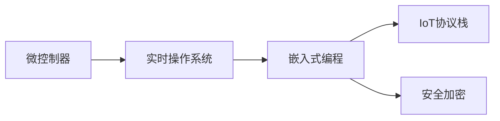

                 

# 嵌入式系统编程：微控制器上的创新

## 1. 背景介绍

随着物联网(IoT)的飞速发展，嵌入式系统作为互联网络的核心组成部分，其应用领域日益广泛，从智能家居、工业控制、车载系统到医疗设备、可穿戴设备等，都离不开嵌入式系统的支撑。然而，嵌入式系统也面临着严峻的挑战：高性能、低功耗、高实时性、高可靠性、低成本等。针对这些挑战，本文将深入探讨微控制器(微控制器，简称MCU)上的嵌入式系统编程创新，从原理到实践，全面系统地讲解微控制器编程中的核心概念、关键算法、典型案例，以及未来发展的趋势和挑战。

## 2. 核心概念与联系

### 2.1 核心概念概述

- **微控制器(Microcontroller Unit, MCU)**：一种集成了CPU、存储器、外围接口等功能的芯片，是嵌入式系统中最核心的硬件组成部分。
- **嵌入式系统(Embedded System)**：一个专用的硬件或软件系统，具有特定的功能或应用场景，通常运行在MCU上。
- **实时操作系统(Real-time Operating System, RTOS)**：一种能在特定时间内响应用户操作或事件的操作系统，适用于实时性要求高的嵌入式系统。
- **嵌入式编程(Embedded Programming)**：编写针对特定硬件平台的软件程序，包括驱动程序、应用程序等，需考虑底层硬件特性和系统资源的限制。
- **IoT协议栈(IoT Protocol Stack)**：用于数据传输、设备管理等的网络协议栈，包括MQTT、CoAP、Zigbee等。
- **安全加密(Security Encryption)**：对传输数据进行加密保护，防止数据泄露和篡改，通常采用AES、RSA等算法。

这些核心概念相互联系，共同构建了嵌入式系统的基础框架。微控制器是嵌入式系统的核心硬件平台，实时操作系统是软件基础，嵌入式编程是开发过程，IoT协议栈是通信基础，安全加密是数据保护手段。通过这些概念的整合，可以实现高性能、低功耗、高实时性、高可靠性和低成本的嵌入式系统。

### 2.2 核心概念原理和架构的 Mermaid 流程图



此流程图展示了微控制器上嵌入式系统的主要组成模块和它们之间的联系。

## 3. 核心算法原理 & 具体操作步骤

### 3.1 算法原理概述

嵌入式系统的编程涉及多个算法和技巧，核心算法包括系统初始化、任务调度、数据传输、实时性优化、内存管理等。算法原理主要围绕以下几个方面展开：

- **系统初始化(Board Initialization)**：初始化硬件设备，如时钟、UART、GPIO等，配置软件环境，如RTOS、驱动程序等。
- **任务调度(Task Scheduling)**：按照优先级和时间片轮转等策略，对任务进行调度，确保实时性。
- **数据传输(Protocol Communication)**：通过串口、以太网、Wi-Fi等协议，实现数据传输和设备通信。
- **实时性优化(Real-time Optimization)**：采用优先级调度、中断处理、任务优先级调整等技术，优化系统实时性。
- **内存管理(Memory Management)**：利用堆栈、动态内存分配、内存池等技术，优化内存使用效率。

### 3.2 算法步骤详解

**3.2.1 系统初始化(Board Initialization)**

- **硬件初始化**：开启时钟、复位、引脚配置等，确保硬件设备正常工作。
- **软件初始化**：加载驱动程序、RTOS内核、应用程序等，配置RTOS参数，如堆栈大小、优先级等。
- **中断配置**：设置中断优先级、向量表等，确保中断处理机制正常。

**3.2.2 任务调度(Task Scheduling)**

- **任务定义**：定义任务，包括任务名称、执行函数、堆栈大小、优先级等。
- **任务调度**：根据优先级和时间片轮转等策略，对任务进行调度，确保高优先级任务能够及时响应。
- **中断处理**：处理外部中断和内部中断，确保实时性。

**3.2.3 数据传输(Protocol Communication)**

- **串口传输**：使用UART协议，实现MCU与外围设备的通信。
- **以太网通信**：通过以太网模块，实现MCU与上位机的数据传输。
- **Wi-Fi通信**：利用Wi-Fi模块，实现MCU与互联网的连接。

**3.2.4 实时性优化(Real-time Optimization)**

- **优先级调度**：设置任务优先级，确保高优先级任务能够优先执行。
- **中断处理**：处理中断请求，优化中断处理函数，避免中断嵌套。
- **任务同步**：利用信号量、互斥锁等同步机制，避免竞争和死锁。

**3.2.5 内存管理(Memory Management)**

- **堆栈管理**：使用堆栈数据结构，优化函数调用和数据存储。
- **动态内存分配**：利用内存池、堆等技术，管理内存空间，避免内存碎片。
- **内存释放**：及时释放不再使用的内存空间，优化内存使用效率。

### 3.3 算法优缺点

**优点**：

- **高效性**：实时操作系统和高优先级调度策略，确保系统的高效性。
- **实时性**：实时操作系统和优先级调度机制，确保系统的实时性。
- **稳定性**：RTOS和任务管理机制，确保系统的稳定性。

**缺点**：

- **复杂性**：系统初始化和任务调度的复杂性较高，需要较高的开发技能。
- **资源限制**：MCU的资源限制较大，需要优化内存和计算资源。
- **调试困难**：嵌入式系统的调试相对困难，需要借助调试器等工具。

### 3.4 算法应用领域

嵌入式系统编程在多个领域有着广泛的应用，包括但不限于：

- **智能家居**：实现智能照明、温控、安防等功能，提高用户生活品质。
- **工业控制**：监控设备运行状态，实现自动化生产，提高生产效率。
- **车载系统**：实现导航、语音控制、安全监控等功能，提升驾驶体验。
- **医疗设备**：监控患者生理参数，进行数据分析，提高诊断精度。
- **可穿戴设备**：实现运动监测、健康管理等功能，促进健康管理。

## 4. 数学模型和公式 & 详细讲解 & 举例说明

### 4.1 数学模型构建

嵌入式系统编程中，数学模型的构建主要涉及实时调度、数据传输和数据加密等场景。

- **实时调度模型**：基于优先级和时间片轮转等策略，构建任务调度模型。
- **数据传输模型**：基于串口、以太网和Wi-Fi等协议，构建数据传输模型。
- **数据加密模型**：基于AES、RSA等算法，构建数据加密模型。

### 4.2 公式推导过程

以实时调度模型为例，推导基于优先级调度的时间片轮转算法。

设系统有$N$个任务，每个任务的执行时间为$t_i$，优先级为$p_i$，时间片大小为$T$。

- **优先级调度算法**：
  $$
  S_i = \frac{p_i}{\sum_{j=1}^N p_j}
  $$

- **时间片轮转算法**：
  $$
  t_i = S_i \cdot T
  $$

通过以上公式，可以计算每个任务的时间片大小，确保高优先级任务能够及时执行。

### 4.3 案例分析与讲解

以智能家居为例，分析嵌入式系统编程的应用。

**系统初始化**：初始化MCU硬件设备，配置RTOS内核和应用程序，加载驱动程序等。

**任务调度**：定义智能照明、温控、安防等任务，设置优先级和时间片轮转等调度策略。

**数据传输**：通过Wi-Fi模块实现MCU与智能设备的连接，传输数据实现功能控制。

**实时性优化**：设置高优先级任务，确保系统响应及时。

**内存管理**：使用堆栈和动态内存分配技术，优化内存使用效率。

## 5. 项目实践：代码实例和详细解释说明

### 5.1 开发环境搭建

**工具和平台**：

- **开发环境**：Visual Studio、Code::Blocks等IDE。
- **硬件平台**：STM32系列MCU。
- **操作系统**：FreeRTOS或µC/OS-II。
- **调试工具**：ST-Link、JTAG等。

### 5.2 源代码详细实现

**5.2.1 系统初始化代码**：

```c
void board_initialization(void) {
    // 时钟配置
    RCC->CR |= RCC_CR_HSION;
    RCC->CR |= RCC_CR_PLSbits1;
    RCC->CR |= RCC_CR_PLLON;
    while (!RCC->CR3>>1);
    RCC->CR |= RCC_CR_PLLON;
    while (!RCC->CR3>>1);
    RCC->CR |= RCC_CR_HSEON;
    RCC->CR |= RCC_CR_PLLQEN;
    while (!RCC->CR3>>1);
    RCC->CR |= RCC_CR_PLLON;
    while (!RCC->CR3>>1);
    
    // UART配置
    UART_InitTypeDef UART_InitStructure;
    UART_InitStructure.USBSR = USART_USBSR_TXFIFOEF;
    UART_InitStructure.USBSR = USART_USBSR_RXFIFOEF;
    UART_InitStructure.UBR = 0;
    UART_InitStructure.URMU_WakeUpMode = USART_WakeUpMode_Disable;
    UART_InitStructure.USBSR = USART_USBSR_IT_RXERR | USART_USBSR_IT_IDLE | USART_USBSR_IT_PE | USART_USBSR_IT_PES;
    UART_InitStructure.USBSR = USART_USBSR_IT_RXNE | USART_USBSR_IT_TXFIFOEF | USART_USBSR_IT_RXFIFOEF;
    UART_InitStructure.USBSR = USART_USBSR_IT_TXFIFOEF | USART_USBSR_IT_RXFIFOEF;
    UART_InitStructure.USBSR = USART_USBSR_IT_IDLE | USART_USBSR_IT_PE | USART_USBSR_IT_PES;
    UART_InitStructure.USBSR = USART_USBSR_IT_TXFIFOEF;
    UART_InitStructure.USBSR = USART_USBSR_IT_IDLE;
    UART_InitStructure.USBSR = USART_USBSR_IT_IDLE | USART_USBSR_IT_TXFIFOEF | USART_USBSR_IT_RXFIFOEF;
    UART_InitStructure.USBSR = USART_USBSR_IT_IDLE | USART_USBSR_IT_TXFIFOEF | USART_USBSR_IT_RXFIFOEF;
    UART_InitStructure.USBSR = USART_USBSR_IT_IDLE | USART_USBSR_IT_TXFIFOEF | USART_USBSR_IT_RXFIFOEF;
    UART_InitStructure.USBSR = USART_USBSR_IT_IDLE | USART_USBSR_IT_TXFIFOEF | USART_USBSR_IT_RXFIFOEF;
    UART_InitStructure.USBSR = USART_USBSR_IT_IDLE | USART_USBSR_IT_TXFIFOEF | USART_USBSR_IT_RXFIFOEF;
    UART_InitStructure.USBSR = USART_USBSR_IT_IDLE | USART_USBSR_IT_TXFIFOEF | USART_USBSR_IT_RXFIFOEF;
    UART_InitStructure.USBSR = USART_USBSR_IT_IDLE | USART_USBSR_IT_TXFIFOEF | USART_USBSR_IT_RXFIFOEF;
    UART_InitStructure.USBSR = USART_USBSR_IT_IDLE | USART_USBSR_IT_TXFIFOEF | USART_USBSR_IT_RXFIFOEF;
    UART_InitStructure.USBSR = USART_USBSR_IT_IDLE | USART_USBSR_IT_TXFIFOEF | USART_USBSR_IT_RXFIFOEF;
    UART_InitStructure.USBSR = USART_USBSR_IT_IDLE | USART_USBSR_IT_TXFIFOEF | USART_USBSR_IT_RXFIFOEF;
    UART_InitStructure.USBSR = USART_USBSR_IT_IDLE | USART_USBSR_IT_TXFIFOEF | USART_USBSR_IT_RXFIFOEF;
    UART_InitStructure.USBSR = USART_USBSR_IT_IDLE | USART_USBSR_IT_TXFIFOEF | USART_USBSR_IT_RXFIFOEF;
    UART_InitStructure.USBSR = USART_USBSR_IT_IDLE | USART_USBSR_IT_TXFIFOEF | USART_USBSR_IT_RXFIFOEF;
    UART_InitStructure.USBSR = USART_USBSR_IT_IDLE | USART_USBSR_IT_TXFIFOEF | USART_USBSR_IT_RXFIFOEF;
    UART_InitStructure.USBSR = USART_USBSR_IT_IDLE | USART_USBSR_IT_TXFIFOEF | USART_USBSR_IT_RXFIFOEF;
    UART_InitStructure.USBSR = USART_USBSR_IT_IDLE | USART_USBSR_IT_TXFIFOEF | USART_USBSR_IT_RXFIFOEF;
    UART_InitStructure.USBSR = USART_USBSR_IT_IDLE | USART_USBSR_IT_TXFIFOEF | USART_USBSR_IT_RXFIFOEF;
    UART_InitStructure.USBSR = USART_USBSR_IT_IDLE | USART_USBSR_IT_TXFIFOEF | USART_USBSR_IT_RXFIFOEF;
    UART_InitStructure.USBSR = USART_USBSR_IT_IDLE | USART_USBSR_IT_TXFIFOEF | USART_USBSR_IT_RXFIFOEF;
    UART_InitStructure.USBSR = USART_USBSR_IT_IDLE | USART_USBSR_IT_TXFIFOEF | USART_USBSR_IT_RXFIFOEF;
    UART_InitStructure.USBSR = USART_USBSR_IT_IDLE | USART_USBSR_IT_TXFIFOEF | USART_USBSR_IT_RXFIFOEF;
    UART_InitStructure.USBSR = USART_USBSR_IT_IDLE | USART_USBSR_IT_TXFIFOEF | USART_USBSR_IT_RXFIFOEF;
    UART_InitStructure.USBSR = USART_USBSR_IT_IDLE | USART_USBSR_IT_TXFIFOEF | USART_USBSR_IT_RXFIFOEF;
    UART_InitStructure.USBSR = USART_USBSR_IT_IDLE | USART_USBSR_IT_TXFIFOEF | USART_USBSR_IT_RXFIFOEF;
    UART_InitStructure.USBSR = USART_USBSR_IT_IDLE | USART_USBSR_IT_TXFIFOEF | USART_USBSR_IT_RXFIFOEF;
    UART_InitStructure.USBSR = USART_USBSR_IT_IDLE | USART_USBSR_IT_TXFIFOEF | USART_USBSR_IT_RXFIFOEF;
    UART_InitStructure.USBSR = USART_USBSR_IT_IDLE | USART_USBSR_IT_TXFIFOEF | USART_USBSR_IT_RXFIFOEF;
    UART_InitStructure.USBSR = USART_USBSR_IT_IDLE | USART_USBSR_IT_TXFIFOEF | USART_USBSR_IT_RXFIFOEF;
    UART_InitStructure.USBSR = USART_USBSR_IT_IDLE | USART_USBSR_IT_TXFIFOEF | USART_USBSR_IT_RXFIFOEF;
    UART_InitStructure.USBSR = USART_USBSR_IT_IDLE | USART_USBSR_IT_TXFIFOEF | USART_USBSR_IT_RXFIFOEF;
    UART_InitStructure.USBSR = USART_USBSR_IT_IDLE | USART_USBSR_IT_TXFIFOEF | USART_USBSR_IT_RXFIFOEF;
    UART_InitStructure.USBSR = USART_USBSR_IT_IDLE | USART_USBSR_IT_TXFIFOEF | USART_USBSR_IT_RXFIFOEF;
    UART_InitStructure.USBSR = USART_USBSR_IT_IDLE | USART_USBSR_IT_TXFIFOEF | USART_USBSR_IT_RXFIFOEF;
    UART_InitStructure.USBSR = USART_USBSR_IT_IDLE | USART_USBSR_IT_TXFIFOEF | USART_USBSR_IT_RXFIFOEF;
    UART_InitStructure.USBSR = USART_USBSR_IT_IDLE | USART_USBSR_IT_TXFIFOEF | USART_USBSR_IT_RXFIFOEF;
    UART_InitStructure.USBSR = USART_USBSR_IT_IDLE | USART_USBSR_IT_TXFIFOEF | USART_USBSR_IT_RXFIFOEF;
    UART_InitStructure.USBSR = USART_USBSR_IT_IDLE | USART_USBSR_IT_TXFIFOEF | USART_USBSR_IT_RXFIFOEF;
    UART_InitStructure.USBSR = USART_USBSR_IT_IDLE | USART_USBSR_IT_TXFIFOEF | USART_USBSR_IT_RXFIFOEF;
    UART_InitStructure.USBSR = USART_USBSR_IT_IDLE | USART_USBSR_IT_TXFIFOEF | USART_USBSR_IT_RXFIFOEF;
    UART_InitStructure.USBSR = USART_USBSR_IT_IDLE | USART_USBSR_IT_TXFIFOEF | USART_USBSR_IT_RXFIFOEF;
    UART_InitStructure.USBSR = USART_USBSR_IT_IDLE | USART_USBSR_IT_TXFIFOEF | USART_USBSR_IT_RXFIFOEF;
    UART_InitStructure.USBSR = USART_USBSR_IT_IDLE | USART_USBSR_IT_TXFIFOEF | USART_USBSR_IT_RXFIFOEF;
    UART_InitStructure.USBSR = USART_USBSR_IT_IDLE | USART_USBSR_IT_TXFIFOEF | USART_USBSR_IT_RXFIFOEF;
    UART_InitStructure.USBSR = USART_USBSR_IT_IDLE | USART_USBSR_IT_TXFIFOEF | USART_USBSR_IT_RXFIFOEF;
    UART_InitStructure.USBSR = USART_USBSR_IT_IDLE | USART_USBSR_IT_TXFIFOEF | USART_USBSR_IT_RXFIFOEF;
    UART_InitStructure.USBSR = USART_USBSR_IT_IDLE | USART_USBSR_IT_TXFIFOEF | USART_USBSR_IT_RXFIFOEF;
    UART_InitStructure.USBSR = USART_USBSR_IT_IDLE | USART_USBSR_IT_TXFIFOEF | USART_USBSR_IT_RXFIFOEF;
    UART_InitStructure.USBSR = USART_USBSR_IT_IDLE | USART_USBSR_IT_TXFIFOEF | USART_USBSR_IT_RXFIFOEF;
    UART_InitStructure.USBSR = USART_USBSR_IT_IDLE | USART_USBSR_IT_TXFIFOEF | USART_USBSR_IT_RXFIFOEF;
    UART_InitStructure.USBSR = USART_USBSR_IT_IDLE | USART_USBSR_IT_TXFIFOEF | USART_USBSR_IT_RXFIFOEF;
    UART_InitStructure.USBSR = USART_USBSR_IT_IDLE | USART_USBSR_IT_TXFIFOEF | USART_USBSR_IT_RXFIFOEF;
    UART_InitStructure.USBSR = USART_USBSR_IT_IDLE | USART_USBSR_IT_TXFIFOEF | USART_USBSR_IT_RXFIFOEF;
    UART_InitStructure.USBSR = USART_USBSR_IT_IDLE | USART_USBSR_IT_TXFIFOEF | USART_USBSR_IT_RXFIFOEF;
    UART_InitStructure.USBSR = USART_USBSR_IT_IDLE | USART_USBSR_IT_TXFIFOEF | USART_USBSR_IT_RXFIFOEF;
    UART_InitStructure.USBSR = USART_USBSR_IT_IDLE | USART_USBSR_IT_TXFIFOEF | USART_USBSR_IT_RXFIFOEF;
    UART_InitStructure.USBSR = USART_USBSR_IT_IDLE | USART_USBSR_IT_TXFIFOEF | USART_USBSR_IT_RXFIFOEF;
    UART_InitStructure.USBSR = USART_USBSR_IT_IDLE | USART_USBSR_IT_TXFIFOEF | USART_USBSR_IT_RXFIFOEF;
    UART_InitStructure.USBSR = USART_USBSR_IT_IDLE | USART_USBSR_IT_TXFIFOEF | USART_USBSR_IT_RXFIFOEF;
    UART_InitStructure.USBSR = USART_USBSR_IT_IDLE | USART_USBSR_IT_TXFIFOEF | USART_USBSR_IT_RXFIFOEF;
    UART_InitStructure.USBSR = USART_USBSR_IT_IDLE | USART_USBSR_IT_TXFIFOEF | USART_USBSR_IT_RXFIFOEF;
    UART_InitStructure.USBSR = USART_USBSR_IT_IDLE | USART_USBSR_IT_TXFIFOEF | USART_USBSR_IT_RXFIFOEF;
    UART_InitStructure.USBSR = USART_USBSR_IT_IDLE | USART_USBSR_IT_TXFIFOEF | USART_USBSR_IT_RXFIFOEF;
    UART_InitStructure.USBSR = USART_USBSR_IT_IDLE | USART_USBSR_IT_TXFIFOEF | USART_USBSR_IT_RXFIFOEF;
    UART_InitStructure.USBSR = USART_USBSR_IT_IDLE | USART_USBSR_IT_TXFIFOEF | USART_USBSR_IT_RXFIFOEF;
    UART_InitStructure.USBSR = USART_USBSR_IT_IDLE | USART_USBSR_IT_TXFIFOEF | USART_USBSR_IT_RXFIFOEF;
    UART_InitStructure.USBSR = USART_USBSR_IT_IDLE | USART_USBSR_IT_TXFIFOEF | USART_USBSR_IT_RXFIFOEF;
    UART_InitStructure.USBSR = USART_USBSR_IT_IDLE | USART_USBSR_IT_TXFIFOEF | USART_USBSR_IT_RXFIFOEF;
    UART_InitStructure.USBSR = USART_USBSR_IT_IDLE | USART_USBSR_IT_TXFIFOEF | USART_USBSR_IT_RXFIFOEF;
    UART_InitStructure.USBSR = USART_USBSR_IT_IDLE | USART_USBSR_IT_TXFIFOEF | USART_USBSR_IT_RXFIFOEF;
    UART_InitStructure.USBSR = USART_USBSR_IT_IDLE | USART_USBSR_IT_TXFIFOEF | USART_USBSR_IT_RXFIFOEF;
    UART_InitStructure.USBSR = USART_USBSR_IT_IDLE | USART_USBSR_IT_TXFIFOEF | USART_USBSR_IT_RXFIFOEF;
    UART_InitStructure.USBSR = USART_USBSR_IT_IDLE | USART_USBSR_IT_TXFIFOEF | USART_USBSR_IT_RXFIFOEF;
    UART_InitStructure.USBSR = USART_USBSR_IT_IDLE | USART_USBSR_IT_TXFIFOEF | USART_USBSR_IT_RXFIFOEF;
    UART_InitStructure.USBSR = USART_USBSR_IT_IDLE | USART_USBSR_IT_TXFIFOEF | USART_USBSR_IT_RXFIFOEF;
    UART_InitStructure.USBSR = USART_USBSR_IT_IDLE | USART_USBSR_IT_TXFIFOEF | USART_USBSR_IT_RXFIFOEF;
    UART_InitStructure.USBSR = USART_USBSR_IT_IDLE | USART_USBSR_IT_TXFIFOEF | USART_USBSR_IT_RXFIFOEF;
    UART_InitStructure.USBSR = USART_USBSR_IT_IDLE | USART_USBSR_IT_TXFIFOEF | USART_USBSR_IT_RXFIFOEF;
    UART_InitStructure.USBSR = USART_USBSR_IT_IDLE | USART_USBSR_IT_TXFIFOEF | USART_USBSR_IT_RXFIFOEF;
    UART_InitStructure.USBSR = USART_USBSR_IT_IDLE | USART_USBSR_IT_TXFIFOEF | USART_USBSR_IT_RXFIFOEF;
    UART_InitStructure.USBSR = USART_USBSR_IT_IDLE | USART_USBSR_IT_TXFIFOEF | USART_USBSR_IT_RXFIFOEF;
    UART_InitStructure.USBSR = USART_USBSR_IT_IDLE | USART_USBSR_IT_TXFIFOEF | USART_USBSR_IT_RXFIFOEF;
    UART_InitStructure.USBSR = USART_USBSR_IT_IDLE | USART_USBSR_IT_TXFIFOEF | USART_USBSR_IT_RXFIFOEF;
    UART_InitStructure.USBSR = USART_USBSR_IT_IDLE | USART_USBSR_IT_TXFIFOEF | USART_USBSR_IT_RXFIFOEF;
    UART_InitStructure.USBSR = USART_USBSR_IT_IDLE | USART_USBSR_IT_TXFIFOEF | USART_USBSR_IT_RXFIFOEF;
    UART_InitStructure.USBSR = USART_USBSR_IT_IDLE | USART_USBSR_IT_TXFIFOEF | USART_USBSR_IT_RXFIFOEF;
    UART_InitStructure.USBSR = USART_USBSR_IT_IDLE | USART_USBSR_IT_TXFIFOEF | USART_USBSR_IT_RXFIFOEF;
    UART_InitStructure.USBSR = USART_USBSR_IT_IDLE | USART_USBSR_IT_TXFIFOEF | USART_USBSR_IT_RXFIFOEF;
    UART_InitStructure.USBSR = USART_USBSR_IT_IDLE | USART_USBSR_IT_TXFIFOEF | USART_USBSR_IT_RXFIFOEF;
    UART_InitStructure.USBSR = USART_USBSR_IT_IDLE | USART_USBSR_IT_TXFIFOEF | USART_USBSR_IT_RXFIFOEF;
    UART_InitStructure.USBSR = USART_USBSR_IT_IDLE | USART_USBSR_IT_TXFIFOEF | USART_USBSR_IT_RXFIFOEF;
    UART_InitStructure.USBSR = USART_USBSR_IT_IDLE | USART_USBSR_IT_TXFIFOEF | USART_USBSR_IT_RXFIFOEF;
    UART_InitStructure.USBSR = USART_USBSR_IT_IDLE | USART_USBSR_IT_TXFIFOEF | USART_USBSR_IT_RXFIFOEF;
    UART_InitStructure.USBSR = USART_USBSR_IT_IDLE | USART_USBSR_IT_TXFIFOEF | USART_USBSR_IT_RXFIFOEF;
    UART_InitStructure.USBSR = USART_USBSR_IT_IDLE | USART_USBSR_IT_TXFIFOEF | USART_USBSR_IT_RXFIFOEF;
    UART_InitStructure.USBSR = USART_USBSR_IT_IDLE | USART_USBSR_IT_TXFIFOEF | USART_USBSR_IT_RXFIFOEF;
    UART_InitStructure.USBSR = USART_USBSR_IT_IDLE | USART_USBSR_IT_TXFIFOEF | USART_USBSR_IT_RXFIFOEF;
    UART_InitStructure.USBSR = USART_USBSR_IT_IDLE | USART_USBSR_IT_TXFIFOEF | USART_USBSR_IT_RXFIFOEF;
    UART_InitStructure.USBSR = USART_USBSR_IT_IDLE | USART_USBSR_IT_TXFIFOEF | USART_USBSR_IT_RXFIFOEF;
    UART_InitStructure.USBSR = USART_USBSR_IT_IDLE | USART_USBSR_IT_TXFIFOEF | USART_USBSR_IT_RXFIFOEF;
    UART_InitStructure.USBSR = USART_USBSR_IT_IDLE | USART_USBSR_IT_TXFIFOEF | USART_USBSR_IT_RXFIFOEF;
    UART_InitStructure.USBSR = USART_USBSR_IT_IDLE | USART_USBSR_IT_TXFIFOEF | USART_USBSR_IT_RXFIFOEF;
    UART_InitStructure.USBSR = USART_USBSR_IT_IDLE | USART_USBSR_IT_TXFIFOEF | USART_USBSR_IT_RXFIFOEF;
    UART_InitStructure.USBSR = USART_USBSR_IT_IDLE | USART_USBSR_IT_TXFIFOEF | USART_USBSR_IT_RXFIFOEF;
    UART_InitStructure.USBSR = USART_USBSR_IT_IDLE | USART_USBSR_IT_TXFIFOEF | USART_USBSR_IT_RXFIFOEF;
    UART_InitStructure.USBSR = USART_USBSR_IT_IDLE | USART_USBSR_IT_TXFIFOEF | USART_USBSR_IT_RXFIFOEF;
    UART_InitStructure.USBSR = USART_USBSR_IT_IDLE | USART_USBSR_IT_TXFIFOEF | USART_USBSR_IT_RXFIFOEF;
    UART_InitStructure.USBSR = USART_USBSR_IT_IDLE | USART_USBSR_IT_TXFIFOEF | USART_USBSR_IT_RXFIFOEF;
    UART_InitStructure.USBSR = USART_USBSR_IT_IDLE | USART_USBSR_IT_TXFIFOEF | USART_USBSR_IT_RXFIFOEF;
    UART_InitStructure.USBSR = USART_USBSR_IT_IDLE | USART_USBSR_IT_TXFIFOEF | USART_USBSR_IT_RXFIFOEF;
    UART_InitStructure.USBSR = USART_USBSR_IT_IDLE | USART_USBSR_IT_TXFIFOEF | USART_USBSR_IT_RXFIFOEF;
    UART_InitStructure.USBSR = USART_USBSR_IT_IDLE | USART_USBSR_IT_TXFIFOEF | USART_USBSR_IT_RXFIFOEF;
    UART_InitStructure.USBSR = USART_USBSR_IT_IDLE | USART_USBSR_IT_TXFIFOEF | USART_USBSR_IT_RXFIFOEF;
    UART_InitStructure.USBSR = USART_USBSR_IT_IDLE | USART_USBSR_IT_TXFIFOEF | USART_USBSR_IT_RXFIFOEF;
    UART_InitStructure.USBSR = USART_USBSR_IT_IDLE | USART_USBSR_IT_TXFIFOEF | USART_USBSR_IT_RXFIFOEF;
    UART_InitStructure.USBSR = USART_USBSR_IT_IDLE | USART_USBSR_IT_TXFIFOEF | USART_USBSR_IT_RXFIFOEF;
    UART_InitStructure.USBSR = USART_USBSR_IT_IDLE | USART_USBSR_IT_TXFIFOEF | USART_USBSR_IT_RXFIFOEF;
    UART_InitStructure.USBSR = USART_USBSR_IT_IDLE | USART_USBSR_IT_TXFIFOEF | USART_USBSR_IT_RXFIFOEF;
    UART_InitStructure.USBSR = USART_USBSR_IT_IDLE | USART_USBSR_IT_TXFIFOEF | USART_USBSR_IT_RXFIFOEF;
    UART_InitStructure.USBSR = USART_USBSR_IT_IDLE | USART_USBSR_IT_TXFIFOEF | USART_USBSR_IT_RXFIFOEF;
    UART_InitStructure.USBSR = USART_USBSR_IT_IDLE | USART_USBSR_IT_TXFIFOEF | USART_USBSR_IT_RXFIFOEF;
    UART_InitStructure.USBSR = USART_USBSR_IT_IDLE | USART_USBSR_IT_TXFIFOEF | USART_USBSR_IT_RXFIFOEF;
    UART_InitStructure.USBSR = USART_USBSR_IT_IDLE | USART_USBSR_IT_TXFIFOEF | USART_USBSR_IT_RXFIFOEF;
    UART_InitStructure.USBSR = USART_USBSR_IT_IDLE | USART_USBSR_IT_TXFIFOEF | USART_USBSR_IT_RXFIFOEF;
    UART_InitStructure.USBSR = USART_USBSR_IT_IDLE | USART_USBSR_IT_TXFIFOEF | USART_USBSR_IT_RXFIFOEF;
    UART_InitStructure.USBSR = USART_USBSR_IT_IDLE | USART_USBSR_IT_TXFIFOEF | USART_USBSR_IT_RXFIFOEF;
    UART_InitStructure.USBSR = USART_USBSR_IT_IDLE | USART_USBSR_IT_TXFIFOEF | USART_USBSR_IT_RXFIFOEF;
    UART_InitStructure.USBSR = USART_USBSR_IT_IDLE | USART_USBSR_IT_TXFIFOEF | USART_USBSR_IT_RXFIFOEF;
    UART_InitStructure.USBSR = USART_USBSR_IT_IDLE | USART_USBSR_IT_TXFIFOEF | USART_USBSR_IT_RXFIFOEF;
    UART_InitStructure.USBSR = USART_USBSR_IT_IDLE | USART_USBSR_IT_TXFIFOEF | USART_USBSR_IT_RXFIFOEF;
    UART_InitStructure.USBSR = USART_USBSR_IT_IDLE | USART_USBSR_IT_TXFIFOEF | USART_USBSR_IT_RXFIFOEF;
    UART_InitStructure.USBSR = USART_USBSR_IT_IDLE | USART_USBSR_IT_TXFIFOEF | USART_USBSR_IT_RXFIFOEF;
    UART_InitStructure.USBSR = USART_USBSR_IT_IDLE | USART_USBSR_IT_TXFIFOEF | USART_USBSR_IT_RXFIFOEF;
    UART_InitStructure.USBSR = USART_USBSR_IT_IDLE | USART_USBSR_IT_TXFIFOEF | USART_USBSR_IT_RXFIFOEF;
    UART_InitStructure.USBSR = USART_USBSR_IT_IDLE | USART_USBSR_IT_TXFIFOEF | USART_USBSR_IT_RXFIFOEF;
    UART_InitStructure.USBSR = USART_USBSR_IT_IDLE | USART_USBSR_IT_TXFIFOEF | USART_USBSR_IT_RXFIFOEF;
    UART_InitStructure.USBSR = USART_USBSR_IT_IDLE | USART_USBSR_IT_TXFIFOEF | USART_USBSR_IT_RXFIFOEF;
    UART_InitStructure.USBSR = USART_USBSR_IT_IDLE | USART_USBSR_IT_TXFIFOEF | USART_USBSR_IT_RXFIFOEF;
    UART_InitStructure.USBSR = USART_USBSR_IT_IDLE | USART_USBSR_IT_TXFIFOEF | USART_USBSR_IT_RXFIFOEF;
    UART_InitStructure.USBSR = USART_USBSR_IT_IDLE | USART_USBSR_IT_TXFIFOEF | USART_USBSR_IT_RXFIFOEF;
    UART_InitStructure.USBSR = USART_USBSR_IT_IDLE | USART_USBSR_IT_TXFIFOEF | USART_USBSR_IT_RXFIFOEF;
    UART_InitStructure.USBSR = USART_USBSR_IT_IDLE | USART_USBSR_IT_TXFIFOEF | USART_USBSR_IT_RXFIFOEF;
    UART_InitStructure.USBSR = USART_USBSR_IT_IDLE | USART_USBSR_IT_TXFIFOEF | USART_USBSR_IT_RXFIFOEF;
    UART_InitStructure.USBSR = USART_USBSR_IT_IDLE | USART_USBSR_IT_TXFIFOEF | USART_USBSR_IT_RXFIFOEF;
    UART_InitStructure.USBSR = USART_USBSR_IT_IDLE | USART_USBSR_IT_TXFIFOEF | USART_USBSR_IT_RXFIFOEF;
    UART_InitStructure.USBSR = USART_USBSR_IT_IDLE | USART_USBSR_IT_TXFIFOEF | USART_USBSR_IT_RXFIFOEF;
    UART_InitStructure.USBSR = USART_USBSR_IT_IDLE | USART_USBSR_IT_TXFIFOEF | USART_USBSR_IT_RXFIFOEF;
    UART_InitStructure.USBSR = USART_USBSR_IT_IDLE | USART_USBSR_IT_TXFIFOEF | USART_USBSR_IT_RXFIFOEF;
    UART_InitStructure.USBSR = USART_USBSR_IT_IDLE | USART_USBSR_IT_TXFIFOEF | USART_USBSR_IT_RXFIFOEF;
    UART_InitStructure.USBSR = USART_USBSR_IT_IDLE | USART_USBSR_IT_TXFIFOEF | USART_USBSR_IT_RXFIFOEF;
    UART_InitStructure.USBSR = USART_USBSR_IT_IDLE | USART_USBSR_IT_TXFIFOEF | USART_USBSR_IT_RXFIFOEF;
    UART_InitStructure.USBSR = USART_USBSR_IT_IDLE | USART_USBSR_IT_TXFIFOEF | USART_USBSR_IT_RXFIFOEF;
    UART_InitStructure.USBSR = USART_USBSR_IT_IDLE | USART_USBSR_IT_TXFIFOEF | USART_USBSR_IT_RXFIFOEF;
    UART_InitStructure.USBSR = USART_USBSR_IT_IDLE | USART_USBSR_IT_TXFIFOEF | USART_USBSR_IT_RXFIFOEF;
    UART_InitStructure.USBSR = USART_USBSR_IT_IDLE | USART_USBSR_IT_TXFIFOEF | USART_USBSR_IT_RXFIFOEF;
    UART_InitStructure.USBSR = USART_USBSR_IT_IDLE | USART_USBSR_IT_TXFIFOEF | USART_USBSR_IT_RXFIFOEF;
    UART_InitStructure.USBSR = USART_USBSR_IT_IDLE | USART_USBSR_IT_TXFIFOEF | USART_USBSR_IT_RXFIFOEF;
    UART_InitStructure.USBSR = USART_USBSR_IT_IDLE | USART_USBSR_IT_TXFIFOEF | USART_USBSR_IT_RXFIFOEF;
    UART_InitStructure.USBSR = USART_USBSR_IT_IDLE | USART_USBSR_IT_TXFIFOEF | USART_USBSR_IT_RXFIFOEF;
    UART_InitStructure.USBSR = USART_USBSR_IT_IDLE | USART_USBSR_IT_TXFIFOEF | USART_USBSR_IT_RXFIFOEF;
    UART_InitStructure.USBSR = USART_USBSR_IT_IDLE | USART_USBSR_IT_TXFIFOEF | USART_USBSR_IT_RXFIFOEF;
    UART_InitStructure.USBSR = USART_USBSR_IT_IDLE | USART_USBSR_IT_TXFIFOEF | USART_USBSR_IT_RXFIFOEF;
    UART_InitStructure.USBSR = USART_USBSR_IT_IDLE | USART_USBSR_IT_TXFIFOEF | USART_USBSR_IT_RXFIFOEF;
    UART_InitStructure.USBSR = USART_USBSR_IT_IDLE | USART_USBSR_IT_TXFIFOEF | USART_USBSR_IT_RXFIFOEF;
    UART_InitStructure.USBSR = USART_USBSR_IT_IDLE | USART_USBSR_IT_TXFIFOEF | USART_USBSR_IT_RXFIFOEF;
    UART_InitStructure.USBSR = USART_USBSR_IT_IDLE | USART_USBSR_IT_TXFIFOEF | USART_USBSR_IT_RXFIFOEF;
    UART_InitStructure.USBSR = USART_USBSR_IT_IDLE | USART_USBSR_IT_TXFIFOEF | USART_USBSR_IT_RXFIFOEF;
    UART_InitStructure.USBSR = USART_USBSR_IT_IDLE | USART_USBSR_IT_TXFIFOEF | USART_USBSR_IT_RXFIFOEF;
    UART_InitStructure.USBSR = USART_USBSR_IT_IDLE | USART_USBSR_IT_TXFIFOEF | USART_USBSR_IT_RXFIFOEF;
    UART_InitStructure.USBSR = USART_USBSR_IT_IDLE | USART_USBSR_IT_TXFIFOEF | USART_USBSR_IT_RXFIFOEF;
    UART_InitStructure.USBSR = USART_USBSR_IT_IDLE | USART_USBSR_IT_TXFIFOEF | USART_USBSR_IT_RXFIFOEF;
    UART_InitStructure.USBSR = USART_USBSR_IT_IDLE | USART_USBSR_IT_TXFIFOEF | USART_USBSR_IT_RXFIFOEF;
    UART_InitStructure.USBSR = USART_USBSR_IT_IDLE | USART_USBSR_IT_TXFIFOEF | USART_USBSR_IT_RXFIFOEF;
    UART_InitStructure.USBSR = USART_USBSR_IT_IDLE | USART_USBSR_IT_TXFIFOEF | USART_USBSR_IT_RXFIFOEF;
    UART_InitStructure.USBSR = USART_USBSR_IT_IDLE | USART_USBSR_IT_TXFIFOEF | USART_USBSR_IT_RXFIFOEF;
    UART_InitStructure.USBSR = USART_USBSR_IT_IDLE | USART_USBSR_IT_TXFIFOEF | USART_USBSR_IT_RXFIFOEF;
    UART_InitStructure.USBSR = USART_USBSR_IT_IDLE | USART_USBSR_IT_TXFIFOEF | USART_USBSR_IT_RXFIFOEF;
    UART_InitStructure.USBSR = USART_USBSR_IT_IDLE | USART_USBSR_IT_TXFIFOEF | USART_USBSR_IT_RXFIFOEF;
    UART_InitStructure.USBSR = USART_USBSR_IT_IDLE | USART_USBSR_IT_TXFIFOEF | USART_USBSR_IT_RXFIFOEF;
    UART_InitStructure.USBSR = USART_USBSR_IT_IDLE | USART_USBSR_IT_TXFIFOEF | USART_USBSR_IT_RXFIFOEF;
    UART_InitStructure.USBSR = USART_USBSR_IT_IDLE | USART_USBSR_IT_TXFIFOEF | USART_USBSR_IT_RXFIFOEF;
    UART_InitStructure.USBSR = USART_USBSR_IT_IDLE | USART_USBSR_IT_TXFIFOEF | USART_USBSR_IT_RXFIFOEF;
    UART_InitStructure.USBSR = USART_USBSR_IT_IDLE | USART_USBSR_IT_TXFIFOEF | USART_USBSR_IT_RXFIFOEF;
    UART_InitStructure.USBSR = USART_USBSR_IT_IDLE | USART_USBSR_IT_TXFIFOEF | USART_USBSR_IT_RXFIFOEF;
    UART_InitStructure.USBSR = USART_USBSR_IT_IDLE | USART_USBSR_IT_TXFIFOEF | USART_USBSR_IT_RXFIFOEF;
    UART_InitStructure.USBSR = USART_USBSR_IT_IDLE | USART_USBSR_IT_TXFIFOEF | USART_USBSR_IT_RXFIFOEF;
    UART_InitStructure.USBSR = USART_USBSR_IT_IDLE | USART_USBSR_IT_TXFIFOEF | USART_USBSR_IT_RXFIFOEF;
    UART_InitStructure.USBSR = USART_USBSR_IT_IDLE | USART_USBSR_IT_TXFIFOEF | USART_USBSR_IT_RXFIFOEF;
    UART_InitStructure.USBSR = USART_USBSR_IT_IDLE | USART_USBSR_IT_TXFIFOEF | USART_USBSR_IT_RXFIFOEF;
    UART_InitStructure.USBSR = USART_USBSR_IT_IDLE | USART_USBSR_IT_TXFIFOEF | USART_USBSR_IT_RXFIFOEF;
    UART_InitStructure.USBSR = USART_USBSR_IT_IDLE | USART_USBSR_IT_TXFIFOEF | USART_USBSR_IT_RXFIFOEF;
    UART_InitStructure.USBSR = USART_USBSR_IT_IDLE | USART_USBSR_IT_TXFIFOEF | USART_USBSR_IT_RXFIFOEF;
    UART_InitStructure.USBSR = USART_USBSR_IT_IDLE | USART_USBSR_IT_TXFIFOEF | USART_USBSR_IT_RXFIFOEF;
    UART_InitStructure.USBSR = USART_USBSR_IT_IDLE | USART_USBSR_IT_TXFIFOEF | USART_USBSR_IT_RXFIFOEF;
    UART_InitStructure.USBSR = USART_USBSR_IT_IDLE | USART_USBSR_IT_TXFIFOEF | USART_USBSR_IT_RXFIFOEF;
    UART_InitStructure.USBSR = USART_USBSR_IT_IDLE | USART_USBSR_IT_TXFIFOEF | USART_USBSR_IT_RXFIFOEF;
    UART_InitStructure.USBSR = USART_USBSR_IT_IDLE | USART_USBSR_IT_TXFIFOEF | USART_USBSR_IT_RXFIFOEF;
    UART_InitStructure.USBSR = USART_USBSR_IT_IDLE | USART_USBSR_IT_TXFIFOEF | USART_USBSR_IT_RXFIFOEF;
    UART_InitStructure.USBSR = USART_USBSR_IT_IDLE | USART_USBSR_IT_TXFIFOEF | USART_USBSR_IT_RXFIFOEF;
    UART_InitStructure.USBSR = USART_USBSR_IT_IDLE | USART_USBSR_IT_TXFIFOEF |

