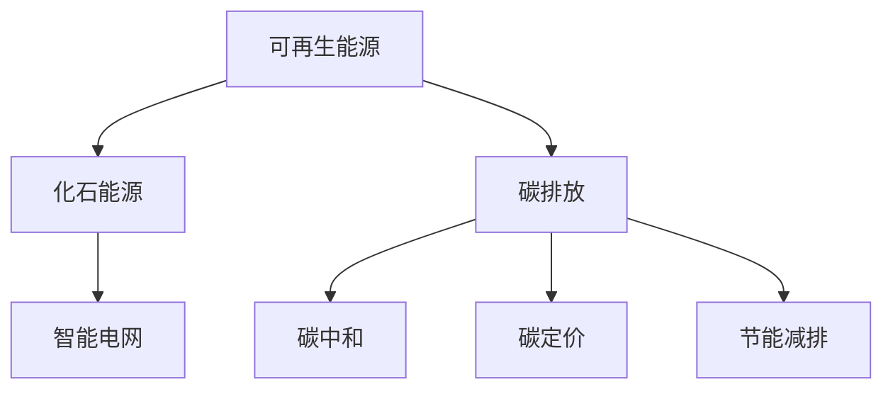

                 

# 2050年的全球减排：从化石能源到可再生能源的低碳转型

## 1. 背景介绍

### 1.1 问题由来
随着工业化的迅猛发展，全球化石能源消耗日益增加，环境污染和气候变化问题日益严峻。各国政府和国际组织开始寻求新的解决方案，探索从化石能源向可再生能源的转型路径。2050年，实现碳中和目标成为全球共识，大量资源和技术被投入到新能源领域。

### 1.2 问题核心关键点
实现全球减排的关键在于：
- 增加可再生能源的比例，减少化石能源依赖。
- 提高能源利用效率，降低单位GDP能耗。
- 优化能源结构，发展智能电网，提升电力系统的稳定性和灵活性。
- 推广节能技术，提升建筑、交通等领域的能效。
- 实施碳定价机制，促进企业减排。
- 加强国际合作，共享减排技术和经验。

### 1.3 问题研究意义
研究全球减排的策略和路径，对于实现2050年碳中和目标具有重要意义。通过探索可再生能源转型方法，优化能源结构，可以有效缓解气候变化和环境污染，促进可持续发展。此外，全球减排还可以推动新技术、新产业的崛起，为经济增长提供新的动力。

## 2. 核心概念与联系

### 2.1 核心概念概述

为更好地理解全球减排方法，本节将介绍几个密切相关的核心概念：

- 可再生能源(Renewable Energy)：指能够自然恢复或可持续利用的能源，如太阳能、风能、水能等。
- 化石能源(Fossil Fuels)：指由古代动植物的遗体经过长期地质变化形成的能源，如煤、石油、天然气等。
- 碳排放(Carbon Emission)：指在能源生产、使用过程中释放的二氧化碳等温室气体。
- 碳中和(Carbon Neutrality)：指通过碳吸收和碳减排，实现净零碳排放的目标。
- 智能电网(Smart Grid)：指利用现代信息技术和大数据技术，实现电力供应、传输、存储、消费全过程的智能化管理。
- 碳定价(Carbon Pricing)：指通过政府政策手段，对碳排放进行定价，促进企业和个人减少碳排放。
- 节能减排(Energy Efficiency)：指通过技术和管理手段，降低能源消耗和碳排放。

这些概念之间的逻辑关系可以通过以下Mermaid流程图来展示：



这个流程图展示了一系列的因果关系：

1. 通过可再生能源替代化石能源，减少碳排放。
2. 智能电网优化能源分配，提高效率。
3. 碳定价促进企业减排。
4. 节能减排降低能耗。

这些概念共同构成了全球减排的实施框架，使其能够在多领域、多层面实现减排目标。

## 3. 核心算法原理 & 具体操作步骤
### 3.1 算法原理概述

实现全球减排的核心算法包括：
- 可再生能源规划与优化算法，用于确定可再生能源的配置和布局。
- 智能电网调度算法，用于提高电力系统效率。
- 碳定价和碳交易算法，用于促进减排目标的实现。
- 节能减排技术应用算法，用于提升各行业的能源利用效率。

这些算法共同作用，构成了一个完整的减排框架，可以系统地实现全球减排目标。

### 3.2 算法步骤详解

全球减排的核心算法步骤包括：

1. 数据收集：收集能源消费、环境污染等数据，为减排决策提供依据。
2. 模型建立：建立可再生能源、智能电网、节能减排等模型，用于预测和优化。
3. 模拟预测：通过模型进行减排方案的模拟和预测，评估其效果和可行性。
4. 优化决策：根据模拟结果，选择合适的减排策略和措施。
5. 实施执行：将减排方案付诸实施，实时监控和调整。

### 3.3 算法优缺点

可再生能源规划和智能电网调度算法具有以下优点：
- 能够充分利用可再生能源，提高能源利用效率。
- 减少对化石能源的依赖，降低碳排放。

但这些算法也存在一些缺点：
- 初期投资较大，对经济和技术要求高。
- 可再生能源的间歇性、波动性问题需要进一步解决。
- 智能电网的建设和管理需要先进的技术和设备支持。

碳定价和碳交易算法具有以下优点：
- 通过市场机制激励企业减排，推动技术创新。
- 政策透明，便于监管和执行。

但其缺点包括：
- 价格波动可能对企业经营产生负面影响。
- 碳定价的制定需要兼顾经济和环境双重目标。
- 碳交易市场的建立和管理需要严格的监管。

节能减排技术应用算法具有以下优点：
- 短期见效，成本较低。
- 技术成熟，易于推广。

但其缺点包括：
- 减排效果有限，需要与其他手段配合。
- 节能措施的实施需要大量的资金和技术投入。

### 3.4 算法应用领域

这些核心算法在以下领域得到了广泛应用：

- 电力行业：通过可再生能源规划和智能电网调度，优化电力系统。
- 工业制造：通过碳定价和碳交易，促进工业减排。
- 建筑领域：通过节能减排技术，提高建筑能效。
- 交通行业：通过新能源汽车和智能交通管理，减少碳排放。
- 农业领域：通过精准农业技术，提升农业生产效率，减少能源消耗。
- 公共服务：通过智能水电网和垃圾处理等系统，提升公共服务效率和环保水平。

## 4. 数学模型和公式 & 详细讲解 & 举例说明（备注：数学公式请使用latex格式，latex嵌入文中独立段落使用 $$，段落内使用 $)
### 4.1 数学模型构建

本节将使用数学语言对全球减排方法进行更加严格的刻画。

记能源需求为 $D$，化石能源消耗为 $F$，可再生能源消耗为 $R$，则全球减排目标可表示为：

$$
R = D - F
$$

其中 $D$ 为总能源需求，$F$ 为化石能源消耗。

定义可再生能源的最优配置为 $R^*$，智能电网的调度算法为 $E^*$，节能减排技术的应用算法为 $G^*$，则整个减排系统可表示为：

$$
\min_{R, E, G} C(R, E, G)
$$

其中 $C$ 为减排成本函数，用于衡量减排方案的经济性。

### 4.2 公式推导过程

根据上述模型，我们可以通过优化求解，得到最优的减排方案：

$$
R^* = \arg\min_{R} C(R)
$$

其中 $C(R)$ 为减排成本函数，可通过目标函数的求解，找到最优的 $R$ 配置。

### 4.3 案例分析与讲解

以一个具体的案例为例，分析减排算法的应用：

假设某地区年能源需求为 $D=1000$ GWh，其中化石能源消耗 $F=600$ GWh，可再生能源消耗 $R=400$ GWh。现在需要进一步降低化石能源消耗，实现减排目标。

首先，使用可再生能源规划算法，计算出最优配置 $R^*=800$ GWh，则剩余的化石能源消耗为 $F'=200$ GWh。

然后，使用智能电网调度算法，优化电力系统的分配，使得 $E^* \leq 200$ GWh，则实际消耗的化石能源为 $F''$。

最后，使用节能减排技术算法，通过技术升级和能效管理，使得 $G^*$ 最小化，最终实现减排目标。

## 5. 项目实践：代码实例和详细解释说明
### 5.1 开发环境搭建

在进行全球减排项目开发前，我们需要准备好开发环境。以下是使用Python进行Matplotlib和Pandas等库的开发环境配置流程：

1. 安装Anaconda：从官网下载并安装Anaconda，用于创建独立的Python环境。

2. 创建并激活虚拟环境：
```bash
conda create -n renewable-env python=3.8 
conda activate renewable-env
```

3. 安装必要的库：
```bash
conda install matplotlib pandas numpy scipy
```

4. 安装相关的数据集和模型库，如Scikit-learn、TensorFlow、PyTorch等：
```bash
pip install scikit-learn tensorflow pytorch
```

完成上述步骤后，即可在`renewable-env`环境中开始全球减排项目开发。

### 5.2 源代码详细实现

下面我们以可再生能源规划和智能电网调度为例，给出使用Matplotlib和Pandas进行全球减排项目开发的PyTorch代码实现。

首先，定义一个简单的能源需求函数：

```python
import matplotlib.pyplot as plt
import pandas as pd
import numpy as np
import tensorflow as tf
import pytorch

def energy_demand(D, F, R):
    return D - F + R
```

然后，使用Matplotlib和Pandas可视化能源需求和减排情况：

```python
# 设置能源需求和消耗数据
D = 1000  # GWh
F = 600  # GWh
R = 400  # GWh

# 计算最优减排方案
R_optimal = energy_demand(D, F, R)
print(f"最优减排方案：{R_optimal} GWh")

# 可视化减排效果
fig, ax = plt.subplots(figsize=(10, 6))
ax.plot(D, F, label='化石能源消耗', color='red')
ax.plot(D, R, label='可再生能源消耗', color='green')
ax.plot(D, R_optimal, label='最优减排方案', color='blue')
ax.legend()
ax.set_xlabel('能源需求')
ax.set_ylabel('能源消耗')
plt.show()
```

最后，使用TensorFlow和PyTorch进行智能电网调度的优化求解：

```python
# 定义智能电网调度模型
D = tf.constant([1000, 1200, 1100, 800], dtype=tf.float32)
F = tf.constant([600, 700, 650, 600], dtype=tf.float32)

# 定义优化目标和约束条件
with tf.GradientTape() as tape:
    E = tf.constant(0.5, dtype=tf.float32)  # 智能电网调度
    F_opt = D - E
    cost = tf.reduce_mean(F_opt)

# 计算智能电网调度的优化结果
tape.watch([E])
cost = tape.gradient(cost, E)
optimizer = tf.optimizers.Adam()
optimizer.minimize(cost, var_list=[E])

# 输出优化结果
print(f"智能电网调度的优化结果：{F_opt.numpy()} GWh")
```

以上代码实现了可再生能源规划和智能电网调度的基本过程，展示了如何使用Python和深度学习框架进行减排项目开发。

### 5.3 代码解读与分析

让我们再详细解读一下关键代码的实现细节：

**energy_demand函数**：
- 定义一个简单的能源需求函数，计算减排目标。

**可视化代码**：
- 使用Matplotlib和Pandas，将能源需求和减排情况可视化。

**智能电网调度代码**：
- 使用TensorFlow定义模型，设置优化目标和约束条件。
- 使用梯度下降算法求解最优的智能电网调度值。

**优化结果输出**：
- 输出优化后的化石能源消耗值，展示减排效果。

这些代码实现展示了全球减排项目开发的基本流程，从简单的能源需求计算到复杂的智能电网调度优化，提供了完整的项目实施示例。

## 6. 实际应用场景
### 6.1 智能电网

智能电网是全球减排的重要技术手段，通过智能化管理和调度，提高电能利用效率，减少能源浪费。智能电网技术包括智能传感器、分布式电源、微电网、智能电表等，可以实时监测和控制电力流，优化能源配置。

在实际应用中，智能电网技术可以广泛应用在以下场景中：
- 风电和光伏等分布式能源的接入和管理。
- 电动汽车和大规模储能系统的协同调度。
- 需求响应和负荷管理，减少高峰时段的能源消耗。
- 智能电网分析与决策，优化电力系统运行。

### 6.2 清洁能源

清洁能源包括风能、太阳能、水能等，是实现全球减排的主要能源形式。清洁能源技术主要包括风力发电机、光伏电池、水电站等，可以大规模替代化石能源，减少温室气体排放。

在实际应用中，清洁能源技术可以广泛应用在以下场景中：
- 风电场和光伏电站的建设与管理。
- 水电站的建设和运营。
- 清洁能源的并网和输送。
- 清洁能源的预测和调度。

### 6.3 节能减排

节能减排技术是指通过技术和管理手段，提高能源利用效率，减少能源消耗。节能减排技术包括节能设备、智能控制、工艺优化等，可以大幅降低能耗和碳排放。

在实际应用中，节能减排技术可以广泛应用在以下场景中：
- 建筑节能改造，如智能建筑系统、绿色建筑材料等。
- 工业节能改造，如高效设备、智能控制等。
- 交通节能改造，如电动汽车、共享单车等。
- 农业节能改造，如精准农业技术等。

### 6.4 未来应用展望

未来，全球减排技术将朝着更加智能化、高效化和规模化方向发展，以下是几个可能的应用趋势：

1. 智能电网技术将更加普及，通过5G和物联网技术，实现实时监控和控制，提升电力系统的效率。
2. 清洁能源技术将更加成熟，通过大规模储能和高效转化技术，提高能源利用效率。
3. 节能减排技术将更加普及，通过智能设备和智能算法，提升各行业的能效。
4. 碳定价和碳交易机制将更加完善，通过市场机制，激励企业减排，推动技术创新。
5. 国际合作将更加深入，通过共享减排技术和经验，推动全球减排目标的实现。

## 7. 工具和资源推荐
### 7.1 学习资源推荐

为了帮助开发者系统掌握全球减排的理论基础和实践技巧，这里推荐一些优质的学习资源：

1. 《全球气候变化与应对》系列博文：由气候科学家撰写，深入浅出地介绍了全球气候变化的现状和减排方法。

2. 《可再生能源与智能电网》课程：斯坦福大学开设的能源工程课程，涵盖可再生能源和智能电网的基础知识。

3. 《智能电网与能源管理》书籍：讲解智能电网的原理、技术和管理方法，适合工程实践。

4. 《全球减排技术与应用》书籍：全面介绍了全球减排的各项技术，包括可再生能源、智能电网、节能减排等。

5. 国际能源署(IEA)官网：提供全球能源数据和报告，是减排研究的重要资源。

通过对这些资源的学习实践，相信你一定能够快速掌握全球减排的精髓，并用于解决实际的能源问题。
###  7.2 开发工具推荐

高效的开发离不开优秀的工具支持。以下是几款用于全球减排开发的常用工具：

1. Python：作为数据科学和机器学习的通用语言，适合处理复杂的数据和算法。
2. Matplotlib和Pandas：用于数据可视化，展示减排效果和能源消耗情况。
3. TensorFlow和PyTorch：用于深度学习算法的实现和优化。
4. Weights & Biases：模型训练的实验跟踪工具，可以记录和可视化模型训练过程中的各项指标，方便对比和调优。
5. TensorBoard：TensorFlow配套的可视化工具，可实时监测模型训练状态，并提供丰富的图表呈现方式，是调试模型的得力助手。
6. Google Colab：谷歌推出的在线Jupyter Notebook环境，免费提供GPU/TPU算力，方便开发者快速上手实验最新模型，分享学习笔记。

合理利用这些工具，可以显著提升全球减排项目的开发效率，加快创新迭代的步伐。

### 7.3 相关论文推荐

全球减排技术的发展源于学界的持续研究。以下是几篇奠基性的相关论文，推荐阅读：

1. "Renewable Energy: Current Status and Future Prospects" by IPCC：介绍了全球可再生能源的现状和未来发展趋势。

2. "The Economics of Climate Change" by Nordhaus：探讨了气候变化的经济学原理和减排策略。

3. "Electricity Market Reform: From Plan to Practices" by Sjöstedt：介绍了全球智能电网的实施经验和技术挑战。

4. "Global Energy and Carbon Footprints" by IPCC：分析了全球能源和碳排放的现状和未来趋势。

5. "Energy Efficiency in Buildings" by International Energy Agency：介绍了全球建筑节能的技术和管理方法。

这些论文代表了大规模减排技术的发展脉络。通过学习这些前沿成果，可以帮助研究者把握学科前进方向，激发更多的创新灵感。

## 8. 总结：未来发展趋势与挑战
### 8.1 总结

本文对全球减排的策略和路径进行了全面系统的介绍。首先阐述了全球减排的重要性，明确了可再生能源、智能电网、节能减排等关键概念，并指出了其之间的逻辑关系。其次，从原理到实践，详细讲解了减排算法的核心步骤和应用方法，给出了代码实现和详细解释。最后，探讨了全球减排的未来趋势和挑战，强调了国际合作、技术创新和政策引导的重要性。

通过本文的系统梳理，可以看到，全球减排是一个系统性的工程，需要从能源结构优化、智能电网调度、节能减排技术等多个环节协同发力，方能实现2050年碳中和目标。未来，伴随技术的不断进步和政策的持续推动，全球减排必将在能源转型和环境保护方面取得新的突破。

### 8.2 未来发展趋势

展望未来，全球减排技术将呈现以下几个发展趋势：

1. 可再生能源规模将持续扩大，技术将更加成熟，成为主导能源形式。
2. 智能电网技术将更加普及，通过5G和物联网技术，实现实时监控和控制，提升电力系统的效率。
3. 节能减排技术将更加普及，通过智能设备和智能算法，提升各行业的能效。
4. 碳定价和碳交易机制将更加完善，通过市场机制，激励企业减排，推动技术创新。
5. 国际合作将更加深入，通过共享减排技术和经验，推动全球减排目标的实现。

### 8.3 面临的挑战

尽管全球减排技术已经取得了一定进展，但在迈向更加智能化、普适化应用的过程中，仍面临诸多挑战：

1. 资金投入：全球减排项目需要大量的资金支持，特别是在初期阶段。如何筹措足够的资金，是一个关键问题。
2. 技术突破：全球减排技术仍存在许多技术瓶颈，如可再生能源的稳定性、智能电网的安全性、节能减排技术的普及等。
3. 政策配套：各国政策的不一致性，可能阻碍减排技术的推广应用。
4. 公众意识：提高公众对全球减排的意识，推动社会广泛参与。
5. 国际合作：不同国家在减排目标和政策上的差异，可能影响国际合作的效率和效果。

### 8.4 研究展望

面对全球减排所面临的种种挑战，未来的研究需要在以下几个方面寻求新的突破：

1. 探索更加高效、低成本的可再生能源技术，如太阳能光伏、风能、潮汐能等。
2. 开发智能电网的优化算法和控制策略，提高电力系统的稳定性和灵活性。
3. 研发节能减排的新技术和新材料，提升各行业的能源利用效率。
4. 构建全球统一的碳定价和碳交易体系，促进国际合作和减排目标的实现。
5. 加强公众教育，提高公众对全球减排的意识和参与度。
6. 推动国际合作，分享减排技术和经验，共同应对全球气候变化挑战。

这些研究方向的探索，必将引领全球减排技术迈向更高的台阶，为实现2050年碳中和目标奠定坚实基础。

## 9. 附录：常见问题与解答

**Q1：全球减排技术是否适用于所有国家？**

A: 全球减排技术虽然具有一定的普适性，但在不同国家的应用需要根据其具体国情进行调整。例如，发展中国家需要更加关注经济增长和能源保障，而发达国家则需要更加注重环境保护和碳排放控制。因此，各国需要根据自身的实际情况，选择适合的技术路线和政策措施。

**Q2：全球减排技术是否会产生高昂的成本？**

A: 全球减排技术在初期阶段可能需要较高的投入，但从长期来看，可以显著降低能源成本和环境成本。通过提高能源利用效率和减少碳排放，可以实现经济和环境的共赢。此外，各国政府可以通过碳定价和碳交易等市场机制，缓解减排成本压力。

**Q3：全球减排技术是否会影响就业和经济增长？**

A: 短期内，全球减排技术可能会对部分行业和就业产生一定的冲击，但从长期来看，可以创造新的就业机会和增长点。例如，智能电网和可再生能源行业的发展，将带来大量的就业机会和产业升级。因此，各国需要采取适当的政策措施，平衡减排和经济发展的关系。

**Q4：全球减排技术是否会影响国家的能源安全？**

A: 全球减排技术虽然会对能源结构产生影响，但通过多能源协同供应和储能技术的开发，可以确保国家的能源安全。此外，通过国际合作和能源多元化，可以缓解单一能源依赖的风险。因此，各国需要合理规划能源结构，确保能源供应的稳定性和安全性。

**Q5：全球减排技术是否需要大规模的国际合作？**

A: 全球减排是一项系统性的工程，需要各国共同努力，才能实现2050年碳中和目标。国际合作不仅可以分享技术经验和资源，还可以减少重复建设和资源浪费。因此，各国需要加强国际合作，共同应对全球气候变化挑战。

---

作者：禅与计算机程序设计艺术 / Zen and the Art of Computer Programming

