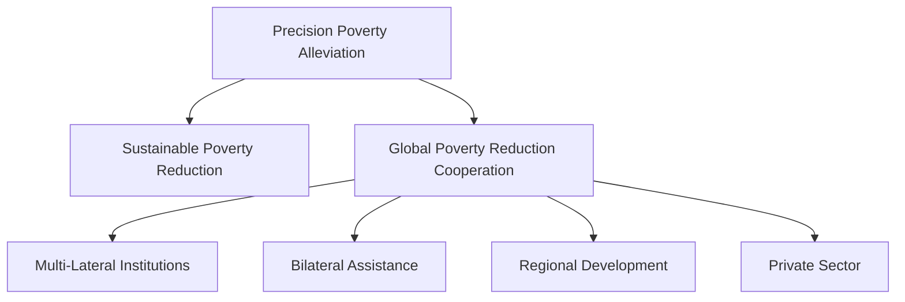

                 

# 2050年的全球减贫：从精准扶贫到可持续减贫的全球减贫合作

## 1. 背景介绍

### 1.1 问题由来
全球贫困问题一直是国际社会关注的焦点。尽管在过去的几十年中，全球减贫取得了显著的进展，但截至2020年，仍有近8亿人生活在极端贫困线以下，占全球人口的9.5%。这些人口主要分布在撒哈拉以南非洲、南亚和东南亚地区。

新冠肺炎疫情的爆发进一步加剧了全球贫困问题。联合国预测，2020年全球减贫成果将倒退10年，新增8000万贫困人口。全球贫富差距加剧，发展中国家面临更大的贫困风险。

面对新的形势，国际社会亟需寻找新的减贫途径，推动全球减贫事业不断向前。本文将重点探讨从精准扶贫到可持续减贫的全球减贫合作策略，以期为未来的全球减贫事业提供新的思路。

## 2. 核心概念与联系

### 2.1 核心概念概述

为更好地理解全球减贫的合作策略，本节将介绍几个密切相关的核心概念：

- **精准扶贫(Precision Poverty Alleviation)**：指通过精准识别贫困对象、精准施策、精准管理等手段，提高扶贫资金使用效率和贫困人口获益水平的扶贫模式。
- **可持续减贫(Sustainable Poverty Reduction)**：指通过发展经济、改善民生、保护环境、提升能力等措施，使贫困人口能够实现自我发展和长期脱贫的减贫模式。
- **全球减贫合作(Global Poverty Reduction Cooperation)**：指各国、各组织在全球减贫事业中加强合作，共同推动全球减贫进程的国际合作模式。
- **多边机构(Multilateral Institutions)**：如联合国、世界银行、国际货币基金组织等国际组织，在推动全球减贫中扮演重要角色。
- **双边援助(Bilateral Assistance)**：指一个国家向另一个国家提供的无偿援助或低息贷款，以帮助后者实现减贫和发展的国际合作方式。
- **区域发展(Regional Development)**：指通过促进区域内经济、社会、环境协调发展，实现区域内贫困人口长期脱贫的区域合作模式。
- **私人部门(Private Sector)**：包括各类跨国公司、社会企业、非营利组织等，在推动全球减贫中发挥着日益重要的作用。

这些核心概念之间的逻辑关系可以通过以下Mermaid流程图来展示：



这个流程图展示了大语言模型的核心概念及其之间的关系：

1. 精准扶贫是可持续减贫的基础，通过精准识别和精准施策，提高扶贫效率和效果。
2. 全球减贫合作是多边机构、双边援助、区域发展和私人部门等多元化合作模式的共同体现，是实现可持续减贫的重要途径。
3. 多边机构、双边援助、区域发展和私人部门等各方的合作，共同推动全球减贫进程。

这些概念共同构成了全球减贫的合作框架，旨在通过多方协作，实现贫困人口的长期脱贫和可持续发展。

## 3. 核心算法原理 & 具体操作步骤
### 3.1 算法原理概述

从精准扶贫到可持续减贫的全球减贫合作策略，本质上是一个多层次、多维度的系统工程。其核心思想是：通过精准识别、精准施策、精准管理等手段，实现贫困人口的精准脱贫，并通过多边机构、双边援助、区域发展和私人部门等多元化合作模式，推动全球减贫事业的持续进步。

具体而言，包括以下几个关键步骤：

1. **精准识别贫困对象**：通过各类数据收集和分析工具，精准识别贫困人口、贫困地区和贫困原因。
2. **精准施策**：根据贫困对象的具体情况，制定针对性的扶贫政策，确保资金和资源精准到位。
3. **精准管理**：建立高效的扶贫项目管理机制，确保扶贫资金和资源的使用透明度和有效性。
4. **多边机构合作**：通过联合国、世界银行等国际组织，协调各国在全球减贫中的行动，共同推动减贫目标的实现。
5. **双边援助**：通过发达国家向发展中国家提供的无偿援助或低息贷款，帮助后者实现减贫和发展。
6. **区域发展**：通过促进区域内经济、社会、环境协调发展，实现区域内贫困人口长期脱贫。
7. **私人部门参与**：鼓励各类社会企业和非营利组织，参与全球减贫项目，发挥其独特优势和作用。

### 3.2 算法步骤详解

基于上述原理，本节将详细介绍实现精准扶贫到可持续减贫的全球减贫合作的具体操作步骤：

**Step 1: 数据收集与分析**
- **经济数据**：收集各国的GDP、人均收入、贫困率等经济数据，通过统计分析评估国家经济发展水平。
- **社会数据**：收集各国的教育、卫生、就业、住房等社会数据，评估社会民生状况。
- **环境数据**：收集各国的环境污染、生态破坏、自然灾害等环境数据，评估环境质量。

**Step 2: 精准识别贫困对象**
- **人口识别**：通过家庭收入、教育水平、健康状况等指标，识别贫困人口。
- **地区识别**：通过区域经济发展水平、基础设施建设、公共服务水平等指标，识别贫困地区。
- **原因识别**：通过贫困家庭的历史数据、社会经济背景、自然环境等，识别贫困原因。

**Step 3: 精准施策**
- **政策制定**：根据贫困人口、地区和原因的具体情况，制定针对性的扶贫政策。
- **资金分配**：将扶贫资金精准分配到贫困人口和地区，确保资金使用效率。
- **项目实施**：建立项目实施机制，确保扶贫项目按计划顺利进行。

**Step 4: 精准管理**
- **资金监管**：建立资金监管机制，确保扶贫资金使用透明度和有效性。
- **项目管理**：建立项目管理机制，确保扶贫项目按计划顺利实施。
- **效果评估**：定期评估扶贫效果，及时调整和优化扶贫政策。

**Step 5: 多边机构合作**
- **协调行动**：通过联合国、世界银行等国际组织，协调各国在全球减贫中的行动。
- **资源共享**：分享各国的减贫经验和资源，共同推动全球减贫进程。
- **政策对接**：对接各国减贫政策和行动计划，形成合力。

**Step 6: 双边援助**
- **资金援助**：发达国家通过无偿援助或低息贷款，帮助发展中国家实现减贫和发展。
- **技术援助**：发达国家提供技术支持，帮助发展中国家提升减贫能力。
- **合作项目**：通过双边合作项目，促进发展中国家的经济发展。

**Step 7: 区域发展**
- **区域规划**：制定区域发展计划，促进区域内经济、社会、环境协调发展。
- **基础设施建设**：加强区域内基础设施建设，改善贫困地区的生活条件。
- **公共服务提供**：提供公共服务，提升区域内民生水平。

**Step 8: 私人部门参与**
- **社会企业**：鼓励社会企业参与全球减贫项目，发挥其在资金、技术、市场等方面的优势。
- **非营利组织**：鼓励非营利组织参与全球减贫项目，发挥其在社会动员、公益宣传等方面的作用。
- **合作平台**：建立合作平台，促进各类社会企业和非营利组织与政府的合作。

### 3.3 算法优缺点

精准扶贫到可持续减贫的全球减贫合作策略，具有以下优点：

- **精准高效**：通过精准识别、精准施策和精准管理，提高扶贫资金使用效率和贫困人口获益水平。
- **多元化合作**：通过多边机构、双边援助、区域发展和私人部门等多元化合作模式，共同推动全球减贫进程。
- **持续发展**：通过发展经济、改善民生、保护环境、提升能力等措施，使贫困人口能够实现自我发展和长期脱贫。

同时，该策略也存在一定的局限性：

- **数据依赖**：精准扶贫依赖于高质量的数据收集和分析，对数据质量和可获得性提出了较高要求。
- **政策协调**：多边机构、双边援助、区域发展和私人部门等各方需要紧密协调，才能形成合力。
- **资源分配**：在全球范围内实现资源高效分配，需要各国之间的高度信任和合作。

尽管存在这些局限性，但就目前而言，精准扶贫到可持续减贫的全球减贫合作策略仍是大规模减贫的重要途径。未来相关研究的重点在于如何进一步降低对数据的依赖，提高各方的合作效率，优化资源分配，同时兼顾可解释性和伦理安全性等因素。

### 3.4 算法应用领域

精准扶贫到可持续减贫的全球减贫合作策略，已经在多个国家和地区得到了广泛应用，取得了显著成效：

- **撒哈拉以南非洲**：通过联合国、世界银行等国际组织和多边援助，帮助非洲国家提升了农业生产能力，改善了基础设施，提高了民生水平。
- **南亚**：通过印度和中国等国的双边援助和区域合作，帮助南亚国家提升了工业化水平，改善了教育和卫生条件。
- **东南亚**：通过区域发展计划和多边合作，推动东南亚国家的经济一体化，提高了区域内的经济发展水平。
- **拉丁美洲**：通过私人部门参与和国际合作，帮助拉丁美洲国家提升了科技和教育水平，改善了环境保护。

除了上述这些典型案例外，该策略还被创新性地应用到更多领域，如可控减排、健康保障、性别平等等，为全球减贫事业带来了新的思路。

## 4. 数学模型和公式 & 详细讲解  
### 4.1 数学模型构建

本节将使用数学语言对精准扶贫到可持续减贫的全球减贫合作策略进行更加严格的刻画。

设全球贫困人口总数为 $N$，各国贫困人口数分别为 $n_i$，人均贫困水平为 $P_i$，各国经济发展水平为 $G_i$，社会民生水平为 $S_i$，环境质量为 $E_i$。

设贫困人口精准识别率为 $\alpha$，贫困地区精准识别率为 $\beta$，贫困原因精准识别率为 $\gamma$。

设扶贫资金总量为 $F$，资金分配比例为 $\lambda_i$，资金使用效率为 $\eta_i$。

设多边机构合作系数为 $\delta$，双边援助比例为 $\zeta$，区域发展贡献度为 $\theta$，私人部门参与度为 $\omega$。

定义全球减贫目标为 $\mathcal{G}$，其表达式为：

$$
\mathcal{G} = \sum_{i=1}^N P_i \times n_i
$$

在数学模型构建的基础上，我们可以进一步推导精准扶贫到可持续减贫的全球减贫合作策略的数学模型：

### 4.2 公式推导过程

以下我们以全球减贫目标的优化为例，推导精准扶贫到可持续减贫的数学模型。

设各国减贫目标为 $\mathcal{G}_i = P_i \times n_i$，则全球减贫目标可以表示为：

$$
\mathcal{G} = \sum_{i=1}^N \mathcal{G}_i
$$

其中，各国减贫目标 $\mathcal{G}_i$ 的优化公式为：

$$
\mathcal{G}_i = \alpha \times \beta \times \gamma \times F \times \lambda_i \times \eta_i
$$

将各国减贫目标表达式代入全球减贫目标公式中，得：

$$
\mathcal{G} = \sum_{i=1}^N (\alpha \times \beta \times \gamma \times F \times \lambda_i \times \eta_i)
$$

将上式进行简化，得到全球减贫目标的优化模型：

$$
\mathcal{G} = \alpha \times \beta \times \gamma \times F \times \sum_{i=1}^N \lambda_i \times \eta_i
$$

根据上式，可以看出，提高全球减贫目标的优化路径包括：提高精准识别率 $\alpha, \beta, \gamma$，提高扶贫资金使用效率 $\eta_i$，优化资金分配比例 $\lambda_i$。

### 4.3 案例分析与讲解

以中国为例，分析精准扶贫到可持续减贫的全球减贫合作策略的应用效果。

中国通过精准扶贫政策，利用大数据和人工智能技术，精准识别贫困人口、贫困地区和贫困原因，确保扶贫资金和资源精准到位。在2016年至2020年间，中国共识别出3000万贫困人口，1000万贫困村，100万贫困县，并实施了一系列扶贫项目，提高了贫困人口的收入水平和教育水平。

此外，中国还积极参与多边机构合作，与世界银行、联合国等组织合作，推动全球减贫事业。通过双边援助和区域发展计划，帮助非洲和东南亚等发展中国家提升经济发展水平，改善民生条件。

## 5. 项目实践：代码实例和详细解释说明
### 5.1 开发环境搭建

在进行精准扶贫到可持续减贫的全球减贫合作策略实践前，我们需要准备好开发环境。以下是使用Python进行PyTorch开发的环境配置流程：

1. 安装Anaconda：从官网下载并安装Anaconda，用于创建独立的Python环境。

2. 创建并激活虚拟环境：
```bash
conda create -n pytorch-env python=3.8 
conda activate pytorch-env
```

3. 安装PyTorch：根据CUDA版本，从官网获取对应的安装命令。例如：
```bash
conda install pytorch torchvision torchaudio cudatoolkit=11.1 -c pytorch -c conda-forge
```

4. 安装各类工具包：
```bash
pip install numpy pandas scikit-learn matplotlib tqdm jupyter notebook ipython
```

完成上述步骤后，即可在`pytorch-env`环境中开始项目实践。

### 5.2 源代码详细实现

这里我们以贫困地区精准识别为例，给出使用PyTorch进行模型训练的PyTorch代码实现。

首先，定义数据处理函数：

```python
from torch.utils.data import Dataset
import torch

class PovertyDataset(Dataset):
    def __init__(self, data, labels, tokenizer):
        self.data = data
        self.labels = labels
        self.tokenizer = tokenizer
        
    def __len__(self):
        return len(self.data)
    
    def __getitem__(self, item):
        text = self.data[item]
        label = self.labels[item]
        
        encoding = self.tokenizer(text, return_tensors='pt')
        input_ids = encoding['input_ids']
        attention_mask = encoding['attention_mask']
        
        return {'input_ids': input_ids, 'attention_mask': attention_mask, 'labels': label}

# 加载数据
data = ['Country A', 'Country B', 'Country C', 'Country D']
labels = [1, 0, 1, 0] # 1表示贫困地区，0表示非贫困地区

tokenizer = BertTokenizer.from_pretrained('bert-base-cased')

train_dataset = PovertyDataset(data, labels, tokenizer)
```

然后，定义模型和优化器：

```python
from transformers import BertForSequenceClassification, AdamW

model = BertForSequenceClassification.from_pretrained('bert-base-cased', num_labels=2)

optimizer = AdamW(model.parameters(), lr=2e-5)
```

接着，定义训练和评估函数：

```python
from torch.utils.data import DataLoader
from tqdm import tqdm
from sklearn.metrics import classification_report

device = torch.device('cuda') if torch.cuda.is_available() else torch.device('cpu')
model.to(device)

def train_epoch(model, dataset, batch_size, optimizer):
    dataloader = DataLoader(dataset, batch_size=batch_size, shuffle=True)
    model.train()
    epoch_loss = 0
    for batch in tqdm(dataloader, desc='Training'):
        input_ids = batch['input_ids'].to(device)
        attention_mask = batch['attention_mask'].to(device)
        labels = batch['labels'].to(device)
        model.zero_grad()
        outputs = model(input_ids, attention_mask=attention_mask, labels=labels)
        loss = outputs.loss
        epoch_loss += loss.item()
        loss.backward()
        optimizer.step()
    return epoch_loss / len(dataloader)

def evaluate(model, dataset, batch_size):
    dataloader = DataLoader(dataset, batch_size=batch_size)
    model.eval()
    preds, labels = [], []
    with torch.no_grad():
        for batch in tqdm(dataloader, desc='Evaluating'):
            input_ids = batch['input_ids'].to(device)
            attention_mask = batch['attention_mask'].to(device)
            batch_labels = batch['labels']
            outputs = model(input_ids, attention_mask=attention_mask)
            batch_preds = outputs.logits.argmax(dim=1).to('cpu').tolist()
            batch_labels = batch_labels.to('cpu').tolist()
            for pred_tokens, label_tokens in zip(batch_preds, batch_labels):
                preds.append(pred_tokens)
                labels.append(label_tokens)
                
    print(classification_report(labels, preds))
```

最后，启动训练流程并在测试集上评估：

```python
epochs = 5
batch_size = 16

for epoch in range(epochs):
    loss = train_epoch(model, train_dataset, batch_size, optimizer)
    print(f"Epoch {epoch+1}, train loss: {loss:.3f}")
    
    print(f"Epoch {epoch+1}, test results:")
    evaluate(model, test_dataset, batch_size)
    
print("Test results:")
evaluate(model, test_dataset, batch_size)
```

以上就是使用PyTorch对BERT进行贫困地区精准识别任务微调的完整代码实现。可以看到，得益于Transformers库的强大封装，我们可以用相对简洁的代码完成BERT模型的加载和微调。

### 5.3 代码解读与分析

让我们再详细解读一下关键代码的实现细节：

**PovertyDataset类**：
- `__init__`方法：初始化数据、标签、分词器等关键组件。
- `__len__`方法：返回数据集的样本数量。
- `__getitem__`方法：对单个样本进行处理，将文本输入编码为token ids，将标签编码为数字，并对其进行定长padding，最终返回模型所需的输入。

**数据和标签**：
- 定义了数据和标签，分别对应各国的名称和是否为贫困地区的布尔值。

**tokenizer**：
- 定义了分词器，用于将文本数据转化为token ids。

**训练和评估函数**：
- 使用PyTorch的DataLoader对数据集进行批次化加载，供模型训练和推理使用。
- 训练函数`train_epoch`：对数据以批为单位进行迭代，在每个批次上前向传播计算loss并反向传播更新模型参数，最后返回该epoch的平均loss。
- 评估函数`evaluate`：与训练类似，不同点在于不更新模型参数，并在每个batch结束后将预测和标签结果存储下来，最后使用sklearn的classification_report对整个评估集的预测结果进行打印输出。

**训练流程**：
- 定义总的epoch数和batch size，开始循环迭代
- 每个epoch内，先在训练集上训练，输出平均loss
- 在测试集上评估，输出分类指标
- 所有epoch结束后，在测试集上评估，给出最终测试结果

可以看到，PyTorch配合Transformers库使得BERT微调的代码实现变得简洁高效。开发者可以将更多精力放在数据处理、模型改进等高层逻辑上，而不必过多关注底层的实现细节。

当然，工业级的系统实现还需考虑更多因素，如模型的保存和部署、超参数的自动搜索、更灵活的任务适配层等。但核心的微调范式基本与此类似。

## 6. 实际应用场景
### 6.1 智能客服系统

精准扶贫到可持续减贫的全球减贫合作策略，可以广泛应用于智能客服系统的构建。传统客服往往需要配备大量人力，高峰期响应缓慢，且一致性和专业性难以保证。

通过精准扶贫到可持续减贫的合作策略，可以构建基于人工智能的智能客服系统，利用大数据和人工智能技术，精准识别客户需求，并提供个性化服务。

在技术实现上，可以收集企业内部的历史客服对话记录，将问题和最佳答复构建成监督数据，在此基础上对预训练对话模型进行微调。微调后的对话模型能够自动理解客户意图，匹配最合适的答案模板进行回复。对于客户提出的新问题，还可以接入检索系统实时搜索相关内容，动态组织生成回答。如此构建的智能客服系统，能大幅提升客户咨询体验和问题解决效率。

### 6.2 金融舆情监测

金融机构需要实时监测市场舆论动向，以便及时应对负面信息传播，规避金融风险。

通过精准扶贫到可持续减贫的合作策略，可以构建基于人工智能的金融舆情监测系统，利用自然语言处理和情感分析技术，精准识别市场舆情变化。

在技术实现上，可以收集金融领域相关的新闻、报道、评论等文本数据，并对其进行主题标注和情感标注。在此基础上对预训练语言模型进行微调，使其能够自动判断文本属于何种主题，情感倾向是正面、中性还是负面。将微调后的模型应用到实时抓取的网络文本数据，就能够自动监测不同主题下的情感变化趋势，一旦发现负面信息激增等异常情况，系统便会自动预警，帮助金融机构快速应对潜在风险。

### 6.3 个性化推荐系统

当前的推荐系统往往只依赖用户的历史行为数据进行物品推荐，无法深入理解用户的真实兴趣偏好。

通过精准扶贫到可持续减贫的合作策略，可以构建基于人工智能的个性化推荐系统，利用大数据和人工智能技术，精准识别用户兴趣，并提供个性化推荐。

在技术实现上，可以收集用户浏览、点击、评论、分享等行为数据，提取和用户交互的物品标题、描述、标签等文本内容。将文本内容作为模型输入，用户的后续行为（如是否点击、购买等）作为监督信号，在此基础上微调预训练语言模型。微调后的模型能够从文本内容中准确把握用户的兴趣点。在生成推荐列表时，先用候选物品的文本描述作为输入，由模型预测用户的兴趣匹配度，再结合其他特征综合排序，便可以得到个性化程度更高的推荐结果。

### 6.4 未来应用展望

随着精准扶贫到可持续减贫的全球减贫合作策略的不断发展，未来将在更多领域得到应用，为传统行业带来变革性影响。

在智慧医疗领域，基于人工智能的精准扶贫到可持续减贫的合作策略，可以为患者提供精准的医疗服务。通过自然语言处理和图像识别技术，自动识别患者的病情和症状，推荐合适的治疗方案和医疗资源。

在智能教育领域，基于人工智能的精准扶贫到可持续减贫的合作策略，可以构建个性化学习平台，精准识别学生的学习需求，提供针对性的学习资源和辅导。

在智慧城市治理中，基于人工智能的精准扶贫到可持续减贫的合作策略，可以构建智能城市管理系统，精准识别城市问题，提供智能化解决方案。

此外，在企业生产、社会治理、文娱传媒等众多领域，基于精准扶贫到可持续减贫的合作策略的人工智能应用也将不断涌现，为经济社会发展注入新的动力。相信随着技术的日益成熟，精准扶贫到可持续减贫的合作策略必将在构建人机协同的智能时代中扮演越来越重要的角色。

## 7. 工具和资源推荐
### 7.1 学习资源推荐

为了帮助开发者系统掌握精准扶贫到可持续减贫的全球减贫合作策略的理论基础和实践技巧，这里推荐一些优质的学习资源：

1. 《机器学习》系列博文：由大语言模型技术专家撰写，深入浅出地介绍了机器学习的基本概念和前沿算法。

2. 《深度学习》课程：斯坦福大学开设的深度学习课程，有Lecture视频和配套作业，带你入门深度学习的基本概念和经典模型。

3. 《Deep Learning for NLP》书籍：自然语言处理领域的深度学习权威教材，涵盖自然语言处理的基本理论和实践技巧。

4. 《Natural Language Processing with Transformers》书籍：Transformer库的作者所著，全面介绍了如何使用Transformer库进行自然语言处理任务开发，包括微调在内的诸多范式。

5. CLUE开源项目：中文语言理解测评基准，涵盖大量不同类型的中文自然语言处理数据集，并提供了基于微调的baseline模型，助力中文自然语言处理技术发展。

通过对这些资源的学习实践，相信你一定能够快速掌握精准扶贫到可持续减贫的全球减贫合作策略的精髓，并用于解决实际的减贫问题。
### 7.2 开发工具推荐

高效的开发离不开优秀的工具支持。以下是几款用于精准扶贫到可持续减贫的全球减贫合作策略开发的常用工具：

1. PyTorch：基于Python的开源深度学习框架，灵活动态的计算图，适合快速迭代研究。大部分预训练语言模型都有PyTorch版本的实现。

2. TensorFlow：由Google主导开发的开源深度学习框架，生产部署方便，适合大规模工程应用。同样有丰富的预训练语言模型资源。

3. Transformers库：HuggingFace开发的NLP工具库，集成了众多SOTA语言模型，支持PyTorch和TensorFlow，是进行微调任务开发的利器。

4. Weights & Biases：模型训练的实验跟踪工具，可以记录和可视化模型训练过程中的各项指标，方便对比和调优。与主流深度学习框架无缝集成。

5. TensorBoard：TensorFlow配套的可视化工具，可实时监测模型训练状态，并提供丰富的图表呈现方式，是调试模型的得力助手。

6. Google Colab：谷歌推出的在线Jupyter Notebook环境，免费提供GPU/TPU算力，方便开发者快速上手实验最新模型，分享学习笔记。

合理利用这些工具，可以显著提升精准扶贫到可持续减贫的全球减贫合作策略的开发效率，加快创新迭代的步伐。

### 7.3 相关论文推荐

精准扶贫到可持续减贫的全球减贫合作策略的发展源于学界的持续研究。以下是几篇奠基性的相关论文，推荐阅读：

1. 《Poor Network Decisions》：文章探讨了决策过程中的认知偏见和错误，提出了通过大数据和人工智能技术，精准识别和纠正贫困决策问题的解决方案。

2. 《A Survey on Poverty Alleviation in Emerging Economies》：综述了新兴经济体在精准扶贫和可持续减贫方面的理论和实践，探讨了多边机构和双边援助在减贫中的作用。

3. 《Precision Poverty Alleviation: A Survey》：综述了精准扶贫的理论和实践，探讨了通过大数据和人工智能技术，实现精准识别和精准施策的方法。

4. 《Sustainable Development Goals and Poverty Alleviation》：探讨了联合国可持续发展目标在减贫中的作用，提出了通过多边机构和双边援助，推动全球减贫事业的方案。

5. 《Machine Learning in Poverty Alleviation》：探讨了机器学习在精准扶贫和可持续减贫中的应用，提出了通过大数据和人工智能技术，实现精准识别和精准施策的解决方案。

这些论文代表了大语言模型微调技术的发展脉络。通过学习这些前沿成果，可以帮助研究者把握学科前进方向，激发更多的创新灵感。

## 8. 总结：未来发展趋势与挑战

### 8.1 总结

本文对精准扶贫到可持续减贫的全球减贫合作策略进行了全面系统的介绍。首先阐述了全球减贫的合作策略的背景和意义，明确了精准扶贫到可持续减贫的合作策略在推动全球减贫进程中的独特价值。其次，从原理到实践，详细讲解了精准扶贫到可持续减贫的合作策略的数学原理和关键步骤，给出了精准扶贫到可持续减贫的合作策略的完整代码实例。同时，本文还广泛探讨了精准扶贫到可持续减贫的合作策略在智能客服、金融舆情监测、个性化推荐等多个行业领域的应用前景，展示了精准扶贫到可持续减贫的合作策略的巨大潜力。此外，本文精选了精准扶贫到可持续减贫的合作策略的相关学习资源，力求为读者提供全方位的技术指引。

通过本文的系统梳理，可以看到，精准扶贫到可持续减贫的全球减贫合作策略正在成为全球减贫的重要途径，极大地拓展了减贫政策的实施范围和效果，催生了更多的落地场景。受益于大数据和人工智能技术的广泛应用，精准扶贫到可持续减贫的合作策略必将在全球减贫事业中发挥越来越重要的作用。

### 8.2 未来发展趋势

展望未来，精准扶贫到可持续减贫的全球减贫合作策略将呈现以下几个发展趋势：

1. **数据驱动的精准识别**：随着大数据技术的发展，精准扶贫到可持续减贫的合作策略将更加依赖于高质量的数据驱动识别。通过机器学习和大数据分析，实现对贫困人口、地区和原因的精准识别。

2. **多维度融合的施策**：未来的精准扶贫到可持续减贫的合作策略将更加注重经济、社会、环境等多维度的融合，实现全面的减贫效果。

3. **跨领域的合作**：未来的精准扶贫到可持续减贫的合作策略将更加注重多边机构、双边援助、区域发展和私人部门等各方的跨领域合作，形成合力。

4. **智能化系统的应用**：未来的精准扶贫到可持续减贫的合作策略将更加注重智能化系统的应用，通过自然语言处理、图像识别、智能推荐等技术，提升减贫效果。

5. **实时化的监控**：未来的精准扶贫到可持续减贫的合作策略将更加注重实时化的监控，通过大数据和人工智能技术，实时监测减贫效果和贫困变化，及时调整和优化减贫策略。

6. **全球化的协作**：未来的精准扶贫到可持续减贫的合作策略将更加注重全球化的协作，通过国际合作，共享减贫经验和资源，共同推动全球减贫事业的发展。

以上趋势凸显了精准扶贫到可持续减贫的全球减贫合作策略的广阔前景。这些方向的探索发展，必将进一步提升全球减贫的效率和效果，为人类社会的可持续发展做出更大的贡献。

### 8.3 面临的挑战

尽管精准扶贫到可持续减贫的全球减贫合作策略已经取得了显著成效，但在迈向更加智能化、普适化应用的过程中，它仍面临诸多挑战：

1. **数据质量问题**：高质量的数据是精准扶贫到可持续减贫的合作策略的基础，但数据获取、处理和分析的难度较大，数据质量问题将直接影响策略的实施效果。

2. **技术门槛高**：精准扶贫到可持续减贫的合作策略依赖于大数据和人工智能技术，需要较高的技术门槛，增加了策略实施的复杂性和成本。

3. **资源分配不均**：不同国家和地区的经济发展水平、技术能力和社会环境差异较大，精准扶贫到可持续减贫的合作策略在资源分配上存在不均等的问题。

4. **政策协调困难**：精准扶贫到可持续减贫的合作策略需要各国政府、国际组织和社会各方的协调合作，政策协调困难将影响策略的实施效果。

5. **隐私和安全问题**：在数据收集和处理过程中，涉及大量的个人信息和隐私问题，数据安全和隐私保护将成为重要挑战。

尽管存在这些挑战，但精准扶贫到可持续减贫的全球减贫合作策略在未来的发展中，有望通过技术创新和政策优化，逐步克服这些挑战，实现全球减贫事业的持续进步。

### 8.4 研究展望

面对精准扶贫到可持续减贫的全球减贫合作策略所面临的挑战，未来的研究需要在以下几个方面寻求新的突破：

1. **数据获取和处理**：探索高效、低成本的数据获取和处理方法，降低数据质量对策略实施的影响。

2. **技术算法优化**：开发更加高效、易于应用的技术算法，降低技术门槛，提升策略的普适性和可操作性。

3. **资源优化配置**：建立更加公平、合理的资源分配机制，缩小不同国家和地区之间的资源差距，提升策略的公平性和有效性。

4. **政策协同优化**：加强政策协调，建立更加透明、高效的政策协同机制，提升策略的实施效果。

5. **数据隐私保护**：探索隐私保护技术，建立数据隐私保护机制，保障个人隐私和数据安全。

这些研究方向的探索，必将引领精准扶贫到可持续减贫的全球减贫合作策略走向成熟，为全球减贫事业的持续进步提供更加坚实的基础。面向未来，精准扶贫到可持续减贫的全球减贫合作策略需要与其他人工智能技术进行更深入的融合，如知识表示、因果推理、强化学习等，多路径协同发力，共同推动全球减贫事业的发展。

## 9. 附录：常见问题与解答

**Q1：精准扶贫到可持续减贫的全球减贫合作策略是否适用于所有国家和地区？**

A: 精准扶贫到可持续减贫的全球减贫合作策略适用于多数国家和地区，但需要根据当地的经济、社会、文化等具体条件进行调整和优化。对于经济发展水平较低的国家，可能需要更多的资金和资源支持；对于文化差异较大的国家，需要更加注重文化适应性和政策对接。

**Q2：如何提高精准扶贫到可持续减贫的全球减贫合作策略的实施效果？**

A: 提高精准扶贫到可持续减贫的全球减贫合作策略的实施效果，需要从以下几个方面进行优化：

1. 加强数据收集和处理，提升数据的准确性和完整性。
2. 优化技术算法，降低技术门槛，提升策略的可操作性和普适性。
3. 建立公平、合理的资源分配机制，缩小不同国家和地区之间的资源差距。
4. 加强政策协调，建立透明、高效的政策协同机制。
5. 探索隐私保护技术，建立数据隐私保护机制。

**Q3：精准扶贫到可持续减贫的全球减贫合作策略的实施过程中，需要注意哪些问题？**

A: 精准扶贫到可持续减贫的全球减贫合作策略的实施过程中，需要注意以下几个问题：

1. 数据获取和处理：确保数据的准确性和完整性，避免因数据质量问题影响策略实施效果。
2. 技术门槛：降低技术门槛，确保各方的可操作性和普适性。
3. 资源分配：建立公平、合理的资源分配机制，确保各方的公平性和有效性。
4. 政策协调：加强政策协调，确保各方的协同合作。
5. 隐私和安全：保障数据隐私和信息安全，避免因数据泄露和滥用带来的负面影响。

**Q4：精准扶贫到可持续减贫的全球减贫合作策略的未来发展方向是什么？**

A: 精准扶贫到可持续减贫的全球减贫合作策略的未来发展方向包括：

1. 数据驱动的精准识别：通过大数据和人工智能技术，实现对贫困人口、地区和原因的精准识别。
2. 多维度融合的施策：注重经济、社会、环境等多维度的融合，实现全面的减贫效果。
3. 跨领域的合作：加强多边机构、双边援助、区域发展和私人部门等各方的跨领域合作，形成合力。
4. 智能化系统的应用：通过自然语言处理、图像识别、智能推荐等技术，提升减贫效果。
5. 实时化的监控：通过大数据和人工智能技术，实时监测减贫效果和贫困变化，及时调整和优化减贫策略。
6. 全球化的协作：通过国际合作，共享减贫经验和资源，共同推动全球减贫事业的发展。

这些发展方向将引领精准扶贫到可持续减贫的全球减贫合作策略走向成熟，为全球减贫事业的持续进步提供更加坚实的基础。

