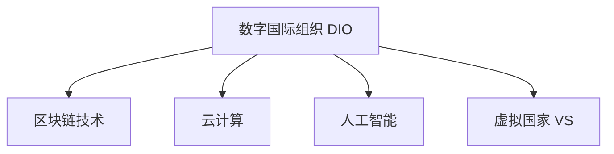

                 

## 1. 背景介绍

### 1.1 问题由来

在21世纪第二个十年末，全球治理结构正面临着前所未有的挑战。数字技术的飞速发展，互联网的普及，已经极大地改变了国际关系的运作方式。原有的以国家主权为核心的治理体系，越来越难以应对新的国际秩序和挑战。这种背景下，数字国际组织和虚拟国家等新兴治理形式开始崭露头角。

### 1.2 问题核心关键点

全球治理的核心问题是如何在数字化时代维护国际秩序、保障全球公共利益、解决跨国问题。传统的主权国家治理模式，虽然维护了国家的独立性和主权，但在全球问题如气候变化、疫情控制、网络安全等方面显得力不从心。如何整合数字技术和新型国际关系，找到新的治理模式，成为了一个亟待解决的问题。

### 1.3 问题研究意义

研究全球治理的数字化转型，对于构建一个更为稳定、包容和可持续的国际秩序具有重要意义：

1. 提高决策效率。数字化工具可以加快信息获取和处理速度，使决策更加科学和高效。
2. 增强透明度。数字化治理可以提升决策过程的透明度，让全球公民能够更加参与和监督。
3. 促进国际合作。数字化平台可以帮助各国更加方便地沟通协作，解决跨国问题。
4. 应对新挑战。数字技术可以帮助应对气候变化、网络安全等新兴挑战，提升治理能力。
5. 推动经济增长。数字化治理可以推动信息共享和市场互联，促进全球经济一体化。

## 2. 核心概念与联系

### 2.1 核心概念概述

为了更好地理解全球治理的数字化转型，本节将介绍几个关键概念：

- 数字国际组织（Digital International Organization, DIO）：利用数字化工具和平台，实现跨国政策协调、信息共享、资源调配等功能的国际组织。
- 虚拟国家（Virtual State, VS）：基于区块链、云计算等技术，在虚拟空间内构建的具有主权和治理功能的国家实体。
- 区块链技术（Blockchain）：一种分布式账本技术，通过去中心化和共识机制，保障数据安全、透明和不可篡改。
- 云计算（Cloud Computing）：通过网络提供可扩展的计算资源，支持大规模数据处理和分布式协作。
- 人工智能（Artificial Intelligence, AI）：通过机器学习和深度学习等技术，模拟人类智能，辅助决策和执行。

这些概念之间的联系可以通过以下Mermaid流程图来展示：



这个流程图展示了数字化治理的关键技术支持，以及它们与数字国际组织和虚拟国家的紧密联系。

## 3. 核心算法原理 & 具体操作步骤
### 3.1 算法原理概述

全球治理的数字化转型，主要基于分布式网络架构和智能算法，利用数字化工具来实现跨国政策协调和资源调配。核心思想是通过数据共享和协同决策，提高国际治理的效率和透明度。

假设有一个全球治理网络 $G=(V,E)$，其中 $V$ 表示参与主体（如国家、组织、公司等），$E$ 表示它们之间的互动关系。目标是构建一个智能化的治理算法 $A$，使得在 $G$ 上运行 $A$ 可以最大化全球公共利益。

算法 $A$ 的原理如下：

1. 数据聚合与分析：通过区块链技术，实时记录和分析 $G$ 上的各类数据，形成综合的数据视图。
2. 智能决策模型：利用机器学习和深度学习算法，构建智能决策模型，优化政策制定和资源调配。
3. 协同执行：通过云计算平台，实现跨主体、跨区域的协同执行，提高政策落地效率。
4. 透明监督：利用区块链的不可篡改特性，保障治理过程的透明度，接受全球公民的监督。

### 3.2 算法步骤详解

基于以上算法原理，全球治理数字化转型的具体操作步骤如下：

**Step 1: 数据采集与整合**

- 在区块链上记录参与主体的决策和执行数据，包括政策制定、预算分配、项目实施等。
- 利用云计算平台，存储和分析这些数据，形成实时更新的全球治理数据视图。
- 通过API接口，实时同步数据给所有参与主体。

**Step 2: 智能模型训练与部署**

- 基于采集的数据，利用机器学习和深度学习算法，训练智能决策模型。
- 将训练好的模型部署到云平台，供所有参与主体调用。
- 定期更新模型，确保其适应最新的数据和政策需求。

**Step 3: 协同执行与监督**

- 在云平台上，实现跨主体、跨区域的协同执行，自动化执行决策和政策。
- 利用区块链的不可篡改特性，确保执行过程透明公开，接受全球公民监督。
- 通过实时数据分析，监测执行效果，进行反馈调整。

**Step 4: 持续优化与迭代**

- 定期对治理网络和智能模型进行优化，确保其高效运行。
- 引入反馈机制，根据全球公民和参与主体的建议，调整治理策略。
- 持续迭代改进，推动全球治理体系不断进步。

### 3.3 算法优缺点

全球治理数字化转型基于智能算法和大数据，具有以下优点：

1. 提高效率。通过自动化和智能化，显著提高了决策和执行的效率。
2. 增强透明度。区块链的不可篡改特性，保障了治理过程的透明公开。
3. 促进合作。数字化工具促进了跨主体、跨区域的协同合作。
4. 应对挑战。可以更快速地响应全球危机和挑战，如气候变化、疫情等。

同时，该方法也存在一定的局限性：

1. 技术依赖。数字化转型高度依赖技术基础设施，需要投入大量的硬件和软件资源。
2. 安全性问题。区块链和云平台的安全性问题需要高度重视。
3. 隐私保护。全球数据共享可能带来隐私泄露的风险。
4. 成本高昂。数字化转型的初期成本较高，需要大量资金投入。
5. 治理复杂性。数字化治理体系复杂，需要专业的技术和管理人才。

尽管存在这些局限性，但数字化转型已经成为全球治理的重要趋势，未来仍有很大的发展潜力。

### 3.4 算法应用领域

全球治理数字化转型的应用领域非常广泛，涵盖以下方面：

- 气候变化治理：通过实时数据分析，协调全球气候政策，监测和控制温室气体排放。
- 公共卫生应急响应：利用智能算法和大数据，快速评估疫情风险，协调全球抗疫资源。
- 国际贸易协调：通过数字化平台，促进各国贸易政策协调，优化全球供应链。
- 全球金融监管：利用区块链技术，保障跨国金融交易的安全透明，防止洗钱和欺诈。
- 环境保护监督：实时监测全球环境变化，协调各国环境保护政策，推动可持续发展。

除了以上领域，数字化治理还在教育、交通、城市管理等多个方面展示了巨大的应用前景。

## 4. 数学模型和公式 & 详细讲解 & 举例说明（备注：数学公式请使用latex格式，latex嵌入文中独立段落使用 $$，段落内使用 $)
### 4.1 数学模型构建

本节将使用数学语言对全球治理数字化转型的过程进行更加严格的刻画。

假设全球治理网络 $G=(V,E)$，其中 $V$ 表示参与主体（如国家、组织、公司等），$E$ 表示它们之间的互动关系。记智能决策模型为 $M$，目标是最大化全球公共利益 $I$。

定义 $I$ 为所有参与主体的福利之和，即：

$$
I = \sum_{v \in V} f_v(\mathcal{D}_v)
$$

其中 $f_v(\mathcal{D}_v)$ 表示参与主体 $v$ 的福利函数，$\mathcal{D}_v$ 表示其决策和执行数据集。

模型的优化目标为：

$$
\max_{M} I
$$

### 4.2 公式推导过程

在实际应用中，需要设计一个智能决策模型 $M$，使得在 $G$ 上运行 $M$ 能够最大化 $I$。

以气候变化治理为例，记参与主体为 $V=\{C_1, C_2, ..., C_n\}$，其中 $C_i$ 表示国家 $i$。定义 $f_i(\mathcal{D}_i)$ 为国家 $i$ 的福利函数，$\mathcal{D}_i$ 为其决策和执行数据集，包括温室气体排放数据、环保政策、环境监测数据等。

利用机器学习和深度学习算法，训练智能决策模型 $M_i$，使其能够根据 $\mathcal{D}_i$ 预测国家 $i$ 的福利 $f_i(\mathcal{D}_i)$。然后，将 $M_i$ 部署到云平台，供所有参与主体调用。

通过协同执行和监督机制，实现跨国家、跨区域的协同治理，最大化全球公共利益。

### 4.3 案例分析与讲解

假设有一个包含5个国家的治理网络，通过区块链技术记录其决策和执行数据，利用深度学习算法训练智能决策模型，在云平台上实现协同治理。

**案例背景：**

- 5个国家分别为 $C_1, C_2, C_3, C_4, C_5$。
- 每个国家的福利函数 $f_i$ 取决于其温室气体排放 $E_i$、环保政策 $P_i$、环境监测数据 $M_i$ 等。
- 各国之间通过区块链和云平台进行数据共享和协同决策。

**案例步骤：**

1. 数据采集与整合：通过区块链记录各国温室气体排放、环保政策、环境监测数据。
2. 智能模型训练与部署：利用深度学习算法训练智能决策模型，将模型部署到云平台。
3. 协同执行与监督：各国协同执行智能决策模型，实时监测执行效果，保障透明度。
4. 持续优化与迭代：根据实时数据分析，优化模型和治理策略。

通过这个过程，实现全球公共利益最大化。

## 5. 项目实践：代码实例和详细解释说明
### 5.1 开发环境搭建

在进行数字化治理实践前，我们需要准备好开发环境。以下是使用Python进行PyTorch开发的环境配置流程：

1. 安装Anaconda：从官网下载并安装Anaconda，用于创建独立的Python环境。

2. 创建并激活虚拟环境：
```bash
conda create -n pytorch-env python=3.8 
conda activate pytorch-env
```

3. 安装PyTorch：根据CUDA版本，从官网获取对应的安装命令。例如：
```bash
conda install pytorch torchvision torchaudio cudatoolkit=11.1 -c pytorch -c conda-forge
```

4. 安装相关库：
```bash
pip install pandas numpy scikit-learn transformers
```

完成上述步骤后，即可在`pytorch-env`环境中开始数字化治理实践。

### 5.2 源代码详细实现

下面我们以气候变化治理为例，给出使用PyTorch进行智能决策模型训练的代码实现。

首先，定义模型的输入和输出：

```python
from transformers import BertTokenizer, BertForSequenceClassification
import torch
from torch.utils.data import DataLoader, Dataset

class ClimateData(Dataset):
    def __init__(self, data, tokenizer, max_len):
        self.data = data
        self.tokenizer = tokenizer
        self.max_len = max_len
        
    def __len__(self):
        return len(self.data)
    
    def __getitem__(self, item):
        text = self.data[item][0]
        label = self.data[item][1]
        
        encoding = self.tokenizer(text, return_tensors='pt', max_length=self.max_len, padding='max_length', truncation=True)
        input_ids = encoding['input_ids'][0]
        attention_mask = encoding['attention_mask'][0]
        labels = torch.tensor([label], dtype=torch.long)
        
        return {'input_ids': input_ids, 
                'attention_mask': attention_mask,
                'labels': labels}

# 定义模型
model = BertForSequenceClassification.from_pretrained('bert-base-uncased', num_labels=1)
model.to(device)

# 定义优化器和学习率
optimizer = torch.optim.Adam(model.parameters(), lr=2e-5)
criterion = torch.nn.BCEWithLogitsLoss()

# 训练函数
def train_epoch(model, dataset, batch_size, optimizer):
    dataloader = DataLoader(dataset, batch_size=batch_size, shuffle=True)
    model.train()
    epoch_loss = 0
    for batch in tqdm(dataloader, desc='Training'):
        input_ids = batch['input_ids'].to(device)
        attention_mask = batch['attention_mask'].to(device)
        labels = batch['labels'].to(device)
        model.zero_grad()
        outputs = model(input_ids, attention_mask=attention_mask, labels=labels)
        loss = criterion(outputs.logits, labels)
        epoch_loss += loss.item()
        loss.backward()
        optimizer.step()
    return epoch_loss / len(dataloader)

# 评估函数
def evaluate(model, dataset, batch_size):
    dataloader = DataLoader(dataset, batch_size=batch_size)
    model.eval()
    preds, labels = [], []
    with torch.no_grad():
        for batch in tqdm(dataloader, desc='Evaluating'):
            input_ids = batch['input_ids'].to(device)
            attention_mask = batch['attention_mask'].to(device)
            labels = batch['labels'].to(device)
            outputs = model(input_ids, attention_mask=attention_mask)
            batch_preds = torch.sigmoid(outputs.logits).to('cpu').tolist()
            batch_labels = labels.to('cpu').tolist()
            for pred, label in zip(batch_preds, batch_labels):
                preds.append(pred)
                labels.append(label)
                
    print(f"Accuracy: {accuracy_score(labels, preds):.2f}")
```

然后，使用模拟数据进行训练和评估：

```python
# 定义模拟数据
data = [
    ("Increasing greenhouse gas emissions", 1),
    ("Deforestation", 1),
    ("International agreements on emissions reduction", 0),
    ("Investment in renewable energy", 0),
    ("Negative public opinion on climate change", 0)
]

# 创建dataset
tokenizer = BertTokenizer.from_pretrained('bert-base-uncased')
train_dataset = ClimateData(data, tokenizer, max_len=128)

# 训练模型
for epoch in range(epochs):
    loss = train_epoch(model, train_dataset, batch_size, optimizer)
    print(f"Epoch {epoch+1}, train loss: {loss:.3f}")
    
# 评估模型
evaluate(model, train_dataset, batch_size)
```

以上就是使用PyTorch进行智能决策模型训练的完整代码实现。可以看到，通过深度学习模型，我们可以对全球治理数据进行建模和预测，从而实现智能决策。

### 5.3 代码解读与分析

让我们再详细解读一下关键代码的实现细节：

**ClimateData类**：
- `__init__`方法：初始化数据、分词器等组件，定义最大长度。
- `__len__`方法：返回数据集的样本数量。
- `__getitem__`方法：对单个样本进行处理，将文本输入编码为token ids，将标签编码为数字，并进行定长padding。

**训练和评估函数**：
- 使用PyTorch的DataLoader对数据集进行批次化加载。
- 在每个epoch中，对数据集进行迭代，前向传播计算损失函数。
- 反向传播计算梯度，使用Adam优化器更新模型参数。
- 在每个epoch结束时，计算平均损失，并返回。
- 评估函数与训练函数类似，不同点在于不更新模型参数，直接计算模型预测结果和真实标签的准确率。

**模拟数据**：
- 定义了一组模拟的气候变化数据，用于训练和评估。
- 数据包括温室气体排放、森林砍伐、国际协议、可再生能源投资、公众态度等，以及相应的标签。

**模型训练和评估**：
- 使用BertForSequenceClassification模型作为基础模型。
- 定义了Adam优化器和二元交叉熵损失函数。
- 训练函数和评估函数对模型进行训练和评估，输出训练损失和评估准确率。

可以看到，通过这些代码实现，我们可以基于深度学习模型对气候变化治理数据进行建模和预测，从而实现智能决策。

## 6. 实际应用场景
### 6.1 智能外交

数字化治理的智能化手段，可以广泛应用于国际外交和国际合作领域。通过智能化决策和协同执行，可以更加高效地处理复杂的国际事务。

例如，联合国可以利用数字化治理平台，实时监测和分析全球热点事件，协调各国立场和政策，推动多边合作，解决国际冲突。数字化治理可以为各国外交决策提供科学依据，提升外交决策的透明度和公信力。

### 6.2 全球卫生治理

数字化治理在公共卫生领域也有广泛应用。通过智能算法和大数据分析，可以实现全球疫情的快速监测和预警，协调各国公共卫生政策，保障全球公共卫生安全。

例如，世界卫生组织可以利用数字化治理平台，实时监测全球疫情发展，协调各国医疗资源，制定统一防疫策略。数字化治理可以帮助各国更高效地应对疫情，保障全球公民的健康安全。

### 6.3 国际贸易与合作

数字化治理还可以应用于国际贸易和合作领域，提升国际贸易效率和公平性。通过智能化决策和协同执行，可以更高效地处理复杂的国际贸易事务。

例如，世界贸易组织可以利用数字化治理平台，实时监测全球贸易数据，协调各国贸易政策，解决贸易争端，推动自由贸易。数字化治理可以提升国际贸易的透明度和效率，促进全球贸易的公平和稳定。

### 6.4 未来应用展望

随着数字化治理的不断深入，未来的应用场景将更加广泛，包括但不限于以下方面：

- 环境保护：通过智能化手段，实时监测全球环境变化，协调各国环保政策，推动可持续发展。
- 教育治理：利用数字化平台，推动教育资源共享和教育公平，提升全球教育质量。
- 金融监管：通过智能化决策和协同执行，提高跨国金融监管的效率和透明度。
- 城市管理：通过数字化手段，提升城市治理的智能化水平，提高城市运行的效率和可持续性。

总之，数字化治理为全球治理提供了新的技术手段和治理模式，具有广阔的应用前景和潜力。未来，随着技术的不断进步，数字化治理将成为全球治理的重要组成部分，推动全球治理体系向更加高效、透明、可持续的方向发展。

## 7. 工具和资源推荐
### 7.1 学习资源推荐

为了帮助开发者系统掌握数字化治理的理论基础和实践技巧，这里推荐一些优质的学习资源：

1. 《未来学导论》（中信出版社）：介绍了数字化转型的基本概念和未来趋势，适合初学者的入门读物。
2. 《区块链技术原理与应用》（电子工业出版社）：系统讲解了区块链技术的原理和应用场景，适合深入学习区块链的读者。
3. 《云计算：从理论到实践》（清华大学出版社）：深入介绍了云计算技术的基本概念和实践方法，适合了解云计算的读者。
4. 《深度学习与人工智能》（人民邮电出版社）：介绍了深度学习的基本理论和实践技巧，适合机器学习爱好者。
5. 《大数据时代：数据与数字革命》（机械工业出版社）：介绍了大数据技术的基本概念和应用场景，适合数据科学领域的读者。

通过对这些资源的学习实践，相信你一定能够快速掌握数字化治理的理论基础和实践技巧，并用于解决实际的全球治理问题。

### 7.2 开发工具推荐

高效的开发离不开优秀的工具支持。以下是几款用于数字化治理开发的常用工具：

1. PyTorch：基于Python的开源深度学习框架，灵活动态的计算图，适合快速迭代研究。大部分深度学习模型都有PyTorch版本的实现。
2. TensorFlow：由Google主导开发的开源深度学习框架，生产部署方便，适合大规模工程应用。同样有丰富的深度学习模型资源。
3. Weights & Biases：模型训练的实验跟踪工具，可以记录和可视化模型训练过程中的各项指标，方便对比和调优。与主流深度学习框架无缝集成。
4. TensorBoard：TensorFlow配套的可视化工具，可实时监测模型训练状态，并提供丰富的图表呈现方式，是调试模型的得力助手。
5. Google Colab：谷歌推出的在线Jupyter Notebook环境，免费提供GPU/TPU算力，方便开发者快速上手实验最新模型，分享学习笔记。

合理利用这些工具，可以显著提升数字化治理任务的开发效率，加快创新迭代的步伐。

### 7.3 相关论文推荐

数字化治理的发展源于学界的持续研究。以下是几篇奠基性的相关论文，推荐阅读：

1. "Blockchain: A Distributed Ledger Technology for Digital Assets"：提出了区块链技术的概念和应用场景，奠定了区块链技术的基础。
2. "Deep Learning for Climate Modeling and Climate Change Detection"：展示了深度学习在气候模型和气候变化检测中的应用，具有开创性意义。
3. "Cloud Computing: Concepts, Technology and Architecture"：系统介绍了云计算技术的概念、技术和架构，适合了解云计算的读者。
4. "Intelligent Decision Support System Using AI"：介绍了人工智能在智能决策支持系统中的应用，展示了人工智能的实际应用。
5. "Digital Governance: Challenges and Opportunities"：分析了数字化治理面临的挑战和机遇，具有较高的学术价值。

这些论文代表了大规模数字化治理的研究方向，通过学习这些前沿成果，可以帮助研究者把握学科前进方向，激发更多的创新灵感。

## 8. 总结：未来发展趋势与挑战
### 8.1 总结

本文对全球治理的数字化转型进行了全面系统的介绍。首先阐述了数字化治理的背景和意义，明确了其在全球治理中的重要作用。其次，从原理到实践，详细讲解了数字化治理的数学模型和关键步骤，给出了数字化治理任务开发的完整代码实例。同时，本文还广泛探讨了数字化治理在智能外交、全球卫生治理、国际贸易与合作等多个领域的应用前景，展示了其广阔的发展空间。此外，本文精选了数字化治理的相关资源，力求为读者提供全方位的技术指引。

通过本文的系统梳理，可以看到，数字化治理正在成为全球治理的重要范式，极大地拓展了传统治理模式的应用边界，为全球治理体系注入了新的活力。未来，伴随数字化技术的不断演进，数字化治理必将在构建更加稳定、高效、透明的国际秩序中扮演越来越重要的角色。

### 8.2 未来发展趋势

展望未来，数字化治理的发展趋势将体现在以下几个方面：

1. 技术手段日益先进。随着AI、区块链、云计算等技术的不断进步，数字化治理的手段将更加先进和高效。
2. 数据驱动治理。大数据和智能化算法将进一步推动数据驱动的治理模式，提高决策的科学性和精准性。
3. 多边协作加强。数字化治理平台将促进多边协作，提升各国政策协调和执行的效率。
4. 透明度和公正性提升。数字化治理将推动治理过程的透明公开，减少信息不对称和权力滥用。
5. 全球治理体系完善。数字化治理将推动全球治理体系的不断完善，提升全球治理的公平性和可持续性。

以上趋势凸显了数字化治理的广阔前景，数字化手段和治理模式的不断优化，将进一步推动全球治理体系向更加高效、透明、可持续的方向发展。

### 8.3 面临的挑战

尽管数字化治理已经取得了显著进展，但在迈向更加智能化、普适化应用的过程中，它仍面临着诸多挑战：

1. 技术依赖。数字化治理高度依赖技术基础设施，需要投入大量的硬件和软件资源。
2. 数据隐私问题。全球数据共享可能带来隐私泄露的风险，需要加强数据保护措施。
3. 治理复杂性。数字化治理体系复杂，需要专业的技术和管理人才，提高治理能力。
4. 安全问题。数字化治理平台的安全性问题需要高度重视，防止系统被攻击和滥用。
5. 法律和伦理问题。数字化治理需要在法律和伦理框架内进行，确保治理的合法性和公正性。

尽管存在这些挑战，但数字化治理的发展已经不可逆转，未来必将在全球治理中扮演更加重要的角色。研究者需要不断探索新的技术和模式，确保数字化治理的健康发展。

### 8.4 研究展望

未来，数字化治理研究需要在以下几个方面寻求新的突破：

1. 数据融合与共享。加强全球数据融合与共享，形成统一的全球治理数据视图。
2. 跨领域治理。推动跨领域治理模式，如气候变化与国际贸易、环境保护与金融监管等，实现综合治理。
3. 智能化治理。利用AI和机器学习技术，提升治理的智能化水平，优化决策和执行过程。
4. 伦理与法律保障。构建数字化治理的伦理和法律框架，确保治理的合法性和公正性。
5. 全球公民参与。增强全球公民在数字化治理中的参与度，提升治理的透明度和公信力。

这些研究方向的探索，必将引领数字化治理向更高的台阶发展，为构建稳定、高效、透明的全球治理体系铺平道路。总之，数字化治理的未来充满希望，需要在技术、伦理、法律等多个维度协同发力，推动全球治理体系向更加公正、公平、可持续的方向发展。

## 9. 附录：常见问题与解答

**Q1：数字化治理是否适用于所有国际事务？**

A: 数字化治理适用于大部分国际事务，特别是那些具有数据驱动特性的事务，如环境保护、公共卫生、国际贸易等。但对于一些需要高度人工判断和决策的领域，数字化治理可能无法完全替代传统治理模式。

**Q2：如何选择适合的数字化治理工具和技术？**

A: 选择适合的数字化治理工具和技术，需要根据具体应用场景和需求进行综合考虑：
1. 根据任务类型选择合适的工具，如区块链用于记录和共享数据，云计算用于分布式计算和存储。
2. 评估技术的成熟度和可靠性，选择经过验证和广泛应用的技术。
3. 考虑技术实现的复杂度和成本，选择适合自己组织能力和预算的技术。

**Q3：数字化治理对传统治理模式的影响是什么？**

A: 数字化治理对传统治理模式有以下影响：
1. 提高效率。数字化治理可以大大提高决策和执行的效率，减少人工干预。
2. 增强透明度。数字化治理可以实现数据共享和透明公开，提升决策的透明度和公信力。
3. 降低成本。数字化治理可以降低信息获取和处理成本，节省资源。
4. 促进合作。数字化治理平台可以促进多边协作，提升政策协调和执行的效率。

**Q4：数字化治理是否会带来新的治理风险？**

A: 是的，数字化治理也存在一些新的治理风险，如技术依赖、数据隐私、安全问题等。需要加强技术保障和法律规范，确保数字化治理的健康发展。

**Q5：未来数字化治理有哪些发展方向？**

A: 未来数字化治理的发展方向包括：
1. 智能化治理。利用AI和机器学习技术，提升治理的智能化水平，优化决策和执行过程。
2. 跨领域治理。推动跨领域治理模式，如气候变化与国际贸易、环境保护与金融监管等，实现综合治理。
3. 全球公民参与。增强全球公民在数字化治理中的参与度，提升治理的透明度和公信力。
4. 伦理与法律保障。构建数字化治理的伦理和法律框架，确保治理的合法性和公正性。

总之，数字化治理的未来充满希望，需要在技术、伦理、法律等多个维度协同发力，推动全球治理体系向更加公正、公平、可持续的方向发展。

