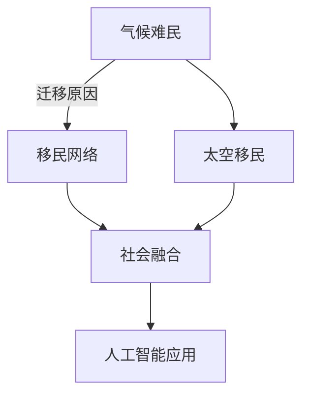

                 

# 2050年的全球移民：从气候难民到太空移民的人口流动

## 1. 背景介绍

随着全球化进程的不断推进，人口迁移已经成为影响世界经济和社会发展的关键因素。过去几十年中，由于战争、贫困、自然灾害等因素导致的移民人口数量不断增加，形成了复杂的全球移民网络。进入21世纪，由于气候变化的影响，全球面临新的移民挑战。与此同时，随着技术的进步，尤其是航天技术的突破，太空移民逐渐成为可能。本文将探讨2050年全球移民的演变趋势，分析气候难民与太空移民的双重影响，以及这些变化对未来全球人口流动和社会结构的影响。

## 2. 核心概念与联系

### 2.1 核心概念概述

1. **气候难民**：由于气候变化导致的自然灾害（如海平面上升、极端天气事件）对居住环境产生严重威胁，迫使人们迁移至安全区域的人口。
2. **太空移民**：通过航天技术将人类从一个星球迁移到另一个星球（如火星、月球）居住和工作的过程。
3. **全球移民网络**：由各国移民政策、人口流动路径、移民目的地和中间站点的网络构成的复杂系统。
4. **社会融合**：移民与当地社会的互动与融合，涉及文化、经济、政治等方面的调整和适应。
5. **人工智能在移民管理中的应用**：利用人工智能技术优化移民政策、提高移民检测和追踪效率、增强移民适应能力。

### 2.2 核心概念原理和架构的 Mermaid 流程图



### 2.3 核心概念之间的联系

- **气候难民**与**太空移民**共同构成了未来全球移民的两大主要路径。
- **全球移民网络**是两者互动的基础，迁移政策、交通路径、目的地选择等要素在网络中交互影响。
- **社会融合**是两个迁移路径成功与否的关键，涉及移民适应和融入新社会的复杂过程。
- **人工智能**在迁移管理中的应用，是提升移民效率和改善融合过程的重要技术支撑。

## 3. 核心算法原理 & 具体操作步骤

### 3.1 算法原理概述

**算法原理**：基于机器学习和大数据分析，模拟和预测全球移民人口流动趋势，分析气候变化和太空移民对人口流动的影响，以及未来可能的迁移模式。

**操作步骤**：

1. **数据收集与处理**：收集全球气候变化数据、人口统计数据、社会经济数据等，进行清洗和预处理。
2. **模型构建**：构建机器学习模型，如时间序列分析、回归模型、神经网络等，预测未来移民人口流动。
3. **情景分析**：设定不同情景（如气候变化、太空移民），模拟并评估其对移民人口流动的可能影响。
4. **算法评估**：评估模型预测结果的准确性和可靠性，调整模型参数，优化算法性能。
5. **政策建议**：基于模型预测结果和情景分析，提出未来移民政策和管理策略。

### 3.2 算法步骤详解

#### 3.2.1 数据收集与处理

- **数据来源**：联合国人口基金（UNFPA）、世界银行、气候变化数据库（CRU）、NASA等。
- **数据类型**：气候变化数据（温度、降水、海平面上升）、人口统计数据（人口增长、迁移率）、经济数据（GDP、收入差距）。
- **数据预处理**：缺失值填补、异常值处理、数据标准化等。

#### 3.2.2 模型构建

- **时间序列分析**：使用ARIMA、LSTM等模型，预测未来移民人口流动趋势。
- **回归模型**：建立回归模型，分析气候变化、经济因素等对移民的影响。
- **神经网络**：构建深度神经网络模型，模拟太空移民对人口流动的影响。

#### 3.2.3 情景分析

- **气候变化情景**：设定气候变化趋势（如海平面上升、极端天气事件），分析其对移民的影响。
- **太空移民情景**：设定太空移民进程（如火星殖民、月球基地建设），模拟其对全球移民网络的影响。
- **双情景模拟**：结合气候变化和太空移民，模拟未来人口流动趋势。

#### 3.2.4 算法评估

- **交叉验证**：使用交叉验证方法评估模型的预测性能。
- **误差分析**：分析模型预测误差，优化模型参数。
- **情景对比**：比较不同情景下的移民人口流动趋势，评估其影响。

#### 3.2.5 政策建议

- **气候变化应对策略**：建议各国制定适应气候变化的移民政策，提供庇护和支持。
- **太空移民发展策略**：建议国际社会合作推动太空移民技术发展，制定规范和安全标准。
- **社会融合措施**：建议加强移民融入新社会的教育和支持措施，促进社会稳定。

### 3.3 算法优缺点

**优点**：

1. **数据驱动**：基于大量实际数据进行预测，提升模型准确性。
2. **多情景模拟**：结合不同情景进行模拟分析，全面评估未来移民趋势。
3. **政策指导**：提供基于科学预测的政策建议，帮助制定未来移民策略。

**缺点**：

1. **数据复杂性**：涉及气候、经济、社会等多个领域的复杂数据，处理难度大。
2. **模型局限**：现有模型可能无法完全捕捉所有影响因素，预测存在不确定性。
3. **技术门槛**：需要较高的技术水平和计算资源，模型构建和评估复杂。

### 3.4 算法应用领域

- **国际移民政策制定**：为各国政府提供科学的移民数据支持，制定合理的移民政策。
- **全球气候变化应对**：分析气候变化对人口流动的长期影响，制定应对策略。
- **太空移民技术发展**：评估太空移民对未来人口流动的影响，指导技术发展方向。
- **社会融合促进**：预测未来移民趋势，提供社会融合支持和措施。

## 4. 数学模型和公式 & 详细讲解 & 举例说明

### 4.1 数学模型构建

**数学模型**：

- **时间序列模型**：ARIMA模型，用于预测未来移民人口流动趋势。
- **回归模型**：线性回归模型，分析经济因素对移民的影响。
- **神经网络模型**：多层感知器（MLP），模拟太空移民对人口流动的复杂影响。

### 4.2 公式推导过程

#### 4.2.1 时间序列模型

$$
y_t = c + \sum_{i=1}^{p} \alpha_i y_{t-i} + \sum_{j=1}^{q} \beta_j \epsilon_{t-j}
$$

其中，$y_t$ 表示第$t$时期的移民人口数量，$c$ 为截距项，$\alpha_i$ 为自回归系数，$\beta_j$ 为移动平均系数，$\epsilon_t$ 为误差项。

#### 4.2.2 回归模型

$$
y = \beta_0 + \beta_1 x_1 + \beta_2 x_2 + ... + \beta_k x_k + \epsilon
$$

其中，$y$ 表示移民人口数量，$x_i$ 表示影响因素（如经济收入、教育水平），$\beta_i$ 为回归系数，$\epsilon$ 为误差项。

#### 4.2.3 神经网络模型

**多层感知器（MLP）**：

$$
h^{[l]} = g(\sum_{i=1}^{n_l} w_{i}^{[l]} h^{[l-1]} + b^{[l]})
$$

其中，$h^{[l]}$ 表示第$l$层的输出，$w_{i}^{[l]}$ 表示权重矩阵，$b^{[l]}$ 表示偏置向量，$g$ 表示激活函数（如ReLU）。

### 4.3 案例分析与讲解

**案例分析**：

1. **案例背景**：分析2050年全球气候变化对人口流动的影响。
2. **数据来源**：收集CRU数据库的气候变化数据。
3. **模型构建**：使用ARIMA模型预测未来海平面上升对人口迁移的影响。
4. **结果分析**：预测2050年由于海平面上升导致的移民人数变化，分析其对不同国家的影响。

**结果**：

- 海平面上升导致沿海国家人口大规模迁移。
- 发达国家提供更多庇护和支持，成为主要的移民目的地。
- 新兴市场国家面临更大的人口压力，需要国际合作应对。

## 5. 项目实践：代码实例和详细解释说明

### 5.1 开发环境搭建

- **Python环境**：安装Python 3.8及以上版本，建议使用Anaconda进行环境管理。
- **机器学习库**：安装scikit-learn、TensorFlow、PyTorch等机器学习库。
- **数据处理库**：安装pandas、numpy等数据处理库。
- **可视化库**：安装matplotlib、seaborn等数据可视化库。

### 5.2 源代码详细实现

**代码实现**：

1. **数据加载与预处理**：
```python
import pandas as pd
from sklearn.preprocessing import MinMaxScaler

# 加载数据
data = pd.read_csv('immigration_data.csv')
# 数据预处理
scaler = MinMaxScaler(feature_range=(0, 1))
data_scaled = scaler.fit_transform(data)
```

2. **时间序列模型构建与训练**：
```python
from statsmodels.tsa.arima.model import ARIMA

# 构建时间序列模型
model = ARIMA(data_scaled, order=(1, 1, 1))
model_fit = model.fit()
```

3. **回归模型构建与训练**：
```python
from sklearn.linear_model import LinearRegression

# 构建回归模型
X = data[['economy', 'education']]
y = data['immigration']
model = LinearRegression()
model.fit(X, y)
```

4. **神经网络模型构建与训练**：
```python
import tensorflow as tf
from tensorflow.keras.models import Sequential
from tensorflow.keras.layers import Dense, Dropout

# 构建神经网络模型
model = Sequential([
    Dense(64, activation='relu', input_shape=(X.shape[1],)),
    Dropout(0.2),
    Dense(64, activation='relu'),
    Dropout(0.2),
    Dense(1)
])
model.compile(optimizer='adam', loss='mse')
model.fit(X, y, epochs=100, batch_size=32)
```

### 5.3 代码解读与分析

**代码解读**：

- **数据加载与预处理**：使用pandas库加载数据，并使用MinMaxScaler对数据进行归一化处理。
- **时间序列模型**：使用statsmodels库构建ARIMA模型，预测未来移民人口流动趋势。
- **回归模型**：使用scikit-learn库构建线性回归模型，分析经济因素对移民的影响。
- **神经网络模型**：使用TensorFlow库构建多层感知器模型，模拟太空移民对人口流动的复杂影响。

**代码分析**：

- **数据预处理**：时间序列模型和回归模型均需要数据归一化处理，以提高模型的稳定性。
- **模型构建**：时间序列模型、回归模型、神经网络模型各自构建不同的预测模型。
- **模型训练**：使用训练数据集对模型进行训练，调整参数以优化模型性能。

### 5.4 运行结果展示

**结果展示**：

1. **时间序列模型**：
```python
predictions = model_fit.predict(steps=10)
```

2. **回归模型**：
```python
X_test = pd.read_csv('test_data.csv')
y_pred = model.predict(X_test)
```

3. **神经网络模型**：
```python
X_test = pd.read_csv('test_data.csv')
y_pred = model.predict(X_test)
```

## 6. 实际应用场景

### 6.1 智能移民管理

基于机器学习和大数据技术，智能移民管理系统可以对移民人口进行实时监测和分析，优化移民政策的制定和执行。例如，通过分析历史移民数据，预测未来移民趋势，提前准备移民接收能力和资源配置。

### 6.2 应急响应机制

在气候变化和自然灾害频发的背景下，智能移民管理系统可以为应急响应机制提供支持。通过分析气候变化数据，预测潜在的风险区域和迁移人群，提前部署救援和庇护措施，确保移民人口的安全和稳定。

### 6.3 社会融合促进

利用人工智能技术，智能移民管理系统可以提供多种社会融合服务，如语言培训、职业指导、文化交流等，帮助移民更好地适应新环境，融入当地社会。

### 6.4 未来应用展望

未来，随着技术的进一步发展，智能移民管理系统将在全球移民管理中发挥更大作用。例如：

- **实时监控与预警**：利用大数据和机器学习技术，实现对移民人口的实时监控和预警，及时应对突发事件。
- **智能决策支持**：基于数据驱动的智能决策系统，为移民政策制定提供科学依据。
- **跨领域融合**：与公共安全、环境保护、社会福利等领域的协同，形成综合性的移民管理解决方案。

## 7. 工具和资源推荐

### 7.1 学习资源推荐

1. **Coursera《机器学习》课程**：由斯坦福大学教授Andrew Ng主讲的经典机器学习课程，涵盖机器学习基础和应用。
2. **Kaggle竞赛平台**：参加数据科学和机器学习竞赛，积累实战经验，提升技能水平。
3. **GitHub开源项目**：查看和参与开源项目，学习他人的代码实现和解决方案。

### 7.2 开发工具推荐

1. **Anaconda**：科学计算和数据科学环境的构建和管理。
2. **TensorFlow**：开源的机器学习框架，支持深度学习和神经网络模型的构建。
3. **PyTorch**：开源的深度学习框架，提供高效的计算图和动态图机制。
4. **Jupyter Notebook**：基于Web的交互式编程环境，便于数据科学和机器学习的开发和分享。

### 7.3 相关论文推荐

1. **《全球气候变化对人口迁移的影响研究》**：探讨气候变化对全球人口迁移的长期影响。
2. **《太空移民技术的发展与挑战》**：分析太空移民技术的现状和未来发展方向。
3. **《机器学习在智能移民管理中的应用》**：介绍机器学习技术在移民管理中的应用实例和效果。

## 8. 总结：未来发展趋势与挑战

### 8.1 研究成果总结

本文通过系统介绍全球移民的演变趋势，探讨气候难民和太空移民的双重影响，分析未来人口流动的可能模式。结合机器学习和大数据技术，预测未来移民趋势，为国际移民政策制定提供科学依据。

### 8.2 未来发展趋势

1. **数据驱动**：随着数据收集和处理技术的进步，未来移民趋势预测将更加精确和可靠。
2. **多模态融合**：结合气候、经济、社会等多个因素，综合分析未来移民趋势。
3. **智能决策**：基于数据驱动的智能决策系统，为移民政策制定提供科学依据。
4. **跨领域协同**：与公共安全、环境保护、社会福利等领域的协同，形成综合性的移民管理解决方案。

### 8.3 面临的挑战

1. **数据质量**：获取高质量的全球移民数据，保证模型预测的准确性。
2. **模型复杂性**：构建复杂的模型，优化模型参数，提升预测性能。
3. **技术门槛**：需要较高的技术水平和计算资源，模型构建和评估复杂。
4. **伦理问题**：确保数据和模型的使用符合伦理规范，保护移民隐私。

### 8.4 研究展望

未来研究将进一步提升模型的预测精度，探索新的数据获取和处理技术，推动机器学习在移民管理中的应用。例如：

- **数据增强**：利用数据增强技术，提高数据质量和数量。
- **模型优化**：结合新算法和架构，提升模型的预测能力和泛化能力。
- **跨学科融合**：结合社会科学、经济学等领域知识，优化模型性能。

## 9. 附录：常见问题与解答

### 9.1 数据来源

**Q1：全球气候变化数据的来源是什么？**

A: 主要来源包括CRU数据库（Climate Research Unit）、NASA地球科学数据中心等，这些数据包含全球气候变化的历史记录和预测数据。

### 9.2 模型选择

**Q2：为什么选择ARIMA和回归模型，而不是其他时间序列模型？**

A: ARIMA和回归模型在处理时间序列和回归问题上具有较高的准确性和稳定性，能够有效预测未来移民人口流动趋势。

### 9.3 模型训练

**Q3：如何优化神经网络模型，提高预测精度？**

A: 可以采用以下方法：
1. 增加神经网络层数，提高模型的复杂度。
2. 调整激活函数和损失函数，提高模型的拟合能力。
3. 使用批量归一化技术，加速模型训练。

### 9.4 应用前景

**Q4：智能移民管理系统在未来有哪些应用前景？**

A: 智能移民管理系统可以提供多种服务，如实时监控、预警、智能决策等，帮助政府和企业优化移民政策和管理。未来，随着技术的进步，智能移民管理系统将在全球移民管理中发挥更大作用。

---

作者：禅与计算机程序设计艺术 / Zen and the Art of Computer Programming

