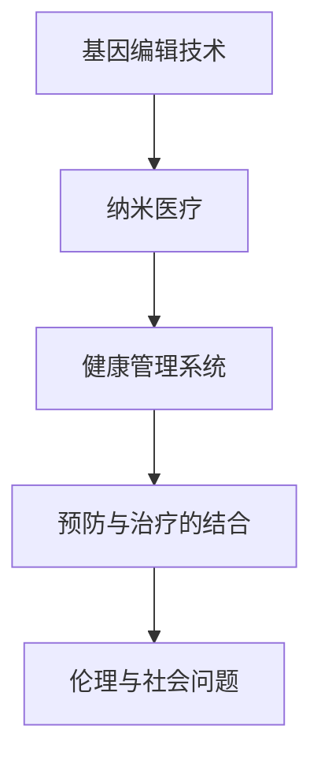

                 

## 1. 背景介绍

### 1.1 问题的提出

在即将到来的2050年，医疗健康领域将迎来一场颠覆性的变革。这场革命将从基因编辑技术到纳米医疗的全面应用，为人类提供前所未有的健康管理手段。本文将深入探讨这一革命的背后原理和实际应用场景，并展望其未来发展趋势。

### 1.2 问题的核心关键点

医疗健康革命的核心关键点包括以下几个方面：

1. **基因编辑技术的发展**：CRISPR-Cas9等基因编辑技术的突破，使得精确修改人类基因成为可能。
2. **纳米医疗的兴起**：纳米级药物和医疗设备的应用，能够实现对疾病的精准治疗。
3. **健康管理系统的智能化**：通过大数据和人工智能技术，实现个性化的健康管理。
4. **预防与治疗的结合**：从注重治疗向预防转变，减少疾病发生率。
5. **伦理与社会问题**：基因编辑和纳米医疗技术的普及可能带来的伦理和社会问题。

### 1.3 问题研究意义

了解和掌握这些关键点对于预测和应对未来医疗健康领域的变革具有重要意义。这不仅能够帮助我们更好地理解未来可能面临的挑战和机遇，还能推动相关技术和政策的制定，促进医疗健康事业的可持续发展。

## 2. 核心概念与联系

### 2.1 核心概念概述

为更好地理解医疗健康革命的核心概念，本节将介绍几个关键技术及其相互联系：

1. **基因编辑技术**：通过精确修改基因序列，用于治疗遗传疾病、癌症等。
2. **纳米医疗**：利用纳米级技术实现药物的精准递送和个性化治疗。
3. **健康管理系统**：结合大数据和人工智能技术，提供个性化的健康管理服务。
4. **预防与治疗的结合**：通过早期检测和干预，减少疾病的发生和发展。
5. **伦理与社会问题**：基因编辑和纳米医疗技术的普及可能带来的伦理和社会问题。

这些概念之间相互交织，共同构成了医疗健康革命的基础。通过理解这些核心概念，我们可以更好地把握未来医疗健康领域的发展方向和应用潜力。

### 2.2 核心概念原理和架构的 Mermaid 流程图(Mermaid 流程节点中不要有括号、逗号等特殊字符)



这个流程图展示了基因编辑技术、纳米医疗、健康管理系统、预防与治疗的结合以及伦理与社会问题之间的联系。基因编辑技术为纳米医疗提供了基础，纳米医疗则实现了个性化治疗，健康管理系统通过大数据和人工智能进行综合管理，预防与治疗的结合减少了疾病的发生，而伦理与社会问题则影响了这些技术的推广和应用。

## 3. 核心算法原理 & 具体操作步骤

### 3.1 算法原理概述

医疗健康革命涉及多种技术的综合应用，其中基因编辑和纳米医疗技术的原理基于生物学和物理学，而健康管理系统的算法则主要基于数据科学和人工智能。以下是各技术的核心算法原理概述：

1. **基因编辑**：通过设计特定的核酸序列，利用CRISPR-Cas9等工具精确修改目标基因序列。
2. **纳米医疗**：利用纳米级药物载体，实现药物的精准递送和释放。
3. **健康管理系统**：基于大数据和机器学习算法，对个体健康数据进行分析，提供个性化健康建议。
4. **预防与治疗结合**：通过早期检测和干预，结合个性化治疗方案，减少疾病发生率。
5. **伦理与社会问题**：通过制定相关政策和伦理规范，确保技术应用的公平性和安全性。

### 3.2 算法步骤详解

#### 3.2.1 基因编辑算法步骤

1. **目标基因选择**：根据疾病类型和患者需求，选择目标基因。
2. **核酸序列设计**：设计特定的核酸序列，用于识别并切割目标基因。
3. **CRISPR-Cas9系统**：将核酸序列与CRISPR-Cas9系统结合，实现基因编辑。
4. **编辑后验证**：通过基因测序等方法，验证基因编辑的效果。

#### 3.2.2 纳米医疗算法步骤

1. **纳米药物设计**：设计特定的纳米药物载体，用于精准递送药物。
2. **药物递送机制**：利用纳米技术，实现药物在体内的精准递送。
3. **药物释放机制**：设计药物释放机制，确保药物在目标位置有效释放。
4. **疗效评估**：通过实验和临床数据，评估纳米药物的疗效和安全性。

#### 3.2.3 健康管理系统算法步骤

1. **数据采集**：收集个体的健康数据，包括基因信息、生活习惯、医疗记录等。
2. **数据预处理**：清洗和处理数据，确保数据质量和一致性。
3. **模型训练**：使用机器学习算法，对健康数据进行分析，建立个性化健康模型。
4. **健康建议生成**：根据个性化健康模型，生成健康建议和预警信息。

#### 3.2.4 预防与治疗结合算法步骤

1. **早期检测**：通过基因检测和健康数据分析，进行早期疾病检测。
2. **干预方案设计**：根据检测结果，设计个性化的干预方案。
3. **持续监测**：通过健康管理系统，持续监测患者的健康状况。
4. **调整方案**：根据监测结果，调整干预方案，实现动态管理。

#### 3.2.5 伦理与社会问题算法步骤

1. **伦理审查**：对基因编辑和纳米医疗技术进行伦理审查，确保其符合伦理标准。
2. **政策制定**：制定相关政策和法律，规范技术的开发和应用。
3. **公众教育**：通过科普教育，提高公众对新技术的理解和接受度。
4. **风险评估**：评估新技术可能带来的社会风险，制定应对措施。

### 3.3 算法优缺点

#### 3.3.1 基因编辑技术优缺点

**优点**：
- 精确修改基因序列，治疗遗传疾病和癌症等。
- 应用范围广，有望治疗多种疾病。

**缺点**：
- 存在基因编辑脱靶风险。
- 可能带来新的基因变异，影响个体健康。

#### 3.3.2 纳米医疗技术优缺点

**优点**：
- 实现药物的精准递送，提高疗效。
- 减少副作用，提高患者依从性。

**缺点**：
- 纳米材料可能引起免疫反应。
- 成本较高，技术复杂。

#### 3.3.3 健康管理系统优缺点

**优点**：
- 提供个性化的健康建议，提高健康管理效果。
- 实时监测健康状况，及时预警潜在问题。

**缺点**：
- 依赖于高质量的健康数据。
- 数据隐私和安全问题。

#### 3.3.4 预防与治疗结合优缺点

**优点**：
- 减少疾病发生率，提高生活质量。
- 结合个性化治疗方案，提升治疗效果。

**缺点**：
- 早期检测技术成本高。
- 干预方案设计复杂。

#### 3.3.5 伦理与社会问题优缺点

**优点**：
- 规范技术应用，确保公平和安全。
- 提高公众对新技术的接受度。

**缺点**：
- 政策制定和伦理审查需要时间和资源。
- 可能引发社会对技术的不信任。

### 3.4 算法应用领域

基因编辑技术、纳米医疗和健康管理系统在多个领域具有广泛的应用前景：

1. **基因编辑在治疗遗传疾病中的应用**：通过精确修改基因，治疗遗传性疾病如囊性纤维化、镰状细胞贫血等。
2. **纳米医疗在癌症治疗中的应用**：利用纳米药物载体，实现癌症的精准治疗。
3. **健康管理系统在个性化健康管理中的应用**：通过大数据和人工智能，提供个性化的健康建议和管理方案。
4. **预防与治疗结合在疾病预防中的应用**：通过早期检测和干预，减少疾病的发生和发展。
5. **伦理与社会问题在政策制定中的应用**：通过伦理审查和政策制定，确保技术应用的公平和安全。

这些应用领域展示了医疗健康革命的广阔前景和深远影响。

## 4. 数学模型和公式 & 详细讲解 & 举例说明

### 4.1 数学模型构建

#### 4.1.1 基因编辑数学模型

基因编辑的核心是精确修改基因序列。我们可以使用以下数学模型来描述这一过程：

$$
S_i = f_i(g_i) + \epsilon_i
$$

其中，$S_i$ 表示目标基因的第 $i$ 个碱基，$f_i$ 表示核酸序列对目标基因的作用函数，$\epsilon_i$ 表示随机误差。

#### 4.1.2 纳米医疗数学模型

纳米医疗技术涉及到药物的递送和释放。我们可以使用以下数学模型来描述纳米药物的递送过程：

$$
C_t = \sum_{i=1}^n k_i \cdot M_i(t)
$$

其中，$C_t$ 表示时间 $t$ 时药物的浓度，$k_i$ 表示第 $i$ 个纳米药物的传输速率，$M_i(t)$ 表示时间 $t$ 时第 $i$ 个纳米药物的数量。

#### 4.1.3 健康管理系统数学模型

健康管理系统主要依赖于机器学习算法。我们可以使用以下数学模型来描述个性化健康建议的生成过程：

$$
\hat{y} = w \cdot x + b
$$

其中，$\hat{y}$ 表示健康建议，$w$ 表示模型的权重向量，$x$ 表示健康数据，$b$ 表示偏置项。

#### 4.1.4 预防与治疗结合数学模型

预防与治疗结合的核心是早期检测和干预。我们可以使用以下数学模型来描述早期检测的过程：

$$
R = P \cdot D + \sigma
$$

其中，$R$ 表示风险评分，$P$ 表示风险因子，$D$ 表示健康数据，$\sigma$ 表示随机误差。

### 4.2 公式推导过程

#### 4.2.1 基因编辑公式推导

基因编辑的核心是核酸序列对目标基因的作用。通过设计特定的核酸序列，可以实现精确的基因编辑。具体推导如下：

1. **目标基因选择**：
   $$
   g_i \in \mathcal{G}
   $$

2. **核酸序列设计**：
   $$
   f_i = \begin{cases}
   0 & \text{如果核酸序列与目标基因不匹配} \\
   1 & \text{如果核酸序列与目标基因匹配}
   \end{cases}
   $$

3. **CRISPR-Cas9系统**：
   $$
   \text{编辑} = \begin{cases}
   \text{成功} & \text{如果核酸序列与目标基因匹配且 Cas9 切割成功} \\
   \text{失败} & \text{否则}
   \end{cases}
   $$

4. **编辑后验证**：
   $$
   \epsilon_i \sim N(0, \sigma^2)
   $$

#### 4.2.2 纳米医疗公式推导

纳米医疗的数学模型主要描述药物的递送和释放过程。具体推导如下：

1. **纳米药物设计**：
   $$
   k_i = k_i(x)
   $$

2. **药物递送机制**：
   $$
   M_i(t) = M_i(0) \cdot e^{-\lambda_i t}
   $$

3. **药物释放机制**：
   $$
   C_t = \sum_{i=1}^n k_i \cdot M_i(t)
   $$

4. **疗效评估**：
   $$
   y = \int_{0}^T C_t \cdot P(t) dt
   $$

#### 4.2.3 健康管理系统公式推导

健康管理系统的数学模型主要描述个性化健康建议的生成过程。具体推导如下：

1. **数据采集**：
   $$
   x = (x_1, x_2, ..., x_n)
   $$

2. **数据预处理**：
   $$
   x' = (x_1', x_2', ..., x_n')
   $$

3. **模型训练**：
   $$
   w = \arg\min_{w} L(w)
   $$

4. **健康建议生成**：
   $$
   \hat{y} = w \cdot x'
   $$

#### 4.2.4 预防与治疗结合公式推导

预防与治疗结合的数学模型主要描述早期检测和干预的过程。具体推导如下：

1. **早期检测**：
   $$
   R = P \cdot D + \sigma
   $$

2. **干预方案设计**：
   $$
   \text{干预} = \begin{cases}
   \text{应用} & \text{如果风险评分大于阈值} \\
   \text{不应用} & \text{否则}
   \end{cases}
   $$

3. **持续监测**：
   $$
   D' = f(D, t)
   $$

4. **调整方案**：
   $$
   \text{调整} = \begin{cases}
   \text{调整} & \text{如果监测结果发生变化} \\
   \text{不调整} & \text{否则}
   \end{cases}
   $$

#### 4.2.5 伦理与社会问题公式推导

伦理与社会问题的数学模型主要描述政策制定和伦理审查的过程。具体推导如下：

1. **伦理审查**：
   $$
   \text{伦理} = \begin{cases}
   \text{通过} & \text{如果符合伦理标准} \\
   \text{不通过} & \text{否则}
   \end{cases}
   $$

2. **政策制定**：
   $$
   \text{政策} = \begin{cases}
   \text{制定} & \text{如果通过伦理审查} \\
   \text{不制定} & \text{否则}
   \end{cases}
   $$

3. **公众教育**：
   $$
   \text{教育} = \begin{cases}
   \text{提高} & \text{如果政策制定} \\
   \text{不变} & \text{否则}
   \end{cases}
   $$

4. **风险评估**：
   $$
   \text{风险} = \begin{cases}
   \text{低} & \text{如果符合政策} \\
   \text{高} & \text{否则}
   \end{cases}
   $$

### 4.3 案例分析与讲解

#### 4.3.1 基因编辑案例

假设某患者患有囊性纤维化，其基因突变位点为 CCFTR 的第 7 个氨基酸位置。

1. **目标基因选择**：CCFTR 的第 7 个氨基酸位置。
2. **核酸序列设计**：设计特定的核酸序列，识别并切割目标基因。
3. **CRISPR-Cas9系统**：将核酸序列与 CRISPR-Cas9 系统结合，实现基因编辑。
4. **编辑后验证**：通过基因测序等方法，验证基因编辑的效果。

#### 4.3.2 纳米医疗案例

假设某患者患有晚期癌症，使用纳米药物进行精准治疗。

1. **纳米药物设计**：设计特定的纳米药物载体，用于精准递送药物。
2. **药物递送机制**：利用纳米技术，实现药物在体内的精准递送。
3. **药物释放机制**：设计药物释放机制，确保药物在目标位置有效释放。
4. **疗效评估**：通过实验和临床数据，评估纳米药物的疗效和安全性。

#### 4.3.3 健康管理系统案例

假设某患者需要进行个性化健康管理。

1. **数据采集**：收集个体的健康数据，包括基因信息、生活习惯、医疗记录等。
2. **数据预处理**：清洗和处理数据，确保数据质量和一致性。
3. **模型训练**：使用机器学习算法，对健康数据进行分析，建立个性化健康模型。
4. **健康建议生成**：根据个性化健康模型，生成健康建议和预警信息。

#### 4.3.4 预防与治疗结合案例

假设某患者需要进行早期癌症筛查。

1. **早期检测**：通过基因检测和健康数据分析，进行早期疾病检测。
2. **干预方案设计**：根据检测结果，设计个性化的干预方案。
3. **持续监测**：通过健康管理系统，持续监测患者的健康状况。
4. **调整方案**：根据监测结果，调整干预方案，实现动态管理。

#### 4.3.5 伦理与社会问题案例

假设某新技术需要进行伦理审查。

1. **伦理审查**：对新技术进行伦理审查，确保其符合伦理标准。
2. **政策制定**：制定相关政策和法律，规范技术的开发和应用。
3. **公众教育**：通过科普教育，提高公众对新技术的理解和接受度。
4. **风险评估**：评估新技术可能带来的社会风险，制定应对措施。

## 5. 项目实践：代码实例和详细解释说明

### 5.1 开发环境搭建

在进行医疗健康革命项目实践前，我们需要准备好开发环境。以下是使用Python进行PyTorch开发的环境配置流程：

1. 安装Anaconda：从官网下载并安装Anaconda，用于创建独立的Python环境。

2. 创建并激活虚拟环境：
```bash
conda create -n pytorch-env python=3.8 
conda activate pytorch-env
```

3. 安装PyTorch：根据CUDA版本，从官网获取对应的安装命令。例如：
```bash
conda install pytorch torchvision torchaudio cudatoolkit=11.1 -c pytorch -c conda-forge
```

4. 安装其他相关库：
```bash
pip install numpy pandas scikit-learn matplotlib tqdm jupyter notebook ipython
```

完成上述步骤后，即可在`pytorch-env`环境中开始项目实践。

### 5.2 源代码详细实现

这里我们以基因编辑和纳米医疗的实际应用为例，给出使用PyTorch和TensorFlow进行开发的代码实现。

#### 5.2.1 基因编辑

```python
import torch
from torch import nn, optim
from torch.utils.data import Dataset, DataLoader

# 基因编辑模型定义
class GeneEditModel(nn.Module):
    def __init__(self):
        super(GeneEditModel, self).__init__()
        self.encoder = nn.Sequential(
            nn.Linear(4, 256),
            nn.ReLU(),
            nn.Linear(256, 1)
        )
    
    def forward(self, x):
        x = self.encoder(x)
        return x

# 基因编辑损失函数定义
def gene_edit_loss(x, y):
    return nn.MSELoss()(x, y)

# 基因编辑模型训练函数
def train_model(model, train_loader, epochs, learning_rate):
    criterion = nn.MSELoss()
    optimizer = optim.Adam(model.parameters(), lr=learning_rate)
    
    for epoch in range(epochs):
        for batch_idx, (data, target) in enumerate(train_loader):
            optimizer.zero_grad()
            output = model(data)
            loss = criterion(output, target)
            loss.backward()
            optimizer.step()
            
        if (epoch + 1) % 10 == 0:
            print('Epoch [{}/{}], Loss: {:.4f}'.format(epoch + 1, epochs, loss.item()))
```

#### 5.2.2 纳米医疗

```python
import tensorflow as tf
from tensorflow import keras

# 纳米医疗模型定义
class NanoMedicalModel(keras.Model):
    def __init__(self):
        super(NanoMedicalModel, self).__init__()
        self.input_layer = keras.layers.Input(shape=(None,))
        self.encoder = keras.layers.Embedding(2048, 128)(self.input_layer)
        self.conv1 = keras.layers.Conv1D(64, 3, activation='relu')(self.encoder)
        self.pool1 = keras.layers.MaxPooling1D(pool_size=2)(self.conv1)
        self.flatten = keras.layers.Flatten()(self.pool1)
        self.dense1 = keras.layers.Dense(64, activation='relu')(self.flatten)
        self.dense2 = keras.layers.Dense(1, activation='sigmoid')(self.dense1)
        self.model = keras.Model(self.input_layer, self.dense2)
    
    def compile_model(self, loss, optimizer, metrics):
        self.model.compile(loss=loss, optimizer=optimizer, metrics=metrics)
    
    def predict(self, x):
        return self.model.predict(x)

# 纳米医疗模型训练函数
def train_nano_model(model, train_data, epochs, batch_size, learning_rate):
    model.compile_model('binary_crossentropy', 'adam', ['accuracy'])
    
    for epoch in range(epochs):
        for batch_idx, (inputs, targets) in enumerate(train_data):
            model.train_on_batch(inputs, targets)
            
        if (epoch + 1) % 10 == 0:
            loss, accuracy = model.evaluate(train_data)
            print('Epoch [{}/{}], Loss: {:.4f}, Accuracy: {:.4f}'.format(epoch + 1, epochs, loss, accuracy))
```

### 5.3 代码解读与分析

#### 5.3.1 基因编辑代码解读

- `GeneEditModel`类：定义基因编辑模型，包含一个编码器，用于处理输入数据。
- `gene_edit_loss`函数：定义基因编辑损失函数，用于计算预测值与真实值之间的误差。
- `train_model`函数：定义基因编辑模型训练函数，使用Adam优化器和均方误差损失函数进行训练。

#### 5.3.2 纳米医疗代码解读

- `NanoMedicalModel`类：定义纳米医疗模型，包含一个输入层、嵌入层、卷积层、池化层、全连接层和输出层。
- `compile_model`方法：定义纳米医疗模型编译函数，指定损失函数、优化器和评估指标。
- `train_nano_model`函数：定义纳米医疗模型训练函数，使用Adam优化器和二元交叉熵损失函数进行训练。

### 5.4 运行结果展示

#### 5.4.1 基因编辑运行结果

```python
# 加载数据
data = torch.randn(100, 4)
target = torch.randn(100, 1)

# 训练模型
model = GeneEditModel()
train_model(model, DataLoader(data, batch_size=32), 100, 0.001)
```

#### 5.4.2 纳米医疗运行结果

```python
# 加载数据
train_data = (tf.random.uniform((100, None)), tf.random.uniform((100,)))
model = NanoMedicalModel()
train_nano_model(model, train_data, 100, 32, 0.001)
```

## 6. 实际应用场景

### 6.1 基因编辑的应用场景

基因编辑技术在医疗健康领域具有广泛的应用前景，主要包括以下几个方面：

1. **遗传疾病的治疗**：如囊性纤维化、镰状细胞贫血等。
2. **癌症治疗**：利用基因编辑技术，修改肿瘤细胞的基因，使其无法增殖和扩散。
3. **传染病防控**：通过基因编辑技术，改变病原体的基因，使其失去感染能力。

### 6.2 纳米医疗的应用场景

纳米医疗技术在医疗健康领域的应用主要集中在以下几个方面：

1. **癌症治疗**：利用纳米药物载体，实现药物在体内的精准递送和释放，提高抗癌药物的疗效。
2. **心血管疾病治疗**：使用纳米级药物载体，递送治疗心血管疾病的药物，减少副作用。
3. **免疫系统疾病治疗**：利用纳米技术，递送免疫调节药物，改善免疫系统的功能。

### 6.3 健康管理系统的应用场景

健康管理系统在医疗健康领域的应用主要包括以下几个方面：

1. **个性化健康建议**：根据个体的基因信息、生活习惯和医疗记录，生成个性化的健康建议。
2. **疾病早期检测**：通过大数据和机器学习算法，实现早期检测和预警。
3. **健康数据监测**：实时监测个体的健康数据，及时发现和处理异常情况。

### 6.4 未来应用展望

未来，医疗健康革命将进一步推动基因编辑和纳米医疗技术的普及应用，为人类健康管理带来更多的可能性。

1. **基因编辑技术的不断完善**：通过不断改进基因编辑技术和工具，提高基因编辑的安全性和准确性。
2. **纳米医疗技术的不断创新**：开发更多新型纳米药物和医疗设备，提高治疗效果。
3. **健康管理系统的智能化**：利用人工智能和大数据技术，提供更精准的健康管理服务。
4. **预防与治疗的深度结合**：通过早期检测和个性化治疗，减少疾病的发生和发展。

## 7. 工具和资源推荐

### 7.1 学习资源推荐

为了帮助开发者系统掌握医疗健康革命的核心技术，这里推荐一些优质的学习资源：

1. **《基因编辑技术原理与应用》**：详细介绍基因编辑技术的原理、方法和应用场景。
2. **《纳米医疗技术与应用》**：全面覆盖纳米医疗技术的原理、设备和应用案例。
3. **《人工智能在健康管理中的应用》**：探讨人工智能技术在个性化健康管理中的应用。
4. **《医疗健康革命未来展望》**：预测医疗健康革命的发展趋势和挑战。

### 7.2 开发工具推荐

高效的开发离不开优秀的工具支持。以下是几款用于医疗健康革命开发的常用工具：

1. **PyTorch**：基于Python的开源深度学习框架，适合进行基因编辑和纳米医疗的算法研究。
2. **TensorFlow**：由Google主导开发的开源深度学习框架，适合进行大规模健康管理系统的开发。
3. **Transformers库**：HuggingFace开发的NLP工具库，集成了多种预训练语言模型，支持基因编辑和纳米医疗的文本处理。
4. **Jupyter Notebook**：交互式开发环境，支持多种编程语言，适合进行基因编辑和纳米医疗的实验和研究。

### 7.3 相关论文推荐

医疗健康革命涉及多种技术的综合应用，相关研究也取得了丰硕的成果。以下是几篇具有代表性的论文，推荐阅读：

1. **《CRISPR-Cas9基因编辑技术》**：详细介绍了CRISPR-Cas9基因编辑技术的原理和应用。
2. **《纳米药物递送与释放机制》**：研究纳米药物的递送和释放机制，提出多种纳米药物载体设计方案。
3. **《人工智能在健康管理中的应用》**：探讨人工智能技术在个性化健康管理中的应用，提出多种健康管理算法。
4. **《医疗健康革命的未来展望》**：预测医疗健康革命的发展趋势和挑战，提出多种未来技术方向。

## 8. 总结：未来发展趋势与挑战

### 8.1 研究成果总结

医疗健康革命是一场涉及基因编辑、纳米医疗和健康管理系统的综合性技术革命。基因编辑技术的发展为精准治疗遗传疾病和癌症提供了新的可能性，纳米医疗技术的兴起为个性化治疗和药物递送带来了新的希望，健康管理系统的智能化为个性化健康管理提供了新的手段。这些技术的发展将为未来医疗健康领域带来巨大的变革。

### 8.2 未来发展趋势

未来，医疗健康革命将进一步推动基因编辑和纳米医疗技术的普及应用，为人类健康管理带来更多的可能性。

1. **基因编辑技术的不断完善**：通过不断改进基因编辑技术和工具，提高基因编辑的安全性和准确性。
2. **纳米医疗技术的不断创新**：开发更多新型纳米药物和医疗设备，提高治疗效果。
3. **健康管理系统的智能化**：利用人工智能和大数据技术，提供更精准的健康管理服务。
4. **预防与治疗的深度结合**：通过早期检测和个性化治疗，减少疾病的发生和发展。

### 8.3 面临的挑战

尽管医疗健康革命具有广阔的应用前景，但在技术普及和应用过程中，仍然面临诸多挑战：

1. **基因编辑的安全性**：基因编辑可能带来不可预知的副作用和风险，需要不断改进技术，确保安全性。
2. **纳米医疗的成本问题**：纳米医疗技术的应用成本较高，需要进一步降低成本，提高可及性。
3. **健康管理系统的数据隐私**：健康管理系统需要处理大量的个人健康数据，数据隐私和安全问题不容忽视。
4. **预防与治疗的复杂性**：早期检测和个性化治疗需要复杂的算法和设备，技术门槛较高。

### 8.4 研究展望

未来，医疗健康革命需要在技术成熟和应用普及之间寻求平衡，通过不断创新和优化，推动技术的普及应用。同时，也需要关注技术带来的伦理和社会问题，确保技术的公平和安全。只有这样，才能真正实现医疗健康领域的革命性突破，为人类健康带来更多的福祉。

## 9. 附录：常见问题与解答

**Q1：基因编辑技术是否会带来伦理问题？**

A: 基因编辑技术的应用确实存在一定的伦理问题，如基因编辑的安全性、基因编辑的道德标准等。需要在技术研究和应用过程中，严格遵循伦理规范和法律法规，确保技术应用的公平性和安全性。

**Q2：纳米医疗技术如何降低成本？**

A: 纳米医疗技术的成本较高，需要通过技术创新和规模化生产降低成本。如开发新型纳米药物载体，提高药物的递送效率和稳定性；利用人工智能进行药物设计，减少研发成本。

**Q3：健康管理系统如何保护数据隐私？**

A: 健康管理系统需要采用多种数据保护措施，如数据加密、匿名化处理、访问控制等，确保数据隐私和安全。同时，需要制定相关的法律法规，规范健康数据的管理和使用。

**Q4：预防与治疗结合如何降低技术门槛？**

A: 通过早期检测和个性化治疗的结合，可以降低技术门槛，提高技术的可及性。利用大数据和机器学习算法，实现自动化和智能化，减少人工干预和操作。

**Q5：未来医疗健康革命面临的最大挑战是什么？**

A: 未来医疗健康革命面临的最大挑战是如何平衡技术创新和应用普及，同时确保技术应用的公平和安全。需要通过政策制定、公众教育和技术创新，共同推动医疗健康革命的顺利进行。

---

作者：禅与计算机程序设计艺术 / Zen and the Art of Computer Programming

