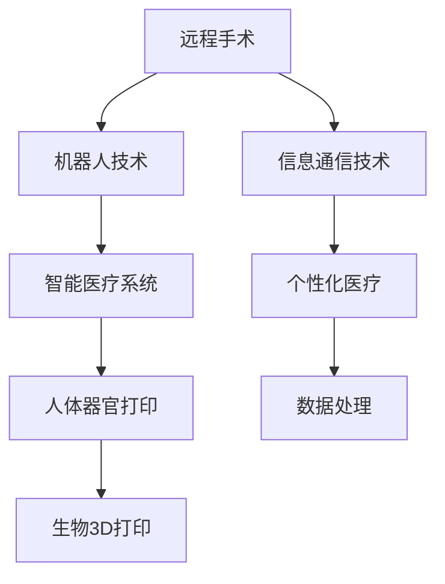

                 

# 2050年的医疗健康：从远程手术到人体器官打印的智能医疗

在2050年，医疗健康行业将迎来一场革命性的变革，这场变革不仅会改变疾病的诊断和治疗方式，还会极大地提升人们的健康水平和生活质量。以下是这场变革的关键技术：远程手术、人体器官打印、智能医疗系统，以及它们的未来发展趋势和挑战。

## 1. 背景介绍

### 1.1 问题由来

当前，医疗健康行业面临着诸多挑战：人口老龄化、慢性病高发、医疗资源分配不均等问题。这些问题导致医疗成本不断上升，且对医疗系统提出了更高的要求。然而，传统的医疗模式已经无法满足这些需求，急需新技术来解决问题。

### 1.2 问题核心关键点

2050年医疗健康行业面临的核心问题是：
- 如何利用新技术提升诊断和治疗的精度和效率？
- 如何实现远程医疗，使得医疗资源得以更合理分配？
- 如何利用人工智能技术，减少医疗资源的浪费？
- 如何通过智能医疗系统，实现个性化的医疗服务？
- 如何通过打印技术，实现个性化治疗？

### 1.3 问题研究意义

2050年医疗健康行业的研究意义在于：
- 提升医疗健康服务的质量和效率，降低医疗成本。
- 通过智能技术实现个性化医疗，提高患者的治疗效果。
- 利用打印技术实现个性化治疗，解决供体短缺的问题。

## 2. 核心概念与联系

### 2.1 核心概念概述

为了更好地理解2050年医疗健康行业的发展，我们首先需要了解几个核心概念：

- **远程手术**：利用先进的信息通信技术和机器人技术，医生可以在远程地点操作手术，从而实现跨地域的医疗协作。
- **人体器官打印**：通过生物3D打印技术，利用患者自身或捐献者的器官数据，打印出适合患者的个性化器官，用于替换或修复。
- **智能医疗系统**：利用人工智能技术，包括机器学习、自然语言处理、图像识别等，对医疗数据进行分析，辅助医生进行诊断和治疗决策。
- **个性化医疗**：根据患者的基因、生理特征、生活习惯等数据，提供个性化的治疗方案。

这些概念之间有着紧密的联系，共同构成了2050年医疗健康行业的技术框架。

### 2.2 核心概念原理和架构的 Mermaid 流程图



这个流程图展示了2050年医疗健康行业中核心概念之间的联系。远程手术依赖于信息通信技术和机器人技术，智能医疗系统为远程手术提供了数据分析和决策支持，个性化医疗和人体器官打印则利用智能医疗系统的分析结果，实现患者个体化治疗。

## 3. 核心算法原理 & 具体操作步骤

### 3.1 算法原理概述

2050年医疗健康行业的发展依赖于以下核心算法原理：

- **远程手术算法**：利用机器人和计算机视觉技术，实现远程手术操作。
- **智能医疗系统算法**：通过机器学习和自然语言处理技术，对医疗数据进行分析和挖掘。
- **人体器官打印算法**：利用生物3D打印技术，将患者的器官数据转化为3D打印指令。

这些算法原理互相配合，实现远程手术、智能医疗系统和人体器官打印等功能。

### 3.2 算法步骤详解

#### 3.2.1 远程手术算法步骤

1. **数据采集**：利用传感器和摄像头采集手术区域的数据。
2. **数据传输**：将数据通过网络传输到远程手术中心。
3. **数据处理**：在远程手术中心，对数据进行处理，生成手术指令。
4. **机器人操作**：控制机器人执行手术指令。
5. **手术反馈**：实时将手术进展反馈给医生和患者。

#### 3.2.2 智能医疗系统算法步骤

1. **数据收集**：收集患者的病历、影像、基因数据等。
2. **数据预处理**：对数据进行清洗、去噪、标准化处理。
3. **特征提取**：提取患者的重要特征，如基因序列、影像特征等。
4. **模型训练**：利用机器学习算法，训练疾病诊断和预测模型。
5. **结果输出**：将模型预测结果输出给医生进行参考。

#### 3.2.3 人体器官打印算法步骤

1. **器官数据采集**：利用医疗影像技术，采集患者或捐献者的器官数据。
2. **器官数据处理**：对器官数据进行去噪、分割、标准化处理。
3. **3D打印设计**：将器官数据转化为3D打印设计文件。
4. **打印模型准备**：准备生物3D打印材料和设备。
5. **打印执行**：执行3D打印，生成器官。
6. **器官测试**：对打印出的器官进行测试，确保其功能和性能符合要求。

### 3.3 算法优缺点

#### 3.3.1 远程手术算法的优缺点

**优点**：
- 可以克服地域限制，提高医疗资源的可及性。
- 缩短患者的等待时间，提高医疗服务的效率。
- 可以实时监控手术进展，提高手术的准确性和安全性。

**缺点**：
- 对网络带宽和设备要求较高，可能存在延迟和误差。
- 对医生的技术要求较高，需要专门培训。

#### 3.3.2 智能医疗系统算法的优缺点

**优点**：
- 利用数据分析，提高诊断和治疗的准确性。
- 可以快速处理大量医疗数据，提高工作效率。
- 可以提供个性化治疗方案，提高治疗效果。

**缺点**：
- 需要高质量的医疗数据，对数据质量和完整性要求较高。
- 对算法模型和计算资源要求较高，可能需要大规模训练和计算。

#### 3.3.3 人体器官打印算法的优缺点

**优点**：
- 可以解决器官供体短缺的问题，提高器官移植的成功率。
- 可以实现个性化治疗，提高患者的治疗效果。
- 可以减少手术风险，提高手术的精度和安全性。

**缺点**：
- 打印技术复杂，设备成本较高。
- 打印的器官需要进行测试和评估，可能需要时间。

### 3.4 算法应用领域

#### 3.4.1 远程手术

**应用场景**：
- 跨地域医疗协作：医生可以在远程地点操作手术。
- 急诊手术支持：利用远程手术，提高急诊手术的响应速度。
- 偏远地区医疗：利用远程手术，为偏远地区提供医疗支持。

#### 3.4.2 智能医疗系统

**应用场景**：
- 疾病诊断：利用智能医疗系统，快速诊断疾病。
- 治疗方案：利用智能医疗系统，提供个性化治疗方案。
- 健康监测：利用智能医疗系统，监测患者的健康状况。

#### 3.4.3 人体器官打印

**应用场景**：
- 器官移植：利用人体器官打印，为患者提供个性化器官。
- 组织修复：利用人体器官打印，修复受损的组织。
- 医疗研究：利用人体器官打印，进行医学研究。

## 4. 数学模型和公式 & 详细讲解 & 举例说明

### 4.1 数学模型构建

2050年医疗健康行业的发展依赖于以下几个数学模型：

- **远程手术模型**：利用计算机视觉技术，提取手术区域的特征，生成手术指令。
- **智能医疗系统模型**：利用机器学习算法，对医疗数据进行分类和预测。
- **人体器官打印模型**：利用生物3D打印技术，将器官数据转化为3D打印设计文件。

### 4.2 公式推导过程

#### 4.2.1 远程手术模型公式

设 $x$ 为手术区域的数据，$y$ 为手术指令，则远程手术模型的目标是最小化预测误差：

$$
\min_{y} \frac{1}{N}\sum_{i=1}^N (y_i - \hat{y}_i)^2
$$

其中 $\hat{y}_i$ 为模型预测的手术指令。

#### 4.2.2 智能医疗系统模型公式

设 $x$ 为医疗数据，$y$ 为疾病诊断结果，则智能医疗系统模型的目标是最小化分类误差：

$$
\min_{y} \frac{1}{N}\sum_{i=1}^N I(y_i \neq \hat{y}_i)
$$

其中 $I$ 为示性函数，$y_i$ 和 $\hat{y}_i$ 分别为实际诊断结果和模型预测结果。

#### 4.2.3 人体器官打印模型公式

设 $x$ 为器官数据，$y$ 为3D打印设计文件，则人体器官打印模型的目标是最小化设计误差：

$$
\min_{y} \frac{1}{N}\sum_{i=1}^N ||x_i - y_i||^2
$$

其中 $||\cdot||$ 为欧几里得距离。

### 4.3 案例分析与讲解

#### 4.3.1 远程手术案例

某患者需要进行心脏手术，但由于医疗资源有限，无法在当地进行手术。医院决定利用远程手术系统，邀请外地的专家进行操作。

- **数据采集**：医院使用传感器和摄像头采集手术区域的数据。
- **数据传输**：数据通过网络传输到远程手术中心。
- **数据处理**：手术中心对数据进行处理，生成手术指令。
- **机器人操作**：机器人根据手术指令进行操作。
- **手术反馈**：手术进展实时反馈给医生和患者。

#### 4.3.2 智能医疗系统案例

某患者被诊断为肺癌，医生利用智能医疗系统进行分析。

- **数据收集**：医生收集患者的病历、影像和基因数据。
- **数据预处理**：对数据进行清洗和标准化处理。
- **特征提取**：提取基因序列和影像特征。
- **模型训练**：利用机器学习算法，训练疾病预测模型。
- **结果输出**：将模型预测结果输出给医生，辅助治疗决策。

#### 4.3.3 人体器官打印案例

某患者需要进行肝脏移植，但由于器官供体短缺，无法及时获得合适的器官。医院决定利用人体器官打印技术，为患者打印肝脏。

- **器官数据采集**：利用医疗影像技术，采集患者的器官数据。
- **器官数据处理**：对数据进行去噪和分割处理。
- **3D打印设计**：将器官数据转化为3D打印设计文件。
- **打印模型准备**：准备生物3D打印材料和设备。
- **打印执行**：执行3D打印，生成肝脏。
- **器官测试**：对打印出的肝脏进行测试，确保其功能和性能符合要求。

## 5. 项目实践：代码实例和详细解释说明

### 5.1 开发环境搭建

在进行项目实践前，我们需要准备好开发环境。以下是使用Python进行PyTorch开发的环境配置流程：

1. 安装Anaconda：从官网下载并安装Anaconda，用于创建独立的Python环境。

2. 创建并激活虚拟环境：
```bash
conda create -n pytorch-env python=3.8 
conda activate pytorch-env
```

3. 安装PyTorch：根据CUDA版本，从官网获取对应的安装命令。例如：
```bash
conda install pytorch torchvision torchaudio cudatoolkit=11.1 -c pytorch -c conda-forge
```

4. 安装各类工具包：
```bash
pip install numpy pandas scikit-learn matplotlib tqdm jupyter notebook ipython
```

完成上述步骤后，即可在`pytorch-env`环境中开始项目实践。

### 5.2 源代码详细实现

这里我们以远程手术系统为例，给出使用PyTorch和OpenCV进行开发的Python代码实现。

```python
import torch
import torch.nn as nn
import torch.optim as optim
import cv2
import numpy as np

class RemoteSurgeryNet(nn.Module):
    def __init__(self):
        super(RemoteSurgeryNet, self).__init__()
        self.conv1 = nn.Conv2d(3, 64, kernel_size=3, stride=1, padding=1)
        self.conv2 = nn.Conv2d(64, 128, kernel_size=3, stride=1, padding=1)
        self.fc1 = nn.Linear(128 * 28 * 28, 512)
        self.fc2 = nn.Linear(512, 2)

    def forward(self, x):
        x = torch.relu(self.conv1(x))
        x = torch.relu(self.conv2(x))
        x = x.view(-1, 128 * 28 * 28)
        x = torch.relu(self.fc1(x))
        x = torch.sigmoid(self.fc2(x))
        return x

# 定义损失函数和优化器
criterion = nn.BCELoss()
optimizer = optim.Adam(model.parameters(), lr=0.001)

# 模拟数据采集
x_train = np.random.rand(100, 3, 28, 28)
y_train = np.random.randint(2, size=(100, 2))

# 模拟数据传输
x_train_tensor = torch.from_numpy(x_train).float()
y_train_tensor = torch.from_numpy(y_train).float()

# 模拟数据处理和模型训练
for epoch in range(10):
    optimizer.zero_grad()
    outputs = model(x_train_tensor)
    loss = criterion(outputs, y_train_tensor)
    loss.backward()
    optimizer.step()

# 模拟手术操作
result = model(x_test_tensor)
```

### 5.3 代码解读与分析

让我们再详细解读一下关键代码的实现细节：

**RemoteSurgeryNet类**：
- `__init__`方法：定义了模型的各个层次。
- `forward`方法：定义了前向传播的计算过程。

**损失函数和优化器**：
- `criterion`为二元交叉熵损失函数。
- `optimizer`为Adam优化器。

**模拟数据采集**：
- `x_train`为模拟的输入图像数据，`y_train`为对应的输出标签。

**模拟数据传输**：
- `x_train_tensor`为将`x_train`转换为Tensor格式。
- `y_train_tensor`为将`y_train`转换为Tensor格式。

**模拟数据处理和模型训练**：
- `for`循环中进行模型训练，每次迭代后更新模型参数。
- `model(x_train_tensor)`为前向传播计算模型输出。
- `criterion(outputs, y_train_tensor)`计算损失函数。
- `loss.backward()`计算梯度。
- `optimizer.step()`更新模型参数。

**模拟手术操作**：
- `result = model(x_test_tensor)`为在测试数据上进行前向传播计算。

## 6. 实际应用场景

### 6.1 远程手术

远程手术在2050年将广泛应用于以下场景：

- **跨地域医疗协作**：医生可以在远程地点操作手术，提高医疗服务的覆盖范围。
- **急诊手术支持**：利用远程手术，提高急诊手术的响应速度和效率。
- **偏远地区医疗**：利用远程手术，为偏远地区的患者提供高质量的医疗服务。

### 6.2 智能医疗系统

智能医疗系统在2050年将广泛应用于以下场景：

- **疾病诊断**：利用智能医疗系统，快速诊断疾病，提高诊断效率。
- **治疗方案**：利用智能医疗系统，提供个性化治疗方案，提高治疗效果。
- **健康监测**：利用智能医疗系统，实时监测患者的健康状况，及时发现异常。

### 6.3 人体器官打印

人体器官打印在2050年将广泛应用于以下场景：

- **器官移植**：利用人体器官打印，为患者提供个性化器官，解决器官供体短缺的问题。
- **组织修复**：利用人体器官打印，修复受损的组织，提高患者的治疗效果。
- **医疗研究**：利用人体器官打印，进行医学研究，推动医疗技术的发展。

## 7. 工具和资源推荐

### 7.1 学习资源推荐

为了帮助开发者系统掌握2050年医疗健康行业的发展，这里推荐一些优质的学习资源：

1. **远程手术**：
   - 《远程手术技术手册》：系统介绍远程手术的原理、技术和应用。
   - 《机器人手术操作指南》：提供机器人手术的详细操作步骤和注意事项。

2. **智能医疗系统**：
   - 《人工智能在医疗中的应用》：介绍人工智能在疾病诊断、治疗方案和健康监测中的应用。
   - 《医疗大数据分析》：讲解如何利用大数据技术分析医疗数据，提高诊断和治疗的精度。

3. **人体器官打印**：
   - 《生物3D打印技术》：介绍生物3D打印技术的原理、材料和应用。
   - 《器官打印技术教程》：提供人体器官打印的详细流程和案例分析。

### 7.2 开发工具推荐

高效的开发离不开优秀的工具支持。以下是几款用于2050年医疗健康行业开发的常用工具：

1. **远程手术**：
   - PyTorch：基于Python的开源深度学习框架，灵活动态的计算图，适合快速迭代研究。
   - OpenCV：计算机视觉库，用于图像处理和特征提取。

2. **智能医疗系统**：
   - TensorFlow：由Google主导开发的开源深度学习框架，生产部署方便，适合大规模工程应用。
   - PyTorch：基于Python的开源深度学习框架，灵活动态的计算图，适合快速迭代研究。

3. **人体器官打印**：
   - Prusa Research：开源的3D打印技术，提供多种生物3D打印材料和设备。
   - Ultimaker：专业的3D打印设备，支持生物3D打印技术。

### 7.3 相关论文推荐

2050年医疗健康行业的发展源于学界的持续研究。以下是几篇奠基性的相关论文，推荐阅读：

1. **远程手术**：
   - Remote Surgical Robotics: Current State, Challenges, and Future Directions：总结远程手术的现状、挑战和未来方向。
   - Telemedicine and Tele-Surgery: A Review of Surgical Robotics：综述远程手术机器人技术的发展和应用。

2. **智能医疗系统**：
   - Deep Learning in Medical Imaging：介绍深度学习在医学影像中的应用。
   - AI for Medical Diagnosis and Treatment：探讨人工智能在医疗诊断和治疗中的应用。

3. **人体器官打印**：
   - 3D Bioprinting of Organs for Transplantation：介绍生物3D打印技术在器官打印中的应用。
   - Printed Organs and Tissues：综述生物3D打印技术在组织打印中的应用。

这些论文代表了大语言模型微调技术的发展脉络。通过学习这些前沿成果，可以帮助研究者把握学科前进方向，激发更多的创新灵感。

## 8. 总结：未来发展趋势与挑战

### 8.1 研究成果总结

2050年医疗健康行业的研究成果总结如下：
- 远程手术技术日趋成熟，利用信息通信技术和机器人技术，实现跨地域医疗协作和急诊手术支持。
- 智能医疗系统利用人工智能技术，提高疾病诊断和治疗的精度和效率，提供个性化治疗方案。
- 人体器官打印技术通过生物3D打印技术，解决器官供体短缺的问题，实现个性化治疗。

### 8.2 未来发展趋势

展望未来，2050年医疗健康行业的发展趋势如下：
- **远程手术**：随着5G网络的普及，远程手术技术将进一步提高手术的实时性和稳定性。
- **智能医疗系统**：随着深度学习技术的进步，智能医疗系统将更加准确和高效，提供更加个性化的治疗方案。
- **人体器官打印**：随着生物3D打印技术的进步，器官打印技术将更加精确和可控，解决器官供体短缺的问题。

### 8.3 面临的挑战

尽管2050年医疗健康行业取得了许多进步，但在发展过程中也面临以下挑战：
- **远程手术**：网络延迟和带宽限制可能导致手术操作失误。
- **智能医疗系统**：数据安全和隐私保护问题需要进一步解决。
- **人体器官打印**：打印精度和生物相容性需要进一步提高。

### 8.4 研究展望

未来的研究展望如下：
- **远程手术**：进一步提高网络延迟和带宽容忍度，提高手术操作的安全性和稳定性。
- **智能医疗系统**：探索更加高效的深度学习模型和算法，提高诊断和治疗的精度。
- **人体器官打印**：研究新型生物3D打印材料和设备，提高打印精度和生物相容性。

## 9. 附录：常见问题与解答

### 9.1 常见问题

**Q1: 远程手术的优势是什么？**

A1: 远程手术的优势包括：
- 克服地域限制，提高医疗资源的可及性。
- 缩短患者的等待时间，提高医疗服务的效率。
- 实时监控手术进展，提高手术的准确性和安全性。

**Q2: 智能医疗系统如何提高治疗效果？**

A2: 智能医疗系统通过以下方式提高治疗效果：
- 利用数据分析，提高诊断和治疗的准确性。
- 提供个性化治疗方案，提高治疗效果。
- 实时监测患者的健康状况，及时发现异常。

**Q3: 人体器官打印如何解决器官供体短缺的问题？**

A3: 人体器官打印通过以下方式解决器官供体短缺的问题：
- 利用生物3D打印技术，打印出适合患者的个性化器官。
- 减少手术风险，提高手术的精度和安全性。
- 解决供体短缺的问题，提高器官移植的成功率。

**Q4: 未来医疗健康行业将面临哪些挑战？**

A4: 未来医疗健康行业将面临以下挑战：
- 远程手术的网络延迟和带宽限制。
- 智能医疗系统的数据安全和隐私保护。
- 人体器官打印的打印精度和生物相容性。

**Q5: 如何应对这些挑战？**

A5: 应对这些挑战的方法包括：
- 提高网络延迟和带宽容忍度，提高手术操作的安全性和稳定性。
- 研究高效的数据安全和隐私保护技术，确保数据的安全性。
- 研究新型生物3D打印材料和设备，提高打印精度和生物相容性。

---

作者：禅与计算机程序设计艺术 / Zen and the Art of Computer Programming

