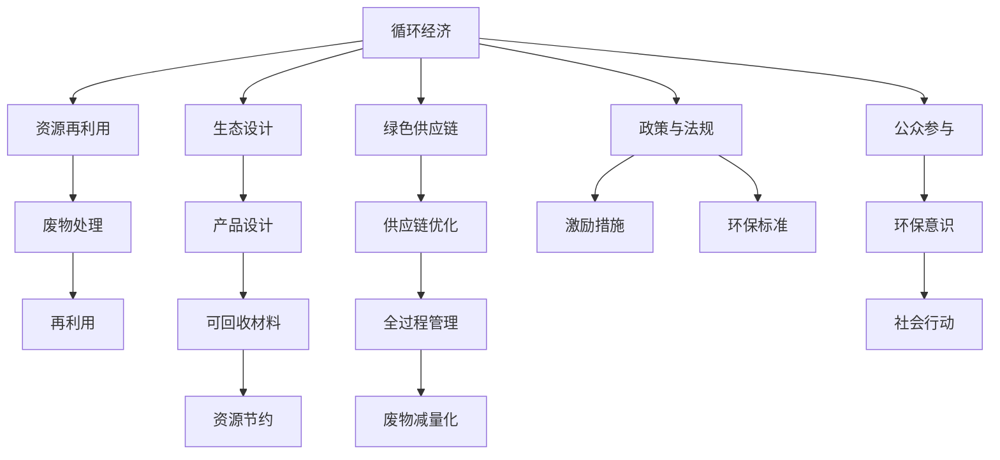

                 

# 2050年的可持续发展：循环经济与资源再利用

## 1. 背景介绍

### 1.1 问题由来

在全球气候变化、资源短缺的挑战下，可持续发展和环境保护成为21世纪全球面临的重大议题。循环经济和资源再利用作为其中重要的组成部分，受到越来越高的关注。循环经济是一种生态友好的生产与消费模式，通过资源循环利用，减少环境污染，实现经济与环境的协调发展。资源再利用则是指将废弃物进行回收处理，再次应用于生产，减少资源消耗和废弃物排放。

然而，目前的循环经济和资源再利用还存在很多问题。技术水平、成本高昂、市场机制不健全、公众意识薄弱等都阻碍了其发展。因此，本文旨在探讨循环经济与资源再利用的未来发展趋势，为2050年的可持续发展提供技术支持。

### 1.2 问题核心关键点

循环经济与资源再利用的核心在于资源的高效利用和废物减量化。核心关键点包括：
- 资源循环利用的技术和工艺
- 废物处理和回收的技术和工艺
- 资源管理与政策制定
- 公众参与和市场机制的完善

本文将围绕这些关键点，从技术、政策、公众等多个维度，系统探讨循环经济与资源再利用在2050年的发展前景。

## 2. 核心概念与联系

### 2.1 核心概念概述

为更好地理解循环经济与资源再利用，本节将介绍几个密切相关的核心概念：

- 循环经济（Circular Economy）：以资源的高效利用和废物减量化为目标的经济模式，通过资源循环利用、产品设计、生产和消费方式的创新，减少对自然资源的依赖，实现经济与环境的协调发展。

- 资源再利用（Resource Recycling）：将废弃物进行回收处理，再次应用于生产，减少资源消耗和废弃物排放，如废纸回收、废塑料回收等。

- 生态设计（Ecological Design）：在产品设计过程中考虑环境影响，优先选择可回收、可降解材料，减少产品生命周期对环境的负面影响。

- 绿色供应链（Green Supply Chain）：通过供应链管理优化，实现全过程的资源节约和废物减量化，从原材料采购、生产到销售全过程实现可持续性。

- 政策与法规：政府出台的一系列鼓励和约束措施，如税收减免、环保标准、废物处理要求等，以推动循环经济和资源再利用的发展。

- 公众参与：提升公众对循环经济和资源再利用的认知，激发社会参与热情，促进环保意识的普及和行为习惯的改变。

这些核心概念之间的逻辑关系可以通过以下Mermaid流程图来展示：



这个流程图展示了几大核心概念之间的关系：

1. 循环经济与资源再利用相辅相成，资源再利用是循环经济的重要组成部分。
2. 生态设计强调产品设计过程的环境影响，绿色供应链则强调供应链全过程的资源节约。
3. 废物处理和再利用技术是实现循环经济的重要手段。
4. 政策与法规为循环经济和资源再利用提供制度保障。
5. 公众参与有助于提升环保意识，激发社会参与，促进循环经济和资源再利用的普及。

这些概念共同构成了循环经济与资源再利用的基础框架，为实现可持续发展提供了理论支持。

## 3. 核心算法原理 & 具体操作步骤
### 3.1 算法原理概述

循环经济与资源再利用的核心算法原理在于优化资源利用效率和废物减量化。具体包括：

- 资源优化算法：通过算法优化，实现资源的最优分配和利用，如线性规划、动态规划等。
- 废物减量化算法：通过算法模型，减少废物产生和排放，如优化工艺流程、改进产品设计等。
- 绿色设计算法：通过算法设计和仿真，提升产品的可回收性和可降解性，如材料生命周期评估（LCA）等。

这些算法相互协同，共同推动循环经济和资源再利用的实现。

### 3.2 算法步骤详解

循环经济与资源再利用的算法步骤主要包括：

**Step 1: 数据收集与预处理**
- 收集工业、农业、服务业等领域的资源消耗和废物排放数据，如原料使用量、能源消耗、废水废气排放量等。
- 进行数据清洗、归一化等预处理操作，以便后续分析。

**Step 2: 构建模型**
- 根据数据特点选择合适的算法模型，如线性规划、动态规划、多目标优化等。
- 设计模型输入输出接口，包括资源消耗、废物排放、经济效益等关键指标。
- 构建模型约束条件，如资源可得性、环境限制、技术可行性等。

**Step 3: 模型求解**
- 利用优化算法求解模型，得到资源最优分配方案和废物减量化策略。
- 根据模型结果，优化工艺流程、改进产品设计、调整供应链管理等。

**Step 4: 结果评估与反馈**
- 对模型求解结果进行评估，检查其是否符合实际情况和目标要求。
- 对优化后的工艺流程、产品设计、供应链管理等进行试验验证，评估其效果。
- 根据评估结果，进行模型优化和参数调整，进一步提高模型精度。

**Step 5: 实施与监控**
- 根据优化结果，实施具体的工艺改进、产品设计优化、供应链管理调整等措施。
- 在实施过程中进行实时监控，收集反馈数据，检查优化措施的效果。
- 根据监控结果，进行动态调整，确保循环经济和资源再利用措施的有效性。

以上是循环经济与资源再利用算法的主要步骤。在实际应用中，还需要根据具体情况进行优化和调整。

### 3.3 算法优缺点

循环经济与资源再利用的算法具有以下优点：
- 优化资源利用效率，减少资源浪费。
- 减少废物排放，保护环境。
- 通过算法模型，实现全过程的科学管理。

同时，该算法也存在一些局限性：
- 数据收集和预处理复杂，需要大量人力物力。
- 算法模型复杂，求解过程耗时耗力。
- 模型精度受限于数据质量和算法优化。
- 实施过程中需要大量资源投入和系统支持。

尽管存在这些局限性，但就目前而言，算法方法仍然是推动循环经济和资源再利用的重要手段。未来相关研究需要进一步提升算法效率，优化模型求解过程，减少对数据和资源的依赖。

### 3.4 算法应用领域

循环经济与资源再利用的算法在多个领域得到了广泛应用，例如：

- 工业制造：通过优化工艺流程、改进设备设计、调整原材料采购等，实现资源循环利用和废物减量化。
- 农业生产：通过科学施肥、精准灌溉、有机农业等，提高资源利用效率，减少农业废弃物排放。
- 服务业：通过优化服务流程、使用可降解材料、实施废弃物回收等，减少资源消耗和废物排放。

此外，循环经济与资源再利用的算法还被应用于城市规划、生态保护、能源管理等多个领域，为实现可持续发展提供了技术保障。

## 4. 数学模型和公式 & 详细讲解 & 举例说明

### 4.1 数学模型构建

本文将从资源优化和废物减量化的角度，构建数学模型进行详细讲解。

记资源消耗量为 $x$，废物排放量为 $y$，经济效益为 $z$。则目标函数为最大化经济效益，约束条件为：
- 资源可得性：$x \leq X$，其中 $X$ 为资源总量。
- 废物排放限制：$y \leq Y$，其中 $Y$ 为废物排放总量。
- 技术可行性：$z \leq Z$，其中 $Z$ 为技术可行条件。

目标函数和约束条件可以表示为：
$$
\max z = f(x, y)
$$
$$
\text{subject to } 
\begin{cases}
x \leq X \\
y \leq Y \\
z \leq Z
\end{cases}
$$

### 4.2 公式推导过程

以资源优化为例，推导线性规划模型。假设资源 $x$ 和废物 $y$ 的消耗满足线性关系，则目标函数和约束条件可以表示为：
$$
\max z = c_1x_1 + c_2x_2 + \cdots + c_nx_n
$$
$$
\text{subject to } 
\begin{cases}
a_{11}x_1 + a_{12}x_2 + \cdots + a_{1n}x_n \leq b_1 \\
a_{21}x_1 + a_{22}x_2 + \cdots + a_{2n}x_n \leq b_2 \\
\vdots \\
a_{m1}x_1 + a_{m2}x_2 + \cdots + a_{mn}x_n \leq b_m
\end{cases}
$$

利用单纯形法（Simplex Method）求解上述线性规划模型，可以得到最优的资源分配方案。

### 4.3 案例分析与讲解

以一个简单的例子来说明线性规划的应用。假设某企业有两种原材料 A 和 B，其成本分别为 $5$ 和 $10$，每种原材料的消耗限制如下：
- $x_1 \leq 20$（A 原材料不超过 20kg）
- $x_2 \leq 15$（B 原材料不超过 15kg）

两种原材料的经济效益分别为 $3x_1 + 2x_2$，则目标函数为：
$$
\max z = 3x_1 + 2x_2
$$
$$
\text{subject to } 
\begin{cases}
x_1 \leq 20 \\
x_2 \leq 15 \\
x_1, x_2 \geq 0
\end{cases}
$$

利用单纯形法求解，可以得到最优的原材料消耗方案为：
- $x_1 = 12$（A 原材料消耗 12kg）
- $x_2 = 0$（B 原材料消耗 0kg）

该方案在满足原材料消耗限制的前提下，最大化经济效益。

## 5. 项目实践：代码实例和详细解释说明
### 5.1 开发环境搭建

在进行资源优化和废物减量化算法实践前，我们需要准备好开发环境。以下是使用Python进行PuLP开发的Python环境配置流程：

1. 安装PuLP：
```bash
pip install pulp
```

2. 安装其他必要的工具包，如NumPy、pandas、matplotlib等：
```bash
pip install numpy pandas matplotlib
```

3. 设置环境变量：
```bash
export PYTHONPATH=$PYTHONPATH:$HOME/project
```

完成上述步骤后，即可在项目环境下开始算法实践。

### 5.2 源代码详细实现

下面是一个简单的线性规划优化模型示例：

```python
from pulp import *

# 定义变量
x = LpVariable('x', lowBound=0, highBound=20)
y = LpVariable('y', lowBound=0, highBound=15)

# 定义目标函数
objective = maximize(3*x + 2*y)

# 定义约束条件
constraints = [
    x + y <= 35,  # 总资源限制
    x - y >= 0   # 非负约束
]

# 创建线性规划模型
lp = LpProblem('Resource Optimization', LpMaximize)

# 添加目标函数和约束条件
lp.setObjective(objective)
lp.addConstraints(constraints)

# 求解模型
lp.solve()

# 输出结果
if lp.status == LpStatusOptimal:
    print('Optimal solution:', lp.objective)
    print('Variable values:', x.value(), y.value())
else:
    print('Problem is infeasible or unbounded')
```

运行上述代码，可以得到最优的资源消耗方案。

### 5.3 代码解读与分析

下面是代码的详细解读：

1. 定义变量：使用`LpVariable`创建变量，并设置上下界。

2. 定义目标函数：使用`maximize`设置目标函数。

3. 定义约束条件：使用`addConstraints`添加约束条件。

4. 创建线性规划模型：使用`LpProblem`创建线性规划问题。

5. 求解模型：使用`solve`求解模型，得到最优解。

6. 输出结果：检查模型状态，输出最优目标函数值和变量值。

通过以上代码，可以清晰地看到线性规划模型求解的过程。

## 6. 实际应用场景
### 6.1 工业制造

在工业制造领域，资源优化和废物减量化是提高生产效率、降低成本、保护环境的重要手段。通过对生产流程的优化，可以实现资源的最优分配和废物的最小排放。例如，钢铁生产中，可以通过优化炼钢工艺，提高资源利用效率，减少废弃物排放。

### 6.2 农业生产

农业生产中，科学施肥、精准灌溉、有机农业等措施，可以提高资源利用效率，减少农业废弃物排放。通过对农业生产过程的优化，可以实现资源的高效利用和废物的减量化。

### 6.3 服务业

在服务业领域，资源优化和废物减量化也有广泛应用。例如，通过优化服务流程、使用可降解材料、实施废弃物回收等措施，可以显著减少资源消耗和废物排放。

### 6.4 未来应用展望

随着技术的不断进步，循环经济和资源再利用将实现更广泛的应用。未来，我们可以预见以下发展趋势：

1. 智能优化算法：通过引入人工智能和机器学习技术，优化算法将更加智能和高效。例如，通过自适应算法，实时调整资源分配方案，应对复杂的生产环境。

2. 大数据分析：利用大数据技术，实时监控资源消耗和废物排放，动态调整优化方案，实现全过程的科学管理。

3. 可再生能源：通过可再生能源的利用，实现能源的自给自足，减少对化石能源的依赖。

4. 全生命周期管理：实现产品设计、生产、使用、废弃全生命周期的资源优化和废物减量化，提升系统的可持续性。

5. 生态设计：通过设计出更加环保的产品，实现资源的高效利用和废物的减量化。

6. 公众参与：通过提升公众环保意识，激发社会参与，推动循环经济和资源再利用的普及。

## 7. 工具和资源推荐
### 7.1 学习资源推荐

为了帮助开发者系统掌握循环经济与资源再利用的理论基础和实践技巧，这里推荐一些优质的学习资源：

1. 《循环经济与资源再利用》系列博文：由循环经济领域专家撰写，深入浅出地介绍了循环经济的基本概念和实践案例。

2. 《资源优化与废物减量化》课程：各大高校开设的循环经济相关课程，系统讲解了循环经济的基本原理和实践方法。

3. 《资源管理与优化》书籍：详细介绍了资源管理的理论基础和实践技术，包括资源优化算法、废物减量化方法等。

4. 《循环经济与绿色供应链》论文：精选循环经济领域的经典论文，涵盖资源优化、废物减量化、绿色供应链等多个方面。

5. 循环经济开源项目：包含大量循环经济相关的开源项目和数据集，助力开发者进行实践和研究。

通过对这些资源的学习实践，相信你一定能够系统掌握循环经济与资源再利用的理论基础和实践技巧，为可持续发展贡献力量。

### 7.2 开发工具推荐

高效的开发离不开优秀的工具支持。以下是几款用于循环经济与资源再利用开发的常用工具：

1. PuLP：Python中的线性规划优化库，支持高效的线性规划求解。

2. Gurobi：商业化高级优化求解器，支持复杂优化模型求解。

3. Scipy：科学计算库，提供多种优化算法和数据分析工具。

4. PyCharm：Python IDE，提供代码调试、版本控制、数据分析等多种功能。

5. Jupyter Notebook：交互式编程环境，便于进行算法开发和数据分析。

6. Google Colab：谷歌提供的在线编程环境，免费提供GPU/TPU算力，方便开发者快速实验最新模型。

合理利用这些工具，可以显著提升循环经济与资源再利用任务的开发效率，加快创新迭代的步伐。

### 7.3 相关论文推荐

循环经济与资源再利用的发展源于学界的持续研究。以下是几篇奠基性的相关论文，推荐阅读：

1. 《循环经济：一种新的经济发展模式》：介绍循环经济的基本概念和实践方法。

2. 《资源再利用与环境影响》：分析资源再利用对环境的影响及其优化方法。

3. 《生态设计与循环经济》：探讨生态设计与循环经济的关系，提出优化设计方法。

4. 《绿色供应链管理》：研究绿色供应链的优化策略和管理方法，提升供应链的可持续性。

5. 《智能优化算法在循环经济中的应用》：利用人工智能和机器学习技术，优化资源分配和废物减量化。

6. 《大数据在循环经济中的应用》：利用大数据技术，实时监控资源消耗和废物排放，优化优化方案。

这些论文代表了大循环经济与资源再利用技术的发展脉络。通过学习这些前沿成果，可以帮助研究者把握学科前进方向，激发更多的创新灵感。

## 8. 总结：未来发展趋势与挑战

### 8.1 总结

本文对循环经济与资源再利用的未来发展趋势进行了全面系统的探讨。首先阐述了循环经济与资源再利用的基本概念和实践方法，明确了其在可持续发展中的重要地位。其次，从理论到实践，详细讲解了循环经济与资源再利用的数学模型和算法步骤，给出了具体的代码实现。同时，本文还广泛探讨了循环经济与资源再利用在多个行业领域的应用前景，展示了其广阔的实践空间。此外，本文精选了循环经济与资源再利用的各类学习资源，力求为开发者提供全方位的技术指引。

通过本文的系统梳理，可以看到，循环经济与资源再利用技术正成为推动可持续发展的重要手段。这些方向的探索发展，必将进一步提升资源利用效率，减少环境污染，为实现2050年的可持续发展提供技术保障。

### 8.2 未来发展趋势

展望未来，循环经济与资源再利用技术将呈现以下几个发展趋势：

1. 智能优化算法：通过引入人工智能和机器学习技术，优化算法将更加智能和高效。例如，通过自适应算法，实时调整资源分配方案，应对复杂的生产环境。

2. 大数据分析：利用大数据技术，实时监控资源消耗和废物排放，动态调整优化方案，实现全过程的科学管理。

3. 可再生能源：通过可再生能源的利用，实现能源的自给自足，减少对化石能源的依赖。

4. 全生命周期管理：实现产品设计、生产、使用、废弃全生命周期的资源优化和废物减量化，提升系统的可持续性。

5. 生态设计：通过设计出更加环保的产品，实现资源的高效利用和废物的减量化。

6. 公众参与：通过提升公众环保意识，激发社会参与，推动循环经济和资源再利用的普及。

以上趋势凸显了循环经济与资源再利用技术的广阔前景。这些方向的探索发展，必将进一步提升资源利用效率，减少环境污染，为实现2050年的可持续发展提供技术保障。

### 8.3 面临的挑战

尽管循环经济与资源再利用技术已经取得了显著成果，但在迈向更加智能化、普适化应用的过程中，它仍面临着诸多挑战：

1. 数据收集和处理复杂：循环经济涉及多个领域的复杂数据，数据收集和预处理过程耗时耗力。

2. 技术要求高：优化算法和废物减量化技术复杂，需要高水平的技术支持和专业人才。

3. 政策与法规不健全：现有的环保标准和法规不足以支撑循环经济的快速发展。

4. 公众意识薄弱：循环经济和资源再利用的理念还未被广泛接受，需要进一步普及教育。

5. 市场机制不完善：循环经济和资源再利用的市场机制还不健全，影响其推广应用。

6. 资源分配不均：资源优化和废物减量化依赖于技术优势和资源禀赋，导致资源分配不均。

正视循环经济与资源再利用面临的这些挑战，积极应对并寻求突破，将是大循环经济与资源再利用技术迈向成熟的必由之路。相信随着学界和产业界的共同努力，这些挑战终将一一被克服，循环经济与资源再利用必将在构建绿色发展路径中扮演越来越重要的角色。

### 8.4 研究展望

面对循环经济与资源再利用所面临的挑战，未来的研究需要在以下几个方面寻求新的突破：

1. 引入智能优化算法：利用人工智能和机器学习技术，提升优化算法的精度和效率。

2. 优化数据收集与处理：利用大数据和人工智能技术，优化数据收集和处理流程，提升数据利用效率。

3. 完善政策与法规：出台更加严格和全面的环保标准和法规，促进循环经济和资源再利用的发展。

4. 提升公众环保意识：通过教育和宣传，提升公众对循环经济和资源再利用的认知，激发社会参与。

5. 优化市场机制：建立更加完善的市场机制，激励企业和公众参与循环经济和资源再利用。

6. 促进资源公平分配：通过技术创新和政策支持，实现资源的高效利用和公平分配。

这些研究方向将为循环经济与资源再利用的发展提供新的动力，推动其实现更加广泛的应用。

## 9. 附录：常见问题与解答

**Q1: 循环经济与资源再利用的核心在于什么？**

A: 循环经济与资源再利用的核心在于资源的高效利用和废物减量化。通过优化资源分配和废物处理，实现全过程的可持续管理。

**Q2: 循环经济与资源再利用的算法步骤是什么？**

A: 循环经济与资源再利用的算法步骤主要包括数据收集与预处理、构建模型、模型求解、结果评估与反馈、实施与监控。

**Q3: 循环经济与资源再利用的优势是什么？**

A: 循环经济与资源再利用的优势在于优化资源利用效率，减少废物排放，实现环境与经济的协调发展。

**Q4: 循环经济与资源再利用的发展趋势是什么？**

A: 循环经济与资源再利用的发展趋势包括智能优化算法、大数据分析、可再生能源、全生命周期管理、生态设计、公众参与。

**Q5: 循环经济与资源再利用面临的挑战是什么？**

A: 循环经济与资源再利用面临的挑战包括数据收集和处理复杂、技术要求高、政策与法规不健全、公众意识薄弱、市场机制不完善、资源分配不均。

**Q6: 循环经济与资源再利用的未来展望是什么？**

A: 循环经济与资源再利用的未来展望包括智能优化算法、大数据分析、可再生能源、全生命周期管理、生态设计、公众参与。

**Q7: 循环经济与资源再利用的学习资源有哪些？**

A: 循环经济与资源再利用的学习资源包括《循环经济与资源再利用》系列博文、《资源优化与废物减量化》课程、《资源管理与优化》书籍、《循环经济与绿色供应链》论文、循环经济开源项目等。

**Q8: 循环经济与资源再利用的开发工具有哪些？**

A: 循环经济与资源再利用的开发工具包括PuLP、Gurobi、Scipy、PyCharm、Jupyter Notebook、Google Colab等。

**Q9: 循环经济与资源再利用的未来研究展望是什么？**

A: 循环经济与资源再利用的未来研究展望包括引入智能优化算法、优化数据收集与处理、完善政策与法规、提升公众环保意识、优化市场机制、促进资源公平分配。

这些问答内容旨在帮助读者更好地理解循环经济与资源再利用的核心概念、算法原理、应用场景、未来发展趋势及面临的挑战。通过学习这些问题和答案，相信你一定能够更全面地掌握循环经济与资源再利用的基本知识和前沿技术，为实现2050年的可持续发展贡献力量。

---

作者：禅与计算机程序设计艺术 / Zen and the Art of Computer Programming

