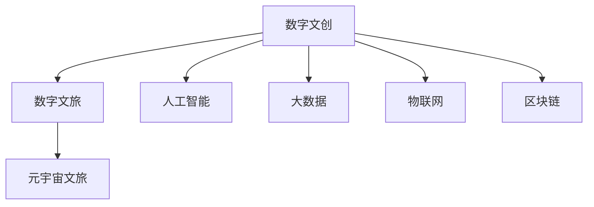

                 

# 2050年的数字文化：从数字文创到元宇宙文旅的数字文化产业升级

## 1. 背景介绍

### 1.1 问题由来

随着人工智能、物联网、区块链等技术的迅猛发展，数字文化产业正迎来一场前所未有的变革。从虚拟现实(VR)、增强现实(AR)、到元宇宙(Metaverse)，数字文化正在以更深入、更广泛的方式融入人们的生活。在2050年，数字文化产业将变得更加繁荣和多样，涵盖了数字文创、数字文旅等多个领域，成为驱动经济增长的新引擎。

数字文化产业的崛起，得益于数字技术的持续创新和普及应用。以数字文创为例，从3D建模、虚拟引擎、到游戏开发，再到文化创意内容创作，数字技术提供了强大的支持。特别是人工智能技术的广泛应用，极大地提升了数字文创内容的生产效率和质量，降低了创作门槛，打开了更多的市场机遇。

### 1.2 问题核心关键点

数字文化产业的核心关键点在于：

- **技术驱动**：人工智能、大数据、物联网、区块链等技术的深度融合，推动了数字文化产业的全面升级。
- **创意融合**：数字技术与文化创意的深度融合，打造出更加丰富、多元的数字文创内容。
- **体验升级**：通过虚拟现实、增强现实等技术，提升用户的沉浸式体验，带来全新的文化消费模式。
- **文化传承**：利用数字技术传承和弘扬传统文化，实现文化创新的同时，保护文化遗产。

这些关键点共同构成了数字文化产业的发展脉络，推动了数字文创、数字文旅等领域的快速崛起。

## 2. 核心概念与联系

### 2.1 核心概念概述

数字文化产业涵盖了数字文创、数字文旅等多个领域，是一个高度融合的复合产业。以下是几个核心概念：

- **数字文创**：利用数字技术进行文化创意内容创作和传播的过程，包括数字音乐、数字影视、数字游戏等。
- **数字文旅**：通过数字技术实现文化旅游的数字化和智能化，提供虚拟旅游、文化导览等新体验。
- **元宇宙文旅**：结合元宇宙技术，构建虚拟的文化旅游体验，提供沉浸式的数字文旅体验。

这些概念之间相互关联，共同构成了数字文化产业的生态体系。

### 2.2 核心概念原理和架构的 Mermaid 流程图



这个流程图展示了数字文化产业的关键组成和关联关系。数字文创、数字文旅、元宇宙文旅通过人工智能、大数据、物联网、区块链等技术的深度融合，实现了内容的创新和体验的升级。

## 3. 核心算法原理 & 具体操作步骤

### 3.1 算法原理概述

数字文化产业的核心算法原理主要集中在以下几个方面：

- **数据驱动的创意生成**：利用大数据和人工智能技术，通过数据分析和模型训练，自动生成创意内容。
- **基于人工智能的内容推荐**：通过机器学习和深度学习技术，对用户行为进行建模，提供个性化的内容推荐。
- **沉浸式体验的虚拟现实技术**：利用虚拟现实、增强现实等技术，创建沉浸式的文化体验。
- **元宇宙文旅的数字化管理**：通过区块链技术，实现虚拟旅游场景和现实旅游场景的数据交互和管理。

### 3.2 算法步骤详解

#### 3.2.1 数据驱动的创意生成

1. **数据采集**：从互联网、社交媒体、文化档案等渠道采集大量的文化数据，包括文本、图片、视频等。
2. **数据预处理**：对采集到的数据进行清洗、标注、归一化等预处理步骤，确保数据质量。
3. **特征提取**：使用自然语言处理(NLP)、计算机视觉(CV)等技术，提取数据的特征，如文本的情感、图片的风格等。
4. **模型训练**：利用深度学习模型，如神经网络、生成对抗网络(GAN)等，对提取的特征进行训练，生成创意内容。
5. **内容生成**：根据训练好的模型，自动生成新的文化创意内容，如音乐、影视、游戏等。

#### 3.2.2 基于人工智能的内容推荐

1. **用户画像构建**：通过分析用户的历史行为、兴趣爱好等数据，构建用户画像。
2. **内容特征提取**：对推荐内容进行特征提取，如内容的关键词、风格等。
3. **推荐模型训练**：利用机器学习算法，如协同过滤、矩阵分解等，训练推荐模型。
4. **内容推荐**：根据训练好的推荐模型，对用户进行内容推荐，提高用户体验和满意度。

#### 3.2.3 沉浸式体验的虚拟现实技术

1. **虚拟场景创建**：利用3D建模技术，创建虚拟文化场景，如历史遗址、博物馆等。
2. **交互设计**：设计用户与虚拟场景的交互方式，如语音交互、手势交互等。
3. **沉浸式体验**：通过虚拟现实技术，将用户置身于虚拟文化场景中，提供沉浸式的文化体验。
4. **感官模拟**：利用传感器技术，模拟用户在虚拟场景中的感官体验，如视觉、听觉、触觉等。

#### 3.2.4 元宇宙文旅的数字化管理

1. **虚拟旅游场景创建**：利用虚拟现实技术，创建虚拟旅游场景，如历史遗迹、名胜古迹等。
2. **文化数据标注**：对虚拟旅游场景进行文化数据的标注，如历史背景、文化内涵等。
3. **区块链记录**：利用区块链技术，记录虚拟旅游场景的文化数据，确保数据的安全性和不可篡改性。
4. **数字旅游管理**：通过数字化管理系统，管理虚拟旅游场景和现实旅游场景，提供无缝的旅游体验。

### 3.3 算法优缺点

数字文化产业的算法主要具备以下优点：

- **高效性**：利用人工智能和大数据技术，大大提高了内容生成和推荐的速度和效率。
- **个性化**：通过用户画像和推荐模型，提供个性化的文化体验和推荐服务。
- **沉浸性**：通过虚拟现实和增强现实技术，提供了沉浸式的文化体验，增强了用户的参与感。
- **可扩展性**：数字文化产业可以覆盖多个领域，具有较高的市场扩展性。

同时，数字文化产业的算法也存在一些缺点：

- **数据隐私**：大量数据的采集和处理可能涉及用户隐私问题，需要严格的数据保护措施。
- **技术门槛**：数字文化产业涉及多种前沿技术，技术门槛较高，需要大量的研发投入。
- **内容同质化**：算法生成的内容可能存在同质化问题，缺乏创新性。
- **成本高昂**：虚拟现实、增强现实等技术的硬件和软件成本较高，降低了普及性。

### 3.4 算法应用领域

数字文化产业的算法应用领域非常广泛，以下是几个典型案例：

#### 3.4.1 数字文创

1. **音乐创作**：利用深度学习模型，自动生成旋律、歌词等音乐元素，创作新的音乐作品。
2. **影视制作**：通过3D建模和虚拟现实技术，创建虚拟的影视场景，提供沉浸式的观影体验。
3. **游戏开发**：利用人工智能和大数据技术，自动生成游戏情节、角色等，降低游戏开发成本。

#### 3.4.2 数字文旅

1. **虚拟旅游**：利用虚拟现实技术，创建虚拟的旅游景点，提供沉浸式的旅游体验。
2. **文化导览**：通过增强现实技术，在现实场景中叠加文化信息，提供互动式的文化导览服务。
3. **数字博物馆**：利用数字化技术，创建虚拟博物馆，展示和保护文化遗产。

#### 3.4.3 元宇宙文旅

1. **虚拟文化场景**：利用虚拟现实技术，创建虚拟的文化场景，如历史遗址、名胜古迹等。
2. **文化数据记录**：通过区块链技术，记录虚拟文化场景的文化数据，确保数据的安全性和不可篡改性。
3. **沉浸式体验**：提供沉浸式的文化体验，增强用户的参与感和体验感。

## 4. 数学模型和公式 & 详细讲解 & 举例说明

### 4.1 数学模型构建

数字文化产业的数学模型主要集中在以下几个方面：

- **创意生成模型**：利用生成对抗网络(GAN)、变分自编码器(VAE)等生成模型，自动生成创意内容。
- **推荐模型**：利用协同过滤、矩阵分解等推荐算法，提供个性化的内容推荐服务。
- **虚拟现实模型**：利用物理模拟、渲染等技术，创建逼真的虚拟场景。
- **区块链模型**：利用分布式账本技术，确保虚拟文化场景的数据安全性和不可篡改性。

### 4.2 公式推导过程

#### 4.2.1 创意生成模型的公式推导

假设有一个文本生成模型 $G$，其生成文本的概率分布为 $P_{G}(x)$，目标是最小化生成文本与真实文本的KL散度：

$$
\min_{G} KL(P_{G}(x)||P_{data}(x))
$$

其中 $P_{data}(x)$ 为真实文本的概率分布。利用生成对抗网络，可以将问题转化为最大化判别器 $D$ 的错误率，最小化生成器 $G$ 的损失函数：

$$
\min_{G} \max_{D} V(G,D) = \min_{G} \mathbb{E}_{x\sim P_{data}(x)} [\log D(x)] + \mathbb{E}_{x\sim P_{G}(x)} [\log (1-D(x))]
$$

通过不断迭代训练，生成模型 $G$ 可以生成高质量的文本内容。

#### 4.2.2 推荐模型的公式推导

假设有一个用户画像 $U$ 和内容特征 $I$，推荐模型的目标是最大化用户对内容的满意度 $R$：

$$
\max_{\theta} \mathbb{E}_{(U,I)\sim P_{data}} [R(U,I)]
$$

其中 $P_{data}$ 为数据的概率分布。利用协同过滤算法，可以将问题转化为求解优化问题：

$$
\max_{\theta} \sum_{(U,I)\sim P_{data}} R(U,I)
$$

通过训练优化模型，可以实现对用户行为的高效建模和推荐。

#### 4.2.3 虚拟现实模型的公式推导

假设有一个虚拟现实场景 $S$，其渲染效果由传感器数据 $D$ 决定，目标是最小化渲染误差：

$$
\min_{D} \sum_{i=1}^n (y_i - f(x_i;D))^2
$$

其中 $y_i$ 为传感器数据，$f(x_i;D)$ 为渲染函数。利用物理模拟技术，可以逼真地渲染虚拟现实场景。

#### 4.2.4 区块链模型的公式推导

假设有一个区块链网络 $N$，其安全性由共识算法 $C$ 决定，目标是最小化网络攻击风险 $R$：

$$
\min_{C} \sum_{i=1}^n (r_i - c_i)^2
$$

其中 $r_i$ 为真实交易记录，$c_i$ 为区块链记录。利用分布式账本技术，可以确保数据的不可篡改性和安全性。

### 4.3 案例分析与讲解

#### 4.3.1 数字文创案例

**案例：自动音乐创作**

利用深度学习模型，可以自动生成旋律和歌词，创作新的音乐作品。例如，GPT-3可以通过文本生成模型，生成歌词和旋律的组合，然后通过合成技术，生成完整的音乐作品。

**案例：虚拟影视制作**

利用3D建模和虚拟现实技术，可以创建虚拟的影视场景，提供沉浸式的观影体验。例如，利用Unity或Unreal Engine等虚拟引擎，创建虚拟的古代皇宫、历史事件等场景，结合自然语言处理技术，生成剧情和对话，最终通过渲染引擎输出。

#### 4.3.2 数字文旅案例

**案例：虚拟博物馆**

利用数字技术，创建虚拟博物馆，展示和保护文化遗产。例如，利用3D建模和虚拟现实技术，创建虚拟博物馆场景，结合增强现实技术，在现实博物馆中叠加虚拟信息，提供互动式的文化导览服务。

**案例：文化导览应用**

通过增强现实技术，在现实场景中叠加文化信息，提供互动式的文化导览服务。例如，利用AR眼镜或手机应用，将虚拟的历史事件、人物等信息叠加在现实场景中，增强用户的体验感。

#### 4.3.3 元宇宙文旅案例

**案例：虚拟古迹**

利用虚拟现实技术，创建虚拟的古迹场景，提供沉浸式的文化体验。例如，利用VR头盔或头显设备，进入虚拟的兵马俑坑、长城等古迹场景，感受历史的宏伟和壮丽。

**案例：文化数据记录**

通过区块链技术，记录虚拟文化场景的文化数据，确保数据的安全性和不可篡改性。例如，利用智能合约和区块链技术，记录虚拟古迹的历史背景、文化内涵等数据，确保数据的可信性和透明度。

## 5. 项目实践：代码实例和详细解释说明

### 5.1 开发环境搭建

在进行数字文化产业的实践开发前，我们需要准备好开发环境。以下是使用Python进行深度学习开发的环境配置流程：

1. 安装Anaconda：从官网下载并安装Anaconda，用于创建独立的Python环境。

2. 创建并激活虚拟环境：
```bash
conda create -n pytorch-env python=3.8 
conda activate pytorch-env
```

3. 安装PyTorch：根据CUDA版本，从官网获取对应的安装命令。例如：
```bash
conda install pytorch torchvision torchaudio cudatoolkit=11.1 -c pytorch -c conda-forge
```

4. 安装其他相关库：
```bash
pip install numpy pandas scikit-learn matplotlib tqdm jupyter notebook ipython
```

完成上述步骤后，即可在`pytorch-env`环境中开始项目实践。

### 5.2 源代码详细实现

这里我们以虚拟博物馆项目为例，给出使用深度学习技术和虚拟现实技术构建虚拟博物馆的PyTorch代码实现。

首先，定义虚拟博物馆的虚拟场景：

```python
import torch
from torch.utils.data import Dataset
from transformers import GPT3Tokenizer, GPT3ForCausalLM

class VirtualMuseum(Dataset):
    def __init__(self, data_dir):
        # 加载数据
        self.data = load_data(data_dir)
        # 构建虚拟场景
        self.build_scene()
        
    def build_scene(self):
        # 创建虚拟场景
        self.scene = create_scene()
        
    def __len__(self):
        return len(self.data)
    
    def __getitem__(self, item):
        # 获取虚拟场景
        scene = self.scene[item]
        # 获取场景的文化信息
        culture = self.data[item]
        # 返回虚拟场景和文化信息
        return scene, culture
```

然后，定义虚拟博物馆的渲染模型：

```python
class VirtualMuseumRenderer:
    def __init__(self, model_path):
        # 加载渲染模型
        self.model = load_model(model_path)
        # 设置渲染参数
        self.parameters = set_parameters()
        
    def render(self, scene, culture):
        # 渲染虚拟场景
        result = self.model.render(scene, culture, self.parameters)
        return result
```

接着，定义虚拟博物馆的用户界面：

```python
class VirtualMuseumUI:
    def __init__(self, renderer):
        # 加载用户界面
        self.ui = load_ui()
        # 设置渲染器
        self.ui.renderer = renderer
        
    def interact(self, user_input):
        # 响应用户输入
        output = self.ui.respond(user_input)
        return output
```

最后，启动虚拟博物馆的交互流程：

```python
# 初始化虚拟博物馆
museum = VirtualMuseum(data_dir)
# 初始化渲染器
renderer = VirtualMuseumRenderer(model_path)
# 初始化用户界面
ui = VirtualMuseumUI(renderer)

# 交互循环
while True:
    user_input = get_user_input()
    output = ui.interact(user_input)
    print(output)
```

以上就是使用PyTorch构建虚拟博物馆的完整代码实现。可以看到，利用深度学习技术和虚拟现实技术，可以创建逼真的虚拟场景，提供沉浸式的文化体验。

### 5.3 代码解读与分析

让我们再详细解读一下关键代码的实现细节：

**VirtualMuseum类**：
- `__init__`方法：初始化虚拟博物馆的数据和虚拟场景。
- `build_scene`方法：创建虚拟场景。
- `__len__`方法：返回虚拟博物馆的样本数量。
- `__getitem__`方法：获取虚拟场景和文化信息。

**VirtualMuseumRenderer类**：
- `__init__`方法：初始化渲染模型和渲染参数。
- `render`方法：根据虚拟场景和文化信息，渲染虚拟场景。

**VirtualMuseumUI类**：
- `__init__`方法：初始化用户界面和渲染器。
- `interact`方法：响应用户输入，生成输出。

**交互流程**：
- 初始化虚拟博物馆、渲染器和用户界面。
- 进入交互循环，获取用户输入，响应用户输出。

可以看到，通过合理组织代码结构，利用面向对象的设计思想，我们可以高效地实现虚拟博物馆的开发。

当然，工业级的系统实现还需考虑更多因素，如模型的保存和部署、用户界面的优化、渲染器的性能优化等。但核心的开发思路基本与此类似。

## 6. 实际应用场景

### 6.1 智能客服系统

基于数字文化产业的智能客服系统，可以广泛应用于数字文创、数字文旅等多个领域。例如，在数字文创领域，利用虚拟现实技术，创建虚拟的艺术展览，提供沉浸式的艺术体验；在数字文旅领域，利用虚拟现实技术，创建虚拟的旅游景点，提供沉浸式的旅游体验。

智能客服系统通过收集用户的行为数据，自动生成个性化的内容推荐，提高用户的满意度。同时，通过虚拟现实技术，提供沉浸式的体验，增强用户的参与感。

### 6.2 数字文旅

数字文旅是数字文化产业的重要组成部分，结合数字技术和文旅资源，提供虚拟旅游、文化导览等新体验。例如，利用虚拟现实技术，创建虚拟的故宫、长城等景点，提供沉浸式的旅游体验；利用增强现实技术，在现实景点中叠加文化信息，提供互动式的文化导览服务。

数字文旅的实践过程中，需要注意以下几点：

- 保护文化资源：确保虚拟文化场景的准确性和完整性，保护文化遗产。
- 用户体验优化：提供高质量的虚拟现实体验，确保用户的安全和舒适。
- 数据安全管理：确保虚拟文化数据的安全性和隐私性，避免数据泄露和滥用。

### 6.3 元宇宙文旅

元宇宙文旅是数字文旅的高级形式，结合元宇宙技术，提供更丰富、更沉浸的文旅体验。例如，利用虚拟现实技术，创建虚拟的古迹场景，提供沉浸式的文化体验；利用区块链技术，记录虚拟文化场景的文化数据，确保数据的安全性和不可篡改性。

元宇宙文旅的实践过程中，需要注意以下几点：

- 技术成熟度：确保元宇宙技术的成熟度和可靠性，避免技术故障和用户体验不佳。
- 文化传承与创新：在传承传统文化的同时，鼓励文化创新和多元化的表达方式。
- 社会接受度：确保社会大众对元宇宙文旅的接受度和理解度，避免社会排斥和误解。

### 6.4 未来应用展望

随着数字文化产业的不断发展，未来元宇宙文旅将迎来更广阔的应用前景。以下是几个未来的发展方向：

1. **全场景覆盖**：元宇宙文旅将覆盖更多的场景和领域，如历史遗址、名胜古迹、文化街区等，提供更加全面和多样化的文旅体验。

2. **个性化定制**：结合人工智能和大数据技术，提供个性化的文化体验和内容推荐，提升用户的参与感和满意度。

3. **跨界融合**：数字文化产业将与其他领域进行深度融合，如游戏、教育、医疗等，拓展文旅应用的边界和范围。

4. **虚拟现实升级**：利用更先进的虚拟现实技术，提供更高质量、更逼真的虚拟场景，增强用户的沉浸感和体验感。

5. **区块链应用**：结合区块链技术，提供更加安全、透明的文旅体验，保护用户的权益和数据隐私。

## 7. 工具和资源推荐

### 7.1 学习资源推荐

为了帮助开发者系统掌握数字文化产业的理论基础和实践技巧，这里推荐一些优质的学习资源：

1. **《数字文化产业概论》**：一本系统介绍数字文化产业的书籍，涵盖数字文创、数字文旅等多个领域的内容。

2. **《人工智能与文化创意》**：一本探讨人工智能在文化创意领域应用的书籍，包括音乐创作、影视制作、游戏开发等内容。

3. **《虚拟现实技术与应用》**：一本介绍虚拟现实技术的书籍，涵盖虚拟现实的基础原理、硬件设备、开发技术等内容。

4. **《区块链技术与应用》**：一本介绍区块链技术的书籍，涵盖区块链的基础原理、共识算法、应用场景等内容。

5. **在线课程**：如Coursera、edX等在线平台提供的数字文化产业相关课程，系统介绍数字文创、数字文旅、元宇宙文旅等领域的知识。

通过对这些资源的学习实践，相信你一定能够快速掌握数字文化产业的理论基础和实践技巧，并用于解决实际的文创和文旅问题。

### 7.2 开发工具推荐

高效的开发离不开优秀的工具支持。以下是几款用于数字文化产业开发的常用工具：

1. **Unity**：一款强大的游戏引擎，支持虚拟现实和增强现实开发，适用于创建虚拟文旅场景。

2. **Unreal Engine**：一款游戏引擎，支持虚拟现实和增强现实开发，适用于创建虚拟文旅场景。

3. **PyTorch**：基于Python的开源深度学习框架，支持深度学习模型的开发和训练，适用于数字文创、数字文旅等领域。

4. **TensorFlow**：由Google主导开发的开源深度学习框架，支持深度学习模型的开发和训练，适用于数字文创、数字文旅等领域。

5. **HuggingFace Transformers库**：一款NLP工具库，集成了多个预训练语言模型，支持自然语言处理任务，适用于数字文创、数字文旅等领域。

6. **Jupyter Notebook**：一款数据科学工具，支持Python等语言的开发和交互式编程，适用于模型开发和测试。

合理利用这些工具，可以显著提升数字文化产业开发的速度和效率，加快创新迭代的步伐。

### 7.3 相关论文推荐

数字文化产业的研究源于学界的持续研究。以下是几篇奠基性的相关论文，推荐阅读：

1. **《数字文化产业：发展现状与趋势》**：一篇介绍数字文化产业的综述性论文，涵盖了数字文创、数字文旅等多个领域的现状和趋势。

2. **《虚拟现实在文化旅游中的应用》**：一篇探讨虚拟现实技术在文旅领域应用的论文，展示了虚拟现实技术的潜力和应用前景。

3. **《区块链在数字文化产业中的应用》**：一篇探讨区块链技术在数字文化产业应用的论文，展示了区块链技术的优势和前景。

4. **《人工智能在文化创意中的应用》**：一篇探讨人工智能在文化创意领域应用的论文，展示了人工智能技术的潜力和应用前景。

5. **《元宇宙文旅的现状与未来》**：一篇介绍元宇宙文旅的现状和未来发展的论文，展示了元宇宙文旅的潜力和应用前景。

这些论文代表了大规模数字文化产业的研究方向，通过学习这些前沿成果，可以帮助研究者把握学科前进方向，激发更多的创新灵感。

## 8. 总结：未来发展趋势与挑战

### 8.1 总结

本文对数字文化产业的发展进行了系统梳理，从技术驱动、创意融合、体验升级等多个方面，展示了数字文创、数字文旅、元宇宙文旅等领域的最新进展和未来趋势。通过系统介绍数字文化产业的理论基础和实践技巧，相信读者能够全面掌握数字文化产业的核心概念和关键技术。

### 8.2 未来发展趋势

展望未来，数字文化产业将继续快速发展，成为驱动经济增长的新引擎。以下是几个主要的发展趋势：

1. **技术创新驱动**：新技术的不断涌现，如人工智能、物联网、区块链等，将推动数字文化产业的全面升级，带来更多创新应用。

2. **内容创意多样化**：数字技术与文化创意的深度融合，将打造出更多高质量、多样化的文化内容，满足用户的多元化需求。

3. **沉浸式体验普及**：虚拟现实、增强现实等技术的普及应用，将提供更丰富、更沉浸的文化体验，增强用户的参与感和满意度。

4. **元宇宙文旅崛起**：元宇宙文旅的崛起，将带来更全面、更深入的文化体验，拓展数字文化产业的应用边界。

5. **产业生态完善**：数字文化产业将形成更加完善的产业生态，涵盖内容创作、文化保护、市场推广等多个环节，实现良性循环。

6. **社会价值提升**：数字文化产业在促进经济增长、保护文化遗产、提升用户体验等方面，将发挥更大的社会价值，成为社会进步的重要推动力。

### 8.3 面临的挑战

尽管数字文化产业前景广阔，但也面临一些挑战：

1. **技术成熟度**：新技术的应用和推广，需要更高的技术成熟度和可靠性，避免技术故障和用户体验不佳。

2. **内容版权**：数字文化内容的创作和传播，可能涉及版权问题，需要建立完善的版权保护机制。

3. **用户隐私**：大量数据的采集和处理可能涉及用户隐私问题，需要严格的数据保护措施。

4. **市场监管**：数字文化产业的发展需要有效的市场监管，避免市场乱象和负面影响。

5. **经济效益**：数字文化产业的商业模式和盈利模式需要进一步探索和优化，确保经济效益的可持续性。

6. **文化传承**：在数字化的过程中，需要确保传统文化的传承和保护，避免文化断层和异化。

### 8.4 研究展望

面向未来，数字文化产业的研究需要在以下几个方面寻求新的突破：

1. **技术融合创新**：将更多前沿技术，如区块链、5G、云计算等，与数字文化产业进行深度融合，拓展应用的边界和范围。

2. **内容创意创新**：通过人工智能和大数据技术，提升内容创作的效率和质量，提供更加多样化和个性化的文化内容。

3. **用户体验优化**：结合虚拟现实、增强现实等技术，提供更高质量、更沉浸的文化体验，增强用户的参与感和满意度。

4. **文化保护与传承**：利用数字技术，保护和传承传统文化，实现文化创新的同时，保护文化遗产。

5. **市场监管与伦理**：建立有效的市场监管机制，确保数字文化产业的健康发展，同时关注伦理和社会责任。

6. **经济效益与可持续发展**：探索和优化数字文化产业的商业模式和盈利模式，实现经济效益的可持续性。

总之，数字文化产业是一个充满机遇和挑战的领域，需要不断创新和探索，才能实现其全面发展和升级。

## 9. 附录：常见问题与解答

**Q1：数字文化产业的未来发展方向是什么？**

A: 数字文化产业的未来发展方向主要集中在以下几个方面：

1. **技术创新**：新技术的不断涌现，如人工智能、物联网、区块链等，将推动数字文化产业的全面升级，带来更多创新应用。
2. **内容创意**：数字技术与文化创意的深度融合，将打造出更多高质量、多样化的文化内容，满足用户的多元化需求。
3. **沉浸式体验**：虚拟现实、增强现实等技术的普及应用，将提供更丰富、更沉浸的文化体验，增强用户的参与感和满意度。
4. **元宇宙文旅**：元宇宙文旅的崛起，将带来更全面、更深入的文化体验，拓展数字文化产业的应用边界。
5. **产业生态**：数字文化产业将形成更加完善的产业生态，涵盖内容创作、文化保护、市场推广等多个环节，实现良性循环。
6. **社会价值**：数字文化产业在促进经济增长、保护文化遗产、提升用户体验等方面，将发挥更大的社会价值，成为社会进步的重要推动力。

**Q2：数字文化产业的商业模式有哪些？**

A: 数字文化产业的商业模式主要包括以下几种：

1. **内容订阅**：通过付费订阅模式，提供高质量的数字文化内容，如数字音乐、数字影视等。
2. **广告变现**：在数字文化产品中植入广告，通过广告收入变现。
3. **虚拟现实体验**：提供虚拟现实文化体验服务，如虚拟博物馆、虚拟旅游等，通过门票销售变现。
4. **增强现实导览**：提供增强现实文化导览服务，通过导览费用变现。
5. **区块链交易**：利用区块链技术，提供数字文化资产的交易平台，通过交易手续费变现。
6. **人工智能创作**：利用人工智能技术，提供定制化的数字文化内容创作服务，通过服务费用变现。

这些商业模式需要根据具体市场和用户需求进行灵活设计，确保经济效益的可持续性。

**Q3：数字文化产业面临的主要挑战是什么？**

A: 数字文化产业面临的主要挑战包括：

1. **技术成熟度**：新技术的应用和推广，需要更高的技术成熟度和可靠性，避免技术故障和用户体验不佳。
2. **内容版权**：数字文化内容的创作和传播，可能涉及版权问题，需要建立完善的版权保护机制。
3. **用户隐私**：大量数据的采集和处理可能涉及用户隐私问题，需要严格的数据保护措施。
4. **市场监管**：数字文化产业的发展需要有效的市场监管，避免市场乱象和负面影响。
5. **经济效益**：数字文化产业的商业模式和盈利模式需要进一步探索和优化，确保经济效益的可持续性。
6. **文化传承**：在数字化的过程中，需要确保传统文化的传承和保护，避免文化断层和异化。

这些挑战需要通过技术创新、市场监管、伦理规范等多方面的努力，逐步解决。

**Q4：如何保护数字文化产业的内容版权？**

A: 保护数字文化产业的内容版权，需要从以下几个方面入手：

1. **数字水印技术**：利用数字水印技术，在数字文化内容中添加版权信息，确保版权归属。
2. **区块链技术**：利用区块链技术，记录和证明数字文化内容的版权信息，确保版权的不可篡改性和透明性。
3. **数字版权管理系统**：开发数字版权管理系统，对数字文化内容进行管理和授权，确保版权的使用和传播规范。
4. **法律法规**：完善数字文化产业的法律法规，明确版权保护的法律责任和权利。
5. **国际合作**：通过国际合作，建立跨国的版权保护机制，确保全球范围内的版权保护。

通过多方面的努力，可以有效保护数字文化产业的内容版权，维护创作者的权益。

**Q5：数字文化产业的发展前景如何？**

A: 数字文化产业的发展前景非常广阔，主要体现在以下几个方面：

1. **市场需求**：随着人们对文化需求的增加，数字文化产品市场将不断扩大。
2. **技术创新**：新技术的应用和推广，将带来更多的创新应用，提升数字文化产业的竞争力。
3. **政策支持**：各国政府对数字文化产业的支持和推动，将加速产业的发展。
4. **全球合作**：国际间的合作与交流，将促进数字文化产业的全球化发展。
5. **可持续发展**：数字文化产业具有较高的社会价值，能够促进经济增长、保护文化遗产、提升用户体验，实现可持续发展。

总之，数字文化产业在未来的发展前景非常广阔，需要各方共同努力，推动其全面发展。

---

作者：禅与计算机程序设计艺术 / Zen and the Art of Computer Programming

