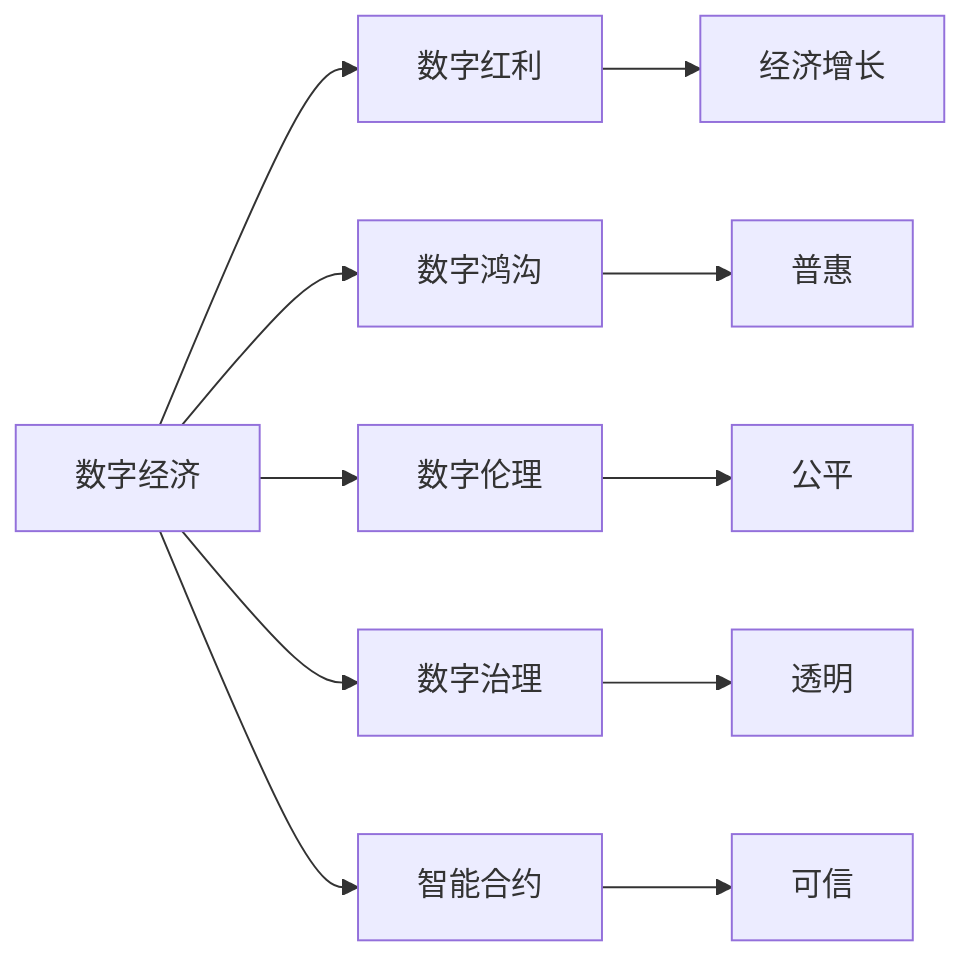

                 

# 2050年的数字经济：从数字红利到数字包容的经济增长新动能

## 1. 背景介绍

随着技术的不断进步，数字经济正在以前所未有的速度和规模重塑全球经济格局。2050年，数字技术将成为驱动经济增长的核心力量，数字红利将向数字包容转变，带来前所未有的机遇与挑战。本文将探讨这一转型期的关键要素，分析数字经济的未来趋势，并提出实现数字包容性的路径。

### 1.1 数字经济的兴起

数字经济的概念最早由美国商务部在2000年代初提出，用以描述信息技术在经济活动中的作用。其核心在于通过信息技术的广泛应用，促进经济增长，提高生产效率。随着移动互联网、大数据、云计算等技术的普及，数字经济逐步发展壮大。根据国际数据公司(IDC)的报告，2021年全球数字经济规模已达到45万亿美元，占全球GDP的62%。

### 1.2 数字经济的现状与挑战

尽管数字经济蓬勃发展，但也面临诸多挑战：
1. **数据隐私与安全**：数据泄露、网络攻击等问题频发，数据隐私保护刻不容缓。
2. **数字鸿沟**：不同国家和地区、不同社会群体的数字基础设施和技能差距显著。
3. **数字伦理**：数字技术在应用过程中可能引发伦理问题，如自动化导致就业冲击、算法偏见等。

## 2. 核心概念与联系

### 2.1 核心概念概述

为深入理解数字经济的演变和未来发展，本节将介绍几个核心概念：

- **数字经济**：基于信息技术的应用和创新，推动经济活动和产业结构转型的经济形态。
- **数字红利**：数字技术的应用带来的经济增长和生产效率提升。
- **数字包容性**：确保数字技术的应用惠及所有群体，减少数字鸿沟，实现公平与普惠。
- **数字治理**：政府、企业和公民共同参与的数字经济治理模式。
- **智能合约**：基于区块链技术的自动执行合约，具有高效、透明的特点。

### 2.2 核心概念之间的联系

通过以下Mermaid流程图，可以直观展示这些核心概念之间的联系：



这个流程图展示了数字经济与数字红利、数字鸿沟、数字伦理、数字治理和智能合约之间的相互影响。数字红利推动经济增长，但也会加剧数字鸿沟；数字治理和数字伦理有助于实现公平与透明，而智能合约的引入则提高了合约的执行效率和可信度。

## 3. 核心算法原理 & 具体操作步骤
### 3.1 算法原理概述

数字经济的核心在于信息技术的应用和创新，而算法则提供了实现这些应用的技术手段。以下是数字经济中常用的几种算法原理：

- **机器学习算法**：通过数据训练模型，实现自动化的决策与预测。如分类、回归、聚类等。
- **深度学习算法**：通过多层神经网络模型，处理复杂非线性关系。如卷积神经网络(CNN)、循环神经网络(RNN)、生成对抗网络(GAN)等。
- **自然语言处理(NLP)**：利用算法处理和理解人类语言，实现自动化的文本分析、情感分析、对话系统等。

### 3.2 算法步骤详解

以深度学习算法为例，以下是其一般步骤：

1. **数据收集与预处理**：收集相关数据，并进行清洗、标注等预处理。
2. **模型设计**：选择合适的模型架构，如CNN、RNN等，并设置超参数。
3. **模型训练**：利用训练集数据，通过反向传播算法更新模型参数，最小化损失函数。
4. **模型评估与优化**：在验证集和测试集上评估模型性能，通过调整超参数和模型结构进行优化。
5. **模型应用**：将训练好的模型应用到实际业务场景，如图像识别、语音识别、文本分析等。

### 3.3 算法优缺点

深度学习算法具有以下优点：
1. **高精度**：通过多层次的特征提取，可以实现高精度的预测和分类。
2. **自适应性强**：能够处理非线性关系和复杂数据，适用于多种应用场景。
3. **可扩展性强**：模型可以通过增加层次和节点进行扩展，提升性能。

但同时也存在一些缺点：
1. **计算复杂度高**：训练深度模型需要大量的计算资源，且训练时间长。
2. **过拟合风险**：模型容易过拟合，需要大量的标注数据和正则化技术。
3. **黑箱问题**：深度模型的决策过程难以解释，缺乏可解释性。

### 3.4 算法应用领域

深度学习算法在数字经济中得到了广泛应用，具体包括：

- **图像识别**：如图像分类、目标检测等。广泛应用于安防监控、医疗影像分析、自动驾驶等领域。
- **语音识别**：如语音识别、语音合成等。广泛应用于智能音箱、语音助手、电话客服等。
- **自然语言处理**：如文本分类、情感分析、机器翻译等。广泛应用于智能客服、智能写作、自动翻译等。
- **推荐系统**：如协同过滤、内容推荐等。广泛应用于电商、视频平台、社交媒体等。

## 4. 数学模型和公式 & 详细讲解 & 举例说明

### 4.1 数学模型构建

在数字经济中，数学模型是实现算法功能的基础。以下以图像分类为例，介绍常用的数学模型构建方法：

1. **数据集**：收集并标注一组图像数据，分为训练集和测试集。
2. **特征提取**：将图像转换为数字特征向量，如使用卷积神经网络提取特征。
3. **损失函数**：定义损失函数，如交叉熵损失，用于衡量模型预测与真实标签的差异。
4. **优化算法**：使用梯度下降算法，最小化损失函数，更新模型参数。

### 4.2 公式推导过程

以下以卷积神经网络(CNN)为例，推导其基本公式：

设输入图像大小为$I$，卷积核大小为$F$，步长为$S$，输出特征图大小为$O$，则卷积操作的公式为：

$$
o_{i,j,k} = \sum_{f=1}^{F} \sum_{n=0}^{I-F+1} \sum_{m=0}^{I-F+1} w_{f,n,m} i_{n,m} 
$$

其中，$w$为卷积核权重，$i$为输入图像，$o$为输出特征图。

### 4.3 案例分析与讲解

以图像分类任务为例，使用CNN模型进行训练和测试：

1. **训练集**：使用ImageNet数据集，对CNN模型进行训练。
2. **验证集**：在CIFAR-10数据集上进行验证，调整超参数，防止过拟合。
3. **测试集**：在测试集上评估模型性能，如准确率、精度等。

## 5. 项目实践：代码实例和详细解释说明
### 5.1 开发环境搭建

以下是使用PyTorch搭建深度学习模型的环境配置：

1. **安装Anaconda**：从官网下载并安装Anaconda。
2. **创建虚拟环境**：
```bash
conda create -n deep_learning python=3.7
conda activate deep_learning
```

3. **安装PyTorch**：
```bash
pip install torch torchvision torchaudio
```

4. **安装TensorBoard**：用于可视化训练过程。
```bash
pip install tensorboard
```

5. **安装其他工具**：
```bash
pip install numpy pandas matplotlib scikit-learn
```

### 5.2 源代码详细实现

以下是使用PyTorch进行图像分类的代码实现：

```python
import torch
import torchvision
import torch.nn as nn
import torch.optim as optim

# 加载数据集
train_dataset = torchvision.datasets.CIFAR10(root='data', train=True, download=True)
test_dataset = torchvision.datasets.CIFAR10(root='data', train=False, download=True)

# 数据预处理
transform = torchvision.transforms.Compose([
    torchvision.transforms.ToTensor(),
    torchvision.transforms.Normalize((0.5, 0.5, 0.5), (0.5, 0.5, 0.5))
])

train_dataset = torchvision.datasets.CIFAR10(root='data', train=True, transform=transform, download=True)
test_dataset = torchvision.datasets.CIFAR10(root='data', train=False, transform=transform, download=True)

# 加载模型和优化器
model = torchvision.models.resnet18()
criterion = nn.CrossEntropyLoss()
optimizer = optim.SGD(model.parameters(), lr=0.01, momentum=0.9)

# 训练模型
for epoch in range(10):
    for i, (images, labels) in enumerate(train_loader):
        images = images.to(device)
        labels = labels.to(device)

        optimizer.zero_grad()
        outputs = model(images)
        loss = criterion(outputs, labels)
        loss.backward()
        optimizer.step()

        if (i+1) % 100 == 0:
            print(f'Epoch {epoch+1}, Step {i+1}/{len(train_loader)}, Loss: {loss.item()}')

# 评估模型
correct = 0
total = 0
with torch.no_grad():
    for images, labels in test_loader:
        images = images.to(device)
        labels = labels.to(device)

        outputs = model(images)
        _, predicted = torch.max(outputs.data, 1)
        total += labels.size(0)
        correct += (predicted == labels).sum().item()

print(f'Accuracy: {(100 * correct / total)}%')
```

### 5.3 代码解读与分析

这段代码的核心功能是使用PyTorch进行图像分类。主要步骤包括：

1. **数据集加载与预处理**：使用`torchvision.datasets.CIFAR10`加载CIFAR-10数据集，并进行预处理。
2. **模型选择与优化器设置**：选择预训练的ResNet18模型，设置交叉熵损失函数和随机梯度下降优化器。
3. **模型训练**：在训练集上进行多次迭代，更新模型参数，最小化损失函数。
4. **模型评估**：在测试集上进行评估，计算模型准确率。

## 6. 实际应用场景
### 6.1 智能制造

智能制造是大数据、云计算、物联网等技术与制造业深度融合的产物，通过数字化转型提升生产效率和产品质量。智能制造中，深度学习算法被广泛应用，如预测设备故障、优化生产计划、质量控制等。

### 6.2 智慧农业

智慧农业利用数字技术优化农业生产过程，提高资源利用效率和产量。深度学习算法在智慧农业中用于图像识别、数据分析、预测模型等。

### 6.3 个性化推荐

个性化推荐系统根据用户行为和偏好，推荐符合其兴趣的产品或内容。深度学习算法在推荐系统中用于用户行为分析、物品特征提取、推荐模型训练等。

### 6.4 未来应用展望

未来，数字经济将进一步向智能化、普惠化方向发展。主要趋势包括：

1. **人工智能与物理融合**：通过物联网技术，将人工智能与物理世界深度融合，实现智能感知与决策。
2. **边缘计算**：在数据产生的地方进行计算，减少数据传输和存储需求，提升实时性。
3. **区块链**：构建安全、透明、可追溯的数字生态系统，提升数据可信度。
4. **数字治理**：构建多主体参与的数字治理体系，确保数字技术应用的安全与公平。

## 7. 工具和资源推荐
### 7.1 学习资源推荐

- **深度学习框架**：PyTorch、TensorFlow、Keras等，提供丰富的算法实现和模型库。
- **数据集**：Kaggle、UCI机器学习库等，提供大量训练数据。
- **在线课程**：Coursera、edX等平台上的机器学习和深度学习课程。

### 7.2 开发工具推荐

- **PyTorch**：高效的深度学习框架，提供自动微分和动态计算图功能。
- **TensorBoard**：用于可视化训练过程，帮助调试模型。
- **Jupyter Notebook**：支持多种语言和库，适合数据探索和模型实验。

### 7.3 相关论文推荐

- **深度学习基础**：《深度学习》，Ian Goodfellow等著。
- **强化学习**：《强化学习：基础与技术》，Richard Sutton等著。
- **自然语言处理**：《自然语言处理综论》，Daniel Jurafsky等著。

## 8. 总结：未来发展趋势与挑战
### 8.1 研究成果总结

数字经济已经成为推动全球经济增长的重要力量。基于深度学习、自然语言处理等技术的不断进步，数字经济在各个领域得到了广泛应用，并带来了巨大的经济和社会效益。

### 8.2 未来发展趋势

1. **跨界融合**：数字技术与各个行业深度融合，提升产业智能化水平。
2. **技术突破**：如量子计算、边缘计算等新技术将进一步推动数字经济的发展。
3. **普惠化发展**：数字技术逐步普及，惠及更多国家和地区，实现数字包容。

### 8.3 面临的挑战

1. **数据隐私与安全**：如何保护数据隐私，防止数据泄露和滥用。
2. **数字鸿沟**：不同地区和社会群体之间的数字差距，如何缩小。
3. **算法公平性**：如何防止算法偏见，确保公平与公正。

### 8.4 研究展望

未来的研究重点在于：
1. **安全与隐私保护**：研发更安全、更透明的算法，保护用户隐私。
2. **普惠性技术**：通过技术手段，缩小数字鸿沟，实现普惠性发展。
3. **伦理与治理**：构建多主体参与的数字治理体系，确保技术应用的安全与公平。

## 9. 附录：常见问题与解答

**Q1: 什么是数字经济？**

A: 数字经济是基于信息技术的应用和创新，推动经济活动和产业结构转型的经济形态。其核心在于数字化和智能化，通过信息技术的广泛应用，提升生产效率和经济效益。

**Q2: 深度学习算法的优缺点是什么？**

A: 深度学习算法具有高精度、自适应性强、可扩展性好的优点，但同时计算复杂度高、过拟合风险大、缺乏可解释性。

**Q3: 如何构建智慧农业系统？**

A: 智慧农业系统通过数据收集、传感器监测、模型训练等技术手段，实现农业生产的智能化管理。具体步骤包括：
1. 收集土壤、气象、作物等数据。
2. 利用传感器监测实时数据，如温度、湿度、土壤湿度等。
3. 建立农业模型，如作物生长预测、病虫害识别等。
4. 通过深度学习算法，优化农业生产方案。

---

作者：禅与计算机程序设计艺术 / Zen and the Art of Computer Programming

